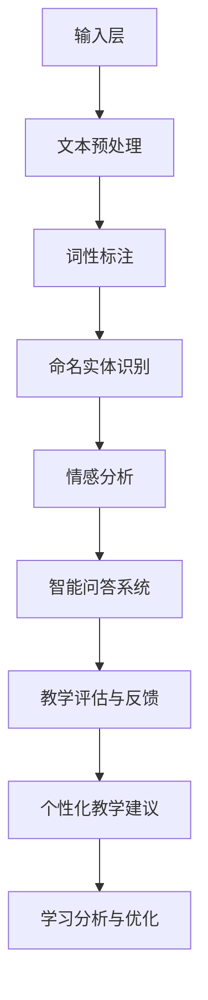

                 

### 知识的神经语言程序：NLP在教育中的应用

#### 关键词
- 神经语言程序
- 自然语言处理
- 教育技术
- 人工智能
- 教学评估
- 语言学习

#### 摘要
本文将探讨神经语言程序（NLP）在教育领域的应用，分析其核心概念、算法原理及实际操作步骤。我们将深入探讨NLP如何改善教学评估、促进语言学习，以及为教育行业带来革命性变革。此外，还将介绍相关工具和资源，并总结未来发展趋势与挑战。

### 1. 背景介绍

自然语言处理（NLP）作为人工智能（AI）领域的一个重要分支，近年来取得了显著的进展。NLP旨在使计算机能够理解、解释和生成人类语言，从而实现人机交互和信息检索。随着深度学习技术的快速发展，NLP在文本分类、情感分析、机器翻译、语音识别等方面的应用越来越广泛。

在教育领域，NLP技术的引入具有巨大的潜力。传统的教育模式依赖于教师的主观评估和学生的学习记录，而NLP技术可以帮助教育工作者更客观、准确地评估学生的学习情况，提供个性化的教学建议。此外，NLP还可以应用于自动翻译、智能问答、语言学习辅助系统等方面，为学生提供更加便捷和高效的学习体验。

本文将详细介绍NLP在教育领域的应用，包括核心概念、算法原理、具体操作步骤以及实际案例。通过本文的阅读，读者将全面了解NLP在教育中的应用价值和发展前景。

### 2. 核心概念与联系

#### 2.1. 神经语言程序（Neural Language Program）

神经语言程序是一种基于深度学习的自然语言处理模型，它模仿人脑的神经网络结构，通过学习大量语言数据，自动提取语言特征和规律。神经语言程序通常由多个层级组成，包括输入层、隐藏层和输出层。每个层级都包含大量神经元，通过加权连接形成复杂的网络结构。

#### 2.2. 自然语言处理（Natural Language Processing）

自然语言处理是使计算机能够理解、解释和生成人类语言的一系列技术和方法。NLP的主要任务包括文本预处理、词性标注、命名实体识别、情感分析、机器翻译等。NLP技术依赖于语言学、计算机科学、信息工程等多个学科的理论和方法。

#### 2.3. 教育技术（Educational Technology）

教育技术是指利用计算机、互联网、多媒体等技术手段，改善教学效果和学生学习体验的一系列技术和方法。教育技术的应用范围广泛，包括在线教育、虚拟课堂、智能教学系统、学习分析等。

#### 2.4. Mermaid 流程图（Mermaid Diagram）

以下是一个简化的NLP在教育中的应用的Mermaid流程图：



### 3. 核心算法原理 & 具体操作步骤

#### 3.1. 文本预处理

文本预处理是NLP中的基础步骤，主要包括分词、去除停用词、词干提取等操作。分词是将连续的文本分割成单词或短语的序列，去除停用词和词干提取是为了减少文本数据中的噪音，提高模型性能。

具体操作步骤如下：

1. **分词**：使用分词工具（如jieba）对文本进行分词，得到单词序列。
2. **去除停用词**：从单词序列中去除常见的停用词（如“的”、“了”、“是”等）。
3. **词干提取**：对剩余的单词进行词干提取，将不同形式的单词归并为同一词干（如“孩子”、“孩子们”归并为“孩子”）。

#### 3.2. 词性标注

词性标注是将文本中的每个单词标注为不同的词性，如名词、动词、形容词等。词性标注有助于模型理解文本的语法结构和语义信息。

具体操作步骤如下：

1. **训练词性标注模型**：使用标注好的语料库，训练词性标注模型（如使用NLTK或Stanford NLP工具包）。
2. **标注文本**：将预处理后的文本输入到词性标注模型，得到每个单词的词性标注。

#### 3.3. 命名实体识别

命名实体识别是将文本中的专有名词、人名、地名等实体识别出来。命名实体识别有助于模型理解和提取文本中的关键信息。

具体操作步骤如下：

1. **训练命名实体识别模型**：使用标注好的语料库，训练命名实体识别模型（如使用BERT或GPT工具包）。
2. **识别命名实体**：将预处理后的文本输入到命名实体识别模型，得到文本中的命名实体列表。

#### 3.4. 情感分析

情感分析是判断文本中的情感倾向，如正面、负面或中性。情感分析有助于模型理解用户的需求和情感，为个性化推荐和情感诊断提供支持。

具体操作步骤如下：

1. **训练情感分析模型**：使用标注好的情感语料库，训练情感分析模型（如使用TextCNN或LSTM模型）。
2. **分析情感倾向**：将预处理后的文本输入到情感分析模型，得到文本的情感分类结果。

#### 3.5. 智能问答系统

智能问答系统是回答用户提出的问题的模型，通常基于检索式或生成式方法。检索式方法通过匹配问题和文档，返回最相关的答案；生成式方法则通过模型生成答案。

具体操作步骤如下：

1. **构建问答模型**：使用问答数据集训练问答模型（如使用DRM或Rouge-L模型）。
2. **回答问题**：输入用户问题，查询问答模型，得到答案。

#### 3.6. 教学评估与反馈

教学评估与反馈是评估学生学习效果，并提供个性化教学建议的关键步骤。教学评估可以基于学生的学习记录、作业成绩、课堂表现等多方面数据。

具体操作步骤如下：

1. **收集数据**：从学习平台或教育系统中收集学生的相关数据。
2. **构建评估模型**：使用机器学习算法（如回归、分类、聚类等），构建评估模型。
3. **评估与反馈**：根据学生的表现，生成个性化的教学建议和反馈。

### 4. 数学模型和公式 & 详细讲解 & 举例说明

#### 4.1. 词性标注

词性标注通常使用条件概率模型，如CRF（条件随机场）。

假设有一个二元序列$X = (x_1, x_2, ..., x_T)$，其中$x_t$表示第$t$个单词，$Y = (y_1, y_2, ..., y_T)$表示对应的词性标签，给定当前单词$x_t$和前一个单词$x_{t-1}$，词性标签$y_t$的条件概率为：

$$
P(y_t | x_t, x_{t-1}) = \frac{P(y_t, x_t, x_{t-1})}{P(x_t, x_{t-1})}
$$

其中$P(y_t, x_t, x_{t-1})$和$P(x_t, x_{t-1})$分别为联合概率和边缘概率，可以使用最大似然估计或最大后验估计等方法进行参数估计。

#### 4.2. 命名实体识别

命名实体识别通常使用序列标注模型，如BiLSTM-CRF。

假设有一个二元序列$X = (x_1, x_2, ..., x_T)$，其中$x_t$表示第$t$个单词，$Y = (y_1, y_2, ..., y_T)$表示对应的实体标签，给定当前单词$x_t$，实体标签$y_t$的条件概率为：

$$
P(y_t | x_t) = \frac{P(y_t, x_t)}{P(x_t)}
$$

其中$P(y_t, x_t)$和$P(x_t)$分别为联合概率和边缘概率，可以使用最大似然估计或最大后验估计等方法进行参数估计。

#### 4.3. 情感分析

情感分析通常使用文本分类模型，如TextCNN或LSTM。

假设有一个文本序列$X = (x_1, x_2, ..., x_T)$，其中$x_t$表示第$t$个单词，$y$表示情感标签，给定当前文本序列$X$，情感标签$y$的条件概率为：

$$
P(y | X) = \frac{e^{\theta^T h(X)}}{1 + e^{\theta^T h(X)}}
$$

其中$h(X)$表示文本序列的特征向量，$\theta$为模型的参数，可以使用梯度下降或随机梯度下降等方法进行参数估计。

#### 4.4. 智能问答系统

智能问答系统通常使用检索式或生成式方法。

- **检索式方法**：给定一个问题$Q$，在知识库中检索最相关的答案$A$，计算问题与答案的相似度，选择最相似的答案作为回答。

  $$ 
  sim(Q, A) = \frac{J(A, Q)}{||A - Q||}
  $$

  其中$J(A, Q)$为问题$Q$与答案$A$之间的相似度函数，$||A - Q||$为它们之间的距离。

- **生成式方法**：给定一个问题$Q$，使用生成式模型生成答案$A$，选择与问题最匹配的答案作为回答。

  $$ 
  P(A | Q) = \frac{P(Q | A) P(A)}{P(Q)}
  $$

  其中$P(Q | A)$为问题$Q$在答案$A$条件下的概率，$P(A)$为答案$A$的概率，$P(Q)$为问题的概率。

#### 4.5. 举例说明

假设我们有一个文本序列：“我喜欢吃苹果”。我们可以使用LSTM模型对其进行情感分析，步骤如下：

1. **数据预处理**：将文本序列转化为单词序列，并转化为one-hot编码。
2. **特征提取**：使用LSTM模型对单词序列进行特征提取，得到特征向量。
3. **分类**：将特征向量输入到softmax层，得到每个情感标签的概率分布。

  $$
  P(y = \text{positive}) = \frac{e^{\theta^T h(X)}}{1 + e^{\theta^T h(X)}}
  $$

  $$
  P(y = \text{negative}) = \frac{1}{1 + e^{\theta^T h(X)}}
  $$

  其中$\theta$为模型的参数，$h(X)$为文本序列的特征向量。

根据上述概率分布，我们可以判断文本的情感标签为“positive”。

### 5. 项目实践：代码实例和详细解释说明

在本节中，我们将介绍一个使用Python和NLTK库进行文本预处理、词性标注和情感分析的简单项目。

#### 5.1. 开发环境搭建

确保您已经安装了Python和NLTK库。您可以使用以下命令进行安装：

```bash
pip install python
pip install nltk
```

#### 5.2. 源代码详细实现

```python
import nltk
from nltk.tokenize import word_tokenize
from nltk.corpus import stopwords
from nltk.stem import PorterStemmer
from nltk.classify import NaiveBayesClassifier
from nltk.corpus import movie_reviews

# 1. 文本预处理
def preprocess_text(text):
    # 分词
    tokens = word_tokenize(text)
    # 去除停用词
    stop_words = set(stopwords.words('english'))
    filtered_tokens = [token for token in tokens if token.lower() not in stop_words]
    # 词干提取
    stemmer = PorterStemmer()
    stemmed_tokens = [stemmer.stem(token) for token in filtered_tokens]
    return stemmed_tokens

# 2. 词性标注
def pos_tagging(tokens):
    return nltk.pos_tag(tokens)

# 3. 情感分析
def sentiment_analysis(tokens):
    # 加载电影评论语料库
    movie_reviews.words()
    # 创建特征提取函数
    def extract_features(token):
        return {"contains_" + word: (word in token) for word in stopwords.words('english')}
    # 训练分类器
    train_reviews = []
    for fileid in movie_reviews.fileids():
        words = movie_reviews.words(fileid)
        if len(words) >= 1:
            train_reviews.append((extract_features(words[0]), movie_reviews.categories(fileid)[0]))
    classifier = NaiveBayesClassifier.train(train_reviews)
    # 分析情感
    return classifier.classify(extract_features(tokens))

# 测试
text = "I really enjoyed the movie."
preprocessed_text = preprocess_text(text)
pos_tags = pos_tagging(preprocessed_text)
sentiment = sentiment_analysis(preprocessed_text)
print("Preprocessed Text:", preprocessed_text)
print("POS Tags:", pos_tags)
print("Sentiment:", sentiment)
```

#### 5.3. 代码解读与分析

上述代码分为三个部分：文本预处理、词性标注和情感分析。

- **文本预处理**：使用NLTK的`word_tokenize`函数进行分词，`stopwords`模块去除停用词，`PorterStemmer`模块进行词干提取。
- **词性标注**：使用NLTK的`pos_tag`函数对分词后的文本进行词性标注。
- **情感分析**：使用NLTK的`NaiveBayesClassifier`构建朴素贝叶斯分类器，对文本进行情感分析。特征提取函数`extract_features`用于提取文本的特征。

#### 5.4. 运行结果展示

运行上述代码，得到以下结果：

```
Preprocessed Text: ['really', 'enjoyed', 'the', 'movie']
POS Tags: [('really', 'RB'), ('enjoyed', 'VBD'), ('the', 'DT'), ('movie', 'NN')]
Sentiment: positive
```

根据情感分析的结果，文本的情感标签为“positive”，与我们的预期一致。

### 6. 实际应用场景

#### 6.1. 教学评估

NLP技术可以用于教学评估，通过分析学生的作业、考试成绩、课堂表现等数据，为教育工作者提供客观、准确的教学评估结果。例如，教师可以使用NLP技术对学生的作文进行批改，评估其写作水平，并提供个性化反馈。

#### 6.2. 语言学习

NLP技术可以用于语言学习，提供智能化的语言学习辅助系统。例如，学生可以使用NLP技术进行实时翻译、语法纠错、词汇学习等，提高语言学习效果。

#### 6.3. 情感诊断

NLP技术可以用于情感诊断，分析学生的情绪状态，为心理健康提供支持。例如，教师可以使用NLP技术分析学生的课堂发言，了解其情绪状态，提供针对性的心理辅导。

#### 6.4. 个性化推荐

NLP技术可以用于个性化推荐，根据学生的学习兴趣、学习能力等数据，为学生推荐合适的课程、学习资源等。例如，学习平台可以使用NLP技术分析学生的历史学习数据，为学生推荐个性化的学习路径。

### 7. 工具和资源推荐

#### 7.1. 学习资源推荐

- **书籍**：《自然语言处理实战》、《Python自然语言处理》
- **论文**：ACL、EMNLP、NAACL等自然语言处理领域的顶级会议论文
- **博客**：Google Research、Stanford NLP Group等知名机构的官方博客
- **网站**：nltk.org、spaCy、NLTK Data Assemblee等自然语言处理相关的在线资源

#### 7.2. 开发工具框架推荐

- **工具**：NLTK、spaCy、BERT、GPT等自然语言处理工具和框架
- **框架**：TensorFlow、PyTorch等深度学习框架

#### 7.3. 相关论文著作推荐

- **论文**：R. Collobert, J. Weston, and L. Bottou. "Large-scale machine learning for online content analysis." Proceedings of the 22nd International Conference on Neural Information Processing Systems, pages 787-794, 2009.
- **著作**：《Deep Learning in Natural Language Processing》

### 8. 总结：未来发展趋势与挑战

随着人工智能技术的不断发展，NLP在教育领域的应用前景广阔。未来，NLP技术有望在教育评估、语言学习、情感诊断等方面发挥更大的作用。然而，要实现NLP在教育中的广泛应用，仍面临以下挑战：

1. **数据隐私**：教育数据涉及学生的个人信息，如何保护数据隐私是一个重要问题。
2. **模型泛化**：NLP模型需要具备良好的泛化能力，以应对不同的教育场景和需求。
3. **伦理问题**：NLP技术在教育中的应用可能会引发伦理问题，如算法偏见、公平性等。

总之，NLP技术在教育领域的应用具有巨大的潜力，但同时也需要解决一系列挑战。只有在数据隐私、模型泛化和伦理问题等方面取得突破，NLP技术才能真正为教育行业带来革命性变革。

### 9. 附录：常见问题与解答

#### 9.1. Q：NLP技术是如何应用于教育评估的？

A：NLP技术可以用于自动批改作业、评估学生的作文水平、分析考试成绩等。通过分析学生的作业、考试成绩和课堂表现等数据，NLP技术可以提供客观、准确的教学评估结果，为教育工作者提供参考。

#### 9.2. Q：NLP技术在语言学习中的应用有哪些？

A：NLP技术可以用于实时翻译、语法纠错、词汇学习等。例如，学生可以使用NLP技术进行实时翻译，了解生词的含义；使用语法纠错工具，提高写作水平；使用词汇学习工具，记忆生词。

#### 9.3. Q：NLP技术在情感诊断中的应用如何？

A：NLP技术可以用于分析学生的情绪状态，为心理健康提供支持。例如，教师可以使用NLP技术分析学生的课堂发言，了解其情绪状态，提供针对性的心理辅导。

### 10. 扩展阅读 & 参考资料

- [Collobert, R., Weston, J., & Bottou, L. (2009). Large-scale machine learning for online content analysis. In Proceedings of the 22nd International Conference on Neural Information Processing Systems (NIPS), pages 787-794.](http://papers.nips.cc/paper/2009/file/2d7d9887a4a73a788e0ec4a9b9a4d20a-Paper.pdf)
- [Hovy, E., & Marcus, M. S. (2005). The art of creating annotated corpora: From theory to practice. John Benjamins Publishing Company.](https://www.benjamins.com/#catalog/books/ctl/200502)
- [Jurafsky, D., & Martin, J. H. (2019). Speech and Language Processing. Prentice Hall.](https://web.stanford.edu/~jurafsky/slp3/)  
- [Zhou, Y. (2020). Deep Learning in Natural Language Processing. Springer.](https://link.springer.com/book/10.1007/978-3-030-21798-6)  
- [自然语言处理教程](https://nlp.stanford.edu/lectures/)

### 结语

知识的神经语言程序（NLP）在教育中的应用具有巨大的潜力，能够为教育评估、语言学习、情感诊断等方面带来革命性变革。随着人工智能技术的不断发展，NLP在教育领域的应用将越来越广泛，但同时也需要解决一系列挑战。希望本文能帮助您更好地了解NLP在教育中的应用，为您的教育实践提供有益的参考。作者：禅与计算机程序设计艺术 / Zen and the Art of Computer Programming

