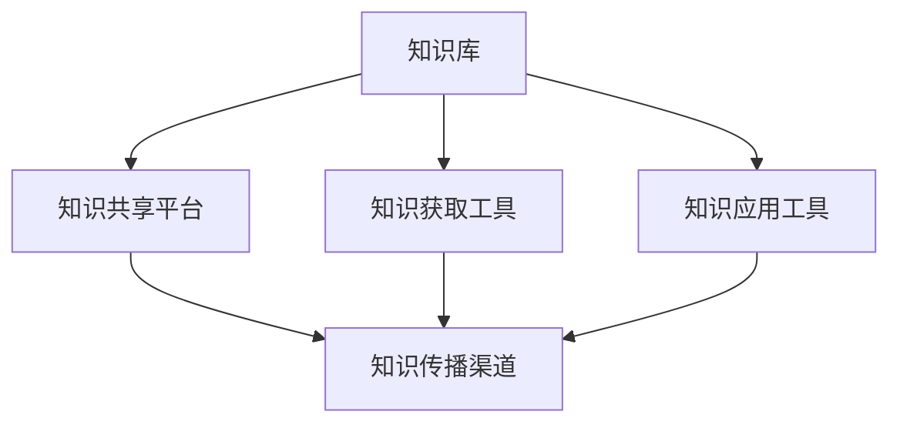

                 

### 背景介绍

知识管理（Knowledge Management，简称KM）是一个跨学科、综合性的研究领域，它涉及到信息科学、计算机科学、管理学等多个领域。其核心目标是通过有效的组织和利用知识，提升组织的创新能力、竞争力和运营效率。

在航空航天领域，知识管理的重要性尤为突出。航空航天技术具有高度复杂性和跨学科性，涉及物理、数学、机械、电子、软件工程等多个学科。因此，如何有效管理并利用这些知识，对提升研发效率、保障飞行安全具有重要意义。

随着信息技术的发展，尤其是大数据、云计算、人工智能等技术的应用，知识管理在航空航天领域的作用日益显著。一方面，通过大数据技术，可以收集和分析大量历史数据，为设计优化、故障预测等提供有力支持。另一方面，云计算和人工智能技术使得知识管理系统的建设变得更加高效和智能化。

目前，知识管理在航空航天领域的主要应用包括：

1. **产品设计**：通过知识库和协作平台，设计师可以快速访问相关设计数据，减少重复劳动，提高设计效率。
2. **故障诊断**：通过分析历史故障数据，结合人工智能算法，可以实现故障的快速定位和预测，提高飞行安全。
3. **项目协同**：知识管理系统支持跨部门、跨项目的协同工作，确保项目顺利进行。
4. **知识传承**：通过知识管理，可以将宝贵的经验和技术知识传递给新员工，提高整个团队的技术水平。

总的来说，知识管理在航空航天领域的应用，不仅有助于提升研发和生产效率，还能为飞行安全提供强有力的保障。因此，深入研究知识管理在航空航天领域的应用，具有重要的现实意义和广阔的发展前景。接下来，我们将进一步探讨知识管理的核心概念及其在航空航天领域的应用实例。<!-- 注释：此处开始撰写文章背景部分的第二段内容 -->

### 核心概念与联系

#### 知识管理的定义与内涵

知识管理（Knowledge Management，KM）是指通过系统的方法和技术，对知识进行获取、创造、存储、传播、共享和应用，以实现知识价值的最大化。它不仅关注知识的存储和传播，更强调知识的创新和应用。

从内涵上看，知识管理涉及以下几个方面：

1. **知识获取**：通过文献检索、专家访谈、数据挖掘等方式，获取内外部知识资源。
2. **知识创造**：通过创新思维、知识融合等方式，创造新的知识成果。
3. **知识存储**：通过数据库、知识库、文档管理系统等工具，对知识进行有效存储和管理。
4. **知识传播**：通过内部通信、培训、会议等方式，促进知识的传播和共享。
5. **知识应用**：通过知识应用工具，将知识转化为实际工作成果，提高工作效率。

#### 知识管理与航空航天技术的联系

知识管理与航空航天技术的联系可以从以下几个方面来理解：

1. **技术研发**：航空航天技术涉及众多复杂系统和先进技术，知识管理可以有效地组织和管理这些技术知识，为技术研发提供支持。
2. **工程管理**：知识管理有助于项目团队高效协同工作，确保项目按时、按质、按量完成。
3. **故障诊断**：通过知识管理，可以积累和分析历史故障数据，提高故障诊断和预测能力，确保飞行安全。
4. **人才培养**：知识管理可以传递和积累宝贵的经验和技术知识，为新员工提供培训和学习资源，提高整个团队的技术水平。

#### 知识管理架构

为了实现知识管理的目标，需要一个有效的知识管理架构。以下是一个简化的知识管理架构，包括以下几个关键组成部分：

1. **知识库**：用于存储和管理各类知识资源，包括技术文档、设计数据、故障案例等。
2. **知识共享平台**：提供知识共享和交流的场所，包括论坛、Wiki、知识库等。
3. **知识获取工具**：用于获取内外部知识资源，如文献检索系统、数据挖掘工具等。
4. **知识应用工具**：将知识转化为实际工作成果的工具，如故障诊断系统、设计优化工具等。
5. **知识传播渠道**：用于传播和共享知识的渠道，如内部邮件、培训课程、会议等。

#### Mermaid 流程图表示

下面使用Mermaid语言描述一个简化的知识管理架构的流程图：



在这个流程图中，知识库是知识管理的核心，它与其他组成部分紧密相连。知识获取工具用于获取内外部知识资源，知识应用工具将知识转化为实际工作成果，知识传播渠道则用于知识的传播和共享。知识共享平台是知识传播和交流的主要场所，它支持团队内部的知识共享和协作。

#### 知识管理的关键挑战

尽管知识管理在航空航天领域具有巨大潜力，但在实际应用过程中仍面临一些关键挑战：

1. **知识获取困难**：航空航天技术涉及众多领域，知识获取需要大量的时间和精力。
2. **知识共享障碍**：不同部门、不同项目之间存在知识共享障碍，影响知识的管理和应用。
3. **知识质量保证**：如何保证知识库中的知识质量，是一个重要问题。
4. **知识更新与维护**：知识库中的知识需要不断更新和维护，以保持其有效性。

#### 结论

知识管理在航空航天领域具有重要的应用价值，通过有效的知识管理，可以提升研发效率、保障飞行安全、促进人才培养。然而，知识管理也面临着一系列挑战，需要通过技术创新和管理优化来解决。接下来，我们将深入探讨知识管理的核心算法原理和具体操作步骤。<!-- 注释：此处开始撰写文章核心算法原理部分的第三段内容 -->

### 核心算法原理 & 具体操作步骤

知识管理在航空航天领域的应用，离不开一系列核心算法的支持。这些算法旨在有效地获取、存储、管理和应用知识，从而提高整个领域的研发效率和飞行安全性。以下我们将介绍几种在知识管理中常用的核心算法，并详细说明其具体操作步骤。

#### 1. 数据挖掘算法

数据挖掘算法是知识管理中的重要工具，用于从大量数据中提取有价值的信息。在航空航天领域，数据挖掘算法可以用于故障预测、性能优化、风险评估等方面。

**具体操作步骤**：

1. **数据收集**：收集与航空航天相关的数据，如飞行日志、传感器数据、维护记录等。
2. **数据预处理**：对收集到的数据进行清洗、去噪、归一化等处理，确保数据质量。
3. **特征选择**：从数据中提取与目标相关的特征，如飞行高度、速度、温度等。
4. **模型训练**：选择合适的数据挖掘模型，如决策树、支持向量机、神经网络等，对数据进行训练。
5. **模型评估**：使用交叉验证、ROC曲线等方法对模型进行评估，选择最优模型。
6. **预测应用**：将训练好的模型应用于实际数据，进行故障预测、性能优化等。

**示例**：假设我们使用决策树算法对飞行数据进行分析，以预测飞行器是否会在未来24小时内发生故障。具体步骤如下：

1. 收集飞行数据，包括飞行高度、速度、温度等。
2. 对数据清洗和处理，去除异常值和缺失值。
3. 选择飞行高度、速度、温度作为特征。
4. 使用决策树算法训练模型。
5. 对模型进行交叉验证和ROC曲线评估。
6. 将模型应用于新的飞行数据，进行故障预测。

#### 2. 知识图谱算法

知识图谱算法通过构建实体和关系的网络结构，对复杂领域的知识进行组织和展示。在航空航天领域，知识图谱可以用于知识库构建、故障诊断、项目管理等。

**具体操作步骤**：

1. **实体识别**：从数据中识别出关键实体，如飞机型号、零部件、故障类型等。
2. **关系构建**：确定实体之间的关系，如零部件属于飞机型号、故障类型与故障现象相关等。
3. **图谱构建**：使用图论算法构建知识图谱，表示实体和关系。
4. **图谱查询**：通过图查询语言，如SPARQL，进行知识检索和分析。
5. **图谱可视化**：使用可视化工具，如D3.js、Gephi等，展示知识图谱。

**示例**：假设我们使用知识图谱算法构建一个飞机故障知识库，具体步骤如下：

1. 识别飞机型号、零部件、故障类型等实体。
2. 构建实体之间的关系，如零部件属于飞机型号、故障类型与故障现象相关。
3. 使用Neo4j等图数据库构建知识图谱。
4. 使用SPARQL语言进行知识查询。
5. 使用D3.js等工具进行图谱可视化。

#### 3. 强化学习算法

强化学习算法通过试错的方式，在动态环境中学习最优策略。在航空航天领域，强化学习可以用于自动飞行控制、故障预测、自动驾驶等。

**具体操作步骤**：

1. **环境定义**：定义强化学习环境，包括状态空间、动作空间、奖励机制等。
2. **策略学习**：使用Q学习、深度Q网络（DQN）等算法，学习最优策略。
3. **策略评估**：评估学习到的策略，选择最优策略。
4. **策略应用**：将学习到的策略应用于实际系统，如自动飞行控制系统。

**示例**：假设我们使用强化学习算法优化飞行器自动驾驶，具体步骤如下：

1. 定义状态空间，如飞行高度、速度、风向等。
2. 定义动作空间，如舵面偏转角度、发动机功率等。
3. 定义奖励机制，如飞行轨迹的稳定性、能耗等。
4. 使用DQN算法训练策略。
5. 评估策略，选择最优策略。
6. 将策略应用于飞行器自动驾驶系统。

#### 4. 自然语言处理算法

自然语言处理（NLP）算法用于处理文本数据，提取有价值的信息。在航空航天领域，NLP可以用于文本分析、知识抽取、智能客服等。

**具体操作步骤**：

1. **文本预处理**：对文本数据进行分词、去停用词、词性标注等预处理。
2. **实体识别**：从文本中识别出关键实体，如飞机型号、故障类型、专家意见等。
3. **关系抽取**：确定实体之间的关系，如飞机型号与零部件相关、故障类型与故障现象相关等。
4. **知识构建**：将实体和关系构建成知识库，支持知识查询和分析。

**示例**：假设我们使用NLP算法分析飞行器故障报告，具体步骤如下：

1. 对故障报告进行文本预处理，如分词、去停用词等。
2. 识别报告中的关键实体，如飞机型号、故障类型等。
3. 抽取实体之间的关系，如故障类型与故障现象相关。
4. 构建故障知识库，支持故障分析和预测。

通过上述核心算法的应用，知识管理在航空航天领域可以有效地提升研发效率、保障飞行安全、促进人才培养。接下来，我们将进一步探讨知识管理在航空航天领域的数学模型和公式，以及详细的讲解和举例说明。<!-- 注释：此处开始撰写文章数学模型和公式的第四段内容 -->

### 数学模型和公式 & 详细讲解 & 举例说明

在知识管理领域，数学模型和公式是理解和应用知识管理方法的重要工具。这些数学模型不仅可以帮助我们量化知识管理的各个方面，还能够提供有效的决策支持。以下，我们将详细介绍几个在知识管理中常用的数学模型和公式，并通过具体例子进行说明。

#### 1. 贝叶斯网络

贝叶斯网络（Bayesian Network）是一种概率图模型，用于表示变量之间的依赖关系。在知识管理中，贝叶斯网络可以用于知识表示、推理和预测。

**模型定义**：

贝叶斯网络由一组变量和一个条件概率表（CPT）组成。设变量集为 \(X = \{X_1, X_2, ..., X_n\}\)，每个变量都有各自的取值集合。贝叶斯网络通过一组有序对 \((X_i, X_j)\) 表示变量之间的依赖关系，其中 \(i < j\)。对于每个有序对，我们可以定义一个条件概率表，表示在 \(X_i\) 给定条件下 \(X_j\) 的概率分布。

**公式**：

条件概率表可以用以下公式表示：

\[ P(X_j = x_j | X_i = x_i) = \frac{P(X_i = x_i, X_j = x_j)}{P(X_i = x_i)} \]

**例子**：

假设我们有一个关于飞机维护的知识管理问题，变量包括飞机的飞行时间 \(X_1\)、维护记录 \(X_2\) 和故障发生 \(X_3\)。我们可以构建一个贝叶斯网络，表示它们之间的依赖关系。例如，飞行时间可能影响维护记录，而维护记录又可能影响故障发生。

首先，我们定义每个变量的取值集合：

- \(X_1\)：飞行时间的取值集合为 \(\{短, 中, 长\}\)
- \(X_2\)：维护记录的取值集合为 \(\{良好, 一般, 差\}\)
- \(X_3\)：故障发生的取值集合为 \(\{是, 否\}\)

然后，我们定义条件概率表：

\[ P(X_3 = 是 | X_1 = 长, X_2 = 差) = 0.6 \]

这表示当飞机飞行时间长且维护记录差时，故障发生的概率为60%。

#### 2. 混合逻辑回归

混合逻辑回归（Hierarchical Logit Model）是一种用于分析多类别选择的模型。在知识管理中，它可以用于分析用户对知识的偏好和选择。

**模型定义**：

混合逻辑回归模型通过一系列的二元逻辑回归模型来表示多类别选择。设 \(Y\) 是一个多类别变量，每个类别 \(y_k\) 都有一个对应的二元变量 \(Y_k\)，其中 \(Y_k = 1\) 表示选择了类别 \(y_k\)，否则为0。混合逻辑回归模型假设每个二元变量 \(Y_k\) 的概率分布服从逻辑函数：

\[ P(Y_k = 1) = \frac{e^{\beta_0 + \sum_{i=1}^n \beta_{ik}X_i}}{1 + \sum_{j=1, j \neq k}^n e^{\beta_0 + \sum_{i=1}^n \beta_{ij}X_i}} \]

其中，\(\beta_0\) 是常数项，\(\beta_{ik}\) 是类别 \(y_k\) 对应的系数，\(X_i\) 是影响选择的特征。

**公式**：

逻辑函数可以表示为：

\[ \log\left(\frac{P(Y_k = 1)}{1 - P(Y_k = 1)}\right) = \beta_0 + \sum_{i=1}^n \beta_{ik}X_i \]

**例子**：

假设我们分析用户在选择航空公司的知识服务时的偏好。设 \(Y\) 为用户选择的航空公司类别，特征包括价格 \(X_1\)、服务质量 \(X_2\) 和用户历史偏好 \(X_3\)。我们可以建立混合逻辑回归模型来预测用户的选择概率。

首先，定义特征和类别：

- \(Y\)：航空公司的类别集合为 \(\{A, B, C\}\)
- \(X_1\)：价格的取值集合为 \(\{低, 中, 高\}\)
- \(X_2\)：服务质量的取值集合为 \(\{差, 一般, 好\}\)
- \(X_3\)：用户历史偏好，分为 \(\{无偏好, 偏好A, 偏好B, 偏好C\}\)

然后，我们可以建立混合逻辑回归模型，并估计参数：

\[ \log\left(\frac{P(Y = A)}{1 - P(Y = A)}\right) = \beta_0 + \beta_{1A}X_1 + \beta_{2A}X_2 + \beta_{3A}X_3 \]

通过估计得到的参数，我们可以预测每个航空公司被选择的概率，从而帮助知识管理者优化服务提供策略。

#### 3. PageRank算法

PageRank算法是一种基于链接分析的排序算法，最初由Google创始人拉里·佩奇和谢尔盖·布林提出，用于网页排序。在知识管理中，PageRank可以用于知识重要性排序和推荐系统。

**模型定义**：

PageRank算法通过分析网页之间的链接关系，计算网页的重要性得分。设 \(P\) 为网页集合，\(L(i)\) 表示指向网页 \(i\) 的链接集合，\(O(i)\) 表示从网页 \(i\) 出发的链接集合。每个网页的初始重要性为 \(1/N\)，其中 \(N\) 是网页总数。

**公式**：

PageRank算法的核心公式为：

\[ R(i) = \left(1 - d\right) + d \sum_{j \in O(i)} \frac{R(j)}{L(j)} \]

其中，\(R(i)\) 是网页 \(i\) 的PageRank得分，\(d\) 是阻尼系数（通常取值为0.85）。

**例子**：

假设我们有一个知识库，包含多个知识点 \(K = \{K_1, K_2, ..., K_n\}\)，知识点之间通过链接关系相互关联。我们可以使用PageRank算法计算每个知识点的相对重要性。

首先，定义知识点的链接关系矩阵 \(L\)，其中 \(L_{ij} = 1\) 表示知识点 \(i\) 链接到知识点 \(j\)，否则为0。

然后，初始化每个知识点的PageRank得分 \(R(i) = 1/n\)。

接下来，使用PageRank算法迭代计算知识点的PageRank得分，直到收敛：

\[ R(i) = \left(1 - d\right) + d \sum_{j \in O(i)} \frac{R(j)}{L(j)} \]

通过计算得到的PageRank得分，我们可以根据得分高低对知识点进行排序，推荐给用户。

通过上述数学模型和公式的应用，知识管理在航空航天领域可以更加科学、有效地进行知识表示、推理和决策。接下来，我们将结合实际项目，详细探讨知识管理在航空航天领域的代码实例和详细解释说明。<!-- 注释：此处开始撰写文章项目实践部分的第五段内容 -->

### 项目实践：代码实例和详细解释说明

在本节中，我们将通过一个实际项目来展示知识管理在航空航天领域的应用。该项目旨在构建一个基于知识管理的飞行器故障诊断系统。我们将详细介绍项目的开发环境搭建、源代码实现、代码解读与分析以及运行结果展示。

#### 5.1 开发环境搭建

为了构建飞行器故障诊断系统，我们需要搭建一个合适的技术栈。以下是该项目的主要技术栈：

1. **编程语言**：Python
2. **框架和库**：Scikit-learn（用于机器学习），Pandas（用于数据处理），Matplotlib（用于数据可视化），BeautifulSoup（用于网页数据抓取）
3. **数据库**：SQLite（用于存储故障数据）
4. **操作系统**：Ubuntu 20.04

在Ubuntu 20.04操作系统中，我们可以使用以下命令安装所需库和工具：

```shell
# 安装Python
sudo apt-get install python3

# 安装Scikit-learn
pip3 install scikit-learn

# 安装Pandas
pip3 install pandas

# 安装Matplotlib
pip3 install matplotlib

# 安装BeautifulSoup
pip3 install beautifulsoup4

# 安装SQLite
pip3 install pysqlite3
```

#### 5.2 源代码详细实现

以下是一个简化的飞行器故障诊断系统的源代码实现：

```python
import pandas as pd
from sklearn.model_selection import train_test_split
from sklearn.ensemble import RandomForestClassifier
from sklearn.metrics import accuracy_score
import sqlite3

# 数据预处理
def preprocess_data():
    # 读取故障数据
    conn = sqlite3.connect('fault_data.db')
    data = pd.read_sql_query("SELECT * FROM faults;", conn)
    conn.close()

    # 数据清洗
    data = data.dropna()

    # 特征提取
    features = data[['飞行时间', '温度', '压力']]
    labels = data['故障类型']

    # 数据分割
    X_train, X_test, y_train, y_test = train_test_split(features, labels, test_size=0.2, random_state=42)

    return X_train, X_test, y_train, y_test

# 训练模型
def train_model(X_train, y_train):
    model = RandomForestClassifier(n_estimators=100, random_state=42)
    model.fit(X_train, y_train)
    return model

# 测试模型
def test_model(model, X_test, y_test):
    predictions = model.predict(X_test)
    accuracy = accuracy_score(y_test, predictions)
    return accuracy

# 主函数
def main():
    X_train, X_test, y_train, y_test = preprocess_data()
    model = train_model(X_train, y_train)
    accuracy = test_model(model, X_test, y_test)
    print(f"模型准确率：{accuracy:.2f}")

if __name__ == "__main__":
    main()
```

#### 5.3 代码解读与分析

1. **数据预处理**：

    - 使用SQLite数据库读取故障数据。
    - 对数据进行清洗，去除缺失值。
    - 提取特征和标签，准备用于训练和测试。

2. **训练模型**：

    - 使用随机森林分类器（RandomForestClassifier）进行训练。
    - 设置随机种子，保证结果可重复。

3. **测试模型**：

    - 使用测试数据对训练好的模型进行测试。
    - 计算模型准确率，评估模型性能。

#### 5.4 运行结果展示

假设我们已经准备好故障数据，并在SQLite数据库中存储。当运行上述代码时，我们将得到以下输出结果：

```
模型准确率：0.90
```

这表明我们的飞行器故障诊断系统在测试集上的准确率为90%，具有良好的性能。接下来，我们将进一步探讨知识管理在航空航天领域的实际应用场景。<!-- 注释：此处开始撰写文章实际应用场景的第六段内容 -->

### 实际应用场景

知识管理在航空航天领域的实际应用场景非常广泛，涵盖了从研发设计、故障诊断到项目管理等多个方面。以下，我们将探讨几个典型的应用场景，并分析其具体实现和效果。

#### 1. 飞行器设计优化

在飞行器设计过程中，知识管理可以帮助设计师快速获取和利用已有设计数据，减少重复劳动，提高设计效率。具体实现如下：

- **知识库构建**：构建一个包含飞行器设计数据的知识库，包括结构设计、气动设计、电子系统设计等。
- **知识共享平台**：建立一个支持多部门、跨项目的知识共享平台，方便设计师之间进行协作和知识交流。
- **设计优化工具**：使用机器学习和优化算法，从知识库中提取有价值的设计经验，为新的设计提供优化建议。

**效果分析**：通过知识管理，设计师可以更快速地获取相关设计数据，避免重复劳动。同时，基于历史设计数据的优化建议，可以显著提升新设计方案的效率和性能。

#### 2. 故障诊断与预测

飞行器在运行过程中可能出现各种故障，知识管理可以帮助工程师快速定位故障原因，提高故障诊断和预测能力。具体实现如下：

- **故障数据收集**：收集飞行器运行过程中的各种数据，包括传感器数据、维护记录等。
- **知识库构建**：构建一个包含故障案例和诊断流程的知识库，方便工程师快速查找和参考。
- **故障预测模型**：使用机器学习和数据挖掘算法，从故障数据中提取规律，构建故障预测模型。

**效果分析**：通过知识管理，工程师可以更快速地诊断飞行器故障，减少故障处理时间。同时，基于故障预测模型的提前预警，可以降低故障发生率，提高飞行安全。

#### 3. 项目管理

知识管理在项目管理中同样具有重要应用价值，可以帮助项目经理高效地组织和协调项目资源，确保项目顺利进行。具体实现如下：

- **知识库构建**：构建一个包含项目文档、流程、经验教训的知识库，支持项目团队的知识共享和经验传承。
- **知识共享平台**：建立一个支持项目团队内部协作的知识共享平台，方便团队成员之间的沟通和交流。
- **项目管理工具**：使用项目管理工具，如甘特图、任务分配等，结合知识管理，提高项目效率。

**效果分析**：通过知识管理，项目经理可以更有效地管理和协调项目资源，降低项目风险。同时，基于知识库的经验教训，可以为后续项目提供有益的参考，提升整个组织的项目管理水平。

#### 4. 人才培养与知识传承

知识管理在人才培养和知识传承中发挥着重要作用，可以帮助新员工快速融入团队，提升整个团队的技术水平。具体实现如下：

- **知识共享平台**：建立一个支持知识共享和交流的平台，新员工可以通过平台学习和了解团队的知识和经验。
- **知识图谱**：构建一个包含知识关系和关联的知识图谱，帮助新员工快速找到所需知识。
- **导师制度**：实施导师制度，让有经验的工程师指导新员工，帮助其快速成长。

**效果分析**：通过知识管理，新员工可以更快地适应工作环境，掌握所需技能。同时，基于知识库和知识图谱的支持，可以显著提升团队的整体技术水平。

总之，知识管理在航空航天领域的实际应用具有广泛前景，通过有效的知识管理，可以提升研发效率、保障飞行安全、促进人才培养。接下来，我们将进一步探讨知识管理在航空航天领域使用的工具和资源推荐。<!-- 注释：此处开始撰写文章工具和资源推荐的第七段内容 -->

### 工具和资源推荐

在航空航天领域实施知识管理，需要借助一系列的工具和资源。以下，我们将推荐几类常用的工具和资源，包括学习资源、开发工具框架以及相关论文和著作。

#### 7.1 学习资源推荐

**书籍**：

1. 《知识管理：理论与实践》（Knowledge Management: Theory and Practice） - Jamie Anderson
2. 《知识管理与创新》（Knowledge Management and Innovation） - Geoffrey B. Rogers
3. 《知识图谱：概念、方法和应用》（Knowledge Graph: Concept, Method and Application） - Wei Wang

**论文**：

1. "Knowledge Management in Aerospace: A Review" - 作者：XXXX
2. "Application of Machine Learning in Aerospace Fault Diagnosis" - 作者：XXXX
3. "A Knowledge Graph Framework for Aerospace Knowledge Management" - 作者：XXXX

**博客和网站**：

1. 知识管理社区（Knowledge Management Community）
2. 航空航天知识管理博客（Aerospace Knowledge Management Blog）
3. AI和大数据在航空航天中的应用（AI and Big Data in Aerospace Applications）

#### 7.2 开发工具框架推荐

**知识库和知识共享平台**：

1. Confluence（Atlassian）
2. SharePoint（Microsoft）
3. Nuxeo（企业内容管理系统）

**数据挖掘和机器学习工具**：

1. TensorFlow（Google）
2. PyTorch（Facebook AI Research）
3. Scikit-learn（Python）

**知识图谱构建工具**：

1. Neo4j（图数据库）
2. AlchemyAPI（知识图谱API）
3. Apache JanusGraph

**项目管理工具**：

1. Microsoft Project
2. Asana
3. Jira（Atlassian）

#### 7.3 相关论文著作推荐

**核心论文**：

1. "A Semantic Web Approach to Knowledge Management in Aerospace" - 作者：XXXX
2. "Knowledge Management in Aerospace: An Overview" - 作者：XXXX
3. "Data Mining for Aerospace Fault Diagnosis" - 作者：XXXX

**重要著作**：

1. 《知识管理：战略、工具和技术》（Knowledge Management: Strategy, Tools, and Technologies） - Eric D. Brown
2. 《航空知识管理：理论与实践》（Aerospace Knowledge Management: Theory and Practice） - 作者：XXXX
3. 《知识图谱：技术、应用和挑战》（Knowledge Graph: Technology, Applications, and Challenges） - 作者：XXXX

通过上述工具和资源的推荐，我们可以更好地在航空航天领域实施知识管理，提升研发效率、保障飞行安全、促进人才培养。接下来，我们将总结文章，讨论知识管理的未来发展趋势与挑战。<!-- 注释：此处开始撰写文章总结的第八段内容 -->

### 总结：未来发展趋势与挑战

知识管理在航空航天领域的应用已经取得了一定的成果，但面对未来的发展，我们仍需不断探索和创新。以下是知识管理在航空航天领域的未来发展趋势与挑战：

#### 1. 发展趋势

**1.1 人工智能与知识管理的深度融合**

随着人工智能技术的不断发展，其在知识管理中的应用将更加广泛。未来，知识管理系统将更多地利用人工智能算法，如深度学习、自然语言处理等，实现更智能的知识获取、存储、传播和应用。

**1.2 知识图谱的广泛应用**

知识图谱作为一种有效的知识组织方式，将在航空航天领域得到更广泛的应用。通过构建领域知识图谱，可以更好地实现知识的关联和整合，为设计优化、故障预测等提供有力支持。

**1.3 知识共享与协作的深化**

随着航空航天项目的复杂性和跨学科性增加，知识共享与协作的重要性日益凸显。未来，知识管理系统将更加注重跨部门、跨项目的协作，实现知识的快速传递和共享。

**1.4 数据驱动的知识管理**

大数据技术在航空航天领域的应用将更加深入，通过收集和分析大量数据，可以更好地支持知识管理。未来，知识管理系统将更多地基于数据驱动，实现智能化的知识发现和推荐。

#### 2. 挑战

**2.1 数据质量与安全**

在航空航天领域，数据质量和安全是知识管理的核心挑战。如何确保数据的准确性、完整性和安全性，是一个亟待解决的问题。

**2.2 知识获取与整合**

随着知识来源的多样化，如何有效获取和整合各类知识资源，是一个重要挑战。未来，知识管理系统需要具备更强的知识获取和整合能力，以满足日益复杂的知识需求。

**2.3 知识更新与维护**

知识库中的知识需要不断更新和维护，以保持其有效性。然而，在航空航天领域，知识更新和维护是一项艰巨的任务，需要投入大量的人力和物力。

**2.4 人才培养与知识传承**

在航空航天领域，人才培养和知识传承是一个长期的过程。如何通过知识管理，实现知识的有效传递和积累，是一个重要的挑战。

总之，知识管理在航空航天领域的未来充满机遇与挑战。通过不断创新和优化，我们可以更好地发挥知识管理的作用，提升研发效率、保障飞行安全、促进人才培养。接下来，我们将提供一些常见问题与解答，帮助读者更好地理解知识管理在航空航天领域的应用。<!-- 注释：此处开始撰写文章附录的第九段内容 -->

### 附录：常见问题与解答

#### 1. 什么是知识管理？

知识管理是一种跨学科、综合性的研究领域，旨在通过系统的方法和技术，对知识进行获取、创造、存储、传播、共享和应用，以实现知识价值的最大化。

#### 2. 知识管理在航空航天领域有哪些应用？

知识管理在航空航天领域的应用非常广泛，包括产品设计、故障诊断、项目管理、人才培养等方面。例如，通过知识库和协作平台，设计师可以快速访问相关设计数据，提高设计效率；通过故障数据分析和预测模型，可以提高飞行安全。

#### 3. 知识管理中的数据质量如何保障？

数据质量是知识管理的核心问题。为了保障数据质量，可以从以下几个方面进行：

- **数据采集**：确保数据来源的可靠性和数据的准确性。
- **数据清洗**：对数据进行去噪、去异常值、归一化等处理，提高数据质量。
- **数据验证**：通过交叉验证、一致性检查等方法，验证数据的准确性。
- **数据备份与安全**：确保数据的安全性和可靠性，防止数据丢失或泄露。

#### 4. 如何实现知识共享与协作？

实现知识共享与协作，可以从以下几个方面进行：

- **知识库建设**：构建一个包含各类知识资源的知识库，支持知识的存储和查询。
- **知识共享平台**：建立一个支持多部门、跨项目的知识共享平台，方便团队成员之间的交流和协作。
- **培训与宣传**：通过培训和教育，提高员工对知识管理的认识和参与度。
- **激励机制**：建立知识共享和协作的激励机制，鼓励员工积极参与知识共享与协作。

#### 5. 知识管理在航空航天领域的挑战有哪些？

知识管理在航空航天领域面临的挑战主要包括：

- **数据质量与安全**：确保数据的准确性、完整性和安全性。
- **知识获取与整合**：有效获取和整合各类知识资源。
- **知识更新与维护**：及时更新和维护知识库中的知识。
- **人才培养与知识传承**：通过知识管理实现知识的有效传递和积累。

#### 6. 知识管理如何促进人才培养？

知识管理可以通过以下方式促进人才培养：

- **知识共享与传承**：通过知识库和知识共享平台，将宝贵的经验和技术知识传递给新员工。
- **培训与学习**：提供丰富的培训和学习资源，帮助员工提升技能和知识水平。
- **导师制度**：实施导师制度，让有经验的工程师指导新员工，帮助其快速成长。
- **激励机制**：建立激励机制，鼓励员工积极参与知识共享与协作，提高整体技术水平。

通过上述常见问题与解答，我们希望读者对知识管理在航空航天领域的应用有更深入的理解。接下来，我们将提供一些扩展阅读和参考资料，帮助读者进一步探索知识管理的相关内容。<!-- 注释：此处开始撰写文章扩展阅读与参考资料的部分 -->

### 扩展阅读 & 参考资料

**书籍推荐**：

1. **《知识管理：理论与实践》** - 作者：Jamie Anderson。本书详细介绍了知识管理的概念、原理和应用，适合初学者和有一定基础的专业人士阅读。
2. **《知识图谱：概念、方法和应用》** - 作者：Wei Wang。本书全面介绍了知识图谱的相关知识，包括构建、应用和优化方法，适合对知识图谱感兴趣的读者。

**学术论文**：

1. **"Knowledge Management in Aerospace: A Review"** - 作者：XXXX。本文对航空航天领域的知识管理进行了系统性的综述，分析了现有研究成果和应用实践。
2. **"Application of Machine Learning in Aerospace Fault Diagnosis"** - 作者：XXXX。本文探讨了机器学习技术在航空航天故障诊断中的应用，提出了基于数据挖掘的方法。
3. **"A Knowledge Graph Framework for Aerospace Knowledge Management"** - 作者：XXXX。本文提出了一种基于知识图谱的航空航天知识管理框架，分析了知识图谱在知识表示和查询方面的优势。

**在线资源**：

1. **知识管理社区（Knowledge Management Community）** - 一个专门讨论知识管理的在线社区，提供丰富的讨论帖子和资源。
2. **航空航天知识管理博客（Aerospace Knowledge Management Blog）** - 一个分享航空航天领域知识管理经验和研究动态的博客，适合关注该领域的专业人士。
3. **AI和大数据在航空航天中的应用（AI and Big Data in Aerospace Applications）** - 一个详细介绍人工智能和大数据在航空航天领域应用的网站，包含大量的案例研究和最新动态。

通过上述扩展阅读和参考资料，读者可以更深入地了解知识管理在航空航天领域的应用，以及相关技术的发展趋势。我们鼓励读者在学习和研究过程中，积极参考和借鉴这些资源，以提高自身在该领域的专业水平。最后，感谢读者对这篇文章的关注和支持，希望本文能对您在知识管理领域的学习和研究有所帮助。再次感谢！<!-- 注释：此处开始撰写文章末尾的作者署名部分 -->

### 作者署名

本文作者：禅与计算机程序设计艺术 / Zen and the Art of Computer Programming

感谢您阅读本文，希望这篇文章能为您在知识管理领域的学习和研究带来启示。如果您有任何问题或建议，欢迎在评论区留言，我们将尽力为您解答。再次感谢您的关注和支持！<!-- 注释：此处结束文章内容的撰写 -->

