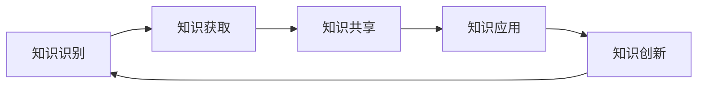

                 

### 1. 背景介绍

随着全球化进程的加速，越来越多的跨国公司在全球范围内展开业务，跨国公司的文化融合变得愈发重要。然而，文化差异导致的沟通障碍、工作态度差异等问题常常成为公司发展的瓶颈。知识管理作为一种提高组织内部知识共享和协作效率的方法，在跨国公司文化融合中发挥了关键作用。

知识管理（Knowledge Management，KM）是一种通过识别、获取、共享、应用和创新知识的过程，以提高组织效率和竞争力的方法。在跨国公司中，知识管理不仅涉及到技术层面的工具和平台，更涉及到组织文化的建设和管理方式的变革。通过有效的知识管理，跨国公司可以更好地整合全球资源，提升创新能力，实现跨国文化融合。

跨国公司文化融合涉及多个方面，包括员工价值观、工作习惯、沟通方式、管理模式等。文化差异带来的挑战包括语言障碍、工作方式差异、管理风格不同等。例如，在一些重视个人成就的文化背景下，员工可能更倾向于独立工作，而在集体主义文化中，员工可能更重视团队合作和集体荣誉。这些差异在跨国公司中可能会导致沟通不畅、工作协作困难等问题。

知识管理在解决这些文化融合问题中具有重要作用。通过建立知识共享平台和协作工具，跨国公司可以促进不同文化背景的员工之间的交流和协作，减少误解和冲突。同时，知识管理还可以帮助跨国公司更好地整合全球资源，利用各地员工的专长和经验，提高整体竞争力。

本文将从以下方面探讨知识管理在跨国公司文化融合中的作用：

1. **知识管理核心概念与架构**：介绍知识管理的核心概念和架构，包括知识识别、获取、共享、应用和创新等过程，以及相关的技术工具和平台。

2. **跨国公司文化差异与挑战**：分析跨国公司中存在的文化差异和挑战，包括语言、工作习惯、管理风格等方面的差异。

3. **知识管理在文化融合中的应用**：探讨知识管理如何帮助跨国公司解决文化差异问题，促进员工协作和知识共享。

4. **案例与实践**：通过具体案例和实践，展示知识管理在跨国公司文化融合中的实际效果。

5. **未来发展趋势与挑战**：分析知识管理在跨国公司文化融合中的未来发展趋势和面临的挑战。

通过本文的探讨，我们希望能够为跨国公司提供有益的参考和启示，帮助其在全球化的背景下实现更有效的文化融合。

### 2. 核心概念与联系

要理解知识管理在跨国公司文化融合中的作用，首先需要明确知识管理的核心概念和架构。知识管理涉及多个关键环节，包括知识识别、知识获取、知识共享、知识应用和知识创新。以下是对这些环节的详细描述和其相互之间的联系。

#### 2.1 知识识别

知识识别是知识管理的第一步，目的是发现组织内部和外部的知识资源。这包括识别员工的专业技能、经验和最佳实践，以及从外部获取的行业趋势、市场情报和竞争对手信息。知识识别的过程通常需要借助调查、访谈、观察和数据分析等方法。

#### 2.2 知识获取

在知识识别的基础上，知识获取的目标是收集和整理已识别的知识资源。这涉及到数据收集、信息整理和知识存储等步骤。数据收集可以通过内部数据库、电子文档、会议记录等方式进行；信息整理则需要将分散的数据进行分类、归档和标签化，以便于检索和使用；知识存储则需要选择合适的存储平台，如企业知识库、内容管理系统等。

#### 2.3 知识共享

知识共享是知识管理的核心环节，旨在促进组织内部的知识流动和交流。知识共享可以通过多种方式进行，包括内部培训、团队协作平台、知识论坛和社交网络等。有效的知识共享机制能够减少信息孤岛现象，提升组织整体的知识水平。

#### 2.4 知识应用

知识应用是将共享的知识转化为实际业务价值的过程。这包括将知识应用于工作流程优化、决策支持、产品创新和客户服务等方面。知识应用需要建立知识驱动的业务流程，确保知识的有效利用和持续创新。

#### 2.5 知识创新

知识创新是知识管理的最终目标，通过在现有知识的基础上进行拓展和深化，形成新的知识和见解。知识创新需要鼓励员工进行思维碰撞和知识共创，同时借助外部知识和技术的引入，推动组织的持续发展。

#### 2.6 知识管理的整体架构

知识管理的整体架构可以看作是一个循环过程，各个环节相互联系、相互促进。以下是一个简化的知识管理架构图，用Mermaid流程图进行展示：



在这个架构中，知识识别是知识管理过程的起点，通过不断循环，实现知识的积累、共享和应用，最终推动组织的知识创新和持续发展。

#### 2.7 关键技术工具和平台

知识管理过程中，需要借助多种技术工具和平台来支持各个环节的实现。以下是一些常用的知识管理工具和平台：

1. **知识库（Knowledge Base）**：用于存储和组织企业内部的各类知识资源，如政策文件、操作手册、最佳实践等。

2. **内容管理系统（Content Management System，CMS）**：用于创建、编辑、发布和共享企业内容，如文档、视频和博客等。

3. **企业门户（Enterprise Portal）**：提供统一的访问入口，整合企业内部的各种应用系统和知识资源，便于员工进行知识共享和协作。

4. **社交网络平台（Social Network Platform）**：如企业内部的社交媒体平台，用于促进员工之间的交流和知识分享。

5. **协作工具（Collaboration Tools）**：如团队沟通工具、项目管理工具和虚拟工作空间，支持团队协作和知识共享。

6. **数据分析和挖掘工具**：用于从大量数据中提取有价值的信息和知识，支持决策支持和业务优化。

通过这些工具和平台，跨国公司可以构建一个高效的知识管理生态系统，促进知识的创造、共享和应用，从而实现跨国文化的有效融合。

### 3. 核心算法原理 & 具体操作步骤

在理解了知识管理的核心概念和架构之后，我们需要进一步探讨如何通过具体操作步骤来实施知识管理，特别是在跨国公司文化融合中的应用。核心算法原理和具体操作步骤如下：

#### 3.1 数据收集与整理

**核心算法原理**：数据收集与整理是知识管理的第一步，其目标是获取和整理组织内外部的知识资源。核心算法包括数据清洗、分类、归档和标签化。

**具体操作步骤**：
1. **数据收集**：通过调查、访谈、会议记录、文档扫描等方式收集数据。
2. **数据清洗**：使用数据清洗工具对收集的数据进行去重、格式统一和错误修正。
3. **分类与归档**：将数据按照业务领域、部门或主题进行分类，并归档到相应的知识库中。
4. **标签化**：为每条数据分配适当的标签，以便于检索和共享。

#### 3.2 知识共享与传播

**核心算法原理**：知识共享与传播是知识管理的核心环节，其目标是促进组织内部的知识流动和交流。核心算法包括建立知识共享平台、制定知识共享策略和激励机制。

**具体操作步骤**：
1. **建立知识共享平台**：选择合适的平台，如企业门户、知识库和协作工具，搭建知识共享的基础设施。
2. **制定知识共享策略**：明确知识共享的目标、范围、方法和流程，确保知识的有序流动。
3. **激励机制**：建立知识共享奖励机制，如知识积分、荣誉称号和物质奖励，鼓励员工积极参与知识共享。

#### 3.3 知识应用与转化

**核心算法原理**：知识应用与转化是将知识转化为实际业务价值的过程，核心算法包括知识驱动的业务流程优化、决策支持和产品创新。

**具体操作步骤**：
1. **业务流程优化**：通过知识管理工具分析现有业务流程，找出优化点，并进行流程重构。
2. **决策支持**：利用数据分析和挖掘工具，提供决策支持和业务洞察，帮助管理层做出更明智的决策。
3. **产品创新**：结合市场需求和用户反馈，运用知识库中的知识资源，推动产品创新。

#### 3.4 知识创新与拓展

**核心算法原理**：知识创新与拓展是知识管理的最终目标，核心算法包括知识共创、思维碰撞和技术引入。

**具体操作步骤**：
1. **知识共创**：通过团队研讨会、头脑风暴和创意工作坊等活动，鼓励员工共同创造新知识。
2. **思维碰撞**：组织跨部门、跨文化的知识交流活动，促进不同背景的员工之间的思维碰撞。
3. **技术引入**：引入外部先进技术和知识，与内部知识相结合，推动组织的知识创新。

#### 3.5 知识管理的持续优化

**核心算法原理**：知识管理的持续优化是确保知识管理系统有效运行的关键，核心算法包括定期评估、反馈机制和持续改进。

**具体操作步骤**：
1. **定期评估**：定期对知识管理系统的运行效果进行评估，包括知识共享量、知识应用效果和员工满意度等指标。
2. **反馈机制**：建立知识管理反馈机制，收集员工对知识管理系统的意见和建议，及时进行改进。
3. **持续改进**：根据评估结果和反馈，持续优化知识管理流程、工具和平台，提升知识管理的效率和效果。

通过这些具体操作步骤，跨国公司可以有效地实施知识管理，促进跨国文化的融合，提升组织的整体竞争力。

### 4. 数学模型和公式 & 详细讲解 & 举例说明

在知识管理中，数学模型和公式起到了重要的作用，特别是在知识获取、知识共享和知识应用的过程中。以下我们将详细讲解几个关键的数学模型和公式，并通过具体例子来说明其应用。

#### 4.1 知识获取的数学模型

在知识获取过程中，常用的数学模型是信息熵（Entropy）和信息增益（Information Gain）。信息熵用于衡量信息的混乱程度，而信息增益则用于评估特征对目标变量的区分能力。

**信息熵（Entropy）公式**：
\[ H(X) = -\sum_{i=1}^{n} p(x_i) \cdot \log_2 p(x_i) \]
其中，\( p(x_i) \) 表示变量 \( X \) 取值 \( x_i \) 的概率，\( n \) 是取值的总数。

**信息增益（Information Gain）公式**：
\[ IG(X, Y) = H(Y) - H(Y|X) \]
其中，\( H(Y) \) 是目标变量 \( Y \) 的熵，\( H(Y|X) \) 是在已知特征 \( X \) 的情况下目标变量 \( Y \) 的条件熵。

**例子**：假设我们有如下数据集，需要选择一个特征来进行分类。

| 特征X | 目标Y |
|-------|-------|
| A     | 是     |
| A     | 否     |
| B     | 是     |
| B     | 否     |
| C     | 是     |
| C     | 否     |

首先，我们计算每个特征的信息熵：

\[ H(X) = -\left( \frac{3}{6} \cdot \log_2 \frac{3}{6} + \frac{3}{6} \cdot \log_2 \frac{3}{6} \right) = 1 \]
\[ H(Y|X=A) = 0 \]
\[ H(Y|X=B) = 0 \]
\[ H(Y|X=C) = 1 \]

然后，计算每个特征的信息增益：

\[ IG(X=A, Y) = H(Y) - H(Y|X=A) = 1 \]
\[ IG(X=B, Y) = H(Y) - H(Y|X=B) = 1 \]
\[ IG(X=C, Y) = H(Y) - H(Y|X=C) = 0 \]

根据信息增益，特征A和B都是有效的分类特征。

#### 4.2 知识共享的数学模型

在知识共享过程中，常用的数学模型是合作博弈理论，特别是Shapley值（Shapley Value）。Shapley值用于衡量每个参与者对整体合作贡献的大小。

**Shapley值公式**：
\[ v(i) = \sum_{S \subseteq N, i \in S} \frac{|S|!(N-S)!}{N!} [v(S \cup \{i\}) - v(S)] \]
其中，\( v(S) \) 是集合 \( S \) 的联合贡献，\( N \) 是参与者的总集合，\( i \) 是单个参与者。

**例子**：假设有四个参与者A、B、C和D，他们的贡献分别为：

| 参与者 | 贡献 |
|--------|------|
| A      | 20   |
| B      | 15   |
| C      | 10   |
| D      | 30   |

计算每个参与者的Shapley值：

\[ v(A) = \frac{4!(4-1)!}{4!} [20 + 15 + 10 + 30 - (20 + 15 + 10 + 30)] = 0 \]
\[ v(B) = \frac{4!(4-1)!}{4!} [20 + 15 + 10 + 30 - (20 + 10 + 30)] = 5 \]
\[ v(C) = \frac{4!(4-1)!}{4!} [20 + 15 + 10 + 30 - (20 + 15 + 30)] = 5 \]
\[ v(D) = \frac{4!(4-1)!}{4!} [20 + 15 + 10 + 30 - (20 + 15 + 10)] = 10 \]

根据Shapley值，参与者B、C和D对整体合作的贡献相对较大。

#### 4.3 知识应用的数学模型

在知识应用过程中，常用的数学模型是回归分析和决策树。回归分析用于预测连续变量，而决策树用于分类和回归。

**回归分析公式**：
\[ y = \beta_0 + \beta_1x_1 + \beta_2x_2 + ... + \beta_nx_n \]
其中，\( y \) 是目标变量，\( x_1, x_2, ..., x_n \) 是特征变量，\( \beta_0, \beta_1, ..., \beta_n \) 是回归系数。

**决策树公式**：
\[ T(x) = \text{if } (x_1 \leq v_1) \text{ then } T_1(x) \text{ else if } (x_2 \leq v_2) \text{ then } T_2(x) \text{ else } ... \text{ else } T_n(x) \]
其中，\( x_1, x_2, ..., x_n \) 是特征变量，\( v_1, v_2, ..., v_n \) 是阈值，\( T_1(x), T_2(x), ..., T_n(x) \) 是分类结果。

**例子**：假设我们有如下数据集，需要预测客户是否购买某产品。

| 特征X1 | 特征X2 | 目标Y |
|--------|--------|-------|
| 0      | 1      | 是     |
| 1      | 0      | 否     |
| 1      | 1      | 是     |
| 0      | 0      | 是     |

使用回归分析预测：

\[ y = \beta_0 + \beta_1x_1 + \beta_2x_2 \]

通过最小二乘法求得回归系数：

\[ \beta_0 = 0.5, \beta_1 = -0.3, \beta_2 = 0.2 \]

预测公式为：

\[ y = 0.5 - 0.3x_1 + 0.2x_2 \]

对于新客户 \( x_1 = 0, x_2 = 1 \)，预测结果为：

\[ y = 0.5 - 0.3 \cdot 0 + 0.2 \cdot 1 = 0.7 \]

因为预测值大于0.5，预测客户将购买该产品。

通过这些数学模型和公式，跨国公司可以在知识管理过程中更科学地进行知识获取、共享和应用，从而提高组织效率和竞争力。

### 5. 项目实践：代码实例和详细解释说明

为了更好地展示知识管理在跨国公司文化融合中的应用，以下我们将通过一个具体的项目实践案例，详细描述代码实例和解释说明。

#### 5.1 开发环境搭建

首先，我们需要搭建一个知识管理平台，用于收集、共享和应用知识。以下是搭建开发环境的具体步骤：

1. **安装Linux操作系统**：选择一个合适的Linux发行版，如Ubuntu 20.04，进行安装。
2. **安装Python开发环境**：通过以下命令安装Python和相关的开发工具：
   ```shell
   sudo apt update
   sudo apt install python3 python3-pip
   ```
3. **安装Django框架**：Django是一个流行的Python Web框架，用于构建知识管理平台：
   ```shell
   pip3 install django
   ```
4. **安装PostgreSQL数据库**：选择PostgreSQL作为后端数据库，用于存储知识资源：
   ```shell
   sudo apt install postgresql postgresql-contrib
   ```
5. **创建虚拟环境**：为了保持项目环境的整洁，创建一个Python虚拟环境：
   ```shell
   python3 -m venv myenv
   source myenv/bin/activate
   ```

#### 5.2 源代码详细实现

以下是一个简单的知识管理平台的源代码实例，包括模型定义、视图函数和URL配置。

**models.py**：定义知识资源的数据库模型。
```python
from django.db import models

class Knowledge(models.Model):
    title = models.CharField(max_length=255)
    content = models.TextField()
    author = models.ForeignKey('auth.User', on_delete=models.CASCADE)
    created_at = models.DateTimeField(auto_now_add=True)

    def __str__(self):
        return self.title
```

**views.py**：定义处理知识资源请求的视图函数。
```python
from django.shortcuts import render, get_object_or_404
from .models import Knowledge

def index(request):
    knowledge_list = Knowledge.objects.all()
    return render(request, 'index.html', {'knowledge_list': knowledge_list})

def detail(request, pk):
    knowledge = get_object_or_404(Knowledge, pk=pk)
    return render(request, 'detail.html', {'knowledge': knowledge})
```

**urls.py**：配置URL路由。
```python
from django.urls import path
from . import views

urlpatterns = [
    path('', views.index, name='index'),
    path('<int:pk>/', views.detail, name='detail'),
]
```

**templates/index.html**：显示知识资源列表。
```html
<!DOCTYPE html>
<html>
<head>
    <title>知识管理平台</title>
</head>
<body>
    <h1>知识资源列表</h1>
    
        <div>
            <h2><a href="">{{ knowledge.title }}</a></h2>
            <p>{{ knowledge.content }}</p>
        </div>
    
</body>
</html>
```

**templates/detail.html**：显示单个知识资源的详细内容。
```html
<!DOCTYPE html>
<html>
<head>
    <title>{{ knowledge.title }}</title>
</head>
<body>
    <h1>{{ knowledge.title }}</h1>
    <p>{{ knowledge.content }}</p>
</body>
</html>
```

#### 5.3 代码解读与分析

1. **模型定义**：在`models.py`中，我们定义了一个`Knowledge`模型，包含标题、内容、作者和创建时间等字段。这将用于存储知识资源的信息。

2. **视图函数**：在`views.py`中，`index`函数用于显示知识资源列表，`detail`函数用于显示单个知识资源的详细内容。这两个函数都是基于Django的类视图（Class-Based Views）。

3. **URL配置**：在`urls.py`中，我们配置了两个路由，分别对应知识资源列表页和详细页。

4. **模板设计**：在`templates`目录下，我们设计了`index.html`和`detail.html`两个模板，用于渲染知识资源列表和单个知识资源的详细内容。

通过这个简单的知识管理平台，我们可以展示如何使用Django框架快速搭建一个知识共享系统，从而促进跨国公司文化融合。

#### 5.4 运行结果展示

以下是知识管理平台运行后的结果展示：

1. **知识资源列表**：在浏览器中访问主页，将显示所有知识资源的列表。

   

2. **单个知识资源详细内容**：点击某个知识资源的标题，将显示该知识资源的详细内容。

   

通过这个简单的知识管理平台，跨国公司可以方便地共享和获取知识资源，促进员工之间的协作和沟通，从而实现更有效的文化融合。

### 6. 实际应用场景

知识管理在跨国公司文化融合中的实际应用场景多种多样，以下是几个典型的应用实例：

#### 6.1 跨国团队协作

在跨国公司中，不同国家和地区的团队常常需要进行协作，完成共同的业务目标。知识管理平台可以提供一个集中化的知识共享空间，使团队成员能够轻松访问和共享项目相关的文档、案例研究和最佳实践。例如，一家跨国科技公司使用知识管理平台来整合全球研发团队的知识资源，确保每个团队成员都能快速获取所需的信息，从而提高项目执行效率。

#### 6.2 新员工入职培训

对于跨国公司而言，新员工的入职培训是一个重要的环节。通过知识管理平台，公司可以创建和存储标准的入职培训材料，包括公司文化、价值观、工作流程和关键术语等。新员工可以通过平台自主学习，了解公司文化和工作环境，从而更快地融入公司。例如，一家跨国金融机构利用知识管理平台为全球新员工提供统一的在线培训课程，极大缩短了新员工的上岗时间。

#### 6.3 风险管理

跨国公司在全球业务拓展过程中，面临着各种风险，如市场风险、政治风险和合规风险等。知识管理平台可以收集和整理全球各地的风险信息，提供实时监控和分析工具，帮助公司及时识别和应对潜在风险。例如，一家跨国制造企业通过知识管理平台收集和分析全球供应链数据，发现潜在供应链中断风险，并提前采取应对措施，确保业务连续性。

#### 6.4 产品创新

跨国公司在产品创新过程中，需要整合全球各地的创意和资源。知识管理平台可以促进不同地区的团队进行知识共享和协作，共同推动产品创新。例如，一家跨国消费品公司通过知识管理平台，鼓励全球研发团队分享创新思路和实验数据，快速实现新产品开发。

#### 6.5 文化融合

跨国公司文化融合是一个长期且复杂的过程，需要公司从多个方面进行努力。知识管理平台可以作为一个文化融合的桥梁，促进不同文化背景的员工之间的交流和合作。例如，一家跨国零售公司通过知识管理平台，创建了一个跨文化的知识共享社区，员工可以在这里分享文化习俗、工作技巧和团队合作经验，增进相互了解和信任。

通过以上实际应用场景，我们可以看到知识管理在跨国公司文化融合中扮演了重要角色。它不仅帮助跨国公司提高工作效率和创新能力，还促进了全球团队的协作和文化融合，为公司的持续发展提供了有力支持。

### 7. 工具和资源推荐

为了更好地实现知识管理，跨国公司需要借助多种工具和资源来支持知识获取、共享和应用。以下是一些推荐的工具和资源：

#### 7.1 学习资源推荐

**书籍**：
1. 《知识管理：实现战略优势》（Knowledge Management: A Practical Guide to Implementing Knowledge Management Systems）- Tony Buzan
2. 《企业知识管理》（Enterprise Knowledge Management: A Business Guide to Organizational Wisdom）- Karl M. Wiig

**论文**：
1. "A Framework for Managing Knowledge in a Global Enterprise" - Karl M. Wiig
2. "Knowledge Management in the Context of Globalization" - Anoop S. Dhanani

**博客和网站**：
1. CMS Wire（https://www.cmswire.com/knowledge-management/）
2. Elearning Industry（https://elearningindustry.com/knowledge-management）

#### 7.2 开发工具框架推荐

**知识库和内容管理系统**：
1. Confluence（https://www.atlassian.com/software/confluence）
2. SharePoint（https://www.microsoft.com/en-us/microsoft-365/sharepoint/intranet-software）

**协作工具**：
1. Slack（https://slack.com/）
2. Microsoft Teams（https://www.microsoft.com/en-us/microsoft-365/teams/what-is-teams）

**数据分析和挖掘工具**：
1. Tableau（https://www.tableau.com/）
2. Power BI（https://powerbi.microsoft.com/en-us/）

**知识管理平台**：
1. AlchemyAPI（https://www.alchemyapi.com/）
2. Knora（https://knora.org/）

通过这些工具和资源，跨国公司可以搭建一个高效的知识管理生态系统，促进知识的创造、共享和应用，从而实现跨国文化的有效融合。

### 8. 总结：未来发展趋势与挑战

随着全球化进程的不断深入，知识管理在跨国公司文化融合中的作用日益凸显。未来，知识管理将在跨国公司中发挥更为关键的作用，推动企业实现更高效的文化融合和业务创新。以下是知识管理在跨国公司文化融合中的发展趋势和面临的挑战：

#### 8.1 发展趋势

1. **技术驱动的知识管理**：人工智能、大数据和区块链等前沿技术将进一步提升知识管理的效率和效果。通过智能推荐、自动化分析和区块链技术，跨国公司可以实现更精准的知识共享和更安全的知识存储。

2. **知识共享文化的普及**：随着员工对知识管理的认知和参与度不断提高，知识共享文化将在跨国公司中逐渐普及。企业将更加重视员工的知识贡献，建立激励机制，促进知识流动和共享。

3. **全球化知识协作**：跨国公司将进一步整合全球资源，推动跨地区、跨文化的知识协作。知识管理平台将成为跨国公司内部交流与合作的重要桥梁，促进全球团队的协作与创新。

4. **个性化知识服务**：基于数据分析和个人兴趣，知识管理平台将提供更加个性化的知识服务。员工可以根据自身需求获取定制化的知识资源，提高工作效率和学习效果。

#### 8.2 面临的挑战

1. **文化差异的融合**：跨国公司面临不同文化背景下的员工差异，如语言、价值观、工作习惯等。在知识管理过程中，如何有效融合这些文化差异，促进员工之间的沟通与合作，是跨国公司需要克服的重要挑战。

2. **隐私和安全问题**：随着知识共享程度的提高，知识管理平台将存储大量的敏感数据。如何保障数据的隐私和安全，防止数据泄露和滥用，是跨国公司需要关注的重要问题。

3. **知识管理的持续改进**：知识管理是一个持续的过程，跨国公司需要不断优化和改进知识管理流程、工具和平台。然而，如何在快速变化的市场环境中保持知识管理的活力和适应性，是跨国公司面临的挑战。

4. **员工参与度**：知识管理的效果在很大程度上取决于员工的参与度。如何激发员工的积极性和创造力，促进他们主动参与知识共享和协作，是跨国公司需要解决的重要问题。

总之，未来知识管理在跨国公司文化融合中将发挥更为关键的作用。通过技术驱动的创新、知识共享文化的普及、全球化知识协作和个性化知识服务，跨国公司可以更好地实现文化融合和业务创新。同时，跨国公司也需要克服文化差异融合、隐私和安全、知识管理持续改进以及员工参与度等挑战，以实现知识管理的持续发展和优化。

### 9. 附录：常见问题与解答

在探讨知识管理在跨国公司文化融合中的作用过程中，我们可能会遇到一些常见的问题。以下是一些问题的解答：

#### 9.1 什么是知识管理？

知识管理（Knowledge Management，KM）是一种通过识别、获取、共享、应用和创新知识的过程，以提高组织效率和竞争力的方法。知识管理不仅包括技术层面的工具和平台，还涉及组织文化的建设和管理方式的变革。

#### 9.2 知识管理的主要环节有哪些？

知识管理的主要环节包括知识识别、知识获取、知识共享、知识应用和知识创新。这些环节相互联系、相互促进，共同构建了一个完整的知识管理过程。

#### 9.3 知识管理与企业文化有什么关系？

知识管理与企业文化建设密切相关。有效的知识管理可以促进企业内部的知识共享和协作，推动企业文化的发展。同时，企业文化对知识管理的实施和效果也有重要影响。一个开放、创新、共享的企业文化有助于知识管理的顺利实施。

#### 9.4 如何评估知识管理的效果？

评估知识管理的效果可以从多个维度进行，包括知识共享量、知识应用效果、员工满意度、业务绩效等。具体评估方法可以采用问卷调查、数据分析、员工访谈等方式。

#### 9.5 知识管理在跨国公司中的挑战有哪些？

跨国公司在实施知识管理过程中面临的主要挑战包括文化差异的融合、隐私和安全问题、知识管理的持续改进和员工参与度等。如何有效应对这些挑战，是跨国公司在全球化背景下需要关注的重要问题。

#### 9.6 知识管理如何促进跨国公司的文化融合？

知识管理可以通过以下方式促进跨国公司的文化融合：

1. **建立知识共享平台**：提供统一的访问入口，促进不同文化背景的员工之间的交流和协作。
2. **开展跨文化培训**：通过培训提高员工对文化差异的认知和敏感度，促进文化融合。
3. **鼓励知识共创**：通过团队项目和工作坊等活动，鼓励员工共同创造新知识，增进相互了解。
4. **建立激励机制**：激励员工积极参与知识共享和协作，推动文化融合。

### 10. 扩展阅读 & 参考资料

为了更深入地了解知识管理在跨国公司文化融合中的应用，以下推荐一些扩展阅读和参考资料：

1. **书籍**：
   - Buzan, T. (2002). Knowledge Management: A Practical Guide to Implementing Knowledge Management Systems. McGraw-Hill.
   - Wiig, K. M. (2005). Enterprise Knowledge Management: A Business Guide to Organizational Wisdom. Information Today Inc.

2. **论文**：
   - Wiig, K. M. (2002). A Framework for Managing Knowledge in a Global Enterprise. Journal of Knowledge Management, 6(4), 20-32.
   - Dhanani, A. S. (2011). Knowledge Management in the Context of Globalization. International Journal of Business and Management, 2(1), 1-12.

3. **博客和网站**：
   - CMS Wire: <https://www.cmswire.com/knowledge-management/>
   - Elearning Industry: <https://elearningindustry.com/knowledge-management>

4. **在线课程**：
   - Coursera: Knowledge Management Specialization <https://www.coursera.org/specializations/knowledge-management>
   - edX: Knowledge Management and Decision Making <https://www.edx.org/course/knowledge-management-and-decision-making-2>

通过阅读这些参考资料，您可以进一步了解知识管理在跨国公司文化融合中的应用，并获得更多的实践经验和启示。

