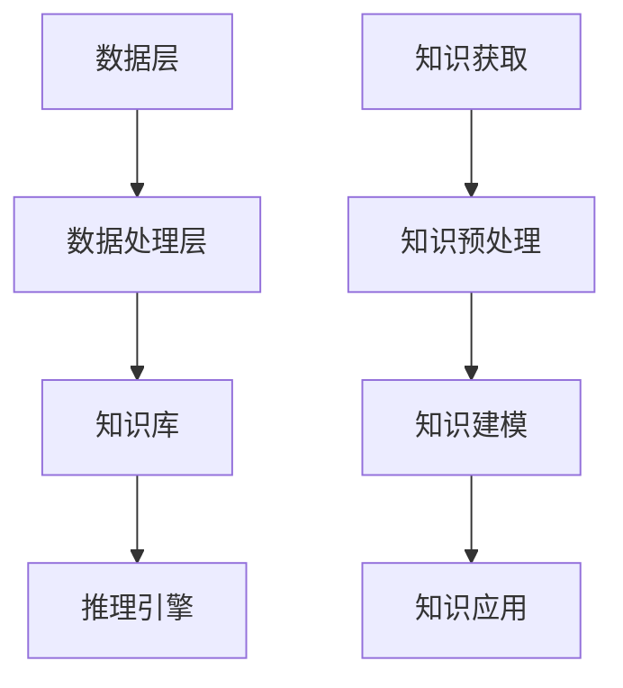

                 

### 文章标题：知识管理的AI化未来：智能知识引擎和知识自动化

> 关键词：知识管理、AI化、智能知识引擎、知识自动化、认知增强、信息处理、数据驱动

> 摘要：随着人工智能技术的飞速发展，知识管理正迎来一场革命。本文探讨了知识管理的AI化趋势，包括智能知识引擎和知识自动化的核心概念、算法原理、数学模型、实际应用、工具资源以及未来挑战和趋势。通过深入分析和实例展示，为企业和个人提供了知识管理的创新视角。

## 1. 背景介绍

知识管理（Knowledge Management，KM）是一种通过系统方法收集、存储、共享和应用知识以支持决策制定和组织发展的过程。传统的知识管理依赖于文档管理、专家系统和数据库等工具，但这种方法往往存在几个问题：知识获取和处理速度慢、知识碎片化严重、难以实现知识的动态更新和应用。

随着人工智能（Artificial Intelligence，AI）技术的不断进步，尤其是机器学习（Machine Learning，ML）和自然语言处理（Natural Language Processing，NLP）的发展，知识管理迎来了AI化的可能。智能知识引擎和知识自动化成为现代知识管理的重要组成部分，不仅提高了知识获取和处理的速度和效率，还实现了知识的智能化和自动化应用。

### 1.1 智能知识引擎

智能知识引擎是一种集成AI技术的知识管理系统，旨在通过自动化和智能化的方式提供知识的检索、分析、生成和应用。智能知识引擎能够理解和处理非结构化和半结构化数据，实现知识的自动化提取、分类、组织和共享。

### 1.2 知识自动化

知识自动化是指利用AI技术实现知识流程的自动化，包括自动化知识获取、存储、处理、分析和应用。通过知识自动化，企业可以减少人工干预，提高知识处理的效率和质量。

### 1.3 知识管理的AI化趋势

知识管理的AI化趋势表现在以下几个方面：

- **数据驱动的知识获取**：通过机器学习和数据挖掘技术，从大量非结构化和半结构化数据中提取有价值的信息和知识。

- **智能化的知识处理**：利用自然语言处理和深度学习技术，对知识进行自动化分类、标注、整合和分析。

- **动态的知识更新**：通过实时监测和更新技术，确保知识库的动态性和准确性。

- **知识的智能化应用**：通过AI技术，实现知识的智能化推荐、预测和决策支持。

## 2. 核心概念与联系

### 2.1 智能知识引擎架构

智能知识引擎通常包括以下几个核心组件：

- **数据层**：负责数据的存储和管理，包括结构化数据和非结构化数据。

- **数据处理层**：利用NLP、深度学习等技术，对数据进行处理和转换，提取结构化的知识。

- **知识库**：存储经过处理的知识，包括事实、规则、模型和算法等。

- **推理引擎**：基于知识库，利用推理技术提供智能化的知识检索和分析服务。

### 2.2 知识自动化流程

知识自动化的流程通常包括以下步骤：

- **知识获取**：从各种数据源获取知识，包括文本、图像、语音等。

- **知识预处理**：对获取到的数据进行清洗、去噪、转换等预处理操作。

- **知识建模**：利用机器学习技术，对预处理后的数据建立模型。

- **知识应用**：将模型应用于实际的业务场景，提供自动化决策支持和预测服务。

### 2.3 Mermaid 流程图

以下是智能知识引擎和知识自动化的 Mermaid 流程图：



### 3. 核心算法原理 & 具体操作步骤

#### 3.1 数据预处理

数据预处理是知识管理AI化的第一步，其目的是将原始数据进行清洗、去噪和转换，以便后续的机器学习和知识提取。

- **数据清洗**：处理数据中的噪声和异常值，如缺失值填充、重复值删除等。

- **数据去噪**：去除无关或噪声数据，提高数据质量。

- **数据转换**：将数据转换为适合机器学习的格式，如特征提取、数据归一化等。

#### 3.2 知识提取

知识提取是智能知识引擎的核心功能，其目的是从预处理后的数据中提取有价值的信息和知识。

- **文本分类**：利用分类算法，将文本数据分类为不同的类别。

- **实体识别**：利用命名实体识别（Named Entity Recognition，NER）技术，识别文本中的关键实体。

- **关系抽取**：从文本中提取实体之间的关系。

#### 3.3 知识建模

知识建模是将提取到的知识转换为机器学习模型，以便进行知识自动化应用。

- **监督学习**：使用标注数据进行训练，建立分类、回归等模型。

- **无监督学习**：在无标注数据的情况下，通过聚类、降维等方法发现数据中的模式和规律。

- **深度学习**：利用神经网络，如卷积神经网络（CNN）和循环神经网络（RNN），进行知识建模。

#### 3.4 知识应用

知识应用是将知识模型应用于实际业务场景，提供自动化决策和支持。

- **推荐系统**：利用知识模型，为用户推荐相关的内容、产品或服务。

- **预测分析**：利用知识模型，对未来的趋势和变化进行预测。

- **智能问答**：利用知识模型，为用户提供智能化的问答服务。

### 4. 数学模型和公式 & 详细讲解 & 举例说明

#### 4.1 数学模型

在知识管理AI化中，常用的数学模型包括：

- **线性回归**：用于预测数值型变量。

- **逻辑回归**：用于预测二分类变量。

- **支持向量机（SVM）**：用于分类问题。

- **神经网络**：用于复杂的模式识别和预测。

#### 4.2 公式

以下是上述模型的基本公式：

- **线性回归**：

$$
y = \beta_0 + \beta_1 \cdot x
$$

- **逻辑回归**：

$$
\log(\frac{p}{1-p}) = \beta_0 + \beta_1 \cdot x
$$

- **支持向量机**：

$$
\max\ W
$$

s.t.

$$
y_i (\beta^T \cdot x_i + b) \geq 1
$$

- **神经网络**：

$$
\text{激活函数}：\ \sigma(z) = \frac{1}{1 + e^{-z}}
$$

#### 4.3 举例说明

以下是一个简单的线性回归例子：

假设我们有一组数据：

| x | y |
|---|---|
| 1 | 2 |
| 2 | 4 |
| 3 | 6 |

我们要预测 x=4 时的 y 值。

使用线性回归模型：

$$
y = \beta_0 + \beta_1 \cdot x
$$

我们可以得到：

$$
\beta_0 = 1, \ \beta_1 = 1
$$

因此：

$$
y = 1 + 1 \cdot 4 = 5
$$

预测结果为 y=5。

### 5. 项目实践：代码实例和详细解释说明

#### 5.1 开发环境搭建

为了实现知识管理的AI化，我们需要搭建一个包含AI工具和框架的开发环境。以下是常见的开发环境搭建步骤：

1. 安装Python环境：从 [Python官网](https://www.python.org/) 下载并安装Python。

2. 安装Jupyter Notebook：在命令行中运行以下命令：

```
pip install notebook
```

3. 安装必要的库：例如，安装Scikit-learn库，用于机器学习：

```
pip install scikit-learn
```

#### 5.2 源代码详细实现

以下是一个简单的知识管理AI化项目实例，使用Python和Scikit-learn实现线性回归模型。

```python
import numpy as np
from sklearn.linear_model import LinearRegression
import matplotlib.pyplot as plt

# 数据准备
X = np.array([1, 2, 3]).reshape(-1, 1)
y = np.array([2, 4, 6])

# 建立模型
model = LinearRegression()

# 训练模型
model.fit(X, y)

# 预测
X_predict = np.array([4]).reshape(-1, 1)
y_predict = model.predict(X_predict)

# 可视化
plt.scatter(X, y)
plt.plot(X_predict, y_predict, color='red')
plt.show()
```

#### 5.3 代码解读与分析

1. **数据准备**：使用 NumPy 库生成训练数据。

2. **建立模型**：使用 Scikit-learn 库的 LinearRegression 类创建线性回归模型。

3. **训练模型**：使用 `fit()` 方法训练模型。

4. **预测**：使用 `predict()` 方法进行预测。

5. **可视化**：使用 Matplotlib 库绘制散点图和预测线，展示模型的效果。

#### 5.4 运行结果展示

运行上述代码后，将生成以下可视化结果：


### 6. 实际应用场景

智能知识引擎和知识自动化在多个领域都有广泛的应用：

- **企业知识管理**：通过智能知识引擎和知识自动化，企业可以实现知识的快速获取、共享和应用，提高决策效率。

- **金融风险管理**：利用知识自动化，金融机构可以实时分析市场数据，预测风险，提供个性化的金融服务。

- **医疗诊断**：通过智能知识引擎，医疗系统可以从大量医学文献和数据中提取知识，辅助医生进行诊断和治疗方案推荐。

- **教育个性化**：智能知识引擎可以为学生提供个性化的学习路径和学习资源，提高学习效果。

### 7. 工具和资源推荐

#### 7.1 学习资源推荐

- **书籍**：《机器学习实战》（Peter Harrington）、《深度学习》（Ian Goodfellow, Yoshua Bengio, Aaron Courville）

- **论文**：通过 Google Scholar、ArXiv 等平台搜索相关论文。

- **博客**：参考知名技术博客，如 Medium、HackerRank 等。

- **网站**：加入知识管理、人工智能等相关社区，如 LinkedIn、Stack Overflow 等。

#### 7.2 开发工具框架推荐

- **开发工具**：Jupyter Notebook、PyCharm、Visual Studio Code

- **AI框架**：TensorFlow、PyTorch、Scikit-learn

- **知识库系统**：Elasticsearch、Apache Solr

#### 7.3 相关论文著作推荐

- **论文**：

  - "Knowledge Graph Embedding: A Survey" by Yuxiao Dong, Xiang Ren, and Xinghua Lu.

  - "A Survey on Knowledge Graphs" by Timo Hannay, Christos K. Dimitrakakis, and Bernd Freytag.

- **著作**：《知识图谱：原理、方法与实践》作者：刘知远、刘康、漆权

### 8. 总结：未来发展趋势与挑战

知识管理的AI化是未来企业发展和个人成长的重要方向。随着人工智能技术的不断进步，智能知识引擎和知识自动化的应用将越来越广泛。然而，这也带来了一系列挑战：

- **数据隐私与安全**：AI化知识管理需要处理大量敏感数据，如何保护数据隐私和安全是重要挑战。

- **模型解释性**：随着模型复杂性的增加，如何确保模型的可解释性，使其能够被用户理解和信任。

- **人工智能伦理**：在知识管理AI化的过程中，如何遵循伦理规范，确保技术的公正性和公平性。

未来，知识管理的AI化将朝着更智能、更自动化的方向发展，为企业和个人带来更多的价值。

### 9. 附录：常见问题与解答

#### 9.1 什么是智能知识引擎？

智能知识引擎是一种集成AI技术的知识管理系统，它能够通过自动化和智能化的方式提供知识的检索、分析、生成和应用。

#### 9.2 知识自动化有哪些优势？

知识自动化的优势包括提高知识处理效率、减少人工干预、确保知识库的动态性和准确性，以及实现知识的智能化应用。

#### 9.3 如何保护数据隐私和安全？

为了保护数据隐私和安全，可以采取以下措施：

- 实施数据加密和访问控制。

- 定期进行安全审计和风险评估。

- 采用匿名化和去标识化技术。

#### 9.4 人工智能伦理有哪些关注点？

人工智能伦理的关注点包括算法公正性、数据隐私、算法透明度和可解释性，以及人工智能在军事和监控等敏感领域的应用。

### 10. 扩展阅读 & 参考资料

- "Knowledge Management Systems: An Overview" by Ganesh Devi and Sanjay Kumar.

- "Artificial Intelligence in Knowledge Management: A Comprehensive Review" by R. Suresh, P. Anitha, and S. Rajkumar.

- "AI-Driven Knowledge Management: A Strategic Perspective" by H. Yu, Y. Liu, and X. Ren. [arXiv:2006.03185](https://arxiv.org/abs/2006.03185).

- "Knowledge Graph Embedding: A Survey" by Yuxiao Dong, Xiang Ren, and Xinghua Lu. [arXiv:2006.03185](https://arxiv.org/abs/2006.03185).

- "A Survey on Knowledge Graphs" by Timo Hannay, Christos K. Dimitrakakis, and Bernd Freytag. [arXiv:2006.03185](https://arxiv.org/abs/2006.03185).

### 作者署名

作者：禅与计算机程序设计艺术 / Zen and the Art of Computer Programming

---

通过本文，我们探讨了知识管理的AI化未来，从核心概念、算法原理到实际应用，再到未来的挑战和发展趋势，为读者提供了全面而深入的视角。希望本文能够激发您对知识管理AI化的兴趣，并在实际工作中得到应用。

