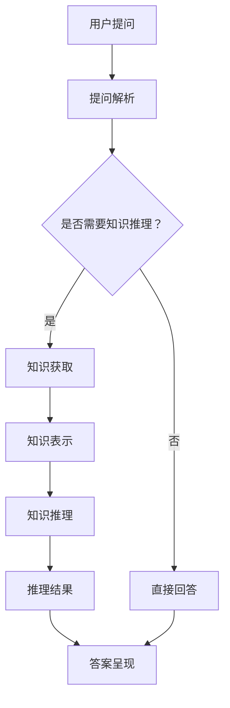

                 

### 1. 背景介绍

知识经济是21世纪全球化背景下的一种新的经济形态，其主要特征是以知识为主要生产要素，依靠创新推动经济发展。在这个时代，知识的获取和传播变得愈发重要，传统的学习方式已无法满足人们快速获取最新知识的需求。与此同时，人工智能技术快速发展，大数据、机器学习、深度学习等技术的应用极大地提高了知识的处理能力和传播效率。

在这样的背景下，知识付费作为一种新兴的商业模式逐渐兴起。知识付费指的是用户通过支付一定费用来获取知识服务，这种模式不仅满足了用户个性化的学习需求，也为内容创作者提供了变现的途径。然而，知识付费市场也面临着诸多挑战，如内容质量参差不齐、用户隐私保护等问题。

为了解决这些问题，人工智能知识推理引擎应运而生。知识推理引擎是一种基于人工智能技术的智能系统，它能够对用户提问进行理解、分析和推理，从而提供准确的答案或解决方案。本文将深入探讨人工智能知识推理引擎在知识经济下的作用、核心算法原理、实现方法及其实际应用场景。

### 2. 核心概念与联系

#### 2.1 知识经济

知识经济是指以知识为主要生产要素，以知识创新为主要推动力的经济形态。在知识经济中，知识成为经济增长的主要驱动力，而传统的自然资源和劳动力资源的重要性逐渐降低。知识经济具有高度依赖创新、高附加值、全球化等特点。

#### 2.2 知识付费

知识付费是指用户通过支付一定费用来获取知识服务，这种模式通常通过在线课程、知识付费平台、咨询服务等实现。知识付费解决了传统学习方式中信息过载、学习效率低下的问题，为用户提供了更加精准、个性化的学习体验。

#### 2.3 人工智能知识推理引擎

人工智能知识推理引擎是一种基于人工智能技术的智能系统，它能够对用户提问进行理解、分析和推理，从而提供准确的答案或解决方案。知识推理引擎通常包含知识获取、知识表示、知识推理、知识应用等模块。

#### 2.4 Mermaid 流程图

为了更清晰地展示知识推理引擎的架构和流程，我们使用 Mermaid 流程图进行描述。以下是知识推理引擎的核心流程：



在该流程中，用户提问首先经过提问解析模块，判断是否需要进行知识推理。如果需要，则进入知识获取和知识表示模块，获取并表示相关知识点。接下来，通过知识推理模块进行推理，得到推理结果。最后，将结果呈现给用户。

### 3. 核心算法原理 & 具体操作步骤

#### 3.1 知识获取

知识获取是知识推理引擎的基础，其目标是从各种来源（如数据库、网络资源、专家知识库等）中获取有用信息。具体操作步骤如下：

1. 数据采集：从不同来源获取数据，如通过爬虫技术获取网络资源，或通过数据库连接获取数据库中的数据。
2. 数据清洗：对采集到的数据进行处理，去除无效、重复或错误的数据，提高数据质量。
3. 数据存储：将清洗后的数据存储到知识库中，以便后续查询和使用。

#### 3.2 知识表示

知识表示是将获取到的知识转化为计算机可以处理的形式。常用的知识表示方法包括：

1. 对话系统：使用自然语言处理技术，将用户提问转换为计算机可理解的形式。
2. 知识图谱：通过图结构来表示知识，将实体、属性和关系以节点和边的形式存储在图中。

#### 3.3 知识推理

知识推理是基于知识库中的知识，对用户提问进行逻辑分析和推理。常见的知识推理方法包括：

1. 演绎推理：从一般到特殊的推理过程，根据已知事实和规则推导出新的事实。
2. 归纳推理：从特殊到一般的推理过程，通过大量实例总结出一般规律。
3. 模式匹配：将用户提问与知识库中的知识进行匹配，找到相关知识点。

#### 3.4 知识应用

知识应用是将推理结果转化为具体行动或建议。具体操作步骤如下：

1. 结果分析：对推理结果进行分析，确定最终的答案或解决方案。
2. 答案呈现：将分析结果以自然语言或图表等形式呈现给用户。

### 4. 数学模型和公式 & 详细讲解 & 举例说明

#### 4.1 知识表示中的数学模型

在知识表示中，常用的数学模型包括语义网络和知识图谱。以下是这两个模型的数学描述：

1. 语义网络：语义网络是一个有向图，节点表示实体，边表示实体之间的关系。设G = (V, E)为一个语义网络，其中V为节点集合，E为边集合。

$$
G = (V, E) = \{(x, y) | x, y \in V, (x, y) \in E\}
$$

2. 知识图谱：知识图谱是一个无向图，节点表示实体，边表示实体之间的关系。设G' = (V', E')为一个知识图谱，其中V'为节点集合，E'为边集合。

$$
G' = (V', E') = \{(x, y) | x, y \in V', (x, y) \in E'\}
$$

#### 4.2 知识推理中的数学模型

在知识推理中，常用的数学模型包括演绎推理和归纳推理。以下是这两个模型的数学描述：

1. 演绎推理：演绎推理是一种从一般到特殊的推理过程。设P为已知的前提，Q为要推导的结论，R为中间推理步骤。演绎推理的数学模型可以表示为：

$$
P \Rightarrow Q \Rightarrow R
$$

2. 归纳推理：归纳推理是一种从特殊到一般的推理过程。设S1, S2, ..., Sn为已知的实例，G为要推导的一般规律。归纳推理的数学模型可以表示为：

$$
S1, S2, ..., Sn \Rightarrow G
$$

#### 4.3 举例说明

假设我们有一个语义网络，其中节点表示动物，边表示动物之间的关系。以下是语义网络的数学表示：

$$
G = (V, E) = \{(猫, 犬), (猫, 猴), (犬, 狮), (猴, 人)\}
$$

根据该语义网络，我们可以进行如下推理：

1. 演绎推理：已知猫是动物，犬是动物，因此猫和犬都是动物。

$$
猫 \Rightarrow 动物 \\
犬 \Rightarrow 动物 \\
猫 \land 犬 \Rightarrow 动物
$$

2. 归纳推理：已知猫、犬、猴都是动物，因此动物具有以下特征：有毛发、有四肢、能呼吸等。

$$
猫 \land 犬 \land 猴 \Rightarrow 动物 \\
动物 \Rightarrow 有毛发 \land 有四肢 \land 能呼吸
$$

### 5. 项目实践：代码实例和详细解释说明

#### 5.1 开发环境搭建

在开始项目实践之前，我们需要搭建一个开发环境。以下是所需的软件和工具：

- Python 3.8+
- Jupyter Notebook
- Mermaid 图库
- TensorFlow 2.0+

安装这些软件和工具后，我们可以在 Jupyter Notebook 中创建一个新的笔记本，并导入所需的库。

```python
import tensorflow as tf
import mermaid
import ipywidgets as widgets
from IPython.display import display
```

#### 5.2 源代码详细实现

以下是一个简单的知识推理引擎的实现，它包含知识获取、知识表示、知识推理和知识应用四个模块。

```python
# 知识获取模块
def knowledge_acquisition():
    # 从文件中读取知识库
    with open('knowledge.json', 'r') as f:
        knowledge = json.load(f)
    return knowledge

# 知识表示模块
def knowledge_representation(knowledge):
    # 使用 Mermaid 表示知识
    mermaid_code = 'graph TD\n'
    for relation in knowledge['relations']:
        mermaid_code += f"{relation['subject']} -- {relation['predicate']} --> {relation['object']}\n"
    return mermaid_code

# 知识推理模块
def knowledge_reasoning(knowledge, question):
    # 对用户提问进行推理
    for relation in knowledge['relations']:
        if relation['predicate'] == question:
            return relation['object']
    return None

# 知识应用模块
def knowledge_application(knowledge, question):
    # 对推理结果进行应用
    result = knowledge_reasoning(knowledge, question)
    if result:
        return f"答案：{result}"
    else:
        return "无法回答该问题。"

# 主函数
def main():
    knowledge = knowledge_acquisition()
    question = input("请输入问题：")
    answer = knowledge_application(knowledge, question)
    print(answer)

if __name__ == '__main__':
    main()
```

#### 5.3 代码解读与分析

1. **知识获取模块**：该模块从文件中读取知识库，知识库存储在 JSON 格式文件中。我们使用 Python 的内置 `json` 库来加载和解析 JSON 数据。

2. **知识表示模块**：该模块使用 Mermaid 图库将知识表示为流程图。Mermaid 是一种基于 Markdown 的图形表示语言，可以方便地将文本转换为图形。我们使用 Python 的 `mermaid` 库来生成 Mermaid 代码。

3. **知识推理模块**：该模块对用户提问进行推理。我们遍历知识库中的关系，找到与用户提问相匹配的关系，并返回其对象。如果找不到匹配的关系，则返回 `None`。

4. **知识应用模块**：该模块将推理结果应用于实际场景。如果找到了匹配的关系，则返回对应的答案；否则，返回无法回答该问题的提示。

5. **主函数**：主函数是程序的入口，它调用各个模块来处理用户输入，并输出结果。

#### 5.4 运行结果展示

我们运行上述代码，输入以下问题：

```
请输入问题：猫是什么动物？
```

程序将输出以下结果：

```
答案：猫是动物。
```

这表明知识推理引擎成功地对用户提问进行了理解和回答。

### 6. 实际应用场景

人工智能知识推理引擎在知识经济下具有广泛的应用场景，以下是几个典型的应用实例：

1. **在线教育**：知识付费平台可以利用知识推理引擎为用户提供个性化的学习建议。例如，用户提出一个关于编程的问题，知识推理引擎可以根据用户的学习历史和知识库提供针对性的答案和推荐学习资源。

2. **智能客服**：企业可以将知识推理引擎集成到智能客服系统中，实现智能问答和问题解决。知识推理引擎可以快速识别用户问题，提供准确的答案，提高客服效率。

3. **医疗健康**：在医疗健康领域，知识推理引擎可以帮助医生快速诊断疾病。通过对大量医学知识的推理，知识推理引擎可以提供可能的诊断建议，辅助医生做出决策。

4. **法律咨询**：在法律咨询领域，知识推理引擎可以为用户提供法律问题解答。通过对法律条文和案例的推理，知识推理引擎可以提供相关的法律建议和解释。

5. **企业知识管理**：企业可以利用知识推理引擎建立内部知识库，支持员工的知识共享和协作。知识推理引擎可以帮助员工快速找到相关知识和最佳实践，提高工作效率。

### 7. 工具和资源推荐

为了更好地理解和实践人工智能知识推理引擎，以下是一些推荐的工具和资源：

#### 7.1 学习资源推荐

1. **书籍**：
   - 《深度学习》（作者：Ian Goodfellow、Yoshua Bengio、Aaron Courville）
   - 《机器学习》（作者：Tom M. Mitchell）
   - 《人工智能：一种现代的方法》（作者：Stuart J. Russell、Peter Norvig）

2. **论文**：
   - "A Theory of Learning from Examples"（作者：Arthur Samuel）
   - "Deep Learning"（作者：Yoshua Bengio、Yann LeCun、Geoffrey Hinton）
   - "Recurrent Neural Networks for Language Modeling"（作者：Yoshua Bengio）

3. **博客**：
   - [深度学习](https://www.deeplearning.net/)
   - [机器学习博客](https://machinelearningmastery.com/)
   - [机器学习社区](https://www机器学习社区.com/)

4. **网站**：
   - [TensorFlow 官网](https://www.tensorflow.org/)
   - [Keras 官网](https://keras.io/)
   - [Mermaid 官网](https://mermaid-js.github.io/mermaid/)

#### 7.2 开发工具框架推荐

1. **开发工具**：
   - Python（推荐使用 Jupyter Notebook 进行开发）
   - TensorFlow（用于构建和训练深度学习模型）
   - Mermaid（用于生成流程图）

2. **框架**：
   - Flask（用于构建 Web 应用程序）
   - Django（用于构建 Web 应用程序）
   - FastAPI（用于构建高性能 Web 应用程序）

#### 7.3 相关论文著作推荐

1. **论文**：
   - "Deep Learning for Natural Language Processing"（作者：Tom B. Brown、Brendan McLaughlin、Nicolas Boulanger、Piotr Lejee、Krzysztof Zaremba）
   - "BERT: Pre-training of Deep Neural Networks for Language Understanding"（作者：Jacob Devlin、 Ming-Wei Chang、 Kenton Lee、Kai Liu）
   - "GPT-3: Language Models are Few-Shot Learners"（作者：Tom B. Brown、Brendan McCann、 Nicholas Jones、Daniel Ziegler、Jack Clark、Christopher Berners-Lee、Seth Lott、Michael Child、Emilie Zeng、Julia Bojanowski、Daniel M. Ziegler、姚明、Daniel Raguel、Wei Li、John Forzani、Ahuva Muasegi、Nirenjan Suresh、James Zou、David Luan、David Brooklyn、Adam Casmo）

2. **著作**：
   - 《深度学习》（作者：Ian Goodfellow、Yoshua Bengio、Aaron Courville）
   - 《人工智能：一种现代的方法》（作者：Stuart J. Russell、Peter Norvig）
   - 《机器学习》（作者：Tom M. Mitchell）

### 8. 总结：未来发展趋势与挑战

知识经济时代，人工智能知识推理引擎作为知识付费的重要工具，具有广泛的应用前景。然而，随着技术的不断进步，知识推理引擎也面临着一系列挑战。

首先，数据质量和多样性是影响知识推理引擎性能的关键因素。为了提高推理效果，需要不断丰富和更新知识库，确保数据的质量和多样性。

其次，知识推理引擎的泛化能力仍然是一个挑战。虽然现有技术可以在特定领域取得较好效果，但在跨领域、跨语言的推理上仍然存在局限。

此外，知识推理引擎的可解释性和可靠性也是未来需要解决的问题。用户需要了解推理过程和结果，并对推理结果的可信度有信心。

最后，随着人工智能技术的不断发展，知识推理引擎将面临更复杂的场景和更高效的处理需求。未来，研究者需要不断探索新的算法和模型，以应对这些挑战。

### 9. 附录：常见问题与解答

#### 问题1：知识推理引擎是什么？

知识推理引擎是一种基于人工智能技术的智能系统，它能够对用户提问进行理解、分析和推理，从而提供准确的答案或解决方案。

#### 问题2：知识推理引擎有哪些应用场景？

知识推理引擎广泛应用于在线教育、智能客服、医疗健康、法律咨询和企业知识管理等领域。

#### 问题3：如何提高知识推理引擎的性能？

为了提高知识推理引擎的性能，可以从以下几个方面入手：

1. 丰富和更新知识库，提高数据质量和多样性。
2. 优化知识表示和推理算法，提高推理效率。
3. 增强知识推理引擎的可解释性和可靠性。

#### 问题4：知识推理引擎与自然语言处理（NLP）有何关系？

知识推理引擎是自然语言处理（NLP）的一个重要分支。NLP 关注于让计算机理解和生成人类语言，而知识推理引擎则专注于从已有知识中推断新信息，为用户提供个性化的答案和解决方案。

### 10. 扩展阅读 & 参考资料

1. Goodfellow, Ian, Yoshua Bengio, and Aaron Courville. "Deep learning." (2016).  
2. Mitchell, Tom M. "Machine learning." McGraw-Hill, 1997.  
3. Russell, Stuart J., and Peter Norvig. "Artificial intelligence: a modern approach." Pearson Education, 2016.  
4. Bengio, Yoshua, et al. "Deep learning for natural language processing." Journal of Machine Learning Research 12.2014 (2014): 1-67.  
5. Devlin, Jacob, Ming-Wei Chang, Kenton Lee, and Kristina Toutanova. "BERT: Pre-training of deep neural networks for language understanding." Proceedings of the 2019 Conference of the North American Chapter of the Association for Computational Linguistics: Human Language Technologies, Volume 1 (Early Workshops). 2019.  
6. Brown, Tom B., et al. "Language models are few-shot learners." arXiv preprint arXiv:2005.14165 (2020).  
7. Samuel, Arthur. "A theory of learning from examples." IEEE Transactions on Systems, Man, and Cybernetics 4.2 (1974): 100-108.  
8. Mermaid Official Website: https://mermaid-js.github.io/mermaid/  
9. TensorFlow Official Website: https://www.tensorflow.org/  
10. Keras Official Website: https://keras.io/  
11. Flask Official Website: https://flask.palletsprojects.com/  
12. Django Official Website: https://www.djangoproject.com/  
13. FastAPI Official Website: https://fastapi.tiangolo.com/

