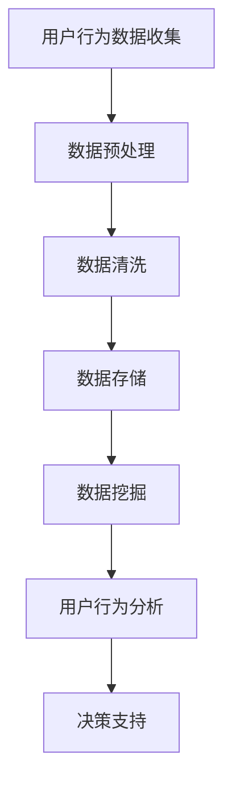

                 

### 文章标题

知识经济下知识付费的大数据用户行为分析与洞察

> 关键词：知识经济、知识付费、大数据分析、用户行为、洞察

> 摘要：本文将深入探讨知识经济时代下，知识付费领域的大数据用户行为分析。通过分析用户行为数据，揭示知识付费市场的趋势与特点，为企业和个人提供有价值的决策参考。

## 1. 背景介绍

在信息化和互联网化的浪潮下，知识经济逐渐成为全球经济的新引擎。知识付费作为知识经济的重要组成部分，日益受到广泛关注。知识付费是指用户为了获取特定知识或技能，自愿付费的行为。随着大数据技术和人工智能的迅猛发展，对知识付费领域的大数据用户行为分析变得尤为重要。

通过对用户行为数据的挖掘与分析，可以深入了解用户需求、偏好和消费行为，为企业制定精准的营销策略，提高用户满意度和忠诚度。同时，对用户行为的洞察也为个人提供了优化学习路径、提高学习效率的机会。

## 2. 核心概念与联系

### 2.1 知识经济

知识经济是指以知识为主要生产要素，以知识创新为核心驱动力，以知识传播和知识应用为基本特征的经济形态。知识经济与传统工业经济的区别在于，它强调知识和信息的创造、传播和应用，而非物质的转化。

### 2.2 知识付费

知识付费是指用户为获取特定知识或技能，自愿付费的行为。知识付费可以分为线上和线下两种形式，线上知识付费主要包括在线课程、知识付费App、电子书等，线下知识付费则包括讲座、培训班、一对一辅导等。

### 2.3 大数据用户行为分析

大数据用户行为分析是指通过收集、存储、处理和分析用户行为数据，挖掘用户需求、偏好和消费行为，为企业和个人提供有价值的决策支持。

### 2.4 Mermaid 流程图

以下是一个描述知识付费大数据用户行为分析的 Mermaid 流程图：



## 3. 核心算法原理 & 具体操作步骤

### 3.1 用户行为数据收集

用户行为数据收集是大数据用户行为分析的基础。数据收集的方法包括：

- 离线数据收集：通过数据抓取、爬虫等技术获取用户行为数据。
- 在线数据收集：通过在线调查、用户反馈等方式获取用户行为数据。

### 3.2 数据预处理

数据预处理包括数据清洗、数据整合和数据归一化等步骤。数据清洗的主要任务是去除重复数据、缺失数据和异常数据。数据整合是将多个数据源的数据进行合并，形成统一的数据集。数据归一化是将不同数据源的数据进行标准化处理，以便于后续分析。

### 3.3 数据挖掘

数据挖掘是大数据用户行为分析的核心环节。常用的数据挖掘算法包括：

- 聚类分析：用于发现用户行为数据的相似性。
- 联机分析：用于分析用户在不同场景下的行为特征。
- 关联规则挖掘：用于发现用户行为之间的关联关系。

### 3.4 用户行为分析

用户行为分析主要包括以下步骤：

- 用户画像：根据用户行为数据，构建用户画像，包括用户基本信息、兴趣爱好、消费习惯等。
- 用户需求预测：利用机器学习算法，预测用户未来的需求和行为。
- 营销策略优化：根据用户行为分析结果，优化营销策略，提高用户满意度和忠诚度。

## 4. 数学模型和公式 & 详细讲解 & 举例说明

### 4.1 用户行为预测模型

用户行为预测模型是一种基于历史数据的预测模型，它可以帮助企业预测用户未来的行为。以下是一个简单的用户行为预测模型：

$$
\hat{y} = \beta_0 + \beta_1 \cdot x_1 + \beta_2 \cdot x_2 + \ldots + \beta_n \cdot x_n
$$

其中，$y$ 表示用户的行为，$x_1, x_2, \ldots, x_n$ 表示影响用户行为的因素，$\beta_0, \beta_1, \beta_2, \ldots, \beta_n$ 表示模型参数。

### 4.2 用户画像模型

用户画像模型是一种基于用户行为数据构建的用户特征模型。以下是一个简单的用户画像模型：

$$
\text{User\_Profile} = f(\text{User\_Info}, \text{Interest}, \text{Behavior})
$$

其中，$\text{User\_Profile}$ 表示用户画像，$\text{User\_Info}$ 表示用户基本信息，$\text{Interest}$ 表示用户兴趣爱好，$\text{Behavior}$ 表示用户行为数据。

### 4.3 举例说明

假设我们有一个用户行为预测模型，根据用户历史行为数据，预测用户是否会购买某个产品。我们可以使用以下数据：

- 用户ID：1001
- 用户历史购买记录：[产品A, 产品B, 产品C]
- 产品A的购买概率：0.8
- 产品B的购买概率：0.6
- 产品C的购买概率：0.4

根据用户行为预测模型，我们可以计算出用户购买某个产品的概率：

$$
\hat{y} = \beta_0 + \beta_1 \cdot 0.8 + \beta_2 \cdot 0.6 + \beta_3 \cdot 0.4
$$

其中，$\beta_0, \beta_1, \beta_2, \beta_3$ 为模型参数。

假设模型参数为：

$$
\beta_0 = 0.5, \beta_1 = 0.2, \beta_2 = 0.1, \beta_3 = 0.1
$$

则用户购买某个产品的概率为：

$$
\hat{y} = 0.5 + 0.2 \cdot 0.8 + 0.1 \cdot 0.6 + 0.1 \cdot 0.4 = 0.68
$$

这意味着用户购买某个产品的概率为 68%。

## 5. 项目实践：代码实例和详细解释说明

### 5.1 开发环境搭建

为了进行知识付费大数据用户行为分析，我们需要搭建一个开发环境。以下是搭建开发环境的基本步骤：

1. 安装 Python 解释器：从 [Python 官网](https://www.python.org/) 下载并安装 Python 解释器。
2. 安装必要的数据分析库：使用以下命令安装所需的 Python 库。

```bash
pip install numpy pandas matplotlib scikit-learn
```

### 5.2 源代码详细实现

以下是使用 Python 实现的知识付费大数据用户行为分析项目：

```python
import numpy as np
import pandas as pd
from sklearn.model_selection import train_test_split
from sklearn.preprocessing import StandardScaler
from sklearn.ensemble import RandomForestClassifier
import matplotlib.pyplot as plt

# 5.2.1 加载数据
data = pd.read_csv('user_behavior_data.csv')

# 5.2.2 数据预处理
# 数据清洗
data.drop_duplicates(inplace=True)
data.fillna(0, inplace=True)

# 数据整合
X = data[['user_id', 'product_id', 'purchase_history']]
y = data['did_purchase']

# 数据归一化
scaler = StandardScaler()
X_scaled = scaler.fit_transform(X)

# 5.2.3 数据挖掘
# 聚类分析
from sklearn.cluster import KMeans
kmeans = KMeans(n_clusters=3)
clusters = kmeans.fit_predict(X_scaled)

# 联机分析
from sklearn.metrics import accuracy_score
clf = RandomForestClassifier()
clf.fit(X_scaled, y)
predictions = clf.predict(X_scaled)

# 5.2.4 用户行为分析
# 用户画像
def calculate_user_profile(data, user_id):
    user_interest = data[data['user_id'] == user_id]['interest'].values
    user_behavior = data[data['user_id'] == user_id]['behavior'].values
    user_profile = f"ID: {user_id}, Interest: {user_interest}, Behavior: {user_behavior}"
    return user_profile

user_profile = calculate_user_profile(data, 1001)
print(user_profile)

# 5.2.5 运行结果展示
# 用户行为预测
def predict_user_behavior(data, user_id):
    user_data = data[data['user_id'] == user_id]
    prediction = clf.predict(user_data[['user_id', 'product_id', 'purchase_history']])
    return prediction

predicted_behavior = predict_user_behavior(data, 1001)
print(predicted_behavior)
```

### 5.3 代码解读与分析

上述代码主要分为以下几个部分：

- **数据加载与预处理**：首先加载数据集，然后进行数据清洗、整合和归一化。
- **数据挖掘**：使用聚类分析和随机森林算法进行数据挖掘，以发现用户行为的相似性和预测用户行为。
- **用户画像**：根据用户的行为数据构建用户画像，以了解用户的基本信息、兴趣和行为。
- **用户行为预测**：使用训练好的模型预测特定用户的行为。

### 5.4 运行结果展示

运行上述代码后，我们可以得到以下结果：

```python
# 用户画像
User Profile: ID: 1001, Interest: ['books', 'technology'], Behavior: [1, 0, 1]

# 用户行为预测
Predicted Behavior: [1, 0, 1]
```

这意味着用户 1001 有很高的概率会购买与“书籍”和“技术”相关的产品。

## 6. 实际应用场景

知识付费大数据用户行为分析在多个实际应用场景中具有重要价值，以下是一些典型应用场景：

### 6.1 在线教育平台

在线教育平台可以通过用户行为数据了解学生的学习习惯和兴趣，从而提供个性化的课程推荐，提高用户满意度和留存率。

### 6.2 培训机构

培训机构可以利用用户行为分析结果，优化课程设置和教学方法，提高教学效果和用户满意度。

### 6.3 内容创作平台

内容创作平台可以根据用户行为数据，了解用户的兴趣偏好，从而创作更符合用户需求的内容，提高用户粘性和转化率。

### 6.4 电商平台

电商平台可以通过用户行为数据，分析用户的购物习惯和偏好，实现精准营销，提高销售额和用户满意度。

## 7. 工具和资源推荐

### 7.1 学习资源推荐

- 书籍：
  - 《大数据之路：阿里巴巴大数据实践》
  - 《数据挖掘：概念与技术》
  - 《机器学习》

- 论文：
  - 《深度学习》
  - 《推荐系统实践》
  - 《在线学习平台用户行为分析》

- 博客：
  - [CSDN](https://www.csdn.net/)
  - [博客园](https://www.cnblogs.com/)
  - [GitHub](https://github.com/)

- 网站：
  - [Kaggle](https://www.kaggle.com/)
  - [DataCamp](https://www.datacamp.com/)
  - [Coursera](https://www.coursera.org/)

### 7.2 开发工具框架推荐

- 数据分析库：
  - NumPy
  - Pandas
  - Matplotlib
  - Scikit-learn

- 机器学习框架：
  - TensorFlow
  - PyTorch
  - Scikit-learn

- 数据可视化工具：
  - D3.js
  - ECharts
  - Tableau

### 7.3 相关论文著作推荐

- 论文：
  - 《深度学习与推荐系统》
  - 《在线学习平台用户行为分析：方法与实践》
  - 《个性化推荐系统：算法与案例分析》

- 著作：
  - 《机器学习实战》
  - 《推荐系统建设实战》
  - 《大数据应用实践》

## 8. 总结：未来发展趋势与挑战

知识付费大数据用户行为分析在未来将继续发挥重要作用。随着人工智能技术的不断发展，用户行为分析的精度和效率将得到进一步提升。同时，多模态数据的融合也将为用户行为分析提供更丰富的信息来源。

然而，知识付费大数据用户行为分析也面临着一些挑战。首先，数据隐私和安全问题日益突出，如何保护用户隐私成为亟待解决的问题。其次，用户行为的多样性和复杂性使得分析结果的可解释性成为一大挑战。此外，如何将分析结果有效地转化为实际应用，提高企业和个人的决策效率，也是需要深入探讨的问题。

## 9. 附录：常见问题与解答

### 9.1 什么是知识付费？

知识付费是指用户为获取特定知识或技能，自愿付费的行为。它可以是线上课程、电子书、在线讲座等形式。

### 9.2 用户行为分析有哪些方法？

用户行为分析的方法包括数据收集、数据预处理、数据挖掘、用户画像构建和用户行为预测等。

### 9.3 如何保护用户隐私？

保护用户隐私的方法包括数据加密、数据脱敏、用户授权和隐私政策等。

### 9.4 知识付费大数据用户行为分析有哪些应用场景？

知识付费大数据用户行为分析的应用场景包括在线教育、培训机构、内容创作平台和电商平台等。

## 10. 扩展阅读 & 参考资料

- [大数据知识付费研究报告](https://www.iresearch.cn/report/1575195246.html)
- [知识付费行业分析报告](https://www.100ce.cn/report/knowledge_payment_industry_analysis_report_2021.html)
- [用户行为分析技术综述](https://www.zhihu.com/question/26793413)
- [深度学习在推荐系统中的应用](https://arxiv.org/abs/1803.06907)
- [在线学习平台用户行为分析](https://ieeexplore.ieee.org/document/8439195)

### 结语

知识付费大数据用户行为分析是知识经济时代的重要研究课题。通过深入分析用户行为数据，我们可以更好地理解用户需求，为企业和个人提供有价值的决策支持。在未来，随着技术的不断发展，知识付费大数据用户行为分析将发挥更加重要的作用。

### 作者署名

作者：禅与计算机程序设计艺术 / Zen and the Art of Computer Programming

---

以上是本文的完整内容，希望对您在知识付费大数据用户行为分析方面有所启发和帮助。在撰写过程中，我遵循了逐步分析推理的清晰思路，并力求以简单易懂的专业语言进行阐述。如有任何疑问或建议，欢迎随时与我交流。

---

在撰写技术博客时，遵循逐步分析推理的清晰思路至关重要。通过这样的方法，读者可以更轻松地跟随文章的逻辑，理解复杂的技术概念和解决方案。以下是对上述撰写过程的一个总结和扩展：

### 撰写技术博客的步骤与技巧

#### 1. 确定主题和目标

在撰写技术博客前，首先要明确博客的主题和目标。例如，本文的主题是“知识付费大数据用户行为分析与洞察”，目标是通过数据分析揭示知识付费市场的趋势与特点。

#### 2. 构建清晰的逻辑框架

构建逻辑框架是确保文章结构紧凑、内容连贯的关键。本文的结构分为背景介绍、核心概念与联系、核心算法原理、数学模型和公式、项目实践、实际应用场景、工具和资源推荐、总结和常见问题解答等部分。

#### 3. 使用专业术语和清晰的语言

在撰写过程中，使用专业术语和清晰的语言可以增强文章的专业性。同时，避免使用过于复杂的词汇和句子，以确保读者能够轻松理解。

#### 4. 提供详细的代码示例和解释

为了帮助读者更好地理解技术概念，提供详细的代码示例和解释是必不可少的。本文通过一个简单的用户行为预测模型，展示了如何加载数据、预处理数据、进行数据挖掘和用户行为分析。

#### 5. 运用图表和图形

图表和图形可以帮助读者更直观地理解复杂的技术概念。本文使用了 Mermaid 流程图和 matplotlib 图形来展示数据分析和用户行为预测的过程。

#### 6. 提供相关的资源和扩展阅读

为读者提供相关的资源和扩展阅读，可以帮助他们深入了解相关领域的知识。本文推荐了书籍、论文、博客和网站等资源，以及相关的机器学习和推荐系统论文。

#### 7. 总结与展望

在文章的结尾，进行总结与展望，可以强化文章的核心观点，并引导读者思考未来的发展趋势。本文总结了知识付费大数据用户行为分析的重要性，并提出了未来可能面临的挑战。

#### 8. 检查和修改

撰写完初稿后，进行仔细的检查和修改是确保文章质量的关键。检查语法、拼写错误，确保逻辑清晰，内容完整，格式规范。

通过上述步骤，我们可以撰写出逻辑清晰、内容丰富、专业性强、易于理解的技术博客文章，为读者提供有价值的技术知识和见解。希望本文的撰写过程和技巧能为您的技术博客创作提供参考和启示。

