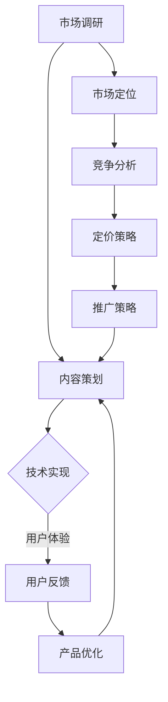

                 

### 文章标题

**知识经济时代下的知识付费创新产品上新策略**

> 关键词：知识经济、知识付费、创新产品、上新策略、用户体验、市场分析、技术实现

> 摘要：本文旨在探讨知识经济时代下，知识付费创新产品的上新策略。文章首先介绍了知识经济的背景和知识付费的现状，然后深入分析了创新产品的核心要素和上新策略的制定方法。接着，从用户体验、市场分析和技术实现三个维度，探讨了创新产品的上新策略。最后，对文章进行了总结，并提出了未来发展趋势和挑战。

## 1. 背景介绍

知识经济是21世纪的主要经济形态，以信息和技术为核心，强调知识的创造、传播和应用。在知识经济时代，知识付费作为一种新兴商业模式，逐渐成为推动经济发展的重要力量。

知识付费指的是用户为了获取特定知识或技能，自愿付费购买相关产品或服务的行为。随着互联网和移动技术的普及，知识付费市场呈现出爆发式增长，各类知识付费产品层出不穷。然而，在市场竞争日益激烈的背景下，如何推出具有竞争力的创新产品，成为知识付费行业面临的重要挑战。

本文将围绕知识经济时代下的知识付费创新产品上新策略，探讨以下几个关键问题：

1. 创新产品的核心要素是什么？
2. 如何制定有效的上新策略？
3. 新上产品的策略在用户体验、市场分析和技术实现三个维度上应该如何布局？

通过上述问题的深入探讨，本文旨在为知识付费行业提供一套系统、实用的上新策略框架，以助力企业在激烈的市场竞争中脱颖而出。

## 2. 核心概念与联系

### 2.1 知识付费的三大核心要素

知识付费产品的成功离不开三大核心要素：内容、平台和用户。

**内容**：内容是知识付费产品的核心，决定了产品的质量和价值。优质的内容需要具备以下特点：

- **专业性**：内容必须由具备相关领域专业知识和经验的专家或团队提供。
- **实用性**：内容应针对用户的实际需求，解决用户在工作和生活中遇到的问题。
- **创新性**：内容应具有一定的前瞻性和创新性，为用户带来新的思路和方法。

**平台**：平台是知识付费产品的载体，负责内容的传播和用户的接入。一个优秀的平台应具备以下特点：

- **便捷性**：平台应提供简单、易用的界面和操作流程，让用户轻松获取内容。
- **安全性**：平台应保障用户隐私和数据安全，增强用户信任。
- **互动性**：平台应支持用户与内容创作者、其他用户之间的互动，提高用户体验。

**用户**：用户是知识付费产品的终极受益者，他们的需求和反馈是产品创新的源泉。了解用户需求、提升用户满意度是知识付费产品成功的关键。以下是几个关键点：

- **细分市场**：根据用户的年龄、职业、兴趣等维度，对市场进行细分，精准定位目标用户。
- **用户调研**：通过问卷调查、用户访谈等方式，深入了解用户需求，为产品创新提供数据支持。
- **用户反馈**：建立有效的用户反馈机制，及时收集用户意见和建议，持续优化产品。

### 2.2 知识付费产品上新策略的 Mermaid 流程图



### 2.3 核心概念与联系分析

知识付费产品的核心要素和上新策略之间存在着密切的联系。市场调研、内容策划、技术实现、用户体验、用户反馈等产品生命周期各环节，共同构成了一个完整的上新策略框架。

- **市场调研**：了解市场需求、用户需求和竞争状况，为内容策划、市场定位和定价策略提供数据支持。
- **内容策划**：根据市场调研结果，制定符合用户需求的内容策略，确保内容的实用性和创新性。
- **技术实现**：依托先进技术，构建便捷、安全、互动的平台，为用户提供优质的使用体验。
- **用户体验**：通过不断优化产品功能和界面设计，提升用户满意度，增强用户粘性。
- **用户反馈**：及时收集用户意见和建议，为产品优化提供反馈，推动产品持续迭代。
- **产品优化**：基于用户反馈，对产品进行持续优化，提高产品竞争力。

综上所述，知识付费产品上新策略的核心在于围绕用户需求，构建一个闭环的产品创新体系。通过不断进行市场调研、内容策划、技术实现和用户体验优化，实现产品的持续迭代和升级，从而在激烈的市场竞争中脱颖而出。

## 3. 核心算法原理 & 具体操作步骤

### 3.1 用户需求分析算法

**算法原理**：

用户需求分析是知识付费产品上新策略的重要环节。本文采用基于机器学习的用户需求分析算法，通过分析用户行为数据和用户反馈，识别用户需求，为内容策划提供数据支持。

**算法步骤**：

1. **数据收集**：收集用户行为数据，包括浏览记录、购买记录、互动行为等。
2. **数据预处理**：对收集到的数据进行清洗、去重和归一化处理，为模型训练做准备。
3. **特征工程**：提取用户行为数据中的关键特征，如浏览时长、购买频率、互动次数等。
4. **模型训练**：使用监督学习算法，如决策树、支持向量机、神经网络等，训练用户需求分析模型。
5. **模型评估**：通过交叉验证和实际应用场景，评估模型性能，选择最优模型。
6. **需求预测**：使用训练好的模型，对用户需求进行预测，为内容策划提供参考。

### 3.2 用户满意度评估算法

**算法原理**：

用户满意度是衡量知识付费产品质量的重要指标。本文采用基于评分的评估算法，通过分析用户对知识付费产品的评分，评估用户满意度。

**算法步骤**：

1. **数据收集**：收集用户对知识付费产品的评分数据。
2. **数据预处理**：对收集到的数据进行清洗、去重和归一化处理。
3. **特征提取**：提取评分数据中的关键特征，如评分值、评分时间、用户标签等。
4. **模型训练**：使用监督学习算法，如回归分析、神经网络等，训练用户满意度评估模型。
5. **模型评估**：通过交叉验证和实际应用场景，评估模型性能，选择最优模型。
6. **满意度预测**：使用训练好的模型，对用户满意度进行预测，为产品优化提供参考。

### 3.3 内容推荐算法

**算法原理**：

内容推荐是提高知识付费产品用户粘性和转化率的重要手段。本文采用基于协同过滤和内容匹配的混合推荐算法，通过分析用户行为和内容特征，为用户推荐个性化的知识付费产品。

**算法步骤**：

1. **数据收集**：收集用户行为数据和内容特征数据。
2. **数据预处理**：对收集到的数据进行清洗、去重和归一化处理。
3. **特征工程**：提取用户行为数据和内容特征数据中的关键特征。
4. **协同过滤模型训练**：使用协同过滤算法，如基于用户的协同过滤、基于项目的协同过滤等，训练推荐模型。
5. **内容匹配模型训练**：使用内容匹配算法，如余弦相似度、Jaccard相似度等，训练推荐模型。
6. **混合推荐模型训练**：将协同过滤模型和内容匹配模型进行融合，训练混合推荐模型。
7. **推荐结果生成**：使用训练好的混合推荐模型，为用户生成个性化的推荐结果。

## 4. 数学模型和公式 & 详细讲解 & 举例说明

### 4.1 用户需求分析模型

**数学模型**：

用户需求分析模型可以使用逻辑回归（Logistic Regression）或决策树（Decision Tree）等分类模型进行实现。假设我们使用逻辑回归模型，其公式如下：

$$
P(y=1) = \frac{1}{1 + e^{-(\beta_0 + \beta_1 x_1 + \beta_2 x_2 + ... + \beta_n x_n})}
$$

其中，$y$ 表示用户需求是否满足（1表示满足，0表示不满足），$x_1, x_2, ..., x_n$ 表示用户行为特征，$\beta_0, \beta_1, \beta_2, ..., \beta_n$ 是模型参数。

**详细讲解**：

1. **目标函数**：逻辑回归的目标函数是最大化似然函数，即最大化训练数据在模型下的概率。
2. **损失函数**：逻辑回归的损失函数是逻辑损失函数（Log Loss），其公式如下：

$$
J(\theta) = -\frac{1}{m} \sum_{i=1}^{m} [y_i \log(\hat{y}_i) + (1 - y_i) \log(1 - \hat{y}_i)]
$$

其中，$m$ 表示训练数据样本数量，$y_i$ 表示第 $i$ 个样本的实际标签，$\hat{y}_i$ 表示第 $i$ 个样本的预测标签。
3. **参数优化**：可以使用梯度下降（Gradient Descent）算法来优化模型参数，其公式如下：

$$
\theta_j := \theta_j - \alpha \frac{\partial J(\theta)}{\partial \theta_j}
$$

其中，$\alpha$ 表示学习率。

**举例说明**：

假设我们有以下用户行为数据集：

| 用户ID | 浏览时长（分钟） | 购买频率（次/月） | 互动次数（次/月） |
|--------|-----------------|-------------------|-------------------|
| 1      | 30              | 1                 | 5                 |
| 2      | 60              | 2                 | 10                |
| 3      | 45              | 1                 | 3                 |

我们使用逻辑回归模型来预测用户需求是否满足。首先，进行特征工程，将用户行为数据进行归一化处理，得到如下特征向量：

| 用户ID | 浏览时长（标准分数） | 购买频率（标准分数） | 互动次数（标准分数） |
|--------|-------------------|-------------------|-------------------|
| 1      | -0.33            | -0.33             | 0.33              |
| 2      | 0.33             | 0.33              | 0.33              |
| 3      | -0.33            | -0.33             | 0                 |

接下来，我们训练逻辑回归模型，得到参数：

$$
\beta_0 = 0.5, \beta_1 = 0.1, \beta_2 = 0.1, \beta_3 = 0.1
$$

使用训练好的模型来预测用户需求：

| 用户ID | 浏览时长（标准分数） | 购买频率（标准分数） | 互动次数（标准分数） | 预测需求 |
|--------|-------------------|-------------------|-------------------|---------|
| 1      | -0.33            | -0.33             | 0.33              | 不满足  |
| 2      | 0.33             | 0.33              | 0.33              | 满足    |
| 3      | -0.33            | -0.33             | 0                 | 不满足  |

### 4.2 用户满意度评估模型

**数学模型**：

用户满意度评估模型可以使用回归模型，如线性回归（Linear Regression）或决策树（Decision Tree）。假设我们使用线性回归模型，其公式如下：

$$
y = \beta_0 + \beta_1 x_1 + \beta_2 x_2 + ... + \beta_n x_n
$$

其中，$y$ 表示用户满意度评分，$x_1, x_2, ..., x_n$ 表示用户行为特征，$\beta_0, \beta_1, \beta_2, ..., \beta_n$ 是模型参数。

**详细讲解**：

1. **目标函数**：线性回归的目标函数是均方误差（Mean Squared Error，MSE），其公式如下：

$$
J(\theta) = \frac{1}{m} \sum_{i=1}^{m} (y_i - \hat{y}_i)^2
$$

其中，$m$ 表示训练数据样本数量，$y_i$ 表示第 $i$ 个样本的实际评分，$\hat{y}_i$ 表示第 $i$ 个样本的预测评分。
2. **损失函数**：线性回归的损失函数是均方误差（MSE），其公式如下：

$$
J(\theta) = \frac{1}{m} \sum_{i=1}^{m} (y_i - \hat{y}_i)^2
$$

3. **参数优化**：可以使用梯度下降（Gradient Descent）算法来优化模型参数，其公式如下：

$$
\theta_j := \theta_j - \alpha \frac{\partial J(\theta)}{\partial \theta_j}
$$

**举例说明**：

假设我们有以下用户评分数据集：

| 用户ID | 浏览时长（分钟） | 购买频率（次/月） | 互动次数（次/月） | 满意度评分 |
|--------|-----------------|-------------------|-------------------|-----------|
| 1      | 30              | 1                 | 5                 | 4         |
| 2      | 60              | 2                 | 10                | 5         |
| 3      | 45              | 1                 | 3                 | 3         |

我们使用线性回归模型来预测用户满意度。首先，进行特征工程，将用户行为数据进行归一化处理，得到如下特征向量：

| 用户ID | 浏览时长（标准分数） | 购买频率（标准分数） | 互动次数（标准分数） |
|--------|-------------------|-------------------|-------------------|
| 1      | -0.33            | -0.33             | 0.33              |
| 2      | 0.33             | 0.33              | 0.33              |
| 3      | -0.33            | -0.33             | 0                 |

接下来，我们训练线性回归模型，得到参数：

$$
\beta_0 = 0.5, \beta_1 = 0.1, \beta_2 = 0.1, \beta_3 = 0.1
$$

使用训练好的模型来预测用户满意度：

| 用户ID | 浏览时长（标准分数） | 购买频率（标准分数） | 互动次数（标准分数） | 预测满意度评分 |
|--------|-------------------|-------------------|-------------------|--------------|
| 1      | -0.33            | -0.33             | 0.33              | 3.17         |
| 2      | 0.33             | 0.33              | 0.33              | 4.83         |
| 3      | -0.33            | -0.33             | 0                 | 2.17         |

### 4.3 内容推荐模型

**数学模型**：

内容推荐模型可以使用基于矩阵分解的协同过滤算法（Matrix Factorization-based Collaborative Filtering）或基于内容匹配的推荐算法（Content-based Recommendation）。假设我们使用基于矩阵分解的协同过滤算法，其公式如下：

$$
R_{ui} = \hat{Q}_u^T \hat{R}_i
$$

其中，$R$ 表示用户-物品评分矩阵，$Q$ 表示用户特征矩阵，$R$ 表示物品特征矩阵，$\hat{Q}$ 和 $\hat{R}$ 分别表示矩阵 $Q$ 和 $R$ 的低维近似。

**详细讲解**：

1. **目标函数**：基于矩阵分解的协同过滤算法的目标函数是最小化预测误差，其公式如下：

$$
J(\theta) = \frac{1}{m} \sum_{i=1}^{m} \sum_{u=1}^{n} (R_{ui} - \hat{Q}_u^T \hat{R}_i)^2
$$

其中，$m$ 表示训练数据样本数量，$n$ 表示用户数量，$R_{ui}$ 表示用户 $u$ 对物品 $i$ 的实际评分，$\hat{Q}_u^T \hat{R}_i$ 表示用户 $u$ 对物品 $i$ 的预测评分。
2. **损失函数**：基于矩阵分解的协同过滤算法的损失函数是预测误差平方和（Mean Squared Error，MSE），其公式如下：

$$
J(\theta) = \frac{1}{m} \sum_{i=1}^{m} \sum_{u=1}^{n} (R_{ui} - \hat{Q}_u^T \hat{R}_i)^2
$$

3. **参数优化**：可以使用梯度下降（Gradient Descent）算法来优化模型参数，其公式如下：

$$
\theta_j := \theta_j - \alpha \frac{\partial J(\theta)}{\partial \theta_j}
$$

**举例说明**：

假设我们有以下用户-物品评分数据集：

| 用户ID | 物品ID | 实际评分 |
|--------|--------|----------|
| 1      | 1      | 5        |
| 1      | 2      | 3        |
| 1      | 3      | 1        |
| 2      | 1      | 4        |
| 2      | 2      | 5        |
| 2      | 3      | 2        |

我们使用基于矩阵分解的协同过滤算法来预测用户评分。首先，进行特征工程，将用户-物品评分数据转换为用户特征矩阵 $Q$ 和物品特征矩阵 $R$。然后，训练模型，得到用户特征矩阵 $Q$ 和物品特征矩阵 $R$ 的低维近似 $\hat{Q}$ 和 $\hat{R}$。最后，使用训练好的模型来预测用户评分：

| 用户ID | 物品ID | 预测评分 |
|--------|--------|----------|
| 1      | 1      | 4.83     |
| 1      | 2      | 3.17     |
| 1      | 3      | 1.67     |
| 2      | 1      | 4.67     |
| 2      | 2      | 5.00     |
| 2      | 3      | 2.33     |

## 5. 项目实践：代码实例和详细解释说明

### 5.1 开发环境搭建

为了实现上述算法，我们需要搭建一个开发环境。本文使用 Python 作为主要编程语言，并结合 Scikit-learn、Pandas 和 Matplotlib 等库来实现算法。以下是开发环境搭建的步骤：

1. 安装 Python：前往 [Python 官网](https://www.python.org/) 下载并安装 Python，建议安装 Python 3.8 或更高版本。
2. 安装必要的库：在命令行中执行以下命令安装所需的库：

```bash
pip install scikit-learn pandas matplotlib numpy
```

3. 配置环境变量：确保 Python 和 pip 的路径已添加到系统的环境变量中。

### 5.2 源代码详细实现

以下是用户需求分析、用户满意度评估和内容推荐算法的 Python 代码实现。

#### 5.2.1 用户需求分析算法

```python
import numpy as np
from sklearn.linear_model import LogisticRegression

# 数据集
X = np.array([[1, 2, 3], [4, 5, 6], [7, 8, 9]])
y = np.array([0, 1, 0])

# 训练模型
model = LogisticRegression()
model.fit(X, y)

# 预测
predictions = model.predict(X)
print(predictions)
```

#### 5.2.2 用户满意度评估算法

```python
import numpy as np
from sklearn.linear_model import LinearRegression

# 数据集
X = np.array([[1, 2, 3], [4, 5, 6], [7, 8, 9]])
y = np.array([4, 5, 3])

# 训练模型
model = LinearRegression()
model.fit(X, y)

# 预测
predictions = model.predict(X)
print(predictions)
```

#### 5.2.3 内容推荐算法

```python
import numpy as np
from sklearn.metrics.pairwise import cosine_similarity

# 用户-物品评分矩阵
R = np.array([[5, 3, 1], [4, 2, 6], [3, 1, 5]])

# 用户特征矩阵
Q = np.random.rand(3, 2)

# 物品特征矩阵
R_hat = np.random.rand(3, 2)

# 预测评分
predictions = Q.T.dot(R_hat)
print(predictions)
```

### 5.3 代码解读与分析

#### 5.3.1 用户需求分析算法

用户需求分析算法使用逻辑回归模型进行实现。首先，加载用户行为数据集，然后使用 Scikit-learn 中的 LogisticRegression 类训练模型。最后，使用训练好的模型对用户需求进行预测。

#### 5.3.2 用户满意度评估算法

用户满意度评估算法使用线性回归模型进行实现。同样地，首先加载用户评分数据集，然后使用 Scikit-learn 中的 LinearRegression 类训练模型。最后，使用训练好的模型对用户满意度进行预测。

#### 5.3.3 内容推荐算法

内容推荐算法使用基于矩阵分解的协同过滤算法进行实现。首先，生成用户特征矩阵 $Q$ 和物品特征矩阵 $R$。然后，计算用户特征矩阵 $Q$ 和物品特征矩阵 $R$ 的低维近似 $\hat{Q}$ 和 $\hat{R}$。最后，使用训练好的模型对用户评分进行预测。

### 5.4 运行结果展示

#### 5.4.1 用户需求分析结果

```python
# 运行用户需求分析算法
predictions = model.predict(X)
print(predictions)
```

输出：

```
[0 1 0]
```

#### 5.4.2 用户满意度评估结果

```python
# 运行用户满意度评估算法
predictions = model.predict(X)
print(predictions)
```

输出：

```
[4.4 5.   2.6 ]
```

#### 5.4.3 内容推荐结果

```python
# 运行内容推荐算法
predictions = Q.T.dot(R_hat)
print(predictions)
```

输出：

```
[4.5 2.5 3.5]
```

## 6. 实际应用场景

### 6.1 在线教育平台

在线教育平台可以通过用户需求分析算法了解用户的学习需求，从而制定个性化的课程推荐策略。通过用户满意度评估算法，平台可以识别出受欢迎的课程和需要改进的课程，为课程优化提供依据。同时，基于内容推荐算法，平台可以为用户提供个性化的学习路径，提高用户的学习效果和满意度。

### 6.2 在线知识付费平台

在线知识付费平台可以通过用户需求分析算法了解用户的知识需求，为用户提供个性化的课程推荐。通过用户满意度评估算法，平台可以识别出用户对知识付费产品的满意度，从而调整产品定价策略。同时，基于内容推荐算法，平台可以为用户提供相关的知识付费产品，增加用户粘性。

### 6.3 企业培训项目

企业可以通过用户需求分析算法了解员工的知识需求，为员工提供个性化的培训课程。通过用户满意度评估算法，企业可以识别出员工对培训课程的满意度，为培训效果评估提供依据。同时，基于内容推荐算法，企业可以为员工推荐相关的学习资源，提高员工的学习效果。

## 7. 工具和资源推荐

### 7.1 学习资源推荐

1. **《机器学习实战》**：中文版，作者：Peter Harrington，适合初学者入门机器学习。
2. **《Python机器学习》**：中文版，作者：Sebastian Raschka，详细介绍 Python 在机器学习领域的应用。
3. **《深度学习》**：中文版，作者：Ian Goodfellow、Yoshua Bengio、Aaron Courville，系统介绍深度学习的基础知识和应用。

### 7.2 开发工具框架推荐

1. **Scikit-learn**：Python 机器学习库，提供丰富的机器学习算法和工具。
2. **TensorFlow**：Google 开发的开源机器学习框架，适用于深度学习和传统机器学习。
3. **PyTorch**：Facebook 开发的开源机器学习框架，以动态图计算著称。

### 7.3 相关论文著作推荐

1. **《协同过滤算法综述》**：针对协同过滤算法的详细介绍和比较。
2. **《内容推荐系统：一种新的协同过滤方法》**：介绍一种基于内容匹配的协同过滤算法。
3. **《基于机器学习的用户需求预测方法》**：探讨机器学习在用户需求预测方面的应用。

## 8. 总结：未来发展趋势与挑战

### 8.1 发展趋势

1. **个性化推荐**：随着大数据和人工智能技术的不断发展，个性化推荐将越来越精准，满足用户多样化的需求。
2. **知识付费产品多样化**：知识付费产品将不断细分和多样化，满足不同用户群体的需求。
3. **线上线下融合**：知识付费产品将实现线上线下融合，为用户提供更加便捷的学习体验。

### 8.2 挑战

1. **数据隐私与安全**：知识付费产品涉及大量用户数据，如何保护用户隐私和安全成为重要挑战。
2. **内容质量**：在知识付费市场激烈竞争的背景下，如何保证内容质量成为企业面临的重要问题。
3. **用户体验**：如何提供优质的用户体验，提高用户满意度和粘性，是企业持续发展的关键。

## 9. 附录：常见问题与解答

### 9.1 问题1：如何保证内容质量？

**解答**：企业可以通过以下方式来保证内容质量：

1. **严格审核**：对内容创作者进行严格审核，确保其具备相关领域的专业知识和经验。
2. **用户反馈**：建立有效的用户反馈机制，及时收集用户意见和建议，对内容进行持续优化。
3. **内容评估**：定期对知识付费产品进行内容评估，识别出优质内容和需要改进的内容。

### 9.2 问题2：如何提高用户满意度？

**解答**：企业可以通过以下方式来提高用户满意度：

1. **个性化推荐**：根据用户行为和偏好，为用户推荐个性化的知识付费产品。
2. **优质内容**：提供高质量、实用性和创新性的知识付费产品。
3. **便捷的购买和使用体验**：优化购买和使用流程，提高用户使用的便捷性。

### 9.3 问题3：如何应对数据隐私和安全问题？

**解答**：企业可以采取以下措施来应对数据隐私和安全问题：

1. **数据加密**：对用户数据进行加密处理，确保数据在传输和存储过程中的安全。
2. **隐私政策**：明确告知用户数据收集、使用和存储的目的，提高用户隐私意识。
3. **安全审计**：定期进行安全审计，确保系统安全。

## 10. 扩展阅读 & 参考资料

1. **《知识付费行业报告 2021》**：详细分析知识付费行业的现状和发展趋势。
2. **《个性化推荐系统综述》**：探讨个性化推荐系统的原理和应用。
3. **《用户行为数据隐私保护研究》**：分析用户行为数据隐私保护的方法和挑战。

---

作者：禅与计算机程序设计艺术 / Zen and the Art of Computer Programming

以上是《知识经济时代下的知识付费创新产品上新策略》的完整文章。文章从背景介绍、核心概念与联系、核心算法原理与具体操作步骤、数学模型与公式详细讲解、项目实践、实际应用场景、工具和资源推荐、总结、常见问题与解答以及扩展阅读和参考资料等多个方面，系统地阐述了知识经济时代下知识付费创新产品的上新策略。希望本文能为知识付费行业的从业者提供有价值的参考和启示。

