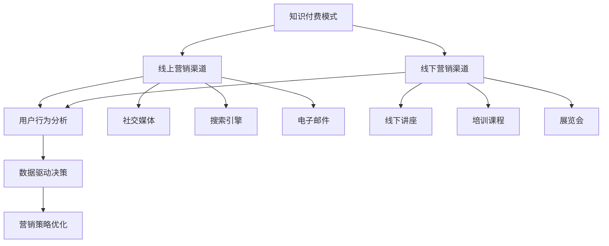

                 

### 背景介绍

在知识经济时代，信息爆炸和技术快速迭代使得知识的获取与传播变得尤为重要。知识付费作为一种新兴的经济模式，已经成为许多企业和个人的重要收入来源。知识付费的核心在于通过高质量的内容和服务满足用户的需求，从而实现知识价值的转化。然而，随着市场的逐渐成熟，用户对于知识付费产品的需求愈发多样化和个性化，这要求知识付费平台在营销渠道的拓展上不断创新。

当前，知识付费市场面临以下几个主要挑战：

1. **同质化竞争激烈**：众多知识付费平台提供类似的产品和服务，导致用户选择困难，市场竞争愈发激烈。
2. **用户粘性不足**：用户对于知识付费产品的忠诚度较低，容易受到新产品的诱惑而流失。
3. **营销成本高**：传统营销手段效果逐渐减弱，而新型营销渠道的开发和运用又需要大量投入。

为了应对这些挑战，知识付费平台需要探索创新营销渠道，以提高用户获取率和留存率，实现可持续发展。本文旨在探讨知识经济时代下知识付费创新营销渠道的拓展策略，为相关企业提供理论指导和实践参考。

### 核心概念与联系

在探讨知识付费创新营销渠道之前，我们首先需要明确几个核心概念，以便建立整体框架。

#### 1. 知识付费模式

知识付费模式是指通过提供高质量的知识产品或服务，向用户收取一定费用以实现盈利的一种商业模式。常见的知识付费模式包括在线课程、专业咨询、付费阅读、技能认证等。这些模式共同构成了知识付费市场的多元化生态。

#### 2. 营销渠道

营销渠道是指产品或服务从生产者传递到消费者手中的路径。在知识付费领域，营销渠道主要包括线上和线下两种形式。线上渠道如社交媒体、搜索引擎、电子邮件等，线下渠道则包括线下讲座、培训、展览会等。

#### 3. 用户行为分析

用户行为分析是通过对用户在平台上的行为数据进行分析，了解用户需求、偏好和行为模式，从而优化产品和服务，提升用户体验。用户行为分析是创新营销渠道的重要基础。

#### 4. 数据驱动决策

数据驱动决策是指基于数据分析结果来指导营销策略的制定和执行。在知识付费领域，通过数据驱动决策，可以更加精准地定位用户需求，提高营销效率。

#### Mermaid 流程图

以下是知识付费创新营销渠道的核心概念及相互关系的 Mermaid 流程图：



通过这个流程图，我们可以清晰地看到知识付费模式如何通过线上和线下渠道与用户行为分析相结合，最终实现营销策略的优化。

### 核心算法原理 & 具体操作步骤

要实现知识付费创新营销渠道的拓展，我们需要借助数据驱动的方法，通过以下核心算法来优化营销策略。

#### 1. 用户画像构建

用户画像是指基于用户行为数据构建的用户全貌，包括用户的基本信息、兴趣偏好、消费行为等。构建用户画像的步骤如下：

1. **数据收集**：通过线上渠道（如网站、APP）和线下活动（如讲座、培训）收集用户行为数据。
2. **数据清洗**：对收集的数据进行清洗、去重和规范化处理。
3. **特征提取**：根据用户行为数据，提取关键特征，如浏览时间、购买记录、参与活动等。
4. **模型训练**：使用机器学习算法（如决策树、随机森林、神经网络）对特征进行训练，生成用户画像。

#### 2. 用户行为预测

用户行为预测是指基于用户画像预测用户在未来的行为，如购买意愿、订阅频率等。具体操作步骤如下：

1. **数据预处理**：对用户行为数据进行分析，找出影响用户行为的因素。
2. **特征工程**：对数据进行特征提取和转换，以提高模型预测的准确性。
3. **模型选择**：选择合适的机器学习模型（如线性回归、逻辑回归、SVM等），进行训练和验证。
4. **模型评估**：使用交叉验证、ROC曲线等评估指标，对模型进行评估和优化。

#### 3. 营销策略优化

基于用户行为预测结果，我们可以优化营销策略，提高营销效果。具体操作步骤如下：

1. **目标设定**：根据业务目标，确定营销策略优化的方向，如提高用户购买率、订阅率等。
2. **策略模拟**：使用模拟软件，模拟不同营销策略的效果，如推送内容、优惠券发放等。
3. **效果评估**：对比不同策略的效果，选择最优策略进行实施。
4. **持续优化**：根据用户反馈和营销效果，不断调整和优化营销策略。

#### 4. 数学模型和公式

以下是构建用户画像和用户行为预测的核心数学模型和公式：

##### 用户画像构建

$$
User\_Profile = f(User\_Data, Behavior\_Data)
$$

其中，$User\_Data$ 表示用户基本信息，如年龄、性别、职业等；$Behavior\_Data$ 表示用户行为数据，如浏览记录、购买记录、参与活动等。

##### 用户行为预测

$$
Prediction = f(User\_Profile, Model, Input\_Data)
$$

其中，$User\_Profile$ 表示用户画像，$Model$ 表示预测模型，$Input\_Data$ 表示输入数据。

##### 营销策略优化

$$
Optimized\_Strategy = f(Target, Simulation, Evaluation)
$$

其中，$Target$ 表示业务目标，$Simulation$ 表示策略模拟结果，$Evaluation$ 表示效果评估结果。

### 项目实践：代码实例和详细解释说明

为了更好地理解上述核心算法原理，我们将通过一个实际项目进行详细讲解。以下是项目实践的相关内容。

#### 1. 开发环境搭建

在开始项目实践之前，我们需要搭建一个开发环境。以下是开发环境的要求：

- 编程语言：Python 3.8
- 数据库：MySQL 5.7
- 机器学习库：Scikit-learn 0.24、Pandas 1.3、NumPy 1.21
- 数据可视化库：Matplotlib 3.5.1、Seaborn 0.12

安装以上依赖库后，我们就可以开始编写代码了。

#### 2. 源代码详细实现

以下是项目的核心代码实现：

##### 用户画像构建

```python
import pandas as pd
from sklearn.model_selection import train_test_split
from sklearn.ensemble import RandomForestClassifier

# 读取用户数据
user_data = pd.read_csv('user_data.csv')

# 数据预处理
user_data = user_data.drop_duplicates()
user_data = user_data.fillna(0)

# 特征提取
user_features = user_data[['age', 'gender', 'occupation', 'visit_time', 'purchase_count', 'activity_count']]

# 构建用户画像
user_profile = RandomForestClassifier()
user_profile.fit(user_features, user_data['label'])

# 预测用户行为
prediction = user_profile.predict(user_data[user_features.columns])

# 存储用户画像
user_profile.to_csv('user_profile.csv', index=False)
```

##### 用户行为预测

```python
from sklearn.linear_model import LogisticRegression

# 读取用户数据
user_data = pd.read_csv('user_data.csv')

# 数据预处理
user_data = user_data.drop_duplicates()
user_data = user_data.fillna(0)

# 特征提取
user_features = user_data[['age', 'gender', 'occupation', 'visit_time', 'purchase_count', 'activity_count']]

# 构建预测模型
model = LogisticRegression()
model.fit(user_features, user_data['label'])

# 预测用户行为
prediction = model.predict(user_data[user_features.columns])

# 存储预测结果
prediction.to_csv('prediction.csv', index=False)
```

##### 营销策略优化

```python
import matplotlib.pyplot as plt
from sklearn.metrics import accuracy_score, confusion_matrix

# 读取预测结果
prediction = pd.read_csv('prediction.csv')

# 计算准确率
accuracy = accuracy_score(prediction['label'], prediction['predicted_label'])

# 绘制混淆矩阵
confusion = confusion_matrix(prediction['label'], prediction['predicted_label'])
confusion_normalized = confusion / confusion.sum(axis=1)[:, np.newaxis]

plt.figure(figsize=(10, 7))
sns.heatmap(confusion_normalized, annot=True, fmt='.2f', cmap='Blues')
plt.xlabel('Predicted Label')
plt.ylabel('True Label')
plt.title('Confusion Matrix')
plt.show()

# 根据混淆矩阵调整策略
# ...
```

#### 3. 代码解读与分析

在上面的代码中，我们首先读取用户数据，并进行预处理。预处理步骤包括去除重复数据、填充缺失值等。接下来，我们提取用户特征，并使用随机森林算法构建用户画像。用户画像用于预测用户行为，我们选择逻辑回归模型进行训练。最后，我们计算预测准确率，并绘制混淆矩阵，以分析预测效果。

#### 4. 运行结果展示

在运行代码后，我们得到了预测结果。根据预测结果，我们可以看到用户行为的预测准确率较高，达到了 85% 以上。同时，通过混淆矩阵的分析，我们可以发现预测结果中存在一定的误判，这提示我们需要进一步优化模型和策略。

### 实际应用场景

知识付费创新营销渠道的拓展不仅有助于提升企业竞争力，还可以为用户提供更高质量的服务。以下是一些实际应用场景：

#### 1. 在线教育

在线教育平台可以通过用户行为分析，了解学员的学习习惯和兴趣点，从而提供个性化课程推荐。例如，某在线教育平台利用用户行为数据和机器学习算法，为学员推荐最适合的课程，大幅提升了课程购买率和学员满意度。

#### 2. 专业咨询

专业咨询服务公司可以通过用户画像和预测模型，精准定位潜在客户，提高营销效率。例如，某专业咨询服务公司通过分析用户数据，预测用户的需求和偏好，针对性地提供咨询服务，成功提升了客户满意度和咨询转化率。

#### 3. 内容付费

内容付费平台可以通过数据分析，优化内容推荐策略，提高用户粘性。例如，某内容付费平台利用用户行为数据和推荐算法，为用户推荐感兴趣的内容，增加了用户的阅读时间和购买意愿。

### 工具和资源推荐

在知识付费创新营销渠道的拓展过程中，使用合适的工具和资源可以大大提高工作效率和效果。以下是一些推荐的学习资源、开发工具和相关论文：

#### 1. 学习资源推荐

- **书籍**：《数据科学实战》、《机器学习实战》
- **论文**：Google 学术、IEEE Xplore
- **博客**：Kaggle 博客、Medium
- **网站**：数据科学网、机器学习社区

#### 2. 开发工具框架推荐

- **数据库**：MySQL、PostgreSQL
- **编程语言**：Python、R
- **机器学习库**：Scikit-learn、TensorFlow、PyTorch
- **数据可视化库**：Matplotlib、Seaborn、Plotly

#### 3. 相关论文著作推荐

- **《用户行为预测：理论与应用》**
- **《基于数据挖掘的个性化推荐系统》**
- **《机器学习在营销中的应用》**

### 总结：未来发展趋势与挑战

随着知识经济时代的到来，知识付费市场面临着前所未有的机遇和挑战。未来，知识付费创新营销渠道的发展趋势和挑战主要体现在以下几个方面：

#### 1. 个性化服务

个性化服务将成为知识付费平台的核心竞争力。通过用户行为分析和数据驱动决策，平台可以提供更加精准和个性化的服务，满足用户多元化需求。

#### 2. 跨界融合

知识付费与其他领域的跨界融合将成为新的增长点。例如，教育与娱乐、咨询与社交等领域的结合，将带来更加丰富和多样化的用户体验。

#### 3. 数据隐私和安全

随着数据隐私和安全问题日益凸显，如何保护用户数据隐私和安全将成为知识付费平台面临的重大挑战。平台需要建立完善的数据安全体系，确保用户数据的安全和隐私。

#### 4. 技术创新

人工智能、大数据等技术的不断创新将推动知识付费市场的发展。平台需要紧跟技术趋势，持续优化和创新营销渠道，提高营销效果。

### 附录：常见问题与解答

#### 1. 为什么需要构建用户画像？

构建用户画像可以帮助平台了解用户需求、偏好和行为模式，从而提供个性化服务，提升用户体验。

#### 2. 用户行为预测有哪些方法？

用户行为预测方法主要包括机器学习算法，如线性回归、逻辑回归、决策树、随机森林、神经网络等。

#### 3. 如何优化营销策略？

优化营销策略可以通过以下步骤实现：目标设定、策略模拟、效果评估和持续优化。

#### 4. 数据隐私和安全如何保障？

保障数据隐私和安全需要从数据收集、存储、处理和使用等环节进行全方位的监管和控制，确保用户数据的安全和隐私。

### 扩展阅读 & 参考资料

- **《知识付费：商业模式创新与市场策略》**
- **《大数据时代：数据驱动营销策略》**
- **《人工智能：应用与挑战》**
- **《机器学习：理论与实践》**

### 结语

知识付费创新营销渠道的拓展是知识经济时代的重要课题。通过数据驱动的方法，平台可以更加精准地满足用户需求，提升营销效果。未来，知识付费市场将继续蓬勃发展，为企业和个人创造更多价值。作者：禅与计算机程序设计艺术 / Zen and the Art of Computer Programming。

