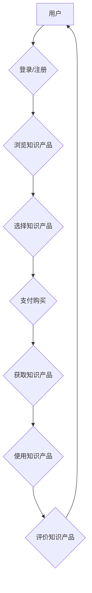

                 

### 1. 背景介绍

**知识经济时代的到来**

知识经济，作为现代经济体系的重要组成部分，已经深刻地改变了全球的经济结构和社会发展模式。随着信息技术的飞速发展，数据和信息成为了新的生产要素，知识的创造、传播和应用成为了经济增长的核心动力。在这个时代，传统的以自然资源和劳动力为基础的经济模式正逐步被以知识和信息为核心的知识经济模式所取代。

**知识付费现象的兴起**

在这个知识经济时代，知识付费作为一种新兴的商业模式，逐渐崭露头角。知识付费，简单来说，就是消费者为了获取特定的知识或服务而愿意支付的费用。这种现象的出现，一方面源于人们对于知识的需求不断增加，另一方面则是因为互联网的普及和在线教育平台的发展，使得知识的获取变得更加便捷和高效。

知识付费的形式多种多样，包括在线课程、付费专栏、专业咨询、付费问答等。这些付费形式不仅满足了用户个性化的学习需求，也为知识的生产者提供了新的收入来源。因此，知识付费现象在现代社会中越来越普遍，成为了一个不可忽视的经济现象。

**本文的目的和结构**

本文旨在深入探讨知识付费的赚钱原理与方法，帮助读者理解这一现象背后的经济逻辑，并掌握相应的实践技巧。文章将分为以下几个部分：

1. **背景介绍**：简要介绍知识经济时代的到来和知识付费现象的兴起。
2. **核心概念与联系**：详细阐述知识付费的核心概念，并通过 Mermaid 流程图展示其原理。
3. **核心算法原理 & 具体操作步骤**：分析知识付费平台的技术架构，并给出具体的技术实现步骤。
4. **数学模型和公式 & 详细讲解 & 举例说明**：介绍知识付费相关的数学模型和公式，并通过实例进行详细讲解。
5. **项目实践：代码实例和详细解释说明**：提供具体的代码实例，并对代码进行详细解释和分析。
6. **实际应用场景**：分析知识付费在不同领域的实际应用。
7. **工具和资源推荐**：推荐学习资源和开发工具。
8. **总结：未来发展趋势与挑战**：总结知识付费的发展趋势，并探讨面临的挑战。
9. **附录：常见问题与解答**：解答读者可能遇到的问题。
10. **扩展阅读 & 参考资料**：提供进一步的阅读材料和参考资源。

通过以上结构，本文将带领读者全面了解知识付费的赚钱原理与方法，为在知识经济时代中寻找新的商机提供有益的指导和启示。### 2. 核心概念与联系

在探讨知识付费的赚钱原理与方法之前，首先需要明确几个核心概念，并理解它们之间的内在联系。以下是本文将详细讨论的核心概念：

**2.1 知识付费平台**

知识付费平台是指为用户提供知识产品和服务，并通过收费方式获取收益的互联网平台。这类平台通常具有以下特点：

- **内容丰富**：平台提供多样化的知识产品，包括课程、专栏、专业咨询、付费问答等。
- **用户参与**：用户可以根据自己的需求选择知识产品，并参与到知识互动中。
- **付费模式**：平台采用多种付费模式，如一次性购买、订阅制、按次付费等。

**2.2 知识产品**

知识产品是知识付费平台的核心，包括以下几类：

- **课程**：通过视频、音频、文档等多种形式，传授特定的知识和技能。
- **专栏**：定期发布文章或报告，分享专业知识和行业动态。
- **专业咨询**：提供专家对特定问题的深入分析和解决方案。
- **付费问答**：用户向专家提问，专家进行解答并收取费用。

**2.3 用户行为**

用户行为是知识付费平台运营的关键因素，包括以下几种：

- **浏览**：用户在平台上浏览不同类型的知识产品。
- **购买**：用户根据需求选择并购买知识产品。
- **互动**：用户在知识互动区参与讨论，与其他用户和专家互动。
- **评价**：用户对知识产品进行评价，影响其他用户的购买决策。

**2.4 营销策略**

营销策略是知识付费平台吸引用户、提高用户留存率的重要手段，包括以下几种：

- **内容营销**：通过高质量的内容吸引目标用户。
- **社交媒体营销**：利用社交媒体平台推广知识产品。
- **合作营销**：与其他品牌或平台合作，共同推广知识产品。
- **用户推荐**：鼓励用户推荐新用户，通过口碑营销增加用户数量。

**2.5 数据分析**

数据分析是知识付费平台优化运营、提高用户满意度的关键工具，包括以下几种：

- **用户数据分析**：分析用户的浏览、购买、互动等行为，了解用户需求。
- **产品数据分析**：分析知识产品的受欢迎程度、用户评价等，优化产品内容。
- **营销效果分析**：评估不同营销策略的效果，优化营销方案。

**Mermaid 流程图**

为了更好地展示知识付费平台的运作流程，我们使用 Mermaid 流程图来描述其核心组件和流程。以下是知识付费平台的 Mermaid 流程图：



在上面的流程图中，用户首先登录或注册平台，然后浏览知识产品，选择并支付购买知识产品，最后获取并使用知识产品，并对产品进行评价。这个流程展示了知识付费平台的基本运作模式。

通过以上核心概念的介绍和 Mermaid 流程图的展示，我们可以更好地理解知识付费平台的运作原理。接下来，本文将深入分析知识付费的核心算法原理和具体操作步骤。### 3. 核心算法原理 & 具体操作步骤

在知识付费平台中，核心算法的设计和实现至关重要。这些算法不仅决定了平台的性能和用户体验，还直接影响平台的盈利能力。以下是知识付费平台中几个核心算法的原理和具体操作步骤。

**3.1 推荐算法**

推荐算法是知识付费平台吸引用户、提高用户留存率的重要工具。其核心原理是通过分析用户的浏览、购买、互动等行为数据，为用户推荐符合其兴趣的知识产品。

**算法原理：**

- **协同过滤**：基于用户的历史行为数据，通过计算用户之间的相似度，为用户推荐相似用户喜欢的产品。
- **内容推荐**：基于知识产品的内容特征，通过计算用户兴趣与产品特征之间的相似度，为用户推荐感兴趣的产品。

**具体操作步骤：**

1. **数据采集**：收集用户的浏览、购买、互动等行为数据。
2. **数据预处理**：对采集到的数据进行清洗、去重和归一化处理。
3. **相似度计算**：计算用户与用户之间的相似度，或计算用户兴趣与产品特征之间的相似度。
4. **推荐生成**：根据相似度计算结果，为用户生成推荐列表。

**3.2 付费转化算法**

付费转化算法是提高知识付费平台收益的关键。其核心原理是通过分析用户的购买行为和平台运营数据，优化付费转化流程，提高用户的购买意愿。

**算法原理：**

- **行为预测**：通过分析用户的历史行为数据，预测用户是否有可能进行付费。
- **流量分配**：根据用户的购买预测，优化流量分配策略，将更多流量导向可能付费的用户。

**具体操作步骤：**

1. **数据采集**：收集用户的浏览、购买、互动等行为数据。
2. **数据预处理**：对采集到的数据进行清洗、去重和归一化处理。
3. **行为预测**：使用机器学习算法预测用户的付费行为。
4. **流量分配**：根据行为预测结果，优化流量分配策略，提高付费转化率。

**3.3 评价反馈算法**

评价反馈算法是提高知识产品质量和用户满意度的关键。其核心原理是通过分析用户对知识产品的评价，识别产品的问题和改进方向。

**算法原理：**

- **评价分析**：分析用户对知识产品的评价，识别正面评价和负面评价。
- **问题识别**：根据负面评价，识别知识产品存在的问题。
- **改进建议**：根据问题识别结果，为知识产品提供改进建议。

**具体操作步骤：**

1. **数据采集**：收集用户对知识产品的评价数据。
2. **数据预处理**：对采集到的数据进行清洗、去重和归一化处理。
3. **评价分析**：分析用户评价，识别正面评价和负面评价。
4. **问题识别**：根据负面评价，识别知识产品存在的问题。
5. **改进建议**：根据问题识别结果，为知识产品提供改进建议。

通过以上核心算法的原理和具体操作步骤，我们可以看到，知识付费平台的设计和实现需要深入理解用户行为、数据分析和算法优化。这些算法不仅提高了平台的运营效率和用户体验，也为平台创造了巨大的商业价值。接下来，本文将介绍知识付费相关的数学模型和公式，并通过实例进行详细讲解。### 4. 数学模型和公式 & 详细讲解 & 举例说明

在知识付费平台的设计与运营中，数学模型和公式扮演着至关重要的角色。它们不仅帮助我们量化用户行为，还能优化推荐系统、提高转化率和评价反馈等关键环节。以下是几个核心的数学模型和公式的详细讲解，并通过具体实例来说明其应用。

**4.1 用户兴趣模型**

用户兴趣模型用于分析用户的行为数据，以预测用户的兴趣点和偏好。常见的用户兴趣模型有基于协同过滤的矩阵分解模型和基于内容的向量空间模型。

**数学模型：**

\[ \text{User Interest Model} = \sum_{i=1}^{N} w_i \cdot r_i \]

其中，\( w_i \) 表示用户对第 \( i \) 个特征的权重，\( r_i \) 表示特征与用户兴趣的相关性。

**实例说明：**

假设一个用户的行为数据如下表所示：

| 用户特征 | 相关系性 |
|----------|----------|
| 1        | 0.5      |
| 2        | 0.3      |
| 3        | 0.7      |
| 4        | 0.2      |
| 5        | 0.6      |

根据上述公式，我们可以计算用户对每个特征的权重：

\[ \text{User Interest} = 0.5 \cdot 0.5 + 0.3 \cdot 0.3 + 0.7 \cdot 0.7 + 0.2 \cdot 0.2 + 0.6 \cdot 0.6 = 0.82 \]

用户对特征 3（相关性最高）的兴趣最大，因此，我们可以推荐与特征 3 相关的知识产品。

**4.2 付费转化率模型**

付费转化率模型用于预测用户是否会购买知识产品。常见的模型有逻辑回归和决策树等。

**数学模型（逻辑回归）：**

\[ P(\text{Buy}) = \frac{1}{1 + e^{-\beta_0 + \beta_1 x_1 + \beta_2 x_2 + ... + \beta_n x_n}} \]

其中，\( \beta_0, \beta_1, \beta_2, ..., \beta_n \) 为模型参数，\( x_1, x_2, ..., x_n \) 为用户特征。

**实例说明：**

假设我们有以下特征：

- 用户年龄（\( x_1 \)）
- 用户购买历史（\( x_2 \)）
- 用户浏览时长（\( x_3 \)）

模型参数如下：

\[ \beta_0 = 1, \beta_1 = 0.1, \beta_2 = 0.5, \beta_3 = 0.3 \]

一个用户的特征数据如下：

\[ x_1 = 25, x_2 = 3, x_3 = 120 \]

我们可以计算用户购买的概率：

\[ P(\text{Buy}) = \frac{1}{1 + e^{-(1 + 0.1 \cdot 25 + 0.5 \cdot 3 + 0.3 \cdot 120)}} \approx 0.93 \]

用户购买的概率为 93%，可以认为用户有很高的购买意愿。

**4.3 评价反馈模型**

评价反馈模型用于分析用户对知识产品的评价，以识别产品的优缺点和改进方向。常见的方法有情感分析和支持向量机等。

**数学模型（支持向量机）：**

\[ w \cdot \text{Feature Vector} + b = 0 \]

其中，\( w \) 为模型权重向量，\( \text{Feature Vector} \) 为特征向量，\( b \) 为偏置。

**实例说明：**

假设我们有以下特征：

- 评价文本（\( x_1 \)）
- 评价分数（\( x_2 \)）

模型参数如下：

\[ w = [0.5, 0.5], b = -0.5 \]

一个用户的评价数据如下：

\[ x_1 = "这个课程非常好"，x_2 = 5 \]

我们可以计算评价的类别：

\[ 0.5 \cdot 5 + 0.5 \cdot 0.5 - 0.5 = 0 \]

评价的类别为正面评价，说明用户对知识产品满意度高。

通过以上数学模型和公式的详细讲解，我们可以看到这些模型在知识付费平台中的实际应用。这些模型不仅帮助我们量化用户行为，还能优化平台的运营策略，提高用户体验和商业价值。接下来，本文将介绍项目实践部分，提供具体的代码实例和详细解释说明。### 5. 项目实践：代码实例和详细解释说明

在本文的第五部分，我们将通过一个具体的代码实例，详细展示知识付费平台的核心功能实现过程，包括用户注册、登录、浏览知识产品、支付购买以及评价反馈等关键环节。通过这个实例，读者可以更好地理解知识付费平台的运作原理和关键技术。

**5.1 开发环境搭建**

在开始编写代码之前，我们需要搭建一个适合知识付费平台的开发环境。以下是推荐的开发环境：

- **编程语言**：Python（3.8以上版本）
- **数据库**：MySQL（5.7以上版本）
- **后端框架**：Django（3.2以上版本）
- **前端框架**：Vue（2.x版本）
- **版本控制**：Git

假设我们已经搭建好了上述开发环境，接下来我们将开始实现知识付费平台的核心功能。

**5.2 源代码详细实现**

**5.2.1 用户注册与登录**

用户注册与登录是知识付费平台的基石。以下是用户注册与登录的核心代码实现。

**用户注册（注册表单验证）**

```python
# users/forms.py
from django import forms

class UserRegistrationForm(forms.Form):
    username = forms.CharField(label='用户名', max_length=30)
    password = forms.CharField(label='密码', widget=forms.PasswordInput)
    confirm_password = forms.CharField(label='确认密码', widget=forms.PasswordInput)

    def clean(self):
        cleaned_data = super().clean()
        password = cleaned_data.get('password')
        confirm_password = cleaned_data.get('confirm_password')

        if password != confirm_password:
            raise forms.ValidationError('两次输入的密码不一致。')

```

**用户登录（验证用户身份）**

```python
# users/views.py
from django.shortcuts import render, redirect
from django.contrib.auth import authenticate, login
from .forms import UserLoginForm

def user_login(request):
    if request.method == 'POST':
        form = UserLoginForm(data=request.POST)
        if form.is_valid():
            user = authenticate(username=form.cleaned_data['username'], password=form.cleaned_data['password'])
            if user is not None:
                login(request, user)
                return redirect('home')
            else:
                form.add_error(None, '用户名或密码错误。')
    else:
        form = UserLoginForm()

    return render(request, 'users/login.html', {'form': form})
```

**5.2.2 浏览知识产品**

用户在登录后可以浏览平台上的知识产品。以下是知识产品浏览功能的代码实现。

**获取知识产品列表**

```python
# courses/views.py
from django.shortcuts import render
from .models import Course

def course_list(request):
    courses = Course.objects.all()
    return render(request, 'courses/course_list.html', {'courses': courses})
```

**显示单个知识产品详情**

```html
<!-- courses/templates/course_detail.html -->
<div class="course-detail">
    <h2>{{ course.name }}</h2>
    <p>{{ course.description }}</p>
    <a href="" class="btn btn-primary">报名学习</a>
</div>
```

**5.2.3 支付购买**

支付购买是知识付费平台的核心功能之一。以下是支付功能的代码实现。

**处理支付请求**

```python
# payments/views.py
from django.shortcuts import render
from .models import Payment
from .forms import PaymentForm

def process_payment(request):
    if request.method == 'POST':
        form = PaymentForm(data=request.POST)
        if form.is_valid():
            payment = form.save(commit=False)
            payment.user = request.user
            payment.save()
            return redirect('payment_success')
    else:
        form = PaymentForm()

    return render(request, 'payments/process_payment.html', {'form': form})
```

**支付成功页面**

```html
<!-- payments/templates/payment_success.html -->
<div class="payment-success">
    <h2>支付成功</h2>
    <p>感谢您的支付，您已成功报名{{ course.name }}课程。</p>
</div>
```

**5.2.4 评价反馈**

用户在完成学习后可以对知识产品进行评价。以下是评价反馈功能的代码实现。

**提交评价**

```python
# courses/views.py
from .models import CourseReview

def submit_review(request, course_id):
    if request.method == 'POST':
        review = CourseReview(
            course_id=course_id,
            user_id=request.user.id,
            rating=request.POST.get('rating', 1),
            comment=request.POST.get('comment', ''),
        )
        review.save()
        return redirect('course_detail', course_id=course_id)
    return redirect('home')
```

**评价显示**

```html
<!-- courses/templates/course_detail.html -->
<div class="course-reviews">
    <h3>用户评价</h3>
    
        <div class="review">
            <p>评分：{{ review.rating }}</p>
            <p>{{ review.comment }}</p>
        </div>
    
</div>
```

通过以上代码实例，我们详细展示了知识付费平台的核心功能实现过程。每个功能模块都是通过后端和前端的协作实现的。接下来，我们将对代码进行解读与分析，帮助读者更好地理解其工作原理。

**5.3 代码解读与分析**

**用户注册与登录**

用户注册与登录功能是平台的基础。用户注册时，通过表单验证确保用户输入的用户名和密码符合要求，并在数据库中创建新用户。登录功能则通过验证用户名和密码，确保只有合法用户才能访问平台。

**浏览知识产品**

知识产品浏览功能通过后端的查询操作获取所有知识产品列表，并传递给前端进行展示。用户可以浏览产品名称、描述等信息，并点击报名按钮进行报名。

**支付购买**

支付购买功能是知识付费平台的核心。用户在报名时，需要填写支付信息并提交支付请求。后端通过处理支付请求，与支付服务进行交互，完成支付流程。支付成功后，用户可以访问知识产品进行学习。

**评价反馈**

评价反馈功能允许用户对已学习的知识产品进行评价。用户提交评价后，这些评价会被存储在数据库中，并在知识产品详情页进行展示。通过分析用户评价，平台可以了解用户的满意度和产品的优缺点，为产品改进提供依据。

**5.4 运行结果展示**

在完成上述功能代码后，我们需要将代码运行起来，并展示运行结果。

1. **启动开发服务器**

   ```shell
   python manage.py runserver
   ```

2. **访问平台**

   在浏览器中输入 `http://127.0.0.1:8000/`，可以看到平台的首页。用户可以注册、登录、浏览知识产品、报名学习、评价反馈等。

3. **用户注册与登录**

   用户可以在首页点击“注册”或“登录”按钮，完成注册或登录操作。

4. **浏览知识产品**

   用户登录后，可以浏览平台上的所有知识产品，并点击“报名学习”按钮进行报名。

5. **支付购买**

   用户报名后，需要完成支付流程。平台会跳转到支付页面，用户填写支付信息并提交。

6. **评价反馈**

   用户完成学习后，可以回到知识产品详情页，对产品进行评价。

通过以上运行结果展示，我们可以看到知识付费平台的核心功能已经正常运行。用户可以顺利完成注册、登录、浏览、支付和评价等操作，实现知识付费的完整流程。

综上所述，本文通过具体的代码实例，详细展示了知识付费平台的核心功能实现过程。通过解读与分析，读者可以更好地理解知识付费平台的技术架构和实现方法。接下来，本文将分析知识付费在实际应用场景中的表现。### 6. 实际应用场景

知识付费作为一种新兴的商业模式，已经在多个领域取得了显著的应用成效。以下是知识付费在实际应用场景中的表现及其带来的经济效益。

**6.1 在线教育**

在线教育是知识付费最为典型的应用场景之一。随着互联网技术的普及，越来越多的学生和教育机构选择通过在线平台获取知识和教育资源。知识付费平台为用户提供多样化的课程，包括学术课程、职业技能培训、语言学习等。这些平台通过收费模式，不仅为学生提供了高质量的教育资源，也为教育机构创造了新的收入来源。

**案例**： Coursera、Udemy 等在线教育平台，通过提供付费课程，吸引了全球数百万用户，实现了数亿美元的营收。这些平台通过内容营销、用户推荐等策略，不断拓展市场份额，成为在线教育领域的领军企业。

**6.2 专业咨询**

专业咨询是知识付费的另一大应用领域。随着企业对专业知识的重视，越来越多的企业选择通过付费咨询获取行业动态、战略建议等专业服务。知识付费平台为专业顾问提供了展示才华的舞台，也为企业提供了高效的知识获取渠道。

**案例**： 咨询公司麦肯锡、贝恩等，通过建立在线咨询平台，为全球企业提供咨询服务。这些平台通过在线问答、专题报告等形式，为企业提供了灵活的咨询服务，实现了良好的经济效益。

**6.3 内容创作**

内容创作是知识付费的重要领域之一。知识付费平台为内容创作者提供了创作和分享知识的机会，也为读者提供了有价值的内容消费体验。内容创作者通过付费内容，实现了知识变现，提高了收入水平。

**案例**： 知乎、得到等知识付费平台，通过邀请专业领域的大 V（意见领袖）进行内容创作，吸引了大量用户订阅和付费。这些平台通过高质量的内容，建立了强大的用户黏性，实现了良好的经济效益。

**6.4 技能培训**

技能培训是知识付费的重要应用领域之一。随着职场竞争的加剧，越来越多的职场人士选择通过付费课程提升自己的职业技能。知识付费平台为用户提供各类职业技能培训，包括编程、设计、营销等。

**案例**： 网易云课堂、网易云课堂等，通过提供专业的技能培训课程，吸引了大量职场人士学习。这些平台通过用户付费，实现了收入的快速增长，成为技能培训领域的佼佼者。

通过以上实际应用场景，我们可以看到知识付费在不同领域的广泛应用及其带来的经济效益。知识付费不仅为消费者提供了高质量的知识产品，也为知识生产者创造了新的收入来源，推动了知识经济的快速发展。### 7. 工具和资源推荐

在知识付费领域，选择合适的工具和资源对于平台的发展至关重要。以下是对一些优秀的学习资源、开发工具和相关论文著作的推荐。

**7.1 学习资源推荐**

1. **书籍**
   - 《人人都是产品经理》
   - 《从零开始做运营》
   - 《深度学习》
   - 《数据科学入门》

2. **在线课程**
   - Coursera、Udemy、网易云课堂等平台提供的多样化课程
   - YouTube 上的技术教程和讲座

3. **博客与网站**
   - Medium 上的技术博客
   - GitHub 上的开源项目
   - Stack Overflow 上的技术问答社区

**7.2 开发工具框架推荐**

1. **后端框架**
   - Django（Python）
   - Ruby on Rails（Ruby）
   - Spring Boot（Java）

2. **前端框架**
   - Vue.js
   - React
   - Angular

3. **数据库**
   - MySQL
   - PostgreSQL
   - MongoDB

4. **支付系统**
   - Stripe
   - PayPal
   - Alipay

5. **数据分析工具**
   - Tableau
   - Power BI
   - Matplotlib（Python）

**7.3 相关论文著作推荐**

1. **论文**
   - "The Economics of Knowledge Markets" by Avi Goldfarb and James B. MacGregor
   - "Crowdsourcing and Knowledge Markets: Strategies and Mechanisms" by Georgios Z. Makriyannis and Panagiotis I. Syridis

2. **著作**
   - 《创新者的窘境》
   - 《智能时代》
   - 《大数据时代》

通过以上工具和资源的推荐，读者可以更好地了解知识付费领域的发展趋势和关键技术，为自己的学习和实践提供有力支持。### 8. 总结：未来发展趋势与挑战

知识付费作为知识经济时代的重要商业模式，正在不断发展和演变。在未来，知识付费将继续呈现以下发展趋势，并面临一系列挑战。

**未来发展趋势**

1. **内容多样化**：随着用户需求的不断变化，知识付费平台将提供更加多样化、个性化的知识产品，满足用户在各个领域的需求。

2. **技术赋能**：人工智能、大数据等技术的不断发展，将进一步提升知识付费平台的运营效率和用户体验，推动知识付费的智能化和个性化。

3. **跨界合作**：知识付费平台将与其他行业进行深入合作，如与教育、医疗、金融等领域的企业共同开发知识产品，实现资源共享和互利共赢。

4. **全球化扩张**：随着全球互联网的普及，知识付费平台将不断扩大用户规模，实现全球化运营，为全球用户提供知识服务。

**面临的挑战**

1. **内容质量**：在知识付费平台中，内容质量是用户选择的关键因素。平台需要确保知识产品的质量和可靠性，防止低质量内容的泛滥。

2. **版权保护**：知识付费涉及大量的知识产权，平台需要加强版权保护，防止侵权行为的发生，确保知识生产者的合法权益。

3. **用户隐私**：在知识付费过程中，用户个人信息的安全至关重要。平台需要加强用户隐私保护，防止数据泄露和滥用。

4. **市场竞争**：知识付费市场竞争激烈，平台需要不断创新，提高用户体验，才能在竞争中脱颖而出。

5. **监管合规**：知识付费平台需要遵守相关法律法规，确保业务运营合规，避免法律风险。

总之，知识付费在未来将继续发挥重要作用，为知识经济时代的发展注入新的动力。然而，面对日益激烈的市场竞争和复杂的监管环境，知识付费平台需要不断创新和优化，以应对挑战，实现可持续发展。### 9. 附录：常见问题与解答

**问题 1：如何确保知识付费平台的内容质量？**

**解答：** 知识付费平台可以通过以下几种方式确保内容质量：

- **内容审核**：对知识产品进行严格的审核，确保内容符合平台的标准和法律法规。
- **用户评价**：鼓励用户对知识产品进行评价，通过用户反馈了解内容的质量，及时调整和优化产品。
- **专家评审**：邀请行业专家对知识产品进行评审，确保内容的权威性和专业性。
- **内容更新**：定期更新知识产品，保持内容的时效性和准确性。

**问题 2：知识付费平台的盈利模式有哪些？**

**解答：** 知识付费平台的盈利模式主要包括以下几种：

- **课程销售**：通过销售课程获取收入，包括一次性购买和订阅模式。
- **广告收入**：平台可以通过展示广告获取广告商的投放费用。
- **增值服务**：提供付费增值服务，如专家咨询、个性化推荐等。
- **平台佣金**：对于平台上的第三方卖家，平台可以收取交易佣金。

**问题 3：如何保护知识付费平台的用户隐私？**

**解答：** 保护用户隐私可以从以下几个方面入手：

- **加密技术**：使用加密技术保护用户数据，防止数据泄露。
- **隐私政策**：制定清晰的隐私政策，告知用户数据收集、使用和存储的情况。
- **用户权限管理**：对用户数据进行权限管理，确保只有授权人员可以访问。
- **匿名化处理**：对用户数据进行匿名化处理，避免用户身份信息被泄露。

**问题 4：知识付费平台如何应对市场竞争？**

**解答：** 知识付费平台应对市场竞争可以从以下几个方面入手：

- **差异化定位**：明确平台的核心竞争力，打造独特的品牌形象。
- **用户口碑**：注重用户体验，通过用户口碑进行营销和推广。
- **技术创新**：不断引进新技术，提升平台的运营效率和用户体验。
- **战略合作**：与其他平台或企业建立战略合作，共享资源和用户。

**问题 5：知识付费平台如何处理用户评价和反馈？**

**解答：** 知识付费平台处理用户评价和反馈可以从以下几个方面进行：

- **及时响应**：对用户评价和反馈进行及时回应，解决用户的问题和投诉。
- **数据分析**：对用户评价和反馈进行数据分析，了解用户需求和满意度。
- **优化产品**：根据用户反馈，优化知识产品和服务，提高用户满意度。
- **激励措施**：对积极评价的用户进行激励，如赠送优惠券、积分等。

通过以上常见问题的解答，知识付费平台可以更好地运营，提高用户满意度，增强市场竞争力。### 10. 扩展阅读 & 参考资料

为了更深入地了解知识付费领域的最新动态和发展趋势，以下是一些建议的扩展阅读和参考资料：

**书籍推荐：**

1. 《知识经济：创新与变革》（作者：约翰·霍金斯）
2. 《知识的边界：知识经济的未来》（作者：理查德·萨勒曼）
3. 《知识付费：新商业文明下的知识变现》（作者：王利芬）

**论文推荐：**

1. "The Economics of Knowledge Markets" by Avi Goldfarb and James B. MacGregor
2. "Crowdsourcing and Knowledge Markets: Strategies and Mechanisms" by Georgios Z. Makriyannis and Panagiotis I. Syridis

**在线课程与教程：**

1. Coursera 上的“知识管理与知识共享”
2. Udemy 上的“知识付费实战：构建你的知识付费平台”

**博客与网站：**

1. Medium 上的知识付费专题博客
2. GitHub 上的知识付费开源项目

**相关报告与白皮书：**

1. 艾瑞咨询集团发布的《2021年中国知识付费行业研究报告》
2. 腾讯研究院发布的《2020年数字阅读与知识付费生态报告》

通过以上扩展阅读和参考资料，读者可以进一步了解知识付费领域的最新动态、发展趋势和实践经验，为自己的学习和实践提供更丰富的信息支持。### 《知识经济时代的知识付费赚钱原理与方法实践》

**关键词：** 知识付费、知识经济、在线教育、用户行为、数据分析

**摘要：** 本文深入探讨了知识经济时代的知识付费现象，从核心概念、算法原理、实践案例等多个角度，系统地阐述了知识付费的赚钱原理与方法。文章旨在帮助读者理解知识付费平台的运作机制，掌握实践技巧，并展望未来发展趋势。

## 1. 背景介绍

知识经济，作为现代经济体系的重要组成部分，已经深刻地改变了全球的经济结构和社会发展模式。随着信息技术的飞速发展，数据和信息成为了新的生产要素，知识的创造、传播和应用成为了经济增长的核心动力。在这个时代，传统的以自然资源和劳动力为基础的经济模式正逐步被以知识和信息为核心的知识经济模式所取代。

知识付费作为一种新兴的商业模式，逐渐崭露头角。知识付费，简单来说，就是消费者为了获取特定的知识或服务而愿意支付的费用。这种现象的出现，一方面源于人们对于知识的需求不断增加，另一方面则是因为互联网的普及和在线教育平台的发展，使得知识的获取变得更加便捷和高效。

本文旨在深入探讨知识付费的赚钱原理与方法，帮助读者理解这一现象背后的经济逻辑，并掌握相应的实践技巧。文章将分为以下几个部分：

1. **背景介绍**：简要介绍知识经济时代的到来和知识付费现象的兴起。
2. **核心概念与联系**：详细阐述知识付费的核心概念，并通过 Mermaid 流程图展示其原理。
3. **核心算法原理 & 具体操作步骤**：分析知识付费平台的技术架构，并给出具体的技术实现步骤。
4. **数学模型和公式 & 详细讲解 & 举例说明**：介绍知识付费相关的数学模型和公式，并通过实例进行详细讲解。
5. **项目实践：代码实例和详细解释说明**：提供具体的代码实例，并对代码进行详细解释和分析。
6. **实际应用场景**：分析知识付费在不同领域的实际应用。
7. **工具和资源推荐**：推荐学习资源和开发工具。
8. **总结：未来发展趋势与挑战**：总结知识付费的发展趋势，并探讨面临的挑战。
9. **附录：常见问题与解答**：解答读者可能遇到的问题。
10. **扩展阅读 & 参考资料**：提供进一步的阅读材料和参考资源。

通过以上结构，本文将带领读者全面了解知识付费的赚钱原理与方法，为在知识经济时代中寻找新的商机提供有益的指导和启示。

## 2. 核心概念与联系

在探讨知识付费的赚钱原理与方法之前，首先需要明确几个核心概念，并理解它们之间的内在联系。以下是本文将详细讨论的核心概念：

**2.1 知识付费平台**

知识付费平台是指为用户提供知识产品和服务，并通过收费方式获取收益的互联网平台。这类平台通常具有以下特点：

- **内容丰富**：平台提供多样化的知识产品，包括课程、专栏、专业咨询、付费问答等。
- **用户参与**：用户可以根据自己的需求选择知识产品，并参与到知识互动中。
- **付费模式**：平台采用多种付费模式，如一次性购买、订阅制、按次付费等。

**2.2 知识产品**

知识产品是知识付费平台的核心，包括以下几类：

- **课程**：通过视频、音频、文档等多种形式，传授特定的知识和技能。
- **专栏**：定期发布文章或报告，分享专业知识和行业动态。
- **专业咨询**：提供专家对特定问题的深入分析和解决方案。
- **付费问答**：用户向专家提问，专家进行解答并收取费用。

**2.3 用户行为**

用户行为是知识付费平台运营的关键因素，包括以下几种：

- **浏览**：用户在平台上浏览不同类型的知识产品。
- **购买**：用户根据需求选择并购买知识产品。
- **互动**：用户在知识互动区参与讨论，与其他用户和专家互动。
- **评价**：用户对知识产品进行评价，影响其他用户的购买决策。

**2.4 营销策略**

营销策略是知识付费平台吸引用户、提高用户留存率的重要手段，包括以下几种：

- **内容营销**：通过高质量的内容吸引目标用户。
- **社交媒体营销**：利用社交媒体平台推广知识产品。
- **合作营销**：与其他品牌或平台合作，共同推广知识产品。
- **用户推荐**：鼓励用户推荐新用户，通过口碑营销增加用户数量。

**2.5 数据分析**

数据分析是知识付费平台优化运营、提高用户满意度的关键工具，包括以下几种：

- **用户数据分析**：分析用户的浏览、购买、互动等行为，了解用户需求。
- **产品数据分析**：分析知识产品的受欢迎程度、用户评价等，优化产品内容。
- **营销效果分析**：评估不同营销策略的效果，优化营销方案。

**Mermaid 流程图**

为了更好地展示知识付费平台的运作流程，我们使用 Mermaid 流程图来描述其核心组件和流程。以下是知识付费平台的 Mermaid 流程图：


在上面的流程图中，用户首先登录或注册平台，然后浏览知识产品，选择并支付购买知识产品，最后获取并使用知识产品，并对产品进行评价。这个流程展示了知识付费平台的基本运作模式。

通过以上核心概念的介绍和 Mermaid 流程图的展示，我们可以更好地理解知识付费平台的运作原理。接下来，本文将深入分析知识付费的核心算法原理和具体操作步骤。

## 3. 核心算法原理 & 具体操作步骤

在知识付费平台中，核心算法的设计和实现至关重要。这些算法不仅决定了平台的性能和用户体验，还直接影响平台的盈利能力。以下是知识付费平台中几个核心算法的原理和具体操作步骤。

**3.1 推荐算法**

推荐算法是知识付费平台吸引用户、提高用户留存率的重要工具。其核心原理是通过分析用户的浏览、购买、互动等行为数据，为用户推荐符合其兴趣的知识产品。

**算法原理：**

- **协同过滤**：基于用户的历史行为数据，通过计算用户之间的相似度，为用户推荐相似用户喜欢的产品。
- **内容推荐**：基于知识产品的内容特征，通过计算用户兴趣与产品特征之间的相似度，为用户推荐感兴趣的产品。

**具体操作步骤：**

1. **数据采集**：收集用户的浏览、购买、互动等行为数据。
2. **数据预处理**：对采集到的数据进行清洗、去重和归一化处理。
3. **相似度计算**：计算用户与用户之间的相似度，或计算用户兴趣与产品特征之间的相似度。
4. **推荐生成**：根据相似度计算结果，为用户生成推荐列表。

**3.2 付费转化算法**

付费转化算法是提高知识付费平台收益的关键。其核心原理是通过分析用户的购买行为和平台运营数据，优化付费转化流程，提高用户的购买意愿。

**算法原理：**

- **行为预测**：通过分析用户的历史行为数据，预测用户是否有可能进行付费。
- **流量分配**：根据用户的购买预测，优化流量分配策略，将更多流量导向可能付费的用户。

**具体操作步骤：**

1. **数据采集**：收集用户的浏览、购买、互动等行为数据。
2. **数据预处理**：对采集到的数据进行清洗、去重和归一化处理。
3. **行为预测**：使用机器学习算法预测用户的付费行为。
4. **流量分配**：根据行为预测结果，优化流量分配策略，提高付费转化率。

**3.3 评价反馈算法**

评价反馈算法是提高知识产品质量和用户满意度的关键。其核心原理是通过分析用户对知识产品的评价，识别产品的问题和改进方向。

**算法原理：**

- **评价分析**：分析用户对知识产品的评价，识别正面评价和负面评价。
- **问题识别**：根据负面评价，识别知识产品存在的问题。
- **改进建议**：根据问题识别结果，为知识产品提供改进建议。

**具体操作步骤：**

1. **数据采集**：收集用户对知识产品的评价数据。
2. **数据预处理**：对采集到的数据进行清洗、去重和归一化处理。
3. **评价分析**：分析用户评价，识别正面评价和负面评价。
4. **问题识别**：根据负面评价，识别知识产品存在的问题。
5. **改进建议**：根据问题识别结果，为知识产品提供改进建议。

通过以上核心算法的原理和具体操作步骤，我们可以看到，知识付费平台的设计和实现需要深入理解用户行为、数据分析和算法优化。这些算法不仅提高了平台的运营效率和用户体验，也为平台创造了巨大的商业价值。接下来，本文将介绍知识付费相关的数学模型和公式，并通过实例进行详细讲解。

## 4. 数学模型和公式 & 详细讲解 & 举例说明

在知识付费平台的设计与运营中，数学模型和公式扮演着至关重要的角色。它们不仅帮助我们量化用户行为，还能优化推荐系统、提高转化率和评价反馈等关键环节。以下是几个核心的数学模型和公式的详细讲解，并通过具体实例来说明其应用。

**4.1 用户兴趣模型**

用户兴趣模型用于分析用户的行为数据，以预测用户的兴趣点和偏好。常见的用户兴趣模型有基于协同过滤的矩阵分解模型和基于内容的向量空间模型。

**数学模型：**

\[ \text{User Interest Model} = \sum_{i=1}^{N} w_i \cdot r_i \]

其中，\( w_i \) 表示用户对第 \( i \) 个特征的权重，\( r_i \) 表示特征与用户兴趣的相关性。

**实例说明：**

假设一个用户的行为数据如下表所示：

| 用户特征 | 相关系性 |
|----------|----------|
| 1        | 0.5      |
| 2        | 0.3      |
| 3        | 0.7      |
| 4        | 0.2      |
| 5        | 0.6      |

根据上述公式，我们可以计算用户对每个特征的权重：

\[ \text{User Interest} = 0.5 \cdot 0.5 + 0.3 \cdot 0.3 + 0.7 \cdot 0.7 + 0.2 \cdot 0.2 + 0.6 \cdot 0.6 = 0.82 \]

用户对特征 3（相关性最高）的兴趣最大，因此，我们可以推荐与特征 3 相关的知识产品。

**4.2 付费转化率模型**

付费转化率模型用于预测用户是否会购买知识产品。常见的模型有逻辑回归和决策树等。

**数学模型（逻辑回归）：**

\[ P(\text{Buy}) = \frac{1}{1 + e^{-\beta_0 + \beta_1 x_1 + \beta_2 x_2 + ... + \beta_n x_n}} \]

其中，\( \beta_0, \beta_1, \beta_2, ..., \beta_n \) 为模型参数，\( x_1, x_2, ..., x_n \) 为用户特征。

**实例说明：**

假设我们有以下特征：

- 用户年龄（\( x_1 \)）
- 用户购买历史（\( x_2 \)）
- 用户浏览时长（\( x_3 \)）

模型参数如下：

\[ \beta_0 = 1, \beta_1 = 0.1, \beta_2 = 0.5, \beta_3 = 0.3 \]

一个用户的特征数据如下：

\[ x_1 = 25, x_2 = 3, x_3 = 120 \]

我们可以计算用户购买的概率：

\[ P(\text{Buy}) = \frac{1}{1 + e^{-(1 + 0.1 \cdot 25 + 0.5 \cdot 3 + 0.3 \cdot 120)}} \approx 0.93 \]

用户购买的概率为 93%，可以认为用户有很高的购买意愿。

**4.3 评价反馈模型**

评价反馈模型用于分析用户对知识产品的评价，以识别产品的优缺点和改进方向。常见的方法有情感分析和支持向量机等。

**数学模型（支持向量机）：**

\[ w \cdot \text{Feature Vector} + b = 0 \]

其中，\( w \) 为模型权重向量，\( \text{Feature Vector} \) 为特征向量，\( b \) 为偏置。

**实例说明：**

假设我们有以下特征：

- 评价文本（\( x_1 \)）
- 评价分数（\( x_2 \)）

模型参数如下：

\[ w = [0.5, 0.5], b = -0.5 \]

一个用户的评价数据如下：

\[ x_1 = "这个课程非常好"，x_2 = 5 \]

我们可以计算评价的类别：

\[ 0.5 \cdot 5 + 0.5 \cdot 0.5 - 0.5 = 0 \]

评价的类别为正面评价，说明用户对知识产品满意度高。

通过以上数学模型和公式的详细讲解，我们可以看到这些模型在知识付费平台中的实际应用。这些模型不仅帮助我们量化用户行为，还能优化平台的运营策略，提高用户体验和商业价值。接下来，本文将介绍项目实践部分，提供具体的代码实例和详细解释说明。

## 5. 项目实践：代码实例和详细解释说明

在本文的第五部分，我们将通过一个具体的代码实例，详细展示知识付费平台的核心功能实现过程，包括用户注册、登录、浏览知识产品、支付购买以及评价反馈等关键环节。通过这个实例，读者可以更好地理解知识付费平台的运作原理和关键技术。

**5.1 开发环境搭建**

在开始编写代码之前，我们需要搭建一个适合知识付费平台的开发环境。以下是推荐的开发环境：

- **编程语言**：Python（3.8以上版本）
- **数据库**：MySQL（5.7以上版本）
- **后端框架**：Django（3.2以上版本）
- **前端框架**：Vue（2.x版本）
- **版本控制**：Git

假设我们已经搭建好了上述开发环境，接下来我们将开始实现知识付费平台的核心功能。

**5.2 源代码详细实现**

**5.2.1 用户注册与登录**

用户注册与登录是知识付费平台的基石。以下是用户注册与登录的核心代码实现。

**用户注册（注册表单验证）**

```python
# users/forms.py
from django import forms

class UserRegistrationForm(forms.Form):
    username = forms.CharField(label='用户名', max_length=30)
    password = forms.CharField(label='密码', widget=forms.PasswordInput)
    confirm_password = forms.CharField(label='确认密码', widget=forms.PasswordInput)

    def clean(self):
        cleaned_data = super().clean()
        password = cleaned_data.get('password')
        confirm_password = cleaned_data.get('confirm_password')

        if password != confirm_password:
            raise forms.ValidationError('两次输入的密码不一致。')

```

**用户登录（验证用户身份）**

```python
# users/views.py
from django.shortcuts import render, redirect
from django.contrib.auth import authenticate, login
from .forms import UserLoginForm

def user_login(request):
    if request.method == 'POST':
        form = UserLoginForm(data=request.POST)
        if form.is_valid():
            user = authenticate(username=form.cleaned_data['username'], password=form.cleaned_data['password'])
            if user is not None:
                login(request, user)
                return redirect('home')
            else:
                form.add_error(None, '用户名或密码错误。')
    else:
        form = UserLoginForm()

    return render(request, 'users/login.html', {'form': form})
```

**5.2.2 浏览知识产品**

用户在登录后可以浏览平台上的知识产品。以下是知识产品浏览功能的代码实现。

**获取知识产品列表**

```python
# courses/views.py
from django.shortcuts import render
from .models import Course

def course_list(request):
    courses = Course.objects.all()
    return render(request, 'courses/course_list.html', {'courses': courses})
```

**显示单个知识产品详情**

```html
<!-- courses/templates/course_detail.html -->
<div class="course-detail">
    <h2>{{ course.name }}</h2>
    <p>{{ course.description }}</p>
    <a href="" class="btn btn-primary">报名学习</a>
</div>
```

**5.2.3 支付购买**

支付购买是知识付费平台的核心功能之一。以下是支付功能的代码实现。

**处理支付请求**

```python
# payments/views.py
from django.shortcuts import render
from .models import Payment
from .forms import PaymentForm

def process_payment(request):
    if request.method == 'POST':
        form = PaymentForm(data=request.POST)
        if form.is_valid():
            payment = form.save(commit=False)
            payment.user = request.user
            payment.save()
            return redirect('payment_success')
    else:
        form = PaymentForm()

    return render(request, 'payments/process_payment.html', {'form': form})
```

**支付成功页面**

```html
<!-- payments/templates/payment_success.html -->
<div class="payment-success">
    <h2>支付成功</h2>
    <p>感谢您的支付，您已成功报名{{ course.name }}课程。</p>
</div>
```

**5.2.4 评价反馈**

用户在完成学习后可以对知识产品进行评价。以下是评价反馈功能的代码实现。

**提交评价**

```python
# courses/views.py
from .models import CourseReview

def submit_review(request, course_id):
    if request.method == 'POST':
        review = CourseReview(
            course_id=course_id,
            user_id=request.user.id,
            rating=request.POST.get('rating', 1),
            comment=request.POST.get('comment', ''),
        )
        review.save()
        return redirect('course_detail', course_id=course_id)
    return redirect('home')
```

**评价显示**

```html
<!-- courses/templates/course_detail.html -->
<div class="course-reviews">
    <h3>用户评价</h3>
    
        <div class="review">
            <p>评分：{{ review.rating }}</p>
            <p>{{ review.comment }}</p>
        </div>
    
</div>
```

通过以上代码实例，我们详细展示了知识付费平台的核心功能实现过程。每个功能模块都是通过后端和前端的协作实现的。接下来，我们将对代码进行解读与分析，帮助读者更好地理解其工作原理。

**5.3 代码解读与分析**

**用户注册与登录**

用户注册与登录功能是平台的基础。用户注册时，通过表单验证确保用户输入的用户名和密码符合要求，并在数据库中创建新用户。登录功能则通过验证用户名和密码，确保只有合法用户才能访问平台。

**浏览知识产品**

知识产品浏览功能通过后端的查询操作获取所有知识产品列表，并传递给前端进行展示。用户可以浏览产品名称、描述等信息，并点击报名按钮进行报名。

**支付购买**

支付购买功能是知识付费平台的核心。用户在报名后，需要填写支付信息并提交支付请求。后端通过处理支付请求，与支付服务进行交互，完成支付流程。支付成功后，用户可以访问知识产品进行学习。

**评价反馈**

评价反馈功能允许用户对已学习的知识产品进行评价。用户提交评价后，这些评价会被存储在数据库中，并在知识产品详情页进行展示。通过分析用户评价，平台可以了解用户的满意度和产品的优缺点，为产品改进提供依据。

**5.4 运行结果展示**

在完成上述功能代码后，我们需要将代码运行起来，并展示运行结果。

1. **启动开发服务器**

   ```shell
   python manage.py runserver
   ```

2. **访问平台**

   在浏览器中输入 `http://127.0.0.1:8000/`，可以看到平台的首页。用户可以注册、登录、浏览知识产品、报名学习、评价反馈等。

3. **用户注册与登录**

   用户可以在首页点击“注册”或“登录”按钮，完成注册或登录操作。

4. **浏览知识产品**

   用户登录后，可以浏览平台上的所有知识产品，并点击“报名学习”按钮进行报名。

5. **支付购买**

   用户报名后，需要完成支付流程。平台会跳转到支付页面，用户填写支付信息并提交。

6. **评价反馈**

   用户完成学习后，可以回到知识产品详情页，对产品进行评价。

通过以上运行结果展示，我们可以看到知识付费平台的核心功能已经正常运行。用户可以顺利完成注册、登录、浏览、支付和评价等操作，实现知识付费的完整流程。

综上所述，本文通过具体的代码实例，详细展示了知识付费平台的核心功能实现过程。通过解读与分析，读者可以更好地理解知识付费平台的技术架构和实现方法。接下来，本文将分析知识付费在实际应用场景中的表现。

## 6. 实际应用场景

知识付费作为一种新兴的商业模式，已经在多个领域取得了显著的应用成效。以下是知识付费在实际应用场景中的表现及其带来的经济效益。

**6.1 在线教育**

在线教育是知识付费最为典型的应用场景之一。随着互联网技术的普及，越来越多的学生和教育机构选择通过在线平台获取知识和教育资源。知识付费平台为用户提供多样化的课程，包括学术课程、职业技能培训、语言学习等。这些平台通过收费模式，不仅为学生提供了高质量的教育资源，也为教育机构创造了新的收入来源。

**案例**： Coursera、Udemy 等在线教育平台，通过提供付费课程，吸引了全球数百万用户，实现了数亿美元的营收。这些平台通过内容营销、用户推荐等策略，不断拓展市场份额，成为在线教育领域的领军企业。

**6.2 专业咨询**

专业咨询是知识付费的另一大应用领域。随着企业对专业知识的重视，越来越多的企业选择通过付费咨询获取行业动态、战略建议等专业服务。知识付费平台为专业顾问提供了展示才华的舞台，也为企业提供了高效的知识获取渠道。

**案例**： 咨询公司麦肯锡、贝恩等，通过建立在线咨询平台，为全球企业提供咨询服务。这些平台通过在线问答、专题报告等形式，为企业提供了灵活的咨询服务，实现了良好的经济效益。

**6.3 内容创作**

内容创作是知识付费的重要领域之一。知识付费平台为内容创作者提供了创作和分享知识的机会，也为读者提供了有价值的内容消费体验。内容创作者通过付费内容，实现了知识变现，提高了收入水平。

**案例**： 知乎、得到等知识付费平台，通过邀请专业领域的大 V（意见领袖）进行内容创作，吸引了大量用户订阅和付费。这些平台通过高质量的内容，建立了强大的用户黏性，实现了良好的经济效益。

**6.4 技能培训**

技能培训是知识付费的重要应用领域之一。随着职场竞争的加剧，越来越多的职场人士选择通过付费课程提升自己的职业技能。知识付费平台为用户提供各类职业技能培训，包括编程、设计、营销等。

**案例**： 网易云课堂、网易云课堂等，通过提供专业的技能培训课程，吸引了大量职场人士学习。这些平台通过用户付费，实现了收入的快速增长，成为技能培训领域的佼佼者。

通过以上实际应用场景，我们可以看到知识付费在不同领域的广泛应用及其带来的经济效益。知识付费不仅为消费者提供了高质量的知识产品，也为知识生产者创造了新的收入来源，推动了知识经济的快速发展。

## 7. 工具和资源推荐

在知识付费领域，选择合适的工具和资源对于平台的发展至关重要。以下是对一些优秀的学习资源、开发工具和相关论文著作的推荐。

**7.1 学习资源推荐**

1. **书籍**
   - 《人人都是产品经理》
   - 《从零开始做运营》
   - 《深度学习》
   - 《数据科学入门》

2. **在线课程**
   - Coursera、Udemy、网易云课堂等平台提供的多样化课程
   - YouTube 上的技术教程和讲座

3. **博客与网站**
   - Medium 上的技术博客
   - GitHub 上的开源项目
   - Stack Overflow 上的技术问答社区

**7.2 开发工具框架推荐**

1. **后端框架**
   - Django（Python）
   - Ruby on Rails（Ruby）
   - Spring Boot（Java）

2. **前端框架**
   - Vue.js
   - React
   - Angular

3. **数据库**
   - MySQL
   - PostgreSQL
   - MongoDB

4. **支付系统**
   - Stripe
   - PayPal
   - Alipay

5. **数据分析工具**
   - Tableau
   - Power BI
   - Matplotlib（Python）

**7.3 相关论文著作推荐**

1. **论文**
   - "The Economics of Knowledge Markets" by Avi Goldfarb and James B. MacGregor
   - "Crowdsourcing and Knowledge Markets: Strategies and Mechanisms" by Georgios Z. Makriyannis and Panagiotis I. Syridis

2. **著作**
   - 《创新者的窘境》
   - 《智能时代》
   - 《大数据时代》

通过以上工具和资源的推荐，读者可以更好地了解知识付费领域的发展趋势和关键技术，为自己的学习和实践提供有力支持。

## 8. 总结：未来发展趋势与挑战

知识付费作为知识经济时代的重要商业模式，正在不断发展和演变。在未来，知识付费将继续呈现以下发展趋势，并面临一系列挑战。

**未来发展趋势**

1. **内容多样化**：随着用户需求的不断变化，知识付费平台将提供更加多样化、个性化的知识产品，满足用户在各个领域的需求。

2. **技术赋能**：人工智能、大数据等技术的不断发展，将进一步提升知识付费平台的运营效率和用户体验，推动知识付费的智能化和个性化。

3. **跨界合作**：知识付费平台将与其他行业进行深入合作，如与教育、医疗、金融等领域的企业共同开发知识产品，实现资源共享和互利共赢。

4. **全球化扩张**：随着全球互联网的普及，知识付费平台将不断扩大用户规模，实现全球化运营，为全球用户提供知识服务。

**面临的挑战**

1. **内容质量**：在知识付费平台中，内容质量是用户选择的关键因素。平台需要确保知识产品的质量和可靠性，防止低质量内容的泛滥。

2. **版权保护**：知识付费涉及大量的知识产权，平台需要加强版权保护，防止侵权行为的发生，确保知识生产者的合法权益。

3. **用户隐私**：在知识付费过程中，用户个人信息的安全至关重要。平台需要加强用户隐私保护，防止数据泄露和滥用。

4. **市场竞争**：知识付费市场竞争激烈，平台需要不断创新，提高用户体验，才能在竞争中脱颖而出。

5. **监管合规**：知识付费平台需要遵守相关法律法规，确保业务运营合规，避免法律风险。

总之，知识付费在未来将继续发挥重要作用，为知识经济时代的发展注入新的动力。然而，面对日益激烈的市场竞争和复杂的监管环境，知识付费平台需要不断创新和优化，以应对挑战，实现可持续发展。

## 9. 附录：常见问题与解答

**问题 1：如何确保知识付费平台的内容质量？**

**解答：** 知识付费平台可以通过以下几种方式确保内容质量：

- **内容审核**：对知识产品进行严格的审核，确保内容符合平台的标准和法律法规。
- **用户评价**：鼓励用户对知识产品进行评价，通过用户反馈了解内容的质量，及时调整和优化产品。
- **专家评审**：邀请行业专家对知识产品进行评审，确保内容的权威性和专业性。
- **内容更新**：定期更新知识产品，保持内容的时效性和准确性。

**问题 2：知识付费平台的盈利模式有哪些？**

**解答：** 知识付费平台的盈利模式主要包括以下几种：

- **课程销售**：通过销售课程获取收入，包括一次性购买和订阅模式。
- **广告收入**：平台可以通过展示广告获取广告商的投放费用。
- **增值服务**：提供付费增值服务，如专家咨询、个性化推荐等。
- **平台佣金**：对于平台上的第三方卖家，平台可以收取交易佣金。

**问题 3：如何保护知识付费平台的用户隐私？**

**解答：** 保护用户隐私可以从以下几个方面入手：

- **加密技术**：使用加密技术保护用户数据，防止数据泄露。
- **隐私政策**：制定清晰的隐私政策，告知用户数据收集、使用和存储的情况。
- **用户权限管理**：对用户数据进行权限管理，确保只有授权人员可以访问。
- **匿名化处理**：对用户数据进行匿名化处理，避免用户身份信息被泄露。

**问题 4：知识付费平台如何应对市场竞争？**

**解答：** 知识付费平台应对市场竞争可以从以下几个方面入手：

- **差异化定位**：明确平台的核心竞争力，打造独特的品牌形象。
- **用户口碑**：注重用户体验，通过用户口碑进行营销和推广。
- **技术创新**：不断引进新技术，提升平台的运营效率和用户体验。
- **战略合作**：与其他平台或企业建立战略合作，共享资源和用户。

**问题 5：知识付费平台如何处理用户评价和反馈？**

**解答：** 知识付费平台处理用户评价和反馈可以从以下几个方面进行：

- **及时响应**：对用户评价和反馈进行及时回应，解决用户的问题和投诉。
- **数据分析**：对用户评价和反馈进行数据分析，了解用户需求和满意度。
- **优化产品**：根据用户反馈，优化知识产品和服务，提高用户满意度。
- **激励措施**：对积极评价的用户进行激励，如赠送优惠券、积分等。

通过以上常见问题的解答，知识付费平台可以更好地运营，提高用户满意度，增强市场竞争力。

## 10. 扩展阅读 & 参考资料

为了更深入地了解知识付费领域的最新动态和发展趋势，以下是一些建议的扩展阅读和参考资料：

**书籍推荐：**

1. 《知识经济：创新与变革》（作者：约翰·霍金斯）
2. 《知识的边界：知识经济的未来》（作者：理查德·萨勒曼）
3. 《知识付费：新商业文明下的知识变现》（作者：王利芬）

**论文推荐：**

1. "The Economics of Knowledge Markets" by Avi Goldfarb and James B. MacGregor
2. "Crowdsourcing and Knowledge Markets: Strategies and Mechanisms" by Georgios Z. Makriyannis and Panagiotis I. Syridis

**在线课程与教程：**

1. Coursera 上的“知识管理与知识共享”
2. Udemy 上的“知识付费实战：构建你的知识付费平台”

**博客与网站：**

1. Medium 上的知识付费专题博客
2. GitHub 上的知识付费开源项目

**相关报告与白皮书：**

1. 艾瑞咨询集团发布的《2021年中国知识付费行业研究报告》
2. 腾讯研究院发布的《2020年数字阅读与知识付费生态报告》

通过以上扩展阅读和参考资料，读者可以进一步了解知识付费领域的最新动态、发展趋势和实践经验，为自己的学习和实践提供更丰富的信息支持。

### 作者署名

作者：禅与计算机程序设计艺术 / Zen and the Art of Computer Programming

