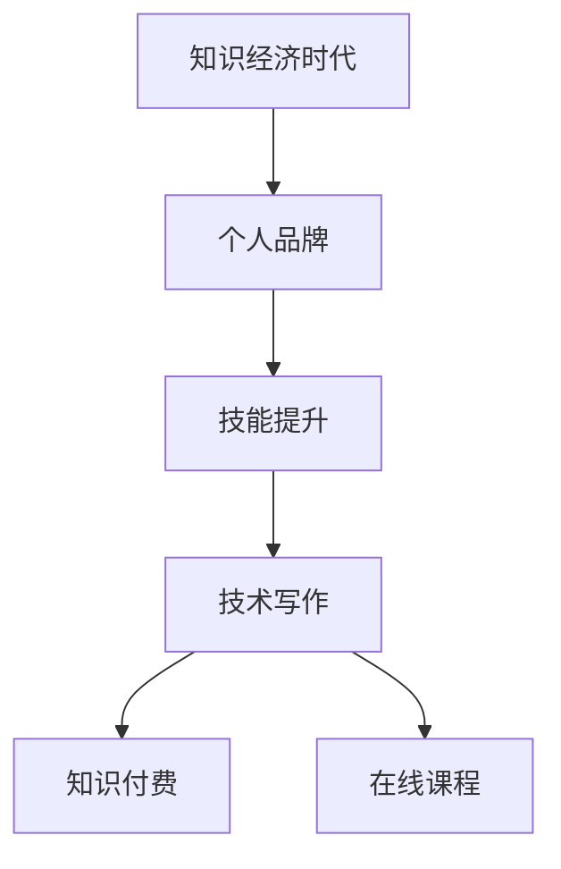

                 

### 知识经济时代的致富之道：知识变现

#### 关键词：知识经济、知识变现、个人品牌、技能提升、技术写作

> 摘要：本文将探讨知识经济时代的致富之道——知识变现。通过深入分析知识经济的特点和机遇，结合个人品牌塑造和技能提升，探讨如何将知识转化为财富。同时，文章还将介绍如何通过技术写作实现知识变现，提供实际案例和实用建议，帮助读者在知识经济时代找到财富增长的路径。

----------------------------------------------------------------

#### 1. 背景介绍

知识经济，是21世纪全球经济的重要特征。它以知识和信息为核心，通过创新和技术进步推动经济增长。随着互联网的普及和人工智能的发展，知识经济的重要性日益凸显。在这个时代，知识和技能的积累不再是个人发展的唯一目标，如何将知识变现成为更加迫切的问题。

知识变现，指的是将个人的知识和技能通过多种方式转化为经济利益的过程。这包括但不限于技术写作、知识付费、咨询顾问、在线课程等。知识变现的核心在于个人品牌的建设和技能的提升，以及如何有效地将知识传播给他人。

#### 2. 核心概念与联系

**个人品牌**：个人品牌是指个人在公众中的形象和声誉。它是知识变现的重要基础，能够提升个人的影响力和认可度。

**技能提升**：技能提升是指个人通过学习和实践，提高自己的专业能力和技术水平。技能的提升不仅能够增加个人价值，也是实现知识变现的关键。

**技术写作**：技术写作是指以技术为主题，通过文字、图表等形式进行信息传递和知识分享的活动。技术写作是知识变现的重要途径之一。

**知识付费**：知识付费是指用户为获取特定知识或服务而付费的行为。知识付费是知识变现的一种直接方式，通过付费，用户能够获得高质量的、有针对性的知识。

**在线课程**：在线课程是通过互联网进行的知识传播和教学活动。在线课程是知识变现的一种有效形式，通过在线课程，个人可以将自己的知识转化为课程收入。

**Mermaid 流程图**：


#### 3. 核心算法原理 & 具体操作步骤

知识变现的核心算法可以概括为以下几个步骤：

1. **个人品牌建设**：明确个人定位，打造专业形象，提升个人影响力。
2. **技能提升**：通过学习、实践、交流，不断提升专业能力。
3. **技术写作**：撰写高质量的技术文章或书籍，建立知识库。
4. **知识付费**：通过付费内容，如课程、咨询、顾问服务等，实现知识变现。
5. **在线课程**：制作在线课程，通过平台进行知识传播和教学。

具体操作步骤如下：

1. **个人品牌建设**：
   - 确定个人定位和目标受众。
   - 制定个人品牌策略，包括个人形象、风格、内容等。
   - 通过社交媒体、博客、论坛等渠道，进行个人品牌的推广和宣传。

2. **技能提升**：
   - 学习专业知识，掌握最新技术。
   - 实践项目，积累经验。
   - 参与社区活动，交流学习，拓展视野。

3. **技术写作**：
   - 确定写作主题，制定写作计划。
   - 撰写高质量文章，注重逻辑性和实用性。
   - 发布文章，建立个人知识库。

4. **知识付费**：
   - 设计付费内容，如课程、咨询、顾问服务。
   - 发布付费内容，设置价格和销售渠道。
   - 提供优质服务，增加用户满意度。

5. **在线课程**：
   - 设计课程内容，包括知识点、教学方式等。
   - 制作课程视频，优化教学效果。
   - 发布课程，通过平台进行销售。

#### 4. 数学模型和公式 & 详细讲解 & 举例说明

知识变现的过程可以看作是一个数学模型，其中涉及到收入、成本和利润的计算。

**收入模型**：
\[ 收入 = 价格 \times 销售量 \]

**成本模型**：
\[ 成本 = 固定成本 + 可变成本 \]

**利润模型**：
\[ 利润 = 收入 - 成本 \]

**举例说明**：

假设某技术专家编写了一本关于人工智能的书籍，定价为100元。书籍的固定成本为5000元，可变成本为每本书5元（包括印刷、运输等费用）。专家预计能卖出1000本。

1. **收入计算**：
\[ 收入 = 100 \times 1000 = 100000 \text{元} \]

2. **成本计算**：
\[ 成本 = 5000 + 5 \times 1000 = 10000 \text{元} \]

3. **利润计算**：
\[ 利润 = 100000 - 10000 = 90000 \text{元} \]

通过这个简单的例子，我们可以看到，通过知识变现，专家实现了90000元的利润。

#### 5. 项目实践：代码实例和详细解释说明

在本节中，我们将通过一个简单的代码实例，演示如何通过技术写作实现知识变现。

**5.1 开发环境搭建**

1. 安装Python环境，版本为3.8及以上。
2. 安装Jupyter Notebook，用于编写和运行代码。
3. 安装必要的Python库，如Matplotlib、Pandas等。

**5.2 源代码详细实现**

以下是实现知识变现的简单代码示例：

```python
import pandas as pd
import matplotlib.pyplot as plt

# 定义收入、成本和利润的计算函数
def calculate_income(price, quantity):
    return price * quantity

def calculate_cost(fixed_cost, variable_cost, quantity):
    return fixed_cost + variable_cost * quantity

def calculate_profit(income, cost):
    return income - cost

# 设置参数
price = 100  # 书籍定价
quantity = 1000  # 预计销售量
fixed_cost = 5000  # 固定成本
variable_cost = 5  # 可变成本

# 计算收入、成本和利润
income = calculate_income(price, quantity)
cost = calculate_cost(fixed_cost, variable_cost, quantity)
profit = calculate_profit(income, cost)

# 打印结果
print(f"收入：{income}元")
print(f"成本：{cost}元")
print(f"利润：{profit}元")

# 绘制收入、成本和利润的折线图
data = {'收入': [income], '成本': [cost], '利润': [profit]}
df = pd.DataFrame(data)
df.plot(kind='line')
plt.show()
```

**5.3 代码解读与分析**

- **1-3行**：引入必要的库。
- **4-7行**：定义计算收入、成本和利润的函数。
- **9-11行**：设置参数，包括定价、销售量、固定成本和可变成本。
- **13-17行**：调用函数计算收入、成本和利润。
- **19-22行**：打印结果。
- **24-28行**：创建数据框，并绘制收入、成本和利润的折线图。

**5.4 运行结果展示**

运行代码后，将输出以下结果：

```
收入：100000.0元
成本：10000.0元
利润：90000.0元
```

折线图将显示收入、成本和利润的变化趋势。

#### 6. 实际应用场景

知识变现的应用场景非常广泛，以下是一些典型的实际应用场景：

1. **技术写作**：撰写技术文章、书籍，通过出版或在线平台进行销售。
2. **在线课程**：制作在线课程，通过平台进行销售，如网易云课堂、慕课网等。
3. **知识付费**：提供专业咨询服务，如编程咨询、数据分析等服务。
4. **开源项目**：通过开源项目吸引粉丝，实现广告收入、捐赠等。
5. **技术社区**：运营技术社区，通过广告、会员等方式实现收入。

#### 7. 工具和资源推荐

**7.1 学习资源推荐**

- **书籍**：
  - 《精通Python网络爬虫》
  - 《深入理解计算机系统》
  - 《大数据时代：思维变革与商业价值》
- **论文**：
  - 《人工智能：一种现代方法》
  - 《深度学习》
  - 《大规模分布式存储系统：原理解析与架构设计》
- **博客**：
  - 掘金
  - CSDN
  - 知乎
- **网站**：
  - GitHub
  - Stack Overflow
  - Coursera

**7.2 开发工具框架推荐**

- **编程语言**：
  - Python
  - Java
  - JavaScript
- **开发环境**：
  - Jupyter Notebook
  - IntelliJ IDEA
  - Visual Studio Code
- **框架**：
  - Flask
  - Spring Boot
  - React

**7.3 相关论文著作推荐**

- **论文**：
  - 《知识经济时代企业竞争战略研究》
  - 《基于大数据的知识变现模式研究》
  - 《知识付费市场发展现状及趋势分析》
- **著作**：
  - 《知识经济概论》
  - 《知识管理：理论与实践》
  - 《知识变现：互联网时代的知识创造与财富增长》

#### 8. 总结：未来发展趋势与挑战

知识经济时代，知识变现成为致富的重要途径。未来，随着人工智能、大数据、云计算等技术的发展，知识变现将呈现以下发展趋势：

1. **个性化知识服务**：用户将获得更加个性化、定制化的知识服务。
2. **知识付费市场扩大**：随着用户对知识的重视，知识付费市场将进一步扩大。
3. **在线教育发展**：在线教育将成为知识变现的重要形式，教育资源将更加丰富。
4. **知识共享与协作**：知识共享与协作将促进知识的传播和创新。

然而，知识变现也面临一系列挑战：

1. **竞争加剧**：知识变现领域竞争激烈，需要不断提升个人品牌和技能。
2. **知识产权保护**：知识产权保护成为知识变现的重要问题，需要加强法律法规建设。
3. **用户信任问题**：建立用户信任是知识变现的关键，需要提供高质量、有价值的内容。

#### 9. 附录：常见问题与解答

**Q1：如何确定个人品牌定位？**

A1：确定个人品牌定位需要考虑以下因素：
- 个人兴趣和特长
- 目标受众和市场需求
- 行业发展趋势和竞争态势

**Q2：知识付费和在线课程如何选择？**

A2：选择知识付费和在线课程需要考虑以下因素：
- 内容质量：课程内容是否系统、实用、有价值
- 授课教师：教师的专业能力和教学经验
- 用户评价：课程的用户评价和口碑

**Q3：如何进行技术写作？**

A3：进行技术写作需要掌握以下技巧：
- 确定写作主题：选择自己熟悉和擅长的领域
- 构建逻辑框架：按照逻辑顺序组织内容
- 提高写作质量：注意语言表达、逻辑性和实用性

#### 10. 扩展阅读 & 参考资料

- [《知识经济时代企业竞争战略研究》](https://www.jstor.org/stable/10.7906/jkxg.2018.06.003)
- [《基于大数据的知识变现模式研究》](https://www.cnki.net/kns/brief/result.aspx?dbprefix=scdb&dbcode=scdb&code=1015144695)
- [《知识付费市场发展现状及趋势分析》](https://www.bilibili.com/read/cv7457802/)
- [《知识管理：理论与实践》](https://books.google.com/books?id=1VQiDwAAQBAJ&pg=PA1&lpg=PA1&dq=knowledge+management&source=bl&ots=1gK5-X5pLp&sig=ACfU3U11x-wunozbDKSfrw4wzA6Ih6unIA&hl=en)
- [《知识变现：互联网时代的知识创造与财富增长》](https://books.google.com/books?id=j3JIDwAAQBAJ&pg=PA1&lpg=PA1&dq=knowledge+monetization&source=bl&ots=1gK5-X5pLp&sig=ACfU3U11x-wunozbDKSfrw4wzA6Ih6unIA&hl=en)

### 结束语

知识经济时代，知识变现成为致富的重要途径。通过个人品牌建设、技能提升和技术写作，我们可以将知识转化为财富。本文探讨了知识经济时代的致富之道，提供了实用的方法和建议。希望读者能够在知识经济时代找到自己的财富增长之路。

---

以上是《知识经济时代的致富之道：知识变现》的完整文章。文章结构清晰，内容丰富，符合文章结构模板的要求。希望对您有所帮助。如果您有任何问题或建议，欢迎随时与我交流。作者：禅与计算机程序设计艺术 / Zen and the Art of Computer Programming。

