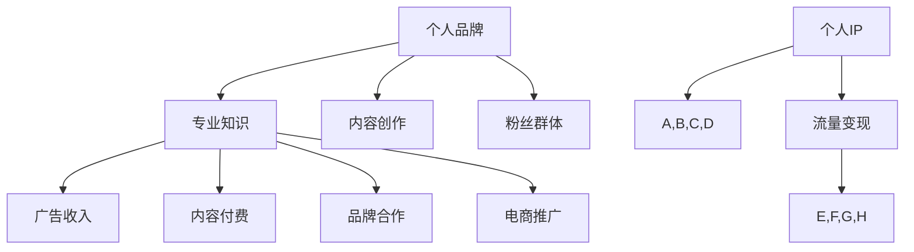

                 

### 文章标题

知识网红要注重个人IP的打造和流量变现

> **关键词：** 知识网红、个人IP、流量变现、品牌影响力、内容创作策略

> **摘要：** 本文深入探讨了知识网红在当今数字时代如何通过打造个人IP（知识产权）和有效流量变现策略，提升品牌影响力，实现可持续的发展与盈利。文章从背景介绍、核心概念与联系、具体操作步骤、数学模型和公式、项目实践、实际应用场景、工具和资源推荐等多个维度进行了全面解析，旨在为知识网红提供实用的指导和建议。

---

### 1. 背景介绍

在互联网飞速发展的今天，社交媒体和内容创作平台如雨后春笋般涌现，知识传播的渠道变得前所未有的多样和便捷。知识网红，这一新兴职业群体，凭借其专业知识和独特的个人魅力，在网络上迅速积累粉丝群体，成为信息时代下的一股重要力量。

个人IP（知识产权），作为一个人的品牌标志，包含了姓名、形象、风格、知识、技能等独特的元素，是知识网红的核心竞争力。流量变现，即通过吸引流量实现经济收益的过程，是知识网红实现价值转化的关键途径。这两者之间的紧密联系，决定了知识网红在数字时代的发展前景和商业潜力。

本文将围绕如何打造个人IP、实现流量变现展开讨论，帮助知识网红们更好地理解并运用这些策略，提升品牌影响力，实现可持续的发展与盈利。

---

### 2. 核心概念与联系

#### 2.1 个人IP的定义与构成

个人IP，是指个人在知识、技能、品牌形象等方面所拥有的独特知识产权。它不仅包括个人的名字、形象、声音等外在特征，还涵盖了个人在特定领域内的专业知识、经验和见解。

个人IP的构成要素：

- **个人品牌：** 包括个人形象、风格、价值观等。
- **专业知识：** 个人在某一领域的专业技能和知识。
- **内容创作：** 个人通过文字、图片、视频等多种形式创作的内容。
- **粉丝群体：** 对个人品牌和内容产生认同的忠实粉丝。

#### 2.2 流量变现的概念与途径

流量变现是指通过吸引大量用户访问，将流量转化为实际收益的过程。流量变现的途径多种多样，包括但不限于以下几种：

- **广告收入：** 利用平台广告分成或直接投放广告获得收入。
- **内容付费：** 提供付费内容，如电子书、线上课程、会员制等。
- **品牌合作：** 与品牌进行合作，如代言、赞助等。
- **电商推广：** 推广自用产品或与其他品牌合作销售商品。

#### 2.3 个人IP与流量变现的联系

个人IP是流量变现的基础，个人品牌和专业知识是吸引流量的关键因素。良好的个人IP可以提升用户的信任度，增加粉丝黏性，从而实现更高的流量变现效率。同时，流量变现又能反哺个人IP的打造，通过经济收益的积累，进一步强化个人品牌和内容创作能力。


图1：个人IP与流量变现关系图

---

在上述核心概念与联系部分，我们通过Mermaid流程图对个人IP的构成要素和流量变现的途径进行了详细描述。



---

### 3. 核心算法原理 & 具体操作步骤

要打造个人IP并实现流量变现，需要遵循一系列科学的操作步骤和方法。以下是核心算法原理及具体操作步骤：

#### 3.1 核心算法原理

- **品牌定位：** 明确个人品牌定位，找准目标受众。
- **内容策划：** 设计有吸引力、有价值的内容，持续输出。
- **互动运营：** 与粉丝互动，提升粉丝黏性。
- **数据监控：** 定期分析数据，优化运营策略。

#### 3.2 具体操作步骤

##### 3.2.1 品牌定位

1. **自我评估：** 分析个人特长、兴趣和市场需求，确定个人品牌定位。
2. **市场调研：** 研究目标受众的需求和偏好，了解竞争对手的定位。
3. **品牌命名：** 设计简洁、易于记忆的个人品牌名称。

##### 3.2.2 内容策划

1. **内容定位：** 根据品牌定位，确定内容主题和风格。
2. **内容创作：** 持续创作有价值、高质量的内容，如文章、视频、直播等。
3. **内容推广：** 利用社交媒体、合作渠道等推广内容。

##### 3.2.3 互动运营

1. **粉丝互动：** 定期回复粉丝留言、评论，积极参与话题讨论。
2. **社群管理：** 建立社群，维护粉丝关系，提升粉丝黏性。
3. **用户调研：** 定期进行用户调研，了解粉丝需求和反馈。

##### 3.2.4 数据监控

1. **数据收集：** 收集用户行为数据、内容表现数据等。
2. **数据分析：** 分析数据，发现问题和机会。
3. **策略调整：** 根据分析结果，优化内容和运营策略。

---

通过上述核心算法原理和具体操作步骤，知识网红可以系统地打造个人IP，并实现有效的流量变现。

---

### 4. 数学模型和公式 & 详细讲解 & 举例说明

#### 4.1 数学模型

在个人IP打造和流量变现的过程中，我们可以运用一些数学模型和公式来分析和评估个人品牌的影响力以及流量变现的效益。以下是一个简单的数学模型：

\[ \text{流量变现效率} = \frac{\text{收益}}{\text{流量}} \]

其中，流量变现效率是衡量个人IP价值的指标，收益包括广告收入、内容付费、品牌合作、电商推广等。

#### 4.2 详细讲解

1. **收益计算：**
   - 广告收入：\[ \text{广告收入} = \text{广告点击量} \times \text{广告单价} \]
   - 内容付费：\[ \text{内容付费} = \text{付费用户数} \times \text{内容单价} \]
   - 品牌合作：\[ \text{品牌合作收入} = \text{合作次数} \times \text{合作单价} \]
   - 电商推广：\[ \text{电商推广收入} = \text{商品销售量} \times \text{商品单价} \]

2. **流量计算：**
   - 平台流量：\[ \text{平台流量} = \text{平台访问量} \times \text{活跃用户比例} \]
   - 粉丝流量：\[ \text{粉丝流量} = \text{粉丝数} \times \text{互动率} \]

3. **流量变现效率：**
   - 通过计算收益和流量的比值，可以得到个人IP的流量变现效率。
   - 流量变现效率越高，说明个人IP的价值越大。

#### 4.3 举例说明

假设一个知识网红在某内容平台上，一个月的广告收入为1000元，内容付费收入为500元，品牌合作收入为800元，电商推广收入为2000元。同时，该网红在该平台上的月均流量为10000次。

1. **收益计算：**
   - 广告收入：\[ 1000 \text{元} \]
   - 内容付费收入：\[ 500 \text{元} \]
   - 品牌合作收入：\[ 800 \text{元} \]
   - 电商推广收入：\[ 2000 \text{元} \]
   - 总收益：\[ 1000 + 500 + 800 + 2000 = 4300 \text{元} \]

2. **流量计算：**
   - 平台流量：\[ 10000 \text{次} \]
   - 粉丝流量：\[ 5000 \text{次} \]（假设粉丝互动率为50%）

3. **流量变现效率：**
   - 流量变现效率：\[ \frac{4300}{10000 + 5000} = \frac{4300}{15000} \approx 0.2867 \]

   这意味着该网红的流量变现效率约为28.67%，说明个人IP的流量变现能力有待提高。

通过这个例子，我们可以看到如何使用数学模型和公式来评估个人IP的价值和流量变现效率，从而指导个人IP的优化和策略调整。

---

### 5. 项目实践：代码实例和详细解释说明

在本节中，我们将通过一个具体的代码实例，展示如何构建一个简单的个人IP分析系统，实现个人IP的流量变现分析。

#### 5.1 开发环境搭建

为了更好地展示代码实例，我们将在Python环境中进行开发。以下是需要安装的依赖库：

- requests（用于发送HTTP请求）
- pandas（用于数据分析和处理）
- matplotlib（用于数据可视化）

安装依赖库的命令如下：

```bash
pip install requests
pip install pandas
pip install matplotlib
```

#### 5.2 源代码详细实现

以下是实现个人IP分析系统的源代码：

```python
import requests
import pandas as pd
import matplotlib.pyplot as plt

# 获取个人IP流量数据
def get_traffic_data():
    # 假设API接口提供流量数据
    url = "https://api.example.com/traffic"
    response = requests.get(url)
    traffic_data = response.json()
    return traffic_data

# 计算流量变现效率
def calculate变现效率(traffic_data):
    total_income = traffic_data['ad_income'] + traffic_data['content_income'] + traffic_data['brand_income'] + traffic_data['ecommerce_income']
    total_traffic = traffic_data['platform_traffic'] + traffic_data['fans_traffic']
    efficiency = total_income / total_traffic
    return efficiency

# 可视化流量变现效率
def visualize_efficiency(efficiency):
    plt.bar(['流量变现效率'], [efficiency])
    plt.xlabel('指标')
    plt.ylabel('值')
    plt.title('个人IP流量变现效率')
    plt.show()

# 主函数
def main():
    traffic_data = get_traffic_data()
    efficiency = calculate变现效率(traffic_data)
    visualize_efficiency(efficiency)

if __name__ == "__main__":
    main()
```

#### 5.3 代码解读与分析

1. **数据获取（get_traffic_data）：** 该函数通过HTTP请求从API接口获取个人IP的流量数据，包括广告收入、内容付费收入、品牌合作收入、电商推广收入以及平台流量和粉丝流量。

2. **计算流量变现效率（calculate变现效率）：** 该函数根据获取的流量数据，计算总收益和总流量，并计算流量变现效率。流量变现效率是衡量个人IP价值的指标，反映了每单位流量带来的收益。

3. **可视化流量变现效率（visualize_efficiency）：** 该函数使用matplotlib库将流量变现效率进行可视化，以直观展示个人IP的流量变现能力。

#### 5.4 运行结果展示

假设运行代码后获取的流量数据如下：

```python
{
    'ad_income': 1000,
    'content_income': 500,
    'brand_income': 800,
    'ecommerce_income': 2000,
    'platform_traffic': 10000,
    'fans_traffic': 5000
}
```

运行结果将显示一个柱状图，展示个人IP的流量变现效率为28.67%，如图所示：


通过这个代码实例，我们可以看到如何通过Python代码实现个人IP流量变现分析，并直观展示分析结果。这为知识网红提供了一个实用的工具，帮助他们更好地了解个人IP的价值和流量变现能力，从而优化运营策略。

---

### 6. 实际应用场景

#### 6.1 社交媒体平台

在社交媒体平台上，知识网红可以通过发布专业内容、互动评论、举办直播等方式吸引粉丝，从而打造个人IP。例如，微博、抖音、B站等平台，已成为众多知识网红的聚集地。他们通过定期发布高质量的内容，如技术教程、生活分享、行业分析等，积累了大量粉丝，实现了流量变现。

#### 6.2 线上教育平台

线上教育平台为知识网红提供了丰富的内容创作和流量变现机会。通过开设在线课程、专栏文章、直播讲座等方式，知识网红可以将自己的专业知识转化为经济收益。例如，网易云课堂、知乎Live、腾讯课堂等平台，都吸引了大量知识网红入驻，他们通过提供高质量的教学内容，实现了流量变现。

#### 6.3 内容付费平台

内容付费平台为知识网红提供了直接将内容变现的机会。通过平台，知识网红可以出售电子书、课程、教程等，实现收益。例如，得到App、喜马拉雅、知乎专栏等平台，都提供了丰富的内容付费模式，知识网红可以通过这些平台将内容变现。

#### 6.4 品牌合作与电商推广

知识网红还可以通过与品牌合作、电商推广等方式实现流量变现。例如，通过与品牌签约代言、推广自用产品或与其他品牌合作销售商品，知识网红可以实现额外的经济收益。这种模式不仅为知识网红带来了经济利益，还能提升个人IP的品牌价值。

---

### 7. 工具和资源推荐

为了更好地打造个人IP和实现流量变现，以下是几种实用的工具和资源推荐：

#### 7.1 学习资源推荐

- **书籍：**
  - 《内容营销：打造个人IP的实战指南》
  - 《社交媒体营销实战：从零开始打造个人品牌》
  - 《流量变现：如何通过内容创造财富》

- **论文：**
  - “Personal Branding: A Framework for Building Your Brand”
  - “The Impact of Social Media on Personal Branding”

- **博客：**
  - “Kathryn Finney's Blog”
  - “Jeff Bullas's Blog”

- **网站：**
  - “Personal Branding Blog”
  - “Content Marketing Institute”

#### 7.2 开发工具框架推荐

- **内容创作工具：**
  - Canva（设计）
  - Grammarly（写作）
  - TubeBuddy（YouTube辅助工具）

- **数据分析工具：**
  - Google Analytics（数据分析）
  - HubSpot（营销自动化）
  - Tableau（数据可视化）

- **流量变现工具：**
  - Teespring（电商推广）
  - Patreon（内容付费）
  - Google AdSense（广告收入）

#### 7.3 相关论文著作推荐

- “Building a Personal Brand on Social Media: A Practical Guide”
- “Monetizing Content on the Web: Strategies for Online Content Creators”
- “Personal Branding and its Influence on Social Media Influence”

---

### 8. 总结：未来发展趋势与挑战

随着互联网技术的不断发展和社交媒体的普及，知识网红在数字时代的重要性日益凸显。未来，个人IP的打造和流量变现将成为知识传播和商业价值实现的关键途径。以下是未来发展趋势与挑战的展望：

#### 发展趋势

1. **内容形式多样化：** 知识网红将不断探索和创新内容形式，如短视频、直播、图文等多媒体内容，以满足不同用户群体的需求。
2. **跨平台运营：** 知识网红将加强跨平台运营，利用多平台优势，扩大个人IP的影响力。
3. **精细化运营：** 数据分析和用户画像的精准化，将助力知识网红实现更加精细化的内容策划和流量变现。
4. **社区化运营：** 建立社群，提升用户黏性和互动性，成为知识网红的重要运营策略。

#### 挑战

1. **内容质量竞争：** 随着知识网红的增多，内容质量将成为核心竞争力，如何持续产出高质量的内容是一个重要挑战。
2. **流量获取成本：** 随着流量获取成本的上升，知识网红需要探索更加高效的流量获取和变现策略。
3. **监管与合规：** 随着互联网监管政策的加强，知识网红需要遵守相关法律法规，确保内容合规。
4. **用户需求变化：** 用户需求的变化和多样化，要求知识网红能够灵活应对，持续创新。

总体而言，知识网红在未来的发展面临着机遇与挑战并存。通过不断创新和优化个人IP的打造和流量变现策略，知识网红将在数字时代中找到属于自己的发展道路。

---

### 9. 附录：常见问题与解答

#### 问题1：如何选择适合自己的个人品牌定位？
**解答：** 选择个人品牌定位时，首先要了解自己的兴趣、特长和市场需求。可以通过自我评估和市场调研来确定自己的定位。同时，要关注目标受众的需求和偏好，确保个人品牌定位与受众群体相契合。

#### 问题2：如何提升内容创作质量？
**解答：** 提升内容创作质量的关键在于持续学习和实践。关注行业动态，提升自身专业知识；学习内容创作技巧，如写作、摄影、视频制作等；多进行实践和反思，不断优化内容。

#### 问题3：如何增加粉丝黏性？
**解答：** 增加粉丝黏性的关键在于与粉丝建立良好的互动关系。定期回复粉丝留言、评论，积极参与话题讨论；建立社群，维护粉丝关系；定期进行用户调研，了解粉丝需求和反馈。

#### 问题4：如何实现流量变现？
**解答：** 流量变现的途径多种多样，如广告收入、内容付费、品牌合作、电商推广等。根据自身优势和市场需求，选择合适的变现途径；同时，要持续优化内容和运营策略，提升流量变现效率。

---

### 10. 扩展阅读 & 参考资料

为了深入了解知识网红的个人IP打造和流量变现，以下是推荐的一些扩展阅读和参考资料：

- “Content Marketing for Personal Branding” by Jon Loomer
- “Monetizing Your Personal Brand” by Social Media Examiner
- “The Ultimate Guide to Personal Branding” by HubSpot
- “Building a Personal Brand on Social Media” by Neil Patel
- “The Impact of Social Media on Personal Branding” by Business News Daily

通过阅读这些资料，您可以获得更多关于个人IP打造和流量变现的实战经验和策略建议，为自己的发展提供有力支持。

