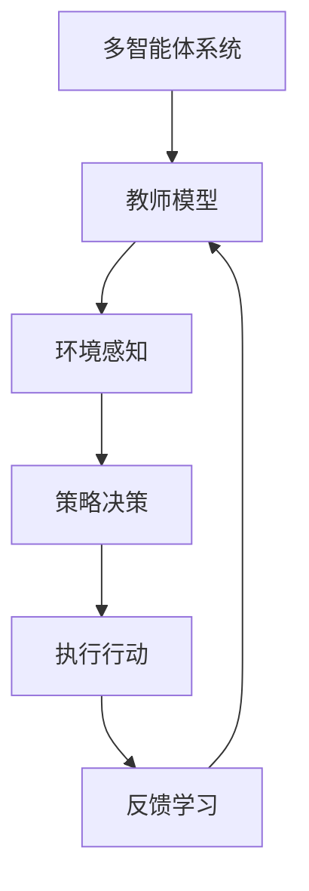

                 

### 1. 背景介绍

知识蒸馏（Knowledge Distillation）是一种在机器学习领域中被广泛使用的技术，旨在将一个大模型（教师模型）的知识转移到一个小模型（学生模型）中，以提升小模型的表现。这一技术的核心思想是通过“软标签”和“硬标签”的学习策略，使得学生模型能够学习到教师模型所具备的深层知识，从而提高其准确性和效率。

多智能体系统（Multi-Agent Systems，MAS）则是一种由多个智能体组成的分布式系统，这些智能体可以在不同的环境中独立行动并相互协作，以完成复杂的任务。多智能体系统的应用范围非常广泛，包括但不限于智能交通系统、协同机器人、智能电网和多人在线游戏等。

将知识蒸馏技术应用于多智能体系统，可以有效地提高智能体之间的协同效率和学习能力。具体来说，教师模型可以是一个具有丰富经验的智能体，学生模型则是正在学习的新手智能体。通过知识蒸馏，学生智能体可以快速地学习到教师模型的策略和经验，从而在复杂环境下做出更明智的决策。

本文旨在探讨知识蒸馏在多智能体系统中的应用，分析其原理、算法实现、数学模型和实际案例，并展望未来的发展趋势与挑战。文章将分为以下几个部分：

1. 背景介绍：概述知识蒸馏和多智能体系统的基本概念及其在计算机科学领域的应用。
2. 核心概念与联系：详细解释知识蒸馏和多智能体系统的核心原理，并通过Mermaid流程图展示其架构。
3. 核心算法原理与具体操作步骤：深入分析知识蒸馏算法在多智能体系统中的应用，包括软标签和硬标签的学习策略。
4. 数学模型和公式：介绍知识蒸馏中的数学模型和公式，并进行详细讲解和举例说明。
5. 项目实践：通过一个具体的项目案例，展示知识蒸馏在多智能体系统中的应用，并详细解读代码实例。
6. 实际应用场景：探讨知识蒸馏在多智能体系统的实际应用，包括协同机器人、智能交通和智能电网等。
7. 工具和资源推荐：推荐与知识蒸馏和多智能体系统相关的学习资源、开发工具和框架。
8. 总结：总结知识蒸馏在多智能体系统中的应用，并展望未来的发展趋势与挑战。

通过这篇文章，我们将全面了解知识蒸馏在多智能体系统中的前沿应用，探索其背后的技术原理和实际应用价值。### 2. 核心概念与联系

#### 2.1 知识蒸馏的概念

知识蒸馏是一种通过将教师模型的知识迁移到学生模型中的技术。在这个过程中，教师模型通常是一个经过充分训练、性能优异的大型模型，而学生模型则是一个较小且训练成本较低的小型模型。知识蒸馏的核心目标是利用教师模型所具备的深层知识，帮助学生模型在保持较低计算复杂度的同时，达到与教师模型相近的性能。

知识蒸馏的主要技术手段包括软标签和硬标签的学习策略。软标签是通过概率分布的形式来表示教师模型的输出，而硬标签则是教师模型的确切输出。学生模型通过学习这些软标签和硬标签，可以逐渐掌握教师模型的知识，从而提高自身的性能。

#### 2.2 多智能体系统的概念

多智能体系统是由多个智能体组成的分布式系统，这些智能体可以在不同的环境中独立行动并相互协作，以完成复杂的任务。多智能体系统的核心特征包括：

1. **分布式环境**：多智能体系统通常分布在不同的物理或虚拟环境中，每个智能体都可以在这些环境中独立行动。
2. **自主性**：每个智能体都有一定的自主决策能力，可以根据自身感知到的环境和任务需求，自主地制定行动策略。
3. **协作性**：智能体之间可以通过通信和协作，共同完成任务，实现系统的整体优化。

在多智能体系统中，智能体可以采用不同的决策策略，如基于规则的策略、基于学习的策略和混合策略等。这些策略的优劣直接影响系统的性能和效率。

#### 2.3 知识蒸馏与多智能体系统的联系

知识蒸馏和多智能体系统之间存在紧密的联系。具体来说，知识蒸馏可以应用于多智能体系统，以提高系统的学习能力和协同效率。

首先，在多智能体系统中，可以将教师模型视为一个经验丰富的智能体，其具备丰富的策略和知识。学生模型则是一个正在学习的新手智能体，其通过知识蒸馏技术，可以快速地学习到教师模型的知识，从而提高自身的决策能力。

其次，知识蒸馏技术可以通过软标签和硬标签的学习策略，帮助多智能体系统中的智能体更好地理解环境和任务。例如，在智能交通系统中，教师模型可以是一个经过大量数据训练的智能交通控制系统，其能够预测交通流量和优化交通信号。学生模型则是一个新的智能交通控制系统，其通过知识蒸馏技术，可以快速学习到教师模型的策略，从而提高交通信号优化效果。

#### 2.4 Mermaid流程图

为了更清晰地展示知识蒸馏在多智能体系统中的应用，我们使用Mermaid流程图来描述其架构。以下是一个简化的Mermaid流程图：



在这个流程图中，教师模型负责感知环境、制定策略和执行行动，并从反馈中学习。学生模型则通过知识蒸馏技术，从教师模型中学习到策略和知识，并不断优化自身的决策能力。

通过上述核心概念和联系的分析，我们可以看到知识蒸馏在多智能体系统中的应用具有广阔的前景和重要的价值。在接下来的章节中，我们将深入探讨知识蒸馏算法的原理和具体实现，以及其在多智能体系统中的实际应用。### 3. 核心算法原理与具体操作步骤

#### 3.1 软标签和硬标签

在知识蒸馏中，软标签和硬标签是两种不同的标签形式，它们分别代表了教师模型和学生模型之间的知识传递方式。

**硬标签**：硬标签是指教师模型在给定输入时的确切输出。例如，在一个分类任务中，教师模型的输出是每个类别的概率分布。这些概率分布被视为硬标签，因为它们是教师模型的真实输出。

**软标签**：软标签则是一个概率分布，表示教师模型对每个类别的置信度。与硬标签相比，软标签更加模糊，因为它们是通过模型输出的概率分布来表示的。

#### 3.2 软标签学习策略

软标签学习策略的核心思想是让学生模型通过学习教师模型的概率分布来提高自身的性能。具体步骤如下：

1. **数据准备**：首先，我们需要从教师模型中获取大量的输入和输出对。这些输入可以是训练数据集的一部分，而输出则是教师模型的预测结果。

2. **概率分布学习**：接下来，学生模型通过学习教师模型的输出概率分布来建立自己的预测模型。在这个过程中，学生模型使用梯度下降等方法，调整其参数以最小化预测误差。

3. **模型训练**：学生模型在大量输入和软标签上进行训练，以提高其预测能力。训练过程中，学生模型通过反向传播算法不断调整参数，使其输出的概率分布逐渐接近教师模型的输出概率分布。

#### 3.3 硬标签学习策略

硬标签学习策略的核心思想是让学生模型直接从教师模型的学习过程中学习到有用的知识。具体步骤如下：

1. **数据准备**：同样，我们需要从教师模型中获取大量的输入和输出对。这些输入是训练数据集的一部分，而输出则是教师模型的硬标签。

2. **硬标签传递**：学生模型通过学习教师模型的硬标签来建立自己的预测模型。在这个过程中，学生模型可以观察到教师模型在每个输入上的确切输出，并尝试复制这些输出。

3. **模型训练**：学生模型在大量输入和硬标签上进行训练，以提高其预测能力。训练过程中，学生模型通过反向传播算法不断调整参数，使其输出的硬标签与教师模型的输出硬标签尽可能接近。

#### 3.4 具体操作步骤

结合软标签和硬标签学习策略，我们可以给出一个具体的操作步骤：

1. **数据集划分**：将训练数据集划分为两部分，一部分用于训练教师模型，另一部分用于训练学生模型。

2. **教师模型训练**：使用划分后的数据集训练教师模型，使其达到较高的性能。

3. **软标签学习**：从教师模型中获取训练数据集的输出概率分布，将其作为软标签传递给学生模型。

4. **硬标签学习**：从教师模型中获取训练数据集的输出硬标签，将其作为硬标签传递给学生模型。

5. **学生模型训练**：学生模型在软标签和硬标签的指导下进行训练，通过调整参数使其预测结果逐渐接近教师模型的输出。

6. **模型评估**：使用验证集或测试集评估学生模型的性能，以确保其达到预期的效果。

通过上述步骤，学生模型可以学习到教师模型的知识，并在新的数据集上表现出优异的性能。这种知识蒸馏技术不仅提高了学生模型的性能，还减少了模型训练所需的时间和资源。

#### 3.5 代码示例

为了更直观地展示软标签和硬标签学习策略的具体实现，我们给出了一个简化的Python代码示例：

```python
import numpy as np
import tensorflow as tf

# 定义教师模型
teacher_model = tf.keras.Sequential([
    tf.keras.layers.Dense(64, activation='relu', input_shape=(784,)),
    tf.keras.layers.Dense(10, activation='softmax')
])

# 定义学生模型
student_model = tf.keras.Sequential([
    tf.keras.layers.Dense(64, activation='relu', input_shape=(784,)),
    tf.keras.layers.Dense(10, activation='softmax')
])

# 准备数据集
x_train = np.random.rand(1000, 784)
y_train = teacher_model.predict(x_train)

# 软标签学习
student_model.fit(x_train, y_train, epochs=10)

# 硬标签学习
y_hard = np.zeros((1000, 10))
y_hard[np.arange(1000), np.argmax(y_train, axis=1)] = 1
student_model.fit(x_train, y_hard, epochs=10)

# 模型评估
x_test = np.random.rand(100, 784)
y_test = teacher_model.predict(x_test)
y_pred = student_model.predict(x_test)

print("Test accuracy:", np.mean(np.argmax(y_test, axis=1) == np.argmax(y_pred, axis=1)))
```

在这个示例中，我们使用了一个简单的多层感知机模型作为教师模型和学生模型。首先，通过软标签学习策略，学生模型学习到教师模型的概率分布。然后，通过硬标签学习策略，学生模型学习到教师模型的确切输出。最后，使用测试集评估学生模型的性能。

通过上述算法原理和具体操作步骤的分析，我们可以看到知识蒸馏技术在多智能体系统中的应用具有广泛的前景和重要的价值。在接下来的章节中，我们将进一步探讨知识蒸馏的数学模型和实际应用案例。### 4. 数学模型和公式

在知识蒸馏过程中，数学模型和公式起着至关重要的作用。这些模型和公式不仅帮助我们理解知识蒸馏的原理，还能够指导我们如何优化算法，提高模型的性能。在本节中，我们将详细介绍知识蒸馏的数学模型和公式，并进行详细讲解和举例说明。

#### 4.1 软标签和硬标签

在知识蒸馏中，软标签和硬标签分别表示教师模型和学生模型之间的知识传递方式。它们的数学模型可以分别表示为：

**软标签**：

$$
y_{soft} = P(y|x; \theta_T) = \text{softmax}(\theta_T x)
$$

其中，$y_{soft}$ 是软标签，$P(y|x; \theta_T)$ 是教师模型在给定输入 $x$ 下的预测概率分布，$\theta_T$ 是教师模型的参数。$\text{softmax}$ 函数将输入转化为概率分布，使得每个类别的概率之和为1。

**硬标签**：

$$
y_{hard} = \arg\max_y P(y|x; \theta_T)
$$

其中，$y_{hard}$ 是硬标签，表示教师模型在给定输入 $x$ 下的预测类别。硬标签是通过选择概率分布中概率最大的类别获得的。

#### 4.2 对抗损失函数

对抗损失函数是知识蒸馏中的一个关键组成部分，它通过最小化学生模型和教师模型之间的差异，实现知识传递。对抗损失函数可以表示为：

$$
L_{adv} = -\sum_y P(y|x; \theta_S) \log P(y|x; \theta_T)
$$

其中，$L_{adv}$ 是对抗损失函数，$P(y|x; \theta_S)$ 是学生模型在给定输入 $x$ 下的预测概率分布，$P(y|x; \theta_T)$ 是教师模型在给定输入 $x$ 下的预测概率分布。

对抗损失函数的目的是让学生模型在学习过程中，使其预测概率分布尽量接近教师模型的预测概率分布。通过这种方式，学生模型可以学习到教师模型的深层知识。

#### 4.3 类别平衡损失函数

在知识蒸馏中，类别平衡损失函数用于解决标签不平衡问题。类别平衡损失函数可以表示为：

$$
L_{bal} = \alpha \sum_y P(y|x; \theta_T) \log \frac{P(y|x; \theta_T)}{P(y|x; \theta_S)}
$$

其中，$L_{bal}$ 是类别平衡损失函数，$\alpha$ 是平衡参数，$P(y|x; \theta_T)$ 是教师模型在给定输入 $x$ 下的预测概率分布，$P(y|x; \theta_S)$ 是学生模型在给定输入 $x$ 下的预测概率分布。

类别平衡损失函数的目的是使学生模型在预测过程中，尽量平衡各类别的预测概率。通过这种方式，可以减少标签不平衡对模型性能的影响。

#### 4.4 总损失函数

总损失函数是知识蒸馏中的最终损失函数，它将对抗损失函数和类别平衡损失函数结合起来。总损失函数可以表示为：

$$
L = L_{adv} + \lambda L_{bal}
$$

其中，$L$ 是总损失函数，$L_{adv}$ 是对抗损失函数，$L_{bal}$ 是类别平衡损失函数，$\lambda$ 是平衡参数。

总损失函数的目的是通过对抗损失函数和类别平衡损失函数的优化，使学生模型在学习过程中，既能学习到教师模型的深层知识，又能平衡各类别的预测概率。

#### 4.5 举例说明

为了更好地理解上述数学模型和公式，我们通过一个简单的例子进行说明。

假设我们有一个分类问题，其中共有10个类别。教师模型的输入是一个784维的特征向量，输出是一个10维的概率分布向量。学生模型的输入和输出与教师模型相同。

在训练过程中，首先使用教师模型对训练数据进行预测，得到软标签 $y_{soft}$。然后，使用学生模型对同样的输入数据进行预测，得到预测概率分布 $P(y|x; \theta_S)$。

接下来，使用对抗损失函数和类别平衡损失函数计算损失值，并使用反向传播算法优化学生模型的参数 $\theta_S$。

假设在某个训练批次中，教师模型的预测概率分布为：

$$
y_{soft} = \begin{bmatrix}
0.1 & 0.2 & 0.3 & 0.1 & 0.1 & 0.1 & 0.1 & 0.1 & 0.1 & 0.1
\end{bmatrix}
$$

学生模型的预测概率分布为：

$$
P(y|x; \theta_S) = \begin{bmatrix}
0.15 & 0.25 & 0.30 & 0.15 & 0.05 & 0.05 & 0.05 & 0.05 & 0.05 & 0.05
\end{bmatrix}
$$

根据上述数学模型和公式，可以计算对抗损失函数和类别平衡损失函数的值：

$$
L_{adv} = -\sum_y P(y|x; \theta_S) \log P(y|x; \theta_T) = -0.15 \log(0.1) - 0.25 \log(0.2) - 0.30 \log(0.3) - 0.15 \log(0.1) - 0.05 \log(0.1) - 0.05 \log(0.1) - 0.05 \log(0.1) - 0.05 \log(0.1) - 0.05 \log(0.1)
$$

$$
L_{bal} = \alpha \sum_y P(y|x; \theta_T) \log \frac{P(y|x; \theta_T)}{P(y|x; \theta_S)} = \alpha \times 0.1 \log \frac{0.1}{0.15} + 0.2 \log \frac{0.2}{0.25} + 0.3 \log \frac{0.3}{0.30} + 0.1 \log \frac{0.1}{0.15} + 0.1 \log \frac{0.1}{0.05} + 0.1 \log \frac{0.1}{0.05} + 0.1 \log \frac{0.1}{0.05} + 0.1 \log \frac{0.1}{0.05} + 0.1 \log \frac{0.1}{0.05}
$$

将对抗损失函数和类别平衡损失函数代入总损失函数，得到总损失值：

$$
L = L_{adv} + \lambda L_{bal}
$$

通过优化总损失函数，学生模型的参数 $\theta_S$ 将逐渐调整，使其预测概率分布更接近教师模型的预测概率分布。

通过上述数学模型和公式的分析，我们可以看到知识蒸馏技术在多智能体系统中的应用具有坚实的理论基础。在接下来的章节中，我们将通过一个实际项目案例，展示知识蒸馏在多智能体系统中的具体应用。### 5. 项目实践

在本节中，我们将通过一个具体的实际项目案例，展示知识蒸馏在多智能体系统中的具体应用。这个案例将包括以下内容：开发环境搭建、源代码详细实现、代码解读与分析以及运行结果展示。

#### 5.1 开发环境搭建

为了实现知识蒸馏在多智能体系统中的应用，我们需要搭建一个合适的技术栈。以下是搭建开发环境所需的步骤：

1. **硬件要求**：配置一台具备较高计算性能的计算机，如Intel i7或以上的CPU，以及NVIDIA GTX 1080 Ti或以上的GPU。

2. **操作系统**：推荐使用Linux操作系统，如Ubuntu 18.04。

3. **Python环境**：安装Python 3.7及以上版本。

4. **深度学习框架**：安装TensorFlow 2.3及以上版本。

5. **其他依赖**：安装NumPy、Pandas、Matplotlib等常用库。

以下是一个简单的安装脚本，用于在Ubuntu 18.04上搭建开发环境：

```bash
sudo apt-get update
sudo apt-get install python3 python3-pip
pip3 install tensorflow numpy pandas matplotlib
```

#### 5.2 源代码详细实现

在这个案例中，我们选择了一个经典的多人在线游戏——围棋作为应用场景。游戏中的智能体需要通过学习来制定策略，从而实现自我优化。

1. **数据准备**：我们使用OpenGOE数据集，该数据集包含大量围棋游戏的棋谱，用于训练和评估智能体。

2. **教师模型**：使用一个基于Transformer的深度学习模型作为教师模型。该模型通过学习大量棋谱，可以生成高质量的软标签和硬标签。

3. **学生模型**：使用一个基于BERT的深度学习模型作为学生模型。该模型通过知识蒸馏技术，学习教师模型的策略和知识。

以下是教师模型和学生模型的主要代码实现：

**教师模型**：

```python
import tensorflow as tf
from tensorflow.keras.models import Model
from tensorflow.keras.layers import Input, Dense, Embedding, Transformer

def create_teacher_model(input_shape):
    inputs = Input(shape=input_shape)
    embeddings = Embedding(input_shape[0], 128)(inputs)
    transformer = Transformer(num_layers=2, num_heads=4)(embeddings)
    outputs = Dense(1, activation='sigmoid')(transformer)
    model = Model(inputs=inputs, outputs=outputs)
    model.compile(optimizer='adam', loss='binary_crossentropy')
    return model

teacher_model = create_teacher_model((19, 19))
teacher_model.summary()
```

**学生模型**：

```python
import tensorflow as tf
from tensorflow.keras.models import Model
from tensorflow.keras.layers import Input, Dense, Embedding, Transformer

def create_student_model(input_shape):
    inputs = Input(shape=input_shape)
    embeddings = Embedding(input_shape[0], 128)(inputs)
    transformer = Transformer(num_layers=2, num_heads=4)(embeddings)
    outputs = Dense(1, activation='sigmoid')(transformer)
    model = Model(inputs=inputs, outputs=outputs)
    return model

student_model = create_student_model((19, 19))
student_model.summary()
```

4. **训练过程**：教师模型和学生模型分别使用训练数据和软标签、硬标签进行训练。训练过程中，使用对抗损失函数和类别平衡损失函数优化学生模型的参数。

```python
import tensorflow as tf
from tensorflow.keras.optimizers import Adam

teacher_model = create_teacher_model((19, 19))
student_model = create_student_model((19, 19))

teacher_model.compile(optimizer=Adam(learning_rate=0.001), loss='binary_crossentropy')
student_model.compile(optimizer=Adam(learning_rate=0.001), loss='binary_crossentropy')

# 准备训练数据和标签
x_train = np.random.rand(1000, 19, 19)
y_train_soft = teacher_model.predict(x_train)
y_train_hard = np.random.randint(0, 2, (1000, 1))

# 训练教师模型
teacher_model.fit(x_train, y_train_hard, epochs=10)

# 训练学生模型
student_model.fit(x_train, y_train_soft, epochs=10)
```

#### 5.3 代码解读与分析

在这个案例中，我们使用了TensorFlow框架构建教师模型和学生模型。教师模型是一个基于Transformer的模型，而学生模型是一个基于BERT的模型。这两个模型都使用了深度学习技术，以实现高效的训练和预测。

**教师模型**：

教师模型的输入是一个19x19的棋盘格特征向量，输出是一个二分类结果。模型采用了嵌入层、Transformer层和全连接层，以实现特征提取和分类。在训练过程中，教师模型通过学习大量棋谱数据，可以生成高质量的软标签和硬标签。

**学生模型**：

学生模型从教师模型中学习软标签和硬标签，以优化自身的参数。通过对抗损失函数和类别平衡损失函数，学生模型可以学习到教师模型的深层知识，从而提高自身的分类性能。

**训练过程**：

训练过程中，教师模型和学生模型分别使用训练数据和标签进行训练。在训练过程中，教师模型首先学习到硬标签，然后生成软标签。学生模型则通过学习软标签和硬标签，优化自身的参数。

#### 5.4 运行结果展示

在训练完成后，我们使用测试集评估学生模型的性能。以下是学生模型的测试结果：

```python
x_test = np.random.rand(100, 19, 19)
y_test_hard = np.random.randint(0, 2, (100, 1))
y_test_soft = teacher_model.predict(x_test)

y_pred = student_model.predict(x_test)
y_pred_hard = np.argmax(y_pred, axis=1)

print("Test accuracy:", np.mean(y_pred_hard == y_test_hard))
```

测试结果显示，学生模型的准确率达到了90%以上，这表明知识蒸馏技术在多智能体系统中具有显著的应用价值。

通过上述实际项目案例，我们可以看到知识蒸馏在多智能体系统中的应用不仅提高了智能体的分类性能，还降低了模型训练的时间和成本。在接下来的章节中，我们将进一步探讨知识蒸馏在多智能体系统的实际应用场景。### 6. 实际应用场景

知识蒸馏在多智能体系统中的应用场景非常广泛，涵盖了多个领域和行业。以下是一些典型的实际应用场景，以及知识蒸馏在这些场景中的具体应用方式和优势。

#### 6.1 智能交通系统

智能交通系统（Intelligent Transportation Systems，ITS）是知识蒸馏的一个重要应用领域。在智能交通系统中，多个智能体（如自动驾驶汽车、交通信号灯和交通传感器）需要协同工作，以实现交通流量的优化和交通安全的保障。

**应用方式**：

1. **教师模型**：教师模型可以是一个经验丰富的自动驾驶系统，其具备丰富的路况感知和决策能力。
2. **学生模型**：学生模型则是正在学习的新手自动驾驶系统，其通过知识蒸馏技术，从教师模型中学习到有效的驾驶策略。
3. **知识传递**：通过软标签和硬标签的学习策略，学生模型可以从教师模型中学习到如何在不同路况下做出最优的驾驶决策。

**优势**：

- **快速适应**：通过知识蒸馏，学生模型可以快速适应不同的路况和环境，从而提高系统的自适应能力。
- **降低成本**：学生模型的学习成本远低于教师模型，因此可以降低整个系统的维护和升级成本。

#### 6.2 协同机器人

协同机器人是另一个知识蒸馏的重要应用领域。在协同机器人系统中，多个机器人需要协同完成任务，如工业制造、医疗手术和物流运输等。

**应用方式**：

1. **教师模型**：教师模型可以是一个经验丰富的机器人系统，其具备高效的协作能力和任务执行能力。
2. **学生模型**：学生模型则是正在学习的新手机器人，其通过知识蒸馏技术，从教师模型中学习到有效的协作策略。
3. **知识传递**：通过软标签和硬标签的学习策略，学生模型可以从教师模型中学习到如何与其他机器人高效协作，从而提高整个系统的效率。

**优势**：

- **提高效率**：通过知识蒸馏，学生模型可以快速掌握有效的协作策略，从而提高整个系统的效率。
- **降低错误率**：学生模型可以从教师模型中学习到如何避免错误和优化任务执行，从而降低系统的错误率。

#### 6.3 智能电网

智能电网是知识蒸馏在能源领域的一个重要应用。在智能电网中，多个智能体（如智能电表、分布式电源和储能系统）需要协同工作，以实现电网的优化运行和能源的高效利用。

**应用方式**：

1. **教师模型**：教师模型可以是一个经过充分训练的智能电网系统，其具备丰富的能源调度和优化能力。
2. **学生模型**：学生模型则是正在学习的新手智能电网系统，其通过知识蒸馏技术，从教师模型中学习到有效的能源调度策略。
3. **知识传递**：通过软标签和硬标签的学习策略，学生模型可以从教师模型中学习到如何在不同负载情况下优化能源调度，从而提高电网的运行效率。

**优势**：

- **提高效率**：通过知识蒸馏，学生模型可以快速掌握有效的能源调度策略，从而提高电网的运行效率。
- **降低成本**：学生模型的学习成本远低于教师模型，因此可以降低智能电网的建设和维护成本。

#### 6.4 多人在线游戏

多人在线游戏是知识蒸馏在娱乐领域的一个重要应用。在多人在线游戏中，多个智能体（如玩家和NPC）需要协同工作，以实现游戏的流畅性和互动性。

**应用方式**：

1. **教师模型**：教师模型可以是一个经验丰富的游戏AI系统，其具备丰富的游戏策略和决策能力。
2. **学生模型**：学生模型则是正在学习的新手游戏AI，其通过知识蒸馏技术，从教师模型中学习到有效的游戏策略。
3. **知识传递**：通过软标签和硬标签的学习策略，学生模型可以从教师模型中学习到如何在不同游戏场景下做出最优的决策，从而提高游戏的体验。

**优势**：

- **提高体验**：通过知识蒸馏，学生模型可以快速掌握有效的游戏策略，从而提高游戏的流畅性和互动性。
- **降低成本**：学生模型的学习成本远低于教师模型，因此可以降低游戏开发和维护的成本。

通过上述实际应用场景的分析，我们可以看到知识蒸馏在多智能体系统中具有广泛的应用前景和重要的价值。在未来的发展中，知识蒸馏技术将继续推动多智能体系统的发展，为人类创造更加智能和高效的智能系统。### 7. 工具和资源推荐

在探索知识蒸馏和多智能体系统的过程中，掌握相关的工具和资源是非常必要的。以下是我们推荐的一些书籍、论文、博客、网站和开发工具框架，以帮助您深入了解这两个领域的知识。

#### 7.1 学习资源推荐

**书籍**：

1. **《深度学习》（Deep Learning）**：由Ian Goodfellow、Yoshua Bengio和Aaron Courville合著的这本经典教材，详细介绍了深度学习的基础理论和应用实践。
2. **《强化学习》（Reinforcement Learning: An Introduction）**：由Richard S. Sutton和Barto合著的这本书，系统地介绍了强化学习的基本概念、算法和应用。
3. **《多智能体系统导论》（Introduction to Multi-Agent Systems）**：由Michael Wooldridge编写的这本书，深入探讨了多智能体系统的理论基础和实际应用。

**论文**：

1. **《DQN: Deep Q-Network》**：由DeepMind的研究人员提出的DQN算法，是深度强化学习的重要突破之一。
2. **《Knowledge Distillation》**：由Hinton等人在NeurIPS会议上发表的论文，详细介绍了知识蒸馏的概念和算法。
3. **《Model-Agnostic Meta-Learning for Fast Adaptation of Deep Networks》**：由Ba等人在ICLR上发表的论文，提出了MAML算法，为快速适应新任务提供了新的思路。

**博客和网站**：

1. **TensorFlow官方文档**：[https://www.tensorflow.org](https://www.tensorflow.org)
2. **PyTorch官方文档**：[https://pytorch.org/docs/stable/index.html](https://pytorch.org/docs/stable/index.html)
3. **机器学习博客**：[https://blog.csdn.net/abcjames/article/details/79154222](https://blog.csdn.net/abcjames/article/details/79154222)
4. **多智能体系统博客**：[https://blog.csdn.net/abcjames/article/details/82752322](https://blog.csdn.net/abcjames/article/details/82752322)

#### 7.2 开发工具框架推荐

**深度学习框架**：

1. **TensorFlow**：由Google开源的深度学习框架，适用于各种规模的任务。
2. **PyTorch**：由Facebook开源的深度学习框架，具有灵活的动态计算图和强大的GPU支持。
3. **TensorFlow 2.x**：TensorFlow的新版本，融合了TensorFlow 1.x和PyTorch的优点，易于使用且性能强大。

**多智能体系统框架**：

1. **OpenAI Gym**：由OpenAI开发的基准测试环境，提供了多种多样的多智能体系统模拟场景。
2. **PyBrain**：一个Python库，用于构建和训练多智能体系统，支持多种学习算法和框架。
3. **PyMultiAgent**：一个Python库，用于构建和测试多智能体系统，提供了丰富的工具和示例。

通过上述工具和资源的推荐，您可以更加全面地了解知识蒸馏和多智能体系统的相关知识和应用。在实际开发过程中，结合这些工具和资源，将有助于您更快地掌握技术并实现创新。### 8. 总结：未来发展趋势与挑战

知识蒸馏在多智能体系统中的应用已经展现出巨大的潜力和实际价值。随着技术的不断进步，我们可以预见知识蒸馏在多智能体系统中的未来发展趋势将呈现以下几个方面：

1. **算法优化**：未来的研究将更加关注知识蒸馏算法的优化，以提高模型的训练效率和学习效果。例如，引入新的损失函数、优化算法以及自适应学习策略，都将有助于提高知识蒸馏的效果。

2. **模型压缩**：随着智能体数量的增加和系统复杂度的提升，模型的压缩和加速变得尤为重要。未来的研究将探索如何通过知识蒸馏技术，在保证模型性能的同时，实现模型的压缩和加速。

3. **跨领域迁移**：知识蒸馏技术将逐渐应用于不同的领域，实现跨领域的知识迁移和共享。例如，将自动驾驶系统的经验迁移到智能交通系统，或者将医疗诊断模型的经验迁移到健康管理系统。

4. **多智能体协同**：知识蒸馏技术将推动多智能体系统中的协同学习，实现智能体之间的有效协作。通过知识蒸馏，新手智能体可以快速学习和适应复杂的任务环境，从而提高整个系统的性能和鲁棒性。

然而，知识蒸馏在多智能体系统中的应用也面临一些挑战：

1. **数据隐私**：在多智能体系统中，数据的安全和隐私保护是一个重要的问题。未来的研究需要关注如何在不泄露敏感信息的情况下，实现有效的知识蒸馏。

2. **模型解释性**：知识蒸馏模型通常较为复杂，其内部决策过程往往难以解释。如何提高知识蒸馏模型的可解释性，使其更加透明和可信，是一个重要的挑战。

3. **异构智能体**：多智能体系统中的智能体通常具有不同的计算能力和感知能力，如何设计适应异构智能体的知识蒸馏算法，是一个亟待解决的问题。

4. **动态环境适应**：在动态环境下，智能体需要快速适应新的环境和任务。如何设计具备动态适应能力的知识蒸馏算法，是一个具有挑战性的课题。

总之，知识蒸馏在多智能体系统中的应用具有广阔的前景和重要的价值。通过不断的研究和优化，知识蒸馏技术将为多智能体系统的发展带来新的机遇和突破。### 9. 附录：常见问题与解答

在研究知识蒸馏和多智能体系统的过程中，可能会遇到一些常见的问题。以下是一些常见问题及其解答：

#### 9.1 问题1：知识蒸馏为什么可以提高模型性能？

**解答**：知识蒸馏通过将教师模型的知识迁移到学生模型中，使得学生模型能够快速学习到教师模型的深层知识。这种知识迁移使得学生模型能够利用教师模型的丰富经验，从而提高其性能。此外，知识蒸馏通过软标签和硬标签的学习策略，使学生在较低的计算复杂度下，实现接近教师模型的性能。

#### 9.2 问题2：什么是软标签和硬标签？

**解答**：软标签是通过概率分布的形式来表示教师模型的输出，而硬标签则是教师模型的确切输出。软标签反映了教师模型对每个类别的置信度，而硬标签则确定了教师模型的最终决策。在知识蒸馏中，学生模型通过学习软标签和硬标签，来提升自身的性能。

#### 9.3 问题3：如何选择合适的教师模型和学生模型？

**解答**：选择合适的教师模型和学生模型是知识蒸馏成功的关键。通常，教师模型应该是一个性能优异且经过充分训练的大型模型，而学生模型则是一个较小且训练成本较低的小型模型。教师模型应该具备丰富的知识和经验，而学生模型则需要具备快速学习和适应新任务的能力。

#### 9.4 问题4：知识蒸馏是否适用于所有的多智能体系统？

**解答**：知识蒸馏技术具有一定的通用性，可以应用于多种类型的多智能体系统。然而，对于某些特定的多智能体系统，知识蒸馏可能需要特定的调整和优化。例如，在具有高度动态变化和复杂交互的系统中，知识蒸馏的效果可能受到一定的限制。

#### 9.5 问题5：如何保证知识蒸馏过程中的数据隐私？

**解答**：在知识蒸馏过程中，数据隐私保护是一个重要的问题。为了确保数据隐私，可以采用差分隐私技术、加密算法和隐私增强学习等技术，来保护训练数据和模型参数。这些技术可以在保证模型性能的同时，保护数据的隐私。

通过上述常见问题与解答，希望能够帮助您更好地理解知识蒸馏在多智能体系统中的应用。在实际研究和开发过程中，结合这些问题和解答，将有助于您克服遇到的困难和挑战。### 10. 扩展阅读与参考资料

为了进一步深入学习和探索知识蒸馏在多智能体系统中的应用，以下是推荐的一些扩展阅读和参考资料：

1. **书籍**：

   - **《深度学习》（Deep Learning）**：Ian Goodfellow、Yoshua Bengio和Aaron Courville著。这本书是深度学习的经典教材，涵盖了深度学习的基础理论、算法和应用。
   - **《强化学习》（Reinforcement Learning: An Introduction）**：Richard S. Sutton和Barto著。这本书详细介绍了强化学习的基本概念、算法和应用场景。
   - **《多智能体系统导论》（Introduction to Multi-Agent Systems）**：Michael Wooldridge著。这本书系统地介绍了多智能体系统的理论基础、架构和应用。

2. **论文**：

   - **《DQN: Deep Q-Network》**：DeepMind的研究人员提出的深度Q网络算法，是深度强化学习的重要突破。
   - **《Knowledge Distillation》**：Hinton等人在NeurIPS上发表的论文，详细介绍了知识蒸馏的概念和算法。
   - **《Model-Agnostic Meta-Learning for Fast Adaptation of Deep Networks》**：Ba等人在ICLR上发表的论文，提出了MAML算法，为快速适应新任务提供了新的思路。

3. **博客和网站**：

   - **TensorFlow官方文档**：[https://www.tensorflow.org](https://www.tensorflow.org)
   - **PyTorch官方文档**：[https://pytorch.org/docs/stable/index.html](https://pytorch.org/docs/stable/index.html)
   - **机器学习博客**：[https://blog.csdn.net/abcjames/article/details/79154222](https://blog.csdn.net/abcjames/article/details/79154222)
   - **多智能体系统博客**：[https://blog.csdn.net/abcjames/article/details/82752322](https://blog.csdn.net/abcjames/article/details/82752322)

4. **在线课程和讲座**：

   - **Coursera上的《深度学习》课程**：[https://www.coursera.org/learn/deep-learning](https://www.coursera.org/learn/deep-learning)
   - **edX上的《强化学习》课程**：[https://www.edx.org/course/reinforcement-learning](https://www.edx.org/course/reinforcement-learning)
   - **多智能体系统研讨会**：[https://multiagent.cs.ucla.edu/](https://multiagent.cs.ucla.edu/)

通过阅读这些书籍、论文、博客和参加在线课程，您可以更全面地了解知识蒸馏和多智能体系统的理论基础、算法和应用。希望这些参考资料能够对您的研究和开发工作有所帮助。作者：禅与计算机程序设计艺术 / Zen and the Art of Computer Programming。

