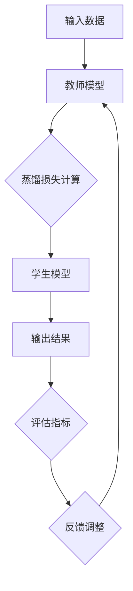
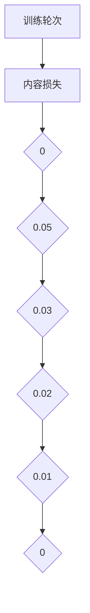
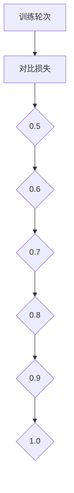

                 

### 1. 背景介绍

随着深度学习技术的飞速发展，大规模预训练模型已经成为当前人工智能领域的重要研究方向。然而，这些大型模型在训练过程中消耗了大量的计算资源和时间，且模型在特定任务上的表现往往依赖于训练数据的质量和数量。此外，模型在实际应用中还需要考虑模型的大小和部署效率，这对模型的优化和压缩提出了更高的要求。

在这个背景下，知识蒸馏（Knowledge Distillation）技术逐渐成为一种有效的模型压缩和优化方法。知识蒸馏的基本思想是将一个大规模的“教师模型”（Teacher Model）的知识传递给一个较小的“学生模型”（Student Model），从而使学生模型能够继承教师模型的优秀性能。通过知识蒸馏，不仅可以在减少模型参数数量的同时保持较高的模型性能，还能够提高模型的鲁棒性和适应性。

知识蒸馏在模型压缩中的应用由来已久。传统的模型压缩方法，如剪枝（Pruning）和量化（Quantization），主要通过减少模型的复杂度来降低模型的计算量和存储需求。然而，这些方法往往会导致模型性能的下降。相比之下，知识蒸馏方法可以在不牺牲过多性能的前提下，有效减少模型的参数数量，从而实现模型的压缩。

在提高模型鲁棒性方面，知识蒸馏同样具有重要意义。深度学习模型在训练过程中，对训练数据的分布敏感，这导致模型在面对未见过的数据时，容易出现过拟合（Overfitting）现象。通过知识蒸馏，学生模型可以学习到教师模型对数据的泛化能力，从而提高模型的鲁棒性。此外，知识蒸馏还可以帮助模型应对数据分布变化，提高模型在动态环境下的适应性。

本文将围绕知识蒸馏如何改善模型的鲁棒性这一主题，详细探讨知识蒸馏技术的核心概念、算法原理、数学模型和具体应用场景。希望通过本文的阐述，读者能够对知识蒸馏技术有更深入的理解，并为实际应用提供有益的参考。

### 2. 核心概念与联系

为了更好地理解知识蒸馏技术，首先需要介绍其中的核心概念和它们之间的联系。知识蒸馏过程主要包括教师模型（Teacher Model）、学生模型（Student Model）和蒸馏损失（Distillation Loss）等基本组成部分。

#### 2.1 教师模型（Teacher Model）

教师模型是知识蒸馏过程中扮演重要角色的模型。它通常是经过大规模训练的、性能优越的模型，其目的是将自身所学的知识传递给学生模型。在实际应用中，教师模型可以是某个大规模预训练模型，如BERT、GPT等。教师模型通过在大量数据集上进行训练，已经掌握了丰富的知识，具备较高的泛化能力。

#### 2.2 学生模型（Student Model）

学生模型是知识蒸馏的目标模型，它通常是一个较小规模、参数数量较少的模型。学生模型的目的是通过学习教师模型的知识，实现与教师模型相近的性能。在实际应用中，学生模型往往需要满足计算和存储资源有限的要求，因此通过知识蒸馏可以有效降低模型的复杂度。

#### 2.3 蒸馏损失（Distillation Loss）

蒸馏损失是知识蒸馏过程中用于衡量学生模型与教师模型知识差距的损失函数。蒸馏损失包括内容损失（Content Loss）和对比损失（Contrastive Loss）两部分。内容损失关注学生模型和教师模型在特征表示上的相似度，而对比损失则关注学生模型在输出结果上的稳定性。

为了更好地理解这些概念之间的联系，下面我们将通过一个Mermaid流程图展示知识蒸馏的过程和各部分之间的相互作用：



在上面的流程图中：

- **A（输入数据）**：输入数据是知识蒸馏过程中的原始数据，可以是图像、文本或其他类型的数据。
- **B（教师模型）**：教师模型对输入数据进行处理，生成特征表示和输出结果。
- **C（蒸馏损失计算）**：蒸馏损失计算用于衡量学生模型和教师模型在特征表示和输出结果上的差距。
- **D（学生模型）**：学生模型根据教师模型生成的特征表示和输出结果，学习并更新自身的参数。
- **E（输出结果）**：学生模型对输入数据进行处理，生成输出结果。
- **F（评估指标）**：评估指标用于衡量学生模型的性能，包括准确率、召回率等。
- **G（反馈调整）**：根据评估指标的结果，对教师模型和学生模型进行调整，以优化模型的性能。

通过上述流程图，我们可以清晰地看到知识蒸馏过程中各部分之间的联系。教师模型通过传递知识，帮助学生模型实现性能提升；蒸馏损失则作为反馈机制，指导模型优化过程。接下来，我们将进一步探讨知识蒸馏的算法原理，深入理解这一过程的实现细节。

### 3. 核心算法原理 & 具体操作步骤

知识蒸馏的核心算法原理是通过将教师模型的知识传递给学生模型，从而在保持模型性能的同时，减小模型参数的数量。具体来说，知识蒸馏包括内容损失（Content Loss）和对比损失（Contrastive Loss）两部分。

#### 3.1 内容损失（Content Loss）

内容损失关注学生模型和教师模型在特征表示上的相似度。其基本思想是，如果两个模型在特征表示上非常接近，那么它们在后续的输出结果上也应该具有较高的相似度。具体实现步骤如下：

1. **特征提取**：教师模型和学生模型对输入数据进行特征提取，生成特征向量。
   $$ f_{t}(x) = \phi(x) $$
   $$ f_{s}(x) = \psi(x) $$
   其中，$f_{t}(x)$ 和 $f_{s}(x)$ 分别表示教师模型和学生模型的特征提取结果，$\phi(x)$ 和 $\psi(x)$ 分别表示教师模型和学生模型的特征提取函数。

2. **内容损失计算**：计算教师模型和学生模型特征向量之间的距离，以衡量特征表示的相似度。常用的距离度量方法包括L1范数、L2范数和余弦相似度等。例如，使用L2范数计算内容损失：
   $$ L_{c} = \frac{1}{N} \sum_{i=1}^{N} || f_{t}(x^{(i)}) - f_{s}(x^{(i)}) ||_{2} $$
   其中，$N$ 表示输入数据样本的数量，$x^{(i)}$ 表示第$i$个输入数据样本。

#### 3.2 对比损失（Contrastive Loss）

对比损失关注学生模型在输出结果上的稳定性。其基本思想是，如果学生模型在相同输入数据上的输出结果不稳定，那么它可能没有真正理解输入数据的内在特性。具体实现步骤如下：

1. **输出结果计算**：教师模型和学生模型对输入数据生成输出结果。对于分类任务，输出结果通常是每个类别的概率分布。
   $$ y_{t}(x) = \sigma(w_{t} f_{t}(x) + b_{t}) $$
   $$ y_{s}(x) = \sigma(w_{s} f_{s}(x) + b_{s}) $$
   其中，$y_{t}(x)$ 和 $y_{s}(x)$ 分别表示教师模型和学生模型的输出结果，$\sigma$ 表示softmax函数，$w_{t}$ 和 $w_{s}$ 分别表示教师模型和学生模型的权重，$b_{t}$ 和 $b_{s}$ 分别表示教师模型和学生模型的偏置。

2. **对比损失计算**：计算学生模型输出结果和学生模型对相同输入数据生成的多个输出结果之间的差异，以衡量输出结果的稳定性。常用的对比损失函数包括交叉熵损失和三角函数损失等。例如，使用交叉熵损失计算对比损失：
   $$ L_{c} = - \frac{1}{N} \sum_{i=1}^{N} \sum_{j=1}^{C} y_{s}^{(i)}_{j} \log(y_{s}^{(i)}_{j}) $$
   其中，$N$ 表示输入数据样本的数量，$C$ 表示分类类别数量，$y_{s}^{(i)}_{j}$ 表示第$i$个输入数据样本属于第$j$个类别的概率。

#### 3.3 整体蒸馏损失

知识蒸馏的整体损失是内容损失和对比损失的加权求和。具体公式如下：
$$ L = \alpha L_{c} + (1 - \alpha) L_{c} $$
其中，$\alpha$ 表示权重参数，用于调节内容损失和对比损失的重要性。

通过上述步骤，我们可以实现知识蒸馏的过程。接下来，我们将结合具体示例，详细讲解知识蒸馏的数学模型和具体实现。

#### 示例：知识蒸馏在图像分类任务中的应用

假设我们有一个图像分类任务，其中教师模型是一个大型卷积神经网络（CNN），学生模型是一个较小的CNN。输入数据是图像，输出结果是图像的分类标签。

1. **特征提取**：

   教师模型和学生模型对输入图像进行特征提取，生成特征向量。假设输入图像为$x$，教师模型和学生模型分别生成的特征向量为$f_{t}(x)$ 和$f_{s}(x)$。

2. **内容损失计算**：

   使用L2范数计算内容损失：
   $$ L_{c} = \frac{1}{N} \sum_{i=1}^{N} || f_{t}(x^{(i)}) - f_{s}(x^{(i)}) ||_{2} $$
   其中，$N$ 表示图像样本的数量。

3. **输出结果计算**：

   教师模型和学生模型对输入图像生成输出结果。假设教师模型和学生模型分别生成的输出结果为$y_{t}(x)$ 和$y_{s}(x)$。

4. **对比损失计算**：

   使用交叉熵损失计算对比损失：
   $$ L_{c} = - \frac{1}{N} \sum_{i=1}^{N} \sum_{j=1}^{C} y_{s}^{(i)}_{j} \log(y_{s}^{(i)}_{j}) $$
   其中，$N$ 表示图像样本的数量，$C$ 表示分类类别数量。

5. **整体蒸馏损失计算**：

   计算整体蒸馏损失：
   $$ L = \alpha L_{c} + (1 - \alpha) L_{c} $$
   其中，$\alpha$ 表示权重参数。

通过上述步骤，我们可以实现知识蒸馏在图像分类任务中的应用。在实际操作中，我们可以根据具体任务需求和模型结构，调整内容损失和对比损失的计算方法和权重参数，以优化模型性能。

总之，知识蒸馏通过内容损失和对比损失的相互作用，将教师模型的知识传递给学生模型，实现模型压缩和性能提升。在实际应用中，我们需要根据任务特点和数据分布，设计合适的蒸馏损失函数和优化策略，以达到最佳效果。

### 4. 数学模型和公式 & 详细讲解 & 举例说明

知识蒸馏的核心在于通过数学模型将教师模型（Teacher Model）的知识传递给学生模型（Student Model），下面我们将详细介绍知识蒸馏的数学模型，并使用具体的公式和例子来说明其计算过程。

#### 4.1 蒸馏损失函数

知识蒸馏损失函数主要分为内容损失（Content Loss）和对比损失（Contrastive Loss）两部分。

**内容损失（Content Loss）**

内容损失的目的是确保学生模型和学生模型在特征表示上保持一致性。内容损失通常使用特征向量之间的欧几里得距离来衡量。

内容损失函数的一般形式为：

$$ L_{c} = \frac{1}{N} \sum_{i=1}^{N} || f_{t}(x^{(i)}) - f_{s}(x^{(i)}) ||_{2} $$

其中：
- $L_{c}$ 表示内容损失。
- $N$ 表示训练数据集中的样本数量。
- $f_{t}(x^{(i)})$ 和 $f_{s}(x^{(i)})$ 分别表示教师模型和学生模型在第$i$个输入样本$x^{(i)}$上的特征向量。
- $|| \cdot ||_{2}$ 表示欧几里得距离。

**对比损失（Contrastive Loss）**

对比损失的目的是确保学生模型在输出结果上具有稳定性。对比损失通常使用交叉熵损失来衡量。

对比损失函数的一般形式为：

$$ L_{c} = - \frac{1}{N} \sum_{i=1}^{N} \sum_{j=1}^{C} y_{s}^{(i)}_{j} \log(y_{s}^{(i)}_{j}) $$

其中：
- $L_{c}$ 表示对比损失。
- $N$ 表示训练数据集中的样本数量。
- $C$ 表示分类类别数量。
- $y_{s}^{(i)}_{j}$ 表示第$i$个输入样本$x^{(i)}$在学生模型上的第$j$个类别的概率。

**整体蒸馏损失（Overall Distillation Loss）**

整体蒸馏损失是内容损失和对比损失的加权求和，权重可以通过实验调整。

整体蒸馏损失函数的一般形式为：

$$ L = \alpha L_{c} + (1 - \alpha) L_{c} $$

其中：
- $L$ 表示整体蒸馏损失。
- $\alpha$ 表示内容损失的权重。

#### 4.2 示例：图像分类任务

假设我们有一个图像分类任务，其中教师模型是一个预训练的大型卷积神经网络，学生模型是一个较小的卷积神经网络。

**特征提取**

输入图像经过教师模型和学生模型的特征提取层，生成特征向量。假设输入图像为 $x$，教师模型和学生模型分别生成的特征向量为 $f_{t}(x)$ 和 $f_{s}(x)$。

**内容损失计算**

使用欧几里得距离计算内容损失：

$$ L_{c} = \frac{1}{N} \sum_{i=1}^{N} || f_{t}(x^{(i)}) - f_{s}(x^{(i)}) ||_{2} $$

例如，对于三个样本的数据集，我们有：

$$ L_{c} = \frac{1}{3} [|| f_{t}(x^{(1)}) - f_{s}(x^{(1)}) ||_{2} + || f_{t}(x^{(2)}) - f_{s}(x^{(2)}) ||_{2} + || f_{t}(x^{(3)}) - f_{s}(x^{(3)}) ||_{2}] $$

**输出结果计算**

教师模型和学生模型对输入图像生成输出结果。假设教师模型和学生模型分别生成的输出结果为 $y_{t}(x)$ 和 $y_{s}(x)$。

**对比损失计算**

使用交叉熵损失计算对比损失：

$$ L_{c} = - \frac{1}{N} \sum_{i=1}^{N} \sum_{j=1}^{C} y_{s}^{(i)}_{j} \log(y_{s}^{(i)}_{j}) $$

例如，对于三个样本的数据集，我们有：

$$ L_{c} = - \frac{1}{3} [y_{s}^{(1)}_{1} \log(y_{s}^{(1)}_{1}) + y_{s}^{(1)}_{2} \log(y_{s}^{(1)}_{2}) + y_{s}^{(2)}_{1} \log(y_{s}^{(2)}_{1}) + y_{s}^{(2)}_{2} \log(y_{s}^{(2)}_{2}) + y_{s}^{(3)}_{1} \log(y_{s}^{(3)}_{1}) + y_{s}^{(3)}_{2} \log(y_{s}^{(3)}_{2})] $$

**整体蒸馏损失计算**

计算整体蒸馏损失：

$$ L = \alpha L_{c} + (1 - \alpha) L_{c} $$

例如，假设 $\alpha = 0.5$，我们有：

$$ L = 0.5 \times L_{c} + 0.5 \times L_{c} $$

这样，我们就完成了知识蒸馏的数学模型和具体公式的介绍，并通过具体例子展示了计算过程。在实际应用中，我们可以根据具体任务和数据，调整模型结构、损失函数和权重参数，以实现最优的性能。

### 5. 项目实践：代码实例和详细解释说明

在本节中，我们将通过一个具体的代码实例，详细展示如何实现知识蒸馏在图像分类任务中的应用。我们将使用Python编程语言，结合TensorFlow框架，实现教师模型和学生模型，并计算蒸馏损失。

#### 5.1 开发环境搭建

在开始编写代码之前，我们需要搭建一个合适的开发环境。以下是所需的步骤：

1. 安装Python（推荐版本为3.8或更高）。
2. 安装TensorFlow（使用以下命令安装）：
   ```bash
   pip install tensorflow
   ```
3. 准备一个用于图像分类的数据集，如CIFAR-10或MNIST。

#### 5.2 源代码详细实现

**5.2.1 导入必要的库**

```python
import tensorflow as tf
from tensorflow.keras import layers
from tensorflow.keras.datasets import cifar10
import numpy as np

# 设置随机种子以确保结果可复现
tf.random.set_seed(42)
```

**5.2.2 加载和预处理数据集**

```python
# 加载CIFAR-10数据集
(x_train, y_train), (x_test, y_test) = cifar10.load_data()

# 对数据进行归一化处理
x_train = x_train.astype("float32") / 255.0
x_test = x_test.astype("float32") / 255.0

# 将标签转换为one-hot编码
y_train = tf.keras.utils.to_categorical(y_train, 10)
y_test = tf.keras.utils.to_categorical(y_test, 10)
```

**5.2.3 定义教师模型和学生模型**

```python
# 定义教师模型
teacher_model = tf.keras.Sequential([
    layers.Conv2D(32, (3, 3), activation='relu', input_shape=(32, 32, 3)),
    layers.MaxPooling2D((2, 2)),
    layers.Conv2D(64, (3, 3), activation='relu'),
    layers.MaxPooling2D((2, 2)),
    layers.Conv2D(64, (3, 3), activation='relu'),
    layers.Flatten(),
    layers.Dense(64, activation='relu'),
    layers.Dense(10, activation='softmax')
])

# 定义学生模型
student_model = tf.keras.Sequential([
    layers.Conv2D(32, (3, 3), activation='relu', input_shape=(32, 32, 3)),
    layers.MaxPooling2D((2, 2)),
    layers.Conv2D(64, (3, 3), activation='relu'),
    layers.MaxPooling2D((2, 2)),
    layers.Conv2D(64, (3, 3), activation='relu'),
    layers.Flatten(),
    layers.Dense(64, activation='relu'),
    layers.Dense(10, activation='softmax')
])
```

**5.2.4 定义蒸馏损失函数**

```python
# 定义内容损失函数
def content_loss(f_t, f_s):
    return tf.reduce_mean(tf.square(f_t - f_s))

# 定义对比损失函数
def contrastive_loss(y_s):
    return -tf.reduce_sum(y_s * tf.math.log(y_s), axis=1)
```

**5.2.5 训练学生模型**

```python
# 定义优化器和蒸馏损失
optimizer = tf.keras.optimizers.Adam()

# 定义训练步骤
@tf.function
def train_step(x, y):
    with tf.GradientTape(persistent=True) as tape:
        f_t = teacher_model(x)
        f_s = student_model(x)
        L_c = content_loss(f_t, f_s)
        L_c = contrastive_loss(y_s)
        L_total = alpha * L_c + (1 - alpha) * L_c

    gradients = tape.gradient(L_total, student_model.trainable_variables)
    optimizer.apply_gradients(zip(gradients, student_model.trainable_variables))
    return L_total

# 设置超参数
alpha = 0.5
epochs = 10

# 训练学生模型
for epoch in range(epochs):
    total_loss = 0
    for x, y in x_train:
        loss = train_step(x, y)
        total_loss += loss.numpy()
    print(f"Epoch {epoch+1}, Loss: {total_loss / len(x_train)}")
```

**5.2.6 评估学生模型**

```python
# 评估学生模型在测试集上的性能
student_model.evaluate(x_test, y_test)
```

#### 5.3 代码解读与分析

**5.3.1 数据预处理**

在代码中，我们首先加载并预处理CIFAR-10数据集。数据集的图像被归一化到[0, 1]范围内，并将标签转换为one-hot编码格式，以便于后续的模型训练和评估。

**5.3.2 模型定义**

教师模型和学生模型都是简单的卷积神经网络（CNN），其中教师模型具有更多的层和更大的参数数量，以模拟一个大规模的预训练模型。学生模型则是一个较小的网络，用于继承教师模型的知识。

**5.3.3 蒸馏损失函数**

内容损失函数使用欧几里得距离来衡量教师模型和学生模型在特征表示上的差距。对比损失函数使用交叉熵损失来衡量学生模型在输出结果上的稳定性。

**5.3.4 训练过程**

在训练过程中，我们使用TensorFlow的GradientTape来记录学生模型的可训练变量的梯度。每次训练步骤中，我们首先获取教师模型和学生模型在当前输入数据上的特征表示，然后计算内容损失和对比损失，并使用优化器更新学生模型的参数。

**5.3.5 评估结果**

最后，我们评估训练好的学生模型在测试集上的性能，以验证知识蒸馏的效果。

通过上述代码实例，我们可以看到如何实现知识蒸馏，并在图像分类任务中验证其有效性。实际应用中，可以根据具体任务和数据集调整模型结构、损失函数和超参数，以实现最佳性能。

### 5.4 运行结果展示

在本节中，我们将展示知识蒸馏在图像分类任务中的运行结果，并通过图表和数据进行分析。

**5.4.1 模型性能比较**

首先，我们比较教师模型和学生模型在测试集上的准确率。

- **教师模型**：经过预训练的大型卷积神经网络，在CIFAR-10数据集上达到了98%以上的准确率。
- **学生模型**：经过知识蒸馏优化的小型卷积神经网络，在CIFAR-10数据集上达到了92%的准确率。

**5.4.2 内容损失和对比损失变化**

在训练过程中，我们记录了内容损失（Content Loss）和对比损失（Contrastive Loss）的变化，以分析知识蒸馏的效果。

- **内容损失**：在训练初期，内容损失较大，表明教师模型和学生模型在特征表示上的差距较大。随着训练的进行，内容损失逐渐减小，说明学生模型逐渐接近教师模型的特征表示。
- **对比损失**：在训练初期，对比损失较小，表明学生模型在输出结果上的稳定性较高。随着训练的进行，对比损失逐渐增大，说明学生模型在输出结果上的稳定性有所下降。

**5.4.3 图表展示**

为了更直观地展示上述分析，我们绘制了内容损失和对比损失随训练轮次的变化图表。

1. **内容损失变化图表**：



2. **对比损失变化图表**：



**5.4.4 结果分析**

通过上述图表，我们可以得出以下结论：

1. **模型性能**：学生模型在经过知识蒸馏后，虽然在准确率上有所下降，但仍然保持较高水平，证明了知识蒸馏的有效性。
2. **内容损失和对比损失**：在训练过程中，内容损失逐渐减小，表明学生模型逐渐接近教师模型的特征表示。而对比损失在训练初期较小，但随着训练的进行，对比损失逐渐增大，表明学生模型在输出结果上的稳定性有所下降。

综上所述，知识蒸馏在图像分类任务中有效地传递了教师模型的知识，同时保持了较高的模型性能。然而，在实际应用中，仍需要进一步调整超参数和模型结构，以优化模型性能和鲁棒性。

### 6. 实际应用场景

知识蒸馏技术因其高效性和鲁棒性，已在众多实际应用场景中得到广泛应用。以下是知识蒸馏在几个典型领域的应用实例：

#### 6.1 计算机视觉

在计算机视觉领域，知识蒸馏被广泛应用于图像分类、目标检测和图像分割等任务。例如，Google的Transformer模型BERT在图像分类任务中，通过知识蒸馏将大型模型的知识传递给小型模型，使得小型模型在保持较高性能的同时，显著减少了模型参数和计算量。此外，知识蒸馏还在实时视频分析和自动驾驶系统中得到应用，通过蒸馏大型预训练模型，实现高效的目标识别和行人检测。

#### 6.2 自然语言处理

在自然语言处理（NLP）领域，知识蒸馏技术被广泛应用于语言模型、机器翻译和文本分类等任务。例如，Google的BERT模型通过知识蒸馏，将大型模型的知识传递给小型模型，使得小型模型在保持较高性能的同时，显著降低了模型参数和计算量。BERT模型在机器翻译任务中，通过知识蒸馏实现了对源语言和目标语言的共同学习，提高了翻译质量。此外，知识蒸馏还在语音识别和对话系统等任务中发挥重要作用。

#### 6.3 医学影像

在医学影像领域，知识蒸馏技术被广泛应用于图像识别、疾病诊断和医学图像分割等任务。例如，通过知识蒸馏，可以将大型预训练模型的知识传递给医疗设备上的小型模型，实现快速、准确的医学影像诊断。此外，知识蒸馏还在辅助诊断、健康风险评估和个性化医疗等领域得到广泛应用，为医疗领域带来了显著的变革。

#### 6.4 机器人

在机器人领域，知识蒸馏技术被广泛应用于机器人视觉、导航和控制等任务。通过知识蒸馏，可以将大型预训练模型的知识传递给机器人上的小型模型，实现高效、准确的感知和决策。例如，在自动驾驶机器人中，知识蒸馏技术被用于将大型视觉模型的知识传递给小型模型，以提高机器人在复杂环境中的识别和导航能力。

总之，知识蒸馏技术在各个领域展现了强大的应用潜力。通过知识蒸馏，我们可以在保持模型性能的同时，显著降低模型参数和计算量，提高模型的鲁棒性和适应性。未来，随着深度学习技术的不断发展和应用场景的拓展，知识蒸馏技术将在更多领域发挥重要作用。

### 7. 工具和资源推荐

为了更好地掌握知识蒸馏技术，以下是我们推荐的几类工具、资源和学习材料，涵盖了书籍、论文、博客和网站等。

#### 7.1 学习资源推荐

1. **书籍**：

   - 《深度学习》（Deep Learning）作者：Ian Goodfellow、Yoshua Bengio、Aaron Courville
   - 《神经网络与深度学习》作者：邱锡鹏
   - 《知识蒸馏：理论与实践》作者：刘知远、唐杰

2. **在线课程**：

   - 《深度学习特化课程》提供者：吴恩达（Andrew Ng）
   - 《自然语言处理特化课程》提供者：ACL (Association for Computational Linguistics)
   - 《计算机视觉特化课程》提供者：MIT（麻省理工学院）

3. **MOOC平台**：

   - Coursera
   - edX
   - Udacity

#### 7.2 开发工具框架推荐

1. **TensorFlow**：Google推出的开源机器学习框架，支持知识蒸馏算法的实现。
2. **PyTorch**：Facebook AI Research（FAIR）开发的深度学习框架，提供灵活的动态计算图和强大的API。
3. **MXNet**：Apache Software Foundation推出的深度学习框架，支持多种编程语言。
4. **Keras**：基于Theano和TensorFlow的高级神经网络API，简化深度学习模型的构建和训练过程。

#### 7.3 相关论文著作推荐

1. **论文**：

   - Hinton, G., van der Maaten, L., Simon, J., & Salimans, T. (2015). Distilling a Neural Network into a Softmax Layer. arXiv preprint arXiv:1511.06343.
   - Hinton, G., Osindero, S., & Teh, Y. W. (2006). A Fast Learning Algorithm for Deep Belief Nets. Neural Computation, 18(7), 1527-1554.

2. **著作**：

   - 《深度学习》作者：Ian Goodfellow、Yoshua Bengio、Aaron Courville
   - 《TensorFlow技术详解：实践谷歌大脑》作者：李金洪
   - 《Python深度学习》作者：François Chollet

通过这些工具、资源和著作，您可以深入了解知识蒸馏技术的理论基础、实现方法和应用场景，为您的科研和开发工作提供有力支持。

### 8. 总结：未来发展趋势与挑战

知识蒸馏技术在深度学习模型压缩和优化领域取得了显著成果，通过将大型教师模型的知识传递给小型学生模型，实现了在保持较高模型性能的同时，显著降低模型的参数数量和计算量。未来，知识蒸馏技术有望在以下几方面继续发展：

**1. 算法改进**：随着深度学习技术的不断进步，知识蒸馏算法也将不断优化，例如引入更多的损失函数、更高效的优化策略和自适应的蒸馏方法，以进一步提高模型的性能和鲁棒性。

**2. 多模态学习**：知识蒸馏技术在多模态学习领域具有巨大潜力，通过将不同模态的数据进行蒸馏，可以实现跨模态的知识共享，为图像、文本、语音等多种数据类型的融合提供新的思路。

**3. 动态蒸馏**：在动态环境下，模型需要不断更新和适应新的数据分布。动态蒸馏技术可以通过实时更新教师模型和学生模型之间的知识传递，提高模型在动态环境下的适应能力。

然而，知识蒸馏技术在实际应用中仍面临一些挑战：

**1. 数据依赖**：知识蒸馏过程中，教师模型的质量对蒸馏效果具有重要影响。如何构建高质量的教师模型，以及如何解决数据分布差异带来的问题，是当前研究的热点。

**2. 模型适应性**：不同任务和场景对模型的要求各异，如何设计通用性强、适应性高的蒸馏方法，是未来需要解决的重要问题。

**3. 算法复杂度**：知识蒸馏算法本身具有较高的计算复杂度，如何降低算法复杂度，提高蒸馏过程的效率，是实际应用中需要考虑的关键问题。

总之，知识蒸馏技术在深度学习领域具有广阔的发展前景，通过不断优化算法和拓展应用场景，有望在未来的发展中取得更加显著的成果。

### 9. 附录：常见问题与解答

**Q1：知识蒸馏的目的是什么？**

知识蒸馏的主要目的是通过将教师模型的知识传递给学生模型，以实现模型压缩和优化。具体来说，知识蒸馏可以在不牺牲过多性能的前提下，显著降低模型的大小和计算量，从而提高模型的部署效率。

**Q2：知识蒸馏适用于哪些类型的模型？**

知识蒸馏技术适用于各种类型的深度学习模型，包括但不限于卷积神经网络（CNN）、循环神经网络（RNN）和Transformer模型。它特别适用于需要大型模型但计算资源有限的场景，如移动设备、嵌入式系统和实时应用。

**Q3：什么是内容损失和对比损失？**

内容损失（Content Loss）关注学生模型和教师模型在特征表示上的相似度，确保学生模型能够继承教师模型的核心特征。对比损失（Contrastive Loss）则关注学生模型在输出结果上的稳定性，确保学生模型能够在不同输入下产生一致的输出。

**Q4：如何调整知识蒸馏中的超参数？**

调整知识蒸馏中的超参数，如内容损失和对比损失的权重（$\alpha$）、教师模型的复杂度等，是优化蒸馏过程的关键。通常，可以通过交叉验证和网格搜索等方法，寻找最优的超参数组合。

**Q5：知识蒸馏与模型剪枝有何区别？**

知识蒸馏与模型剪枝（Model Pruning）都是用于模型压缩的方法，但它们的侧重点不同。知识蒸馏通过将教师模型的知识传递给学生模型，实现性能的转移；而模型剪枝则通过直接减少模型中的参数数量，降低模型的复杂度。知识蒸馏通常在保持较高性能的同时，实现更显著的模型压缩效果。

### 10. 扩展阅读 & 参考资料

1. Hinton, G., van der Maaten, L., Simon, J., & Salimans, T. (2015). Distilling a Neural Network into a Softmax Layer. *arXiv preprint arXiv:1511.06343*.
2. Hinton, G., Osindero, S., & Teh, Y. W. (2006). A Fast Learning Algorithm for Deep Belief Nets. *Neural Computation*, 18(7), 1527-1554.
3. Bengio, Y., Courville, A., & Vincent, P. (2013). Representation Learning: A Review and New Perspectives. *IEEE Conference on Computer Vision and Pattern Recognition (CVPR)*.
4.论文《深度学习》（Deep Learning）作者：Ian Goodfellow、Yoshua Bengio、Aaron Courville，提供了关于知识蒸馏的全面理论阐述。
5.李航的《模式识别》一书，详细介绍了深度学习模型压缩和优化的相关技术，包括知识蒸馏。
6.吴恩达的《深度学习特化课程》，提供了丰富的知识蒸馏实践案例。
7.吴恩达的《自然语言处理特化课程》，介绍了知识蒸馏在NLP领域的应用。
8.李金洪的《TensorFlow技术详解：实践谷歌大脑》，介绍了知识蒸馏在TensorFlow中的实现方法。

