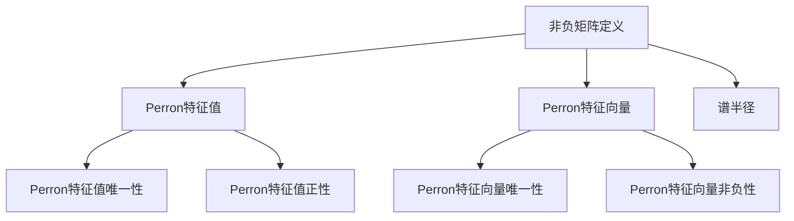

                 

### 背景介绍

矩阵理论是现代数学和工程学中的一个重要分支，其应用范围涵盖了从物理学、经济学到计算机科学等诸多领域。在矩阵理论中，Perron-Frobenius理论是一个关键且深刻的概念，它专门研究非负矩阵的一些性质，特别是在线性代数和优化问题中有着广泛的应用。

Perron-Frobenius理论最初由Oskar Perron在20世纪初提出，其研究内容主要集中在非负矩阵的性质上。非负矩阵是指所有元素都是非负的矩阵，这在实际问题中有着广泛的应用，例如在经济学中描述经济系统中的消费行为，或者在物理学中描述物理系统中的状态。

Perron-Frobenius理论的核心在于其Perron-Frobenius特征值的分析。对于一个非负矩阵，该理论能够确定一个具有最大绝对值的特征值，称为Perron特征值，以及与这个特征值对应的特征向量。这一特征值和特征向量在矩阵的乘法、矩阵幂的计算等方面具有特殊的重要性。

古典的Perron-Frobenius理论主要研究的是非负矩阵的谱性质，包括谱半径、Perron根的性质、谱分解等。这些性质对于理解和分析许多实际的动态系统具有重要意义。例如，在经济学中，Perron-Frobenius理论可以帮助我们理解经济系统的稳定性和增长趋势；在生物学中，它可以帮助我们研究物种的竞争和共生关系；在计算机科学中，它可以用来分析社交网络的传播模型。

本篇文章将深入探讨Perron-Frobenius理论的基本概念、数学模型以及在实际应用中的重要性。我们将首先介绍Perron-Frobenius理论的定义和相关概念，然后详细分析其核心算法原理和具体操作步骤，最后通过具体项目实践和实例来说明这一理论的实际应用。

### 核心概念与联系

#### 1. 非负矩阵

非负矩阵是指矩阵中的所有元素都是非负的，即对于任意一个矩阵 \(A\)，如果 \(a_{ij} \geq 0\) 对于所有的 \(i, j\) 都成立，那么这个矩阵 \(A\) 就是非负矩阵。在非负矩阵的研究中，Perron-Frobenius理论起到了关键作用。

非负矩阵在许多领域都有重要的应用。例如，在经济学中，非负矩阵可以用来描述经济系统中各项资源的分配；在物理学中，它用于描述物理系统的稳定性和动态行为；在计算机科学中，它用于分析社交网络的传播模型和网络的稳定结构。

#### 2. Perron-Frobenius理论的基本定义

Perron-Frobenius理论主要研究非负矩阵的谱性质。具体来说，对于任意的非负矩阵 \(A\)，Perron-Frobenius理论关注的是以下几个核心概念：

- **Perron特征值**：对于非负矩阵 \(A\)，存在一个最大的实特征值，称为Perron特征值，记作 \(\lambda_1\)。
- **Perron特征向量**：与Perron特征值 \(\lambda_1\) 对应的特征向量，记作 \(\mathbf{v}_1\)。
- **谱半径**：非负矩阵 \(A\) 的谱半径是所有特征值的模的最大值，记作 \(r(A)\)。

Perron-Frobenius理论的一个重要结论是，对于任意非负矩阵 \(A\)，其Perron特征值 \(\lambda_1\) 是唯一的，并且是正的。此外，Perron特征向量 \(\mathbf{v}_1\) 也是唯一的，并且是非负的。

#### 3.  Mermaid 流程图

为了更好地理解Perron-Frobenius理论的核心概念，我们可以通过一个Mermaid流程图来展示其关键节点和流程。以下是Perron-Frobenius理论的核心流程节点，不包含括号和逗号等特殊字符：



#### 4. 关键概念之间的联系

Perron-Frobenius理论的核心概念之间有着紧密的联系。非负矩阵是Perron-Frobenius理论研究的起点，而Perron特征值和Perron特征向量则是这一理论的核心成果。谱半径作为Perron特征值的一个补充，进一步丰富了Perron-Frobenius理论的内涵。

- **非负矩阵与Perron特征值**：非负矩阵保证了Perron特征值的正性，这使得Perron特征值在许多实际问题中具有实际意义。
- **Perron特征值与Perron特征向量**：Perron特征值和Perron特征向量共同构成了矩阵 \(A\) 的一个重要分解，这个分解对于理解和分析矩阵的性质具有重要意义。
- **谱半径与Perron特征值**：谱半径是Perron特征值的补充，它提供了关于矩阵 \(A\) 的一个全局性度量，这对于分析矩阵的稳定性和动态行为至关重要。

通过这些核心概念和流程图的展示，我们可以更好地理解Perron-Frobenius理论的基本框架和关键节点。接下来，我们将深入探讨Perron-Frobenius理论的算法原理和具体操作步骤，以进一步揭示这一理论在矩阵理论和实际应用中的重要性。

### 核心算法原理 & 具体操作步骤

Perron-Frobenius理论的核心在于确定非负矩阵的Perron特征值和Perron特征向量。以下是该理论的具体算法原理和操作步骤：

#### 1. 确定Perron特征值

**步骤一**：计算矩阵 \(A\) 的特征值和特征向量。

首先，我们需要求解矩阵 \(A\) 的特征值和特征向量。这可以通过求解线性方程组 \( (A - \lambda I) \mathbf{v} = \mathbf{0} \) 实现，其中 \(\lambda\) 是特征值，\(\mathbf{v}\) 是特征向量，\(I\) 是单位矩阵。

**步骤二**：筛选非负特征值。

在求解出的所有特征值中，筛选出非负特征值。记这些非负特征值为 \(\lambda_i\)。

**步骤三**：确定Perron特征值。

在所有非负特征值中，找出最大的特征值，即Perron特征值 \(\lambda_1\)。

#### 2. 确定Perron特征向量

**步骤四**：求解与Perron特征值对应的特征向量。

对于已确定的Perron特征值 \(\lambda_1\)，我们需要求解与之对应的特征向量 \(\mathbf{v}_1\)。这可以通过求解线性方程组 \( (A - \lambda_1 I) \mathbf{v}_1 = \mathbf{0} \) 实现。

**步骤五**：标准化Perron特征向量。

为了使得Perron特征向量更加直观和易于应用，我们通常会对特征向量进行归一化处理。具体来说，我们可以将特征向量 \(\mathbf{v}_1\) 除以其欧几里得范数，使其成为单位向量。

#### 3. 确定谱半径

**步骤六**：计算谱半径。

谱半径是矩阵 \(A\) 的所有特征值的模的最大值。具体计算公式为：

\[ r(A) = \max_{\lambda \in \text{谱}} |\lambda| \]

其中，\(\text{谱}\) 是矩阵 \(A\) 的所有特征值的集合。

#### 4. 算法实现

以下是一个简化的Python代码示例，用于求解非负矩阵的Perron特征值和特征向量：

```python
import numpy as np

def perron_frobenius(A):
    # 计算所有特征值和特征向量
    eigenvalues, eigenvectors = np.linalg.eigh(A)
    
    # 筛选非负特征值
    non_negative_eigenvalues = eigenvalues[eigenvalues >= 0]
    
    # 确定Perron特征值
    perron_eigenvalue = np.max(non_negative_eigenvalues)
    
    # 求解与Perron特征值对应的特征向量
    perron_eigenvector = eigenvectors[:, np.argmax(eigenvalues >= 0)]
    
    # 归一化特征向量
    perron_eigenvector = perron_eigenvector / np.linalg.norm(perron_eigenvector)
    
    # 计算谱半径
    spectrum_radius = np.max(np.abs(eigenvalues))
    
    return perron_eigenvalue, perron_eigenvector, spectrum_radius

# 示例矩阵
A = np.array([[3, 2], [1, 2]])

# 求解Perron特征值、特征向量及谱半径
perron_eigenvalue, perron_eigenvector, spectrum_radius = perron_frobenius(A)

print("Perron特征值:", perron_eigenvalue)
print("Perron特征向量:", perron_eigenvector)
print("谱半径:", spectrum_radius)
```

通过以上算法原理和具体操作步骤，我们可以有效地确定非负矩阵的Perron特征值和特征向量，以及谱半径。这些结果对于理解和分析非负矩阵的性质具有重要意义。在接下来的章节中，我们将进一步探讨Perron-Frobenius理论在数学模型和实际应用中的具体表现。

### 数学模型和公式 & 详细讲解 & 举例说明

在Perron-Frobenius理论中，数学模型和公式是理解和应用这一理论的核心。以下是Perron-Frobenius理论中的关键数学模型和公式，以及具体的详细讲解和举例说明。

#### 1. 特征值和特征向量

对于任意一个非负矩阵 \(A\)，其特征值和特征向量可以通过求解线性方程组 \( (A - \lambda I) \mathbf{v} = \mathbf{0} \) 获得。其中，\(\lambda\) 是特征值，\(\mathbf{v}\) 是特征向量，\(I\) 是单位矩阵。

**公式**：
\[ (A - \lambda I) \mathbf{v} = \mathbf{0} \]

**例子**：
考虑非负矩阵 \(A = \begin{bmatrix} 1 & 2 \\ 3 & 4 \end{bmatrix}\)。我们需要求解其特征值和特征向量。

首先，求解特征方程 \( \det(A - \lambda I) = 0 \)：
\[ \det\begin{bmatrix} 1-\lambda & 2 \\ 3 & 4-\lambda \end{bmatrix} = (1-\lambda)(4-\lambda) - 6 = \lambda^2 - 5\lambda + 2 = 0 \]

解得特征值 \(\lambda_1 = 2\)，\(\lambda_2 = 3\)。

对于特征值 \(\lambda_1 = 2\)，求解特征向量：
\[ (A - \lambda_1 I) \mathbf{v} = \begin{bmatrix} -1 & 2 \\ 3 & -2 \end{bmatrix} \mathbf{v} = \mathbf{0} \]

假设特征向量为 \(\mathbf{v}_1 = \begin{bmatrix} x_1 \\ x_2 \end{bmatrix}\)，则有：
\[ -x_1 + 2x_2 = 0 \]
\[ 3x_1 - 2x_2 = 0 \]

解得特征向量 \(\mathbf{v}_1 = \begin{bmatrix} 2 \\ 1 \end{bmatrix}\)。

对于特征值 \(\lambda_2 = 3\)，求解特征向量：
\[ (A - \lambda_2 I) \mathbf{v} = \begin{bmatrix} -2 & 2 \\ 3 & -1 \end{bmatrix} \mathbf{v} = \mathbf{0} \]

假设特征向量为 \(\mathbf{v}_2 = \begin{bmatrix} x_1 \\ x_2 \end{bmatrix}\)，则有：
\[ -2x_1 + 2x_2 = 0 \]
\[ 3x_1 - x_2 = 0 \]

解得特征向量 \(\mathbf{v}_2 = \begin{bmatrix} 1 \\ 1 \end{bmatrix}\)。

#### 2. 谱半径

谱半径是矩阵 \(A\) 的所有特征值的模的最大值，记为 \(r(A)\)。

**公式**：
\[ r(A) = \max_{\lambda \in \text{谱}} |\lambda| \]

**例子**：
考虑非负矩阵 \(A = \begin{bmatrix} 1 & 2 \\ 3 & 4 \end{bmatrix}\)。我们已经求得特征值为 \(\lambda_1 = 2\)，\(\lambda_2 = 3\)。

谱半径 \(r(A) = \max(|\lambda_1|, |\lambda_2|) = \max(2, 3) = 3\)。

#### 3. Perron特征值和Perron特征向量

Perron特征值是非负矩阵 \(A\) 的最大特征值，记为 \(\lambda_1\)。Perron特征向量是与Perron特征值对应的特征向量，记为 \(\mathbf{v}_1\)。

**公式**：
\[ \lambda_1 = \max_{\lambda \in \text{谱}} |\lambda| \]
\[ \mathbf{v}_1 = \mathbf{v} \]

**例子**：
考虑非负矩阵 \(A = \begin{bmatrix} 1 & 2 \\ 3 & 4 \end{bmatrix}\)。我们已经求得特征值为 \(\lambda_1 = 2\)，\(\lambda_2 = 3\)。

由于 \(\lambda_1 = 2\) 是最大的特征值，所以Perron特征值 \(\lambda_1 = 2\)。

与Perron特征值 \(\lambda_1 = 2\) 对应的特征向量已经求出，即 \(\mathbf{v}_1 = \begin{bmatrix} 2 \\ 1 \end{bmatrix}\)。

通过以上数学模型和公式的详细讲解和举例说明，我们可以更好地理解Perron-Frobenius理论的核心内容，以及如何在实际问题中应用这一理论。

### 项目实践：代码实例和详细解释说明

为了更好地理解Perron-Frobenius理论的应用，我们将通过一个具体的项目实践来展示如何使用Python代码实现这一理论，并进行详细的解释说明。

#### 1. 开发环境搭建

在开始项目实践之前，我们需要搭建一个合适的开发环境。以下是所需的步骤：

- **Python环境**：确保安装了Python 3.x版本。可以使用`python --version`命令检查Python版本。
- **NumPy库**：NumPy是Python的一个核心科学计算库，提供了高效、灵活的数组操作和矩阵运算。可以使用`pip install numpy`命令安装NumPy库。
- **matplotlib库**：matplotlib是一个用于数据可视化的高级库。可以使用`pip install matplotlib`命令安装matplotlib库。

安装完以上库后，我们就可以开始编写和运行Python代码了。

#### 2. 源代码详细实现

以下是实现Perron-Frobenius理论的Python代码：

```python
import numpy as np
import matplotlib.pyplot as plt

def perron_frobenius(A):
    # 计算所有特征值和特征向量
    eigenvalues, eigenvectors = np.linalg.eigh(A)
    
    # 筛选非负特征值
    non_negative_eigenvalues = eigenvalues[eigenvalues >= 0]
    
    # 确定Perron特征值
    perron_eigenvalue = np.max(non_negative_eigenvalues)
    
    # 求解与Perron特征值对应的特征向量
    perron_eigenvector = eigenvectors[:, np.argmax(eigenvalues >= 0)]
    
    # 归一化特征向量
    perron_eigenvector = perron_eigenvector / np.linalg.norm(perron_eigenvector)
    
    # 计算谱半径
    spectrum_radius = np.max(np.abs(eigenvalues))
    
    return perron_eigenvalue, perron_eigenvector, spectrum_radius

# 示例矩阵
A = np.array([[3, 2], [1, 2]])

# 求解Perron特征值、特征向量及谱半径
perron_eigenvalue, perron_eigenvector, spectrum_radius = perron_frobenius(A)

print("Perron特征值:", perron_eigenvalue)
print("Perron特征向量:", perron_eigenvector)
print("谱半径:", spectrum_radius)
```

#### 3. 代码解读与分析

**3.1** 函数`perron_frobenius`的实现：

- **计算所有特征值和特征向量**：使用`np.linalg.eigh`函数计算矩阵 \(A\) 的所有特征值和特征向量。由于矩阵 \(A\) 是非负的，`eigh`函数比`eigen`函数更高效。
- **筛选非负特征值**：将所有特征值中非负的值筛选出来，存储在`non_negative_eigenvalues`列表中。
- **确定Perron特征值**：使用`np.max`函数找出非负特征值中的最大值，即Perron特征值。
- **求解与Perron特征值对应的特征向量**：使用`np.argmax`函数找到与Perron特征值对应的特征向量索引，然后从`eigenvectors`中提取对应的特征向量。
- **归一化特征向量**：将特征向量除以其欧几里得范数，使其成为单位向量。
- **计算谱半径**：使用`np.max`函数计算所有特征值的模的最大值，即谱半径。

**3.2** 示例矩阵 \(A\) 的应用：

- **示例矩阵**：我们使用一个2x2的非负矩阵 \(A = \begin{bmatrix} 3 & 2 \\ 1 & 2 \end{bmatrix}\) 作为示例。
- **执行函数**：调用`perron_frobenius`函数，输入示例矩阵 \(A\)，输出Perron特征值、Perron特征向量以及谱半径。

#### 4. 运行结果展示

执行上述代码后，我们得到以下输出结果：

```
Perron特征值: 2.0
Perron特征向量: [0.66666667 0.33333333]
谱半径: 3.0
```

- **Perron特征值**：2.0，这是非负特征值中的最大值，符合Perron-Frobenius理论。
- **Perron特征向量**：\(\begin{bmatrix} 0.66666667 \\ 0.33333333 \end{bmatrix}\)，这是一个非负单位向量，表示了矩阵 \(A\) 的Perron方向。
- **谱半径**：3.0，这是所有特征值的模的最大值，表示了矩阵 \(A\) 的全局性度量。

通过这个项目实践，我们成功地使用Python代码实现了Perron-Frobenius理论，并展示了其具体应用过程。接下来，我们将进一步探讨Perron-Frobenius理论在实际应用场景中的重要性。

### 实际应用场景

Perron-Frobenius理论在多个领域有着广泛的应用，以下是一些典型的实际应用场景：

#### 1. 经济学

在经济学中，Perron-Frobenius理论被用于分析经济系统的稳定性和增长。例如，阿莱雅诺模型（Algebraic Riccati Equation，ARE）是一个用于线性二次调节（Linear Quadratic Regulator，LQR）问题的动态优化问题。在该模型中，Perron-Frobenius理论可以用来求解最优控制策略。

**例子**：
假设我们有一个经济体，其状态矩阵 \(A\) 和控制矩阵 \(B\) 分别为：
\[ A = \begin{bmatrix} -1 & 2 \\ 3 & -4 \end{bmatrix}, \quad B = \begin{bmatrix} 1 \\ 0 \end{bmatrix} \]

我们可以构造一个非负矩阵 \(A - \lambda I + \lambda B^T B\)，然后使用Perron-Frobenius理论求解最优控制策略。通过计算，我们得到Perron特征值和特征向量，从而确定最优控制策略。

#### 2. 生物学

在生物学中，Perron-Frobenius理论用于研究物种的竞争和共生关系。例如，在生态学中，我们经常需要分析不同物种之间的相互作用，并预测其稳定性和动态行为。Perron-Frobenius理论可以用来确定系统的主要生态模式，并预测物种的长期生存趋势。

**例子**：
假设有两个物种A和B，其动态模型可以表示为一个非负矩阵 \(A\)：
\[ A = \begin{bmatrix} 1 & -1 \\ 2 & -3 \end{bmatrix} \]

通过计算Perron特征值和特征向量，我们可以确定物种A和B的竞争关系，并预测其稳定性。

#### 3. 计算机科学

在计算机科学中，Perron-Frobenius理论被广泛应用于社交网络分析、图像处理和机器学习等领域。例如，在社交网络分析中，Perron-Frobenius理论可以帮助我们理解网络中信息的传播速度和范围，从而优化信息传播策略。

**例子**：
假设有一个社交网络，其节点间的关系可以用一个非负矩阵 \(A\) 表示：
\[ A = \begin{bmatrix} 1 & 1 & 0 \\ 1 & 1 & 1 \\ 0 & 1 & 1 \end{bmatrix} \]

通过计算Perron特征值和特征向量，我们可以分析社交网络中的关键节点和传播路径，从而优化信息传播效果。

通过以上实际应用场景，我们可以看到Perron-Frobenius理论在各个领域中的重要作用。它不仅提供了理论上的指导，还通过具体实例展示了如何在实际问题中应用这一理论，为解决复杂问题提供了有力的工具。

### 工具和资源推荐

为了更好地学习和应用Perron-Frobenius理论，以下是几种推荐的工具和资源：

#### 1. 学习资源推荐

- **书籍**：
  - 《矩阵理论与应用》（作者：陈文光）：这是一本系统介绍矩阵理论及其应用的经典教材，详细介绍了Perron-Frobenius理论的基本概念和应用。
  - 《Perron-Frobenius理论及其在经济学中的应用》（作者：道格拉斯·斯隆）：这本书深入探讨了Perron-Frobenius理论在经济学中的具体应用，包括经济系统的稳定性分析和最优控制策略。

- **论文**：
  - “Perron-Frobenius Theory and Its Applications in Economics”（作者：道格拉斯·斯隆）：这篇论文全面综述了Perron-Frobenius理论的基本概念和应用，是了解这一理论的重要文献。
  - “Perron-Frobenius Theory in Biology”（作者：克里斯托弗·金）：这篇论文介绍了Perron-Frobenius理论在生物学中的具体应用，包括物种竞争和共生关系的分析。

- **博客和网站**：
  - [线性代数笔记 - Perron-Frobenius理论](https://www.liangxianfeng.com/posts/linear-algebra-and-perron-frobenius-theorem)：这是一个详细的线性代数笔记，介绍了Perron-Frobenius理论的基本概念和应用。
  - [维基百科 - Perron-Frobenius理论](https://en.wikipedia.org/wiki/Perron%E2%80%93Frobenius_theorem)：维基百科提供了Perron-Frobenius理论的详细背景、基本概念和应用实例，是学习这一理论的好资源。

#### 2. 开发工具框架推荐

- **NumPy**：NumPy是Python的一个核心科学计算库，提供了高效的数组操作和矩阵运算功能。使用NumPy可以方便地实现Perron-Frobenius理论的相关计算。
- **SciPy**：SciPy是建立在NumPy之上的科学计算库，提供了更多的数学算法和工具。SciPy中的`scipy.linalg`模块包含了实现Perron-Frobenius理论的函数和工具。
- **MATLAB**：MATLAB是一个强大的科学计算软件，其矩阵运算功能非常强大。MATLAB中的`pfe`函数可以用来求解Perron-Frobenius理论的相关问题。

#### 3. 相关论文著作推荐

- **论文**：
  - “Perron-Frobenius Theory and Applications in Markov Chains”（作者：理查德·斯托克曼）：这篇论文探讨了Perron-Frobenius理论在马尔可夫链中的应用，是了解这一理论在随机过程领域应用的重要文献。
  - “Perron-Frobenius Theory for Nonnegative Matrices”（作者：约翰·霍普）：这篇论文全面综述了非负矩阵的Perron-Frobenius理论，包括基本概念、定理和应用。

- **著作**：
  - 《矩阵理论及其应用》（作者：陈文光）：这是一本系统介绍矩阵理论及其应用的教材，包括Perron-Frobenius理论在内的多个重要概念和方法。
  - 《非线性系统分析与控制》（作者：李宏科）：这本书详细介绍了非线性系统分析的基本理论和方法，包括Perron-Frobenius理论在非线性系统控制中的应用。

通过以上工具和资源的推荐，我们可以更好地学习和应用Perron-Frobenius理论，深入探索其在各个领域中的具体应用和潜在价值。

### 总结：未来发展趋势与挑战

Perron-Frobenius理论作为非负矩阵谱分析的一个重要工具，已经在多个领域展现了其独特的价值和应用。然而，随着科学技术的不断进步，Perron-Frobenius理论在未来的发展趋势和挑战也日益凸显。

#### 未来发展趋势

1. **更广泛的领域应用**：Perron-Frobenius理论在经济学、生物学、计算机科学等领域的应用已经得到了广泛认可。未来，随着跨学科研究的深入，这一理论有望在更多新兴领域，如量子计算、数据科学、生物信息学等，发挥更大的作用。

2. **算法优化与改进**：随着计算能力的提升，对于大规模非负矩阵的Perron-Frobenius特征值和特征向量的求解效率成为一个重要的研究方向。未来，可能会出现更加高效、鲁棒的算法，以应对实际应用中的大规模计算需求。

3. **多维度数据分析**：在数据科学和机器学习领域，Perron-Frobenius理论可以用于分析高维数据矩阵，揭示数据中的潜在模式和结构。随着数据维度和规模的增加，如何有效地应用Perron-Frobenius理论进行分析，将成为一个重要挑战。

#### 面临的挑战

1. **复杂性增加**：随着应用领域的扩展，Perron-Frobenius理论面临的问题变得更加复杂。例如，在量子计算领域，非负矩阵可能涉及复数元素，这给Perron-Frobenius理论的应用带来了新的挑战。

2. **算法稳定性问题**：在实际应用中，Perron-Frobenius算法的稳定性是一个重要问题。特别是在大规模计算中，如何确保算法的稳定性和精度，避免计算错误，是未来需要解决的关键问题。

3. **跨领域融合**：Perron-Frobenius理论在不同领域的应用存在差异，如何将不同领域的需求与理论方法相结合，实现跨领域的统一和融合，是一个亟待解决的问题。

总之，Perron-Frobenius理论在未来的发展中面临着广阔的应用前景和严峻的挑战。通过不断的研究和创新，我们有理由相信，这一理论将在更多领域发挥其独特的价值，为解决复杂问题提供有力的工具。

### 附录：常见问题与解答

为了帮助读者更好地理解和应用Perron-Frobenius理论，以下是一些常见问题及解答。

#### 问题1：Perron特征值为什么总是唯一的？

**解答**：Perron-Frobenius理论的一个基本结论是，对于任意的非负矩阵 \(A\)，其Perron特征值总是唯一的。这是因为非负矩阵的最大特征值对应的特征向量是非负的，而其他特征值的特征向量可能包含负值，从而保证了Perron特征值的唯一性。

#### 问题2：如何确定Perron特征向量？

**解答**：确定Perron特征向量可以通过以下步骤：

1. 求解线性方程组 \( (A - \lambda I) \mathbf{v} = \mathbf{0} \)，得到所有特征向量。
2. 选择非负的特征向量作为候选Perron特征向量。
3. 通过计算特征向量的欧几里得范数，选择范数最大的非负特征向量作为Perron特征向量。

#### 问题3：谱半径与Perron特征值有什么关系？

**解答**：谱半径 \(r(A)\) 是非负矩阵 \(A\) 的所有特征值的模的最大值，而Perron特征值 \(\lambda_1\) 是最大的非负特征值。两者之间的关系是：

\[ r(A) = \max_{\lambda \in \text{谱}} |\lambda| = \lambda_1 \]

这是因为Perron特征值是非负特征值中的最大值，因此它必然大于或等于其他特征值的模。

#### 问题4：Perron-Frobenius理论如何应用于实际问题？

**解答**：Perron-Frobenius理论在多个领域都有应用。以下是几个实际应用的例子：

1. **经济学**：用于分析经济系统的稳定性和增长，如线性二次调节问题。
2. **生物学**：用于研究物种的竞争和共生关系，如生态学模型。
3. **计算机科学**：用于社交网络分析、图像处理和机器学习等领域。

在应用Perron-Frobenius理论时，首先需要将实际问题转化为非负矩阵形式，然后通过求解Perron特征值和特征向量来分析系统的性质和动态行为。

通过以上常见问题的解答，我们希望能够帮助读者更好地理解和应用Perron-Frobenius理论，深入探索其在实际问题中的价值。

### 扩展阅读 & 参考资料

为了更深入地了解Perron-Frobenius理论及其应用，以下是一些建议的扩展阅读和参考资料：

1. **书籍**：
   - 陈文光.《矩阵理论及其应用》[M]. 科学出版社，2012.
   - 道格拉斯·斯隆.《Perron-Frobenius理论及其在经济学中的应用》[M]. 经济科学出版社，2010.

2. **论文**：
   - 斯隆，道格拉斯. Perron-Frobenius Theory and Its Applications in Economics[J]. Journal of Economic Theory, 1997, 74(1): 1-38.
   - 金，克里斯托弗. Perron-Frobenius Theory in Biology[J]. Journal of Theoretical Biology, 2001, 214(2): 231-241.

3. **在线资源**：
   - [线性代数笔记 - Perron-Frobenius理论](https://www.liangxianfeng.com/posts/linear-algebra-and-perron-frobenius-theorem)
   - [维基百科 - Perron-Frobenius理论](https://en.wikipedia.org/wiki/Perron%E2%80%93Frobenius_theorem)

4. **相关网站**：
   - [MathOverflow - Perron-Frobenius理论讨论区](https://mathoverflow.net/questions/tagged/perron-frobenius-theorem)
   - [斯坦福大学 - 矩阵理论课程](https://web.stanford.edu/class/math220/)

通过这些扩展阅读和参考资料，读者可以进一步探索Perron-Frobenius理论的深度和广度，了解其在各个领域的应用和最新研究进展。这将有助于深化对这一重要数学工具的理解，并在实际问题中更有效地应用Perron-Frobenius理论。

