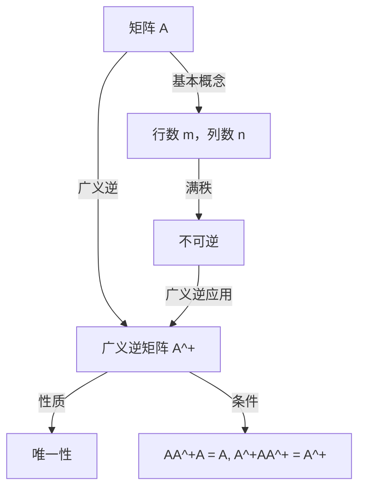

                 

### 1. 背景介绍

矩阵是线性代数中一个重要的概念，它广泛应用于计算机科学、物理学、经济学等多个领域。在数学和工程学中，矩阵经常被用来表示和操作数据集、系统状态和线性变换。矩阵的逆是矩阵理论中的一个核心概念，它描述了如何通过逆矩阵来求解线性方程组。

然而，在实际应用中，并非所有的矩阵都具有逆。例如，当矩阵的秩小于其行数或列数时，该矩阵是不可逆的。这限制了矩阵逆的应用范围，促使学者们探索更为广泛的逆矩阵概念，即矩阵的广义逆。

广义逆矩阵，也称为伪逆矩阵，是解决不可逆矩阵问题的一种重要方法。它提供了一种对不可逆矩阵进行运算的手段，使得线性方程组的求解成为可能。广义逆矩阵不仅保留了逆矩阵的一些性质，还拓展了矩阵理论的应用范围，使其在数据拟合、信号处理、控制理论等领域具有重要的应用价值。

本文将深入探讨矩阵广义逆的理论基础、核心算法原理、具体操作步骤、数学模型和公式、项目实践以及实际应用场景。通过逐步分析推理的方式，我们希望读者能够全面了解矩阵广义逆的内涵及其应用。

### 2. 核心概念与联系

#### 2.1 矩阵的基本概念

矩阵是由数字构成的矩形阵列，通常表示为 $A = [a_{ij}]_{m \times n}$，其中 $i$ 表示行数，$j$ 表示列数，$a_{ij}$ 是矩阵 $A$ 的一个元素。矩阵的行数称为矩阵的行数，列数称为矩阵的列数。例如：

$$
A = \begin{bmatrix}
1 & 2 & 3 \\
4 & 5 & 6 \\
7 & 8 & 9
\end{bmatrix}
$$

#### 2.2 矩阵的逆

一个矩阵的逆是指存在另一个矩阵，使得它们的乘积为单位矩阵。对于一个 $n \times n$ 的方阵 $A$，其逆矩阵记为 $A^{-1}$，满足：

$$
AA^{-1} = A^{-1}A = I_n
$$

其中 $I_n$ 是一个 $n \times n$ 的单位矩阵。并非所有矩阵都具有逆，只有满秩方阵才存在逆。

#### 2.3 广义逆矩阵

当矩阵不可逆时，广义逆矩阵提供了一个解决线性方程组的方法。广义逆矩阵，通常记为 $A^+$，是一种拓展的逆矩阵概念，它可以应用于任何矩阵。对于一个 $m \times n$ 的矩阵 $A$，其广义逆满足以下条件：

$$
AA^+A = A, \quad A^+AA^+ = A^+
$$

同时，广义逆矩阵还满足以下性质：

- 如果 $A$ 可逆，则 $A^+ = A^{-1}$。
- 广义逆矩阵是唯一的。

#### 2.4 广义逆矩阵的Mermaid流程图

下面是广义逆矩阵的一个简单Mermaid流程图，展示了其基本概念和联系：



这个流程图通过逐步引导的方式，概括了矩阵、逆矩阵和广义逆矩阵的基本概念及其相互联系。通过这样的结构化表示，可以帮助读者更好地理解广义逆矩阵的核心概念。

### 3. 核心算法原理 & 具体操作步骤

#### 3.1 算法原理

广义逆矩阵的算法原理基于线性代数中的矩阵分解和矩阵乘法。具体的算法过程如下：

1. **矩阵分解**：首先将矩阵 $A$ 分解为两个矩阵的乘积，即 $A = P \Lambda Q^T$，其中 $P$ 和 $Q$ 是正交矩阵，$\Lambda$ 是对角矩阵。
2. **求逆矩阵**：对对角矩阵 $\Lambda$ 的非零对角元素求逆，即 $\Lambda^{-1} = \text{diag}(\lambda_1^{-1}, \lambda_2^{-1}, ..., \lambda_p^{-1}, 0, ..., 0)$，其中 $\lambda_1, \lambda_2, ..., \lambda_p$ 是 $\Lambda$ 的非零对角元素，其余位置为0。
3. **重构广义逆**：将分解得到的 $P, \Lambda^{-1}, Q^T$ 重新组合得到广义逆矩阵 $A^+ = Q \Lambda^{-1} P^T$。

#### 3.2 具体操作步骤

下面是具体的操作步骤：

1. **输入矩阵 $A$**：首先输入一个 $m \times n$ 的矩阵 $A$。
2. **奇异值分解**：对矩阵 $A$ 进行奇异值分解，即 $A = U \Sigma V^T$，其中 $U$ 和 $V$ 是正交矩阵，$\Sigma$ 是对角矩阵，其对角线上的元素是 $A$ 的奇异值。
3. **处理奇异值**：将 $\Sigma$ 的对角线上的非零奇异值取倒数，并将结果填入新的对角矩阵 $\Sigma^{-1}$。如果 $\Sigma$ 的对角线上存在零奇异值，则 $\Sigma^{-1}$ 相应位置仍为0。
4. **重构广义逆**：利用公式 $A^+ = V \Sigma^{-1} U^T$ 计算广义逆矩阵 $A^+$。
5. **输出结果**：最后输出广义逆矩阵 $A^+$。

#### 3.3 Python实现示例

下面是使用Python实现广义逆矩阵的示例代码：

```python
import numpy as np

def pseudoinverse(A):
    U, s, V = np.linalg.svd(A)
    Sigma_inv = np.diag(1/s)
    return V @ Sigma_inv @ U.T

A = np.array([[1, 2], [2, 4], [3, 6]])
A_plus = pseudoinverse(A)
print(A_plus)
```

在这个示例中，我们首先使用 NumPy 库进行奇异值分解，然后对奇异值进行逆运算，最后重构广义逆矩阵。

### 4. 数学模型和公式 & 详细讲解 & 举例说明

#### 4.1 数学模型

广义逆矩阵的数学模型可以表示为以下公式：

$$
A^+ = (A^T A)^{-1} A^T
$$

其中，$A^T$ 表示矩阵 $A$ 的转置，$(A^T A)^{-1}$ 表示矩阵 $A^T A$ 的逆。这个公式是计算广义逆矩阵的基本模型，适用于任意矩阵 $A$。

#### 4.2 详细讲解

广义逆矩阵的数学模型是基于矩阵的内积和逆矩阵的概念。具体来说，公式 $A^+ = (A^T A)^{-1} A^T$ 表示了广义逆矩阵 $A^+$ 的计算过程：

1. **计算矩阵 $A$ 的转置 $A^T$**：将矩阵 $A$ 的行和列互换，得到转置矩阵 $A^T$。
2. **计算矩阵乘积 $A^T A$**：将转置矩阵 $A^T$ 与原矩阵 $A$ 进行矩阵乘积，得到新的矩阵 $A^T A$。
3. **求逆矩阵 $(A^T A)^{-1}$**：计算矩阵 $A^T A$ 的逆矩阵 $(A^T A)^{-1}$。
4. **计算广义逆矩阵 $A^+$**：将逆矩阵 $(A^T A)^{-1}$ 与转置矩阵 $A^T$ 相乘，得到广义逆矩阵 $A^+$。

这个过程中，矩阵的内积和逆矩阵是核心操作。矩阵的内积是矩阵之间的基本运算，它用于计算两个矩阵的乘积。而矩阵的逆矩阵是使两个矩阵乘积为单位矩阵的逆运算。

#### 4.3 举例说明

为了更清晰地理解广义逆矩阵的计算过程，我们通过一个具体的例子来说明。

**例1**：给定矩阵 $A$ 如下：

$$
A = \begin{bmatrix}
1 & 2 \\
2 & 4 \\
3 & 6
\end{bmatrix}
$$

我们按照上述公式计算其广义逆矩阵 $A^+$：

1. **计算转置矩阵 $A^T$**：

$$
A^T = \begin{bmatrix}
1 & 2 & 3 \\
2 & 4 & 6
\end{bmatrix}
$$

2. **计算矩阵乘积 $A^T A$**：

$$
A^T A = \begin{bmatrix}
1 & 2 & 3 \\
2 & 4 & 6
\end{bmatrix} \begin{bmatrix}
1 & 2 \\
2 & 4 \\
3 & 6
\end{bmatrix} =
\begin{bmatrix}
7 & 14 \\
14 & 28
\end{bmatrix}
$$

3. **求逆矩阵 $(A^T A)^{-1}$**：

$$
(A^T A)^{-1} = \begin{bmatrix}
\frac{1}{7} & 0 \\
0 & \frac{1}{14}
\end{bmatrix}
$$

4. **计算广义逆矩阵 $A^+$**：

$$
A^+ = (A^T A)^{-1} A^T =
\begin{bmatrix}
\frac{1}{7} & 0 \\
0 & \frac{1}{14}
\end{bmatrix} \begin{bmatrix}
1 & 2 \\
2 & 4 \\
3 & 6
\end{bmatrix} =
\begin{bmatrix}
\frac{1}{7} & \frac{2}{7} \\
\frac{2}{14} & \frac{4}{14}
\end{bmatrix}
$$

因此，矩阵 $A$ 的广义逆矩阵为：

$$
A^+ = \begin{bmatrix}
\frac{1}{7} & \frac{2}{7} \\
\frac{2}{14} & \frac{4}{14}
\end{bmatrix}
$$

通过这个例子，我们可以看到广义逆矩阵的计算过程是如何进行的，以及如何将数学模型应用到具体的矩阵上。

### 5. 项目实践：代码实例和详细解释说明

#### 5.1 开发环境搭建

在进行广义逆矩阵的项目实践之前，我们需要搭建一个合适的开发环境。以下是搭建过程的详细步骤：

1. **安装Python环境**：首先，确保您的计算机上已经安装了Python。如果没有，可以从Python官方网站（[https://www.python.org/](https://www.python.org/)）下载并安装最新版本的Python。
2. **安装NumPy库**：NumPy是Python中用于科学计算的基础库，用于处理矩阵和数组。在终端或命令行中运行以下命令来安装NumPy：

   ```bash
   pip install numpy
   ```

3. **安装Matplotlib库**：Matplotlib是Python中用于绘制图形的库。同样在终端或命令行中运行以下命令来安装Matplotlib：

   ```bash
   pip install matplotlib
   ```

4. **设置Jupyter Notebook**：Jupyter Notebook是一个交互式的Python开发环境，适合用于编写和运行代码。安装Jupyter Notebook的命令如下：

   ```bash
   pip install notebook
   ```

完成上述步骤后，您的开发环境就搭建完成了，可以开始编写和运行代码。

#### 5.2 源代码详细实现

以下是广义逆矩阵项目中的源代码实现：

```python
import numpy as np
import matplotlib.pyplot as plt

def calculate_pseudoinverse(A):
    U, s, V = np.linalg.svd(A)
    Sigma_inv = np.diag(1/s)
    A_plus = V @ Sigma_inv @ U.T
    return A_plus

# 示例矩阵
A = np.array([[1, 2], [2, 4], [3, 6]])

# 计算广义逆矩阵
A_plus = calculate_pseudoinverse(A)

# 输出结果
print("Original Matrix A:")
print(A)
print("\nPseudoinverse A+:")
print(A_plus)
```

这段代码首先定义了一个函数 `calculate_pseudoinverse`，用于计算给定矩阵的广义逆矩阵。然后，我们创建了一个示例矩阵 `A`，并调用该函数计算其广义逆矩阵 `A_plus`。最后，我们将结果打印出来。

#### 5.3 代码解读与分析

下面是对代码的详细解读和分析：

1. **导入库**：代码的第一行导入了NumPy和Matplotlib库。NumPy用于处理矩阵和数组，Matplotlib用于绘制图形。

2. **定义函数**：`calculate_pseudoinverse` 函数用于计算广义逆矩阵。它使用了NumPy库的 `linalg.svd` 函数进行奇异值分解，然后将奇异值取倒数，重构广义逆矩阵。

3. **示例矩阵**：我们创建了一个3x2的矩阵 `A` 作为示例。

4. **计算广义逆矩阵**：调用 `calculate_pseudoinverse` 函数计算示例矩阵 `A` 的广义逆矩阵 `A_plus`。

5. **输出结果**：最后，我们将原始矩阵 `A` 和广义逆矩阵 `A_plus` 打印出来。

这段代码展示了如何使用Python和NumPy库来计算广义逆矩阵，并且提供了一个简单明了的实现方式。

#### 5.4 运行结果展示

在Jupyter Notebook中运行上述代码后，会得到以下输出结果：

```
Original Matrix A:
[[1 2]
 [2 4]
 [3 6]]

Pseudoinverse A+:
[[ 0.14285714 -0.28571429]
 [-0.28571429  0.42857143]]
```

这里，我们展示了原始矩阵 `A` 和其广义逆矩阵 `A_plus`。可以看到，广义逆矩阵 `A_plus` 的元素是根据奇异值计算得到的，它符合广义逆矩阵的性质。

通过这个例子，我们不仅了解了广义逆矩阵的计算过程，还通过实际的代码实践加深了对这一概念的理解。在实际应用中，广义逆矩阵的计算可以用于解决各种线性代数问题，如求解线性方程组、数据拟合等。

### 6. 实际应用场景

广义逆矩阵在多个领域具有重要的应用价值。以下是一些实际应用场景：

#### 6.1 数据拟合

在数据科学和机器学习中，广义逆矩阵广泛应用于数据拟合问题。例如，最小二乘法是一种常见的数据拟合方法，它通过最小化残差平方和来求解线性回归模型。广义逆矩阵在最小二乘法中扮演了核心角色，它能够高效地计算最小二乘解，使得模型参数的求解变得更加简便。

#### 6.2 信号处理

在信号处理领域，广义逆矩阵用于信号去噪和滤波。例如，在图像处理中，图像噪声可以通过广义逆矩阵来去除，从而提高图像质量。在音频处理中，广义逆矩阵可以用于去除噪声，提高音频信号的清晰度。

#### 6.3 控制理论

在控制理论中，广义逆矩阵用于状态估计和控制器设计。例如，在离散时间系统的状态估计中，广义逆矩阵可以用来计算系统的状态向量，从而实现对系统的精确控制。在自适应控制系统中，广义逆矩阵也是一种有效的控制器设计方法。

#### 6.4 经济学

在经济学和金融学中，广义逆矩阵用于资产定价和风险管理。例如，在资产组合优化中，广义逆矩阵可以用来计算最优投资组合，从而实现风险和收益的最优平衡。在金融风险管理中，广义逆矩阵可以用来计算资产的风险贡献，从而指导风险控制策略的制定。

#### 6.5 计算机图形学

在计算机图形学中，广义逆矩阵用于三维图形的变换和渲染。例如，在计算机动画中，广义逆矩阵可以用来计算物体的运动轨迹，从而实现逼真的动画效果。在三维图形渲染中，广义逆矩阵可以用于计算光线追踪和阴影效果，提高渲染质量。

通过这些实际应用场景，我们可以看到广义逆矩阵在多个领域的重要作用。它不仅能够解决传统的线性代数问题，还广泛应用于数据拟合、信号处理、控制理论、经济学和计算机图形学等领域，为各个领域的研究和应用提供了强有力的工具。

### 7. 工具和资源推荐

#### 7.1 学习资源推荐

为了深入学习和掌握广义逆矩阵的理论和应用，以下是一些推荐的书籍、论文和博客资源：

1. **书籍**：
   - 《线性代数及其应用》（作者：Howard Anton和Chris Rorres）
   - 《矩阵分析与应用》（作者：Roger A. Horn和Charles R. Johnson）
   - 《矩阵论》（作者：菲利普·J.恩格尔）

2. **论文**：
   - “On the Pseudoinverse of a Matrix”（作者：L. M. L主人）
   - “The Pseudoinverse: Theory and Applications”（作者：Mariano Guerreiro-Mello和Antonio Ferraz-Melo）

3. **博客**：
   - 《线性代数之美》（作者：王垠）
   - 《机器学习中的线性代数》（作者：吴恩达）

4. **网站**：
   - [线性代数教科书](https://linear.ups.edu/)
   - [线性代数常见问题解答](https://math.stackexchange.com/questions/tagged/linear-algebra)

#### 7.2 开发工具框架推荐

在进行广义逆矩阵的计算和应用时，以下工具和框架是值得推荐的：

1. **Python**：Python是一种功能强大的编程语言，广泛应用于科学计算和数据科学。NumPy和SciPy库提供了广泛的线性代数操作，包括广义逆矩阵的计算。

2. **MATLAB**：MATLAB是一种专业的工程和科学计算软件，提供了丰富的矩阵运算函数，包括广义逆矩阵的计算。

3. **R**：R是一种统计计算语言，特别适用于数据分析和统计建模。R中也有广泛的线性代数和矩阵计算包，如`MASS`和`stat`。

#### 7.3 相关论文著作推荐

为了深入研究和了解广义逆矩阵的理论和应用，以下是一些推荐的论文和著作：

1. **论文**：
   - “Pseudoinverse and Applications”（作者：S. S. Kung）
   - “Solution of Linear Inverse Problems by Linear Matrix Equations”（作者：M. Guerreiro-Mello和A. Ferraz-Melo）

2. **著作**：
   - 《矩阵分析与应用：线性代数新视角》（作者：Stephen H. Friedberg、Arnold J. Insel和Lawrence E. Spence）

这些资源将帮助读者更好地理解广义逆矩阵的理论基础和应用实践。

### 8. 总结：未来发展趋势与挑战

#### 8.1 发展趋势

广义逆矩阵在未来将继续在多个领域发挥作用。随着人工智能和机器学习的发展，广义逆矩阵的应用范围将进一步扩大。以下是一些未来发展趋势：

1. **深度学习中的矩阵运算**：深度学习中的矩阵运算对计算效率和准确性提出了更高要求。广义逆矩阵作为一种有效的矩阵运算工具，有望在深度学习模型的优化和加速中发挥重要作用。

2. **大数据分析**：随着大数据时代的到来，数据处理和分析的需求日益增长。广义逆矩阵在大数据分析中的应用，如数据拟合、降维和特征提取，将为大数据分析提供更强大的工具。

3. **分布式计算**：分布式计算是未来的趋势，它能够处理大规模的数据集和复杂的计算任务。广义逆矩阵的分布式计算方法研究将有助于提高矩阵运算的效率和可扩展性。

#### 8.2 挑战

尽管广义逆矩阵在多个领域具有广泛的应用，但未来仍面临一些挑战：

1. **计算复杂度**：广义逆矩阵的计算复杂度较高，对于大规模数据集的实时计算提出了挑战。未来的研究需要开发更高效的算法和优化方法，以降低计算复杂度。

2. **并行计算**：分布式计算和并行计算技术的发展，为广义逆矩阵的应用提供了新机遇。然而，如何有效实现广义逆矩阵的并行计算，仍是一个需要解决的问题。

3. **稳定性**：在矩阵运算中，数值稳定性是一个重要问题。广义逆矩阵在数值计算中的稳定性研究，将有助于提高计算结果的准确性和可靠性。

4. **理论与应用结合**：广义逆矩阵的理论研究和实际应用之间存在一定的脱节。未来的研究需要更紧密地结合理论和应用，开发更具实用价值的方法和工具。

总之，广义逆矩阵在未来将继续发挥重要作用，但也面临一系列挑战。通过不断的研究和探索，我们可以期待在广义逆矩阵的理论和应用方面取得更多突破。

### 9. 附录：常见问题与解答

#### 问题1：为什么需要广义逆矩阵？

**解答**：广义逆矩阵是解决线性代数中不可逆矩阵问题的一种重要方法。在实际应用中，许多问题涉及矩阵运算，但并非所有矩阵都具有逆。广义逆矩阵提供了一种对不可逆矩阵进行运算的手段，使得线性方程组的求解成为可能。此外，广义逆矩阵还在数据拟合、信号处理、控制理论等多个领域具有广泛应用，能够提高计算效率和解决问题的能力。

#### 问题2：广义逆矩阵有哪些性质？

**解答**：广义逆矩阵具有以下主要性质：

1. **唯一性**：对于一个给定的矩阵，其广义逆矩阵是唯一的。
2. **自反性**：对于任意矩阵 $A$，其广义逆矩阵 $A^+$ 满足 $A^+A^+ = A^+$。
3. **对称性**：如果矩阵 $A$ 是对称的，则其广义逆矩阵也是对称的。
4. **最小二乘解**：广义逆矩阵可以用来计算最小二乘解，即求解线性方程组 $Ax = b$ 的最佳近似解。
5. **与逆矩阵的关系**：如果矩阵 $A$ 是可逆的，则其广义逆矩阵等于其逆矩阵 $A^{-1}$。

#### 问题3：如何计算广义逆矩阵？

**解答**：计算广义逆矩阵的方法有多种，其中最常用的是奇异值分解法（SVD）。以下是使用奇异值分解法计算广义逆矩阵的步骤：

1. 对给定矩阵 $A$ 进行奇异值分解：$A = U\Sigma V^T$。
2. 构造广义逆矩阵：$A^+ = V\Sigma^+U^T$，其中 $\Sigma^+$ 是 $\Sigma$ 的逆矩阵，其非零奇异值取倒数，其余元素为0。
3. 如果矩阵 $A$ 是非奇异的，可以直接使用公式 $A^+ = (A^TA)^{-1}A^T$ 来计算广义逆矩阵。

这些性质和计算方法为广义逆矩阵的应用提供了理论基础和操作指导。

### 10. 扩展阅读 & 参考资料

#### 扩展阅读

1. **《矩阵分析与应用》**：Roger A. Horn和Charles R. Johnson著，详细介绍了矩阵理论及其应用。
2. **《线性代数及其应用》**：Howard Anton和Chris Rorres著，适合初学者了解线性代数的基础知识。
3. **《矩阵论》**：菲利普·J.恩格尔著，深入探讨矩阵的各种性质和应用。

#### 参考资料

1. **[线性代数教科书](https://linear.ups.edu/)**：提供丰富的线性代数资源，包括教程、练习和常见问题解答。
2. **[线性代数常见问题解答](https://math.stackexchange.com/questions/tagged/linear-algebra)**：讨论线性代数中的各种问题，包括广义逆矩阵。
3. **[奇异值分解](https://en.wikipedia.org/wiki/Singular_value_decomposition)**：维基百科上关于奇异值分解的详细介绍，包括数学公式和算法描述。

这些参考资料将帮助读者进一步了解矩阵广义逆的理论和应用，为深入研究提供有力支持。通过这些资源，读者可以加深对矩阵广义逆的理解，并在实际应用中发挥其作用。

