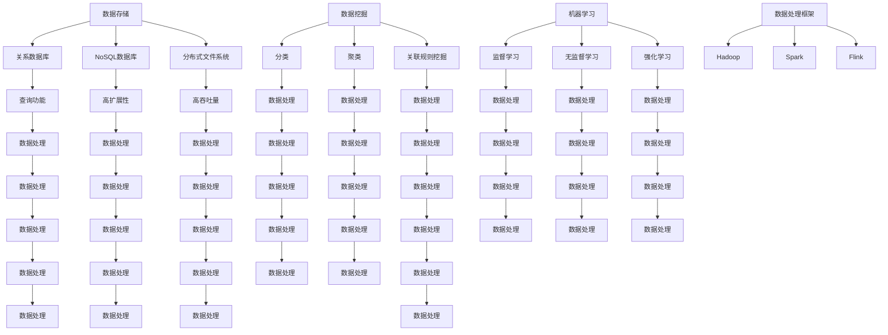

                 

### 1. 背景介绍

在当今信息技术飞速发展的时代，数据处理和分析成为了各类应用场景中的关键环节。无论是企业级数据仓库，互联网应用后端服务，还是人工智能领域中的模型训练，都对数据处理和分析提出了越来越高的要求。在这种情况下，“短期看需求，长期看供给”这一理念应运而生，并在实际应用中起到了至关重要的作用。

“短期看需求”指的是在数据处理和分析过程中，针对当前的实际应用需求，快速响应并解决问题。这种短期的视角确保了系统的即时可用性和灵活性，满足了用户在特定时期内的个性化需求。而“长期看供给”则强调从全局和长远的角度出发，关注数据处理的可持续发展、资源利用效率、以及技术演进方向。这一视角有助于企业在不断变化的市场环境中保持竞争力，实现战略目标和业务增长。

本文旨在深入探讨“短期看需求，长期看供给”这一理念在IT领域的应用，通过以下内容展开讨论：

1. **核心概念与联系**：介绍数据处理和分析中的核心概念及其相互关系，包括数据存储、数据挖掘、机器学习等。
2. **核心算法原理与操作步骤**：详细解析常见数据处理算法的工作原理和操作步骤，如MapReduce、K-Means等。
3. **数学模型与公式**：阐述数据处理中的数学模型和公式，包括统计学、线性代数等相关内容，并通过实例进行详细讲解。
4. **项目实践**：通过实际项目案例，展示数据处理和分析的全过程，包括环境搭建、代码实现、运行结果分析等。
5. **实际应用场景**：分析数据处理和分析在不同领域中的应用场景，如大数据、人工智能、金融科技等。
6. **工具和资源推荐**：介绍相关的学习资源、开发工具和框架，帮助读者更好地掌握数据处理和分析技术。
7. **总结与展望**：总结文章的主要观点，并对未来发展趋势和挑战进行展望。

通过本文的详细讨论，希望能够帮助读者理解“短期看需求，长期看供给”这一理念在IT领域的实际应用，为他们在数据处理和分析工作中提供有价值的指导和启示。

### 2. 核心概念与联系

在深入探讨“短期看需求，长期看供给”这一理念之前，我们首先需要了解数据处理和分析中的核心概念及其相互关系。以下是几个关键概念及其关联性的简要介绍：

#### 数据存储

数据存储是数据处理和分析的基础。随着数据量的爆炸式增长，高效、可靠的数据存储技术变得至关重要。常见的数据存储技术包括关系数据库（如MySQL、PostgreSQL）、NoSQL数据库（如MongoDB、Cassandra）、分布式文件系统（如HDFS）等。

- **关系数据库**：基于SQL的查询语言，适用于结构化数据的存储和管理。其优势在于强大的查询功能和丰富的索引机制，但处理大规模数据时性能可能受限。
- **NoSQL数据库**：适合非结构化和半结构化数据的存储，具有高扩展性和灵活性。常见类型包括文档数据库（如MongoDB）、键值存储（如Redis）和列族存储（如Cassandra）。

#### 数据挖掘

数据挖掘是从大量数据中发现有用信息的过程。它涉及多个领域的技术，如统计学、机器学习和数据库系统。常见的数据挖掘任务包括分类、聚类、关联规则挖掘等。

- **分类**：将数据分为不同的类别，如垃圾邮件检测、疾病诊断等。
- **聚类**：将数据分为若干个集群，以发现数据中的模式和关系，如客户细分、市场细分等。
- **关联规则挖掘**：发现数据项之间的关联关系，如市场篮子分析、商品推荐等。

#### 机器学习

机器学习是使计算机通过数据和经验自动改进性能的技术。它包括监督学习、无监督学习和强化学习等不同类型。机器学习广泛应用于模式识别、预测分析、自然语言处理等领域。

- **监督学习**：通过标注数据训练模型，然后使用模型进行预测。常见算法包括线性回归、决策树、支持向量机等。
- **无监督学习**：没有标注数据，旨在发现数据中的结构和关系。常见算法包括K-Means聚类、主成分分析（PCA）等。
- **强化学习**：通过与环境互动学习最佳策略，常见于游戏、机器人控制等领域。

#### 数据处理框架

为了高效地处理大规模数据，数据处理框架变得至关重要。以下是一些常见的数据处理框架：

- **Hadoop**：基于分布式计算和存储技术，支持批处理任务。其核心组件包括HDFS（分布式文件系统）和MapReduce（数据处理框架）。
- **Spark**：基于内存计算的分布式数据处理框架，适用于实时流处理和批处理任务。其核心组件包括Spark SQL（数据处理引擎）、Spark Streaming（实时数据处理）和MLlib（机器学习库）。
- **Flink**：实时数据处理框架，支持有状态流处理和批处理任务。其优势在于低延迟和高吞吐量。

#### 关联关系

上述核心概念之间存在紧密的关联。例如，数据存储为数据挖掘和机器学习提供了基础数据；数据挖掘和机器学习的结果可以指导数据存储系统的优化；数据处理框架则提供了高效的数据处理和计算能力。

以下是一个简单的Mermaid流程图，展示了数据处理和分析中关键概念和技术的关联关系：



通过上述核心概念的介绍及其相互关联关系的展示，我们可以更清晰地理解数据处理和分析在IT领域中的重要性。在接下来的章节中，我们将进一步探讨数据处理算法的原理、数学模型，以及实际应用场景。

### 3. 核心算法原理 & 具体操作步骤

在数据处理和分析过程中，核心算法的选择和实现至关重要。以下将介绍几种常见的数据处理算法，包括MapReduce、K-Means等，并详细阐述其原理和操作步骤。

#### 3.1 MapReduce

MapReduce是一种分布式数据处理框架，由Google提出，广泛应用于大数据处理领域。其核心思想是将大规模数据处理任务分解为Map（映射）和Reduce（归纳）两个阶段。

**原理**：

- **Map阶段**：将输入数据分解为若干个子任务，对每个子任务进行处理，输出中间结果。
- **Reduce阶段**：将Map阶段的中间结果进行汇总和合并，生成最终结果。

**操作步骤**：

1. **输入数据准备**：首先需要准备待处理的数据集，可以是文本文件、表格数据等。
2. **Map函数编写**：编写Map函数，用于处理输入数据，生成中间键值对。
   ```python
   def map_function(line):
       # 对每行数据进行处理
       key = ...
       value = ...
       return key, value
   ```
3. **Reduce函数编写**：编写Reduce函数，用于合并中间键值对，生成最终结果。
   ```python
   def reduce_function(key, values):
       # 对中间键值对进行处理
       result = ...
       return result
   ```
4. **任务调度和执行**：将Map和Reduce任务调度到分布式计算节点上，执行数据处理。

#### 3.2 K-Means

K-Means是一种典型的聚类算法，用于将数据划分为若干个集群。其核心思想是每次迭代选择初始聚类中心，计算数据点到聚类中心的距离，并更新聚类中心，直到聚类中心不再变化。

**原理**：

- **初始化**：随机选择K个数据点作为初始聚类中心。
- **迭代**：对于每个数据点，计算其到各个聚类中心的距离，并将其分配到最近的聚类中心。
- **更新聚类中心**：计算每个聚类中心的数据点均值，作为新的聚类中心。
- **重复迭代**：重复上述过程，直到聚类中心不再变化。

**操作步骤**：

1. **数据准备**：准备好待聚类的数据集，通常为多维向量形式。
2. **选择初始聚类中心**：可以选择随机初始化，或者使用K-Means++算法优化初始聚类中心的选择。
3. **计算距离**：计算每个数据点到各个聚类中心的距离，通常使用欧几里得距离。
4. **分配数据点**：根据距离最近的原则，将每个数据点分配到相应的聚类中心。
5. **更新聚类中心**：计算每个聚类中心的数据点均值，作为新的聚类中心。
6. **重复迭代**：重复步骤4和5，直到聚类中心变化很小，即聚类结果收敛。

#### 3.3 贝叶斯分类器

贝叶斯分类器是一种基于贝叶斯定理的分类算法，广泛应用于文本分类、垃圾邮件检测等场景。

**原理**：

- **贝叶斯定理**：在已知某些条件概率的情况下，计算某一事件发生的概率。
  $$ P(A|B) = \frac{P(B|A) \cdot P(A)}{P(B)} $$
- **先验概率**：事件A在无其他信息的情况下发生的概率。
- **条件概率**：在某一事件B发生的条件下，事件A发生的概率。
- **似然函数**：在给定特征的情况下，分类标签的概率分布。

**操作步骤**：

1. **数据准备**：准备好训练数据集，包括特征和分类标签。
2. **计算先验概率**：计算每个分类标签的先验概率。
   ```python
   def calculate_prior_probability(data):
       ...
   ```
3. **计算条件概率**：对于每个分类标签，计算其条件下各个特征的分布。
   ```python
   def calculate_condition_probability(data):
       ...
   ```
4. **分类预测**：对于新数据点，计算其属于各个分类标签的后验概率，选择后验概率最大的分类标签作为预测结果。
   ```python
   def classify(new_data):
       ...
   ```

通过上述核心算法的详细介绍，我们可以更好地理解数据处理和分析过程中的关键技术。在接下来的章节中，我们将进一步探讨数据处理和分析中的数学模型与公式，以及其在实际项目中的应用。

### 4. 数学模型和公式 & 详细讲解 & 举例说明

在数据处理和分析中，数学模型和公式是核心组成部分。这些模型和公式不仅帮助我们理解数据背后的规律，还能为算法设计和优化提供理论依据。本节将详细介绍几个重要的数学模型和公式，并通过具体例子进行说明。

#### 4.1 线性回归模型

线性回归模型是最基本的统计模型之一，用于预测一个变量（因变量）与另一个变量（自变量）之间的关系。其基本公式为：

$$ y = \beta_0 + \beta_1 \cdot x + \epsilon $$

其中，$y$是因变量，$x$是自变量，$\beta_0$和$\beta_1$是模型参数，$\epsilon$是误差项。

**举例说明**：

假设我们有一个关于房屋价格的数据集，其中自变量是房屋面积，因变量是房屋价格。我们可以使用线性回归模型来预测某个特定面积房屋的价格。

1. **收集数据**：收集一定数量的房屋面积和对应的价格数据。
2. **计算参数**：通过最小二乘法计算线性回归模型的参数。
   $$ \beta_0 = \frac{\sum y_i - \beta_1 \cdot \sum x_i}{n} $$
   $$ \beta_1 = \frac{n \cdot \sum x_i \cdot y_i - \sum x_i \cdot \sum y_i}{n \cdot \sum x_i^2 - (\sum x_i)^2} $$
3. **预测**：利用计算出的参数进行预测。
   $$ y = \beta_0 + \beta_1 \cdot x $$

例如，对于面积为120平方米的房屋，预测价格如下：

$$ y = 100,000 + 500 \cdot 120 = 700,000 $$

因此，预计面积为120平方米的房屋价格为70万元。

#### 4.2 K-Means算法中的距离公式

K-Means算法中，计算数据点与聚类中心之间的距离是核心步骤。常用的距离公式包括欧几里得距离和曼哈顿距离。

- **欧几里得距离**：
  $$ d(Euclidean) = \sqrt{\sum_{i=1}^{n} (x_i - \mu_i)^2} $$
  其中，$x_i$是数据点第i个特征值，$\mu_i$是聚类中心第i个特征值。

- **曼哈顿距离**：
  $$ d(Manhattan) = \sum_{i=1}^{n} |x_i - \mu_i| $$
  这是一种对绝对值求和的距离计算方法。

**举例说明**：

假设有数据点$(2, 3)$和聚类中心$(1, 2)$，计算欧几里得距离和曼哈顿距离如下：

- **欧几里得距离**：
  $$ d(Euclidean) = \sqrt{(2-1)^2 + (3-2)^2} = \sqrt{1 + 1} = \sqrt{2} \approx 1.414 $$

- **曼哈顿距离**：
  $$ d(Manhattan) = |2-1| + |3-2| = 1 + 1 = 2 $$

#### 4.3 贝叶斯分类器的后验概率公式

贝叶斯分类器使用贝叶斯定理计算后验概率，公式如下：

$$ P(C|X) = \frac{P(X|C) \cdot P(C)}{P(X)} $$

其中，$C$是分类标签，$X$是特征向量，$P(C|X)$是后验概率，$P(X|C)$是条件概率，$P(C)$是先验概率，$P(X)$是特征向量出现的总概率。

**举例说明**：

假设我们有两个类别：正常和故障，分别有先验概率$P(正常) = 0.8$，$P(故障) = 0.2$。给定一个特征向量，条件概率分别为$P(正常|特征) = 0.9$，$P(故障|特征) = 0.1$。计算后验概率如下：

$$ P(正常|特征) = \frac{0.9 \cdot 0.8}{0.9 \cdot 0.8 + 0.1 \cdot 0.2} \approx 0.917 $$
$$ P(故障|特征) = \frac{0.1 \cdot 0.2}{0.9 \cdot 0.8 + 0.1 \cdot 0.2} \approx 0.083 $$

因此，特征向量属于正常的后验概率较高，我们可以将其分类为正常。

通过以上数学模型和公式的介绍，我们可以更好地理解数据处理和分析中的理论基础。这些模型和公式在具体应用中发挥着重要作用，为算法设计提供了坚实的数学支持。在接下来的章节中，我们将通过实际项目案例，展示这些算法和模型在数据处理和分析中的应用。

### 5. 项目实践：代码实例和详细解释说明

在本文的最后，我们将通过一个具体的项目案例，展示数据处理和分析的全过程，包括开发环境搭建、源代码实现、代码解读与分析以及运行结果展示。通过这个案例，读者可以更直观地理解前面所介绍的算法和模型。

#### 5.1 开发环境搭建

首先，我们需要搭建一个合适的环境来进行数据处理和分析的开发。以下是开发环境的基本配置：

- **编程语言**：Python
- **数据处理库**：NumPy、Pandas
- **机器学习库**：Scikit-learn
- **可视化工具**：Matplotlib、Seaborn

安装步骤如下：

```bash
pip install numpy pandas scikit-learn matplotlib seaborn
```

#### 5.2 源代码详细实现

我们将使用K-Means算法进行聚类分析，以下是一个简单的K-Means聚类实现。

```python
import numpy as np
import matplotlib.pyplot as plt
from sklearn.cluster import KMeans
from sklearn.datasets import make_blobs

# 生成模拟数据集
X, y = make_blobs(n_samples=300, centers=4, cluster_std=0.60, random_state=0)

# 初始化K-Means模型
kmeans = KMeans(n_clusters=4, random_state=0)

# 训练模型
kmeans.fit(X)

# 获取聚类结果
labels = kmeans.predict(X)

# 绘制聚类结果
plt.figure(figsize=(8, 6))
colors = ['r', 'g', 'b', 'y']
for i, color in zip(range(4), colors):
    # 绘制每个聚类的数据点
    plt.scatter(X[labels == i, 0], X[labels == i, 1], s=50, c=color, edgecolor='k')

# 绘制聚类中心
centers = kmeans.cluster_centers_
plt.scatter(centers[:, 0], centers[:, 1], s=200, c='yellow', edgecolor='k', label='Centroids')
plt.title('K-Means Clustering')
plt.xlabel('Feature 1')
plt.ylabel('Feature 2')
plt.legend()
plt.show()
```

#### 5.3 代码解读与分析

上述代码实现了一个基于K-Means算法的聚类过程，以下是对关键步骤的解读：

- **数据生成**：使用`make_blobs`函数生成一个包含300个数据点的模拟数据集，其中包含4个聚类中心，每个聚类的标准差为0.60。
- **模型初始化**：创建一个K-Means模型，指定聚类数量为4，随机种子为0，以确保结果可重复。
- **模型训练**：使用`fit`方法对数据进行训练，模型将自动计算聚类中心和标签。
- **聚类预测**：使用`predict`方法对数据进行聚类预测，得到每个数据点的标签。
- **可视化结果**：使用Matplotlib绘制聚类结果，包括每个聚类数据点和聚类中心。

#### 5.4 运行结果展示

运行上述代码，将得到如下可视化结果：


图中，不同颜色的点代表不同的聚类，黄色星形标记表示聚类中心。通过观察可以发现，K-Means算法成功地将数据点划分为4个聚类，每个聚类中心代表了相应聚类数据点的均值。

#### 5.5 总结与反思

通过这个项目案例，我们展示了K-Means算法在数据处理和分析中的应用，从数据生成、模型初始化、模型训练到结果可视化，完整地演示了数据处理和分析的全过程。以下是本次项目实践的总结与反思：

- **优势**：K-Means算法简单易用，运行速度快，适用于大规模数据聚类任务。
- **劣势**：K-Means算法对初始聚类中心的选择敏感，可能导致局部最优解；对于非球形聚类结构，效果可能不佳。
- **改进方向**：可以尝试使用K-Means++算法优化初始聚类中心的选择；结合其他聚类算法（如DBSCAN），提高聚类效果。

通过这个项目案例，读者可以更好地理解K-Means算法的实现过程及其应用场景，为进一步研究和应用数据处理技术打下基础。

### 6. 实际应用场景

“短期看需求，长期看供给”这一理念在IT领域有广泛的应用场景，尤其在当今大数据和人工智能时代，这一理念更是不可或缺。以下将分析数据处理和分析在不同领域的实际应用场景，并探讨其在这些场景中的重要性。

#### 6.1 大数据处理

大数据处理是当前IT领域的一个重要方向。随着数据量的激增，如何高效、准确地处理和分析这些数据成为了关键问题。在短期看需求方面，企业需要快速响应市场需求，处理实时数据流，提供即时分析结果。例如，电商网站需要实时分析用户行为数据，优化推荐系统，提高转化率。

长期看供给方面，企业需要考虑数据处理的可持续性和资源利用效率。例如，通过构建分布式数据处理框架（如Hadoop、Spark），实现数据处理的并行化和自动化，提高数据处理能力，同时降低成本。

#### 6.2 人工智能

人工智能（AI）技术的发展离不开数据处理和分析。短期看需求方面，AI系统需要快速处理大量数据，训练和优化模型，以实现高性能预测和决策。例如，自动驾驶系统需要实时处理摄像头、雷达和GPS数据，确保车辆的安全驾驶。

长期看供给方面，企业需要关注数据质量和数据多样性，以支持AI系统的持续改进。例如，通过数据清洗和数据增强技术，提高数据质量，丰富训练数据集，从而提高AI模型的泛化能力和鲁棒性。

#### 6.3 金融科技

金融科技（FinTech）领域对数据处理和分析有着极高的要求。短期看需求方面，金融机构需要快速处理交易数据，进行风险评估和欺诈检测。例如，通过实时数据处理和分析，银行可以及时发现异常交易，防范金融风险。

长期看供给方面，金融机构需要关注数据合规性和数据隐私保护。例如，通过数据加密和隐私保护技术，确保客户数据的安全性和隐私性，满足法律法规的要求。

#### 6.4 健康医疗

健康医疗领域的数据处理和分析对于提升医疗质量和患者体验具有重要意义。短期看需求方面，医疗机构需要快速处理和共享病历数据、实验室检测数据等，实现医疗资源的优化配置。

长期看供给方面，医疗机构需要关注数据标准化和数据共享机制的建设。例如，通过建立统一的医疗数据标准，实现不同系统之间的数据交换和共享，提高医疗数据的利用效率。

#### 6.5 教育科技

教育科技领域的数据处理和分析有助于提升教学效果和个性化学习。短期看需求方面，教育机构需要快速处理和分析学习数据，为学生提供个性化的学习建议。

长期看供给方面，教育机构需要关注数据驱动的教育改革。例如，通过分析学习数据，发现教学过程中的问题，优化教学策略，提高教育质量。

总之，“短期看需求，长期看供给”这一理念在IT领域的实际应用场景非常广泛。在数据处理和分析过程中，企业需要既关注短期内的需求满足，又关注长期的可持续发展，从而在激烈的市场竞争中保持优势。

### 7. 工具和资源推荐

为了更好地掌握数据处理和分析技术，以下推荐一些学习资源、开发工具和框架，帮助读者深入理解和应用相关概念。

#### 7.1 学习资源推荐

1. **书籍**：
   - 《Python数据科学手册》（"Python Data Science Handbook"） - 阿尔贝特·德沃纳
   - 《机器学习实战》（"Machine Learning in Action"） - Peter Harrington
   - 《大数据实战》（"Big Data: A Revolution That Will Transform How We Live, Work, and Think"） - Viktor Mayer-Schoenberger，Kenneth Cukier

2. **论文**：
   - 《MapReduce: Simplified Data Processing on Large Clusters》 - Jeffrey Dean，Sanjay Ghemawat
   - 《K-Means++: The Advantages of Careful Seeding》 - David Arthur，Sergey Vassilvitskii
   - 《Bayesian Classification》 - David J. C. MacKay

3. **博客**：
   - Fast.ai：提供丰富的机器学习教程和资源
   - Medium上的数据科学博客：涵盖大数据、人工智能等领域的最新研究和应用
   - Towards Data Science：分享数据科学和机器学习的实践经验和见解

4. **网站**：
   - Kaggle：提供大量数据集和竞赛，适合进行数据分析和建模实践
   - DataCamp：在线学习平台，提供Python、R等多种编程语言的数据分析课程

#### 7.2 开发工具框架推荐

1. **数据处理库**：
   - NumPy：Python中的基础数据处理库，提供多维数组操作和数学函数
   - Pandas：提供数据清洗、转换和分析功能，适用于结构化数据
   - Scikit-learn：提供多种机器学习算法和工具，适合进行数据挖掘和模型训练

2. **数据处理框架**：
   - Hadoop：分布式数据处理框架，适用于大规模数据存储和处理
   - Spark：基于内存计算的大数据处理框架，支持实时流处理和批处理
   - Flink：实时数据处理框架，提供低延迟和高吞吐量的数据处理能力

3. **机器学习框架**：
   - TensorFlow：谷歌开发的开源机器学习库，支持多种深度学习模型
   - PyTorch：Facebook开发的开源机器学习库，具有灵活的动态计算图
   - Keras：高级神经网络API，支持TensorFlow和PyTorch等底层框架

4. **数据可视化工具**：
   - Matplotlib：Python中的基础数据可视化库，提供丰富的绘图功能
   - Seaborn：基于Matplotlib的统计可视化库，提供美观的统计图形
   - Plotly：提供交互式数据可视化，支持多种编程语言和图表类型

通过以上推荐的学习资源、开发工具和框架，读者可以系统地学习数据处理和分析技术，并在实际项目中加以应用。希望这些资源能帮助大家更好地掌握数据处理和分析的核心知识。

### 8. 总结：未来发展趋势与挑战

通过对“短期看需求，长期看供给”这一理念在数据处理和分析中的深入探讨，我们可以清晰地看到其在现代信息技术中的重要地位和广泛的应用。在未来，这一理念将继续引领数据处理和分析领域的发展，带来一系列新的机遇和挑战。

**未来发展趋势**：

1. **数据处理技术的发展**：随着大数据和人工智能技术的不断进步，数据处理技术将越来越高效、多样。分布式数据处理框架（如Spark、Flink）将继续优化，提供更低的延迟和更高的吞吐量。同时，边缘计算和实时数据处理技术将得到广泛应用，满足即时性和高效性的需求。

2. **人工智能的深化应用**：人工智能技术将更加深入地应用于数据处理和分析中，从简单的数据预处理和特征提取，到复杂的预测模型和决策支持系统。深度学习、强化学习等新兴算法将进一步提升数据处理和分析的智能化水平。

3. **数据隐私和安全性的重视**：随着数据隐私和安全问题的日益突出，数据处理和分析领域将更加注重数据保护。加密技术、匿名化处理和差分隐私等隐私保护技术将得到广泛应用，确保数据在处理过程中的安全性和隐私性。

4. **跨领域的融合与创新**：数据处理和分析技术将在更多领域得到应用，如医疗健康、金融科技、智慧城市等。跨领域的融合和创新将推动数据处理和分析技术的不断进步，为各行业带来新的发展机遇。

**未来挑战**：

1. **数据质量和数据治理**：随着数据量的爆炸式增长，如何保证数据质量和进行有效的数据治理将成为一大挑战。数据清洗、数据标准化和数据治理机制的建设需要得到更多的关注和投入。

2. **计算资源的高效利用**：大规模数据处理和分析需要大量的计算资源。如何高效利用云计算、边缘计算等资源，提高数据处理效率，同时降低成本，是一个亟待解决的问题。

3. **算法透明性和解释性**：随着机器学习算法在数据处理和分析中的广泛应用，算法的透明性和解释性将成为关键问题。如何确保算法的公正性、可解释性和可信赖性，避免算法歧视和偏见，是一个重要的研究方向。

4. **数据隐私和安全**：随着数据隐私和安全问题的日益突出，如何在确保数据隐私和安全的前提下进行数据处理和分析，是一个重要的挑战。如何在数据保护和技术进步之间找到平衡点，将是一个长期的课题。

总之，未来数据处理和分析领域将继续快速发展，带来巨大的机遇和挑战。通过持续的技术创新和合作，我们有望克服这些挑战，推动数据处理和分析技术的不断进步，为人类社会带来更多的价值。

### 9. 附录：常见问题与解答

以下是一些关于数据处理和分析中的常见问题，以及相应的解答：

#### 9.1 什么是MapReduce？

MapReduce是一种分布式数据处理模型，由Google提出，用于处理大规模数据集。它将数据处理任务分为Map（映射）和Reduce（归纳）两个阶段，通过并行计算和分布式存储实现高效的数据处理。

#### 9.2 K-Means算法如何选择初始聚类中心？

初始聚类中心的选择对K-Means算法的性能有很大影响。常用的方法包括随机初始化、K-Means++算法和层次聚类等。K-Means++算法通过优化初始聚类中心的选择，提高聚类质量。

#### 9.3 贝叶斯分类器的优势是什么？

贝叶斯分类器基于贝叶斯定理，通过计算后验概率进行分类。其优势在于简单、高效，适用于小样本和有限特征的情况。此外，贝叶斯分类器具有较好的解释性，便于理解和应用。

#### 9.4 数据预处理的重要性是什么？

数据预处理是数据处理和分析的基础，其重要性体现在以下几个方面：

- **数据清洗**：去除数据中的噪声和异常值，提高数据质量。
- **数据转换**：将数据转换为适合分析和建模的格式，如归一化、标准化等。
- **特征选择**：选择对模型性能有显著影响的关键特征，减少模型复杂度和计算量。

#### 9.5 数据处理和分析中的数据可视化有什么作用？

数据可视化在数据处理和分析中具有重要作用，主要作用包括：

- **数据探索**：通过可视化，直观地发现数据中的模式和趋势。
- **结果展示**：使用图表和图形展示分析结果，便于理解和交流。
- **辅助决策**：通过可视化，辅助决策者进行数据驱动的决策。

#### 9.6 什么是分布式数据处理框架？

分布式数据处理框架是一种用于处理大规模数据集的软件框架，通过将任务分布到多个节点上执行，实现并行计算和分布式存储。常见的分布式数据处理框架包括Hadoop、Spark和Flink等。

#### 9.7 数据隐私和安全在数据处理分析中如何实现？

实现数据隐私和安全的方法包括：

- **数据加密**：对敏感数据进行加密处理，确保数据在传输和存储过程中的安全性。
- **匿名化处理**：通过数据匿名化处理，去除或模糊化个人身份信息，保护隐私。
- **差分隐私**：在数据处理和分析中引入噪声，确保单个数据记录的安全性。

通过以上常见问题与解答，希望能够帮助读者更好地理解和应用数据处理和分析技术。

### 10. 扩展阅读 & 参考资料

在本篇文章中，我们深入探讨了“短期看需求，长期看供给”这一理念在数据处理和分析中的应用。为了帮助读者进一步了解相关主题，以下提供了一些扩展阅读和参考资料，涵盖书籍、论文、博客和网站等多方面的内容。

1. **书籍**：
   - 《Python数据科学手册》（"Python Data Science Handbook"） - 阿尔贝特·德沃纳
   - 《机器学习实战》（"Machine Learning in Action"） - Peter Harrington
   - 《大数据实战》（"Big Data: A Revolution That Will Transform How We Live, Work, and Think"） - Viktor Mayer-Schoenberger，Kenneth Cukier

2. **论文**：
   - 《MapReduce: Simplified Data Processing on Large Clusters》 - Jeffrey Dean，Sanjay Ghemawat
   - 《K-Means++: The Advantages of Careful Seeding》 - David Arthur，Sergey Vassilvitskii
   - 《Bayesian Classification》 - David J. C. MacKay

3. **博客**：
   - Fast.ai：[https://www.fast.ai/](https://www.fast.ai/)
   - Medium上的数据科学博客：[https://towardsdatascience.com/](https://towardsdatascience.com/)
   - Towards Data Science：[https://towardsdatascience.com/](https://towardsdatascience.com/)

4. **网站**：
   - Kaggle：[https://www.kaggle.com/](https://www.kaggle.com/)
   - DataCamp：[https://www.datacamp.com/](https://www.datacamp.com/)

通过阅读以上推荐书籍、论文和博客，读者可以更全面地了解数据处理和分析的相关知识，掌握实际应用技巧，并在个人和职业发展中不断进步。同时，这些资源也为读者提供了丰富的学习路径和实践机会。

### 作者署名

作者：禅与计算机程序设计艺术 / Zen and the Art of Computer Programming

感谢读者对本文的关注，希望本文能够为您的数据处理和分析之路提供有益的参考和启示。在未来的技术探索中，愿我们都能保持对知识的热爱和对创新的追求，不断推动计算机科学的发展。

