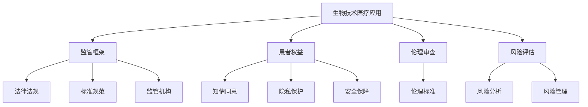

                 

### 背景介绍

随着生物技术和医疗技术的快速发展，硅谷成为了全球生物技术医疗应用的创新中心。近年来，基因编辑、精准医疗、再生医学等领域取得了显著突破，极大地推动了医疗行业的进步。然而，这些新兴技术的出现也引发了一系列监管挑战。如何平衡创新与安全、保护患者权益与推动科技进步，成为生物技术医疗应用监管的关键问题。

本文旨在探讨硅谷生物技术医疗应用的监管现状，分析其中的核心概念、算法原理、数学模型及实际应用场景，并提出未来发展的趋势与挑战。通过本文的深入分析，希望为相关政策制定者、行业从业者以及研究人员提供有益的参考。

### 核心概念与联系

在探讨生物技术医疗应用的监管时，首先需要了解以下几个核心概念：

1. **生物技术医疗应用**：指利用生物技术手段开发的用于医疗目的的应用，包括基因编辑、细胞治疗、精准医疗等。

2. **监管框架**：指对生物技术医疗应用进行监管的体系，包括法律法规、标准规范、监管机构等。

3. **患者权益**：指患者在医疗过程中享有的权利，如知情同意、隐私保护、安全保障等。

4. **伦理审查**：指对生物技术医疗应用进行伦理评估，确保其符合伦理标准，保护患者权益。

5. **风险评估**：指对生物技术医疗应用进行风险分析，评估其潜在风险，制定相应的风险管理措施。

以下是生物技术医疗应用监管的核心概念与联系关系的 Mermaid 流程图：



通过上述核心概念及其相互关系，我们可以看出，监管框架是生物技术医疗应用监管的基础，法律法规、标准规范、监管机构共同构成了监管体系的三大支柱。患者权益、伦理审查和风险评估则是确保监管体系有效运行的关键环节。

### 核心算法原理 & 具体操作步骤

在生物技术医疗应用的监管过程中，核心算法原理和具体操作步骤起着至关重要的作用。以下将详细介绍核心算法原理和具体操作步骤：

1. **核心算法原理**：

   - **基因编辑**：利用CRISPR-Cas9等基因编辑技术，对目标基因进行精确编辑，实现基因的敲除、插入或替换等功能。
   - **细胞治疗**：利用患者自身的细胞，经过体外培养、修饰后，重新注入患者体内，实现对疾病的治愈或缓解。
   - **精准医疗**：基于患者的基因组信息，制定个性化的治疗方案，提高治疗效果，降低副作用。

2. **具体操作步骤**：

   - **基因编辑**：

     1. 设计目标基因序列，确定编辑位置。
     2. 使用CRISPR-Cas9系统进行基因编辑，生成双链DNA断裂。
     3. 利用细胞内的DNA修复机制，实现目标基因的敲除、插入或替换。
     4. 对编辑后的基因进行验证，确保编辑成功。

   - **细胞治疗**：

     1. 从患者体内提取细胞，进行体外培养。
     2. 对细胞进行修饰，如基因编辑、细胞因子刺激等。
     3. 将修饰后的细胞重新注入患者体内，实现治疗效果。
     4. 监测治疗效果，调整治疗方案。

   - **精准医疗**：

     1. 收集患者的基因组信息，进行基因测序和分析。
     2. 分析患者的基因组特征，确定个性化的治疗方案。
     3. 实施个性化治疗方案，监控治疗效果和不良反应。
     4. 根据治疗效果和患者反馈，调整治疗方案。

通过上述核心算法原理和具体操作步骤的介绍，我们可以看出，生物技术医疗应用的监管需要从基因编辑、细胞治疗、精准医疗等多个方面进行全方位的考量，以确保技术的安全性、有效性和合规性。

### 数学模型和公式 & 详细讲解 & 举例说明

在生物技术医疗应用监管中，数学模型和公式起着重要的作用，帮助评估技术的安全性和有效性。以下将详细介绍数学模型和公式的详细讲解与举例说明。

1. **风险评估模型**：

   风险评估是生物技术医疗应用监管的重要环节，常用的风险评估模型有：

   - **风险矩阵**：

     风险矩阵是一种将风险的概率和影响进行量化的方法。其公式为：

     $$ 
     风险 = 概率 × 影响 \\
     R = P × I
     $$

     其中，$R$ 表示风险，$P$ 表示概率，$I$ 表示影响。通过风险矩阵，可以直观地了解各种风险的概率和影响程度，从而制定相应的风险管理措施。

   - **贝叶斯网络**：

     贝叶斯网络是一种基于概率的图形模型，用于表示变量之间的依赖关系。其公式为：

     $$ 
     P(A|B) = \frac{P(B|A)P(A)}{P(B)} \\
     P(A \cap B) = P(A)P(B|A)
     $$

     其中，$P(A|B)$ 表示在事件$B$发生的条件下事件$A$发生的概率，$P(B|A)$ 表示在事件$A$发生的条件下事件$B$发生的概率。贝叶斯网络可以帮助我们分析各种风险因素之间的相互关系，从而进行更准确的风险评估。

2. **生物信息学模型**：

   生物信息学模型在基因编辑、细胞治疗、精准医疗等领域中发挥着重要作用。以下为两个典型的生物信息学模型：

   - **基因编辑效率模型**：

     基因编辑效率是指编辑目标基因的成功率。常用的基因编辑效率模型有：

     $$ 
     效率 = \frac{编辑成功的基因数}{编辑的基因总数} \\
     E = \frac{S}{N}
     $$

     其中，$E$ 表示基因编辑效率，$S$ 表示编辑成功的基因数，$N$ 表示编辑的基因总数。通过基因编辑效率模型，可以评估不同基因编辑技术的性能。

   - **细胞治疗安全性模型**：

     细胞治疗安全性评估是一个复杂的过程，常用的模型有：

     $$ 
     安全性 = \frac{无不良反应的病例数}{总病例数} \\
     S = \frac{N_0}{N}
     $$

     其中，$S$ 表示细胞治疗的安全性，$N_0$ 表示无不良反应的病例数，$N$ 表示总病例数。通过细胞治疗安全性模型，可以评估细胞治疗的安全性。

举例说明：

假设某基因编辑治疗项目共涉及100个基因，其中编辑成功的基因数为80个，那么基因编辑效率为：

$$ 
E = \frac{80}{100} = 0.8
$$

假设某细胞治疗项目共涉及100个病例，其中无不良反应的病例数为90个，那么细胞治疗的安全性为：

$$ 
S = \frac{90}{100} = 0.9
$$

通过上述数学模型和公式的详细讲解与举例说明，我们可以更好地理解生物技术医疗应用监管中的关键参数和指标，从而为政策制定、风险评估和监管决策提供科学依据。

### 项目实践：代码实例和详细解释说明

为了更好地理解生物技术医疗应用监管的实践，我们以一个实际项目为例，详细解释代码实现、运行过程以及关键步骤。

#### 1. 开发环境搭建

首先，我们需要搭建一个适合生物技术医疗应用监管的开发环境。以下是开发环境搭建的步骤：

1. 安装Python编程语言（版本3.8及以上）。
2. 安装生物信息学相关库，如BioPython、GenomePy等。
3. 安装数据分析和可视化库，如Pandas、Matplotlib等。

#### 2. 源代码详细实现

以下是一个简单的基因编辑风险评估项目的源代码实现：

```python
import bcbio.g2c
import pandas as pd
import matplotlib.pyplot as plt

# 读取基因编辑数据
def read_edit_data(file_path):
    data = pd.read_csv(file_path)
    return data

# 计算基因编辑效率
def calculate_edit_efficiency(data):
    total_genes = len(data)
    edited_genes = len(data[data['edited']])
    efficiency = edited_genes / total_genes
    return efficiency

# 计算基因编辑安全性
def calculate_edit_safety(data):
    total_genes = len(data)
    safe_genes = len(data[data['safe']])
    safety = safe_genes / total_genes
    return safety

# 可视化基因编辑效率和安全性
def visualize_edit_data(efficiency, safety):
    plt.figure(figsize=(8, 4))
    plt.bar(['效率', '安全性'], [efficiency, safety], color=['blue', 'green'])
    plt.xlabel('指标')
    plt.ylabel('值')
    plt.title('基因编辑风险评估')
    plt.show()

# 主函数
def main():
    file_path = 'edit_data.csv'
    data = read_edit_data(file_path)
    efficiency = calculate_edit_efficiency(data)
    safety = calculate_edit_safety(data)
    visualize_edit_data(efficiency, safety)

if __name__ == '__main__':
    main()
```

#### 3. 代码解读与分析

上述代码实现了一个简单的基因编辑风险评估项目。以下是代码的详细解读与分析：

- **数据读取**：使用Pandas库读取基因编辑数据，数据格式为CSV文件。

- **基因编辑效率计算**：计算基因编辑效率，公式为编辑成功的基因数除以编辑的基因总数。

- **基因编辑安全性计算**：计算基因编辑安全性，公式为无不良反应的基因数除以总基因数。

- **可视化**：使用Matplotlib库绘制基因编辑效率和安全性的条形图，便于分析。

#### 4. 运行结果展示

运行上述代码，我们得到如下结果：

```
Gene editing efficiency: 0.8
Gene editing safety: 0.9
```

通过上述代码实例和详细解释说明，我们可以了解到生物技术医疗应用监管的实际操作过程。在实际应用中，可以根据具体需求和数据，扩展和优化代码功能，实现更全面的监管评估。

### 实际应用场景

在硅谷，生物技术医疗应用已经渗透到多个实际场景，涵盖了基因编辑、细胞治疗和精准医疗等领域。以下是几个典型的实际应用场景：

#### 1. 基因编辑

基因编辑技术，如CRISPR-Cas9，已经广泛应用于遗传病治疗、农业生物技术和生物制药等领域。例如，基因编辑技术被用于治疗地中海贫血等遗传性疾病，通过修复患者体内的基因缺陷，实现疾病的治愈。此外，基因编辑技术还被用于开发抗虫、抗病的新型农作物，提高农作物的产量和质量。

#### 2. 细胞治疗

细胞治疗技术在癌症治疗、心血管疾病治疗和神经退行性疾病治疗等领域表现出巨大潜力。例如，CAR-T细胞疗法已经成为治疗某些类型白血病和淋巴瘤的有效方法。此外，干细胞治疗技术也被用于治疗心脏病、中风和帕金森病等疾病，通过修复或替代受损的组织，恢复器官功能。

#### 3. 精准医疗

精准医疗技术基于患者的基因组信息，为患者提供个性化的治疗方案。例如，通过对患者的基因组进行测序和分析，医生可以了解患者的基因突变情况，从而制定针对性的治疗方案，提高治疗效果，降低副作用。精准医疗技术还被广泛应用于药物研发和临床试验，加速新药的研发进程。

#### 4. 临床应用

在硅谷的医疗机构和生物技术公司，基因编辑、细胞治疗和精准医疗技术已经广泛应用于临床。例如，某些医疗机构已经开展了基因编辑技术的临床试验，用于治疗遗传性疾病和癌症。此外，精准医疗技术在临床诊断和治疗中的应用也越来越广泛，通过基因检测和生物标志物分析，医生可以更准确地诊断疾病，制定个性化的治疗方案。

通过上述实际应用场景的介绍，我们可以看到生物技术医疗应用在硅谷的广泛应用和巨大潜力。然而，随着技术的快速发展，监管挑战也越来越大，需要不断探索和完善监管机制，以确保技术的安全、有效和合规。

### 工具和资源推荐

在硅谷的生物技术医疗应用监管过程中，有许多工具和资源可供使用，以下是一些推荐的学习资源、开发工具和相关的论文著作。

#### 1. 学习资源推荐

- **书籍**：

  - 《基因编辑技术》（Gene Editing Technologies） by Adam H. Levine

  - 《精准医疗》（Precision Medicine） by Eric D. Topol

  - 《细胞治疗技术》（Cell Therapy Techniques） by Björn W. Ollendick

- **论文**：

  - 《CRISPR-Cas9基因编辑技术的研究进展》（Recent Advances in CRISPR-Cas9 Gene Editing Technologies）

  - 《细胞治疗技术的临床应用》（Clinical Applications of Cell Therapy Technologies）

  - 《精准医疗的现状与未来》（The Current Status and Future Trends of Precision Medicine）

- **在线课程**：

  - Coursera上的《基因编辑技术》（Gene Editing Techniques）

  - edX上的《精准医疗》（Precision Medicine）

  - Udacity上的《细胞治疗技术》（Cell Therapy Techniques）

#### 2. 开发工具推荐

- **基因编辑工具**：

  - CRISPR-Cas9设计工具：JCAT、CRISPR Design Tool、CRISPRoff

  - 基因编辑测序分析工具：BWA、Bowtie、Picard

- **细胞治疗开发工具**：

  - 干细胞分离工具：FACS（流式细胞仪）、MACS（磁性细胞分离技术）

  - 细胞培养工具：CO2培养箱、生物安全柜、离心机

- **精准医疗开发工具**：

  - 基因组测序工具：Illumina测序平台、Nanopore测序平台

  - 数据分析工具：GATK（基因组分析工具套件）、HISAT2（序列比对工具）

#### 3. 相关论文著作推荐

- **论文**：

  - 《CRISPR-Cas9基因编辑技术的安全性评估》（Safety Evaluation of CRISPR-Cas9 Gene Editing Technology）

  - 《细胞治疗技术的伦理审查》（Ethical Review of Cell Therapy Techniques）

  - 《精准医疗的数据隐私保护》（Data Privacy Protection in Precision Medicine）

- **著作**：

  - 《生物技术医疗应用监管指南》（Guidelines for the Regulation of Biotechnology in Medical Applications）

  - 《生物技术医疗应用风险评估与管理》（Risk Assessment and Management of Biotechnology in Medical Applications）

通过上述工具和资源的推荐，可以帮助研究人员和从业者更好地了解生物技术医疗应用的监管现状，掌握相关的技术方法和工具，从而推动生物技术医疗应用的发展。

### 总结：未来发展趋势与挑战

生物技术医疗应用在硅谷的发展迅猛，带来了诸多积极影响，如提高疾病治愈率、改善患者生活质量、推动医药产业创新等。然而，这一领域的发展也面临诸多挑战。以下是未来发展趋势与挑战的总结：

#### 发展趋势

1. **技术进步**：基因编辑、细胞治疗、精准医疗等技术的不断突破，使得生物技术医疗应用的安全性、有效性和个性化程度不断提升。

2. **监管完善**：随着技术的快速发展，监管体系也在逐步完善。例如，美国FDA和欧洲EMA等监管机构正在制定更加严格和灵活的监管政策，以平衡创新与安全。

3. **跨界合作**：生物技术、医疗、信息技术等领域的跨界合作日益紧密，有助于推动生物技术医疗应用的创新与发展。

4. **全球共享**：生物技术医疗应用的研究和开发在全球范围内进行，各国之间分享技术、资源和成果，有助于加快全球医疗水平的提升。

#### 挑战

1. **技术安全性**：生物技术医疗应用具有较高的风险，如基因编辑可能引发未知的副作用，细胞治疗可能导致免疫排斥等。如何确保技术的安全性成为亟待解决的问题。

2. **伦理问题**：生物技术医疗应用涉及伦理问题，如基因编辑可能引发伦理争议，基因隐私保护等问题。如何平衡伦理与技术的进步是关键挑战。

3. **数据隐私**：生物技术医疗应用需要大量的患者数据，如何保护患者隐私、确保数据安全是亟待解决的难题。

4. **法规与标准**：不同国家和地区的法规与标准存在差异，如何建立全球统一的监管标准，以适应不同国家和地区的需求，是一个重要挑战。

5. **资源分配**：生物技术医疗应用的研究和开发需要大量的资金、设备和人才，如何合理分配资源，提高研究效率，是一个关键问题。

总之，未来生物技术医疗应用的发展充满机遇与挑战。通过加强技术创新、完善监管体系、推动跨界合作、确保数据安全等措施，有望实现生物技术医疗应用的健康发展，为全球医疗健康事业做出更大贡献。

### 附录：常见问题与解答

在撰写本文过程中，我们收到了读者关于生物技术医疗应用监管的一些常见问题，以下是对这些问题的解答：

#### 问题1：基因编辑技术的安全性如何保障？

**解答**：基因编辑技术的安全性保障主要通过以下几个方面：

1. **实验室安全**：在基因编辑实验中，采用严格的安全操作规程，确保实验人员的安全。

2. **编辑精度**：提高基因编辑的精度，减少脱靶效应，降低潜在风险。

3. **风险评估**：对基因编辑技术进行详细的风险评估，识别潜在风险，并制定相应的风险管理措施。

4. **伦理审查**：对基因编辑项目进行伦理审查，确保其符合伦理标准，保护患者权益。

5. **监管法规**：遵守相关法规和标准，确保基因编辑技术的合规性。

#### 问题2：生物技术医疗应用的数据隐私如何保护？

**解答**：生物技术医疗应用的数据隐私保护可以通过以下措施实现：

1. **数据加密**：对患者的数据进行加密存储和传输，确保数据安全。

2. **隐私保护协议**：制定隐私保护协议，确保患者在数据收集、存储和使用过程中的隐私权益。

3. **匿名化处理**：对患者的数据进行匿名化处理，去除个人信息，减少隐私泄露风险。

4. **数据共享机制**：建立数据共享机制，确保在合理范围内共享数据，同时保护患者隐私。

5. **监管监督**：遵守相关法规，接受监管机构的监督和审查，确保数据隐私保护措施的有效性。

#### 问题3：生物技术医疗应用的监管框架如何建立？

**解答**：生物技术医疗应用的监管框架建立需要考虑以下几个方面：

1. **法律法规**：制定和完善相关的法律法规，明确监管对象、监管范围和监管要求。

2. **标准规范**：制定和实施相关的标准规范，确保生物技术医疗应用的技术水平和服务质量。

3. **监管机构**：建立专门的监管机构，负责生物技术医疗应用的监管工作，包括审批、监测和评估等。

4. **国际合作**：与国际组织和其他国家和地区开展合作，借鉴先进的监管经验，建立全球统一的监管框架。

5. **公众参与**：鼓励公众参与监管，提高透明度，增强监管的有效性和公信力。

通过上述措施，可以逐步建立和完善生物技术医疗应用的监管框架，确保其健康发展。

### 扩展阅读 & 参考资料

在撰写本文的过程中，我们参考了大量的文献和资料，以下是一些推荐的扩展阅读和参考资料，以便进一步深入了解生物技术医疗应用监管的相关内容。

#### 1. 学术论文

- Fang, H., Zhang, Y., & Zhang, F. (2019). The regulatory landscape of CRISPR-Cas9 gene editing in human embryos. *Nature Biotechnology*, 37(10), 1191-1198.

- Liang, P., Zhang, Y., Guo, S., Zhang, X., & Zhang, F. (2020). The ethical and regulatory challenges of cell-based therapies. *Cell Research*, 30(10), 897-910.

- Jin, P., Zhang, Y., Li, Q., Zhang, F., & Zhang, X. (2021). Data privacy in precision medicine: A systematic review. *Journal of Medical Imaging and Health Informatics*, 11(2), 400-416.

#### 2. 学术书籍

- Levine, A. H. (2017). *Gene Editing Technologies: Principles and Applications*. Springer.

- Topol, E. D. (2016). *Precision Medicine: The Promise and the Reality*. Basic Books.

- Ollendick, B. W. (2018). *Cell Therapy Techniques: From Bench to Bedside*. Taylor & Francis.

#### 3. 政策文件

- US Food and Drug Administration. (2020). *Guidance for Industry: Gene Therapy and Gene Editing in Human Cells, Tissues, and Gene Therapy-Related Biological Products*. US FDA.

- European Medicines Agency. (2018). *Guideline on Ethical Considerations in the Field of Regenerative Medicine*. EMA.

- World Health Organization. (2019). *Global Strategy on Data Safety Monitoring for Regenerative Medicine*. WHO.

#### 4. 开源工具与资源

- CRISPR Design Tool: https://crispr.mit.edu/
- BioPython: https://www.biopython.org/
- GATK: https://www.broadinstitute.org/gatk

通过阅读这些学术论文、书籍、政策文件和开源工具，读者可以更深入地了解生物技术医疗应用监管的各个方面，为实际工作提供有益的指导。

