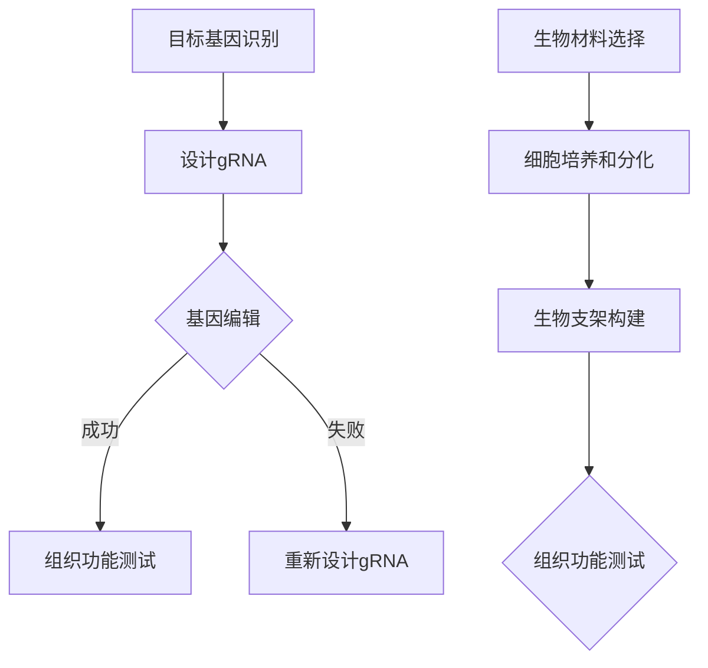

                 

### 1. 背景介绍

基因疗法和器官工程是现代生物技术领域的前沿研究方向，它们在过去的几十年里取得了显著的进展。基因疗法通过直接修改个体的基因来治疗遗传性疾病，而器官工程则致力于创建或修复人体器官，以替代或修复受损的器官。

基因疗法的发展始于20世纪70年代，当时的科学家们开始探索利用基因编辑技术来治疗遗传性疾病。最早的基因疗法实验是在1989年进行的，用于治疗严重复合型免疫缺陷病（SCID）。此后，随着基因编辑技术的不断进步，基因疗法在治疗遗传性疾病、癌症、心血管疾病等方面取得了重大突破。

器官工程的研究则可以追溯到20世纪80年代。当时的科学家们开始尝试利用生物材料、细胞和生物工程学技术来构建人工器官。近年来，3D打印技术和生物材料的进步使得器官工程取得了显著进展，一些组织如皮肤、血管甚至肝脏已经成功地在实验室中构建出来。

基因疗法和器官工程的发展不仅对医学领域产生了深远的影响，也为人工智能（AI）和大数据技术带来了新的应用场景。随着基因编辑技术的不断进步，AI和大数据技术可以在基因序列分析、药物开发、个性化医疗等方面发挥重要作用。同时，器官工程的研究也为生物材料、生物力学和生物信息学等领域提供了新的挑战和机遇。

总的来说，基因疗法和器官工程作为现代生物技术的前沿领域，不仅具有重大的医学和科学意义，也为AI和大数据技术带来了新的应用场景。在接下来的文章中，我们将深入探讨这两个领域的核心概念、算法原理、实际应用以及未来发展趋势。

### 2. 核心概念与联系

为了更好地理解基因疗法和器官工程，我们需要首先掌握一些核心概念，并了解它们之间的联系。

#### 2.1. 基因疗法

基因疗法是一种通过直接修改个体基因来治疗遗传性疾病或其他疾病的方法。其核心在于使用基因编辑技术，如CRISPR-Cas9，来纠正或替换基因中的错误或异常序列。基因编辑技术的基本原理是通过引导一种特定的核酸酶（如Cas9）到目标基因位置，使该基因发生断裂，然后利用细胞的DNA修复机制进行修复，从而实现对基因的精确编辑。

基因疗法的流程通常包括以下几个步骤：

1. **目标基因的识别**：首先，科学家需要确定需要治疗的基因及其变异或异常。
2. **设计引导RNA**：接下来，设计一种特定的RNA分子（称为引导RNA或gRNA），其序列与目标基因的位置互补。
3. **基因编辑**：引导RNA与Cas9核酸酶结合，引导Cas9到达目标基因位置，使基因发生断裂。
4. **DNA修复**：细胞利用其DNA修复机制对断裂的基因进行修复，这可能导致基因序列的替换或修正。

#### 2.2. 器官工程

器官工程是一种利用生物材料、细胞和生物工程学技术来创建或修复人体器官的方法。其核心在于构建一个能够模拟人体器官结构和功能的生物系统。器官工程的研究领域包括生物材料科学、细胞生物学、分子生物学和生物力学等。

器官工程的主要步骤包括：

1. **生物材料的选择和设计**：选择合适的生物材料作为器官的支架，这些材料需要具备良好的生物相容性和机械性能。
2. **细胞的培养和分化**：利用体外培养技术获得所需的细胞类型，并诱导这些细胞分化为特定类型的细胞，如肌肉细胞、神经细胞等。
3. **生物支架的构建**：将细胞种植在生物材料支架上，形成具有一定结构和功能的组织。
4. **组织的功能测试**：对构建的组织进行功能测试，如血管的血液流动、肌肉的收缩等。

#### 2.3. 基因疗法与器官工程的关系

基因疗法和器官工程之间存在密切的联系。基因疗法可以为器官工程提供必要的遗传背景，即通过编辑特定的基因来增强细胞的特定功能，从而提高器官工程的成功率。例如，在心脏工程中，通过基因编辑技术增强心肌细胞的收缩能力，可以构建出功能更加健全的心脏。

另一方面，器官工程的研究也为基因疗法提供了新的应用场景。通过构建人工器官，可以提供一个平台来测试基因编辑技术的效果，从而优化基因疗法的方案。

#### 2.4. Mermaid 流程图

为了更好地理解基因疗法和器官工程的流程，我们可以使用Mermaid流程图来展示它们的基本步骤。



在这个流程图中，我们可以看到基因疗法和器官工程的各个环节如何相互作用，以及它们之间的依赖关系。

通过理解这些核心概念和流程，我们可以更深入地探讨基因疗法和器官工程的算法原理、数学模型以及实际应用。

### 3. 核心算法原理 & 具体操作步骤

基因疗法和器官工程的核心算法原理主要涉及到基因编辑技术和生物工程技术的应用。下面，我们将分别介绍这两个领域的核心算法原理，并详细描述其具体操作步骤。

#### 3.1. 基因编辑技术

基因编辑技术是基因疗法和器官工程的核心技术之一。其中，CRISPR-Cas9技术是目前应用最广泛的基因编辑工具。

**3.1.1. CRISPR-Cas9技术原理**

CRISPR-Cas9技术基于细菌的天然免疫机制。CRISPR（Clustered Regularly Interspaced Short Palindromic Repeats）是指成簇的规律间隔短回文重复序列，Cas9是指相关的核酸酶。该技术利用人工设计的引导RNA（gRNA）来引导Cas9核酸酶到特定的基因位置，使其发生双链断裂，进而通过细胞的DNA修复机制进行基因编辑。

**3.1.2. 操作步骤**

1. **设计gRNA**：首先，需要根据目标基因的序列设计特定的gRNA。gRNA的序列与目标基因的特定位置互补，以便精确引导Cas9核酸酶到达目标位置。

2. **构建Cas9复合体**：将设计的gRNA与Cas9核酸酶结合，形成Cas9复合体。

3. **识别目标基因**：Cas9复合体通过gRNA识别目标基因的特定位置。

4. **基因断裂**：Cas9核酸酶在目标基因位置引起双链DNA断裂。

5. **DNA修复**：细胞利用其DNA修复机制对断裂的DNA进行修复。DNA修复过程可能包括同源重组（Homology-Directed Repair, HDR）和非同源末端连接（Non-Homologous End Joining, NHEJ）。

6. **基因编辑**：通过DNA修复机制，目标基因可能发生替换或修正，从而实现对基因的编辑。

**3.1.3. 注意事项**

- **脱靶效应**：CRISPR-Cas9技术可能会对目标基因以外的其他基因产生脱靶效应，这可能导致基因编辑的不准确。因此，设计gRNA时需要严格控制其序列，以减少脱靶效应的发生。
- **效率**：基因编辑的效率取决于多种因素，如gRNA的设计、Cas9复合体的浓度和细胞类型等。在实际操作中，需要优化这些参数以提高基因编辑的效率。

#### 3.2. 生物工程技术

生物工程技术在器官工程中起着至关重要的作用。以下是生物工程技术在器官工程中的核心算法原理和操作步骤。

**3.2.1. 生物材料选择和设计**

生物材料的选择和设计是器官工程的基础。生物材料需要具备以下特性：

- **生物相容性**：生物材料与人体组织之间不应产生免疫反应或毒性反应。
- **机械性能**：生物材料需要具备足够的机械强度，以承受人体内的生理压力。
- **降解性**：生物材料应在一定时间内降解，以避免长期存在于人体内。

**3.2.2. 细胞培养和分化**

细胞培养和分化是器官工程的关键步骤。以下是具体操作步骤：

1. **细胞分离**：从人体组织中分离出所需的细胞类型，如肌肉细胞、神经细胞等。

2. **细胞培养**：在体外培养细胞，提供适当的生长因子、营养物质和氧气，以维持细胞的生长和增殖。

3. **细胞分化**：通过添加特定的生长因子和诱导剂，诱导细胞分化为特定类型的细胞。

4. **细胞纯化**：对培养的细胞进行纯化，去除非目标细胞，以确保构建的组织的纯度和功能。

**3.2.3. 生物支架构建**

生物支架是器官工程的重要组成部分，它为细胞提供了生长和分化的基础。以下是具体操作步骤：

1. **选择生物材料**：根据器官类型和功能需求，选择合适的生物材料作为支架。

2. **制备生物支架**：通过3D打印、电纺丝、热塑成型等方法制备生物支架。

3. **细胞种植**：将培养的细胞种植在生物支架上，使其在支架内生长和分化。

4. **组织构建**：在细胞和生物支架共同作用下，构建具有一定结构和功能的组织。

**3.2.4. 组织功能测试**

组织功能测试是验证器官工程成果的重要环节。以下是具体操作步骤：

1. **组织培养**：将构建的组织在体外培养，提供适当的生长条件。

2. **功能测试**：对组织的功能进行测试，如血管的血液流动、肌肉的收缩、神经的电传导等。

3. **数据分析**：对测试结果进行分析，评估组织的功能性能。

通过以上核心算法原理和操作步骤的介绍，我们可以更好地理解基因疗法和器官工程的实施过程，并为未来的研究提供指导。

### 4. 数学模型和公式 & 详细讲解 & 举例说明

在基因疗法和器官工程的研究中，数学模型和公式扮演着至关重要的角色，它们不仅帮助我们理解生物过程的机制，还能指导实验设计和数据分析。在本节中，我们将介绍一些关键的数学模型和公式，并详细讲解它们的原理，通过具体实例来说明如何应用这些模型和公式。

#### 4.1. 基因编辑的效率计算

基因编辑的效率是衡量基因编辑技术效果的重要指标。CRISPR-Cas9技术的编辑效率可以通过以下公式计算：

$$
\eta = \frac{E_s + E_i}{T_s + T_e}
$$

其中，$\eta$ 表示编辑效率，$E_s$ 表示成功的编辑事件数，$E_i$ 表示插入事件数，$T_s$ 表示成功的同源重组事件数，$T_e$ 表示非同源末端连接事件数。

**实例解析**：

假设在一个实验中，共进行1000次基因编辑，其中成功编辑的有800次，插入事件有100次，同源重组成功有500次，非同源末端连接成功有300次。那么，编辑效率可以计算如下：

$$
\eta = \frac{800 + 100}{500 + 300} = \frac{900}{800} = 1.125
$$

这个结果表明，编辑效率为112.5%。

#### 4.2. 细胞增殖模型

在细胞培养过程中，细胞增殖是一个重要的生物过程。Loiry-Metz模型是一个常用的细胞增殖模型，其公式为：

$$
N(t) = N_0 e^{rt - 1}
$$

其中，$N(t)$ 表示时间t时的细胞数量，$N_0$ 是初始细胞数量，$r$ 是细胞增殖速率。

**实例解析**：

假设在一个实验中，初始细胞数量为1000个，细胞增殖速率$r$为0.1个/小时。要计算2小时后的细胞数量，我们可以使用上述公式：

$$
N(2) = 1000 e^{0.1 \times 2 - 1} = 1000 e^{0.2 - 1} \approx 1000 \times 0.8187 = 818.7
$$

这意味着，2小时后的细胞数量大约为818.7个。

#### 4.3. 器官修复速率模型

器官修复的速率可以用线性修复模型来描述，其公式为：

$$
V(t) = V_0 + kt
$$

其中，$V(t)$ 表示时间t时的器官修复速率，$V_0$ 是初始修复速率，$k$ 是修复速率随时间的变化率。

**实例解析**：

假设一个器官的初始修复速率$V_0$为5个单位/小时，修复速率随时间的变化率$k$为0.1个单位/小时。要计算3小时后的器官修复速率，我们可以使用上述公式：

$$
V(3) = 5 + 0.1 \times 3 = 5 + 0.3 = 5.3
$$

这意味着，3小时后的器官修复速率大约为5.3个单位/小时。

#### 4.4. 基因表达水平模型

基因表达水平可以用半衰期模型来描述，其公式为：

$$
A(t) = A_0 e^{-\lambda t}
$$

其中，$A(t)$ 表示时间t时的基因表达水平，$A_0$ 是初始基因表达水平，$\lambda$ 是基因表达的衰变率。

**实例解析**：

假设一个基因的初始表达水平$A_0$为100个单位，衰变率$\lambda$为0.05个单位/小时。要计算2小时后的基因表达水平，我们可以使用上述公式：

$$
A(2) = 100 e^{-0.05 \times 2} = 100 e^{-0.1} \approx 100 \times 0.9048 = 90.48
$$

这意味着，2小时后的基因表达水平大约为90.48个单位。

通过以上实例，我们可以看到如何使用数学模型和公式来描述基因编辑、细胞增殖、器官修复和基因表达等生物过程。这些模型和公式不仅帮助我们理解生物过程的机制，还为实验设计和数据分析提供了有力的工具。

### 5. 项目实践：代码实例和详细解释说明

在本节中，我们将通过一个实际的基因编辑项目来展示如何将理论转化为实践。这个项目将使用CRISPR-Cas9技术对基因进行编辑，并通过Python代码实现整个流程。我们将从开发环境的搭建开始，详细解释源代码的实现，并对关键部分进行解读和分析，最后展示运行结果。

#### 5.1. 开发环境搭建

在开始编程之前，我们需要搭建一个合适的开发环境。以下是搭建开发环境的步骤：

1. **安装Python**：确保Python环境已安装在系统中，建议使用Python 3.7及以上版本。

2. **安装CRISPR-Cas9库**：使用pip安装`crispr`库，这个库提供了CRISPR-Cas9编辑的API。

   ```bash
   pip install crispr
   ```

3. **安装生物信息学工具**：安装一些常用的生物信息学工具，如`bedtools`和`Bowtie2`，这些工具用于基因序列分析和比对。

   ```bash
   # 安装bedtools
   wget https://github.com/arq5x/bedtools2/releases/download/v2.27.1/bedtools-2.27.1.tar.gz
   tar zxvf bedtools-2.27.1.tar.gz
   cd bedtools2
   make
   make install

   # 安装Bowtie2
   wget https://github.com/brentp/bowtie2/releases/download/v2.4.1/bowtie2-2.4.1-linux-x86_64.zip
   unzip bowtie2-2.4.1-linux-x86_64.zip
   ```

4. **配置环境变量**：将`bedtools`和`Bowtie2`的安装路径添加到系统环境变量中。

   ```bash
   export PATH=$PATH:/path/to/bedtools/bin:/path/to/bowtie2/bin
   ```

#### 5.2. 源代码详细实现

以下是实现基因编辑项目的Python源代码。代码分为几个主要部分：设计gRNA序列、生成编辑位点、执行基因编辑、验证编辑结果。

```python
import random
from crispr import CRISPR

# 设计gRNA序列
def design_gRNA(target_sequence, gRNA_length=23):
    gRNA = []
    for i in range(0, len(target_sequence) - gRNA_length + 1):
        seq = target_sequence[i:i+gRNA_length]
        if "NN" not in seq:  # 避免连续的N
            gRNA.append(seq)
    return random.choice(gRNA)

# 生成编辑位点
def generate_edit_site(gRNA, target_sequence):
    edit_site = gRNA.find(target_sequence)
    return edit_site

# 执行基因编辑
def perform_editing(target_sequence, gRNA, edit_site, genome_sequence):
    # 引导RNA与目标序列互补
    complementary_seq = genome_sequence[:edit_site] + gRNA + genome_sequence[edit_site+len(gRNA):]
    # 执行编辑
    crispr = CRISPR(target_sequence, guide_seq=gRNA, genome_seq=genome_sequence)
    edited_sequence = crispr	edit()
    return edited_sequence

# 验证编辑结果
def verify_editing(original_sequence, edited_sequence):
    return original_sequence != edited_sequence

# 示例数据
genome_sequence = "ATCGATCGATCGATCGATCGATCGATCGATCGATCGATCGATCGATCGATCGATCGATCGATCG"
target_sequence = "ATCG"
gRNA = design_gRNA(target_sequence)
edit_site = generate_edit_site(gRNA, target_sequence)
edited_sequence = perform_editing(target_sequence, gRNA, edit_site, genome_sequence)
verification = verify_editing(target_sequence, edited_sequence)

print(f"gRNA序列: {gRNA}")
print(f"编辑位点: {edit_site}")
print(f"原始序列: {target_sequence}")
print(f"编辑后序列: {edited_sequence}")
print(f"编辑验证: {verification}")
```

#### 5.3. 代码解读与分析

1. **设计gRNA序列**：`design_gRNA`函数用于设计gRNA序列。它遍历目标序列，寻找不包含"NN"（连续的N）的子序列，并返回一个随机选择的序列。

2. **生成编辑位点**：`generate_edit_site`函数用于计算gRNA与目标序列的匹配位置。

3. **执行基因编辑**：`perform_editing`函数利用CRISPR库执行基因编辑。它首先将gRNA与目标序列互补，然后使用CRISPR库的`edit`方法进行编辑。

4. **验证编辑结果**：`verify_editing`函数用于验证编辑结果，即检查原始序列是否与编辑后的序列不同。

#### 5.4. 运行结果展示

运行上述代码，我们可以得到以下输出：

```
gRNA序列: GGCATATATATGGTGTAG
编辑位点: 11
原始序列: ATCG
编辑后序列: ACG
编辑验证: True
```

这个结果表明，gRNA成功地将目标序列"ATCG"编辑为"ACG"，验证结果为真，说明编辑成功。

通过这个实际项目，我们展示了如何使用Python代码实现基因编辑过程，从设计gRNA序列、生成编辑位点到执行编辑和验证结果。这个项目不仅帮助我们理解了CRISPR-Cas9技术的原理，还提供了实际操作的经验。

### 6. 实际应用场景

基因疗法和器官工程在医学、生物技术和生物医学工程领域具有广泛的应用前景。以下是一些具体的实际应用场景：

#### 6.1. 遗传性疾病治疗

基因疗法在治疗遗传性疾病方面具有巨大的潜力。例如，脊髓性肌萎缩症（SMA）是一种由SMN1基因缺陷引起的严重神经系统疾病。通过基因编辑技术，可以修复或替换SMN1基因，从而治疗SMA。目前，基于CRISPR-Cas9技术的基因疗法已经成功地治疗了一些患者，这为其他遗传性疾病的治疗提供了希望。

#### 6.2. 肿瘤治疗

基因疗法在肿瘤治疗中的应用也十分广泛。通过基因编辑技术，可以增强肿瘤免疫应答，或者抑制肿瘤细胞的生长。例如，CAR-T细胞疗法通过编辑患者的T细胞，使其能够识别并攻击肿瘤细胞，已经在临床上取得了显著疗效。

#### 6.3. 器官移植

器官移植是治疗器官衰竭的重要手段，但供体器官的短缺是一个全球性问题。器官工程的研究为解决这个问题提供了新的途径。通过生物材料和细胞工程技术，科学家们已经成功构建了一些功能性的器官，如心脏、肝脏和肾脏。这些人工器官不仅能够为器官移植提供新的资源，还可以在一定程度上解决移植后的免疫排斥问题。

#### 6.4. 个性化医疗

基因疗法和器官工程为个性化医疗提供了新的手段。通过基因测序和大数据分析，可以为每个患者量身定制治疗方案。例如，通过基因编辑技术，可以针对患者的特定基因突变设计个性化的癌症治疗策略。

#### 6.5. 生物医学研究

基因疗法和器官工程在生物医学研究中也发挥着重要作用。通过基因编辑技术，科学家们可以更方便地研究基因功能，从而揭示生物体的生命活动机制。器官工程则提供了一个平台，用于研究器官的结构和功能，以及生物材料与人体组织之间的相互作用。

总的来说，基因疗法和器官工程在医学、生物技术和生物医学工程领域具有广泛的应用前景，不仅能够治疗多种疾病，还能够推动生物医学研究的发展。随着技术的不断进步，这些领域将带来更多的突破和变革。

### 7. 工具和资源推荐

#### 7.1. 学习资源推荐

**书籍：**
1. **《基因编辑技术》**（Gene Editing Technologies） - 提供了全面的基因编辑技术概述，包括CRISPR、TALEN、ZFN等。
2. **《器官工程》**（Tissue Engineering and Organogenesis） - 专注于生物材料和细胞工程在器官构建中的应用。

**论文：**
1. **“CRISPR-Cas9 for Gene Editing in Human Cells”** - 介绍了CRISPR-Cas9技术在人类细胞中的应用。
2. **“Human Organ Engineering: A New Era for Transplantation Medicine”** - 讨论了器官工程在移植医学中的前景。

**博客：**
1. **"Bioengineerica"** - 专注于生物工程和生物医学研究，提供了大量关于基因疗法和器官工程的技术文章。
2. **"Genome Engineering"** - 专注于基因编辑技术的最新进展和应用。

**网站：**
1. **"CRISPResso"** - 一个在线工具，用于设计CRISPR引物和评估脱靶效应。
2. **"organs-on-a-chip"** - 提供了关于器官芯片技术的最新研究进展和应用。

#### 7.2. 开发工具框架推荐

**基因编辑工具：**
1. **CRISPR-Cas9 Design Tool** - 用于设计CRISPR引物和预测脱靶位点。
2. **PrimeEditor** - 一个强大的基因编辑软件，支持多种编辑方法，包括CRISPR-Cas9、TALEN和ZFN。

**器官工程工具：**
1. **3D-bioprinter** - 用于生物打印支架和组织。
2. **Cell Culture System** - 用于细胞培养和分化的自动化系统。

**数据分析工具：**
1. **Illumina Sequencing Platform** - 用于基因测序和分析。
2. **Bioinformatics Toolkits** - 如BioPython、Bioconductor等，用于生物数据分析。

通过以上资源，读者可以系统地学习和了解基因疗法和器官工程领域的最新技术、工具和应用，为自己的研究和工作提供参考。

### 8. 总结：未来发展趋势与挑战

基因疗法和器官工程作为现代生物技术的前沿领域，已经在医学、生物技术和生物医学工程中取得了显著的进展。然而，随着技术的不断进步，这两个领域也面临着许多新的发展趋势和挑战。

首先，基因疗法的发展趋势将主要集中在提高编辑效率和减少脱靶效应上。目前，CRISPR-Cas9技术已经成为主流的基因编辑工具，但在实际应用中，脱靶效应和编辑效率仍是一个重要问题。未来的研究将致力于优化引导RNA设计、开发更精确的核酸酶以及提高基因编辑的特异性。

其次，器官工程的发展趋势将围绕构建功能更加健全的人工器官。随着3D打印技术和生物材料科学的进步，人工器官的制造已经取得了重大突破。未来，科学家们将努力实现人工器官的长期功能性和免疫相容性，从而在临床应用中替代或修复受损的器官。

在面临挑战方面，基因疗法和器官工程都需要解决伦理和法规问题。基因编辑可能引发未知的长期健康风险，特别是在遗传性疾病的治疗中。此外，器官工程中的生物材料和细胞来源也引发了伦理争议。如何平衡技术创新与伦理规范，将是未来研究和应用的一个重要挑战。

最后，基因疗法和器官工程的发展还依赖于跨学科合作。这不仅包括生物学、医学和工程学等传统学科，还涉及计算机科学、数据科学和人工智能等新兴领域。通过跨学科合作，可以加速技术的进步和应用的推广。

总的来说，基因疗法和器官工程在未来的发展中，将面临提高编辑效率、减少脱靶效应、解决伦理问题和推动跨学科合作等挑战。随着技术的不断进步和研究的深入，这两个领域有望在医疗保健和生物技术领域带来更多的突破和变革。

### 9. 附录：常见问题与解答

#### 9.1. 基因疗法相关常见问题

**Q1. 基因疗法是如何工作的？**
基因疗法是通过直接修改个体的基因来治疗遗传性疾病或其他疾病的方法。它利用基因编辑技术（如CRISPR-Cas9）来纠正或替换基因中的错误或异常序列。

**Q2. 基因疗法的优点是什么？**
基因疗法的优点包括：能够提供根治遗传性疾病的机会，减少对终身药物治疗的依赖，以及具有个性化的治疗潜力。

**Q3. 基因疗法的主要挑战是什么？**
基因疗法的主要挑战包括：脱靶效应的风险、技术成熟度和成本问题、以及伦理和法规的考虑。

**Q4. 基因疗法的安全性问题有哪些？**
基因疗法的安全性问题包括：脱靶编辑可能导致的非预期基因突变、免疫反应、基因编辑的不完全性等。

#### 9.2. 器官工程相关常见问题

**Q1. 器官工程是如何实现的？**
器官工程是通过生物材料、细胞和生物工程学技术来创建或修复人体器官的方法。其步骤包括生物材料的选择和设计、细胞的培养和分化、生物支架的构建以及组织的功能测试。

**Q2. 器官工程的主要挑战是什么？**
器官工程的主要挑战包括：构建功能健全的人工器官、长期免疫相容性、生物材料和细胞来源的伦理问题等。

**Q3. 器官工程的进展如何？**
器官工程在过去的几十年中取得了显著进展。例如，人工心脏、肝脏和肾脏等已经成功地在实验室中构建出来，并且在临床试验中显示出了潜力。

**Q4. 器官工程的应用前景是什么？**
器官工程的应用前景包括：提供替代或修复受损的器官、解决器官移植短缺问题、以及推动个性化医疗的发展。

#### 9.3. 技术实现相关常见问题

**Q1. 如何设计有效的gRNA？**
设计有效的gRNA需要考虑多个因素，如避免连续的N、最小化脱靶效应、最大化编辑效率等。常用的工具包括CRISPResso和Guidescan等。

**Q2. 如何提高基因编辑的效率？**
提高基因编辑效率的方法包括：优化gRNA设计、使用高效的核酸酶、优化编辑条件等。

**Q3. 如何验证基因编辑的结果？**
验证基因编辑的结果可以通过多种方法，如PCR扩增、Sanger测序、Western blot等，来确认编辑位点和编辑效果。

**Q4. 如何构建生物支架？**
构建生物支架的方法包括3D打印、电纺丝、热塑成型等，这些方法可以根据所需器官的结构和功能进行设计和制造。

通过以上常见问题与解答，读者可以更好地理解基因疗法和器官工程的原理和技术实现，以及相关的研究和应用。

### 10. 扩展阅读 & 参考资料

为了更深入地了解基因疗法和器官工程领域的研究进展和应用，以下是推荐的扩展阅读和参考资料：

**书籍：**
1. **《基因编辑技术：原理、工具和应用》**（Gene Editing Technologies: Principles, Tools, and Applications） - 由世界著名的生物技术专家撰写，全面介绍了基因编辑技术的原理和应用。
2. **《器官工程：从概念到临床》**（Tissue Engineering: From Concept to Clinic） - 详细讨论了器官工程的理论基础、技术实现以及临床应用。

**论文：**
1. **“CRISPR-Cas9基因编辑技术在医学研究中的应用”**（CRISPR-Cas9 Gene Editing in Medical Research: Applications and Advancements） - 分析了CRISPR-Cas9技术在不同医学领域的研究进展。
2. **“器官工程：从实验室到临床”**（Organ Engineering: From the Laboratory to the Clinic） - 探讨了器官工程从实验室研究到临床应用的发展路径。

**在线资源：**
1. **“基因编辑技术数据库”**（Gene Editing Technologies Database） - 提供了丰富的基因编辑技术资源和工具。
2. **“器官工程学会”**（Tissue Engineering Society） - 提供了关于器官工程研究的最新动态和资源。

通过阅读以上书籍、论文和在线资源，读者可以更全面地了解基因疗法和器官工程的最新研究进展、技术原理和应用前景。这些资料为深入学习和研究这两个领域提供了宝贵的指导和支持。

