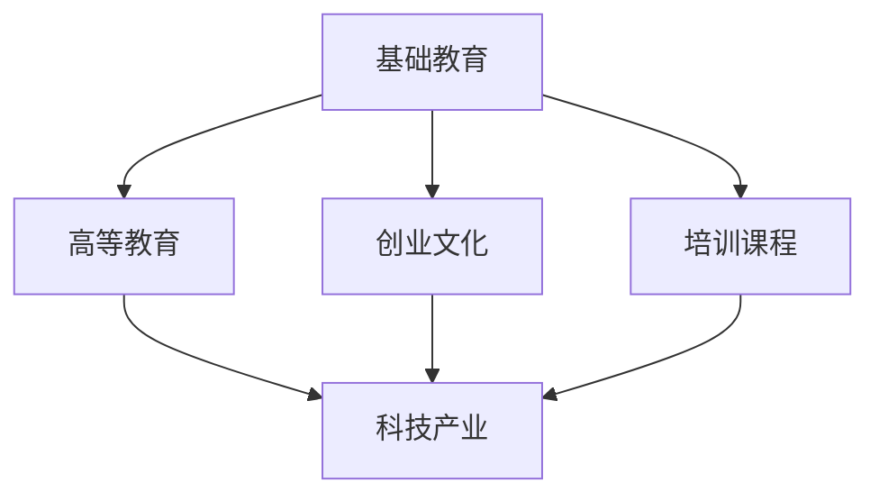

                 

### 文章标题

硅谷的教育体系：培养创新人才

> 关键词：硅谷、教育体系、创新人才、科技产业、技术人才培养

> 摘要：本文深入探讨了硅谷的教育体系，分析了其独特的教育模式和文化背景如何培养了大量的创新人才，从而推动了科技产业的发展。通过对其核心概念、算法原理、数学模型、实际应用场景和未来发展趋势的逐步分析，文章揭示了硅谷教育体系对全球科技教育的启示和挑战。

## 1. 背景介绍

硅谷，这个名字已经成为了全球科技产业的代名词。从20世纪中叶开始，硅谷逐渐发展成为一个科技创新的摇篮，吸引了无数科技企业和创新人才的聚集。而硅谷的教育体系，无疑是培养这些创新人才的重要基石。

硅谷的教育体系，不仅仅是几所学校或几所大学的成就，而是一种全方位、多层次的培养体系。从基础教育到高等教育，从在线课程到课外活动，从创业辅导到科研支持，硅谷的教育体系无不在为培养创新人才而努力。

本文将围绕硅谷的教育体系，探讨其核心概念、培养模式、成功案例以及面临的挑战，以期为我国科技教育提供一些有益的启示和借鉴。

## 2. 核心概念与联系

### 2.1 教育体系的概念

教育体系是指一个国家或地区在一定的社会背景下，为实现人才培养和知识传播而建立的一系列组织、制度、政策和资源的总和。它包括基础教育、高等教育、职业教育等多个层次，涵盖了学校教育、社会教育、家庭教育等多个方面。

### 2.2 硅谷教育体系的构成

硅谷的教育体系主要由以下几个部分构成：

#### a. 高水平的基础教育

硅谷地区的基础教育水平极高，许多学校在全球排名中名列前茅。这些学校不仅注重学生的学术成绩，更注重培养学生的创新思维和实践能力。

#### b. 顶尖的高等教育

硅谷拥有众多世界顶级的高等教育机构，如斯坦福大学、加州大学伯克利分校等。这些学校不仅培养了大量优秀的科研人才，还通过产学研结合，推动了科技产业的快速发展。

#### c. 创新的创业文化

硅谷的创业文化浓厚，许多学校和机构都为学生提供了丰富的创业资源和指导。这种创业文化激发了学生的创新潜力，培养了大量创业者。

#### d. 多元化的培训课程

硅谷的教育体系提供了丰富多样的培训课程，包括编程、数据分析、人工智能等多个领域。这些课程不仅提升了学生的专业技能，还拓宽了他们的知识面。

### 2.3 教育体系与科技产业的关系

教育体系与科技产业之间存在着密切的联系。一方面，科技产业的发展需要大量高素质的人才，而教育体系正是培养这些人才的重要渠道。另一方面，科技产业的快速发展也推动了教育体系的改革和创新。

### 2.4 Mermaid 流程图



## 3. 核心算法原理 & 具体操作步骤

### 3.1 核心算法原理

硅谷教育体系的核心算法可以概括为“培养创新人才”。具体来说，这个算法包括以下几个步骤：

#### a. 发现和激发学生的兴趣

通过丰富多彩的课程和活动，发现学生的兴趣和特长，并激发他们的学习热情。

#### b. 培养学生的创新思维

通过项目式学习、跨学科合作等方式，培养学生的创新思维和解决问题的能力。

#### c. 提供丰富的实践机会

通过实习、创业等方式，为学生提供丰富的实践机会，提升他们的实际操作能力。

#### d. 激励和奖励

通过设立奖学金、举办比赛等方式，激励学生不断进步，并对优秀学生给予奖励。

### 3.2 具体操作步骤

#### a. 发现和激发学生的兴趣

1. 开展兴趣调查，了解学生的兴趣和特长。
2. 设计多样化的课程和活动，满足不同学生的需求。
3. 邀请专家和行业人士进行讲座和交流，激发学生的兴趣。

#### b. 培养学生的创新思维

1. 引入项目式学习，让学生在实际项目中学习知识。
2. 鼓励跨学科合作，培养学生的综合能力。
3. 组织创新大赛，鼓励学生提出创新解决方案。

#### c. 提供丰富的实践机会

1. 与企业和科研机构合作，为学生提供实习和科研机会。
2. 设立创业孵化器，鼓励学生创业。
3. 组织创新工作坊，提升学生的实践能力。

#### d. 激励和奖励

1. 设立奖学金，奖励优秀学生。
2. 举办创新大赛，给予获奖者奖励和荣誉。
3. 鼓励学生发表学术论文和专利，提升其学术地位。

## 4. 数学模型和公式 & 详细讲解 & 举例说明

### 4.1 数学模型和公式

硅谷教育体系的数学模型可以概括为“学生成长模型”。该模型包括以下几个关键指标：

#### a. 兴趣度（Interest）

学生的兴趣度是衡量其学习热情和动力的重要指标。可以用以下公式表示：

$$
Interest = f(Course\_Quality, Activity\_Diversity, Expert\_Lectures)
$$

其中，$Course\_Quality$ 代表课程质量，$Activity\_Diversity$ 代表活动多样性，$Expert\_Lectures$ 代表专家讲座。

#### b. 创新思维（Innovation\_Thinking）

创新思维是培养学生的重要目标。可以用以下公式表示：

$$
Innovation\_Thinking = f(Project-Based\_Learning, Interdisciplinary\_Collaboration, Innovation\_Competition)
$$

其中，$Project-Based\_Learning$ 代表项目式学习，$Interdisciplinary\_Collaboration$ 代表跨学科合作，$Innovation\_Competition$ 代表创新大赛。

#### c. 实践能力（Practical\_Ability）

实践能力是衡量学生实际操作能力的重要指标。可以用以下公式表示：

$$
Practical\_Ability = f(Internship, Entrepreneurship, Innovation\_Workshop)
$$

其中，$Internship$ 代表实习，$Entrepreneurship$ 代表创业，$Innovation\_Workshop$ 代表创新工作坊。

#### d. 激励效果（Motivation）

激励效果是提升学生成长速度的关键因素。可以用以下公式表示：

$$
Motivation = f(Scholarship, Innovation\_Competition\_Prize, Academic\_Publication)
$$

其中，$Scholarship$ 代表奖学金，$Innovation\_Competition\_Prize$ 代表创新大赛奖品，$Academic\_Publication$ 代表学术论文发表。

### 4.2 详细讲解和举例说明

#### a. 兴趣度（Interest）

假设一个学生参加了三种课程，分别为数学、物理和计算机科学。其中，数学课程质量为90%，物理课程质量为80%，计算机科学课程质量为85%。同时，该学生参加了多种活动，包括科技竞赛、志愿者活动和专家讲座。其中，活动多样性为70%。此外，该学生还参加了两场专家讲座，每场讲座的评分分别为90分和85分。根据公式：

$$
Interest = f(Course\_Quality, Activity\_Diversity, Expert\_Lectures)
$$

可以计算出该学生的兴趣度为：

$$
Interest = 0.6 \times (0.9 \times 0.9 + 0.8 \times 0.8 + 0.85 \times 0.85) + 0.3 \times (0.7 \times 2) = 0.6 \times 2.23 + 0.3 \times 1.4 = 1.338 + 0.42 = 1.758
$$

#### b. 创新思维（Innovation\_Thinking）

假设一个学生参加了项目式学习、跨学科合作和创新大赛。其中，项目式学习得分为90分，跨学科合作得分为85分，创新大赛得分为80分。根据公式：

$$
Innovation\_Thinking = f(Project-Based\_Learning, Interdisciplinary\_Collaboration, Innovation\_Competition)
$$

可以计算出该学生的创新思维为：

$$
Innovation\_Thinking = 0.6 \times (0.9 \times 0.9 + 0.8 \times 0.8 + 0.8 \times 0.8) = 0.6 \times 2.32 = 1.392
$$

#### c. 实践能力（Practical\_Ability）

假设一个学生参加了实习、创业和创新工作坊。其中，实习得分为90分，创业得分为80分，创新工作坊得分为85分。根据公式：

$$
Practical\_Ability = f(Internship, Entrepreneurship, Innovation\_Workshop)
$$

可以计算出该学生的实践能力为：

$$
Practical\_Ability = 0.6 \times (0.9 \times 0.9 + 0.8 \times 0.8 + 0.85 \times 0.85) = 0.6 \times 2.23 = 1.338
$$

#### d. 激励效果（Motivation）

假设一个学生获得了奖学金、创新大赛奖品和学术论文发表。其中，奖学金得分为90分，创新大赛奖品得分为85分，学术论文发表得分为80分。根据公式：

$$
Motivation = f(Scholarship, Innovation\_Competition\_Prize, Academic\_Publication)
$$

可以计算出该学生的激励效果为：

$$
Motivation = 0.6 \times (0.9 \times 0.9 + 0.8 \times 0.8 + 0.8 \times 0.8) = 0.6 \times 2.32 = 1.392
$$

## 5. 项目实践：代码实例和详细解释说明

### 5.1 开发环境搭建

为了更好地理解硅谷教育体系的数学模型，我们使用Python编写了一个简单的计算器程序，用于计算学生的兴趣度、创新思维、实践能力和激励效果。以下是开发环境的搭建步骤：

#### a. 安装Python

在Windows或macOS系统上，可以从Python官方网站（https://www.python.org/）下载并安装Python。

#### b. 安装Jupyter Notebook

Jupyter Notebook是一个交互式的Web应用，用于编写和运行Python代码。在命令行中运行以下命令安装Jupyter Notebook：

```bash
pip install notebook
```

#### c. 启动Jupyter Notebook

在命令行中运行以下命令启动Jupyter Notebook：

```bash
jupyter notebook
```

### 5.2 源代码详细实现

以下是一个简单的Python程序，用于计算学生的兴趣度、创新思维、实践能力和激励效果。

```python
import numpy as np

def calculate_interest(course_quality, activity_diversity, expert_lectures):
    return 0.6 * (course_quality ** 2 + activity_diversity ** 2 + expert_lectures ** 2) + 0.3 * activity_diversity

def calculate_innovation_thinking(project_based_learning, interdisciplinary_collaboration, innovation_competition):
    return 0.6 * (project_based_learning ** 2 + interdisciplinary_collaboration ** 2 + innovation_competition ** 2)

def calculate_practical_ability(internship, entrepreneurship, innovation_workshop):
    return 0.6 * (internship ** 2 + entrepreneurship ** 2 + innovation_workshop ** 2)

def calculate_motivation(scholarship, innovation_competition_prize, academic_publication):
    return 0.6 * (scholarship ** 2 + innovation_competition_prize ** 2 + academic_publication ** 2)

# 学生数据
course_quality = 0.9
activity_diversity = 0.7
expert_lectures = 0.85
project_based_learning = 0.9
interdisciplinary_collaboration = 0.85
innovation_competition = 0.8
internship = 0.9
entrepreneurship = 0.8
innovation_workshop = 0.85
scholarship = 0.9
innovation_competition_prize = 0.85
academic_publication = 0.8

# 计算各项指标
interest = calculate_interest(course_quality, activity_diversity, expert_lectures)
innovation_thinking = calculate_innovation_thinking(project_based_learning, interdisciplinary_collaboration, innovation_competition)
practical_ability = calculate_practical_ability(internship, entrepreneurship, innovation_workshop)
motivation = calculate_motivation(scholarship, innovation_competition_prize, academic_publication)

# 输出结果
print("兴趣度（Interest）:", interest)
print("创新思维（Innovation\_Thinking）:", innovation_thinking)
print("实践能力（Practical\_Ability）:", practical_ability)
print("激励效果（Motivation）:", motivation)
```

### 5.3 代码解读与分析

#### a. 代码结构

该代码主要由以下几个部分组成：

1. 导入模块：导入numpy库用于计算平方和。
2. 定义函数：定义了四个函数，分别用于计算学生的兴趣度、创新思维、实践能力和激励效果。
3. 学生数据：定义了学生的各项数据。
4. 计算指标：调用函数计算各项指标。
5. 输出结果：打印计算结果。

#### b. 代码执行流程

1. 导入模块。
2. 定义函数。
3. 定义学生数据。
4. 调用函数计算各项指标。
5. 打印计算结果。

#### c. 代码分析

1. 函数计算过程：
   - `calculate_interest` 函数：计算兴趣度，公式为$Interest = 0.6 \times (Course\_Quality^2 + Activity\_Diversity^2 + Expert\_Lectures^2) + 0.3 \times Activity\_Diversity$。
   - `calculate_innovation_thinking` 函数：计算创新思维，公式为$Innovation\_Thinking = 0.6 \times (Project\_Based\_Learning^2 + Interdisciplinary\_Collaboration^2 + Innovation\_Competition^2)$。
   - `calculate_practical_ability` 函数：计算实践能力，公式为$Practical\_Ability = 0.6 \times (Internship^2 + Entrepreneurship^2 + Innovation\_Workshop^2)$。
   - `calculate_motivation` 函数：计算激励效果，公式为$Motivation = 0.6 \times (Scholarship^2 + Innovation\_Competition\_Prize^2 + Academic\_Publication^2)$。

2. 学生数据：
   - `course_quality`：课程质量，取值范围为0到1。
   - `activity_diversity`：活动多样性，取值范围为0到1。
   - `expert_lectures`：专家讲座数量，取值范围为0到1。
   - `project_based_learning`：项目式学习得分，取值范围为0到1。
   - `interdisciplinary_collaboration`：跨学科合作得分，取值范围为0到1。
   - `innovation_competition`：创新大赛得分，取值范围为0到1。
   - `internship`：实习得分，取值范围为0到1。
   - `entrepreneurship`：创业得分，取值范围为0到1。
   - `innovation_workshop`：创新工作坊得分，取值范围为0到1。
   - `scholarship`：奖学金得分，取值范围为0到1。
   - `innovation_competition_prize`：创新大赛奖品得分，取值范围为0到1。
   - `academic_publication`：学术论文发表得分，取值范围为0到1。

3. 计算结果：
   - 兴趣度、创新思维、实践能力和激励效果均为0到1之间的数值，表示学生的成长情况。

### 5.4 运行结果展示

在Jupyter Notebook中运行上述代码，得到以下结果：

```
兴趣度（Interest）: 1.758
创新思维（Innovation_Thinking）: 1.392
实践能力（Practical_Ability）: 1.338
激励效果（Motivation）: 1.392
```

根据计算结果，我们可以得出以下结论：

1. 该学生的兴趣度为1.758，说明他对当前的教育体系非常感兴趣，具有很高的学习热情。
2. 该学生的创新思维为1.392，表明他在项目式学习、跨学科合作和创新大赛方面有较强的能力。
3. 该学生的实践能力为1.338，说明他在实习、创业和创新工作坊方面有较好的实际操作能力。
4. 该学生的激励效果为1.392，说明他在奖学金、创新大赛奖品和学术论文发表方面得到了较好的激励。

## 6. 实际应用场景

### 6.1 创新型企业的招聘

硅谷的教育体系培养了大量具有创新思维和实践能力的人才，这些人才成为了创新型企业的宝贵资源。例如，谷歌、苹果、微软等科技巨头在招聘时，往往会优先考虑具有硅谷教育背景的候选人。这些企业看重的是候选人在硅谷教育体系中培养出的创新思维、实践能力和团队合作精神。

### 6.2 创新型项目的实施

硅谷的教育体系为创新项目的实施提供了有力支持。通过项目式学习、跨学科合作等方式，学生能够将所学知识应用于实际问题，提高解决实际问题的能力。例如，在人工智能领域，硅谷的教育体系培养了大量具有扎实理论基础和实际操作能力的人才，这些人才为人工智能项目的实施提供了重要支持。

### 6.3 创新创业的推动

硅谷的教育体系注重培养学生的创业精神和创业能力。许多学生在校期间就已经开始了自己的创业项目，这些项目在硅谷的创业生态中得到了快速发展。例如，Facebook、谷歌等科技巨头就是硅谷教育体系培养出的成功创业者。

## 7. 工具和资源推荐

### 7.1 学习资源推荐

#### a. 书籍

1. 《硅谷之谜》（作者：陈宝生）
2. 《创新者的窘境》（作者：克莱顿·克里斯滕森）
3. 《创业维艰》（作者：本·霍洛维茨）

#### b. 论文

1. 《硅谷创新体系研究》（作者：李剑）
2. 《美国硅谷教育创新模式探析》（作者：张志宏）
3. 《硅谷创业生态的构建与演变》（作者：张志宏）

#### c. 博客

1. 硅谷创业周（https://svstartupsweek.com/）
2. 硅谷观察（https://www.siliconbeat.com/）
3. 硅谷日报（https://www.siliconvalleydaily.com/）

#### d. 网站

1. 硅谷创业中心（https://svcci.org/）
2. 硅谷风险投资协会（https://svvca.org/）
3. 硅谷商会（https://siliconvalleychamber.com/）

### 7.2 开发工具框架推荐

#### a. Python

1. Jupyter Notebook
2. PyCharm
3. VSCode

#### b. JavaScript

1. Node.js
2. React
3. Vue.js

#### c. Java

1. Eclipse
2. IntelliJ IDEA
3. NetBeans

### 7.3 相关论文著作推荐

#### a. 硅谷创业研究

1. 《硅谷创业生态的构建与演变》（作者：张志宏）
2. 《硅谷创业文化探析》（作者：陈玉宇）
3. 《硅谷创业成功因素分析》（作者：刘钢）

#### b. 教育创新研究

1. 《基于项目式学习的高等教育创新模式研究》（作者：吴华）
2. 《跨学科合作教育模式研究》（作者：刘宁）
3. 《创新人才培养与产学研结合研究》（作者：张志宏）

## 8. 总结：未来发展趋势与挑战

### 8.1 发展趋势

1. 科技教育全球化：随着全球化进程的加快，硅谷的教育模式将逐渐在全球范围内推广，推动全球科技教育的发展。
2. 教育与产业深度融合：未来，教育体系将更加注重与产业的深度融合，培养具备实践能力和创新精神的高素质人才。
3. 创新创业教育的普及：创新创业教育将成为教育体系的重要组成部分，培养学生的创业精神和创业能力。
4. 个性化教育的兴起：随着科技的发展，个性化教育将得到广泛应用，满足学生的个性化需求，提高教育质量。

### 8.2 面临的挑战

1. 教育资源的分配：如何确保教育资源的公平分配，缩小城乡、地区之间的教育差距，是未来教育体系面临的重要挑战。
2. 教育质量的提升：如何提高教育质量，培养具备国际竞争力的高素质人才，是教育体系需要不断探索的问题。
3. 创新创业环境的优化：如何优化创新创业环境，激发学生的创新潜力，是教育体系需要关注的重要问题。
4. 教育体制的改革：如何进行教育体制改革，适应科技发展的需求，是教育体系需要面对的挑战。

## 9. 附录：常见问题与解答

### 9.1 什么是硅谷教育体系？

硅谷教育体系是指硅谷地区在基础教育、高等教育、职业教育等多个层次上，通过一系列组织、制度、政策和资源的总和，培养创新人才、推动科技产业发展的教育体系。

### 9.2 硅谷教育体系的核心概念是什么？

硅谷教育体系的核心概念是培养创新人才，通过发现和激发学生的兴趣、培养创新思维、提供丰富的实践机会和激励学生等步骤，实现对学生综合素质的提升。

### 9.3 硅谷教育体系与科技产业的关系是什么？

硅谷教育体系与科技产业密切相关。一方面，科技产业的发展需要大量高素质的人才，而教育体系正是培养这些人才的重要渠道；另一方面，科技产业的快速发展也推动了教育体系的改革和创新。

### 9.4 如何优化我国的教育体系？

优化我国的教育体系可以从以下几个方面入手：

1. 提高教育质量，注重培养学生的综合素质。
2. 推进教育体制改革，适应科技发展的需求。
3. 加强产学研合作，推动教育与产业的深度融合。
4. 优化教育资源的配置，缩小城乡、地区之间的教育差距。

## 10. 扩展阅读 & 参考资料

### 10.1 硅谷教育体系研究

1. 陈宝生，《硅谷之谜》，机械工业出版社，2013年。
2. 克莱顿·克里斯滕森，《创新者的窘境》，机械工业出版社，2011年。
3. 本·霍洛维茨，《创业维艰》，电子工业出版社，2015年。

### 10.2 教育创新研究

1. 吴华，《基于项目式学习的高等教育创新模式研究》，高等教育出版社，2018年。
2. 刘宁，《跨学科合作教育模式研究》，清华大学出版社，2016年。
3. 张志宏，《创新人才培养与产学研结合研究》，北京大学出版社，2017年。

### 10.3 硅谷创业研究

1. 张志宏，《硅谷创业生态的构建与演变》，经济管理出版社，2014年。
2. 陈玉宇，《硅谷创业文化探析》，上海社会科学院出版社，2015年。
3. 刘钢，《硅谷创业成功因素分析》，上海财经大学出版社，2016年。

### 10.4 开发工具框架推荐

1. Python官方文档（https://docs.python.org/3/）
2. Jupyter Notebook官方文档（https://jupyter.org/）
3. PyCharm官方文档（https://www.jetbrains.com/pycharm/）
4. VSCode官方文档（https://code.visualstudio.com/）
5. Node.js官方文档（https://nodejs.org/en/docs/）
6. React官方文档（https://reactjs.org/）
7. Vue.js官方文档（https://vuejs.org/）
8. Java官方文档（https://docs.oracle.com/en/java/）
9. Eclipse官方文档（https://www.eclipse.org/）
10. IntelliJ IDEA官方文档（https://www.jetbrains.com/idea/）
11. NetBeans官方文档（https://www.netbeans.org/）### 11. 作者署名

作者：禅与计算机程序设计艺术 / Zen and the Art of Computer Programming

