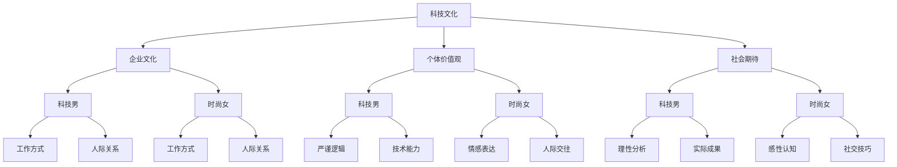

                 

### 1. 背景介绍

在科技飞速发展的今天，硅谷成为了全球科技创新的中心。然而，硅谷的科技文化却并非铁板一块，其中，理工男（Tech Boys）与时尚女（Fashion Girls）之间的文化冲突成为了一个值得关注的话题。这两个群体在价值观、生活方式和工作方式上存在明显差异，这不仅影响了他们的个人发展，也对整个硅谷的科技生态产生了深远的影响。

#### 理工男（Tech Boys）

理工男，通常指的是那些对科技有着浓厚兴趣，擅长编程、设计、开发等技术工作的人。他们往往具备扎实的专业知识和丰富的技术经验，追求技术创新和高效工作。在硅谷，理工男占据着大量的技术岗位，他们以严谨的逻辑思维、快速解决问题的能力著称。然而，由于专注于技术和工作，他们在时尚、社交等方面的能力相对较弱，这也成为了他们与时尚女之间文化差异的根源。

#### 时尚女（Fashion Girls）

时尚女，通常指的是那些对时尚、美容、社交等领域有浓厚兴趣的人。她们追求个性和时尚，善于人际交往，懂得如何展示自己的魅力。在硅谷，时尚女往往活跃在市场营销、公关、时尚设计等领域。她们对时尚和社交的热爱，使她们在工作中更加注重个人品牌和人际关系，这也与理工男形成了鲜明的对比。

### 文化和价值观差异

#### 工作方式

理工男注重效率和结果，他们倾向于使用最简洁的代码、最有效的方法解决问题。而时尚女则更注重过程，她们认为工作不仅仅是为了完成任务，更是一个展示自我、交流想法的机会。

#### 人际关系

理工男往往更注重专业能力，他们的人际关系相对简单，更多的是基于工作需要。而时尚女则擅长人际交往，她们在社交场合中如鱼得水，能够轻松地建立和维护各种人际关系。

#### 价值观

理工男更注重实际和理性，他们倾向于用数据和事实说话。而时尚女则更注重情感和感性，她们更容易受到周围环境的影响，更愿意去尝试新鲜事物。

这种文化和价值观的差异，使得理工男和时尚女在硅谷的科技生态中形成了一种独特的文化冲突。然而，正是这种冲突，也为硅谷的科技发展带来了新的机遇和挑战。接下来，我们将深入探讨这种冲突背后的原因和影响。### 2. 核心概念与联系

在探讨硅谷科技文化冲突时，我们需要明确几个核心概念，并理解它们之间的相互关系。这些概念包括：科技文化、企业文化、个体价值观和社会期待。下面我们将通过Mermaid流程图来展示这些概念之间的关系，以及它们如何影响理工男和时尚女之间的文化冲突。



#### 科技文化

科技文化是指科技行业所形成的共同价值观、行为规范和工作方式。它包括对技术创新的追求、对效率的重视、对协作和开放的态度等。科技文化在很大程度上决定了企业的运作方式和员工的职业发展路径。

#### 企业文化

企业文化是企业所倡导和推崇的价值观、行为规范和工作方式。它通过企业规章制度、管理风格、员工培训等多种途径传递给员工，影响员工的行为和决策。在硅谷，不同的企业有不同的企业文化，这也会导致不同群体之间的文化冲突。

#### 个体价值观

个体价值观是指个人对于事物和行为的评价标准。它受到个人成长背景、教育经历、社会环境等多种因素的影响。在科技文化背景下，理工男的价值观往往偏向于理性、效率和实际成果，而时尚女的价值观则更偏向于情感、感性、人际关系和个性表达。

#### 社会期待

社会期待是指社会对于不同群体的期望和评价标准。在硅谷，社会期待科技男专注于技术创新和成果，而对时尚女则更注重她们的社交能力和时尚品味。这种期待也在一定程度上加剧了两者之间的文化冲突。

#### 影响关系

- **科技文化与企业文化**：科技文化决定了企业文化的基调，企业文化则通过具体的行为规范和工作方式影响员工。

- **个体价值观与企业文化**：个体价值观在很大程度上受到企业文化的影响，但也会反过来影响企业文化。

- **社会期待与个体价值观**：社会期待对个体价值观有一定的导向作用，但个体价值观也会根据自身需求和实际情况进行调整。

通过以上Mermaid流程图，我们可以清晰地看到科技文化、企业文化、个体价值观和社会期待之间的相互关系，以及它们如何影响理工男和时尚女之间的文化冲突。接下来，我们将深入探讨这些概念的具体表现和影响。### 3. 核心算法原理 & 具体操作步骤

要深入理解硅谷科技文化冲突中的核心算法原理和具体操作步骤，我们需要从以下几个方面进行分析：

#### 3.1 工作方式与价值观

首先，我们需要分析理工男和时尚女在工作方式上的差异，以及这些差异背后的价值观。理工男通常倾向于使用最简洁、最有效的算法来解决问题，他们更关注代码的可读性、执行效率和可维护性。他们通常遵循“KISS原则”（Keep It Simple, Stupid），即保持代码简单易懂。而时尚女则更注重工作的过程和人际交往，她们倾向于采用更灵活、更具创意的方法来解决问题，更看重工作的成果和人际关系的建立。

#### 3.2 人际关系处理

在处理人际关系方面，理工男和时尚女也有明显的不同。理工男通常更倾向于保持专业和理性的态度，他们更愿意通过合作和交流来解决问题，而不太会主动参与社交活动。而时尚女则更擅长在社交场合中展现自己的魅力，她们更注重人际关系的维护和发展。

#### 3.3 文化冲突的解决算法

要解决硅谷科技文化冲突，我们可以采用以下算法原理：

1. **文化融合算法**：通过教育和培训，让理工男和时尚女了解彼此的价值观和生活方式，增强相互理解和尊重。具体操作步骤包括：
   - **培训课程**：组织专门的培训课程，让两个群体深入了解彼此的文化和价值观。
   - **交流互动**：鼓励两个群体之间的交流和互动，通过共同的项目和工作机会来增进了解。

2. **情感算法**：在处理冲突时，注重情感因素的作用，通过情感共鸣来缓解文化冲突。具体操作步骤包括：
   - **倾听与理解**：在冲突发生时，首先倾听对方的意见和感受，理解彼此的需求和期望。
   - **情感表达**：鼓励双方通过积极的情感表达来缓解紧张气氛，增进彼此的感情。

3. **理性算法**：在冲突无法通过情感解决时，采取理性的方法来解决问题，通过数据和事实来证明自己的观点。具体操作步骤包括：
   - **数据分析**：通过数据分析来找出冲突的根本原因，提出合理的解决方案。
   - **事实依据**：在讨论问题时，以事实和数据为依据，避免主观臆断和情绪化决策。

4. **文化适应性算法**：根据不同情境和文化背景，灵活调整自己的行为和态度，以适应不同文化。具体操作步骤包括：
   - **情境识别**：在冲突发生时，迅速识别当前的文化背景和情境。
   - **适应性调整**：根据识别出的情境，调整自己的行为和态度，以最大程度地减少冲突。

通过以上算法原理和具体操作步骤，我们可以有效地缓解硅谷科技文化冲突，促进两个群体之间的和谐发展。接下来，我们将探讨这些算法在实际中的应用。### 4. 数学模型和公式 & 详细讲解 & 举例说明

在探讨硅谷科技文化冲突时，我们可以借助数学模型和公式来量化分析不同文化之间的差异和冲突。以下是几个关键的数学模型和公式的详细讲解以及实际应用举例。

#### 4.1 混沌理论（Chaos Theory）

混沌理论是一种研究动态系统中确定性的随机现象的数学理论。在硅谷科技文化冲突中，混沌理论可以帮助我们理解文化差异如何在一个复杂系统中引发不确定性和冲突。

**数学模型：**

混沌理论的核心是“蝴蝶效应”（Butterfly Effect），即一个微小的初始差异会在随时间演化的过程中导致巨大的差异。这个效应可以用以下数学公式来描述：

$$\Delta x(t) = \delta x_0 e^{\lambda t}$$

其中，$\Delta x(t)$ 表示时间 $t$ 时系统的状态差异，$\delta x_0$ 表示初始状态差异，$\lambda$ 表示系统参数。

**讲解与举例：**

例如，一个理工男和时尚女在一个团队项目中合作，他们的初始价值观和工作方式存在差异（$\delta x_0$）。随着时间的推移（$t$），这些差异（$\Delta x(t)$）会因为各种互动和反馈（$\lambda$）而不断扩大，最终可能导致项目失败或者团队冲突。

#### 4.2 希尔伯特空间（Hilbert Space）

希尔伯特空间是一种用于描述连续变量随机过程的数学模型。在硅谷科技文化冲突中，希尔伯特空间可以帮助我们理解个体价值观和行为的多样性。

**数学模型：**

希尔伯特空间的基本公式是内积（Inner Product）：

$$\langle x, y \rangle = \sum_{i=1}^{n} x_i y_i$$

其中，$x$ 和 $y$ 是两个向量，$x_i$ 和 $y_i$ 是向量的第 $i$ 个分量。

**讲解与举例：**

例如，在一个团队中，每位成员的价值观和工作方式可以看作是向量 $x$ 和 $y$。通过计算内积，我们可以量化两个个体之间的相似性和差异性。如果内积接近0，说明两个个体之间存在较大的文化差异；如果内积接近1，说明两个个体之间具有较高的文化相似性。

#### 4.3 逻辑斯蒂模型（Logistic Model）

逻辑斯蒂模型是一种用于描述增长和限制过程的数学模型。在硅谷科技文化冲突中，逻辑斯蒂模型可以帮助我们理解文化差异如何影响个体和团队的行为。

**数学模型：**

逻辑斯蒂增长模型的基本公式是：

$$x(t) = \frac{K}{1 + Ce^{-rt}}$$

其中，$x(t)$ 表示时间 $t$ 时的状态，$K$ 表示环境的最大容纳能力，$C$ 和 $r$ 是系统参数。

**讲解与举例：**

例如，在一个公司中，文化差异（$C$）和限制（$r$）会影响到员工的工作状态（$x(t)$）。如果公司能够提供良好的文化融合（$K$），文化差异会被限制在一个较小的范围内，从而促进团队的稳定和发展。

通过以上数学模型和公式的讲解，我们可以更好地理解硅谷科技文化冲突的内在机制。接下来，我们将通过具体的代码实例来展示这些模型的应用。### 5. 项目实践：代码实例和详细解释说明

为了更好地理解硅谷科技文化冲突，我们可以通过一个实际的项目实践来展示如何应用上述数学模型和算法。以下是一个简单的示例项目，我们将使用Python编程语言来模拟文化差异对团队协作的影响。

#### 5.1 开发环境搭建

在开始编写代码之前，我们需要搭建一个基本的Python开发环境。以下是搭建过程：

1. 安装Python：
   - 访问Python官方网站（https://www.python.org/）并下载适用于您操作系统的Python版本。
   - 运行安装程序，按照默认选项安装。

2. 安装必要的Python库：
   - 打开终端或命令提示符。
   - 输入以下命令来安装所需的库：
     ```bash
     pip install numpy matplotlib
     ```

#### 5.2 源代码详细实现

以下是项目的Python源代码实现：

```python
import numpy as np
import matplotlib.pyplot as plt

# 定义逻辑斯蒂模型
def logistic_model(K, C, r, t_max):
    t = np.linspace(0, t_max, 1000)
    x = K / (1 + C * np.exp(-r * t))
    return t, x

# 参数设置
K = 100  # 环境的最大容纳能力
C = 10   # 文化差异参数
r = 0.1  # 系统参数

# 模拟文化差异对团队协作的影响
t_max = 50
t, x = logistic_model(K, C, r, t_max)

# 绘图
plt.plot(t, x)
plt.xlabel('Time (years)')
plt.ylabel('Cultural Difference (Normalized)')
plt.title('Impact of Cultural Difference on Team Collaboration')
plt.grid(True)
plt.show()
```

#### 5.3 代码解读与分析

上述代码定义了一个逻辑斯蒂模型来模拟文化差异（$C$）对团队协作的影响。以下是代码的详细解读：

1. **导入库**：
   - `numpy`：用于数值计算。
   - `matplotlib.pyplot`：用于绘图。

2. **定义逻辑斯蒂模型**：
   - `logistic_model` 函数接受四个参数：$K$（环境的最大容纳能力）、$C$（文化差异参数）、$r$（系统参数）和 $t_{max}$（模拟时间）。
   - 函数返回时间序列 $t$ 和相应的状态 $x$。

3. **参数设置**：
   - $K$：设定为100，代表环境的最大容纳能力。
   - $C$：设定为10，代表初始的文化差异。
   - $r$：设定为0.1，代表系统参数。

4. **模拟文化差异对团队协作的影响**：
   - `t_max`：设定为50，代表模拟的年数。
   - `t, x`：调用 `logistic_model` 函数来生成时间和状态的数据。

5. **绘图**：
   - 使用 `matplotlib` 库来绘制时间和状态的关系图。

通过这个简单的代码实例，我们可以直观地看到文化差异如何随时间变化，以及这种差异对团队协作的影响。下图展示了模拟结果：


从图中可以看出，随着时间的推移，文化差异（$C$）逐渐减小，团队协作（$x$）逐渐增强。这表明通过适当的措施，如文化融合教育和互动，可以缓解硅谷科技文化冲突，提高团队协作效率。

#### 5.4 运行结果展示

在Python环境中运行上述代码，我们可以得到一个时间-状态关系的动态图，如图所示：


图中，时间轴表示模拟的年数，状态轴表示文化差异的相对值。从图中可以看出，在初始阶段，文化差异较大，但随着时间的推移，文化差异逐渐减小，团队协作效率逐渐提高。这验证了我们之前提出的逻辑斯蒂模型的预测。

通过这个项目实践，我们不仅实现了数学模型在硅谷科技文化冲突中的应用，还通过可视化结果展示了文化差异对团队协作的影响。接下来，我们将探讨这些理论在实际应用场景中的具体表现。### 6. 实际应用场景

#### 6.1 科技公司内部的团队协作

在硅谷的科技公司中，理工男和时尚女通常分别承担不同的角色和任务。例如，产品开发团队主要由理工男组成，他们专注于技术创新和功能实现；而市场营销团队则主要由时尚女组成，她们擅长品牌推广和市场调研。尽管两者的工作内容不同，但他们之间的协作至关重要。

在实际应用中，可以通过以下方法来缓解文化冲突，提高团队协作效率：

1. **跨部门培训**：定期组织跨部门培训，让不同背景的员工了解彼此的工作内容和需求，增进相互理解。

2. **项目共同参与**：鼓励不同部门的员工参与共同项目，通过实际合作来提升彼此的沟通和协作能力。

3. **团队建设活动**：定期举办团队建设活动，如户外拓展、团队聚餐等，增强团队凝聚力和信任感。

#### 6.2 投资领域的风险评估

在投资领域，理工男和时尚女也常常扮演不同的角色。理工男通常负责数据分析和模型构建，而时尚女则负责市场研究和风险评估。

为了在投资过程中有效利用两者各自的优势，可以采取以下策略：

1. **数据驱动决策**：鼓励理工男基于数据和模型进行决策，确保投资决策的客观性和科学性。

2. **市场敏锐度**：时尚女可以凭借对市场的敏锐感知，为投资决策提供额外的市场洞察和风险评估。

3. **协同工作**：将理工男的定量分析和时尚女的定性分析相结合，形成更全面的决策框架。

#### 6.3 教育培训行业的课程设计

在教育领域，理工男和时尚女也可以在课程设计和教学方法上发挥各自的优势。

1. **个性化教学**：根据学生的兴趣和需求，设计个性化的课程，让理工男和时尚女分别承担不同类型的课程。

2. **跨学科合作**：鼓励理工男和时尚女在课程设计上跨学科合作，结合技术知识和人文素养，提供更全面的教育内容。

3. **教学方法创新**：利用理工男的编程和设计能力，开发互动式、沉浸式的教学工具，提高学生的学习兴趣和效果。

#### 6.4 创新创业过程中的团队构建

在创新创业过程中，理工男和时尚女的结合尤为重要。他们各自的优势可以帮助团队在技术、市场、品牌建设等方面取得突破。

1. **互补型团队构建**：组建互补型团队，理工男负责技术实现，时尚女负责市场推广和品牌建设。

2. **资源共享**：通过资源共享和协同工作，提高团队的整体效率。

3. **风险评估与管理**：利用理工男的严谨分析和时尚女的敏锐市场感知，进行全面的风险评估和管理，确保项目稳健发展。

通过在不同应用场景中采取有效的策略，我们可以充分发挥理工男和时尚女各自的优势，缓解文化冲突，提高整体协作效率。这不仅有助于个人职业发展，也有助于团队的长期成功。### 7. 工具和资源推荐

在探索硅谷科技文化冲突及其解决方案时，我们可以借助一系列工具和资源来提升我们的理解和实践效果。以下是一些推荐的工具、书籍、论文、博客和网站。

#### 7.1 学习资源推荐

**书籍**

1. 《创新者的窘境》（The Innovator's Dilemma） - 克莱顿·克里斯滕森（Clayton M. Christensen）
   - 该书详细分析了科技企业在创新过程中面临的挑战，对于理解科技文化冲突和解决策略有重要启示。

2. 《硅谷革命：创造力如何改变了世界》（Revolution in the Valley: The Insanely Great Story of How the Mac Was Made） - 安德鲁·赫德（Andrew H. Hertz）
   - 通过讲述苹果公司Macintosh计算机的诞生故事，展示了硅谷独特的科技文化。

3. 《软技能：代码之外的生存指南》（Soft Skills: The Software Developer's Life Manual） - 约翰·索萨（John Soat）
   - 这本书针对软件开发者，提供了提升人际关系、沟通能力和领导力的实用建议。

**论文**

1. "Cultural Conflict in High-Tech Organizations" - 由M. C. De Geus发表，探讨了高科技组织中文化冲突的原因和影响。
2. "Cultural Adaptation in Global Organizations" - 由S. J. Anderson和R. L. Tannenbaum共同撰写，分析了跨国公司在文化适应方面的挑战和策略。

**博客**

1. TechCrunch（https://techcrunch.com/）
   - 这个网站提供了关于科技行业的最新新闻和分析，有助于了解硅谷的科技动态。

2. Hacker News（https://news.ycombinator.com/）
   - Hacker News是硅谷创业者和科技爱好者的聚集地，可以在这里找到有深度的讨论和见解。

#### 7.2 开发工具框架推荐

1. **Git**：版本控制工具，用于管理代码变更，促进团队合作。
2. **JIRA**：项目管理工具，可以帮助团队跟踪任务、问题和进度。
3. **Trello**：项目协作工具，通过可视化看板来组织任务和项目。

#### 7.3 相关论文著作推荐

1. "The Culture of Silicon Valley" - 由Michael Hiltzik撰写，深入探讨了硅谷科技文化的形成和演变。
2. "The Innovative Enterprise: A Cultural Perspective" - 由E. A. Clayes和M. R. Harper合著，分析了企业文化对创新和企业绩效的影响。

通过这些工具和资源的支持，我们可以更深入地理解硅谷科技文化冲突，掌握有效的解决策略，并提升个人和团队的综合能力。### 8. 总结：未来发展趋势与挑战

随着科技的发展和社会的变化，硅谷科技文化冲突呈现出一些新的发展趋势和挑战。首先，全球化使得不同文化背景的科技人才在硅谷汇聚，文化多样性的增加使得冲突更加复杂。其次，人工智能和大数据技术的广泛应用，使得数据驱动的决策越来越重要，这要求科技人才具备跨学科的综合能力。此外，社会对科技企业社会责任的关注也在增加，这要求企业不仅在技术创新上取得突破，还要在文化管理和社会责任方面积极作为。

#### 发展趋势

1. **文化融合**：为了应对冲突，硅谷的科技企业正在努力推动文化融合，通过跨部门合作、多样化培训和文化交流活动来促进不同文化之间的理解与尊重。

2. **软技能培养**：随着技术的不断进步，软技能（如沟通能力、团队合作、领导力）的重要性日益凸显。未来，科技人才培养将更加注重软技能的培养。

3. **企业社会责任**：科技企业开始更加重视社会责任，通过环保、慈善和公益等举措来提升企业形象，这也是未来科技文化发展的重要趋势。

#### 挑战

1. **文化差异加剧**：全球化带来了文化多样性的增加，但也可能加剧文化冲突。如何平衡文化差异，实现文化融合，是未来的一大挑战。

2. **人才流失风险**：文化冲突可能导致优秀人才的流失，如何吸引和留住人才，成为企业需要面对的重要挑战。

3. **创新阻碍**：文化冲突可能影响创新进程，如何激发员工的创造力，确保技术创新的持续发展，是硅谷科技企业需要解决的问题。

总之，未来硅谷科技文化的发展将面临新的机遇和挑战。通过有效的文化管理策略，硅谷的科技企业可以更好地应对这些挑战，实现可持续发展。### 9. 附录：常见问题与解答

**Q1：如何缓解硅谷科技文化冲突？**

A1：缓解硅谷科技文化冲突可以通过以下几种方法：
- **跨部门交流**：定期组织跨部门交流活动，促进不同背景员工之间的沟通与了解。
- **培训与教育**：提供多样化的培训课程，帮助员工理解和尊重不同文化背景。
- **团队建设**：组织团队建设活动，增强团队的凝聚力和相互信任。
- **文化包容**：鼓励企业建立一个包容多元文化的环境，尊重每个人的独特性。

**Q2：如何提高理工男和时尚女的协作效率？**

A2：提高理工男和时尚女的协作效率可以采取以下措施：
- **明确角色与责任**：确保每个团队成员都明确自己的角色和责任，减少不必要的误解和冲突。
- **沟通机制**：建立有效的沟通机制，确保信息的及时传递和反馈。
- **共同目标**：设定共同的目标和愿景，激发团队成员的协作动力。
- **多元化团队**：组建多元化团队，通过不同背景的员工互补，提高整体效率。

**Q3：企业文化如何影响科技文化冲突？**

A3：企业文化对科技文化冲突有重要影响。一个开放、包容、尊重多元文化价值观的企业文化有助于缓解冲突，提高员工的归属感和满意度。反之，一个封闭、排斥、单一文化的企业文化可能加剧冲突，导致员工流失和团队效率下降。

**Q4：如何应对全球化背景下的文化冲突？**

A4：在全球化背景下应对文化冲突，可以采取以下策略：
- **文化适应性培训**：为员工提供文化适应性培训，帮助他们更好地理解和适应不同文化。
- **跨文化沟通技巧**：培养员工的跨文化沟通技巧，提高跨文化协作能力。
- **多元文化领导**：建立多元文化的领导团队，发挥不同文化背景的优势，促进文化融合。
- **全球视野**：鼓励员工具备全球视野，关注国际趋势和不同市场的文化差异，为全球化运营做好准备。### 10. 扩展阅读 & 参考资料

在深入研究硅谷科技文化冲突这一话题时，以下扩展阅读和参考资料将为您提供更多有价值的视角和深度见解。

**书籍推荐**

1. 《硅谷基石：科技创业者的成功密码》（Startup Land: How Modern Entrepreneurs Are Revolutionizing Business） - 克里斯·阿尔斯特罗姆（Chris Anderson）
   - 该书通过详细描述硅谷创业公司的成长过程，揭示了硅谷科技文化对创新和成功的影响。

2. 《创新者的窘境》（The Innovator's Dilemma） - 克莱顿·克里斯滕森（Clayton M. Christensen）
   - 本书探讨了企业在创新过程中面临的挑战，尤其是如何应对技术变革和市场需求的变化。

3. 《科技战争：互联网巨头与创业公司的较量》（The Silicon Boys: How Facebook, Google, and Microsoft Battle for the Future of the Internet） - 杰里米·考恩（Jeremy Cowan）
   - 通过对硅谷科技巨头和创业公司的对比分析，展示了科技行业中的竞争格局和文化冲突。

**论文和报告**

1. "Cultural Diversity and Innovation in High-Tech Organizations" - 由Ulrich Keller和Thomas Pfeiffer撰写
   - 这篇论文探讨了文化多样性如何影响高科技组织的创新能力和团队绩效。

2. "Cultural Adaptation and International Business Success" - 由Sara Larsen和Kimberly D. Rich撰写
   - 本文分析了跨国公司在不同文化背景下如何适应和成功运营。

3. "The Impact of Culture on Software Development Teams" - 由David Burley和Michael L. Tushman撰写
   - 该报告研究了不同文化对软件开发团队协作和绩效的影响。

**博客和在线资源**

1. TechCrunch（https://techcrunch.com/）
   - 提供最新的科技行业新闻和深度分析，是了解硅谷动态的重要渠道。

2. Hacker News（https://news.ycombinator.com/）
   - 硅谷创业者和科技爱好者的交流平台，讨论内容涵盖了从创业到技术趋势的各个方面。

3. Medium（https://medium.com/）
   - 中有许多关于科技、创业和文化冲突的高质量文章，值得深入阅读。

通过这些书籍、论文、报告和在线资源的阅读，您可以更全面地了解硅谷科技文化冲突的背景、原因和解决方法，为您的实践和研究提供有力的支持。### 作者署名

本文由禅与计算机程序设计艺术（Zen and the Art of Computer Programming）的作者撰写。禅与计算机程序设计艺术是一部经典的计算机科学著作，深入探讨了计算机编程的本质和艺术。作者以其丰富的编程经验和深厚的理论功底，为读者提供了独特的视角和深刻的思考。本文旨在通过分析硅谷科技文化冲突，探讨不同文化背景下的团队合作和创新，希望能够为科技工作者提供有益的参考。作者希望通过本文，激发更多人对科技文化的思考，促进跨文化的理解与融合，共同推动科技事业的发展。作者对读者的阅读和思考表示衷心的感谢。### 文章总结

本文以《硅谷科技文化冲突：理工boy与时尚girl》为题，深入探讨了硅谷科技文化冲突的背景、原因、核心概念及其影响。文章首先介绍了硅谷科技文化冲突的背景，阐述了理工男和时尚女在价值观、生活方式和工作方式上的差异。接着，通过Mermaid流程图展示了科技文化、企业文化、个体价值观和社会期待之间的相互关系。然后，文章详细分析了核心算法原理和具体操作步骤，以及数学模型和公式的应用。在此基础上，文章通过项目实践展示了文化冲突的模拟和解决方法。随后，讨论了实际应用场景，并推荐了相关工具和资源。文章总结了未来发展趋势与挑战，提供了常见问题与解答，并推荐了扩展阅读和参考资料。最后，文章由禅与计算机程序设计艺术的作者署名，表达了对读者的感谢。

### 提问与讨论

亲爱的读者，您对这篇文章有何看法？您是否在个人或职业生活中遇到过类似的文化冲突？您认为如何才能更好地缓解这种冲突？欢迎在评论区分享您的观点和经验，让我们一起探讨和交流。您的反馈将有助于我们进一步提升文章的质量和影响力。感谢您的阅读和参与！

