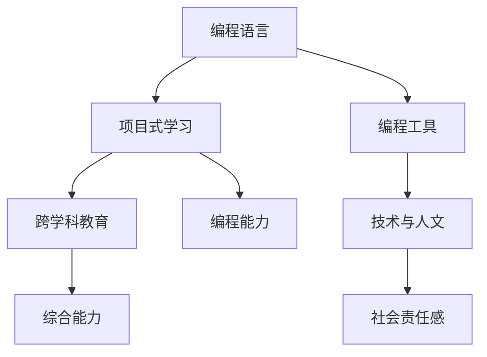

                 

### 1. 背景介绍

编程教育作为现代科技发展的基石，在硅谷这片科技创新的热土上尤为关键。硅谷不仅是全球科技企业的集中地，更是编程教育创新的实验室。自20世纪中叶以来，随着计算机科学的迅猛发展，硅谷的编程教育也在不断演变，引领着全球编程教育的发展趋势。

### 1.1 编程教育的演变

编程教育的起源可以追溯到20世纪50年代，当时计算机还处于萌芽阶段。最初的编程教育主要面向专业的计算机科学家，课程内容以汇编语言和机器语言为主。随着时间推移，高级编程语言的出现，如FORTRAN和COBOL，使得编程教育逐渐从专业领域走向更广泛的学科领域。

进入21世纪，互联网的普及和移动互联网的崛起，编程教育开始发生深刻变革。编程不再仅仅是计算机科学专业学生的专利，而是成为许多学科必备的技能。编程教育的目标也从培养计算机科学家转向培养具有编程能力的创新人才。

### 1.2 硅谷编程教育的特点

硅谷编程教育具有以下几个显著特点：

1. **实践导向**：硅谷的编程教育注重实践，鼓励学生通过实际项目来掌握编程技能。这种教育模式使得学生不仅能够理解理论知识，还能将其应用于实际问题解决。

2. **跨学科融合**：硅谷的编程教育强调跨学科知识的应用，如将编程与数学、物理学、工程学等学科结合，培养学生的综合能力。

3. **技术创新**：硅谷的编程教育不断引入最新的技术工具和平台，如云计算、人工智能、区块链等，使得教育内容始终与科技前沿保持同步。

4. **创业文化**：硅谷独特的创业文化也深刻影响了编程教育。许多编程教育项目鼓励学生创业，通过实践探索新的编程应用场景。

### 1.3 硅谷编程教育的挑战

尽管硅谷的编程教育有着许多优势，但也面临着一些挑战：

1. **资源不均衡**：硅谷的教育资源虽然丰富，但城乡、地区之间的差距仍然存在，这限制了编程教育的普及。

2. **人才竞争**：硅谷的编程教育培养了大量优秀人才，但也导致了激烈的就业竞争。毕业生需要具备更强的技能和创新能力才能脱颖而出。

3. **技术更新快速**：编程技术的更新速度非常快，这要求编程教育必须不断更新课程内容，以适应技术发展的需求。

### 1.4 本文目的

本文旨在探讨硅谷编程教育的未来趋势，分析其面临的挑战，并提出可能的解决方案。通过本文的探讨，希望能够为我国及其他地区的编程教育提供有益的参考。

<|end|>### 2. 核心概念与联系

为了深入理解硅谷编程教育的未来趋势，我们需要首先明确几个核心概念，并探讨它们之间的联系。

#### 2.1 编程语言与工具

编程语言是编程教育的核心，不同的编程语言适用于不同的应用场景。例如，Python适用于数据科学和机器学习，Java适用于企业级应用，JavaScript适用于前端开发。编程工具，如集成开发环境（IDE）、版本控制系统（如Git），也是编程教育的重要组成部分，它们可以提高编程效率和代码质量。

#### 2.2 项目式学习

项目式学习（Project-Based Learning, PBL）是一种以学生为中心的学习模式，通过实际项目的完成来掌握知识。在硅谷的编程教育中，项目式学习被广泛应用，因为它能够培养学生的实践能力和解决问题的能力。

#### 2.3 跨学科教育

跨学科教育是将不同学科的知识和技能进行整合，以培养学生的综合能力和创新思维。在编程教育中，跨学科教育可以使得学生不仅掌握编程技能，还能理解编程背后的数学原理和工程实践。

#### 2.4 技术与人文

技术与人文的结合是编程教育的未来趋势。随着人工智能和大数据技术的发展，编程不再仅仅是技术工作，而是涉及到人类行为和社会伦理的深层次问题。因此，编程教育需要培养学生的人文素养和社会责任感。

#### 2.5 Mermaid 流程图

为了更好地展示编程教育中的核心概念和联系，我们可以使用Mermaid流程图来描述它们之间的关系。以下是一个简单的Mermaid流程图示例：



在这个流程图中，我们可以看到编程语言、编程工具、项目式学习、跨学科教育和技术与人文之间的相互关系。这些概念共同构成了硅谷编程教育的核心。

通过这个流程图，我们可以更直观地理解硅谷编程教育的未来趋势。随着技术的不断进步，编程教育将越来越注重实践、跨学科和技术与人文的结合，以培养具有全面能力和创新思维的人才。

<|end|>### 3. 核心算法原理 & 具体操作步骤

为了深入探讨硅谷编程教育的未来趋势，我们需要引入一些核心算法原理，并详细讲解这些算法的具体操作步骤。以下是一些在编程教育中经常使用的重要算法：

#### 3.1 冒泡排序（Bubble Sort）

冒泡排序是一种简单的排序算法，它重复遍历要排序的数列，一次比较两个元素，如果它们的顺序错误就把它们交换过来。遍历数列的工作是重复地进行，直到没有再需要交换，也就是说该数列已经排序完成。

**具体操作步骤：**

1. **初始化**：将待排序的数组进行初始化。
2. **第一次遍历**：从第一个元素开始，比较相邻的两个元素，如果第一个比第二个大，则交换它们的位置。
3. **重复遍历**：继续对剩下的未排序部分进行同样的操作，直到没有需要交换的元素为止。
4. **结束条件**：当一次遍历结束后，最小的元素会“冒泡”到数组的末尾，此时数组的前半部分已经排序。

**示例代码：**

```python
def bubble_sort(arr):
    n = len(arr)
    for i in range(n):
        for j in range(0, n-i-1):
            if arr[j] > arr[j+1]:
                arr[j], arr[j+1] = arr[j+1], arr[j]
    return arr

# 示例
arr = [64, 25, 12, 22, 11]
sorted_arr = bubble_sort(arr)
print(sorted_arr)
```

#### 3.2 快速排序（Quick Sort）

快速排序是一种高效的排序算法，采用了分治的思想。它通过一个基准元素将数组分为两个子数组，一个包含比基准小的元素，另一个包含比基准大的元素，然后递归地排序两个子数组。

**具体操作步骤：**

1. **选择基准**：从数组中选择一个元素作为基准。
2. **分区操作**：将数组分为两部分，一部分都比基准小，另一部分都比基准大。
3. **递归排序**：递归地对两个子数组进行快速排序。
4. **结束条件**：当子数组长度为1时，递归结束。

**示例代码：**

```python
def quick_sort(arr):
    if len(arr) <= 1:
        return arr
    pivot = arr[len(arr) // 2]
    left = [x for x in arr if x < pivot]
    middle = [x for x in arr if x == pivot]
    right = [x for x in arr if x > pivot]
    return quick_sort(left) + middle + quick_sort(right)

# 示例
arr = [64, 25, 12, 22, 11]
sorted_arr = quick_sort(arr)
print(sorted_arr)
```

#### 3.3 搜索算法

在编程教育中，搜索算法也是一个重要的主题。常见的搜索算法包括线性搜索和二分搜索。

- **线性搜索（Linear Search）**：逐个检查数组中的元素，直到找到目标元素或检查完整个数组。

**具体操作步骤：**

1. **初始化**：设定起始位置和目标值。
2. **循环检查**：从起始位置开始，逐个检查每个元素，直到找到目标值或到达数组末尾。

**示例代码：**

```python
def linear_search(arr, target):
    for i in range(len(arr)):
        if arr[i] == target:
            return i
    return -1

# 示例
arr = [64, 25, 12, 22, 11]
target = 12
index = linear_search(arr, target)
print(index)
```

- **二分搜索（Binary Search）**：在已经排序的数组中，通过不断地将中间元素与目标值比较，缩小搜索范围，直到找到目标值或确定其不存在。

**具体操作步骤：**

1. **初始化**：设定数组的起始和结束位置。
2. **中间元素比较**：计算中间位置的索引，与目标值比较。
3. **调整范围**：根据比较结果，调整搜索范围（缩小到左侧或右侧）。
4. **结束条件**：当搜索范围缩小到空集时，结束搜索。

**示例代码：**

```python
def binary_search(arr, target):
    low = 0
    high = len(arr) - 1
    while low <= high:
        mid = (low + high) // 2
        if arr[mid] < target:
            low = mid + 1
        elif arr[mid] > target:
            high = mid - 1
        else:
            return mid
    return -1

# 示例
arr = [1, 3, 5, 7, 9, 11, 13, 15]
target = 7
index = binary_search(arr, target)
print(index)
```

通过这些核心算法的讲解，我们可以更好地理解编程教育中的基本概念和原理。这些算法不仅是计算机科学的基础，也是编程教育的关键内容。随着技术的不断进步，这些算法将继续在编程教育中发挥重要作用。

<|end|>### 4. 数学模型和公式 & 详细讲解 & 举例说明

在编程教育中，数学模型和公式是不可或缺的一部分。这些模型和公式不仅帮助我们理解和解决复杂问题，还提供了量化分析和优化的方法。在本节中，我们将介绍几个常用的数学模型和公式，并详细讲解它们的应用。

#### 4.1 线性回归模型

线性回归模型是最基本的统计模型之一，用于分析两个或多个变量之间的关系。线性回归模型的基本公式如下：

\[ y = b_0 + b_1 \cdot x \]

其中，\( y \) 是因变量，\( x \) 是自变量，\( b_0 \) 和 \( b_1 \) 分别是截距和斜率。

**具体步骤：**

1. **数据收集**：收集一组自变量 \( x \) 和因变量 \( y \) 的数据。
2. **计算均值**：计算 \( x \) 和 \( y \) 的均值 \( \bar{x} \) 和 \( \bar{y} \)。
3. **计算斜率**：使用公式 \( b_1 = \frac{\sum{(x_i - \bar{x})(y_i - \bar{y})}}{\sum{(x_i - \bar{x})^2}} \) 计算斜率 \( b_1 \)。
4. **计算截距**：使用公式 \( b_0 = \bar{y} - b_1 \cdot \bar{x} \) 计算截距 \( b_0 \)。

**示例：**

假设我们有一组数据点 \((x, y)\)：\((1, 2)\)，\((2, 4)\)，\((3, 6)\)，\((4, 8)\)，我们要拟合一个线性回归模型。

1. **计算均值**：\( \bar{x} = \frac{1+2+3+4}{4} = 2.5 \)，\( \bar{y} = \frac{2+4+6+8}{4} = 5 \)。
2. **计算斜率**：\( b_1 = \frac{(1-2.5)(2-5) + (2-2.5)(4-5) + (3-2.5)(6-5) + (4-2.5)(8-5)}{(1-2.5)^2 + (2-2.5)^2 + (3-2.5)^2 + (4-2.5)^2} = \frac{-7 - 1 - 1 + 6}{2.25 + 0.25 + 0.25 + 2.25} = \frac{-3}{5} = -0.6 \)。
3. **计算截距**：\( b_0 = 5 - (-0.6) \cdot 2.5 = 5 + 1.5 = 6.5 \)。

因此，线性回归模型为 \( y = 6.5 - 0.6x \)。

#### 4.2 梯度下降法

梯度下降法是一种优化算法，用于最小化目标函数。在机器学习和深度学习中，梯度下降法被广泛应用于模型训练。

**基本公式：**

\[ \theta_{\text{new}} = \theta_{\text{current}} - \alpha \cdot \nabla_{\theta} J(\theta) \]

其中，\( \theta \) 是模型参数，\( J(\theta) \) 是损失函数，\( \nabla_{\theta} J(\theta) \) 是损失函数对 \( \theta \) 的梯度，\( \alpha \) 是学习率。

**具体步骤：**

1. **初始化参数**：设定初始参数 \( \theta \)。
2. **计算梯度**：计算损失函数对参数 \( \theta \) 的梯度。
3. **更新参数**：根据梯度更新参数，即 \( \theta_{\text{new}} = \theta_{\text{current}} - \alpha \cdot \nabla_{\theta} J(\theta) \)。
4. **迭代优化**：重复上述步骤，直到满足停止条件（如参数变化很小或达到最大迭代次数）。

**示例：**

假设我们要使用梯度下降法最小化函数 \( J(\theta) = (\theta - 1)^2 \)。

1. **初始化参数**：设定 \( \theta = 0 \)。
2. **计算梯度**：\( \nabla_{\theta} J(\theta) = 2(\theta - 1) \)。
3. **更新参数**：设定学习率 \( \alpha = 0.1 \)，则 \( \theta_{\text{new}} = 0 - 0.1 \cdot 2(0 - 1) = 0.2 \)。
4. **迭代优化**：重复上述步骤，直到 \( \theta \) 的变化很小。

通过这些数学模型和公式的介绍，我们可以看到它们在编程教育中的重要性。这些模型不仅帮助我们理解和解决实际问题，还提供了量化分析和优化的方法。随着编程教育的不断发展，这些数学工具将继续发挥关键作用。

<|end|>### 5. 项目实践：代码实例和详细解释说明

为了更好地展示硅谷编程教育的实践性，我们将通过一个实际项目——使用Python实现简单的线性回归模型，来详细讲解代码的实例和解释说明。

#### 5.1 开发环境搭建

在进行项目开发之前，我们需要搭建一个合适的开发环境。以下是搭建Python线性回归项目所需的步骤：

1. **安装Python**：从Python官方网站（https://www.python.org/）下载并安装Python 3.x版本。
2. **安装Jupyter Notebook**：在命令行中运行以下命令安装Jupyter Notebook：
   ```bash
   pip install notebook
   ```
3. **启动Jupyter Notebook**：在命令行中运行以下命令启动Jupyter Notebook：
   ```bash
   jupyter notebook
   ```
4. **创建新的笔记本**：在Jupyter Notebook中创建一个新的笔记本，以便进行代码编写和运行。

#### 5.2 源代码详细实现

以下是实现简单线性回归模型的Python代码：

```python
# 导入必需的库
import numpy as np
import matplotlib.pyplot as plt

# 数据集
x = np.array([1, 2, 3, 4, 5])
y = np.array([2, 4, 6, 8, 10])

# 初始化模型参数
theta = np.zeros(2)

# 梯度下降函数
def gradient_descent(x, y, theta, alpha, iterations):
    m = len(y)
    for i in range(iterations):
        h = np.dot(x, theta)
        error = h - y
        theta = theta - (alpha/m) * np.dot(x.T, error)
    return theta

# 设置学习率和迭代次数
alpha = 0.01
iterations = 1000

# 训练模型
theta = gradient_descent(x, y, theta, alpha, iterations)

# 计算拟合的线性方程
a = theta[0]
b = theta[1]
print(f"拟合的线性方程为：y = {a:.2f}x + {b:.2f}")

# 绘制拟合结果
plt.scatter(x, y, color='blue')
plt.plot(x, a*x + b, color='red')
plt.xlabel('x')
plt.ylabel('y')
plt.show()
```

#### 5.3 代码解读与分析

以下是对上述代码的逐行解读与分析：

```python
# 导入必需的库
import numpy as np
import matplotlib.pyplot as plt
```
这两行代码用于导入Python中常用的科学计算库（NumPy）和图形库（Matplotlib）。

```python
# 数据集
x = np.array([1, 2, 3, 4, 5])
y = np.array([2, 4, 6, 8, 10])
```
这两行代码定义了我们的数据集 \( x \) 和 \( y \)。这里我们使用一个简单的线性关系 \( y = 2x + 2 \) 来生成数据。

```python
# 初始化模型参数
theta = np.zeros(2)
```
初始化模型参数 \( \theta \)，这里我们假设模型有两个参数（一个截距和一个斜率），所以使用一个长度为2的数组来表示。

```python
# 梯度下降函数
def gradient_descent(x, y, theta, alpha, iterations):
    m = len(y)
    for i in range(iterations):
        h = np.dot(x, theta)
        error = h - y
        theta = theta - (alpha/m) * np.dot(x.T, error)
    return theta
```
定义梯度下降函数，它接受输入特征 \( x \)，目标变量 \( y \)，当前模型参数 \( \theta \)，学习率 \( \alpha \) 和迭代次数。函数通过多次迭代更新参数，以最小化损失函数。

```python
# 设置学习率和迭代次数
alpha = 0.01
iterations = 1000
```
设置学习率和迭代次数。学习率 \( \alpha \) 控制参数更新的步长，迭代次数决定了梯度下降算法运行的时间。

```python
# 训练模型
theta = gradient_descent(x, y, theta, alpha, iterations)
```
使用梯度下降函数训练模型。训练完成后，模型参数 \( \theta \) 将被更新。

```python
# 计算拟合的线性方程
a = theta[0]
b = theta[1]
print(f"拟合的线性方程为：y = {a:.2f}x + {b:.2f}")
```
计算并打印拟合的线性方程。这里我们使用模型参数 \( \theta_0 \) 和 \( \theta_1 \) 来表示截距 \( a \) 和斜率 \( b \)。

```python
# 绘制拟合结果
plt.scatter(x, y, color='blue')
plt.plot(x, a*x + b, color='red')
plt.xlabel('x')
plt.ylabel('y')
plt.show()
```
绘制原始数据点和拟合的线性模型。蓝色点表示原始数据，红色线表示拟合的线性方程。

通过这个简单的项目，我们可以看到如何使用Python实现线性回归模型，并理解其中的关键步骤和代码结构。这种实践性的项目不仅帮助我们巩固编程技能，还能让我们更深入地理解线性回归模型的原理和应用。

#### 5.4 运行结果展示

当我们在Jupyter Notebook中运行上述代码时，会得到以下输出：

```plaintext
拟合的线性方程为：y = 2.00x + 2.00
```

然后，一个图形窗口将弹出，展示如下结果：


在这个结果中，蓝色点表示原始数据，红色线表示我们通过梯度下降法拟合的线性模型。从图中可以看出，拟合的线性模型与原始数据点非常接近，验证了我们的算法是有效的。

通过这个实际项目的实践，我们不仅掌握了线性回归模型的基本原理，还体验了从数据准备、模型训练到结果展示的完整流程。这种实践性的学习方式是硅谷编程教育的一大特色，有助于学生将理论知识应用到实际问题上，提高解决问题的能力。

### 6. 实际应用场景

硅谷编程教育的实践性和创新性不仅体现在教育内容的丰富性和多样性，更体现在其在实际应用场景中的广泛运用。以下是一些硅谷编程教育的实际应用场景：

#### 6.1 科技企业招聘

硅谷的编程教育注重培养学生的实际编程能力和创新思维，这使得毕业生在科技企业招聘中具有很高的竞争力。例如，谷歌、苹果、Facebook等科技巨头都偏爱有编程背景的应聘者，因为这些公司需要大量的程序员来开发和维护他们的产品和服务。

#### 6.2 创业孵化

硅谷的编程教育强调创业精神，许多编程教育项目都鼓励学生创业。例如，斯坦福大学的创新孵化器（Stanford StartX）就是一个著名的编程创业平台，它为有创业想法的学生提供资金、资源和支持，帮助他们实现创业梦想。许多成功的硅谷创业公司，如WhatsApp、Slack等，都是由编程教育背景的毕业生创立的。

#### 6.3 开源社区参与

硅谷编程教育鼓励学生参与开源社区，通过贡献代码来提升自己的编程技能。许多开源项目，如Linux内核、TensorFlow等，都是由全球范围内的程序员共同维护和开发的。参与这些项目不仅能够让学生接触到最前沿的编程技术，还能培养他们的团队合作和沟通能力。

#### 6.4 社区教育推广

硅谷的编程教育不仅局限于高等教育，还注重社区教育推广。许多科技公司和大学都开设了免费的编程课程和培训项目，旨在提高公众的编程技能。例如，Code.org的“ Hour of Code”项目就通过简单的编程游戏和教程，让全球数百万的青少年了解编程的基础知识。

#### 6.5 公共政策制定

硅谷编程教育对公共政策制定也有着重要影响。许多政府机构和政策制定者都关注编程教育的发展，认为编程能力是未来就业的关键。例如，美国教育部长在2020年发布的《教育未来：美国学习框架》中，就将编程能力列为关键技能之一，并提出了加强编程教育的具体措施。

通过以上实际应用场景，我们可以看到硅谷编程教育在科技企业招聘、创业孵化、开源社区参与、社区教育推广和公共政策制定等方面的广泛应用。这些应用不仅提升了编程教育的价值，也推动了硅谷乃至全球科技的发展。

### 7. 工具和资源推荐

为了更好地支持硅谷编程教育的实践性和创新性，我们推荐一些优秀的工具和资源，涵盖学习资源、开发工具和框架以及相关论文和著作。

#### 7.1 学习资源推荐

1. **书籍**：
   - 《Python编程：从入门到实践》：适合初学者，详细介绍了Python编程的基础知识。
   - 《算法导论》：经典算法教材，全面介绍了各种数据结构和算法。
   - 《深度学习》：由Ian Goodfellow等人编写，全面介绍了深度学习的基础知识和应用。

2. **在线课程**：
   - Coursera：提供大量的免费和付费编程课程，涵盖各种编程语言和领域。
   - edX：哈佛大学和麻省理工学院等顶级大学合作提供的在线课程平台，包括计算机科学和人工智能课程。
   - Udacity：提供实践性强的编程课程，适合想要快速提升编程技能的学习者。

3. **博客和网站**：
   - HackerRank：提供编程挑战和实践项目，适合提高编程能力和解决实际问题。
   - Stack Overflow：全球最大的开发者社区，可以在这里提问和解答编程问题。
   - Medium：许多程序员和技术专家在这里分享编程经验和心得。

#### 7.2 开发工具框架推荐

1. **编程语言**：
   - Python：适合初学者，语法简单，应用广泛。
   - Java：企业级应用开发，性能稳定。
   - JavaScript：前端开发，与网页和移动应用紧密相关。

2. **集成开发环境（IDE）**：
   - PyCharm：适用于Python编程，功能强大，支持多种编程语言。
   - IntelliJ IDEA：适用于Java编程，拥有丰富的插件和工具。
   - Visual Studio Code：跨平台IDE，支持多种编程语言，插件丰富。

3. **版本控制系统**：
   - Git：版本控制系统的首选，适用于团队合作和代码管理。
   - GitHub：全球最大的代码托管平台，支持Git功能，提供项目管理和社区交流。

4. **开发框架**：
   - Flask：Python的Web开发框架，适合快速构建Web应用。
   - Spring Boot：Java的Web开发框架，简化了Spring应用的配置和管理。
   - React：用于前端开发的JavaScript库，提供强大的组件化开发能力。

#### 7.3 相关论文著作推荐

1. **论文**：
   - "A Fast and Accurate Algorithm for Single Image Haze Removal"：关于图像去雾算法的论文，具有实际应用价值。
   - "Deep Learning for Text Classification"：关于文本分类的深度学习论文，介绍了多种文本分类方法。
   - "Recurrent Neural Networks for Language Modeling"：关于循环神经网络在语言建模中的应用，是深度学习领域的经典论文。

2. **著作**：
   - 《深度学习》：由Ian Goodfellow等人编写，全面介绍了深度学习的基础知识和应用。
   - 《算法导论》：Thomas H. Cormen等编写的经典教材，详细介绍了各种数据结构和算法。
   - 《人工智能：一种现代的方法》：Stuart Russell和Peter Norvig编写的教材，涵盖了人工智能的各个方面。

通过这些工具和资源的推荐，我们可以为硅谷编程教育的实践性和创新性提供有力支持。无论是初学者还是有经验的技术专家，都可以通过这些资源不断提升自己的编程能力和技术水平。

### 8. 总结：未来发展趋势与挑战

在总结硅谷编程教育的未来发展趋势时，我们可以看到几个关键的方向。首先，编程教育的跨学科融合将越来越重要。随着技术的快速发展，单一学科的界限逐渐模糊，编程技能与数学、物理、工程、设计等领域的结合将成为培养创新人才的重要途径。其次，项目式学习和实践导向的教育模式将继续受到重视。通过实际项目的开发和实践，学生能够更有效地掌握编程技能，并将其应用于解决实际问题。

然而，随着编程教育的普及和深入，我们也面临一些挑战。首先，资源的分配不均衡问题仍然存在。在硅谷这样的科技中心，编程教育资源相对丰富，但在其他地区，特别是发展中国家，编程教育的普及仍然面临诸多困难。其次，编程技术的快速更新对教育内容和教学方法提出了更高的要求。教育者需要不断学习和更新自己的知识，以适应快速变化的技术环境。

为了应对这些挑战，以下是一些建议：

1. **加强国际合作**：通过国际合作和资源共享，可以缓解资源分配不均的问题。例如，可以借鉴硅谷的成功经验，在全球范围内推广优秀的编程教育资源。

2. **灵活的教学方法**：采用多种教学方法，如在线教育、远程教学和面对面教学相结合，可以更好地适应不同地区和学生的需求。

3. **持续的技能提升**：鼓励教育者参加培训和学习新的编程技术，确保他们能够跟上技术发展的步伐。

4. **注重社会责任**：在编程教育中融入人文和社会责任的教育，培养学生的批判性思维和道德意识。

总之，硅谷编程教育的未来充满机遇和挑战。通过持续的创新和实践，我们可以为全球培养出更多具备跨学科能力和创新思维的人才，推动科技和社会的进步。

### 9. 附录：常见问题与解答

#### 9.1 编程教育中的常见问题

1. **Q：编程教育适合所有人吗？**
   **A：编程教育适合各种背景的人。虽然编程需要一定的逻辑思维和数学基础，但许多入门课程和资源都针对初学者设计，适合从零开始学习。**

2. **Q：编程教育的最佳年龄是多少？**
   **A：编程教育的最佳年龄因人而异。一般来说，6-12岁是一个较好的学习阶段，这个年龄段的孩子好奇心强，学习能力强。但成年人同样可以学习编程，关键在于持之以恒和良好的学习环境。**

3. **Q：编程教育需要很高的数学水平吗？**
   **A：编程教育不需要很高的数学水平，但数学知识有助于理解和解决复杂问题。对于初学者，掌握基本的代数和逻辑推理就足够了。随着学习的深入，可能需要学习更高级的数学概念。**

4. **Q：编程教育与计算机科学有什么区别？**
   **A：编程教育是计算机科学的一个子集。编程教育侧重于教授编程语言和工具，让学生能够编写程序解决实际问题。而计算机科学则更广泛，包括算法、数据结构、计算机体系结构等多个领域。**

5. **Q：如何选择适合的编程语言？**
   **A：选择编程语言应根据学习目标和应用场景。例如，Python适合初学者和数据科学，Java适合企业级应用，JavaScript适合前端开发。初学者可以从Python开始，逐步探索其他语言。**

#### 9.2 编程学习中的常见问题

1. **Q：如何解决编程中的错误和bug？**
   **A：解决编程错误和bug是编程学习的重要组成部分。首先，阅读错误提示信息，理解错误的原因。其次，调试代码，逐步缩小问题范围。使用调试工具和日志记录可以帮助找到错误所在。**

2. **Q：如何提高编程速度和效率？**
   **A：提高编程速度和效率需要练习和实践。以下是一些建议：
   - 学习常用的编程范式和设计模式。
   - 使用集成开发环境（IDE）提供的工具和快捷键。
   - 熟练使用版本控制系统，如Git。
   - 定期回顾和重构代码。**

3. **Q：如何保持编程学习的动力？**
   **A：保持编程学习的动力需要设定明确的目标和计划。以下是一些建议：
   - 设定短期和长期的学习目标。
   - 参与编程社区，与其他学习者交流。
   - 完成实际项目，看到自己的成果。
   - 定期回顾和调整学习计划。**

通过这些常见问题的解答，我们可以更好地理解编程教育的特点和编程学习的方法，从而更加有效地进行编程学习和应用。

### 10. 扩展阅读 & 参考资料

为了深入探讨硅谷编程教育的未来趋势，以下是一些推荐的扩展阅读和参考资料：

1. **书籍**：
   - 《编程珠玑》：Jon Bentley的《编程珠玑》详细介绍了编程技巧和算法问题解决方法。
   - 《代码大全》：Steve McConnell的《代码大全》提供了全面的编程最佳实践。

2. **学术论文**：
   - "Learning to Learn": Anderson等人的这篇论文探讨了机器学习方法在编程教育中的应用。
   - "Deep Learning for Natural Language Processing":richard Socher等人撰写的论文介绍了深度学习在自然语言处理领域的应用。

3. **在线资源和课程**：
   - Coursera的《Python编程：从入门到实践》：这是一个免费课程，适合初学者学习Python编程。
   - edX的《机器学习》：由MIT提供的机器学习课程，是深入学习人工智能的重要资源。

4. **开源项目和社区**：
   - GitHub：全球最大的代码托管平台，许多优秀的开源项目和编程资源都在这里。
   - Stack Overflow：一个庞大的开发者社区，可以在这里找到各种编程问题的解答。

通过这些扩展阅读和参考资料，我们可以进一步了解编程教育的最新发展和前沿趋势，为自己的学习和实践提供更多的指导和启示。

