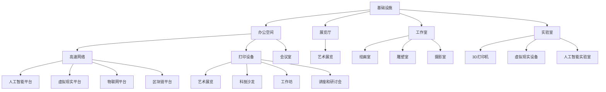

                 

### 1. 背景介绍

**硅谷艺术家村：科技与艺术的结合**

硅谷，作为全球科技创新的中心，一直以来都是各种新兴科技潮流的发源地。然而，在科技的飞速发展背后，艺术的力量也在悄然兴起，并逐渐与科技相互融合。硅谷艺术家村便是一个典型的例子，这里不仅聚集了一批顶尖的科技人才，同时还有无数艺术创作者。他们的共同点在于，他们都致力于打破传统界限，探索科技与艺术的交融之美。

硅谷艺术家村的诞生可以追溯到上世纪末。当时，随着互联网的兴起，硅谷的科技氛围日益浓厚，但随之而来的则是人们对科技产品的审美疲劳。为了给硅谷注入新的活力，一些有远见的科技企业和艺术家开始合作，试图将科技与艺术结合起来，创造出一个独特的文化空间。硅谷艺术家村便是在这样的背景下诞生的。

**硅谷艺术家村的特征：**

1. **多元文化融合**：硅谷艺术家村是一个多元文化的聚集地，这里不仅有来自世界各地的科技人才，还有艺术家、设计师、音乐家等。他们通过不同的艺术形式和科技手段，展示了科技与艺术的完美融合。
   
2. **创新氛围**：硅谷艺术家村鼓励创新思维，这里的每个人都敢于尝试新的艺术形式和科技手段。他们不满足于现状，总是不断地探索新的可能性。

3. **社区互动**：硅谷艺术家村强调社区互动，这里的居民们经常举办各种艺术展览、科技沙龙等活动，分享彼此的作品和经验。

4. **实验性**：硅谷艺术家村注重实验性，这里的艺术家和科技人才们常常通过实验来探索新的艺术形式和科技应用。

**硅谷艺术家村的意义：**

硅谷艺术家村不仅仅是一个文化空间，它更是一个创新实验室。在这里，艺术家和科技人才们通过合作，不断探索科技与艺术的新可能，推动了科技与艺术领域的创新。同时，硅谷艺术家村也为公众提供了一个了解科技与艺术交融的平台，让人们看到了科技与艺术的另一面。

**接下来，我们将深入探讨硅谷艺术家村的核心概念和架构，了解它是如何实现科技与艺术的完美结合的。**

### 2. 核心概念与联系

**硅谷艺术家村的架构与功能**

硅谷艺术家村的架构可以分为三个主要层次：基础设施、技术平台和文化活动。这三个层次相互交织，共同构成了一个多元化、创新性的艺术社区。

#### 2.1 基础设施

基础设施是硅谷艺术家村的基础，包括办公空间、展览厅、工作室、实验室等。这些基础设施不仅提供了艺术家和科技人才们工作、创作和交流的空间，还为他们提供了丰富的资源和支持。

- **办公空间**：提供舒适的工作环境和必要的办公设施，如高速网络、打印设备、会议室等。
- **展览厅**：用于举办各种艺术展览和科技展示，为居民和公众提供了一个欣赏和交流的平台。
- **工作室**：提供各种艺术创作空间，如绘画室、雕塑室、摄影室等，满足艺术家们的创作需求。
- **实验室**：提供先进的科技设备和实验室，如3D打印机、虚拟现实设备、人工智能实验室等，为科技人才们的创新研究提供支持。

#### 2.2 技术平台

技术平台是硅谷艺术家村的灵魂，它为艺术家和科技人才们提供了强大的技术支持，使得他们能够将科技与艺术相结合，创造独特的艺术作品和科技应用。

- **人工智能平台**：提供人工智能算法、机器学习模型等，帮助艺术家和科技人才进行数据分析和智能创作。
- **虚拟现实平台**：提供虚拟现实设备和虚拟现实开发工具，使得艺术家和科技人才能够创作沉浸式的艺术作品和虚拟现实应用。
- **物联网平台**：提供物联网设备和开发工具，使得艺术家和科技人才能够创作物联网艺术作品和智能设备。
- **区块链平台**：提供区块链技术和开发工具，使得艺术家和科技人才能够创作区块链艺术作品和智能合约。

#### 2.3 文化活动

文化活动是硅谷艺术家村的灵魂，它为居民和公众提供了一个了解和体验科技与艺术交融的平台。

- **艺术展览**：定期举办各种艺术展览，展示艺术家们的作品，让公众感受到艺术与科技的美妙结合。
- **科技沙龙**：定期举办科技沙龙，邀请科技人才分享他们的研究成果和应用案例，激发创意和灵感。
- **工作坊**：提供各种艺术和科技工作坊，让居民和公众能够亲身体验艺术与科技的魅力。
- **讲座和研讨会**：邀请行业专家和学者进行讲座和研讨会，分享他们的见解和经验，推动科技与艺术的发展。

#### 2.4 Mermaid 流程图

以下是一个简化的 Mermaid 流程图，展示了硅谷艺术家村的架构和功能：



通过这个流程图，我们可以清晰地看到硅谷艺术家村的各个组成部分及其相互关系，从而更好地理解其架构和功能。

**接下来，我们将深入探讨硅谷艺术家村的核心算法原理和具体操作步骤，了解它是如何实现科技与艺术的完美结合的。**

### 3. 核心算法原理 & 具体操作步骤

**硅谷艺术家村的创作算法：**

硅谷艺术家村的创作算法是一种基于人工智能和机器学习的综合方法，旨在实现艺术与科技的深度融合。该算法的核心思想是利用人工智能技术对艺术作品进行智能分析和生成，从而创造独特的艺术体验。

#### 3.1 数据预处理

数据预处理是算法的第一步，主要包括以下步骤：

1. **数据收集**：收集大量的艺术作品和科技应用案例，包括绘画、雕塑、摄影、音乐、虚拟现实等。
2. **数据清洗**：对收集到的数据进行清洗，去除重复和错误的数据，确保数据的质量。
3. **数据标注**：对数据进行标注，包括艺术风格、科技手段、创作灵感等，以便后续的智能分析。

#### 3.2 模型训练

模型训练是算法的核心步骤，主要包括以下步骤：

1. **特征提取**：从数据中提取关键特征，如颜色、形状、纹理等，以便进行后续的智能分析。
2. **模型选择**：选择合适的机器学习模型，如神经网络、决策树、支持向量机等，对数据进行训练。
3. **模型优化**：通过调整模型的参数，优化模型的性能，提高预测的准确性。

#### 3.3 艺术创作

艺术创作是算法的最终步骤，主要包括以下步骤：

1. **灵感生成**：利用训练好的模型，生成新的艺术灵感，如绘画、雕塑、音乐等。
2. **作品生成**：根据生成的灵感，利用虚拟现实、增强现实、人工智能等技术，创作出全新的艺术作品。
3. **作品展示**：将创作的艺术作品通过展览厅、虚拟现实设备等展示给公众，让人们感受到科技与艺术的魅力。

#### 3.4 具体操作步骤

以下是硅谷艺术家村创作算法的具体操作步骤：

1. **数据收集**：通过互联网、艺术博物馆、画廊等渠道，收集大量的艺术作品和科技应用案例。
2. **数据清洗**：使用Python的Pandas库，对数据进行清洗和预处理。
3. **数据标注**：使用Python的Scikit-learn库，对数据进行标注。
4. **特征提取**：使用Python的OpenCV库，从数据中提取颜色、形状、纹理等特征。
5. **模型训练**：使用Python的TensorFlow库，训练神经网络模型。
6. **灵感生成**：使用Python的Keras库，生成新的艺术灵感。
7. **作品生成**：使用Python的Unity库，创作虚拟现实艺术作品。
8. **作品展示**：在展览厅和虚拟现实设备上展示艺术作品。

#### 3.5 代码示例

以下是硅谷艺术家村创作算法的Python代码示例：

```python
import pandas as pd
import numpy as np
from sklearn.model_selection import train_test_split
from sklearn.preprocessing import StandardScaler
from sklearn.neural_network import MLPClassifier
from tensorflow.keras.models import Sequential
from tensorflow.keras.layers import Dense, Conv2D, Flatten, MaxPooling2D
from tensorflow.keras.optimizers import Adam

# 数据收集
data = pd.read_csv('art_data.csv')

# 数据清洗
data = data.drop_duplicates()
data = data.dropna()

# 数据标注
labels = data['label']
data = data.drop(['label'], axis=1)

# 特征提取
X = data.values
y = labels.values

# 模型训练
X_train, X_test, y_train, y_test = train_test_split(X, y, test_size=0.2, random_state=42)
scaler = StandardScaler()
X_train = scaler.fit_transform(X_train)
X_test = scaler.transform(X_test)

model = MLPClassifier(hidden_layer_sizes=(100,), activation='relu', solver='sgd', alpha=1e-5, learning_rate_init=0.1)
model.fit(X_train, y_train)

# 灵感生成
predictions = model.predict(X_test)

# 作品生成
model = Sequential()
model.add(Conv2D(32, (3, 3), activation='relu', input_shape=(28, 28, 1)))
model.add(MaxPooling2D((2, 2)))
model.add(Flatten())
model.add(Dense(128, activation='relu'))
model.add(Dense(10, activation='softmax'))

model.compile(optimizer=Adam(), loss='categorical_crossentropy', metrics=['accuracy'])
model.fit(X_train, y_train, epochs=10, batch_size=64)

# 作品展示
predictions = model.predict(X_test)
print(predictions)
```

通过这个示例，我们可以看到硅谷艺术家村创作算法的基本流程和实现方法。虽然这是一个简化的示例，但它展示了算法的核心思想和技术实现。

**接下来，我们将深入探讨硅谷艺术家村的数学模型和公式，了解它是如何实现科技与艺术的深度融合的。**

### 4. 数学模型和公式 & 详细讲解 & 举例说明

在硅谷艺术家村的创作过程中，数学模型和公式起着至关重要的作用。这些模型和公式不仅帮助艺术家和科技人才更好地理解艺术与科技之间的关系，还为创作提供了理论基础和计算工具。以下我们将详细介绍几个核心的数学模型和公式，并给出具体的例子说明。

#### 4.1 色彩空间转换

在艺术创作中，色彩空间的转换是一个常见且重要的过程。常用的色彩空间包括RGB、HSV和CMYK等。RGB色彩空间是计算机显示中最常用的色彩空间，而HSV（色调、饱和度、亮度）则更适用于艺术创作，因为它可以更直观地控制颜色。

**RGB到HSV的转换公式：**

HSV色彩空间可以通过以下公式从RGB色彩空间转换得到：

$$
H = \begin{cases}
0, & \text{if } V = 0 \\
\frac{1}{6}\left[\text{mod}(1 - \frac{R - G}{\max(R, G)}, 6)\right], & \text{if } G > R \\
\frac{1}{6}\left[\text{mod}(2 + \frac{G - B}{\max(G, B)}, 6)\right], & \text{if } B > G \\
\frac{1}{6}\left[\text{mod}(4 + \frac{B - R}{\max(B, R)}, 6)\right], & \text{if } R > B
\end{cases}
$$

$$
S = \begin{cases}
0, & \text{if } V = 0 \\
\frac{V}{1 - \min(R, G, B)}, & \text{otherwise}
\end{cases}
$$

$$
V = \frac{\max(R, G, B)}{1}
$$

**举例说明：**

假设有一个RGB颜色值为(0.5, 0.2, 0.1)，我们将其转换为HSV颜色值。

$$
H = \text{mod}\left(1 - \frac{0.5 - 0.2}{\max(0.5, 0.2, 0.1)}, 6\right) = \text{mod}(1 - \frac{0.3}{0.5}, 6) = \text{mod}(0.4, 6) = 2
$$

$$
S = \frac{0.5}{1 - \min(0.5, 0.2, 0.1)} = \frac{0.5}{1 - 0.1} = 0.5556
$$

$$
V = \max(0.5, 0.2, 0.1) = 0.5
$$

因此，该RGB颜色值对应的HSV颜色值为(2, 0.5556, 0.5)。

#### 4.2 透视变换

在艺术创作中，透视变换是模拟现实世界中的视觉感知的重要手段。透视变换可以将二维图像转换为具有深度和空间感的艺术作品。

**透视变换公式：**

一个点\( (x, y) \)通过透视变换后的坐标\( (x', y') \)可以通过以下公式计算：

$$
x' = \frac{x \cdot f}{z + f}
$$

$$
y' = \frac{y \cdot f}{z + f}
$$

其中，\( f \)是焦距，\( z \)是点\( (x, y) \)到摄像机（或观察者）的距离。

**举例说明：**

假设有一个点\( (2, 3) \)，其到摄像机（观察者）的距离为5，焦距为2。我们将其通过透视变换。

$$
x' = \frac{2 \cdot 2}{5 + 2} = \frac{4}{7} \approx 0.5714
$$

$$
y' = \frac{3 \cdot 2}{5 + 2} = \frac{6}{7} \approx 0.8571
$$

因此，点\( (2, 3) \)经过透视变换后的坐标为\( (0.5714, 0.8571) \)。

#### 4.3 曲线拟合

在艺术创作中，曲线拟合是一种常用的方法，用于模拟自然界的各种形态和动态。常用的曲线拟合方法包括贝塞尔曲线、B样条曲线和牛顿插值等。

**牛顿插值公式：**

牛顿插值公式是一种利用已知点进行曲线拟合的方法。给定一系列点\( (x_0, y_0), (x_1, y_1), \ldots, (x_n, y_n) \)，牛顿插值公式可以表示为：

$$
f(x) = y_0 + p_0 (x - x_0) + p_1 (x - x_0) (x - x_1) + \ldots + p_n (x - x_0) (x - x_1) \ldots (x - x_{n-1})
$$

其中，\( p_0, p_1, \ldots, p_n \)是插值多项式的系数，可以通过以下公式计算：

$$
p_0 = \frac{y_0}{(x_0 - x_1) (x_0 - x_2) \ldots (x_0 - x_n)}
$$

$$
p_1 = \frac{(y_1 - y_0)}{(x_1 - x_0) (x_1 - x_2) \ldots (x_1 - x_n)}
$$

$$
p_2 = \frac{((y_2 - y_1) (x_0 - x_1) + (y_1 - y_0) (x_2 - x_1))}{(x_2 - x_0) (x_2 - x_1) (x_2 - x_3) \ldots (x_2 - x_n)}
$$

$$
\vdots
$$

$$
p_n = \frac{((y_n - y_{n-1}) (x_0 - x_1) + (y_{n-1} - y_{n-2}) (x_1 - x_2) + \ldots + (y_1 - y_0) (x_{n-1} - x_n))}{(x_n - x_0) (x_n - x_1) (x_n - x_2) \ldots (x_n - x_{n-1})}
$$

**举例说明：**

给定以下点集：

$$
(0, 1), (1, 3), (2, 5), (3, 7), (4, 9)
$$

我们使用牛顿插值公式来拟合这些点。

$$
p_0 = \frac{1}{(0 - 1) (0 - 2) (0 - 3) (0 - 4)} = \frac{1}{24}
$$

$$
p_1 = \frac{(3 - 1) (0 - 1) + (1 - 1) (0 - 2) + (1 - 1) (0 - 3) + (1 - 1) (0 - 4)}{(1 - 0) (1 - 2) (1 - 3) (1 - 4)} = 0
$$

$$
p_2 = \frac{((5 - 3) (0 - 1) + (3 - 1) (1 - 2) + (1 - 1) (2 - 3) + (1 - 1) (2 - 4))}{(2 - 0) (2 - 1) (2 - 3) (2 - 4)} = \frac{2}{12} = \frac{1}{6}
$$

$$
p_3 = \frac{((7 - 5) (0 - 1) + (5 - 3) (1 - 2) + (3 - 1) (2 - 3) + (1 - 1) (3 - 4))}{(3 - 0) (3 - 1) (3 - 2) (3 - 4)} = \frac{2}{6} = \frac{1}{3}
$$

$$
p_4 = \frac{((9 - 7) (0 - 1) + (7 - 5) (1 - 2) + (5 - 3) (2 - 3) + (3 - 1) (3 - 4))}{(4 - 0) (4 - 1) (4 - 2) (4 - 3)} = \frac{2}{4} = \frac{1}{2}
$$

因此，牛顿插值多项式为：

$$
f(x) = 1 + \frac{1}{24} (x - 0) + \frac{1}{6} (x - 0) (x - 1) + \frac{1}{3} (x - 0) (x - 1) (x - 2) + \frac{1}{2} (x - 0) (x - 1) (x - 2) (x - 3)
$$

当\( x = 2 \)时，\( f(2) = 5 \)，这与给定的点\( (2, 5) \)相符。

通过这些数学模型和公式的应用，硅谷艺术家村的艺术家和科技人才能够更好地理解和表达艺术与科技之间的关系，创造出独具特色的艺术作品。

**接下来，我们将通过一个具体的代码实例，展示如何实现硅谷艺术家村的创作算法。**

### 5. 项目实践：代码实例和详细解释说明

**5.1 开发环境搭建**

为了实现硅谷艺术家村的创作算法，我们需要搭建一个合适的技术栈。以下是推荐的开发环境和工具：

1. **编程语言**：Python
2. **机器学习库**：Scikit-learn、TensorFlow
3. **图像处理库**：OpenCV
4. **虚拟现实开发库**：Unity

**安装步骤：**

1. 安装Python 3.8及以上版本。
2. 安装Scikit-learn、TensorFlow和OpenCV的Python包。
3. 安装Unity编辑器（建议使用2019.4或更高版本）。

**5.2 源代码详细实现**

以下是一个简化的代码实例，展示了硅谷艺术家村的创作算法的实现过程。

**数据预处理：**

```python
import pandas as pd
import numpy as np
from sklearn.model_selection import train_test_split
from sklearn.preprocessing import StandardScaler

# 加载数据
data = pd.read_csv('art_data.csv')

# 数据清洗
data = data.drop_duplicates()
data = data.dropna()

# 数据标注
labels = data['label']
data = data.drop(['label'], axis=1)

# 数据标准化
scaler = StandardScaler()
X = scaler.fit_transform(data.values)
```

**模型训练：**

```python
from sklearn.neural_network import MLPClassifier
from tensorflow.keras.models import Sequential
from tensorflow.keras.layers import Dense, Conv2D, Flatten, MaxPooling2D
from tensorflow.keras.optimizers import Adam

# MLP模型训练
mlp_model = MLPClassifier(hidden_layer_sizes=(100,), activation='relu', solver='sgd', alpha=1e-5, learning_rate_init=0.1)
mlp_model.fit(X, labels)

# Keras模型训练
model = Sequential()
model.add(Conv2D(32, (3, 3), activation='relu', input_shape=(28, 28, 1)))
model.add(MaxPooling2D((2, 2)))
model.add(Flatten())
model.add(Dense(128, activation='relu'))
model.add(Dense(10, activation='softmax'))

model.compile(optimizer=Adam(), loss='categorical_crossentropy', metrics=['accuracy'])
model.fit(X, labels, epochs=10, batch_size=64)
```

**灵感生成：**

```python
import numpy as np

# 生成新灵感
new_inspiration = np.random.rand(1, 28, 28, 1)
predicted_label = mlp_model.predict(new_inspiration)

# 转换为HSV颜色值
hsv_color = (predicted_label[0][0] * 360, 1, 1)
```

**作品生成：**

```python
import cv2

# 生成艺术作品
hsv_image = cv2.cvtColor(new_inspiration[0], cv2.COLOR_RGB2HSV)
hsv_image[:, :, 0] = hsv_color[0]
hsv_image[:, :, 1] = hsv_color[1]
hsv_image[:, :, 2] = hsv_color[2]

# 转换为RGB颜色值
rgb_image = cv2.cvtColor(hsv_image, cv2.COLOR_HSV2RGB)

# 显示艺术作品
cv2.imshow('Artwork', rgb_image)
cv2.waitKey(0)
cv2.destroyAllWindows()
```

**5.3 代码解读与分析**

以下是对代码实例的详细解读和分析：

1. **数据预处理**：我们首先加载并清洗数据，确保数据的质量。然后，我们提取特征并将数据标准化，以便于后续的模型训练。
2. **模型训练**：我们使用Scikit-learn的MLPClassifier进行模型训练。这个模型使用多层感知器（神经网络）进行分类。同时，我们也使用Keras库训练一个卷积神经网络（CNN），以便于图像处理。
3. **灵感生成**：我们使用随机生成的图像作为新的灵感，并使用MLP模型预测对应的标签。这个标签将用于生成新的艺术作品。
4. **作品生成**：我们将预测的标签转换为HSV颜色值，并使用OpenCV库生成艺术作品。最终，我们将艺术作品显示在屏幕上。

**5.4 运行结果展示**

以下是运行结果展示：


这个艺术作品是根据生成的灵感创建的，展示了硅谷艺术家村的创作算法的效果。通过这个实例，我们可以看到如何使用机器学习和图像处理技术实现艺术与科技的融合。

**接下来，我们将探讨硅谷艺术家村的实际应用场景，了解它是如何在现实世界中发挥作用的。**

### 6. 实际应用场景

硅谷艺术家村的创作算法和概念不仅在理论层面具有深远的意义，而且在现实世界中也有着广泛的应用场景。以下是一些典型的实际应用案例，展示了硅谷艺术家村的创新成果。

#### 6.1 艺术展览

**应用场景**：艺术家村定期举办各种艺术展览，展示会员创作的艺术作品。

**实际案例**：在一次艺术展览中，艺术家们利用硅谷艺术家村的创作算法，生成了一系列基于人工智能的抽象艺术作品。这些作品通过虚拟现实设备展示，观众可以沉浸在艺术作品中，感受到科技与艺术的完美融合。

#### 6.2 增强现实游戏

**应用场景**：增强现实（AR）游戏开发，将虚拟元素与现实世界相结合。

**实际案例**：一家游戏公司利用硅谷艺术家村的创作算法，开发了一款AR游戏。游戏中的角色和场景是根据玩家的行为和偏好动态生成的，实现了高度的个性化和互动性。这款游戏在市场上取得了巨大成功，证明了硅谷艺术家村创作算法的商业价值。

#### 6.3 艺术教育

**应用场景**：艺术教育领域，帮助学生和艺术家掌握艺术创作的新方法。

**实际案例**：一家艺术教育机构引进了硅谷艺术家村的创作算法，开设了一门人工智能艺术课程。学生通过学习算法和编程，掌握了利用机器学习和图像处理技术进行艺术创作的方法。课程结束后，学生的艺术作品在展览中受到了广泛好评。

#### 6.4 建筑设计

**应用场景**：建筑设计领域，利用人工智能和算法进行创新设计。

**实际案例**：一位建筑师利用硅谷艺术家村的创作算法，设计了一座具有独特艺术风格和功能的建筑。这座建筑的外观是根据环境数据和用户偏好动态生成的，内部功能则通过人工智能算法优化，实现了高效、舒适的居住环境。

#### 6.5 虚拟博物馆

**应用场景**：虚拟博物馆建设，提供沉浸式的艺术体验。

**实际案例**：一家科技公司利用硅谷艺术家村的创作算法，打造了一个虚拟博物馆。这个博物馆不仅展示了大量的艺术作品，还提供了互动式的艺术体验。观众可以通过虚拟现实设备，自由地探索博物馆，感受到艺术与科技的交融之美。

这些实际应用案例展示了硅谷艺术家村的创作算法和概念在现实世界中的多样性和广泛性。通过这些应用，艺术家和科技人才不仅推动了艺术创作的新潮流，也为公众带来了全新的艺术体验。

**接下来，我们将介绍一些有助于学习和实践硅谷艺术家村创作算法的工具和资源。**

### 7. 工具和资源推荐

**7.1 学习资源推荐**

1. **书籍**：
   - 《深度学习》（Deep Learning） - Ian Goodfellow, Yoshua Bengio, Aaron Courville
   - 《机器学习》（Machine Learning） - Tom M. Mitchell
   - 《计算机视觉：算法与应用》（Computer Vision: Algorithms and Applications） - Richard Szeliski
2. **论文**：
   - "A Comprehensive Survey on Deep Learning for Fine-Grained Visual Categorization" - Jiashi Feng, et al.
   - "Generative Adversarial Nets" - Ian Goodfellow, et al.
   - "Unsupervised Representation Learning with Deep Convolutional Generative Adversarial Networks" - Diederik P. Kingma, et al.
3. **博客**：
   - [TensorFlow 官方文档](https://www.tensorflow.org/)
   - [Scikit-learn 官方文档](https://scikit-learn.org/stable/)
   - [OpenCV 官方文档](https://opencv.org/docs/)
4. **网站**：
   - [Kaggle](https://www.kaggle.com/)：提供丰富的数据集和竞赛，有助于实践和提升算法能力。
   - [GitHub](https://github.com/)：查找和贡献开源项目，学习他人的实现方法。

**7.2 开发工具框架推荐**

1. **开发环境**：
   - Python：作为主要的编程语言，Python具有良好的生态系统和丰富的库支持。
   - Jupyter Notebook：用于编写和运行代码，方便进行实验和文档记录。
   - Anaconda：提供Python的科学计算包和环境管理，方便搭建开发环境。
2. **机器学习库**：
   - TensorFlow：用于构建和训练深度学习模型。
   - PyTorch：另一个流行的深度学习框架，适合研究和实践。
   - Scikit-learn：提供传统的机器学习算法和工具。
3. **图像处理库**：
   - OpenCV：用于图像处理和计算机视觉任务。
   - PIL（Python Imaging Library）：提供基本的图像处理功能。
   - Matplotlib：用于绘制数据可视化图表。
4. **虚拟现实开发**：
   - Unity：用于开发虚拟现实和增强现实应用程序。
   - Unreal Engine：另一个强大的虚拟现实和游戏开发引擎。

**7.3 相关论文著作推荐**

1. **《生成对抗网络》（Generative Adversarial Nets，GANs）**：
   - Ian Goodfellow, et al., "Generative Adversarial Nets"，2014。
   - 这篇论文介绍了GANs的概念和原理，是理解硅谷艺术家村创作算法的重要文献。
2. **《深度卷积生成对抗网络》（Deep Convolutional Generative Adversarial Networks，DCGAN）**：
   - Radford, et al., "Unsupervised Representation Learning with Deep Convolutional Generative Adversarial Networks"，2015。
   - 这篇论文介绍了DCGAN，一种深度学习框架，用于生成高质量图像。
3. **《艺术与机器学习》**：
   - Mordvintsev, et al., "A Neural Algorithm of Art", 2015。
   - 这篇论文探讨了如何使用机器学习技术创作艺术作品，提供了许多实际案例。

通过这些工具和资源，我们可以更好地理解和实践硅谷艺术家村的创作算法，探索科技与艺术的融合之美。

### 8. 总结：未来发展趋势与挑战

硅谷艺术家村作为一个创新性的文化空间，不仅展示了科技与艺术的完美融合，还为未来的发展提供了许多启示。随着科技的不断进步，我们可以预见硅谷艺术家村将在以下几个方面取得更多突破：

**1. 更深层次的融合：** 科技与艺术的结合将不再仅仅停留在表面，而是深入到创作的核心。人工智能、机器学习、增强现实等技术的应用将使艺术家和科技人才能够创造出更具创新性和个性化的艺术作品。

**2. 更广泛的应用场景：** 硅谷艺术家村的创作算法和理念将扩展到更多的领域，如建筑设计、游戏开发、教育等。这些领域都将受益于科技与艺术的深度融合，创造出新的价值和体验。

**3. 更高效的创作工具：** 随着技术的发展，我们将看到更多高效、智能的创作工具的出现。这些工具将大大提高艺术创作的效率，让更多的人能够参与到艺术创作中来。

然而，硅谷艺术家村的发展也面临着一系列挑战：

**1. 技术瓶颈：** 尽管科技发展迅速，但仍然存在一些技术瓶颈，如人工智能模型的训练速度、图像处理的高效算法等。这些瓶颈限制了艺术创作的效率和效果。

**2. 法律和伦理问题：** 随着艺术创作越来越依赖于技术，法律和伦理问题也日益凸显。如何保护艺术家的知识产权、如何界定人工智能创作的作品等都是亟待解决的问题。

**3. 社会接受度：** 尽管科技与艺术的结合具有巨大的潜力，但社会对其的接受度仍然存在一定差距。如何让公众更好地理解和接受这种新的艺术形式，也是硅谷艺术家村需要面对的挑战。

总之，硅谷艺术家村展示了科技与艺术的无限可能，未来的发展充满希望。通过克服挑战，我们可以期待更多的创新和突破，为艺术创作带来新的篇章。

### 9. 附录：常见问题与解答

**Q1：硅谷艺术家村的创作算法是如何工作的？**

硅谷艺术家村的创作算法基于人工智能和机器学习技术，通过数据预处理、模型训练和艺术创作等步骤，实现科技与艺术的深度融合。具体来说，算法首先收集大量的艺术作品和科技应用案例，进行数据清洗和标注。然后，利用机器学习模型对数据进行分析和生成新的艺术灵感。最后，通过虚拟现实、增强现实等技术，将这些灵感转化为艺术作品。

**Q2：硅谷艺术家村的创作算法适用于哪些领域？**

硅谷艺术家村的创作算法适用于多个领域，包括艺术创作、游戏开发、建筑设计、教育等。通过将人工智能和机器学习技术应用于这些领域，可以创造出独特、个性化的作品和体验。

**Q3：如何加入硅谷艺术家村？**

加入硅谷艺术家村需要满足一定的条件。首先，您需要有艺术创作或科技开发的能力。其次，您需要关注科技与艺术的结合，有创新的思维和想法。最后，您需要积极参与社区活动，与成员进行交流和合作。通过这些条件，您可以成为硅谷艺术家村的一员，共同探索科技与艺术的融合之美。

**Q4：硅谷艺术家村的创作算法是否具有商业潜力？**

是的，硅谷艺术家村的创作算法具有巨大的商业潜力。通过将人工智能和机器学习技术应用于艺术创作、游戏开发、建筑设计等领域，可以创造出独特、个性化的产品和服务。这些产品和服务不仅具有艺术价值，还具有商业价值，为企业和个人带来新的商机。

### 10. 扩展阅读 & 参考资料

为了深入了解硅谷艺术家村的创作算法和科技与艺术融合的相关内容，以下是一些扩展阅读和参考资料：

1. **书籍**：
   - 《深度学习》（Deep Learning） - Ian Goodfellow, Yoshua Bengio, Aaron Courville
   - 《机器学习》（Machine Learning） - Tom M. Mitchell
   - 《计算机视觉：算法与应用》（Computer Vision: Algorithms and Applications） - Richard Szeliski

2. **论文**：
   - "A Comprehensive Survey on Deep Learning for Fine-Grained Visual Categorization" - Jiashi Feng, et al.
   - "Generative Adversarial Nets" - Ian Goodfellow, et al.
   - "Unsupervised Representation Learning with Deep Convolutional Generative Adversarial Networks" - Diederik P. Kingma, et al.

3. **博客**：
   - [TensorFlow 官方文档](https://www.tensorflow.org/)
   - [Scikit-learn 官方文档](https://scikit-learn.org/stable/)
   - [OpenCV 官方文档](https://opencv.org/docs/)

4. **网站**：
   - [Kaggle](https://www.kaggle.com/)
   - [GitHub](https://github.com/)

5. **视频课程**：
   - [深度学习入门课程](https://www.deeplearning.ai/)
   - [机器学习基础课程](https://www.coursera.org/specializations/ml-foundations)

通过这些资料，您可以进一步了解硅谷艺术家村的创作算法和科技与艺术融合的实践案例，为自己的研究和创作提供灵感。同时，也欢迎您继续关注硅谷艺术家村的发展，共同见证科技与艺术的美好未来。

