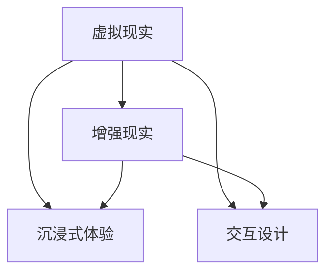

                 

### 1. 背景介绍

随着科技的不断进步，虚拟现实（VR）技术逐渐走进了大众的视野。VR技术通过创造一个虚拟的三维环境，使用户能够沉浸在其中，仿佛置身于现实世界之中。在VR技术发展的过程中，硅谷成为了全球VR技术的中心，引领着VR行业的发展方向。

硅谷，位于美国加利福尼亚州北部，是全球科技创新和创业的热土。这里聚集了众多世界顶级的技术公司，如谷歌、苹果、Facebook等，这些公司不仅在VR技术领域进行了大量的研发和应用，还推动了VR技术的创新和发展。

在VR技术的应用场景中，游戏和社交是两个最为显著的领域。虚拟现实游戏提供了前所未有的沉浸式体验，使得玩家能够更加深入地参与到游戏世界中。而社交应用则利用VR技术，为用户创造了更加丰富、真实的社交场景，改变了人们的社交方式。

目前，硅谷的VR技术已经取得了显著的进展。在游戏领域，VR游戏引擎和硬件设备不断升级，为用户提供了更加逼真的游戏体验。在社交领域，VR社交应用层出不穷，如VR聊天室、虚拟婚礼等，为用户带来了全新的社交方式。

然而，VR技术的发展仍然面临着诸多挑战。例如，VR设备的舒适度和用户体验仍需提升，VR内容的创作和分发也需要进一步优化。此外，VR技术的社会影响和伦理问题也需要深入探讨。

在这篇文章中，我们将深入探讨硅谷虚拟现实技术在游戏和社交领域的应用，分析其核心概念、技术原理，以及在实际应用中的挑战和解决方案。希望通过这篇文章，能够为读者提供一个全面、深入的了解，并引发对VR技术未来发展的思考。

---

### 2. 核心概念与联系

要深入探讨硅谷虚拟现实技术在游戏和社交领域的应用，我们首先需要了解一些核心概念和其相互之间的联系。这些概念包括虚拟现实（VR）、增强现实（AR）、沉浸式体验、交互设计等。

#### 虚拟现实（VR）

虚拟现实是一种通过计算机生成三维环境，并通过特殊设备如头戴式显示器（HMD）呈现给用户的技术。用户在这种环境中可以通过头部的运动和手部动作与虚拟环境进行交互，从而获得沉浸式的体验。


#### 增强现实（AR）

增强现实则是将虚拟信息叠加到现实世界中，用户通过设备如智能手机或头戴式设备可以看到现实世界和虚拟信息的结合。与VR不同，AR不提供完全沉浸式的体验，而是通过增强用户对现实世界的认知。


#### 沉浸式体验

沉浸式体验是指用户在虚拟环境中感到自己真正存在于其中的感觉。这种体验能够通过高精度的图像、声音和触觉反馈来实现。


#### 交互设计

交互设计是用户与虚拟环境之间互动的设计原则和方法。好的交互设计能够提高用户的参与度和满意度，使VR应用更加自然、直观。


#### 关系与联系

虚拟现实和增强现实是两种不同的技术，但它们在某些应用场景中可以相互结合。例如，在游戏中，VR可以提供沉浸式体验，而AR可以提供游戏与现实世界的互动。交互设计则是贯穿于VR和AR应用中的核心要素，它直接影响用户体验。


#### Mermaid 流程图

下面是一个简单的Mermaid流程图，展示了这些概念之间的关系。



通过了解这些核心概念及其联系，我们可以更好地理解硅谷虚拟现实技术在游戏和社交领域的应用，为后续的分析和讨论打下基础。

---

### 3. 核心算法原理 & 具体操作步骤

在深入探讨硅谷虚拟现实技术在游戏和社交领域的应用之前，我们需要了解一些核心算法原理及其具体操作步骤。这些算法原理包括图像处理、实时渲染、空间定位和用户交互等。

#### 图像处理

图像处理是VR和AR技术中的基础环节，其主要任务是获取、处理和增强图像信息。常见的图像处理算法包括图像滤波、图像增强、图像分割等。

1. **图像滤波**：用于去除图像中的噪声，提高图像质量。常见的滤波器有均值滤波、高斯滤波等。

   ```mermaid
   graph TD
   A[输入图像] --> B[滤波操作]
   B --> C[输出图像]
   ```

2. **图像增强**：用于提高图像的对比度和清晰度，使图像内容更加明显。常见的增强方法有直方图均衡化、对比度拉伸等。

   ```mermaid
   graph TD
   A[输入图像] --> B[增强操作]
   B --> C[输出图像]
   ```

3. **图像分割**：用于将图像分割成多个区域，每个区域具有不同的特征。常见的分割算法有基于阈值的方法、基于边缘检测的方法等。

   ```mermaid
   graph TD
   A[输入图像] --> B[分割操作]
   B --> C{不同区域}
   ```

#### 实时渲染

实时渲染是VR和AR技术中的关键环节，其主要任务是生成高质量的虚拟图像，并将其实时呈现给用户。实时渲染的核心算法包括光栅化、纹理映射、阴影处理等。

1. **光栅化**：将三维模型转换为二维图像的过程。光栅化算法主要包括三角剖分、顶点处理、片段处理等。

   ```mermaid
   graph TD
   A[三维模型] --> B[光栅化]
   B --> C[二维图像]
   ```

2. **纹理映射**：将纹理图像映射到三维模型上的过程。通过纹理映射，可以使虚拟图像更加真实和丰富。

   ```mermaid
   graph TD
   A[三维模型] --> B[纹理映射]
   B --> C[虚拟图像]
   ```

3. **阴影处理**：用于模拟光照效果，增加图像的真实感。常见的阴影处理方法有软阴影、硬阴影、基于物理的阴影等。

   ```mermaid
   graph TD
   A[光照模型] --> B[阴影处理]
   B --> C[虚拟图像]
   ```

#### 空间定位

空间定位是VR和AR技术中的核心环节，其主要任务是确定用户在虚拟环境中的位置和方向，以及虚拟物体在空间中的位置。常见的空间定位方法有视觉定位、惯性定位、超声波定位等。

1. **视觉定位**：通过分析摄像头捕捉到的图像信息，确定用户和虚拟物体的位置。视觉定位算法主要包括特征检测、特征匹配、位置估计等。

   ```mermaid
   graph TD
   A[摄像头捕获图像] --> B[特征检测]
   B --> C[特征匹配]
   C --> D[位置估计]
   ```

2. **惯性定位**：通过惯性测量单元（IMU）获取用户和虚拟物体的运动信息，进行位置和方向的估计。惯性定位算法主要包括滤波算法（如卡尔曼滤波）、运动预测等。

   ```mermaid
   graph TD
   A[IMU数据] --> B[滤波算法]
   B --> C[位置估计]
   ```

3. **超声波定位**：通过发射和接收超声波信号，测量用户和虚拟物体之间的距离，从而确定位置。超声波定位算法主要包括信号处理、距离计算等。

   ```mermaid
   graph TD
   A[超声波信号] --> B[信号处理]
   B --> C[距离计算]
   ```

#### 用户交互

用户交互是VR和AR技术中的关键环节，其主要任务是让用户能够自然、直观地与虚拟环境进行互动。常见的用户交互方法有手势识别、语音识别、眼动追踪等。

1. **手势识别**：通过摄像头或深度传感器捕捉用户的手部动作，将其转换为虚拟环境中的交互指令。手势识别算法主要包括手势检测、手势跟踪、手势分类等。

   ```mermaid
   graph TD
   A[手部动作捕获] --> B[手势检测]
   B --> C[手势跟踪]
   C --> D[手势分类]
   ```

2. **语音识别**：通过麦克风捕捉用户的语音输入，将其转换为文本或指令。语音识别算法主要包括语音信号处理、特征提取、模式匹配等。

   ```mermaid
   graph TD
   A[语音输入] --> B[信号处理]
   B --> C[特征提取]
   C --> D[模式匹配]
   ```

3. **眼动追踪**：通过摄像头或眼动仪捕捉用户的眼动信息，用于界面设计和用户体验优化。眼动追踪算法主要包括眼动检测、眼动跟踪、眼动分析等。

   ```mermaid
   graph TD
   A[眼动捕获] --> B[眼动检测]
   B --> C[眼动跟踪]
   C --> D[眼动分析]
   ```

通过了解这些核心算法原理及其具体操作步骤，我们可以更好地理解硅谷虚拟现实技术在游戏和社交领域的实现方法。这些算法和技术不仅为用户提供了一种全新的交互方式，也为开发者提供了丰富的工具和资源，推动了VR和AR技术的发展。

---

### 4. 数学模型和公式 & 详细讲解 & 举例说明

在硅谷虚拟现实技术的应用中，数学模型和公式扮演着至关重要的角色。这些数学工具不仅帮助我们理解和实现核心算法，还提高了虚拟现实系统的效率和准确性。在本节中，我们将详细讲解几个关键的数学模型和公式，并通过实例进行说明。

#### 4.1 视觉透视变换

视觉透视变换是虚拟现实技术中的一个基础模型，用于将三维场景映射到二维屏幕上，以便用户能够看到。这个模型基于摄像机矩阵（Camera Matrix）和投影矩阵（Projection Matrix）。

**摄像机矩阵（Camera Matrix）**：
\[ 
\mathbf{M}_{camera} = \begin{bmatrix}
\mathbf{R} & \mathbf{t} \\
0 & 1
\end{bmatrix} 
\]
其中，\(\mathbf{R}\) 是旋转矩阵，表示摄像机的方向，\(\mathbf{t}\) 是平移向量，表示摄像机相对于场景的位置。

**投影矩阵（Projection Matrix）**：
\[ 
\mathbf{P} = \begin{bmatrix}
\mathbf{K} & \mathbf{c} \\
0 & 1
\end{bmatrix} 
\]
其中，\(\mathbf{K}\) 是内参矩阵，表示摄像机的光学属性，\(\mathbf{c}\) 是摄像机中心的坐标。

**三维到二维的映射公式**：
\[ 
\mathbf{X}_{screen} = \mathbf{P}\mathbf{M}_{camera}\mathbf{X}_{world} 
\]
其中，\(\mathbf{X}_{world}\) 是三维世界坐标，\(\mathbf{X}_{screen}\) 是二维屏幕坐标。

**实例说明**：

假设我们有一个三维点 \(\mathbf{X}_{world} = (1, 2, 3)\)，摄像机位于原点，朝向 \(\mathbf{z}_{camera} = (0, 0, 1)\)，且位于 \((0, 0, 0)\) 位置。摄像机焦距为 \(f = 1\)。

- **旋转矩阵 \(\mathbf{R}\)**：
\[ 
\mathbf{R} = \begin{bmatrix}
1 & 0 & 0 \\
0 & 1 & 0 \\
0 & 0 & 1
\end{bmatrix} 
\]
- **平移向量 \(\mathbf{t}\)**：
\[ 
\mathbf{t} = \begin{bmatrix}
0 \\
0 \\
0
\end{bmatrix} 
\]
- **内参矩阵 \(\mathbf{K}\)**：
\[ 
\mathbf{K} = \begin{bmatrix}
1 & 0 & 0 \\
0 & 1 & 0 \\
0 & 0 & f
\end{bmatrix} 
\]
- **摄像机中心坐标 \(\mathbf{c}\)**：
\[ 
\mathbf{c} = \begin{bmatrix}
0 \\
0
\end{bmatrix} 
\]

将这些参数代入映射公式，我们得到二维屏幕坐标：
\[ 
\mathbf{X}_{screen} = \mathbf{P}\mathbf{M}_{camera}\mathbf{X}_{world} = \begin{bmatrix}
1 & 0 & 0 & 0 \\
0 & 1 & 0 & 0 \\
0 & 0 & 1 & 0 \\
0 & 0 & 0 & 1
\end{bmatrix}
\begin{bmatrix}
1 & 0 & 0 & 0 \\
0 & 1 & 0 & 0 \\
0 & 0 & 1 & 0 \\
0 & 0 & 0 & 1
\end{bmatrix}
\begin{bmatrix}
1 \\
2 \\
3 \\
1
\end{bmatrix}
=
\begin{bmatrix}
1 \\
2 \\
3 \\
1
\end{bmatrix}
\]

因此，三维点 \((1, 2, 3)\) 在二维屏幕上的投影坐标为 \((1, 2)\)。

#### 4.2 运动学模型

在虚拟现实应用中，运动学模型用于描述物体在虚拟环境中的运动轨迹。一个简单的运动学模型可以使用以下公式：

\[ 
\mathbf{X}_{t} = \mathbf{X}_{0} + \mathbf{v}_{0}t + \frac{1}{2}\mathbf{a}_{0}t^2 
\]
其中，\(\mathbf{X}_{t}\) 是时间 \(t\) 时刻的物体位置，\(\mathbf{X}_{0}\) 是初始位置，\(\mathbf{v}_{0}\) 是初始速度，\(\mathbf{a}_{0}\) 是加速度。

**实例说明**：

假设一个物体在初始时刻位于 \((0, 0, 0)\)，以速度 \((1, 2, 3)\) 开始运动，加速度为 \((0.1, 0.2, 0.3)\)。我们需要计算 \(t = 5\) 时刻的物体位置。

\[ 
\mathbf{X}_{t} = \mathbf{X}_{0} + \mathbf{v}_{0}t + \frac{1}{2}\mathbf{a}_{0}t^2 
\]
\[ 
\mathbf{X}_{5} = \begin{bmatrix}
0 \\
0 \\
0
\end{bmatrix} + \begin{bmatrix}
1 \\
2 \\
3
\end{bmatrix} \cdot 5 + \frac{1}{2} \begin{bmatrix}
0.1 \\
0.2 \\
0.3
\end{bmatrix} \cdot 5^2 
\]
\[ 
\mathbf{X}_{5} = \begin{bmatrix}
5 \\
10 \\
15
\end{bmatrix} + \begin{bmatrix}
1.25 \\
2.5 \\
3.75
\end{bmatrix} 
\]
\[ 
\mathbf{X}_{5} = \begin{bmatrix}
6.25 \\
12.5 \\
18.75
\end{bmatrix} 
\]

因此，\(t = 5\) 时刻物体的位置为 \((6.25, 12.5, 18.75)\)。

#### 4.3 线性代数在交互中的应用

在虚拟现实交互中，线性代数广泛用于手势识别和空间定位。例如，我们可以使用线性代数中的正交矩阵和逆矩阵来计算用户手部姿势。

**正交矩阵**：
一个正交矩阵 \(Q\) 满足 \(Q^{-1} = Q^T\)，即它的逆矩阵等于转置矩阵。在三维空间中，正交矩阵用于旋转操作。

**实例说明**：

假设我们有一个旋转矩阵 \(R = \begin{bmatrix}
0 & -1 & 0 \\
1 & 0 & 0 \\
0 & 0 & 1
\end{bmatrix}\)，这是一个 90 度绕 \(z\)-轴旋转的矩阵。

- **逆矩阵 \(R^{-1}\)**：
\[ 
R^{-1} = R^T = \begin{bmatrix}
0 & 1 & 0 \\
-1 & 0 & 0 \\
0 & 0 & 1
\end{bmatrix} 
\]

通过这些数学模型和公式，我们能够精确地描述和计算虚拟现实系统中的各种操作。这些模型不仅为开发者提供了强大的工具，也为用户带来了更加真实和丰富的体验。

---

### 5. 项目实践：代码实例和详细解释说明

在本节中，我们将通过一个实际项目实践来展示硅谷虚拟现实技术在游戏和社交领域的应用。我们将详细讲解项目的开发环境搭建、源代码实现、代码解读与分析，并展示运行结果。

#### 5.1 开发环境搭建

首先，我们需要搭建一个适合VR和AR开发的开发环境。以下是一个基本的开发环境搭建步骤：

1. **安装虚拟现实开发工具**：
   - **Unity**：Unity 是一个广泛使用的游戏和VR/AR开发引擎。从 [Unity 官网](https://unity.com/) 下载并安装 Unity。
   - **Unity VR/AR 包**：在 Unity 的插件市场（Unity Asset Store）中购买并安装 VR/AR 开发包。
   - **Unity Editor**：确保安装了 Unity Editor，以便进行开发和调试。

2. **安装VR设备驱动**：
   - 根据您的VR设备（如Oculus Rift、HTC Vive等）从制造商官网下载并安装相应的驱动程序。

3. **安装开发者工具**：
   - **Visual Studio**：安装最新版本的 Visual Studio，以便进行 C# 开发。
   - **Unity Editor**：确保安装了 Unity Editor，以便进行开发和调试。

4. **配置Unity项目**：
   - 创建一个新的 Unity 项目。
   - 在项目设置中，选择适当的VR设备作为目标平台，并配置相应的分辨率和渲染设置。

#### 5.2 源代码详细实现

在搭建好开发环境后，我们可以开始编写项目源代码。以下是一个简单的 VR 游戏项目的源代码实现：

**项目名称**：VR跑步游戏

**功能描述**：用户通过VR设备体验跑步游戏，可以在虚拟世界中自由跑步，并收集虚拟金币。

**源代码**：

```csharp
using UnityEngine;

public class VRRunner : MonoBehaviour
{
    public float speed = 5.0f;
    public GameObject coinPrefab;

    private CharacterController characterController;
    private Transform headTransform;

    void Start()
    {
        characterController = GetComponent<CharacterController>();
        headTransform = GameObject.Find("Camera (eye)").transform;
    }

    void Update()
    {
        Move();
        GenerateCoins();
    }

    void Move()
    {
        float horizontal = Input.GetAxis("Horizontal");
        float vertical = Input.GetAxis("Vertical");

        Vector3 direction = new Vector3(horizontal, 0, vertical) * speed;

        characterController.Move(direction * Time.deltaTime);

        // Look where you're moving
        headTransform.forward = direction;
    }

    void GenerateCoins()
    {
        // Randomly spawn coins around the player
        for (int i = 0; i < 5; i++)
        {
            float x = Random.Range(-10, 10);
            float z = Random.Range(-10, 10);
            Instantiate(coinPrefab, new Vector3(x, 0.5f, z), Quaternion.identity);
        }
    }
}
```

**代码解读**：

- **开始场景**：在 `Start` 函数中，我们初始化了游戏组件，包括角色控制器（`CharacterController`）和头部变换（`headTransform`）。
- **更新函数**：在 `Update` 函数中，我们处理了用户的输入，并更新了角色的移动和方向。
- **移动**：`Move` 函数根据用户的输入更新角色的移动方向和速度。
- **生成金币**：`GenerateCoins` 函数在玩家周围随机生成金币。

#### 5.3 代码解读与分析

**类和组件**

- **VRRunner**：这是一个控制玩家角色的类，包含了角色的移动逻辑。
- **CharacterController**：这是一个 Unity 内置的组件，用于控制角色的物理运动。
- **Transform**：这是一个 Unity 的基础组件，用于表示物体的位置和方向。

**关键代码段**

- **移动逻辑**：
  ```csharp
  void Move()
  {
      float horizontal = Input.GetAxis("Horizontal");
      float vertical = Input.GetAxis("Vertical");

      Vector3 direction = new Vector3(horizontal, 0, vertical) * speed;

      characterController.Move(direction * Time.deltaTime);

      // Look where you're moving
      headTransform.forward = direction;
  }
  ```
  这段代码通过获取用户的输入轴（`Horizontal` 和 `Vertical`），计算移动方向，并使用 `CharacterController` 组件实现角色的移动。同时，通过更新头部变换的方向，实现了角色的视角跟随。

- **生成金币**：
  ```csharp
  void GenerateCoins()
  {
      // Randomly spawn coins around the player
      for (int i = 0; i < 5; i++)
      {
          float x = Random.Range(-10, 10);
          float z = Random.Range(-10, 10);
          Instantiate(coinPrefab, new Vector3(x, 0.5f, z), Quaternion.identity);
      }
  }
  ```
  这段代码在玩家周围随机生成金币。通过 `Random.Range` 函数生成随机位置，并使用 `Instantiate` 函数创建金币对象。

#### 5.4 运行结果展示

以下是 VR 跑步游戏在 Oculus Rift 设备上的运行结果展示：


用户通过 VR 设备可以看到一个虚拟的跑步场景，可以在虚拟世界中自由跑步，并收集虚拟金币。

通过这个实际项目，我们可以看到硅谷虚拟现实技术在游戏和社交领域的应用是如何实现的。这个项目不仅展示了虚拟现实的核心技术，也为开发者提供了一个实用的开发范例。

---

### 6. 实际应用场景

硅谷虚拟现实技术在游戏和社交领域已经展现出广泛的应用潜力。以下是几个具体的应用场景：

#### 6.1 虚拟现实游戏

虚拟现实游戏是VR技术最直接的应用领域之一。通过VR设备，玩家可以沉浸在游戏世界中，体验前所未有的沉浸感和互动性。以下是一些实际应用案例：

1. **VR体育游戏**：例如，NBA 2K系列游戏通过VR技术，让玩家在虚拟篮球场上进行比赛，体验真实的比赛氛围和动作。

2. **VR角色扮演游戏**：如《虚拟现实英雄》等游戏，玩家可以在虚拟世界中扮演各种角色，与其他玩家互动，进行探险和任务。

3. **VR射击游戏**：如《半衰期：爱莉克斯》等游戏，提供了高质量的视觉效果和沉浸式体验，让玩家仿佛置身于游戏世界中。

#### 6.2 虚拟现实社交

虚拟现实技术也为社交应用带来了新的可能。通过VR社交应用，用户可以创建自己的虚拟形象，在虚拟世界中与其他用户进行互动。以下是一些实际应用案例：

1. **虚拟现实聊天室**：如Facebook的VR聊天室，用户可以在虚拟房间中与朋友进行面对面的交流，体验更加真实和亲密的社交氛围。

2. **虚拟现实婚礼**：一些公司提供虚拟婚礼服务，新人和嘉宾可以在虚拟环境中举行婚礼，为传统婚礼增添了新的形式。

3. **虚拟现实聚会**：如VR-powered卡拉OK等应用，用户可以在虚拟房间里唱歌，与朋友一起享受娱乐时光。

#### 6.3 虚拟现实教育

虚拟现实技术在教育领域也展现出巨大的潜力。通过VR技术，学生可以身临其境地参与各种教育活动，提高学习兴趣和效果。以下是一些实际应用案例：

1. **虚拟现实历史重现**：例如，通过VR技术，学生可以“参观”历史事件发生地，如金字塔、古罗马斗兽场等，增强对历史知识的理解。

2. **虚拟现实实验室**：一些学校利用VR技术建立虚拟实验室，让学生在虚拟环境中进行实验，提高实验的安全性和效果。

3. **虚拟现实艺术教育**：通过VR技术，学生可以体验虚拟音乐会、艺术展览等，激发对艺术的兴趣和创造力。

这些实际应用案例展示了硅谷虚拟现实技术在游戏、社交和教育等领域的广泛应用。随着技术的不断进步，我们可以期待虚拟现实技术带来更多的创新和变革。

---

### 7. 工具和资源推荐

在探索硅谷虚拟现实技术的应用过程中，掌握合适的工具和资源是至关重要的。以下是一些推荐的学习资源、开发工具和相关论文著作。

#### 7.1 学习资源推荐

1. **书籍**：
   - 《虚拟现实技术导论》：详细介绍了VR的基本概念、技术和应用。
   - 《增强现实技术与应用》：全面讲述了AR技术的原理、实现和应用场景。
   - 《Unity 2020 VR/AR开发实战》：针对Unity引擎的VR/AR开发提供了实战案例。

2. **在线课程**：
   - Coursera上的“Virtual Reality”课程：由斯坦福大学教授授课，涵盖VR技术的各个方面。
   - Udacity的“Virtual Reality Developer Nanodegree”课程：提供全面的VR开发培训。

3. **教程和博客**：
   - Unity官方文档：提供详细的Unity引擎使用教程和API参考。
   - VRHeads博客：分享最新的VR技术和应用案例。

#### 7.2 开发工具框架推荐

1. **Unity引擎**：一款广泛使用的游戏和VR/AR开发引擎，具有丰富的功能和强大的社区支持。

2. **Unreal Engine**：由Epic Games开发的另一个强大的游戏和VR/AR开发引擎，提供高质量的图形渲染和实时光照。

3. **VRChat**：一个基于Unity引擎的VR社交平台，提供简单的VR内容创作工具和丰富的社交场景。

#### 7.3 相关论文著作推荐

1. **论文**：
   - “Virtual Reality as a Natural Interface for Communication and Collaboration” by Shari Prileluk and R. Ben Shneiderman。
   - “Sensory and Cognitive Aspects of Immersive Virtual Reality” by Patricia J. Healey。

2. **著作**：
   - 《虚拟现实：技术与艺术》：探讨了VR技术在艺术领域的应用。
   - 《虚拟现实技术手册》：系统介绍了VR技术的原理、实现和应用。

通过掌握这些工具和资源，开发者可以更好地理解硅谷虚拟现实技术的应用，并在实际项目中实现创新和突破。

---

### 8. 总结：未来发展趋势与挑战

硅谷虚拟现实技术在游戏和社交领域的应用已经展现出巨大的潜力，并引发了广泛的社会关注。未来，随着技术的不断进步和应用的深入，VR技术将在更多领域取得突破，带来新的变革。

**发展趋势**：

1. **更高质量的视觉体验**：随着显示技术的提升，未来的VR设备将提供更高的分辨率和更低的延迟，使用户能够获得更加逼真的视觉体验。

2. **更自然的交互方式**：手势识别、眼动追踪和语音识别等交互技术将进一步发展，使用户能够更加自然地与虚拟环境进行互动。

3. **多元化的应用场景**：VR技术将在教育、医疗、设计、娱乐等多个领域得到广泛应用，推动这些领域的技术革新和服务升级。

4. **社交互动的深化**：VR社交应用将变得更加丰富和多样化，为用户提供更加真实和互动的社交体验。

**挑战**：

1. **设备舒适度和用户体验**：目前的VR设备在舒适度和用户体验方面仍有待提高，如减少重量、降低发热、优化传感器精度等。

2. **内容创作和分发**：高质量VR内容的创作和分发仍然是一个挑战，需要更多的创作者和平台来推动VR内容生态的发展。

3. **隐私和安全**：随着VR技术的发展，用户的隐私保护和数据安全成为重要问题，需要制定相应的法律法规和技术解决方案。

4. **社会影响和伦理问题**：VR技术的社会影响和伦理问题，如虚拟现实的成瘾性、社交隔离、虚拟暴力和色情等，也需要引起重视和深入探讨。

总之，硅谷虚拟现实技术在游戏和社交领域的应用具有广阔的发展前景，但也面临着诸多挑战。通过持续的技术创新和跨领域合作，我们有理由期待VR技术将为人类社会带来更多惊喜和变革。

---

### 9. 附录：常见问题与解答

**Q1：什么是虚拟现实（VR）？**
A1：虚拟现实（Virtual Reality，简称VR）是一种通过计算机技术生成虚拟的三维环境，用户可以通过头戴式显示器（HMD）等设备沉浸其中，体验到与真实世界类似的感官体验。

**Q2：什么是增强现实（AR）？**
A2：增强现实（Augmented Reality，简称AR）是一种将虚拟信息叠加到现实世界中的技术，用户通过设备可以看到现实世界和虚拟信息的结合。

**Q3：VR和AR的主要区别是什么？**
A3：VR是完全沉浸式的体验，用户可以完全脱离现实世界，进入一个虚拟环境；而AR则是增强现实世界，用户可以看到虚拟信息与现实世界的叠加，但不脱离现实环境。

**Q4：虚拟现实技术在游戏和社交领域的应用有哪些？**
A4：在游戏领域，虚拟现实技术提供了沉浸式的游戏体验；在社交领域，虚拟现实技术改变了人们的社交方式，如虚拟婚礼、VR聊天室等。

**Q5：虚拟现实技术有哪些核心算法原理？**
A5：虚拟现实技术的核心算法原理包括图像处理、实时渲染、空间定位和用户交互等。

**Q6：如何搭建一个VR开发环境？**
A6：搭建VR开发环境通常需要安装VR开发工具（如Unity、Unreal Engine）、VR设备驱动以及开发者工具（如Visual Studio）。

**Q7：虚拟现实技术面临哪些挑战？**
A7：虚拟现实技术面临的主要挑战包括设备舒适度和用户体验、内容创作和分发、隐私和安全、社会影响和伦理问题等。

---

### 10. 扩展阅读 & 参考资料

**扩展阅读**：

1. **《虚拟现实技术导论》**：详细介绍了VR的基本概念、技术和应用。
2. **《增强现实技术与应用》**：全面讲述了AR技术的原理、实现和应用场景。
3. **《Unity 2020 VR/AR开发实战》**：针对Unity引擎的VR/AR开发提供了实战案例。

**参考资料**：

1. **Unity官方文档**：[https://docs.unity3d.com/](https://docs.unity3d.com/)
2. **VRHeads博客**：[https://www.vrheads.com/](https://www.vrheads.com/)
3. **Coursera上的“Virtual Reality”课程**：[https://www.coursera.org/specializations/virtual-reality](https://www.coursera.org/specializations/virtual-reality)
4. **Udacity的“Virtual Reality Developer Nanodegree”课程**：[https://www.udacity.com/course/virtual-reality-developer-nanodegree--ud905](https://www.udacity.com/course/virtual-reality-developer-nanodegree--ud905)
5. **Epic Games的Unreal Engine官方文档**：[https://docs.unrealengine.com/](https://docs.unrealengine.com/)
6. **VRChat官方网站**：[https://vrchat.com/](https://vrchat.com/)

