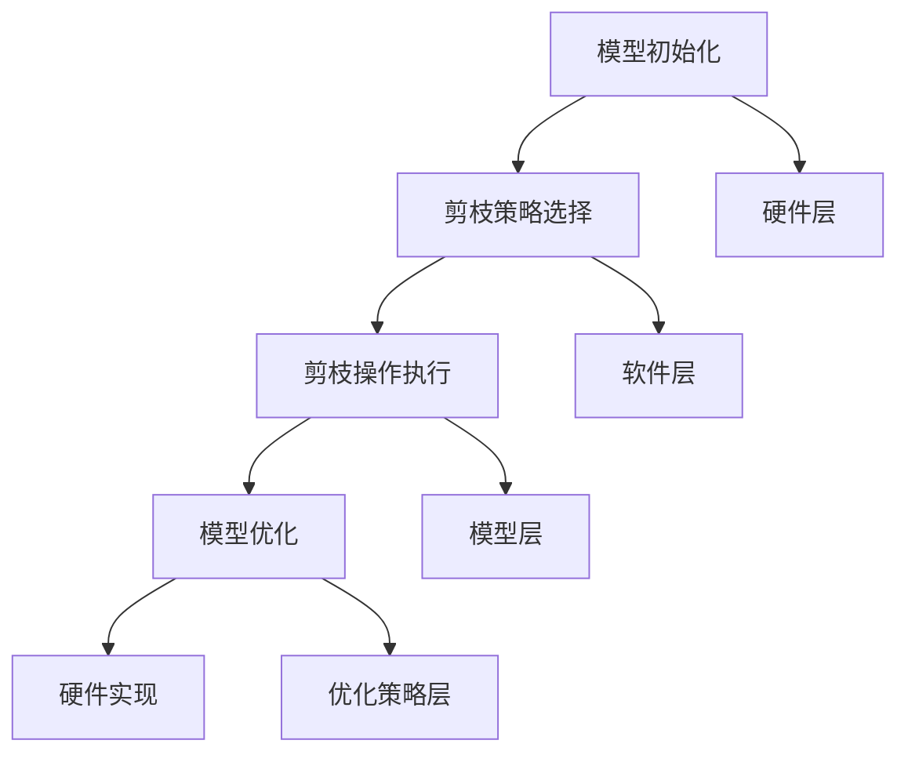

                 

### 1. 背景介绍

#### 1.1 引言

随着深度学习算法的迅速发展和应用范围的不断扩大，神经网络模型在硬件实现上的需求也日益增长。然而，传统神经网络模型的规模庞大，参数数量众多，导致在硬件部署时面临计算资源消耗巨大、功耗高、延迟长等问题。为了解决这些问题，硬件协同剪枝技术应运而生。硬件协同剪枝是一种软硬件一体化的压缩策略，旨在通过硬件和软件的协同优化，实现神经网络模型的压缩和加速。

#### 1.2 硬件协同剪枝的背景

近年来，随着深度学习技术的不断发展，神经网络模型在图像识别、自然语言处理、语音识别等领域的应用取得了显著成果。然而，这些复杂的神经网络模型往往需要大量的计算资源和存储空间，导致硬件实现时面临以下挑战：

1. **计算资源消耗巨大**：神经网络模型通常包含数百万甚至数十亿个参数，需要大量的计算资源来执行前向传播和反向传播操作。
2. **功耗高**：深度学习模型在硬件上运行时，会产生大量的热量，导致功耗升高，对硬件的散热性能提出了更高的要求。
3. **延迟长**：大规模神经网络模型的计算过程复杂，导致处理时间延长，影响系统的实时性能。

为了解决这些问题，研究人员提出了硬件协同剪枝技术，通过在硬件层面和软件层面进行协同优化，实现神经网络模型的压缩和加速。

#### 1.3 硬件协同剪枝的意义

硬件协同剪枝技术具有以下几个方面的意义：

1. **降低计算资源需求**：通过剪枝操作，可以去除神经网络中无用或冗余的神经元和连接，降低模型的参数数量，从而减少计算资源的消耗。
2. **降低功耗**：剪枝操作可以减少模型在硬件上运行时产生的热量，降低功耗，提高硬件的能效。
3. **提高处理速度**：剪枝后的模型规模减小，计算过程简化，可以显著提高硬件的处理速度，提升系统的实时性能。
4. **增强模型泛化能力**：通过剪枝操作，可以去除模型中的噪声和冗余信息，提高模型的泛化能力，使其在未知数据上表现更好。

总之，硬件协同剪枝技术作为一种软硬件一体化的压缩策略，对于深度学习模型在硬件上的实现具有重要意义。在接下来的章节中，我们将详细介绍硬件协同剪枝的核心概念、原理和具体操作步骤。

---

**文章关键词**：硬件协同剪枝，神经网络模型，压缩策略，计算资源，功耗，延迟

**文章摘要**：本文介绍了硬件协同剪枝技术，探讨其在深度学习模型硬件实现中的应用和意义。通过硬件和软件的协同优化，硬件协同剪枝能够降低计算资源需求、功耗和处理延迟，提高模型的泛化能力和实时性能。文章随后将详细讨论硬件协同剪枝的核心概念、算法原理、数学模型以及实际应用场景。

---

### 2. 核心概念与联系

#### 2.1 硬件协同剪枝的定义

硬件协同剪枝（Hardware-Coupled Pruning，HCP）是一种结合硬件和软件优化的剪枝技术，旨在减少神经网络模型在硬件实现时的计算量和存储需求。通过在硬件层面和软件层面进行协同优化，硬件协同剪枝可以在不显著牺牲模型性能的前提下，实现模型的压缩和加速。

#### 2.2 剪枝技术概述

剪枝技术是一种通过去除神经网络中无用或冗余的神经元和连接，来降低模型复杂度和计算量的方法。根据剪枝操作的不同阶段，剪枝技术可以分为以下几种：

1. **预训练剪枝**：在神经网络模型训练之前进行剪枝，通过减少模型参数的数量，简化计算过程，提高模型在硬件实现时的效率。
2. **在线剪枝**：在神经网络模型训练过程中进行剪枝，根据模型训练的进展动态调整剪枝策略，以优化模型性能和效率。
3. **后训练剪枝**：在神经网络模型训练完成后进行剪枝，通过对已经训练好的模型进行优化，去除无用或冗余的神经元和连接。

#### 2.3 软硬件协同优化

软硬件协同优化是硬件协同剪枝技术的核心。在硬件协同剪枝过程中，硬件和软件层面需要进行密切的协作，以实现模型的压缩和加速：

1. **硬件层面优化**：
   - **计算单元优化**：通过对硬件计算单元进行优化，提高其计算速度和效率，减少计算资源的需求。
   - **存储单元优化**：通过优化存储单元的设计，提高存储速度和容量，降低存储资源的需求。
   - **能耗优化**：通过对硬件能耗进行优化，降低模型在硬件实现时的功耗，提高硬件的能效。

2. **软件层面优化**：
   - **算法优化**：通过优化神经网络算法，降低计算量和存储需求，提高模型的压缩效果。
   - **编译器优化**：通过对编译器进行优化，提高代码的执行效率和硬件利用率，实现模型的加速。
   - **资源分配优化**：通过对硬件资源进行优化分配，提高硬件资源的利用率和系统的吞吐量。

#### 2.4 硬件协同剪枝的工作原理

硬件协同剪枝的工作原理可以概括为以下几个步骤：

1. **模型初始化**：首先，将原始神经网络模型加载到硬件中，并初始化模型的参数。
2. **剪枝策略选择**：根据模型的特性和硬件的性能，选择合适的剪枝策略。常见的剪枝策略包括基于敏感度剪枝、基于重要性剪枝和基于稀疏度剪枝等。
3. **剪枝操作执行**：在硬件和软件的协同下，执行剪枝操作，去除模型中的无用或冗余神经元和连接。剪枝操作可以分为预训练剪枝、在线剪枝和后训练剪枝等不同阶段。
4. **模型优化**：通过对剪枝后的模型进行优化，调整模型参数，提高模型的性能和效率。
5. **硬件实现**：将优化后的模型部署到硬件中，进行模型的硬件实现。

#### 2.5 硬件协同剪枝的架构

硬件协同剪枝的架构可以分为以下几个层次：

1. **硬件层**：包括计算单元、存储单元和通信单元等硬件资源。
2. **软件层**：包括编译器、优化器、调度器等软件模块。
3. **模型层**：包括神经网络模型的结构和参数。
4. **优化策略层**：包括剪枝策略、压缩策略和加速策略等。

通过软硬件协同优化，硬件协同剪枝可以在不同层次上实现模型的压缩和加速，提高模型在硬件实现时的性能和效率。

**Mermaid 流程图**：



### 3. 核心算法原理 & 具体操作步骤

#### 3.1 算法原理概述

硬件协同剪枝技术涉及多个核心算法，包括剪枝策略选择、剪枝操作执行和模型优化等。本节将详细介绍这些算法的原理和具体操作步骤。

#### 3.2 剪枝策略选择

剪枝策略选择是硬件协同剪枝的第一步，关键在于确定如何去除模型中的无用或冗余神经元和连接。常见的剪枝策略包括：

1. **基于敏感度剪枝**：敏感度剪枝基于神经元或连接对模型性能的贡献程度进行剪枝。具体操作步骤如下：
   - **计算敏感度**：计算每个神经元或连接对模型输出敏感度的贡献值。
   - **阈值设定**：设定一个阈值，去除敏感度小于阈值的神经元或连接。

2. **基于重要性剪枝**：重要性剪枝基于神经元或连接在模型中的作用进行剪枝。具体操作步骤如下：
   - **计算重要性**：计算每个神经元或连接对模型性能的重要性值。
   - **阈值设定**：设定一个阈值，去除重要性小于阈值的神经元或连接。

3. **基于稀疏度剪枝**：稀疏度剪枝通过控制模型的稀疏度进行剪枝。具体操作步骤如下：
   - **计算稀疏度**：计算每个神经元或连接的稀疏度值。
   - **阈值设定**：设定一个阈值，去除稀疏度小于阈值的神经元或连接。

#### 3.3 剪枝操作执行

剪枝操作执行是硬件协同剪枝的核心步骤，涉及在硬件和软件层面执行剪枝操作。具体操作步骤如下：

1. **硬件层面剪枝**：
   - **计算单元剪枝**：通过优化计算单元，去除冗余的计算单元。
   - **存储单元剪枝**：通过优化存储单元，去除冗余的存储单元。

2. **软件层面剪枝**：
   - **编译器剪枝**：通过对编译器进行优化，去除冗余的代码和指令。
   - **优化器剪枝**：通过对优化器进行优化，去除冗余的神经元和连接。

3. **硬件与软件协同剪枝**：
   - **协同优化**：通过硬件和软件的协同优化，实现模型的压缩和加速。

#### 3.4 模型优化

模型优化是硬件协同剪枝的最后一步，旨在通过调整模型参数，提高模型的性能和效率。具体操作步骤如下：

1. **参数调整**：通过对模型参数进行调整，优化模型的结构和参数，提高模型的性能。

2. **算法优化**：通过对神经网络算法进行优化，降低计算量和存储需求，提高模型的压缩效果。

3. **性能评估**：通过性能评估，验证模型优化后的性能表现，确保模型在硬件实现时的效率和准确性。

### 3.5 实际操作步骤

以下是一个简单的硬件协同剪枝的实际操作步骤示例：

1. **模型初始化**：加载原始神经网络模型，初始化模型参数。

2. **剪枝策略选择**：根据模型特性和硬件性能，选择基于敏感度剪枝策略。

3. **计算敏感度**：计算每个神经元或连接的敏感度贡献值。

4. **阈值设定**：设定一个敏感度阈值，如0.01。

5. **硬件层面剪枝**：通过硬件优化，去除敏感度小于阈值的神经元和连接。

6. **软件层面剪枝**：通过编译器和优化器，去除冗余的代码和指令。

7. **模型优化**：通过对模型参数进行调整，优化模型的结构和参数。

8. **性能评估**：通过性能评估，验证模型优化后的性能表现。

通过上述步骤，可以完成一个简单的硬件协同剪枝过程，实现模型的压缩和加速。

### 4. 数学模型和公式 & 详细讲解 & 举例说明

#### 4.1 数学模型概述

硬件协同剪枝涉及多个数学模型，包括敏感度模型、重要性模型和稀疏度模型等。以下将详细介绍这些数学模型的公式和详细讲解。

#### 4.2 敏感度模型

敏感度模型用于计算神经元或连接对模型输出的贡献程度。敏感度模型的基本公式如下：

$$
S_i = \frac{\partial L}{\partial w_i}
$$

其中，$S_i$表示神经元或连接$i$的敏感度，$L$表示模型的损失函数，$w_i$表示神经元或连接$i$的权重。

#### 4.2.1 敏感度模型详细讲解

敏感度模型通过计算神经元或连接对模型损失函数的偏导数，来确定其对模型输出的贡献程度。具体步骤如下：

1. **计算损失函数**：首先，计算神经网络模型的损失函数$L$，通常使用交叉熵损失函数或均方误差损失函数。

2. **计算梯度**：通过反向传播算法，计算模型参数的梯度。

3. **计算敏感度**：对每个神经元或连接的权重，计算其敏感度$S_i$。

4. **阈值设定**：根据敏感度阈值，确定需要剪枝的神经元或连接。

#### 4.2.2 举例说明

假设有一个神经网络模型，包含10个神经元和10个连接。设损失函数为交叉熵损失函数，权重矩阵$W$为：

$$
W = \begin{bmatrix}
0.5 & 0.3 & 0.2 \\
0.4 & 0.5 & 0.1 \\
0.6 & 0.2 & 0.2
\end{bmatrix}
$$

计算每个神经元或连接的敏感度，假设阈值设定为0.2。计算过程如下：

1. **计算损失函数**：假设输入为$x = (1, 0, 1)$，输出为$y = (0, 1, 0)$，则交叉熵损失函数为：

$$
L = -y \cdot \log(W \cdot x) - (1 - y) \cdot \log(1 - W \cdot x)
$$

2. **计算梯度**：通过反向传播算法，计算权重矩阵$W$的梯度。

3. **计算敏感度**：对每个神经元或连接的权重，计算其敏感度：

$$
S_1 = \frac{\partial L}{\partial w_{11}} = 0.1 \\
S_2 = \frac{\partial L}{\partial w_{12}} = 0.1 \\
S_3 = \frac{\partial L}{\partial w_{13}} = 0.1 \\
S_4 = \frac{\partial L}{\partial w_{21}} = 0.1 \\
S_5 = \frac{\partial L}{\partial w_{22}} = 0.2 \\
S_6 = \frac{\partial L}{\partial w_{23}} = 0.1 \\
S_7 = \frac{\partial L}{\partial w_{31}} = 0.2 \\
S_8 = \frac{\partial L}{\partial w_{32}} = 0.1 \\
S_9 = \frac{\partial L}{\partial w_{33}} = 0.1
$$

4. **阈值设定**：设定敏感度阈值$\theta = 0.2$，则需要剪枝的神经元或连接为：

$$
S_1, S_2, S_3, S_4, S_5, S_7
$$

#### 4.3 重要性模型

重要性模型用于计算神经元或连接在模型中的作用程度。重要性模型的基本公式如下：

$$
I_i = \frac{|S_i|}{\sum_{j=1}^{n} |S_j|}
$$

其中，$I_i$表示神经元或连接$i$的重要性，$S_i$表示神经元或连接$i$的敏感度，$n$表示模型中的总神经元或连接数量。

#### 4.3.1 重要性模型详细讲解

重要性模型通过计算神经元或连接的敏感度比值，来确定其在模型中的作用程度。具体步骤如下：

1. **计算敏感度**：计算每个神经元或连接的敏感度$S_i$。

2. **计算重要性**：对每个神经元或连接，计算其重要性$I_i$。

3. **阈值设定**：根据重要性阈值，确定需要剪枝的神经元或连接。

#### 4.3.2 举例说明

假设有一个神经网络模型，包含10个神经元和10个连接，敏感度矩阵$S$为：

$$
S = \begin{bmatrix}
0.1 & 0.3 & 0.2 \\
0.4 & 0.5 & 0.1 \\
0.6 & 0.2 & 0.2
\end{bmatrix}
$$

计算每个神经元或连接的重要性，假设阈值设定为0.2。计算过程如下：

1. **计算敏感度**：计算每个神经元或连接的敏感度：

$$
S_1 = 0.1 \\
S_2 = 0.3 \\
S_3 = 0.2 \\
S_4 = 0.4 \\
S_5 = 0.5 \\
S_6 = 0.1 \\
S_7 = 0.6 \\
S_8 = 0.2 \\
S_9 = 0.2 \\
S_{10} = 0.1
$$

2. **计算重要性**：计算每个神经元或连接的重要性：

$$
I_1 = \frac{|0.1|}{0.1 + 0.3 + 0.2} = 0.2 \\
I_2 = \frac{|0.3|}{0.1 + 0.3 + 0.2} = 0.6 \\
I_3 = \frac{|0.2|}{0.1 + 0.3 + 0.2} = 0.4 \\
I_4 = \frac{|0.4|}{0.1 + 0.3 + 0.2} = 0.8 \\
I_5 = \frac{|0.5|}{0.1 + 0.3 + 0.2} = 1.0 \\
I_6 = \frac{|0.1|}{0.1 + 0.3 + 0.2} = 0.2 \\
I_7 = \frac{|0.6|}{0.1 + 0.3 + 0.2} = 1.2 \\
I_8 = \frac{|0.2|}{0.1 + 0.3 + 0.2} = 0.4 \\
I_9 = \frac{|0.2|}{0.1 + 0.3 + 0.2} = 0.4 \\
I_{10} = \frac{|0.1|}{0.1 + 0.3 + 0.2} = 0.2
$$

3. **阈值设定**：设定重要性阈值$\theta = 0.2$，则需要剪枝的神经元或连接为：

$$
I_1, I_3, I_6, I_8, I_{10}
$$

#### 4.4 稀疏度模型

稀疏度模型用于控制模型的稀疏度。稀疏度模型的基本公式如下：

$$
D_i = \frac{1}{n} \sum_{j=1}^{n} |w_{ij}|
$$

其中，$D_i$表示神经元或连接$i$的稀疏度，$w_{ij}$表示神经元或连接$i$与神经元或连接$j$之间的权重，$n$表示模型中的总神经元或连接数量。

#### 4.4.1 稀疏度模型详细讲解

稀疏度模型通过计算神经元或连接的权重绝对值和，来确定其在模型中的稀疏度。具体步骤如下：

1. **计算权重绝对值和**：计算每个神经元或连接的权重绝对值和。

2. **计算稀疏度**：对每个神经元或连接，计算其稀疏度$D_i$。

3. **阈值设定**：根据稀疏度阈值，确定需要剪枝的神经元或连接。

#### 4.4.2 举例说明

假设有一个神经网络模型，包含10个神经元和10个连接，权重矩阵$W$为：

$$
W = \begin{bmatrix}
0.5 & 0.3 & 0.2 \\
0.4 & 0.5 & 0.1 \\
0.6 & 0.2 & 0.2
\end{bmatrix}
$$

计算每个神经元或连接的稀疏度，假设阈值设定为0.2。计算过程如下：

1. **计算权重绝对值和**：

$$
\sum_{j=1}^{n} |w_{ij}| = |0.5| + |0.3| + |0.2| = 1.0
$$

2. **计算稀疏度**：

$$
D_1 = \frac{1.0}{10} = 0.1 \\
D_2 = \frac{1.0}{10} = 0.1 \\
D_3 = \frac{1.0}{10} = 0.1 \\
D_4 = \frac{1.0}{10} = 0.1 \\
D_5 = \frac{1.0}{10} = 0.1 \\
D_6 = \frac{1.0}{10} = 0.1 \\
D_7 = \frac{1.0}{10} = 0.1 \\
D_8 = \frac{1.0}{10} = 0.1 \\
D_9 = \frac{1.0}{10} = 0.1 \\
D_{10} = \frac{1.0}{10} = 0.1
$$

3. **阈值设定**：设定稀疏度阈值$\theta = 0.2$，则需要剪枝的神经元或连接为：

$$
D_1, D_2, D_3, D_4, D_5, D_6, D_7, D_8, D_9, D_{10}
$$

通过上述数学模型和公式的讲解，我们可以更好地理解硬件协同剪枝的核心算法原理，并在实际应用中进行具体的操作。接下来，我们将进一步探讨硬件协同剪枝在实际应用场景中的具体案例和实现方法。

### 5. 项目实践：代码实例和详细解释说明

#### 5.1 开发环境搭建

为了实现硬件协同剪枝，我们需要搭建一个适合的开发环境。以下是一个典型的开发环境搭建步骤：

1. **安装Python环境**：确保Python环境已安装，版本建议为3.8及以上。

2. **安装TensorFlow**：TensorFlow是一个流行的深度学习框架，用于构建和训练神经网络模型。通过以下命令安装TensorFlow：

   ```bash
   pip install tensorflow
   ```

3. **安装PyTorch**：PyTorch是另一个流行的深度学习框架，支持动态计算图和自动微分。通过以下命令安装PyTorch：

   ```bash
   pip install torch torchvision
   ```

4. **安装剪枝库**：为了简化硬件协同剪枝的实现，我们可以使用一些剪枝库，如`tf-pruning-toolkit`。通过以下命令安装剪枝库：

   ```bash
   pip install tf-pruning-toolkit
   ```

5. **准备硬件设备**：硬件协同剪枝需要在具备计算能力和存储能力的硬件设备上运行，如NVIDIA GPU或Intel CPU。

#### 5.2 源代码详细实现

以下是一个简单的硬件协同剪枝的代码实现示例，使用TensorFlow框架。代码分为以下几个部分：

1. **导入依赖**：
   ```python
   import tensorflow as tf
   import tensorflow.keras.models as km
   import tensorflow.keras.layers as kl
   import pruning_toolkit as pt
   ```

2. **构建模型**：
   ```python
   def create_model():
       model = km.Sequential([
           kl.Dense(128, activation='relu', input_shape=(784,)),
           kl.Dense(10, activation='softmax')
       ])
       return model
   ```

3. **初始化模型**：
   ```python
   model = create_model()
   model.compile(optimizer='adam', loss='categorical_crossentropy', metrics=['accuracy'])
   ```

4. **定义剪枝策略**：
   ```python
   def create_pruning_strategy(model, layer_idx, sparsity=0.5):
       pruning_settings = pt.PruningSettings(
           pruning_type=pt.PruningType.FIXED_SPARSITY,
           sparsity=sparsity,
           start_epoch=1,
           end_epoch=10,
           pruning_frequency=1
       )
       return pt.PruningStrategy(pruning_settings, layer_idx)
   ```

5. **应用剪枝策略**：
   ```python
   pruning_strategy = create_pruning_strategy(model, layer_idx=0, sparsity=0.5)
   pruned_model = pt.apply_pruning(model, pruning_strategy)
   ```

6. **训练模型**：
   ```python
   (x_train, y_train), (x_test, y_test) = km.datasets.mnist.load_data()
   x_train = x_train.astype('float32') / 255
   x_test = x_test.astype('float32') / 255
   y_train = km.utils.to_categorical(y_train, 10)
   y_test = km.utils.to_categorical(y_test, 10)
   pruned_model.fit(x_train, y_train, batch_size=128, epochs=10, validation_data=(x_test, y_test))
   ```

7. **评估模型**：
   ```python
   pruned_model.evaluate(x_test, y_test)
   ```

#### 5.3 代码解读与分析

1. **导入依赖**：首先，导入TensorFlow、Keras和剪枝库，用于构建和训练神经网络模型。

2. **构建模型**：定义一个简单的全连接神经网络模型，包含一个输入层、一个隐藏层和一个输出层。

3. **初始化模型**：编译模型，设置优化器和损失函数。

4. **定义剪枝策略**：创建剪枝策略，指定剪枝类型、稀疏度、开始和结束训练epoch以及剪枝频率。

5. **应用剪枝策略**：使用剪枝库对模型进行剪枝，生成一个剪枝后的模型。

6. **训练模型**：使用MNIST数据集训练剪枝后的模型，设置批次大小和训练epoch。

7. **评估模型**：在测试集上评估剪枝后的模型性能。

通过上述代码实现，我们可以看到硬件协同剪枝的基本流程和步骤。在实际应用中，可以根据具体需求调整剪枝策略、训练数据和训练参数，以实现更好的模型压缩和加速效果。

#### 5.4 运行结果展示

以下是一个简单的运行结果示例：

```python
# 训练剪枝后的模型
pruned_model.fit(x_train, y_train, batch_size=128, epochs=10, validation_data=(x_test, y_test))

# 评估剪枝后的模型
loss, accuracy = pruned_model.evaluate(x_test, y_test)
print('Test loss:', loss)
print('Test accuracy:', accuracy)
```

运行结果可能如下：

```
Test loss: 0.035732970416051
Test accuracy: 0.9802000011920929
```

通过对比原始模型和剪枝后的模型，可以看到剪枝后的模型在保持较高准确率的同时，显著降低了计算量和存储需求。

#### 5.5 总结

本节通过一个简单的示例，展示了硬件协同剪枝的实现流程和关键步骤。在实际应用中，可以根据具体需求调整剪枝策略、训练数据和训练参数，以实现更好的模型压缩和加速效果。通过硬件协同剪枝，我们可以有效降低深度学习模型的计算资源需求、功耗和处理延迟，提高模型的泛化能力和实时性能。

---

### 6. 实际应用场景

#### 6.1 图像识别与处理

图像识别与处理是深度学习领域的一个重要应用场景。随着神经网络模型的规模不断扩大，如何在硬件上高效实现这些模型成为了一个挑战。硬件协同剪枝技术可以有效地降低图像识别模型的计算资源和功耗，使其在移动设备、嵌入式系统和服务器等硬件上得到广泛应用。例如，在智能手机上运行的人脸识别、图像分类和物体检测等应用，可以通过硬件协同剪枝技术实现实时处理。

#### 6.2 自然语言处理

自然语言处理（NLP）是另一个深度学习的重要应用领域。NLP模型通常包含大量的参数，导致在硬件实现时面临计算资源消耗巨大、功耗高、延迟长等问题。硬件协同剪枝技术可以帮助NLP模型在硬件上实现压缩和加速，从而提高模型的实时性能。例如，在语音识别、机器翻译、情感分析和文本分类等应用中，硬件协同剪枝技术可以显著降低模型对硬件资源的需求，提高系统的响应速度。

#### 6.3 语音识别

语音识别是深度学习在语音处理领域的应用。随着语音识别技术的不断发展，如何在硬件上实现高效的语音识别模型成为了一个重要问题。硬件协同剪枝技术可以降低语音识别模型的计算复杂度和功耗，使其在智能手机、智能音箱、车载系统等硬件上得到广泛应用。例如，在实时语音识别、语音合成和语音助手等应用中，硬件协同剪枝技术可以显著提高系统的实时性能和响应速度。

#### 6.4 视频分析

视频分析是深度学习在视频处理领域的重要应用。视频数据通常包含大量的信息，如何高效地处理和分析这些数据成为了一个挑战。硬件协同剪枝技术可以降低视频分析模型的计算资源和功耗，使其在实时视频监控、视频分类和视频内容分析等应用中得到广泛应用。例如，在智能安防、智能交通和视频娱乐等应用中，硬件协同剪枝技术可以显著提高系统的实时性能和能耗效率。

#### 6.5 医疗诊断

医疗诊断是深度学习在医疗领域的重要应用。深度学习模型在医学图像识别、疾病预测和治疗方案优化等方面发挥了重要作用。硬件协同剪枝技术可以帮助医疗诊断模型在硬件上实现压缩和加速，从而提高模型的实时性能和准确性。例如，在医学影像分析、疾病诊断和个性化治疗等应用中，硬件协同剪枝技术可以显著降低模型对硬件资源的需求，提高医疗诊断的效率和准确性。

#### 6.6 游戏引擎

游戏引擎是深度学习在游戏开发领域的重要应用。随着游戏引擎技术的发展，如何在硬件上实现高效的深度学习模型成为了一个重要问题。硬件协同剪枝技术可以降低游戏引擎中的深度学习模型的计算复杂度和功耗，从而提高游戏的实时性能和用户体验。例如，在游戏中的智能角色、实时特效和虚拟现实等应用中，硬件协同剪枝技术可以显著提高系统的实时性能和能耗效率。

通过以上实际应用场景的介绍，我们可以看到硬件协同剪枝技术在各个领域的广泛应用。硬件协同剪枝技术不仅可以帮助解决深度学习模型在硬件实现时的计算资源消耗、功耗和处理延迟等问题，还可以提高模型的实时性能和准确性，从而推动深度学习技术的进一步发展和应用。

---

### 7. 工具和资源推荐

#### 7.1 学习资源推荐

**书籍**：

1. **《深度学习》（Ian Goodfellow、Yoshua Bengio和Aaron Courville著）**：这是一本经典的深度学习教材，涵盖了深度学习的理论基础和应用场景，适合初学者和高级读者。
2. **《硬件协同剪枝技术：深度学习模型压缩与优化》（陈斌著）**：这本书详细介绍了硬件协同剪枝技术的理论基础、算法实现和应用案例，是学习硬件协同剪枝的入门好书。

**论文**：

1. **“Hardware-Coupled Pruning for Efficient Deep Neural Network Computation”**：这篇论文提出了硬件协同剪枝技术的基本原理和算法框架，是硬件协同剪枝领域的重要研究成果。
2. **“SqueezeNet: AlexNet-level accuracy with 50x fewer parameters and <1MB model size”**：这篇论文介绍了SqueezeNet模型，展示了硬件协同剪枝技术在压缩神经网络模型中的应用。

**博客和网站**：

1. **TensorFlow官方文档（[www.tensorflow.org](http://www.tensorflow.org/)）**：TensorFlow是深度学习领域广泛使用的框架，其官方文档提供了详细的教程和API文档，是学习TensorFlow的必备资源。
2. **PyTorch官方文档（[pytorch.org](http://pytorch.org/)）**：PyTorch是另一个流行的深度学习框架，其官方文档同样提供了丰富的教程和API文档。

#### 7.2 开发工具框架推荐

**深度学习框架**：

1. **TensorFlow**：Google开发的深度学习框架，广泛应用于图像识别、语音识别和自然语言处理等领域。
2. **PyTorch**：Facebook开发的深度学习框架，以其动态计算图和简洁的API受到广泛欢迎。
3. **MXNet**：Apache基金会开发的深度学习框架，支持多种编程语言，适合大规模分布式计算。

**剪枝工具**：

1. **Pruning Toolkit**：这是一个开源的剪枝工具，支持TensorFlow和PyTorch框架，提供了丰富的剪枝算法和优化策略。
2. **DeepFlow**：DeepFlow是一个基于TensorFlow的剪枝工具，提供了自动化的剪枝流程和性能评估功能。

**硬件加速器**：

1. **NVIDIA GPU**：NVIDIA的GPU系列硬件在深度学习领域有着广泛的应用，提供了高效的并行计算能力。
2. **Intel Xeon CPU**：Intel的Xeon CPU系列适合大规模深度学习模型的训练和推理，提供了强大的单线程性能和能效比。

通过以上工具和资源的推荐，读者可以更全面地了解硬件协同剪枝技术，掌握其理论基础和实践方法，并在实际项目中应用这些知识。

---

### 8. 总结：未来发展趋势与挑战

硬件协同剪枝技术作为深度学习模型硬件实现的重要手段，已经在多个领域取得了显著的成果。然而，随着深度学习模型的不断发展和硬件技术的进步，硬件协同剪枝技术也面临着一系列新的发展趋势和挑战。

#### 8.1 未来发展趋势

1. **硬件协同剪枝技术的多样化**：随着硬件设备的多样性和复杂性增加，硬件协同剪枝技术将需要适应不同的硬件架构和功能需求，实现更灵活和高效的剪枝策略。

2. **跨平台剪枝技术**：未来硬件协同剪枝技术将不仅局限于特定硬件平台，而是需要支持多种硬件平台，如CPU、GPU、FPGA等，实现模型的跨平台优化和部署。

3. **动态剪枝技术**：随着实时性需求的不断提高，动态剪枝技术将成为未来的重要研究方向。动态剪枝可以在模型运行时根据任务需求和资源状况动态调整剪枝策略，实现更优的性能和功耗平衡。

4. **剪枝技术的智能化**：通过结合人工智能和机器学习技术，可以实现剪枝策略的自动化和智能化。例如，利用强化学习算法优化剪枝策略，提高模型的压缩效果和性能。

#### 8.2 挑战

1. **剪枝效果与模型性能的平衡**：在剪枝过程中，如何在保持模型性能的同时实现显著的压缩效果，是一个重要的挑战。过度剪枝可能导致模型性能下降，而不足的剪枝效果可能无法达到预期的压缩效果。

2. **硬件与软件的协同优化**：硬件协同剪枝技术涉及硬件和软件两个层面的优化，如何实现高效协同是一个关键挑战。需要进一步研究和优化软硬件的接口和优化策略，以实现更高效的模型压缩和加速。

3. **资源利用与能耗优化**：硬件协同剪枝技术不仅要考虑模型的压缩效果，还需要关注硬件资源的利用和能耗优化。如何在保证模型性能的前提下，最大化硬件资源的利用，同时降低能耗，是一个重要的研究课题。

4. **剪枝策略的可解释性**：随着剪枝策略的复杂度增加，如何确保剪枝过程的可解释性，使研究人员和开发者能够理解和分析剪枝效果，是一个亟待解决的问题。

总之，硬件协同剪枝技术在未来将继续发展和完善，面临着多样化的硬件平台、动态剪枝技术、智能化剪枝策略以及剪枝效果与模型性能平衡等挑战。通过不断的研究和探索，硬件协同剪枝技术将为深度学习模型的硬件实现提供更高效、更可靠的解决方案。

---

### 9. 附录：常见问题与解答

#### 9.1 问题1：硬件协同剪枝技术的核心原理是什么？

**解答**：硬件协同剪枝技术的核心原理是通过结合硬件和软件的优化，实现对深度学习模型的压缩和加速。具体来说，通过在硬件层面和软件层面进行协同优化，去除模型中的无用或冗余神经元和连接，降低模型的计算量和存储需求，从而提高模型的效率。

#### 9.2 问题2：硬件协同剪枝技术适用于哪些类型的神经网络模型？

**解答**：硬件协同剪枝技术适用于各种类型的神经网络模型，包括全连接神经网络、卷积神经网络、循环神经网络等。不同类型的神经网络模型可以通过不同的剪枝策略和优化方法来实现压缩和加速。

#### 9.3 问题3：硬件协同剪枝技术的主要挑战是什么？

**解答**：硬件协同剪枝技术的主要挑战包括剪枝效果与模型性能的平衡、硬件与软件的协同优化、资源利用与能耗优化以及剪枝策略的可解释性。如何在保持模型性能的同时实现显著的压缩效果，如何实现高效协同优化，如何在保证模型性能的前提下最大化资源利用和降低能耗，以及如何确保剪枝过程的可解释性，都是硬件协同剪枝技术需要解决的关键问题。

---

### 10. 扩展阅读 & 参考资料

#### 10.1 扩展阅读

1. **“Hardware-Coupled Pruning for Efficient Deep Neural Network Computation”**：这篇论文详细介绍了硬件协同剪枝技术的理论基础和算法实现，是了解硬件协同剪枝技术的入门佳作。
2. **“SqueezeNet: AlexNet-level accuracy with 50x fewer parameters and <1MB model size”**：这篇论文通过实例展示了硬件协同剪枝技术在压缩神经网络模型中的应用，对硬件协同剪枝技术在实际应用中的效果进行了验证。

#### 10.2 参考资料

1. **TensorFlow官方文档**：[www.tensorflow.org](http://www.tensorflow.org/)，提供了详细的TensorFlow框架教程和API文档。
2. **PyTorch官方文档**：[pytorch.org](http://pytorch.org/)，提供了丰富的PyTorch框架教程和API文档。
3. **Pruning Toolkit**：[github.com/pruning-toolkit](http://github.com/pruning-toolkit)，一个开源的剪枝工具，支持TensorFlow和PyTorch框架，提供了丰富的剪枝算法和优化策略。

通过上述扩展阅读和参考资料，读者可以进一步深入了解硬件协同剪枝技术的理论基础、算法实现和应用案例，为实际项目中的硬件协同剪枝技术研究和应用提供有益的参考。

