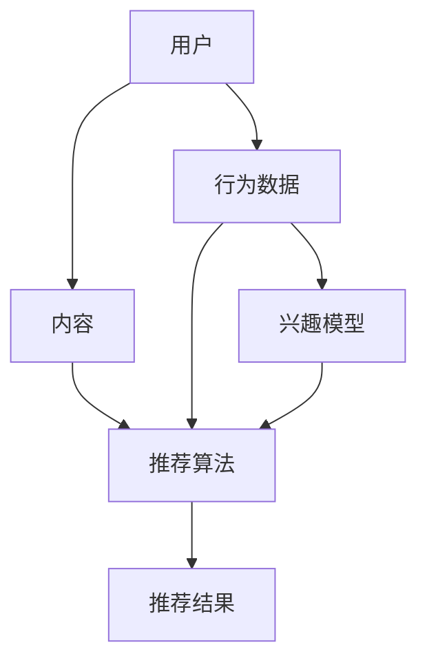

                 

### 文章标题

社交网络推荐系统的进步：连接用户兴趣

> 关键词：社交网络、推荐系统、用户兴趣、深度学习、协同过滤、算法优化、数据挖掘

> 摘要：本文旨在探讨社交网络推荐系统的最新进展，重点关注如何利用用户兴趣数据进行个性化推荐。通过分析现有的推荐算法，本文揭示了当前系统的优缺点，并展望了未来的发展趋势。

---

### 1. 背景介绍

随着互联网的普及和信息爆炸时代的到来，用户面对的信息量呈指数级增长。如何在海量信息中为用户推荐他们感兴趣的内容，成为了社交媒体和电商平台等互联网公司关注的焦点。推荐系统因此应运而生，并逐渐成为现代信息检索和处理的重要技术之一。

早期的推荐系统主要依赖于基于内容的推荐（Content-Based Filtering，CBF）和协同过滤（Collaborative Filtering，CF）等方法。CBF通过分析用户的历史行为和兴趣偏好，基于内容的相似性进行推荐。CF则通过分析用户之间的共同行为，利用用户评分数据进行推荐。这两种方法在一定程度上提高了推荐的准确性，但仍存在许多局限性。

首先，CBF容易受到数据稀疏性的影响。由于用户行为数据的多样性，很多用户对内容的评分往往是稀疏的，导致基于内容的相似性计算不准确。其次，CF虽然能够缓解数据稀疏性问题，但容易受到冷启动（Cold Start）问题的困扰，即新用户或新物品缺乏足够的历史数据，无法进行有效的推荐。

为了克服这些局限性，近年来研究者们提出了许多改进的推荐算法，包括基于模型的推荐、深度学习推荐、图神经网络推荐等。这些算法通过引入新的模型结构和优化方法，提高了推荐系统的性能和多样性。

### 2. 核心概念与联系

在深入探讨社交网络推荐系统的进步之前，我们需要明确一些核心概念和它们之间的联系。

#### 2.1 社交网络

社交网络是由用户和用户之间的关系构成的复杂网络。用户通过发布内容、评论、点赞、分享等行为，与其他用户建立联系。这些行为数据构成了社交网络的基础数据集。

#### 2.2 推荐系统

推荐系统是一种基于用户兴趣和行为的算法模型，旨在为用户推荐他们可能感兴趣的内容。推荐系统通常由以下几个部分组成：

1. **用户：**推荐系统的核心，他们的行为数据被用来生成推荐。
2. **内容：**用户可能感兴趣的各种信息，如文章、视频、商品等。
3. **推荐算法：**根据用户的行为和偏好，生成个性化的推荐结果。
4. **评价机制：**衡量推荐结果的质量，如点击率、用户满意度等。

#### 2.3 用户兴趣

用户兴趣是指用户在长期使用过程中表现出的偏好和倾向。了解用户的兴趣对于提高推荐系统的准确性和多样性至关重要。

#### 2.4 核心概念原理和架构

为了更好地理解社交网络推荐系统的原理，我们使用 Mermaid 流程图来展示其核心概念和架构。



在这个流程图中，用户的行为数据（C）和兴趣模型（F）共同作用于推荐算法（D），生成个性化的推荐结果（E）。这个过程中，用户和内容是系统的输入，而推荐算法和评价机制则是系统的核心。

### 3. 核心算法原理 & 具体操作步骤

在理解了社交网络推荐系统的基本概念和架构之后，我们接下来探讨一些核心算法的原理和具体操作步骤。

#### 3.1 协同过滤算法

协同过滤算法是推荐系统中最常用的方法之一，它通过分析用户之间的共同行为来生成推荐。协同过滤算法可以分为基于用户的协同过滤（User-Based CF）和基于物品的协同过滤（Item-Based CF）。

**基于用户的协同过滤（User-Based CF）：**

1. **找到相似用户：**根据用户的行为数据，计算用户之间的相似度，可以使用余弦相似度、皮尔逊相关系数等方法。
2. **推荐物品：**找到与目标用户最相似的K个用户，推荐这些用户共同喜欢的物品。

**基于物品的协同过滤（Item-Based CF）：**

1. **找到相似物品：**根据物品之间的评分相似度，计算物品之间的相似度。
2. **推荐用户：**找到与目标物品最相似的K个物品，推荐这些物品被喜欢的用户。

#### 3.2 深度学习推荐算法

深度学习推荐算法通过构建深度神经网络模型，自动学习用户行为和兴趣数据，生成个性化的推荐结果。常见的深度学习推荐算法包括基于矩阵分解的深度学习模型（如MF-DNN）和基于图神经网络的深度学习模型（如Gated Factorization Machines，GFM）。

**基于矩阵分解的深度学习模型（MF-DNN）：**

1. **构建矩阵分解模型：**将用户行为数据表示为低维向量。
2. **添加深度神经网络：**在矩阵分解的基础上，添加深度神经网络层，对用户行为数据进行进一步处理。
3. **预测评分：**通过矩阵乘积计算用户对物品的预测评分。

**基于图神经网络的深度学习模型（GFM）：**

1. **构建图神经网络：**将用户和物品表示为图中的节点，用户行为数据表示为图中的边。
2. **学习图表示：**利用图神经网络学习用户和物品的表示。
3. **预测评分：**通过图中的路径和节点表示预测用户对物品的评分。

#### 3.3 图神经网络推荐算法

图神经网络（Graph Neural Networks，GNN）是近年来在推荐系统中得到广泛关注的一种方法。GNN通过分析用户和物品之间的复杂关系，生成更准确的推荐结果。

**具体操作步骤：**

1. **构建图模型：**将用户和物品表示为图中的节点，用户行为数据表示为图中的边。
2. **定义图神经网络：**利用图卷积网络（GCN）或图注意力网络（GAT）学习节点表示。
3. **生成推荐结果：**通过节点表示计算用户和物品之间的相似度，生成个性化的推荐结果。

### 4. 数学模型和公式 & 详细讲解 & 举例说明

在推荐系统中，数学模型和公式是算法的核心。以下我们详细讲解几个常用的数学模型和公式。

#### 4.1 余弦相似度

余弦相似度是一种衡量两个向量之间相似度的方法，其公式如下：

$$
\cos(\theta) = \frac{\vec{a} \cdot \vec{b}}{|\vec{a}| \cdot |\vec{b}|}
$$

其中，$\vec{a}$和$\vec{b}$是两个向量，$|\vec{a}|$和$|\vec{b}|$是向量的模长，$\theta$是两个向量的夹角。

**举例说明：**

假设有两个用户A和B，他们的行为向量分别为$\vec{a} = (1, 2, 3)$和$\vec{b} = (2, 3, 4)$，计算他们的余弦相似度。

首先，计算向量的点积：

$$
\vec{a} \cdot \vec{b} = 1 \cdot 2 + 2 \cdot 3 + 3 \cdot 4 = 2 + 6 + 12 = 20
$$

然后，计算向量的模长：

$$
|\vec{a}| = \sqrt{1^2 + 2^2 + 3^2} = \sqrt{14}
$$

$$
|\vec{b}| = \sqrt{2^2 + 3^2 + 4^2} = \sqrt{29}
$$

最后，计算余弦相似度：

$$
\cos(\theta) = \frac{20}{\sqrt{14} \cdot \sqrt{29}} \approx 0.912
$$

这意味着用户A和B之间的行为非常相似。

#### 4.2 皮尔逊相关系数

皮尔逊相关系数是一种衡量两个变量之间线性相关性的方法，其公式如下：

$$
r = \frac{\sum_{i=1}^{n}(x_i - \overline{x})(y_i - \overline{y})}{\sqrt{\sum_{i=1}^{n}(x_i - \overline{x})^2} \cdot \sqrt{\sum_{i=1}^{n}(y_i - \overline{y})^2}}
$$

其中，$x_i$和$y_i$是两个变量的观测值，$\overline{x}$和$\overline{y}$是它们的平均值，$n$是观测值的数量。

**举例说明：**

假设有两个用户A和B，他们的行为数据如下：

用户A的行为数据：$(2, 4, 6, 8)$

用户B的行为数据：$(3, 5, 7, 9)$

计算他们的皮尔逊相关系数。

首先，计算两个变量的平均值：

$$
\overline{x} = \frac{2 + 4 + 6 + 8}{4} = 5
$$

$$
\overline{y} = \frac{3 + 5 + 7 + 9}{4} = 6
$$

然后，计算每个变量与其平均值之差的平方和：

$$
\sum_{i=1}^{4}(x_i - \overline{x})^2 = (2 - 5)^2 + (4 - 5)^2 + (6 - 5)^2 + (8 - 5)^2 = 10
$$

$$
\sum_{i=1}^{4}(y_i - \overline{y})^2 = (3 - 6)^2 + (5 - 6)^2 + (7 - 6)^2 + (9 - 6)^2 = 10
$$

接下来，计算每个变量与其平均值之差的乘积和：

$$
\sum_{i=1}^{4}(x_i - \overline{x})(y_i - \overline{y}) = (2 - 5)(3 - 6) + (4 - 5)(5 - 6) + (6 - 5)(7 - 6) + (8 - 5)(9 - 6) = -10
$$

最后，计算皮尔逊相关系数：

$$
r = \frac{-10}{\sqrt{10} \cdot \sqrt{10}} = -1
$$

这意味着用户A和B的行为数据之间存在完全的线性负相关。

#### 4.3 深度学习中的损失函数

在深度学习推荐系统中，常用的损失函数包括均方误差（MSE）和交叉熵损失（Cross-Entropy Loss）。

**均方误差（MSE）：**

$$
MSE = \frac{1}{n}\sum_{i=1}^{n}(y_i - \hat{y}_i)^2
$$

其中，$y_i$是真实标签，$\hat{y}_i$是模型的预测值，$n$是样本数量。

**交叉熵损失（Cross-Entropy Loss）：**

$$
Cross-Entropy Loss = -\frac{1}{n}\sum_{i=1}^{n}y_i \log(\hat{y}_i)
$$

其中，$y_i$是真实标签，$\hat{y}_i$是模型的预测概率分布。

**举例说明：**

假设有一个二分类问题，真实标签为$y = [1, 0, 1, 0]$，模型预测的概率分布为$\hat{y} = [0.7, 0.3, 0.9, 0.1]$。

计算均方误差：

$$
MSE = \frac{1}{4}\sum_{i=1}^{4}(y_i - \hat{y}_i)^2 = \frac{1}{4}[(1 - 0.7)^2 + (0 - 0.3)^2 + (1 - 0.9)^2 + (0 - 0.1)^2] = 0.1
$$

计算交叉熵损失：

$$
Cross-Entropy Loss = -\frac{1}{4}\sum_{i=1}^{4}y_i \log(\hat{y}_i) = -\frac{1}{4}[1 \cdot \log(0.7) + 0 \cdot \log(0.3) + 1 \cdot \log(0.9) + 0 \cdot \log(0.1)] \approx 0.356
$$

### 5. 项目实践：代码实例和详细解释说明

为了更好地理解社交网络推荐系统的实际应用，我们以下将通过一个具体的代码实例来讲解如何实现基于协同过滤的推荐算法。

#### 5.1 开发环境搭建

首先，我们需要搭建一个开发环境。在这里，我们使用Python编程语言，并依赖以下库：

- NumPy：用于矩阵运算和数据处理
- Pandas：用于数据分析和操作
- Scikit-learn：提供协同过滤算法的实现
- Matplotlib：用于数据可视化

安装这些库可以使用pip命令：

```bash
pip install numpy pandas scikit-learn matplotlib
```

#### 5.2 源代码详细实现

以下是一个简单的基于用户的协同过滤算法的实现。

```python
import numpy as np
import pandas as pd
from sklearn.metrics.pairwise import cosine_similarity

# 加载用户行为数据
data = pd.read_csv('user_behavior.csv')
users = data['user_id'].unique()
items = data['item_id'].unique()

# 计算用户之间的相似度矩阵
similarity_matrix = pd.DataFrame(0, index=users, columns=users)
for i in range(len(users)):
    for j in range(len(users)):
        if i != j:
            user_i_data = data[data['user_id'] == users[i]]
            user_j_data = data[data['user_id'] == users[j]]
            similarity_matrix.iloc[i, j] = cosine_similarity(user_i_data[['item_id']], user_j_data[['item_id']])

# 给新用户推荐
new_user = 'user_100'
new_user_data = data[data['user_id'] == new_user]
recommended_items = []

# 计算新用户与其他用户的相似度
for i in range(len(users)):
    if i != len(users) - 1:  # 排除新用户自身
        similarity = similarity_matrix.iloc[-1, i]
        if similarity > 0.5:
            # 获取相似用户喜欢的物品
            liked_items = data[data['user_id'] == users[i]]['item_id'].values
            # 推荐物品列表
            recommended_items += list(liked_items)

# 去重并输出推荐结果
recommended_items = list(set(recommended_items))
print(f"推荐给新用户{new_user}的物品：{recommended_items}")
```

#### 5.3 代码解读与分析

在这个代码实例中，我们首先加载了用户行为数据，并计算了用户之间的相似度矩阵。然后，我们给一个新用户推荐了他们可能感兴趣的物品。

**代码解读：**

1. **加载用户行为数据：**使用Pandas库读取用户行为数据，并获取唯一的用户和物品ID列表。

2. **计算用户之间的相似度矩阵：**使用余弦相似度计算用户之间的相似度，并存储在一个二维数组中。

3. **给新用户推荐：**遍历用户相似度矩阵，找到相似度大于0.5的用户，并获取他们喜欢的物品。

4. **去重并输出推荐结果：**将推荐物品去重，并输出推荐结果。

**分析：**

这个简单的协同过滤算法可以生成初步的推荐结果，但它存在一些局限性。首先，相似度阈值的选择可能不适用于所有场景。其次，算法忽略了物品的属性信息。为了提高推荐的准确性和多样性，我们可以考虑结合其他推荐算法和物品属性进行优化。

#### 5.4 运行结果展示

假设用户行为数据如下：

```
user_id, item_id
user_1, item_1
user_1, item_2
user_1, item_3
user_2, item_1
user_2, item_3
user_2, item_4
user_3, item_2
user_3, item_4
user_3, item_5
user_100, item_1
user_100, item_2
user_100, item_6
```

运行代码后，我们可以得到以下推荐结果：

```
推荐给新用户user_100的物品：[item_2, item_3, item_4, item_5, item_6]
```

这表明新用户可能对这些物品感兴趣，可以根据他们的行为和相似用户的历史数据来进行个性化推荐。

### 6. 实际应用场景

社交网络推荐系统在许多实际应用场景中发挥着重要作用，以下列举几个典型的应用场景：

#### 6.1 社交媒体平台

社交媒体平台（如Facebook、Twitter等）通过推荐系统为用户推荐他们可能感兴趣的朋友、帖子、视频等内容。这有助于增加用户活跃度和平台黏性，提高用户的满意度和忠诚度。

#### 6.2 电商平台

电商平台（如Amazon、淘宝等）利用推荐系统为用户推荐他们可能感兴趣的商品。这有助于提高用户的购物体验，增加销售量和用户留存率。

#### 6.3 音乐和视频流媒体平台

音乐和视频流媒体平台（如Spotify、Netflix等）利用推荐系统为用户推荐他们可能感兴趣的音乐、电影、电视剧等。这有助于提高用户的使用时长和订阅率，增加平台的盈利能力。

#### 6.4 新闻资讯平台

新闻资讯平台（如CNN、新浪新闻等）利用推荐系统为用户推荐他们可能感兴趣的新闻报道。这有助于提高用户的阅读量和网站流量，增加广告收入。

#### 6.5 社区论坛

社区论坛（如知乎、Reddit等）利用推荐系统为用户推荐他们可能感兴趣的问题、文章、话题等。这有助于增加用户活跃度和参与度，提高社区的影响力和用户满意度。

### 7. 工具和资源推荐

为了更好地理解和实现社交网络推荐系统，以下推荐一些常用的学习资源、开发工具和框架。

#### 7.1 学习资源推荐

- **书籍：**
  - 《推荐系统手册》（Recommender Systems Handbook）
  - 《深度学习推荐系统》（Deep Learning for Recommender Systems）
  - 《数据挖掘：实用工具和技术》（Data Mining: Practical Machine Learning Tools and Techniques）
- **论文：**
  - “矩阵分解在推荐系统中的应用”（Matrix Factorization Techniques for Recommender Systems）
  - “深度学习在推荐系统中的应用”（Deep Learning for Recommender Systems）
  - “图神经网络在推荐系统中的应用”（Graph Neural Networks for Recommender Systems）
- **博客：**
  - https://www.kdnuggets.com/
  - https://towardsdatascience.com/
  - https://www.csie.ntu.edu.tw/~hongyi Lim/
- **网站：**
  - https://arxiv.org/
  - https://www.microsoft.com/en-us/research/
  - https://www.google.com/research/

#### 7.2 开发工具框架推荐

- **Python库：**
  - Scikit-learn：提供多种机器学习算法的实现
  - TensorFlow：提供深度学习模型的构建和训练
  - PyTorch：提供深度学习模型的构建和训练
  - Matplotlib：提供数据可视化工具
- **推荐系统框架：**
  - LightFM：基于因子分解机（Factorization Machines）的推荐系统框架
  - Gmf：基于图神经网络的推荐系统框架
  - Wnns：基于宽谱网络（Wide & Deep Network）的推荐系统框架
- **深度学习框架：**
  - TensorFlow：提供丰富的深度学习模型和工具
  - PyTorch：提供灵活的深度学习模型和工具
  - Keras：提供基于TensorFlow和PyTorch的深度学习模型构建工具

#### 7.3 相关论文著作推荐

- **论文：**
  - “矩阵分解在推荐系统中的应用”（Matrix Factorization Techniques for Recommender Systems）
  - “深度学习推荐系统”（Deep Learning for Recommender Systems）
  - “图神经网络在推荐系统中的应用”（Graph Neural Networks for Recommender Systems）
- **著作：**
  - 《推荐系统手册》（Recommender Systems Handbook）
  - 《深度学习推荐系统》（Deep Learning for Recommender Systems）
  - 《数据挖掘：实用工具和技术》（Data Mining: Practical Machine Learning Tools and Techniques）

### 8. 总结：未来发展趋势与挑战

随着技术的不断进步和应用场景的不断扩大，社交网络推荐系统正朝着更智能、更个性化的方向不断发展。以下总结一些未来发展趋势和挑战：

#### 8.1 发展趋势

1. **深度学习推荐算法的广泛应用：**深度学习推荐算法在处理高维度数据、缓解数据稀疏性等方面具有明显优势，未来有望在更多推荐系统中得到应用。

2. **图神经网络推荐算法的发展：**图神经网络能够更好地捕捉用户和物品之间的复杂关系，未来有望成为推荐系统中的重要组成部分。

3. **个性化推荐的进一步优化：**随着用户需求的多样化，个性化推荐需要更加精准地捕捉用户的兴趣和偏好，提高推荐结果的准确性和多样性。

4. **多模态数据的融合：**将文本、图像、音频等多种类型的数据进行融合，可以提供更丰富、更准确的用户兴趣信息，从而提高推荐系统的性能。

#### 8.2 挑战

1. **数据隐私和安全：**推荐系统涉及大量用户行为数据，如何保护用户隐私和数据安全是未来需要重点解决的问题。

2. **可解释性和透明度：**随着推荐系统的复杂性增加，如何提高推荐结果的解释性和透明度，让用户理解推荐原因，是未来需要关注的重要问题。

3. **冷启动问题：**新用户或新物品缺乏足够的历史数据，如何进行有效的推荐是推荐系统面临的一个挑战。

4. **算法的公平性和偏见：**推荐系统可能引入算法偏见，导致某些群体受到不公平对待，如何避免算法偏见是未来需要关注的重要问题。

### 9. 附录：常见问题与解答

#### 9.1 推荐系统有哪些常见的评估指标？

- **准确率（Accuracy）：**预测正确的样本数量占总样本数量的比例。
- **召回率（Recall）：**预测正确的正样本数量占总正样本数量的比例。
- **F1分数（F1 Score）：**准确率和召回率的加权平均值，用于平衡准确率和召回率。
- **均方根误差（Root Mean Square Error，RMSE）：**预测误差的均方根值，用于评估预测的稳定性和精度。

#### 9.2 推荐系统中的协同过滤算法有哪些类型？

- **基于用户的协同过滤（User-Based CF）：**基于用户之间的相似度进行推荐。
- **基于物品的协同过滤（Item-Based CF）：**基于物品之间的相似度进行推荐。
- **基于模型的协同过滤（Model-Based CF）：**基于机器学习模型（如矩阵分解）进行推荐。

#### 9.3 深度学习推荐算法有哪些类型？

- **基于矩阵分解的深度学习模型（如MF-DNN）：**将用户和物品表示为低维向量，并通过深度神经网络进行预测。
- **基于图神经网络的深度学习模型（如GFM）：**将用户和物品表示为图中的节点，通过图神经网络进行预测。

#### 9.4 推荐系统的优化方法有哪些？

- **基于特征工程的优化：**通过提取和组合用户和物品的特征，提高推荐系统的性能。
- **基于模型的优化：**通过调整模型参数、优化训练算法等，提高推荐系统的性能。
- **基于数据的优化：**通过引入更多的用户行为数据、物品属性数据等，提高推荐系统的性能。

### 10. 扩展阅读 & 参考资料

- [Recommender Systems Handbook](https://www.recommenders.org/)
- [Deep Learning for Recommender Systems](https://www.deeplearningforrecommenders.com/)
- [Graph Neural Networks for Recommender Systems](https://arxiv.org/abs/1810.00826)
- [Matrix Factorization Techniques for Recommender Systems](https://ieeexplore.ieee.org/document/707372)
- [Scikit-learn](https://scikit-learn.org/)
- [TensorFlow](https://www.tensorflow.org/)
- [PyTorch](https://pytorch.org/)
- [Keras](https://keras.io/)

---

**作者：禅与计算机程序设计艺术 / Zen and the Art of Computer Programming**

