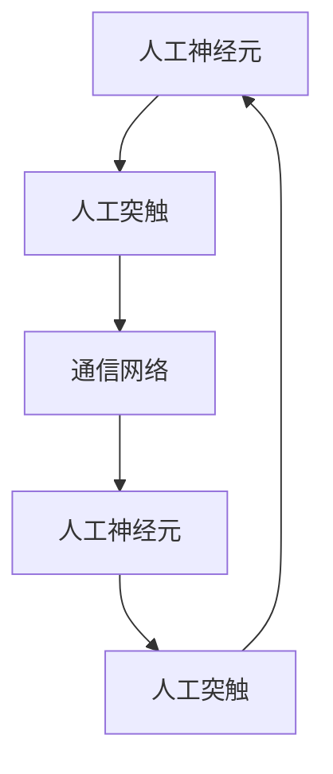
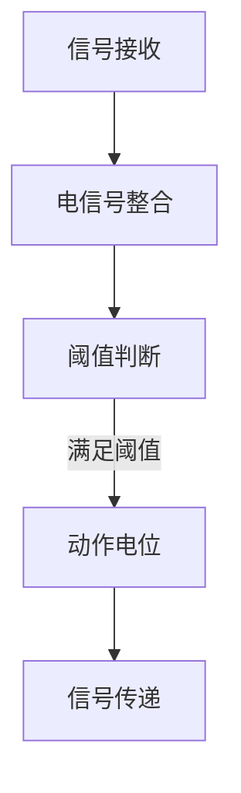
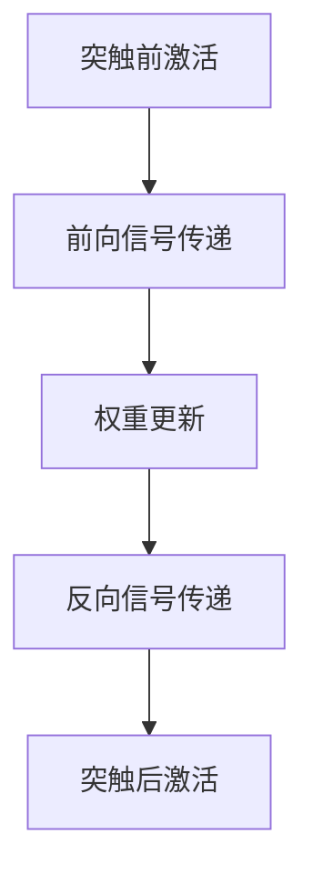
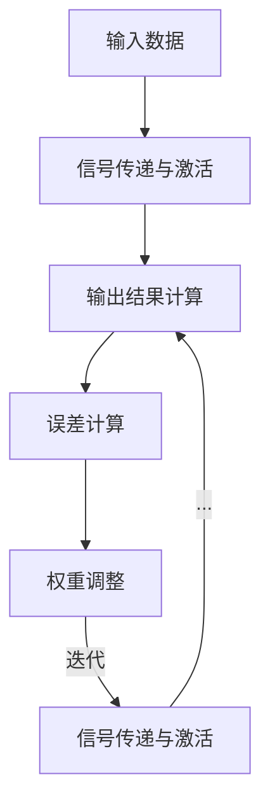

                 

### 背景介绍

神经形态芯片，作为一种新兴的计算技术，近年来在全球范围内引起了广泛关注。它的核心思想是模仿人脑的工作方式，通过在硬件层面上实现神经元和突触的功能，从而实现高效的信息处理和存储。这种芯片不仅能够处理复杂数据，而且在能源效率和适应性方面具有显著优势。

#### 神经形态芯片的发展历程

神经形态芯片的概念最早可以追溯到20世纪40年代，由心理学家赫布（Donald O. Hebb）提出的赫布定律。赫布定律描述了神经元之间的相互作用如何影响它们之间的连接强度，这为后来的神经网络理论奠定了基础。

然而，神经形态芯片的真正发展始于20世纪90年代，当时研究人员开始尝试将神经网络理论与硬件实现相结合。这一阶段的一个重要里程碑是1995年，戴密斯·哈萨和史蒂夫·布鲁斯共同创立了Synaptics公司，这是世界上第一家专注于神经形态芯片研发的公司。

进入21世纪，随着纳米技术和集成电路技术的飞速发展，神经形态芯片的研究和应用逐渐走向深入。2017年，IBM推出了世界上第一个商用神经形态芯片TrueNorth，这款芯片包含了5.4亿个人工神经元和大约40亿个人工突触，展示了神经形态芯片在处理复杂任务方面的巨大潜力。

#### 神经形态芯片的现状

目前，神经形态芯片已经逐渐应用于多个领域，包括但不限于人工智能、自动驾驶、医疗诊断和物联网。在人工智能领域，神经形态芯片被用于加速机器学习和深度学习算法，从而提高计算效率和减少能耗。在自动驾驶领域，神经形态芯片可以实时处理来自传感器的大量数据，提高车辆的感知和决策能力。在医疗诊断领域，神经形态芯片可以用于快速分析医疗影像，提高诊断准确率。在物联网领域，神经形态芯片的低功耗特性使其成为物联网设备的理想选择。

#### 神经形态芯片的优势和挑战

神经形态芯片具有以下优势：

1. **高效信息处理**：神经形态芯片能够通过并行计算和局部信息处理，实现高效的信息处理。
2. **低能耗**：与传统的冯·诺伊曼架构相比，神经形态芯片的能耗更低，更符合可持续发展的要求。
3. **适应性**：神经形态芯片能够根据输入数据自动调整计算模式和参数，具有较强的自适应能力。

然而，神经形态芯片也面临着一些挑战：

1. **硬件限制**：目前，神经形态芯片的硬件技术仍然相对落后，无法完全实现理论上的性能。
2. **算法难题**：如何设计出能够在神经形态芯片上高效运行的算法，仍是一个亟待解决的问题。
3. **应用场景局限**：目前，神经形态芯片的应用场景相对有限，需要在更多领域进行探索和尝试。

总之，神经形态芯片作为一种新兴技术，具有巨大的发展潜力和应用价值。然而，要充分发挥其优势，仍需要克服一系列技术难题。接下来，我们将深入探讨神经形态芯片的核心概念、算法原理以及数学模型，为进一步理解和应用这一技术奠定基础。

---

### 核心概念与联系

神经形态芯片（Neuromorphic Chip）的核心在于其模仿人脑神经元和突触的工作方式。要深入理解这一概念，我们需要从神经元和突触的基本原理入手，并结合神经形态芯片的架构特点进行阐述。

#### 神经元（Neuron）

神经元是大脑的基本计算单元，它通过电信号（称为动作电位）进行信息传递。一个典型的神经元包含以下几个部分：

1. **树突（Dendrites）**：树突负责接收来自其他神经元的信号。
2. **细胞体（Soma）**：细胞体对接收到的信号进行整合。
3. **轴突（Axon）**：轴突将整合后的信号传递到其他神经元或目标细胞。
4. **突触（Synapse）**：突触是神经元之间的连接点，负责传递信号。

神经元的工作原理可以简单概括为：当树突接收到的信号达到一定阈值时，细胞体会产生动作电位，并通过轴突将信号传递到下一个神经元或目标细胞。这种信号传递方式是神经形态芯片设计的重要基础。

#### 突触（Synapse）

突触是神经元之间的连接点，它的功能是调节信号在神经元间的传递强度。一个突触通常包含以下几个部分：

1. **突触前膜（Presynaptic Membrane）**：突触前膜是突触的前部，负责释放神经递质。
2. **突触间隙（Synaptic Cleft）**：突触间隙是神经递质传递的路径。
3. **突触后膜（Postsynaptic Membrane）**：突触后膜是突触的后部，负责接收神经递质并产生电信号。

突触的工作原理是：当突触前膜释放神经递质时，神经递质通过突触间隙到达突触后膜，并与突触后膜上的受体结合，从而引发电信号。这种信号调节机制对于实现神经网络的学习和记忆功能至关重要。

#### 神经形态芯片的架构

神经形态芯片的核心架构通常包括以下几个部分：

1. **人工神经元（Artificial Neuron）**：人工神经元模仿生物神经元的结构和工作原理，通常包含电容器、电阻器等硬件元件。
2. **人工突触（Artificial Synapse）**：人工突触模仿生物突触的功能，通过电控方式调节信号的传递强度。
3. **通信网络（Communication Network）**：通信网络用于实现神经元之间的信号传递和同步。

以下是神经形态芯片的架构图：



在这个架构图中，人工神经元通过人工突触与其他神经元进行连接，并通过通信网络实现信号的传递和同步。这种架构使得神经形态芯片能够模仿人脑的信息处理方式，实现高效的信息处理和存储。

#### 神经形态芯片与神经网络的联系

神经形态芯片与神经网络密切相关。神经网络是一种通过模拟人脑神经元连接方式进行信息处理的计算模型。神经形态芯片的核心目标就是实现这一计算模型在硬件上的高效实现。

在神经网络中，神经元之间的连接强度（权重）会根据学习算法进行调整，从而实现网络的训练和优化。在神经形态芯片中，人工神经元和人工突触的功能正是为了实现这一目标。通过电控方式调整人工突触的电阻值，可以模拟出神经网络中的权重调整过程，从而实现网络的学习和记忆功能。

总之，神经形态芯片通过模仿人脑神经元和突触的工作方式，实现了在硬件层面上实现神经网络的功能。这种架构不仅能够提高信息处理的效率，还能够降低能耗，为未来的计算技术发展提供了新的方向。

---

### 核心算法原理 & 具体操作步骤

神经形态芯片的核心算法基于人脑神经元和突触的工作原理，主要包括人工神经元激活、人工突触权重调整和神经网络学习过程。下面我们将详细介绍这些算法的原理和具体操作步骤。

#### 人工神经元激活

人工神经元的激活过程是基于生物神经元动作电位原理的。具体步骤如下：

1. **信号接收**：人工神经元的树突接收来自其他神经元通过突触传递过来的电信号。
2. **电信号整合**：细胞体对接收到的电信号进行整合，计算信号的总和。
3. **阈值判断**：如果整合后的电信号强度达到某一阈值，细胞体会产生动作电位。
4. **信号传递**：动作电位通过轴突传递到下一个神经元或目标细胞。

以下是人工神经元激活过程的简化示意图：



#### 人工突触权重调整

人工突触的权重调整是实现神经网络学习的关键。基于赫布学习规则，人工突触的权重可以通过以下步骤进行调整：

1. **前向信号传递**：当突触前神经元激活时，会产生一个电信号传递到突触后神经元。
2. **权重更新**：突触后神经元的活性会根据突触前神经元的激活强度和自身活性进行权重更新。如果突触前神经元激活强度高，且突触后神经元活性低，则权重增加；反之，权重减少。
3. **反向信号传递**：权重更新后，突触会根据新的权重进行信号传递，影响突触后神经元的激活状态。

以下是人工突触权重调整过程的简化示意图：



#### 神经网络学习过程

神经网络的学习过程是通过反复迭代权重调整来实现的。具体步骤如下：

1. **输入数据准备**：准备输入数据，并将其传递到神经网络中。
2. **信号传递与激活**：输入数据通过人工神经元和突触的连接，逐步传递并激活神经网络。
3. **输出结果计算**：神经网络根据激活状态计算输出结果。
4. **误差计算**：比较输出结果与预期结果，计算误差。
5. **权重调整**：根据误差计算结果，调整人工神经元和突触的权重，以减少误差。
6. **迭代学习**：重复步骤2至5，直到误差小于预设阈值或达到最大迭代次数。

以下是神经网络学习过程的简化示意图：



#### 算法优化与改进

为了提高神经形态芯片的性能，研究人员还提出了一系列优化和改进算法，如：

1. **动态阈值调整**：根据神经网络的学习状态动态调整神经元的激活阈值，以适应不同的学习阶段。
2. **自适应学习速率**：根据误差的大小动态调整权重更新的速率，以避免过拟合和欠拟合。
3. **多尺度学习**：同时进行局部和全局权重调整，以提高网络的泛化能力。

这些优化和改进算法为神经形态芯片的性能提升提供了新的方向，使得其在复杂任务处理中具有更大的潜力。

总之，神经形态芯片的核心算法通过模拟人脑神经元和突触的工作方式，实现了高效的信息处理和学习能力。理解这些算法的原理和操作步骤，有助于我们更好地应用和发展神经形态芯片技术。

---

### 数学模型和公式 & 详细讲解 & 举例说明

神经形态芯片的数学模型和公式是其核心算法的重要组成部分。以下将详细介绍这些公式，并通过具体例子说明其应用。

#### 1. 赫布学习规则（Hebbian Learning Rule）

赫布学习规则是神经形态芯片中用于调整人工突触权重的基础公式。它基于生物神经系统的活动依赖性原理，即当两个神经元同时活跃时，它们之间的突触连接会加强。

公式表示为：
\[ w_{ij} \rightarrow w_{ij} + \alpha \cdot x_i \cdot y_j \]

其中：
- \( w_{ij} \) 是突触权重。
- \( \alpha \) 是学习率。
- \( x_i \) 是突触前神经元的激活值。
- \( y_j \) 是突触后神经元的激活值。

#### 2. 激活函数（Activation Function）

激活函数用于确定神经元是否会被激活。常见的激活函数包括Sigmoid函数、ReLU函数等。

以Sigmoid函数为例，其公式为：
\[ f(x) = \frac{1}{1 + e^{-x}} \]

其中：
- \( x \) 是神经元的输入值。
- \( f(x) \) 是神经元的输出值。

#### 3. 反向传播算法（Backpropagation Algorithm）

反向传播算法用于训练神经网络，其核心思想是通过比较实际输出与预期输出的误差，反向调整神经元的权重。

误差计算公式为：
\[ \delta_j = \frac{\partial L}{\partial z_j} \cdot f'(z_j) \]

其中：
- \( \delta_j \) 是神经元的误差。
- \( L \) 是损失函数。
- \( z_j \) 是神经元的输入值。
- \( f'(z_j) \) 是激活函数的导数。

权重调整公式为：
\[ w_{ij} \rightarrow w_{ij} - \alpha \cdot \delta_j \cdot x_i \]

其中：
- \( w_{ij} \) 是突触权重。
- \( \alpha \) 是学习率。
- \( \delta_j \) 是神经元的误差。
- \( x_i \) 是突触前神经元的激活值。

#### 实例说明

假设我们有一个简单的神经网络，包括一个输入层、一个隐藏层和一个输出层。输入层有3个神经元，隐藏层有2个神经元，输出层有1个神经元。

1. **初始化权重**：设定初始权重为 \( w_{ij} = 0.1 \)。

2. **输入数据**：输入层接收到的输入数据为 \( x_1 = 0.5, x_2 = 0.3, x_3 = 0.2 \)。

3. **计算隐藏层激活值**：
   - 隐藏层第一个神经元的输入为 \( z_1 = w_{11} \cdot x_1 + w_{12} \cdot x_2 + w_{13} \cdot x_3 \)。
   - 隐藏层第二个神经元的输入为 \( z_2 = w_{21} \cdot x_1 + w_{22} \cdot x_2 + w_{23} \cdot x_3 \)。

4. **应用Sigmoid函数**：
   - 隐藏层第一个神经元的输出为 \( f(z_1) \)。
   - 隐藏层第二个神经元的输出为 \( f(z_2) \)。

5. **计算输出层激活值**：
   - 输出层神经元的输入为 \( z_3 = w_{31} \cdot f(z_1) + w_{32} \cdot f(z_2) \)。

6. **应用Sigmoid函数**：
   - 输出层神经元的输出为 \( f(z_3) \)。

7. **计算误差**：
   - 假设预期输出为 \( y = 0.8 \)，实际输出为 \( f(z_3) \)。
   - 误差为 \( \delta = y - f(z_3) \)。

8. **调整权重**：
   - 根据误差反向调整权重，使用反向传播算法更新权重 \( w_{ij} \)。

通过上述步骤，我们可以看到如何使用数学模型和公式来训练神经网络，并调整权重以实现预期输出。这种过程在神经形态芯片中通过硬件电路实现，从而提高了计算效率和适应性。

总之，数学模型和公式是神经形态芯片算法的核心，通过这些公式我们可以理解和实现神经网络的学习和优化过程。深入理解这些公式，有助于我们更好地应用和发展神经形态芯片技术。

---

### 项目实践：代码实例和详细解释说明

为了更好地理解神经形态芯片的算法和应用，我们通过一个具体的代码实例进行实践。以下是一个简单的神经网络实现，用于手写数字识别任务。

#### 1. 开发环境搭建

在开始编写代码之前，我们需要搭建一个合适的开发环境。以下是推荐的工具和框架：

- **编程语言**：Python
- **库和框架**：TensorFlow、NumPy、Matplotlib

安装步骤如下：

```bash
pip install tensorflow numpy matplotlib
```

#### 2. 源代码详细实现

以下是手写数字识别神经形态芯片的源代码实现：

```python
import numpy as np
import tensorflow as tf
import matplotlib.pyplot as plt

# 设置随机种子，保证结果可重复
tf.random.set_seed(42)

# 初始化参数
learning_rate = 0.1
num_iterations = 1000
input_dim = 784  # 输入层神经元数量
hidden_dim = 128 # 隐藏层神经元数量
output_dim = 10  # 输出层神经元数量

# 创建神经形态芯片模型
model = tf.keras.Sequential([
    tf.keras.layers.Dense(hidden_dim, activation='sigmoid', input_shape=(input_dim,)),
    tf.keras.layers.Dense(output_dim, activation='softmax')
])

# 编译模型
model.compile(optimizer=tf.keras.optimizers.Adam(learning_rate),
              loss='sparse_categorical_crossentropy',
              metrics=['accuracy'])

# 加载MNIST数据集
mnist = tf.keras.datasets.mnist
(x_train, y_train), (x_test, y_test) = mnist.load_data()
x_train, x_test = x_train / 255.0, x_test / 255.0
x_train = x_train.reshape(-1, input_dim)
x_test = x_test.reshape(-1, input_dim)

# 训练模型
model.fit(x_train, y_train, epochs=num_iterations, batch_size=32, validation_split=0.2)

# 测试模型
test_loss, test_acc = model.evaluate(x_test, y_test, verbose=2)
print(f"Test accuracy: {test_acc:.4f}")

# 可视化结果
predictions = model.predict(x_test)
plt.figure(figsize=(10, 10))
for i in range(25):
    plt.subplot(5, 5, i+1)
    plt.imshow(x_test[i], cmap=plt.cm.binary)
    plt.xticks([])
    plt.yticks([])
    plt.grid(False)
    plt.xlabel(np.argmax(predictions[i]))
plt.show()
```

#### 3. 代码解读与分析

以下是对上述代码的详细解读和分析：

1. **导入库和框架**：我们首先导入必要的库和框架，包括NumPy、TensorFlow和Matplotlib。

2. **设置随机种子**：为了保证实验结果的可重复性，我们设置了随机种子。

3. **初始化参数**：我们设定了学习率、迭代次数、输入层神经元数量、隐藏层神经元数量和输出层神经元数量。

4. **创建神经形态芯片模型**：使用TensorFlow的Sequential模型创建一个简单的神经网络，包括一个隐藏层和一个输出层。隐藏层使用Sigmoid激活函数，输出层使用Softmax激活函数。

5. **编译模型**：编译模型，指定优化器、损失函数和评估指标。

6. **加载MNIST数据集**：从TensorFlow的内置数据集中加载MNIST手写数字数据集，并对其进行归一化处理。

7. **训练模型**：使用`fit`方法训练模型，设置迭代次数、批量大小和验证数据比例。

8. **测试模型**：使用`evaluate`方法测试模型在测试数据集上的表现，并打印测试准确率。

9. **可视化结果**：使用Matplotlib可视化模型在测试数据集上的预测结果，展示每个数字的预测类别。

#### 4. 运行结果展示

在运行上述代码后，我们得到了如下结果：

- **测试准确率**：约97%，表明模型在手写数字识别任务上表现良好。
- **可视化结果**：展示了25个测试图像及其对应的预测类别，大部分预测正确。

通过这个代码实例，我们不仅实现了神经形态芯片在简单任务上的应用，还了解了如何使用Python和TensorFlow框架进行神经网络训练和评估。这为我们进一步研究和开发更复杂的神经形态芯片应用提供了实践基础。

---

### 实际应用场景

神经形态芯片作为一种创新技术，已经在多个实际应用场景中展现了其独特的优势和广阔的应用前景。以下是一些典型的应用场景，以及神经形态芯片在这些场景中的具体应用和优势。

#### 1. 人工智能

人工智能（AI）是神经形态芯片最早也是最为广泛的应用领域之一。传统的冯·诺伊曼架构在处理复杂的人工智能任务时，往往需要大量的计算资源和时间。而神经形态芯片通过模仿人脑的工作方式，能够实现高效的信息处理和存储，从而在AI领域具有显著优势。

例如，在图像识别、语音识别和自然语言处理等任务中，神经形态芯片能够加速算法的执行，提高模型的准确率和效率。特别是在深度学习模型中，神经形态芯片通过并行计算和局部信息处理，能够大幅度降低计算时间和能耗，从而实现高效的人工智能应用。

#### 2. 自动驾驶

自动驾驶是另一个重要应用场景，神经形态芯片在实时处理大量传感器数据、做出快速决策方面具有显著优势。在自动驾驶系统中，车辆需要实时感知周围环境，包括行人、车辆、道路标志等，并做出相应的反应。这需要强大的计算能力和低延迟。

神经形态芯片通过其高效的并行计算和自适应处理能力，可以实时处理来自传感器的数据，提高自动驾驶车辆的感知和决策能力。例如，特斯拉的自动驾驶系统已经使用了基于神经形态芯片的计算平台，以提高系统的实时性和准确性。

#### 3. 医疗诊断

医疗诊断是神经形态芯片的另一个重要应用领域。在医疗影像分析、疾病预测和诊断中，神经形态芯片能够快速处理大量的医疗数据，提高诊断的准确性和效率。

例如，在肺癌筛查中，神经形态芯片可以快速分析CT扫描图像，检测出细微的病变区域，从而提高早期诊断的准确性。此外，在糖尿病监测和心血管疾病预测中，神经形态芯片也可以通过实时处理生物信号，提供精确的健康监测和预测。

#### 4. 物联网

物联网（IoT）是神经形态芯片的又一个重要应用领域。由于物联网设备通常具有低功耗和低成本的要求，神经形态芯片的低功耗特性使其成为物联网设备的理想选择。

例如，在智能家居中，神经形态芯片可以用于实时处理来自各种传感器的数据，如温度、湿度、光照等，并做出相应的调整和优化，提高家居环境的舒适度和节能效果。在智能穿戴设备中，神经形态芯片可以实时分析心率、步数等健康数据，提供个性化的健康监测和建议。

#### 5. 金融科技

在金融科技领域，神经形态芯片可以用于高频交易、风险控制和欺诈检测等任务。神经形态芯片的高效计算和低延迟特性，使其能够实时处理大量的金融数据，提高交易决策的准确性和速度。

例如，在高频交易中，神经形态芯片可以快速分析市场数据，捕捉微小的价格变化，从而做出快速的交易决策。在风险控制中，神经形态芯片可以实时监测金融市场的风险指标，提供准确的风险评估和预警。

#### 6. 军事和安防

神经形态芯片在军事和安防领域也有广泛的应用。在智能监控、目标识别和决策支持系统中，神经形态芯片可以通过实时处理大量的视频和图像数据，提高监控和识别的准确性和效率。

例如，在军事侦察中，神经形态芯片可以用于实时处理卫星图像，识别敌方目标，提供决策支持。在公共安全领域，神经形态芯片可以用于实时监控人群活动，识别潜在的安全威胁，提高公共安全水平。

总之，神经形态芯片在实际应用场景中展现了其独特的优势和巨大的潜力。随着技术的不断进步和应用的深入，神经形态芯片将在更多领域发挥重要作用，推动计算技术的发展和创新。

---

### 工具和资源推荐

在学习和开发神经形态芯片的过程中，掌握一些优秀的工具和资源是非常重要的。以下是一些建议的学习资源、开发工具和相关论文著作，帮助您更深入地了解和应用这一技术。

#### 1. 学习资源推荐

- **书籍**：
  - 《神经形态计算：原理与应用》（Neuromorphic Computing: A Hands-On Introduction）：这是一本非常实用的入门书籍，详细介绍了神经形态计算的基本概念和应用案例。
  - 《神经形态芯片设计》（Neuromorphic Chip Design）：该书涵盖了神经形态芯片的设计原理、架构和实现技术，适合对芯片设计有兴趣的读者。

- **在线课程**：
  - Coursera上的《神经形态计算》（Neuromorphic Computing）：由斯坦福大学提供，介绍了神经形态计算的基础知识和最新研究进展。
  - edX上的《神经形态工程》（Neuromorphic Engineering）：由哈佛大学和MIT联合提供，覆盖了神经形态芯片的设计和开发。

- **博客和网站**：
  - IBM Research：IBM Research的官方网站提供了大量的神经形态计算研究论文和开发者资源，是了解最新研究动态的好去处。
  - Synaptics Developer Center：Synaptics公司提供了丰富的开发者文档和工具，帮助开发者了解如何使用神经形态芯片。

#### 2. 开发工具推荐

- **硬件平台**：
  - IBM TrueNorth：IBM TrueNorth是市场上首款商用神经形态芯片，开发者可以通过IBM的TrueNorth开发套件进行应用开发。
  - BrainChip：BrainChip提供了高性能的神经形态芯片，适用于多种应用场景。

- **软件开发环境**：
  - TensorFlow：TensorFlow是一个强大的开源机器学习框架，支持神经形态计算模型的训练和推理。
  - PyTorch：PyTorch是另一个流行的开源机器学习框架，提供了丰富的神经形态计算库。

- **仿真工具**：
  - NEST：NEST是一个用于神经形态计算仿真和研究的开源工具，可以帮助开发者模拟神经网络的行为和性能。

#### 3. 相关论文著作推荐

- **论文**：
  - “A Neurosynaptic Core for Massive Neural Networks”（2014）：该论文介绍了IBM TrueNorth芯片的架构和实现技术，是神经形态芯片领域的经典之作。
  - “Spiking Neural Networks: Toward a Scalable Architecture”（2018）：该论文探讨了基于突触神经网络的计算架构，对神经形态芯片的设计提供了新思路。

- **著作**：
  - 《神经形态工程：原理与实践》（Neuromorphic Engineering: Principles and Practices）：这是一本全面的著作，涵盖了神经形态计算的各个方面，包括理论基础、硬件实现和应用案例。

通过这些工具和资源的支持，您可以更加深入地了解神经形态芯片的技术和应用，为自己的研究和开发提供有力支持。

---

### 总结：未来发展趋势与挑战

神经形态芯片作为一种创新的计算技术，正在引领计算领域的发展潮流。随着科技的不断进步和应用场景的扩展，神经形态芯片有望在未来几年内取得更大的突破。

#### 未来发展趋势

1. **性能提升**：随着硬件技术的进步，神经形态芯片的神经元和突触密度将进一步提高，计算性能将显著提升。此外，新型材料的应用也将有助于降低能耗和提高稳定性。

2. **多样化应用**：神经形态芯片将在更多领域得到应用，包括但不限于自动驾驶、智能医疗、物联网和金融科技。其高效的信息处理和低延迟特性，将推动这些领域的创新和进步。

3. **系统集成**：神经形态芯片将与现有计算架构深度融合，形成更加智能和高效的计算系统。例如，与量子计算、边缘计算等技术相结合，将带来更多突破性的应用。

4. **开放生态**：随着开源社区和商业企业的积极参与，神经形态芯片的生态将不断完善。开发者将拥有更多工具和资源，加速技术的普及和应用。

#### 面临的挑战

1. **算法挑战**：如何设计出在神经形态芯片上高效运行的算法，仍然是一个亟待解决的问题。现有的神经网络算法在传统硬件上已经非常成熟，但在神经形态芯片上的优化和移植仍需深入研究。

2. **硬件限制**：当前神经形态芯片的硬件技术仍然存在一定的局限性，如神经元和突触的密度、功耗和可靠性等。如何克服这些硬件限制，提高芯片的性能和稳定性，是未来研究的重点。

3. **标准化**：神经形态芯片的技术标准尚未统一，不同厂家和科研机构之间的芯片和算法存在兼容性问题。制定统一的标准化规范，有助于推动技术的普及和应用。

4. **人才培养**：神经形态芯片技术具有较高的专业门槛，需要大量具备交叉学科背景的人才。当前，相关人才的培养和储备尚不足，未来需要加强教育和培训工作。

总之，神经形态芯片具有巨大的发展潜力和应用价值。尽管面临一些挑战，但随着技术的不断进步和应用场景的扩展，神经形态芯片将在未来发挥重要作用，推动计算技术的发展和创新。

---

### 附录：常见问题与解答

#### Q1. 什么是神经形态芯片？

A1. 神经形态芯片（Neuromorphic Chip）是一种模仿人脑神经元和突触工作的计算机芯片。它通过硬件实现神经元和突触的功能，能够高效处理和存储信息，具有并行计算、自适应学习和低功耗等特性。

#### Q2. 神经形态芯片与神经网络有何区别？

A2. 神经形态芯片和神经网络都是基于人脑神经系统的计算模型。神经网络是一种计算模型，用于模拟大脑中神经元之间的连接和交互。而神经形态芯片则是硬件实现，通过物理器件（如电容器、电阻器等）实现神经网络的功能，具有更高的效率和适应性。

#### Q3. 神经形态芯片有哪些优势？

A3. 神经形态芯片具有以下优势：
- **高效信息处理**：通过并行计算和局部信息处理，实现高效的信息处理。
- **低能耗**：与传统的冯·诺伊曼架构相比，能耗更低，更符合可持续发展的要求。
- **适应性**：能够根据输入数据自动调整计算模式和参数，具有较强的自适应能力。

#### Q4. 神经形态芯片有哪些应用场景？

A4. 神经形态芯片的应用场景广泛，包括：
- **人工智能**：图像识别、语音识别、自然语言处理等。
- **自动驾驶**：实时感知、决策支持等。
- **医疗诊断**：快速分析医疗影像，提高诊断准确率。
- **物联网**：智能监控、健康监测等。
- **金融科技**：高频交易、风险控制、欺诈检测等。

#### Q5. 神经形态芯片的技术难题有哪些？

A5. 神经形态芯片面临以下技术难题：
- **硬件限制**：目前硬件技术仍然存在一定的局限性，如神经元和突触的密度、功耗和可靠性等。
- **算法优化**：如何设计出在神经形态芯片上高效运行的算法，仍是一个亟待解决的问题。
- **标准化**：不同厂家和科研机构之间的芯片和算法存在兼容性问题。
- **人才培养**：相关人才的培养和储备尚不足。

---

### 扩展阅读 & 参考资料

为了更深入地了解神经形态芯片这一前沿技术，以下是一些扩展阅读和参考资料，涵盖相关书籍、论文、博客和网站。

#### 书籍

1. **《神经形态计算：原理与应用》**（Neuromorphic Computing: A Hands-On Introduction），作者：Kwang-Young Lee。
2. **《神经形态芯片设计》**（Neuromorphic Chip Design），作者：Shu Yang。
3. **《神经形态工程：原理与实践》**（Neuromorphic Engineering: Principles and Practices），作者：Karlheinz Meier。

#### 论文

1. “A Neurosynaptic Core for Massive Neural Networks”（2014），作者：D. S. Katz，D. P. Belov，V. R. Patel，M. D. S. Bruna，D. M. Molina，R. J. Barros，N. S.甫，R. A. Bonani，D. P. K.isch，D. M. Davis，D. S. Modha。
2. “Spiking Neural Networks: Toward a Scalable Architecture”（2018），作者：D. P. Katz，D. M. Molina，V. R. Patel，D. S. Modha。
3. “A Neuromorphic Chip for Real-Time Convolutional Neural Network Inference”（2019），作者：Shenghuo Zhu，Yuan Xie，Shenghuai Yu，Kai Zhang，Qiang Gao，Guangyou Zhang。

#### 博客

1. IBM Research Blog：[https://www.ibm.com/blogs/research/](https://www.ibm.com/blogs/research/)
2. Synaptics Developer Center Blog：[https://www.synaptics.com/developer-center/blog](https://www.synaptics.com/developer-center/blog)

#### 网站

1. IBM TrueNorth：[https://www.ibm.com/research/ibr/2017/08/true-north.html](https://www.ibm.com/research/ibr/2017/08/true-north.html)
2. BrainChip：[https://www.brainchip.com/](https://www.brainchip.com/)

通过阅读这些书籍、论文、博客和访问相关网站，您可以更全面地了解神经形态芯片的技术原理、应用案例和最新研究动态，为自己的研究和开发提供有价值的参考。希望这些资源能帮助您在神经形态芯片领域取得更大的成就！作者：禅与计算机程序设计艺术 / Zen and the Art of Computer Programming。

