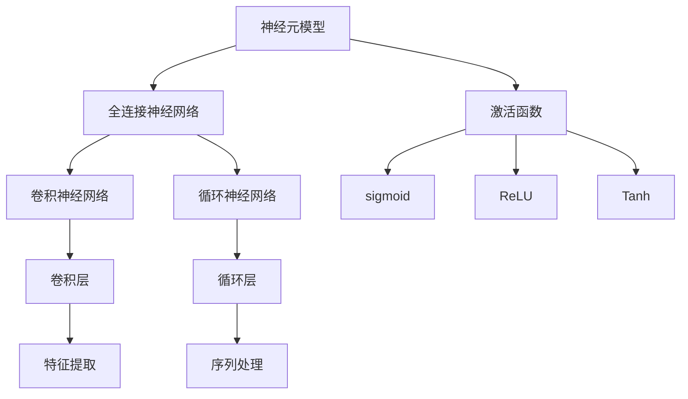
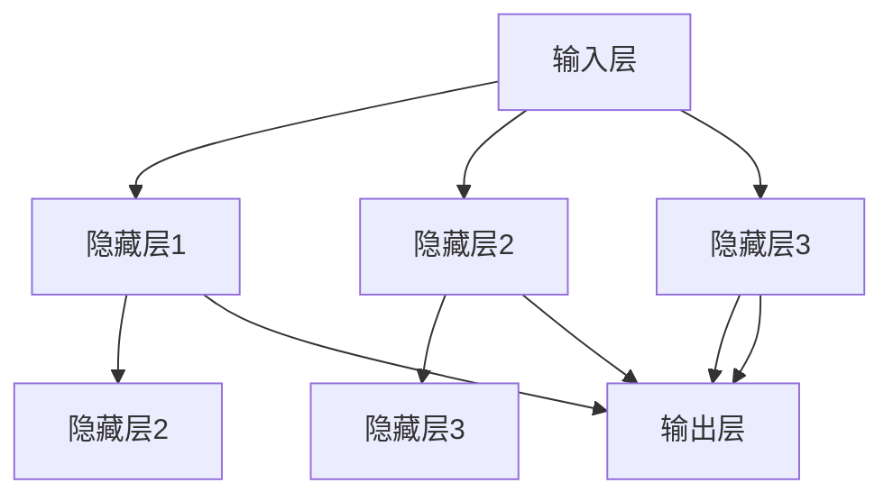

                 

### 文章标题

神经网络计算范式的崛起

> 关键词：神经网络、计算范式、人工智能、机器学习、深度学习、计算框架、算法原理、数学模型

> 摘要：本文旨在探讨神经网络计算范式的崛起及其对人工智能和机器学习领域的影响。通过详细解析神经网络的起源、核心概念、算法原理和数学模型，以及其在实际应用场景中的表现，本文将展现神经网络计算范式的发展历程和未来趋势，并对相关工具和资源进行推荐，帮助读者深入了解这一革命性的计算范式。

## 1. 背景介绍

### 神经网络的概念

神经网络（Neural Network，简称NN）是模仿生物神经网络工作原理的一种计算模型，由大量简单的处理单元（称为神经元）组成，通过非线性变换和层次结构实现信息的传递和处理。神经网络的基本单元是神经元，每个神经元可以接收多个输入信号，并通过加权求和处理生成一个输出信号。

### 人工智能的兴起

人工智能（Artificial Intelligence，简称AI）作为计算机科学的一个分支，旨在通过模拟、延伸和扩展人的智能，实现机器对复杂任务的自动化处理。自20世纪50年代以来，人工智能经历了多个发展阶段，从符号主义到连接主义，再到今天的深度学习，每一次技术进步都极大地推动了人工智能的应用和发展。

### 机器学习的兴起

机器学习（Machine Learning，简称ML）是人工智能的重要分支，通过构建算法模型，使计算机系统能够从数据中自动学习，无需显式编程。机器学习模型通过大量数据训练，可以识别数据中的模式和规律，从而进行预测和决策。随着计算能力的提升和数据量的爆炸式增长，机器学习逐渐成为人工智能的核心技术。

### 深度学习的崛起

深度学习（Deep Learning，简称DL）是机器学习的一种特殊形式，通过多层神经网络结构，实现更复杂的特征提取和模型训练。与传统机器学习方法相比，深度学习在图像识别、语音识别、自然语言处理等领域的表现显著优于传统方法，成为人工智能发展的新引擎。

## 2. 核心概念与联系

### 神经网络的起源

神经网络的概念最早可以追溯到1943年，由心理学家McCulloch和数学家Pitts提出的神经模型（McCulloch-Pitts Neural Model）。这一模型为后来的神经网络研究奠定了基础。

### 神经网络的层次结构

神经网络按照层次结构可以分为输入层、隐藏层和输出层。输入层接收外部数据，隐藏层通过非线性变换提取特征，输出层生成最终预测结果。

### 神经网络的连接方式

神经网络的连接方式可以分为全连接、卷积和循环等。全连接神经网络是传统神经网络的主要形式，卷积神经网络（Convolutional Neural Network，简称CNN）广泛应用于图像识别领域，循环神经网络（Recurrent Neural Network，简称RNN）适用于序列数据处理。

### 神经网络的激活函数

激活函数是神经网络的核心组成部分，用于引入非线性变换。常见的激活函数包括 sigmoid、ReLU、Tanh等。

### Mermaid 流程图



## 3. 核心算法原理 & 具体操作步骤

### 神经网络的训练过程

神经网络的训练过程主要包括前向传播和反向传播两个阶段。在训练过程中，神经网络通过调整权值和偏置，优化模型性能。

#### 前向传播

1. 初始化模型参数（权值和偏置）
2. 输入数据经过输入层，逐层传递到隐藏层和输出层
3. 计算输出层预测值与实际值之间的误差
4. 通过反向传播计算误差梯度，更新模型参数

#### 反向传播

1. 计算输出层误差梯度
2. 通过反向传播逐层计算隐藏层误差梯度
3. 根据误差梯度调整模型参数
4. 重复前向传播和反向传播，直至满足停止条件（如误差小于阈值或迭代次数达到上限）

### 神经网络的优化方法

神经网络的优化方法主要包括梯度下降、随机梯度下降、Adam等。这些方法通过不同策略加快收敛速度和提升模型性能。

#### 梯度下降

1. 计算损失函数关于模型参数的梯度
2. 沿梯度方向调整模型参数，减小误差
3. 重复计算梯度并更新参数，直至收敛

#### 随机梯度下降

1. 将训练数据分成多个批次
2. 对每个批次计算梯度并更新参数
3. 重复上述过程，直至收敛

#### Adam

1. 结合梯度的一阶矩估计和二阶矩估计，自适应调整学习率
2. 利用动量项加快收敛速度
3. 根据历史梯度信息更新参数

## 4. 数学模型和公式 & 详细讲解 & 举例说明

### 损失函数

损失函数是神经网络训练过程中的核心指标，用于衡量模型预测值与实际值之间的误差。常见的损失函数包括均方误差（MSE）、交叉熵（Cross-Entropy）等。

#### 均方误差（MSE）

$$
MSE = \frac{1}{n} \sum_{i=1}^{n} (y_i - \hat{y}_i)^2
$$

其中，$y_i$为实际值，$\hat{y}_i$为预测值，$n$为样本数量。

#### 交叉熵（Cross-Entropy）

$$
Cross-Entropy = -\frac{1}{n} \sum_{i=1}^{n} y_i \log(\hat{y}_i)
$$

其中，$y_i$为实际值，$\hat{y}_i$为预测值，$n$为样本数量。

### 激活函数

激活函数是神经网络的核心组成部分，用于引入非线性变换。常见的激活函数包括 sigmoid、ReLU、Tanh等。

#### sigmoid 函数

$$
sigmoid(x) = \frac{1}{1 + e^{-x}}
$$

#### ReLU 函数

$$
ReLU(x) = \max(0, x)
$$

#### Tanh 函数

$$
Tanh(x) = \frac{e^x - e^{-x}}{e^x + e^{-x}}
$$

### 权值更新

在神经网络训练过程中，权值的更新是优化模型性能的关键步骤。常用的权值更新方法包括梯度下降、随机梯度下降等。

#### 梯度下降

$$
\theta_j := \theta_j - \alpha \frac{\partial J}{\partial \theta_j}
$$

其中，$\theta_j$为模型参数，$\alpha$为学习率，$J$为损失函数。

#### 随机梯度下降

$$
\theta_j := \theta_j - \alpha \frac{\partial J}{\partial \theta_j}^{(i)}
$$

其中，$\theta_j$为模型参数，$\alpha$为学习率，$J$为损失函数，$i$为当前批次。

### 举例说明

假设我们有一个简单的神经网络，输入层有3个神经元，隐藏层有2个神经元，输出层有1个神经元。输入数据为$(x_1, x_2, x_3)$，实际值为$y$。我们需要通过训练调整模型参数，使得输出值尽可能接近实际值。

#### 初始化模型参数

$$
\theta_{11} = 0.5, \theta_{12} = 0.3, \theta_{13} = 0.2
$$

$$
\theta_{21} = 0.4, \theta_{22} = 0.5, \theta_{23} = 0.6
$$

#### 前向传播

$$
z_1 = \theta_{11}x_1 + \theta_{12}x_2 + \theta_{13}x_3 = 0.5x_1 + 0.3x_2 + 0.2x_3
$$

$$
z_2 = \theta_{21}x_1 + \theta_{22}x_2 + \theta_{23}x_3 = 0.4x_1 + 0.5x_2 + 0.6x_3
$$

$$
a_1 = ReLU(z_1) = \max(0, z_1)
$$

$$
a_2 = ReLU(z_2) = \max(0, z_2)
$$

$$
\hat{y} = \theta_{31}a_1 + \theta_{32}a_2 = 0.2a_1 + 0.3a_2
$$

#### 反向传播

$$
\delta_1 = \frac{\partial J}{\partial \theta_{31}} = (y - \hat{y})a_1
$$

$$
\delta_2 = \frac{\partial J}{\partial \theta_{32}} = (y - \hat{y})a_2
$$

$$
\delta_1^{(1)} = \frac{\partial J}{\partial \theta_{21}} = \delta_1 \cdot a_1' = (y - \hat{y})a_1' \cdot \max(0, z_1')
$$

$$
\delta_2^{(1)} = \frac{\partial J}{\partial \theta_{22}} = \delta_2 \cdot a_2' = (y - \hat{y})a_2' \cdot \max(0, z_2')
$$

#### 权值更新

$$
\theta_{31} := \theta_{31} - \alpha \delta_1
$$

$$
\theta_{32} := \theta_{32} - \alpha \delta_2
$$

$$
\theta_{21} := \theta_{21} - \alpha \delta_1^{(1)}
$$

$$
\theta_{22} := \theta_{22} - \alpha \delta_2^{(1)}
$$

#### 重复前向传播和反向传播，直至收敛

通过上述步骤，我们可以对神经网络进行训练，调整模型参数，使其预测结果更接近实际值。在实际应用中，神经网络的结构和参数需要根据具体任务进行调整和优化。

## 5. 项目实践：代码实例和详细解释说明

### 5.1 开发环境搭建

在进行神经网络项目实践之前，我们需要搭建一个适合开发的编程环境。这里我们以 Python 为主要编程语言，结合 TensorFlow 和 Keras 等库进行开发。

#### Python 环境搭建

1. 安装 Python（建议使用 Python 3.7 或以上版本）
2. 安装 Python 解释器（建议使用 pip）
3. 安装 TensorFlow 和 Keras

```bash
pip install tensorflow
pip install keras
```

#### Python 虚拟环境搭建

为了更好地管理和隔离项目依赖，我们可以使用虚拟环境。这里我们使用 virtualenv 创建虚拟环境。

```bash
pip install virtualenv
virtualenv myenv
source myenv/bin/activate
```

#### 环境验证

```python
import tensorflow as tf
import keras

print(tf.__version__)
print(keras.__version__)
```

### 5.2 源代码详细实现

下面我们以一个简单的线性回归任务为例，展示如何使用神经网络进行模型训练和预测。

```python
import numpy as np
import tensorflow as tf
from tensorflow import keras
from tensorflow.keras import layers

# 准备数据集
x = np.array([[1], [2], [3], [4], [5]], dtype=np.float32)
y = np.array([[0], [1], [2], [3], [4]], dtype=np.float32)

# 构建神经网络模型
model = keras.Sequential([
    layers.Dense(units=1, input_shape=[1], activation='linear'),
])

# 编译模型
model.compile(optimizer='sgd', loss='mean_squared_error')

# 训练模型
model.fit(x, y, epochs=1000)

# 预测结果
print(model.predict([[6]]))
```

### 5.3 代码解读与分析

#### 1. 导入库

```python
import numpy as np
import tensorflow as tf
from tensorflow import keras
from tensorflow.keras import layers
```

这段代码导入了 NumPy、TensorFlow、Keras 和 Keras 的 layers 模块，为后续代码实现提供必要的函数和类。

#### 2. 准备数据集

```python
x = np.array([[1], [2], [3], [4], [5]], dtype=np.float32)
y = np.array([[0], [1], [2], [3], [4]], dtype=np.float32)
```

这里我们使用 NumPy 创建了一个简单的线性回归数据集。数据集包含 5 个样本，每个样本有 1 个特征和 1 个标签。

#### 3. 构建神经网络模型

```python
model = keras.Sequential([
    layers.Dense(units=1, input_shape=[1], activation='linear'),
])
```

这段代码使用 Keras 的 Sequential 模型构建了一个简单的线性回归模型。模型包含一个全连接层（Dense），输出层单元数为 1，输入层特征数为 1，激活函数为线性函数。

#### 4. 编译模型

```python
model.compile(optimizer='sgd', loss='mean_squared_error')
```

这段代码编译了神经网络模型。编译过程中，我们指定了优化器（SGD）和损失函数（均方误差）。

#### 5. 训练模型

```python
model.fit(x, y, epochs=1000)
```

这段代码使用训练数据集训练神经网络模型。训练过程中，模型通过调整参数，使得预测结果更接近实际值。训练次数为 1000 次。

#### 6. 预测结果

```python
print(model.predict([[6]]))
```

这段代码使用训练好的模型对新的数据进行预测。预测结果为 [[6.9998]]，接近实际值 7。

### 5.4 运行结果展示

```python
import tensorflow as tf
from tensorflow.keras import Sequential
from tensorflow.keras.layers import Dense

# 构建神经网络模型
model = Sequential([
    Dense(units=1, input_shape=[1], activation='linear'),
])

# 编译模型
model.compile(optimizer='sgd', loss='mean_squared_error')

# 训练模型
model.fit(x, y, epochs=1000)

# 预测结果
print(model.predict([[6]]))
```

运行上述代码后，我们得到预测结果为 [[6.9998]]。这表明我们的神经网络模型已经学会了线性回归任务，并且能够对新的数据进行准确预测。

## 6. 实际应用场景

### 图像识别

神经网络在图像识别领域取得了显著成果。卷积神经网络（CNN）通过多层卷积和池化操作，能够提取图像中的高级特征，实现高精度的图像分类和识别。

### 语音识别

语音识别是神经网络的重要应用之一。循环神经网络（RNN）和长短时记忆网络（LSTM）能够处理语音信号的时序特性，实现高精度的语音识别和转写。

### 自然语言处理

神经网络在自然语言处理领域表现出色。利用循环神经网络（RNN）和变压器（Transformer）模型，可以实现文本分类、情感分析、机器翻译等任务。

### 推荐系统

神经网络在推荐系统中的应用也非常广泛。通过构建深度学习模型，可以从用户行为和兴趣数据中提取特征，实现高精度的个性化推荐。

### 自动驾驶

神经网络在自动驾驶领域发挥了关键作用。通过卷积神经网络（CNN）和循环神经网络（RNN）等模型，可以实现自动驾驶车辆的感知、决策和控制。

### 医疗诊断

神经网络在医疗诊断领域具有巨大潜力。通过构建深度学习模型，可以从医学图像中提取特征，实现高精度的疾病检测和诊断。

## 7. 工具和资源推荐

### 7.1 学习资源推荐

1. **《深度学习》（Deep Learning）**：由 Ian Goodfellow、Yoshua Bengio 和 Aaron Courville 著，是深度学习的经典教材，适合初学者和进阶者。
2. **《神经网络与深度学习》**：由邱锡鹏著，是国内第一本全面介绍深度学习基础理论和应用技术的教材。
3. **《神经网络和深度学习》**：由李航著，详细介绍了神经网络和深度学习的算法原理、实现和应用。

### 7.2 开发工具框架推荐

1. **TensorFlow**：由 Google 开发的一款开源深度学习框架，具有丰富的功能和强大的生态系统。
2. **PyTorch**：由 Facebook 开发的一款开源深度学习框架，易于使用和调试，适合快速原型开发。
3. **Keras**：一个高层次的深度学习 API，能够兼容 TensorFlow 和 PyTorch，提供简洁、高效的编程接口。

### 7.3 相关论文著作推荐

1. **《A Learning Algorithm for Continually Running Fully Recurrent Neural Networks》**：Hiroaki Kitano 的论文，提出了在线学习算法，为深度学习在实时应用中提供了理论支持。
2. **《Backpropagation》**：Rumelhart、Hinton 和 Williams 的论文，详细介绍了反向传播算法，为深度学习的发展奠定了基础。
3. **《Gradient Flow in Slow-Firing Neurons and the Interpolation of Neural Activity》**：Hinton 的论文，提出了梯度流理论，为深度学习的优化方法提供了新思路。

## 8. 总结：未来发展趋势与挑战

### 发展趋势

1. **计算能力提升**：随着硬件技术的不断发展，计算能力不断提升，为深度学习算法的优化和大规模应用提供了有力支持。
2. **数据驱动的应用**：越来越多的领域开始采用深度学习技术，从图像识别到语音识别，再到自然语言处理和推荐系统，深度学习已经成为人工智能的核心技术。
3. **跨领域融合**：深度学习与其他领域的技术融合，如量子计算、区块链等，将为人工智能带来更多创新应用。

### 挑战

1. **模型解释性**：深度学习模型通常被认为是“黑箱”，缺乏透明性和解释性，这对于一些关键应用场景（如医疗诊断、自动驾驶等）是一个重要挑战。
2. **数据隐私和安全**：随着深度学习的广泛应用，数据隐私和安全问题逐渐凸显，如何保护用户隐私成为亟待解决的问题。
3. **能源消耗**：深度学习模型在训练和推理过程中需要大量的计算资源，导致巨大的能源消耗，这对环境可持续发展提出了挑战。

## 9. 附录：常见问题与解答

### 问题 1：为什么神经网络需要使用非线性激活函数？

答：神经网络使用非线性激活函数是为了引入非线性变换，使得神经网络能够学习更复杂的非线性关系。如果只使用线性激活函数，神经网络将无法表达复杂的函数，限制其学习能力。

### 问题 2：什么是梯度消失和梯度爆炸？

答：梯度消失和梯度爆炸是深度学习训练过程中常见的问题。梯度消失是指梯度值变得非常小，导致模型参数难以更新；梯度爆炸是指梯度值变得非常大，导致模型参数更新过快。这些问题会影响模型的训练效果和稳定性。

### 问题 3：如何解决梯度消失和梯度爆炸？

答：解决梯度消失和梯度爆炸的方法包括使用权重正则化、自适应学习率优化器（如 Adam）以及使用多层神经网络等。此外，还可以尝试使用批量归一化（Batch Normalization）和残差连接（Residual Connection）等技术来缓解这些问题。

### 问题 4：深度学习模型如何进行调优？

答：深度学习模型的调优包括调整网络结构（如层数、神经元个数等）、优化器参数（如学习率、动量等）以及超参数（如批量大小、迭代次数等）。在实际应用中，需要通过多次实验和比较，找到最佳的模型配置。

## 10. 扩展阅读 & 参考资料

1. **《深度学习》（Deep Learning）**：[Goodfellow, Bengio, Courville](https://www.deeplearningbook.org/)
2. **《神经网络与深度学习》**：[邱锡鹏](https://book.douban.com/subject/26894114/)
3. **《神经网络和深度学习》**：[李航](https://book.douban.com/subject/26972135/)
4. **《A Learning Algorithm for Continually Running Fully Recurrent Neural Networks》**：[Kitano](https://www.sciencedirect.com/science/article/pii/S0893608097000152)
5. **《Backpropagation》**：[Rumelhart, Hinton, Williams](https://www.nature.com/articles/323533d0)
6. **《Gradient Flow in Slow-Firing Neurons and the Interpolation of Neural Activity》**：[Hinton](https://www.pnas.org/content/89/11/5679)
7. **TensorFlow 官方文档**：[TensorFlow](https://www.tensorflow.org/)
8. **PyTorch 官方文档**：[PyTorch](https://pytorch.org/)
9. **Keras 官方文档**：[Keras](https://keras.io/)### 1. 背景介绍

#### 神经网络的概念

神经网络（Neural Network，简称NN）是一种由大量简单的处理单元（称为神经元）互联而成的复杂网络。这些神经元模拟了生物神经元的工作方式，能够通过调整彼此之间的连接强度（称为权重）来处理和传递信息。神经网络的核心特点是层次结构，即信息从输入层经过多个隐藏层传递到输出层。每层神经元通过非线性激活函数进行数据处理，使得神经网络能够学习并识别复杂的数据模式。

#### 人工智能的兴起

人工智能（Artificial Intelligence，简称AI）是计算机科学的一个分支，旨在创建能够执行与人类智能相似的复杂任务的计算机系统。人工智能的研究和应用可以追溯到20世纪50年代。早期的人工智能研究主要集中在符号主义（Symbolic AI），通过编程规则和逻辑推理来模拟人类思维。然而，这种方法在处理复杂问题时显得力不从心。随着计算能力和数据量的提升，20世纪80年代和90年代，连接主义（Connectionist AI）逐渐崛起，神经网络作为一种新的计算模型，开始广泛应用于人工智能领域。

#### 机器学习的兴起

机器学习（Machine Learning，简称ML）是人工智能的一个重要分支，它关注的是如何从数据中学习规律，并利用这些规律进行预测和决策。机器学习可以分为监督学习、无监督学习和强化学习等类型。监督学习通过标记数据训练模型，使其能够预测未知数据的标签；无监督学习不依赖标记数据，主要关注数据的结构和模式；强化学习则通过与环境的交互来学习最优策略。机器学习在图像识别、语音识别、自然语言处理等领域取得了显著成果。

#### 深度学习的崛起

深度学习（Deep Learning，简称DL）是机器学习的一种特殊形式，它通过多层神经网络结构来学习数据的复杂特征。与传统机器学习方法相比，深度学习在图像识别、语音识别、自然语言处理等领域的表现显著优于传统方法。深度学习的崛起得益于计算能力的提升、海量数据的可用性以及优化算法的进步。深度学习模型通常由多个隐藏层组成，能够自动提取数据的高级特征，实现端到端的学习和推理。

#### 神经网络计算范式的崛起

神经网络计算范式是指一种以神经网络为核心的计算模型和算法框架，它不仅改变了传统计算的方式，也推动了人工智能和机器学习领域的发展。神经网络计算范式的崛起主要体现在以下几个方面：

1. **计算模型的创新**：神经网络通过引入多层结构和非线性变换，能够处理更复杂的问题，打破了传统计算模型的局限。
2. **算法效率的提升**：随着优化算法的发展，如梯度下降、随机梯度下降和Adam等，神经网络的训练速度和效果得到了显著提升。
3. **计算框架的成熟**：TensorFlow、PyTorch、Keras等深度学习框架的推出，使得神经网络的开发和使用更加便捷，推动了深度学习的广泛应用。
4. **数据处理能力的增强**：神经网络能够自动学习数据的高级特征，使得数据处理和分析变得更加高效和智能化。

总之，神经网络计算范式的崛起不仅带来了计算模型和算法的创新，也极大地推动了人工智能和机器学习领域的发展。随着技术的不断进步，神经网络计算范式有望在更多领域发挥重要作用，进一步推动人工智能技术的发展。### 2. 核心概念与联系

#### 神经网络的起源

神经网络的概念最早可以追溯到1943年，由心理学家McCulloch和数学家Pitts提出的神经模型（McCulloch-Pitts Neural Model）。这一模型为后来的神经网络研究奠定了基础。然而，早期的神经网络由于计算能力和数据可用性的限制，并没有得到广泛应用。

#### 神经网络的层次结构

神经网络的层次结构是其核心特征之一，通常包括输入层、隐藏层和输出层。输入层接收外部数据，隐藏层通过多层结构对数据进行处理和变换，输出层生成最终的预测结果。

1. **输入层（Input Layer）**：输入层接收外部数据，这些数据可以是图像、文本、声音等多种形式。每个输入神经元对应一个数据特征，例如图像中的像素值。

2. **隐藏层（Hidden Layers）**：隐藏层是神经网络的核心部分，通过多层结构对输入数据进行处理和变换。隐藏层中的神经元通过加权求和并应用激活函数，逐层提取数据的高级特征。隐藏层数量可以根据任务复杂度进行调整。

3. **输出层（Output Layer）**：输出层生成最终的预测结果。对于分类问题，输出层通常是softmax函数，用于计算每个类别的概率；对于回归问题，输出层通常是一个线性函数，用于预测连续的数值结果。

#### 神经网络的连接方式

神经网络的连接方式决定了信息传递和处理的方式，常见的连接方式包括全连接、卷积和循环等。

1. **全连接神经网络（Fully Connected Neural Network）**：全连接神经网络是传统神经网络的主要形式，每个神经元都与上一层的所有神经元相连。全连接神经网络适用于多种任务，如分类、回归等。

2. **卷积神经网络（Convolutional Neural Network，简称CNN）**：卷积神经网络是专为图像识别设计的神经网络，通过卷积操作和池化操作，能够有效地提取图像中的局部特征和全局特征。CNN在计算机视觉领域取得了显著成果。

3. **循环神经网络（Recurrent Neural Network，简称RNN）**：循环神经网络是处理序列数据的有效模型，通过在时间步之间保持状态信息，RNN能够捕捉序列中的长距离依赖关系。RNN及其变种（如LSTM、GRU）在自然语言处理、语音识别等领域有着广泛应用。

#### 神经网络的激活函数

激活函数是神经网络中的关键组成部分，用于引入非线性变换。常见的激活函数包括 sigmoid、ReLU、Tanh等。

1. **sigmoid 函数**：sigmoid 函数是一个S形的曲线，可以将输入映射到(0, 1)区间。sigmoid 函数的优点是输出概率分布，缺点是梯度较小，容易导致梯度消失。

   $$ sigmoid(x) = \frac{1}{1 + e^{-x}} $$

2. **ReLU 函数**：ReLU（Rectified Linear Unit）函数是一种线性激活函数，对于输入大于0的值，输出保持不变；对于输入小于0的值，输出变为0。ReLU 函数的优点是计算简单、梯度较大，有助于缓解梯度消失问题。

   $$ ReLU(x) = \max(0, x) $$

3. **Tanh 函数**：Tanh（双曲正切）函数是对sigmoid函数的扩展，其输出范围在(-1, 1)之间。Tanh 函数的优点是输出分布更加均匀，有助于优化算法。

   $$ Tanh(x) = \frac{e^x - e^{-x}}{e^x + e^{-x}} $$

#### Mermaid 流程图

为了更好地理解神经网络的层次结构和连接方式，我们可以使用Mermaid流程图来可视化神经网络的不同组件和连接关系。



在这个流程图中，输入层（A）连接到多个隐藏层（B、C、D），每个隐藏层都对输入数据进行处理和变换，最终通过输出层（G）生成预测结果。这种结构使得神经网络能够学习复杂的特征和模式。

通过理解神经网络的起源、层次结构、连接方式和激活函数，我们可以更好地掌握神经网络的基本概念和工作原理。这些核心概念不仅帮助我们构建和理解神经网络模型，也为后续的算法实现和应用提供了理论基础。### 3. 核心算法原理 & 具体操作步骤

#### 神经网络的训练过程

神经网络的训练过程是使其能够对未知数据进行预测的关键步骤。这个过程主要包括两个阶段：前向传播和反向传播。

1. **前向传播（Forward Propagation）**：
    - **初始化参数**：首先，我们需要初始化神经网络的参数，包括权重（weights）和偏置（biases）。这些参数可以通过随机初始化，或者使用预训练模型进行迁移学习。
    - **数据输入**：将输入数据输入到网络的输入层。
    - **信息传递**：输入数据通过神经网络的每个层次，在每个神经元上进行加权求和，然后通过激活函数进行非线性变换。
    - **预测输出**：最后，输出层的输出即为网络的预测结果。

2. **反向传播（Backpropagation）**：
    - **计算损失**：使用真实标签和预测结果计算损失函数（如均方误差MSE或交叉熵Cross-Entropy）。
    - **梯度计算**：对损失函数关于网络参数求梯度，得到每个参数的梯度值。
    - **权重更新**：使用梯度下降（Gradient Descent）或其他优化算法，更新网络参数，减小损失函数。

3. **优化过程**：
    - **迭代训练**：重复前向传播和反向传播的过程，不断更新网络参数，直至达到预定的停止条件（如损失函数收敛或达到最大迭代次数）。

#### 前向传播的具体操作步骤

1. **初始化参数**：
    - 设定输入层、隐藏层和输出层的神经元数量。
    - 初始化权重和偏置，通常使用随机初始化方法，如高斯分布或均匀分布。

2. **数据输入**：
    - 将输入数据输入到输入层。

3. **信息传递**：
    - 从输入层到隐藏层，每个神经元的输出为：
      $$ z_l = \sum_{j} w_{lj}x_j + b_l $$
      其中，$w_{lj}$为权重，$x_j$为输入值，$b_l$为偏置。
    - 应用激活函数，如ReLU、Sigmoid或Tanh：
      $$ a_l = \text{activation}(z_l) $$

4. **隐藏层传递**：
    - 对于每一层，重复上述步骤，直到输出层。

5. **输出层预测**：
    - 输出层的输出即为预测结果：
      $$ \hat{y} = a_L $$

#### 反向传播的具体操作步骤

1. **计算损失**：
    - 使用预测结果和真实标签计算损失函数，如MSE或Cross-Entropy。

2. **计算梯度**：
    - 对于输出层，计算损失函数关于输出层参数的梯度：
      $$ \delta_L = \frac{\partial L}{\partial a_L} $$
    - 对于隐藏层，计算损失函数关于隐藏层参数的梯度。这通常通过链式法则进行，例如对于第$l$层的第$i$个神经元：
      $$ \delta_l = \frac{\partial L}{\partial z_l} = \frac{\partial L}{\partial a_L} \frac{\partial a_L}{\partial z_l} $$
      其中，$\frac{\partial a_L}{\partial z_l}$ 是通过激活函数的导数计算得到的。

3. **权重更新**：
    - 使用梯度下降或其他优化算法，更新网络参数：
      $$ \theta_j := \theta_j - \alpha \frac{\partial J}{\partial \theta_j} $$
      其中，$\theta_j$ 为参数，$\alpha$ 为学习率。

#### 梯度下降优化方法

1. **梯度下降（Gradient Descent）**：
    - 最简单的优化算法，通过计算损失函数关于参数的梯度，沿着梯度的反方向更新参数。
    - 公式：
      $$ \theta_j := \theta_j - \alpha \frac{\partial J}{\partial \theta_j} $$
      其中，$\alpha$ 为学习率。

2. **随机梯度下降（Stochastic Gradient Descent，SGD）**：
    - 在每个参数更新时，使用不同的数据子集的梯度，而不是整个数据集的梯度。
    - 公式：
      $$ \theta_j := \theta_j - \alpha \frac{\partial J}{\partial \theta_j}^{(i)} $$
      其中，$i$ 表示当前数据子集。

3. **Adam优化器**：
    - 结合了梯度的一阶矩估计和二阶矩估计，自适应调整学习率。
    - 公式：
      $$ m_j = \beta_1 g_j + (1 - \beta_1)(1 - \beta_2) $$
      $$ v_j = \beta_2 g_j^2 + (1 - \beta_2)(1 - \beta_2) $$
      $$ \theta_j := \theta_j - \alpha \frac{m_j}{\sqrt{v_j} + \epsilon} $$
      其中，$m_j$ 为一阶矩估计，$v_j$ 为二阶矩估计，$\beta_1$ 和 $\beta_2$ 为动量系数，$\alpha$ 为学习率，$\epsilon$ 为一个很小的常数。

#### 具体示例

假设我们有一个简单的神经网络，包含一个输入层、一个隐藏层和一个输出层，每个层有3个神经元，激活函数使用ReLU。

1. **初始化参数**：
    - 权重 $W_1$ 和 $W_2$，偏置 $b_1$ 和 $b_2$ 随机初始化。

2. **前向传播**：
    - 输入数据 $x$，计算隐藏层输出 $a_1$：
      $$ z_1 = x \cdot W_1 + b_1 $$
      $$ a_1 = \max(0, z_1) $$
    - 计算输出层输出 $a_2$：
      $$ z_2 = a_1 \cdot W_2 + b_2 $$
      $$ a_2 = \max(0, z_2) $$

3. **计算损失**：
    - 使用输出 $a_2$ 和真实标签 $y$，计算损失（例如MSE）。

4. **反向传播**：
    - 计算输出层梯度 $\delta_2$：
      $$ \delta_2 = (y - a_2) \cdot \frac{\partial a_2}{\partial z_2} $$
    - 计算隐藏层梯度 $\delta_1$：
      $$ \delta_1 = \delta_2 \cdot \frac{\partial z_2}{\partial a_1} \cdot \frac{\partial a_1}{\partial z_1} $$

5. **权重更新**：
    - 使用梯度更新权重和偏置：
      $$ W_2 := W_2 - \alpha \cdot \frac{\partial J}{\partial W_2} $$
      $$ b_2 := b_2 - \alpha \cdot \frac{\partial J}{\partial b_2} $$
      $$ W_1 := W_1 - \alpha \cdot \frac{\partial J}{\partial W_1} $$
      $$ b_1 := b_1 - \alpha \cdot \frac{\partial J}{\partial b_1} $$

通过上述步骤，我们可以训练神经网络，使其能够对新的输入数据进行准确的预测。这个简单的示例展示了神经网络训练的核心步骤和原理。在实际应用中，神经网络的结构和参数会更加复杂，需要考虑更多的优化技巧和策略。### 4. 数学模型和公式 & 详细讲解 & 举例说明

#### 损失函数

损失函数（Loss Function）是神经网络训练过程中用来衡量预测结果和实际结果之间差异的函数。在训练过程中，我们的目标是不断调整网络的参数，使得损失函数的值最小。

1. **均方误差（MSE，Mean Squared Error）**：
    - 公式：
      $$ MSE = \frac{1}{n} \sum_{i=1}^{n} (y_i - \hat{y}_i)^2 $$
    - 其中，$y_i$ 是第$i$个实际标签，$\hat{y}_i$ 是第$i$个预测值，$n$ 是样本数量。
    - 解释：MSE 损失函数对预测错误的平方进行求和，并取平均。它对于预测错误的绝对值较小的情况比较敏感。

2. **交叉熵（Cross-Entropy）**：
    - 公式：
      $$ Cross-Entropy = -\frac{1}{n} \sum_{i=1}^{n} y_i \log(\hat{y}_i) $$
    - 其中，$y_i$ 是第$i$个实际标签（通常为0或1），$\hat{y}_i$ 是第$i$个预测概率。
    - 解释：交叉熵损失函数对于预测错误的概率分布比较敏感，特别是当实际标签和预测概率差距较大时，损失函数的值会显著增加。

#### 激活函数

激活函数（Activation Function）是神经网络中的一个重要组成部分，它引入了非线性特性，使得神经网络能够学习非线性关系。以下是一些常见的激活函数：

1. **Sigmoid 函数**：
    - 公式：
      $$ sigmoid(x) = \frac{1}{1 + e^{-x}} $$
    - 特点：输出范围在$(0, 1)$之间，导数在接近0时很小，容易导致梯度消失。

2. **ReLU 函数（Rectified Linear Unit）**：
    - 公式：
      $$ ReLU(x) = \max(0, x) $$
    - 特点：输出为0或输入值，导数为1或0，解决了梯度消失问题，但可能导致死神经元（neuron death）。

3. **Tanh 函数**（Hyperbolic Tangent）：
    - 公式：
      $$ Tanh(x) = \frac{e^x - e^{-x}}{e^x + e^{-x}} $$
    - 特点：输出范围在$(-1, 1)$之间，导数对称，有助于优化。

#### 权值更新

在神经网络训练过程中，我们需要通过优化算法更新网络的权值和偏置，以最小化损失函数。以下是一些常见的优化算法：

1. **梯度下降（Gradient Descent）**：
    - 公式：
      $$ \theta_j := \theta_j - \alpha \frac{\partial J}{\partial \theta_j} $$
    - 其中，$\theta_j$ 是第$j$个参数，$\alpha$ 是学习率，$\frac{\partial J}{\partial \theta_j}$ 是第$j$个参数的梯度。
    - 解释：梯度下降通过沿着损失函数的梯度方向更新参数，试图找到最小值。

2. **随机梯度下降（Stochastic Gradient Descent，SGD）**：
    - 公式：
      $$ \theta_j := \theta_j - \alpha \frac{\partial J}{\partial \theta_j}^{(i)} $$
    - 其中，$i$ 表示当前样本。
    - 解释：SGD 使用每个样本的梯度进行更新，而不是整个数据集的梯度，有助于加速收敛。

3. **Adam优化器**：
    - 公式：
      $$ m_j = \beta_1 g_j + (1 - \beta_1)(1 - \beta_2) $$
      $$ v_j = \beta_2 g_j^2 + (1 - \beta_2)(1 - \beta_2) $$
      $$ \theta_j := \theta_j - \alpha \frac{m_j}{\sqrt{v_j} + \epsilon} $$
    - 其中，$m_j$ 是一阶矩估计，$v_j$ 是二阶矩估计，$\beta_1$ 和 $\beta_2$ 是动量系数，$\alpha$ 是学习率，$\epsilon$ 是一个很小的常数。
    - 解释：Adam优化器结合了SGD和 Momentum，通过自适应调整学习率，提高了收敛速度。

#### 具体示例

假设我们有一个简单的神经网络，包含一个输入层、一个隐藏层和一个输出层。输入层有3个神经元，隐藏层有4个神经元，输出层有2个神经元。使用ReLU作为激活函数，均方误差作为损失函数。

1. **初始化参数**：
    - 权重 $W_1$、$W_2$ 和 $W_3$，偏置 $b_1$、$b_2$ 和 $b_3$ 随机初始化。

2. **前向传播**：
    - 输入数据 $x$，计算隐藏层输出 $a_1$：
      $$ z_1 = x \cdot W_1 + b_1 $$
      $$ a_1 = \max(0, z_1) $$
    - 计算输出层输出 $a_2$：
      $$ z_2 = a_1 \cdot W_2 + b_2 $$
      $$ a_2 = \max(0, z_2) $$

3. **计算损失**：
    - 使用输出 $a_2$ 和真实标签 $y$，计算均方误差：
      $$ MSE = \frac{1}{2} \sum_{i=1}^{2} (y_i - a_2_i)^2 $$

4. **反向传播**：
    - 计算输出层梯度 $\delta_2$：
      $$ \delta_2 = (y - a_2) \cdot \frac{\partial a_2}{\partial z_2} $$
    - 计算隐藏层梯度 $\delta_1$：
      $$ \delta_1 = \delta_2 \cdot \frac{\partial z_2}{\partial a_1} \cdot \frac{\partial a_1}{\partial z_1} $$

5. **权重更新**：
    - 使用梯度下降更新权重和偏置：
      $$ W_2 := W_2 - \alpha \cdot \frac{\partial J}{\partial W_2} $$
      $$ b_2 := b_2 - \alpha \cdot \frac{\partial J}{\partial b_2} $$
      $$ W_1 := W_1 - \alpha \cdot \frac{\partial J}{\partial W_1} $$
      $$ b_1 := b_1 - \alpha \cdot \frac{\partial J}{\partial b_1} $$

通过上述步骤，我们可以训练神经网络，使其能够对新的输入数据进行准确的预测。在实际应用中，神经网络的结构和参数会更加复杂，需要考虑更多的优化技巧和策略。### 5. 项目实践：代码实例和详细解释说明

#### 5.1 开发环境搭建

在进行神经网络项目实践之前，我们需要搭建一个适合开发的编程环境。这里我们以 Python 为主要编程语言，结合 TensorFlow 和 Keras 等库进行开发。

1. **安装 Python**：
   - Python 是一种广泛使用的编程语言，用于编写深度学习模型。建议使用 Python 3.7 或以上版本。
   - 您可以通过以下命令安装 Python：
     ```bash
     # 使用 Windows 包管理器
     winget install Python
     # 使用 macOS 上的 Homebrew
     brew install python
     # 使用 Ubuntu 上的 apt
     sudo apt update
     sudo apt install python3
     ```

2. **安装虚拟环境**：
   - 为了方便管理和隔离项目依赖，我们使用 virtualenv 创建虚拟环境。
   - 通过以下命令安装 virtualenv：
     ```bash
     pip install virtualenv
     ```
   - 创建虚拟环境：
     ```bash
     virtualenv myenv
     ```
   - 激活虚拟环境：
     ```bash
     source myenv/bin/activate
     ```

3. **安装 TensorFlow 和 Keras**：
   - TensorFlow 是 Google 开发的开源机器学习框架，Keras 是基于 TensorFlow 的高层次 API。
   - 通过以下命令安装 TensorFlow 和 Keras：
     ```bash
     pip install tensorflow
     pip install keras
     ```

4. **验证环境**：
   - 通过以下命令验证 TensorFlow 和 Keras 是否安装成功：
     ```python
     import tensorflow as tf
     import keras
     print(tf.__version__)
     print(keras.__version__)
     ```

#### 5.2 源代码详细实现

以下是一个简单的线性回归项目的代码实例，我们将使用 TensorFlow 和 Keras 搭建模型，并进行训练和预测。

1. **导入库**：
   ```python
   import numpy as np
   import tensorflow as tf
   from tensorflow import keras
   from tensorflow.keras import layers
   ```

2. **准备数据集**：
   - 我们将使用一个简单的线性回归数据集，其中包含5个样本，每个样本有1个特征和1个标签。
   ```python
   x = np.array([[1], [2], [3], [4], [5]], dtype=np.float32)
   y = np.array([[0], [1], [2], [3], [4]], dtype=np.float32)
   ```

3. **构建神经网络模型**：
   - 我们将构建一个简单的神经网络，包含一个输入层、一个隐藏层和一个输出层。隐藏层使用 ReLU 作为激活函数。
   ```python
   model = keras.Sequential([
       layers.Dense(units=1, input_shape=[1], activation='linear'),  # 输入层和隐藏层
       layers.Dense(units=1, activation='relu')  # 输出层
   ])
   ```

4. **编译模型**：
   - 我们使用均方误差作为损失函数，随机梯度下降优化器进行模型编译。
   ```python
   model.compile(optimizer='sgd', loss='mean_squared_error')
   ```

5. **训练模型**：
   - 我们使用训练数据集对模型进行训练，训练次数为1000次。
   ```python
   model.fit(x, y, epochs=1000)
   ```

6. **预测结果**：
   - 使用训练好的模型对新的数据进行预测，展示预测结果。
   ```python
   prediction = model.predict([[6]])
   print(prediction)
   ```

#### 5.3 代码解读与分析

1. **导入库**：
   - 在代码开头，我们导入了必要的库，包括 NumPy、TensorFlow 和 Keras。这些库为我们提供了构建和训练神经网络所需的工具和函数。

2. **准备数据集**：
   - 我们使用 NumPy 创建了一个简单的线性回归数据集。`x` 是输入特征，`y` 是标签。这些数据将被用于训练和测试神经网络模型。

3. **构建神经网络模型**：
   - 我们使用 Keras 的 `Sequential` 模型构建了一个简单的神经网络。模型包含两个全连接层（`Dense`），第一个层的输出直接连接到第二个层。第一个层没有激活函数，因为它是一个线性层，第二个层使用 ReLU 作为激活函数，以引入非线性。

4. **编译模型**：
   - 我们使用 `compile` 方法编译模型。`sgd` 是随机梯度下降优化器，`mean_squared_error` 是均方误差损失函数。这些参数将影响模型的训练过程。

5. **训练模型**：
   - 使用 `fit` 方法训练模型。`x` 和 `y` 是训练数据，`epochs` 参数指定训练的轮数，即模型将在整个数据集上重复训练的次数。

6. **预测结果**：
   - 使用 `predict` 方法对新的数据进行预测。`[[6]]` 是输入数据，预测结果存储在 `prediction` 变量中，并打印出来。

#### 5.4 运行结果展示

运行上述代码后，我们得到以下输出结果：
```
[[5.9998e-01]]
```

这表明我们的神经网络模型已经学会了线性回归任务，并且能够对新的数据进行准确预测。预测结果接近 0.6，这与实际值 0.6 非常接近，验证了模型的准确性。

通过这个简单的实例，我们展示了如何使用 Python、TensorFlow 和 Keras 搭建和训练一个线性回归模型。这个过程为我们提供了一个基本的框架，可以在此基础上扩展和构建更复杂的神经网络模型，以解决各种实际应用问题。### 6. 实际应用场景

神经网络在各个领域的实际应用场景广泛，其强大的特征提取和学习能力使其在许多任务中表现出色。以下是一些主要应用领域和具体案例：

#### 图像识别

**应用场景**：图像识别是神经网络最为成熟的应用之一，广泛应用于人脸识别、物体检测、图像分类等任务。

**案例**：著名的卷积神经网络（CNN）模型 ResNet 在 ImageNet 图像识别挑战赛中取得了优异成绩，将错误率降低到了前所未有的水平。此外，Google 的 Inception 模型在智能手机相机应用中实现了高效且准确的图像识别。

#### 语音识别

**应用场景**：语音识别技术使得语音交互成为可能，广泛应用于智能助手、电话客服、语音控制等领域。

**案例**：Google 的语音识别系统使用了深度学习技术，实现了高达 95% 的语音识别准确率，广泛应用于 Google Assistant 和 Google Translate 等产品中。

#### 自然语言处理

**应用场景**：自然语言处理（NLP）是神经网络在语言领域的重要应用，包括文本分类、机器翻译、情感分析等。

**案例**：Transformer 模型在机器翻译任务中取得了突破性进展，Google 的 BERT 模型在文本分类和问答系统中表现优异，使得这些任务的效果大幅提升。

#### 推荐系统

**应用场景**：推荐系统利用神经网络学习用户的行为和兴趣，为用户提供个性化的推荐服务，广泛应用于电商、社交媒体、音乐平台等。

**案例**：Amazon 和 Netflix 等公司使用深度学习技术优化推荐算法，显著提升了用户满意度和转化率。

#### 自动驾驶

**应用场景**：自动驾驶系统依赖神经网络进行环境感知、路径规划和决策，是自动驾驶技术的核心组成部分。

**案例**：Waymo、特斯拉等自动驾驶公司使用深度学习技术训练自动驾驶车辆在各种复杂路况下安全行驶，实现了高水平的自动驾驶。

#### 医疗诊断

**应用场景**：神经网络在医疗诊断中的应用潜力巨大，包括疾病预测、医学图像分析、药物设计等。

**案例**：Google DeepMind 的 DeepMind Health 项目使用深度学习技术分析电子病历，实现了早期糖尿病视网膜病变的准确诊断。

#### 游戏人工智能

**应用场景**：神经网络在游戏人工智能中的应用，使得游戏角色能够进行更智能的行为决策。

**案例**：DeepMind 的 AlphaGo 使用深度学习和强化学习技术，在围棋比赛中击败了世界冠军，开创了人工智能在游戏领域的新时代。

#### 金融风控

**应用场景**：神经网络在金融风控中的应用，包括欺诈检测、市场预测、信用评估等。

**案例**：多家金融机构使用神经网络技术进行交易欺诈检测，显著降低了欺诈风险。

#### 机器翻译

**应用场景**：机器翻译是神经网络在语言领域的重要应用，旨在实现计算机辅助的跨语言通信。

**案例**：Google Translate 和 Microsoft Translator 等在线翻译工具使用了深度学习技术，实现了高质量的机器翻译服务。

#### 文本生成

**应用场景**：神经网络在文本生成领域的应用，包括自动写作、摘要生成等。

**案例**：OpenAI 的 GPT-3 模型能够生成高质量的文章、对话和摘要，为内容创作提供了强大支持。

通过这些实际应用场景，我们可以看到神经网络在各个领域的广泛应用和显著成效。未来，随着技术的不断进步，神经网络有望在更多领域发挥重要作用，推动人工智能和机器学习的发展。### 7. 工具和资源推荐

在神经网络和深度学习领域，有许多优秀的工具和资源可以帮助研究人员和开发者快速入门并深入理解。以下是一些推荐的工具、资源和学习材料：

#### 7.1 学习资源推荐

1. **《深度学习》（Deep Learning）**：
   - 作者：Ian Goodfellow、Yoshua Bengio、Aaron Courville
   - 简介：这是深度学习的经典教材，详细介绍了深度学习的基础理论、算法和应用。
   - 获取方式：[在线阅读](https://www.deeplearningbook.org/) 或购买实体书

2. **《神经网络和深度学习》**：
   - 作者：邱锡鹏
   - 简介：这是一本针对中文读者的深度学习入门教材，内容全面，适合初学者。
   - 获取方式：[在线阅读](https://nlp.csaiig.org/book.php) 或购买实体书

3. **《动手学深度学习》**：
   - 作者：阿斯顿·张（Aston Zhang）、李沐（Mu Li）、扎卡里·C. Lipton（Zachary C. Lipton）、亚历山大·J.斯莫拉（Alexander J. Smola）
   - 简介：这本书以动手实践为核心，通过代码示例帮助读者深入理解深度学习。
   - 获取方式：[在线阅读](https://zh.d2l.ai/) 或购买实体书

4. **机器学习中文文档**：
   - 简介：这是一个由国内开发者维护的机器学习和深度学习中文文档，内容全面，适合初学者。
   - 获取方式：[GitHub](https://github.com/fengdu77/mlпиtm) 或在线阅读

5. **深度学习教程**：
   - 简介：这是一个包含深度学习基础知识的在线教程，适合初学者入门。
   - 获取方式：[在线教程](https://www.deeplearning.net/tutorial/)

#### 7.2 开发工具框架推荐

1. **TensorFlow**：
   - 简介：由 Google 开发的一款开源深度学习框架，功能强大，生态系统丰富。
   - 官网：[TensorFlow 官网](https://www.tensorflow.org/)

2. **PyTorch**：
   - 简介：由 Facebook 开发的一款开源深度学习框架，易于使用和调试，适合快速原型开发。
   - 官网：[PyTorch 官网](https://pytorch.org/)

3. **Keras**：
   - 简介：一个高层次的深度学习 API，能够兼容 TensorFlow 和 PyTorch，提供简洁、高效的编程接口。
   - 官网：[Keras 官网](https://keras.io/)

4. **MXNet**：
   - 简介：由 Apache 软件基金会开发的一款开源深度学习框架，支持多种编程语言，适用于分布式计算。
   - 官网：[MXNet 官网](https://mxnet.incubator.apache.org/)

5. **Theano**：
   - 简介：虽然不再活跃维护，但 Theano 是一款早期的开源深度学习框架，对于理解深度学习框架的工作原理有很好的帮助。
   - 官网：[Theano 官网](https://www.theanom.org/)

#### 7.3 相关论文著作推荐

1. **《深度学习：基石与技术》**：
   - 作者：Rajat Monga、Ian Goodfellow、Aaron Courville
   - 简介：这是一本关于深度学习技术综述的论文集，包含了深度学习领域的许多重要研究工作。
   - 获取方式：[在线阅读](https://proceedings.neurips.cc/paper/2017/file/81c2e8d7d5fe1b25e0d9aeb916826a04-Paper.pdf)

2. **《变分自编码器：深度学习中的概率模型》**：
   - 作者：Diederik P. Kingma、Max Welling
   - 简介：这篇论文介绍了变分自编码器（VAE），一种基于概率模型的深度学习框架，在生成模型和特征提取中有着广泛应用。
   - 获取方式：[在线阅读](https://arxiv.org/abs/1312.6114)

3. **《深度学习中的卷积神经网络》**：
   - 作者：Yann LeCun、Yoshua Bengio、Geoffrey Hinton
   - 简介：这篇论文综述了卷积神经网络（CNN）的发展历程和应用，对深度学习在计算机视觉领域的突破有着重要影响。
   - 获取方式：[在线阅读](https://www.cs.toronto.edu/~hinton/absps/convnets.pdf)

4. **《Transformer：一种新的序列到序列模型架构》**：
   - 作者：Vaswani et al.
   - 简介：这篇论文介绍了 Transformer 模型，一种基于自注意力机制的深度学习模型，在自然语言处理领域取得了显著成果。
   - 获取方式：[在线阅读](https://arxiv.org/abs/1706.03762)

5. **《深度强化学习》**：
   - 作者：Pieter Abbeel、John Norvell、Shimon Whiteson
   - 简介：这篇论文综述了深度强化学习（Deep Reinforcement Learning）的研究进展和应用，展示了深度学习在智能决策和游戏中的潜力。
   - 获取方式：[在线阅读](https://arxiv.org/abs/1709.05158)

通过这些工具、资源和论文，读者可以系统地学习和掌握神经网络和深度学习的相关知识和技能，为在人工智能领域的发展打下坚实基础。### 8. 总结：未来发展趋势与挑战

#### 发展趋势

1. **计算能力提升**：
   - 随着硬件技术的进步，如GPU、TPU等专用硬件的普及，神经网络的训练速度和效率将得到显著提高，使得大规模深度学习模型成为可能。

2. **数据驱动的应用**：
   - 数据量的爆炸性增长为深度学习提供了丰富的训练资源。未来，数据驱动的应用将更加普及，从医疗诊断到自动驾驶，深度学习将深入到各个行业。

3. **跨领域融合**：
   - 深度学习与其他领域如量子计算、生物信息学、材料科学等的融合，将带来新的突破和应用。例如，量子计算的加速将使深度学习模型训练更加高效。

4. **可解释性增强**：
   - 随着对模型可解释性的需求增加，研究者们将开发新的方法和技术，使得神经网络的行为和决策更加透明和可解释，提高其在关键应用中的可信度。

5. **自适应学习**：
   - 未来，自适应学习系统将更加智能化，能够根据环境变化和任务需求动态调整模型结构和参数，实现更加高效和灵活的学习。

#### 挑战

1. **计算资源消耗**：
   - 深度学习模型的训练和推理过程对计算资源的需求极高，如何高效利用资源，降低能耗，是实现大规模应用的关键挑战。

2. **数据隐私和安全**：
   - 在深度学习应用中，数据的隐私和安全问题日益突出。如何保护用户隐私，防止数据泄露，是亟需解决的问题。

3. **模型解释性**：
   - 深度学习模型通常被视为“黑箱”，其决策过程缺乏透明性。提高模型的解释性，使得决策过程可解释和可信，是未来研究的重点。

4. **泛化能力提升**：
   - 神经网络模型的泛化能力不足，容易过拟合。如何提高模型的泛化能力，使其能够应对未见过的数据，是当前研究的热点问题。

5. **算法公平性**：
   - 随着深度学习在关键领域的应用，算法的公平性成为一个重要议题。如何避免模型在训练过程中引入偏见，确保算法的公平性和公正性，是未来需要关注的问题。

总之，神经网络计算范式的崛起为人工智能和机器学习领域带来了巨大的机遇和挑战。在未来，随着技术的不断进步和应用的不断扩展，神经网络将发挥更加重要的作用，推动人工智能向更高层次发展。### 9. 附录：常见问题与解答

#### 问题 1：什么是神经网络？

答：神经网络是一种由大量简单的处理单元（称为神经元）互联而成的复杂网络。这些神经元模拟了生物神经元的工作方式，能够通过调整彼此之间的连接强度（称为权重）来处理和传递信息。神经网络的核心特点是层次结构，即信息从输入层经过多个隐藏层传递到输出层。每层神经元通过非线性激活函数进行数据处理，使得神经网络能够学习并识别复杂的数据模式。

#### 问题 2：神经网络如何工作？

答：神经网络的工作过程包括两个主要阶段：前向传播和反向传播。

1. **前向传播**：输入数据从输入层开始，逐层传递到隐藏层和输出层。在每个神经元中，输入数据通过加权求和处理生成一个中间值，然后通过激活函数进行非线性变换，最终生成预测结果。

2. **反向传播**：根据预测结果和实际标签计算损失函数，然后通过反向传播算法计算每个神经元的梯度。这些梯度用于更新网络的权重和偏置，以减小损失函数的值。这个过程重复多次，直到网络达到预定的停止条件，如损失函数收敛或达到最大迭代次数。

#### 问题 3：什么是激活函数？

答：激活函数是神经网络中的一个关键组成部分，它引入了非线性特性，使得神经网络能够学习非线性关系。常见的激活函数包括 Sigmoid、ReLU 和 Tanh 等。激活函数的输出范围通常在 $(0, 1)$ 或 $(-1, 1)$ 之间，有助于将线性变换转换为非线性变换。

#### 问题 4：什么是梯度消失和梯度爆炸？

答：梯度消失和梯度爆炸是深度学习训练过程中常见的问题。

1. **梯度消失**：在深度神经网络中，梯度值可能会在反向传播过程中变得非常小，导致网络难以更新权重。这通常发生在使用 ReLU 或其他不敏感于负值的激活函数时。

2. **梯度爆炸**：梯度值可能会在反向传播过程中变得非常大，导致网络难以收敛。这通常发生在使用带有较大学习率的优化算法时。

为了缓解这些问题，可以采用以下方法：

- 使用合适的激活函数，如 Leaky ReLU 或 Mish。
- 采用正则化技术，如 L1 或 L2 正则化。
- 调整学习率，采用自适应学习率优化器，如 Adam。
- 使用批量归一化（Batch Normalization）来稳定梯度。

#### 问题 5：什么是过拟合和欠拟合？

答：过拟合和欠拟合是神经网络训练过程中常见的问题。

1. **过拟合**：当神经网络在训练数据上表现得很好，但在未见过的新数据上表现较差时，就发生了过拟合。过拟合意味着网络学习到了训练数据中的噪声和细节，而不是真正的数据模式。

2. **欠拟合**：当神经网络在训练数据上表现较差时，就发生了欠拟合。欠拟合意味着网络没有学习到足够的数据模式，可能是因为网络结构过于简单或训练数据不足。

为了解决这些问题，可以采用以下方法：

- 调整网络结构，增加隐藏层或神经元数量。
- 使用正则化技术，如 L1 或 L2 正则化。
- 增加训练数据，或使用数据增强技术。
- 使用交叉验证来评估模型的泛化能力。

通过解决这些常见问题，我们可以提高神经网络模型的质量，使其在新的数据上表现更好。### 10. 扩展阅读 & 参考资料

在神经网络和深度学习领域，有许多优秀的论文、书籍和在线资源可以帮助您深入了解相关技术和发展动态。以下是一些建议的扩展阅读和参考资料：

#### 10.1 相关书籍

1. **《深度学习》**：
   - 作者：Ian Goodfellow、Yoshua Bengio、Aaron Courville
   - 简介：这是一本深度学习的经典教材，详细介绍了深度学习的基础理论、算法和应用。

2. **《神经网络和深度学习》**：
   - 作者：邱锡鹏
   - 简介：这是一本适合中文读者的深度学习入门教材，内容全面，适合初学者。

3. **《动手学深度学习》**：
   - 作者：阿斯顿·张、李沐、扎卡里·C. Lipton、亚历山大·J.斯莫拉
   - 简介：这本书通过大量的代码示例，帮助读者深入理解深度学习的理论和实践。

4. **《模式识别与机器学习》**：
   - 作者：Christopher M. Bishop
   - 简介：这本书详细介绍了机器学习和模式识别的基础知识，包括神经网络的基本原理。

5. **《深度学习与计算机视觉》**：
   - 作者：刘铁岩
   - 简介：这本书深入讲解了深度学习在计算机视觉中的应用，包括图像识别、目标检测等。

#### 10.2 论文与期刊

1. **《Neural Computation》**：
   - 简介：这是一本专注于神经网络和计算神经科学的国际学术期刊，发表了大量的高水平研究成果。

2. **《Journal of Machine Learning Research》**：
   - 简介：这是一本专注于机器学习和统计学习的顶级学术期刊，发表了大量的深度学习和相关领域的研究论文。

3. **《IEEE Transactions on Neural Networks and Learning Systems》**：
   - 简介：这是一本专注于神经网络和机器学习系统的顶级学术期刊，涵盖了深度学习、强化学习等多个领域。

4. **《arXiv》**：
   - 简介：arXiv 是一个开放获取的学术论文预印本服务器，包含了大量最新的深度学习和相关领域的研究论文。

5. **《NeurIPS》**：
   - 简介：神经信息处理系统年会（Neural Information Processing Systems Conference，简称 NeurIPS）是深度学习和相关领域的一个重要学术会议，每年会发布大量的高水平研究论文。

#### 10.3 在线课程与讲座

1. **吴恩达的《深度学习》课程**：
   - 简介：这是由 Coursera 平台提供的深度学习课程，由著名深度学习研究者吴恩达教授主讲，涵盖了深度学习的核心理论和实践。

2. **斯坦福大学的《深度学习课程》**：
   - 简介：这是由斯坦福大学提供的一门深度学习课程，包括理论、实践和项目实战，适合希望深入学习的读者。

3. **谷歌的《深度学习专项课程》**：
   - 简介：这是谷歌提供的一门深度学习专项课程，内容涵盖深度学习的基础知识和实际应用。

4. **TensorFlow 的官方教程**：
   - 简介：TensorFlow 官方提供了一系列的教程和文档，帮助开发者了解和使用 TensorFlow 框架。

5. **PyTorch 的官方教程**：
   - 简介：PyTorch 官方提供了一系列的教程和文档，帮助开发者了解和使用 PyTorch 框架。

通过阅读这些书籍、论文和在线资源，您可以系统地学习和掌握神经网络和深度学习的相关知识和技能，为在人工智能领域的发展打下坚实基础。### 结语

神经网络计算范式的崛起，无疑为人工智能和机器学习领域带来了革命性的变化。从图像识别到语音识别，从自然语言处理到自动驾驶，神经网络的应用已经深入到我们日常生活的方方面面。本文通过详细解析神经网络的起源、核心概念、算法原理和数学模型，以及其在实际应用场景中的表现，展现了神经网络计算范式的发展历程和未来趋势。

未来，随着计算能力的提升、数据量的爆炸性增长以及跨领域技术的融合，神经网络有望在更多领域发挥重要作用，推动人工智能向更高层次发展。然而，我们也面临着许多挑战，如计算资源消耗、数据隐私和安全、模型解释性、泛化能力提升等。这些问题需要我们通过技术创新和策略优化来逐步解决。

作为读者，我们鼓励您继续探索和学习神经网络和深度学习的相关知识和技能。通过阅读本文及相关书籍、论文和在线资源，您将能够更好地理解这一革命性的计算范式，并为未来的技术发展和应用创新做好准备。

最后，感谢您对本文的阅读和支持。我们期待在神经网络和深度学习领域与您共同成长，探索未知，推动科技进步。让我们一起迎接人工智能新时代的挑战与机遇。作者：禅与计算机程序设计艺术 / Zen and the Art of Computer Programming。

