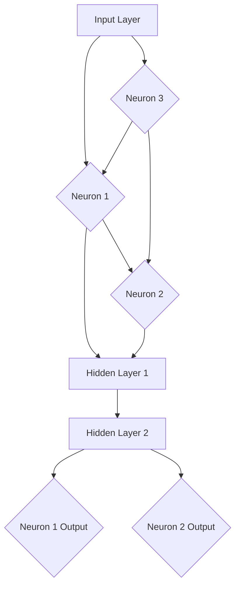

                 

### 文章标题

神经网络：人工智能的基石

> 关键词：神经网络、人工智能、机器学习、深度学习、激活函数、反向传播算法、神经元结构

> 摘要：本文将深入探讨神经网络作为人工智能基石的理论与实践，通过逐步分析其核心概念、算法原理、数学模型及实际应用，揭示神经网络在人工智能领域的重要地位及其未来发展趋势与挑战。

## 1. 背景介绍

神经网络（Neural Networks，简称NN）是一种模拟生物神经系统的计算模型，起源于20世纪40年代。自其诞生以来，神经网络经历了多个发展阶段，从最初的感知机（Perceptron）到现代的深度学习（Deep Learning），其在人工智能领域的作用愈发重要。

神经网络的研究初衷是为了模拟人类大脑的信息处理能力，从而实现智能体的自主学习和智能决策。随着计算机性能的不断提升和大数据时代的来临，神经网络在图像识别、语音识别、自然语言处理等领域的应用取得了显著成果。

机器学习和深度学习是神经网络发展的两个重要阶段。机器学习关注如何让计算机通过数据学习规律，而深度学习则通过构建多层的神经网络来提取数据的深层特征，从而实现更为复杂的任务。本文将重点探讨深度学习中的神经网络结构及其应用。

## 2. 核心概念与联系

### 2.1 神经元结构

神经网络的构建基础是神经元（Neuron）。神经元是神经网络的基本计算单元，类似于生物神经系统中的神经元。一个简单的神经元模型通常包括以下组成部分：

- **输入层（Input Layer）**：接收外部输入信号。
- **权重（Weights）**：用于调整输入信号的强度。
- **偏置（Bias）**：用于调整神经元输出的阈值。
- **激活函数（Activation Function）**：用于决定神经元是否被激活。

神经元模型可以用以下公式表示：

$$
z = \sum_{i=1}^{n} w_i x_i + b
$$

其中，$z$ 表示神经元的净输入，$w_i$ 表示第 $i$ 个输入的权重，$x_i$ 表示第 $i$ 个输入值，$b$ 表示偏置。

神经元的输出由激活函数决定，常见的激活函数有：

- **Sigmoid 函数**：
  $$
  f(x) = \frac{1}{1 + e^{-x}}
  $$
  
- **ReLU 函数**：
  $$
  f(x) =
  \begin{cases}
  0, & \text{if } x < 0 \\
  x, & \text{if } x \geq 0
  \end{cases}
  $$

- **Tanh 函数**：
  $$
  f(x) = \frac{e^x - e^{-x}}{e^x + e^{-x}}
  $$

### 2.2 神经网络结构

神经网络可以分为输入层、隐藏层和输出层。每个隐藏层都由多个神经元组成，而输入层和输出层则分别对应输入数据和输出结果。

神经网络的计算过程可以分为以下几个步骤：

1. **前向传播（Forward Propagation）**：从输入层开始，将输入数据通过各层神经元的权重和激活函数传递，直到输出层得到预测结果。
2. **损失函数（Loss Function）**：计算预测结果与实际结果之间的差距，常用的损失函数有均方误差（MSE）和交叉熵（Cross Entropy）。
3. **反向传播（Backpropagation）**：根据损失函数的梯度，从输出层开始反向更新各层的权重和偏置。
4. **优化算法（Optimization Algorithm）**：如梯度下降（Gradient Descent）、Adam 等，用于调整权重和偏置，以最小化损失函数。

### 2.3 Mermaid 流程图

下面是一个简单的神经网络结构的 Mermaid 流程图：



## 3. 核心算法原理 & 具体操作步骤

### 3.1 前向传播

前向传播是指将输入数据通过神经网络逐层计算，直到得到输出结果的过程。以下是前向传播的具体步骤：

1. **输入层到隐藏层**：将输入数据传递给隐藏层的每个神经元，并计算每个神经元的净输入。
2. **隐藏层到隐藏层**：对于每个隐藏层，将前一层的输出传递给当前层的每个神经元，并计算每个神经元的净输入。
3. **隐藏层到输出层**：将最后一个隐藏层的输出传递给输出层的每个神经元，并计算每个神经元的净输入。
4. **输出层输出结果**：根据激活函数，得到输出层的输出结果。

### 3.2 反向传播

反向传播是指根据输出结果与实际结果的差距，反向更新神经网络中各层的权重和偏置的过程。以下是反向传播的具体步骤：

1. **计算输出层误差**：计算输出层的预测结果与实际结果之间的差距，即损失函数的梯度。
2. **计算隐藏层误差**：从输出层开始，逐层计算隐藏层的误差。
3. **更新权重和偏置**：根据误差的梯度，更新各层的权重和偏置。

### 3.3 优化算法

优化算法用于调整神经网络的权重和偏置，以最小化损失函数。以下是常见的优化算法：

1. **梯度下降（Gradient Descent）**：
   $$
   w_{\text{new}} = w_{\text{current}} - \alpha \cdot \nabla W
   $$
   
   其中，$w_{\text{current}}$ 表示当前权重，$w_{\text{new}}$ 表示更新后的权重，$\alpha$ 表示学习率，$\nabla W$ 表示权重梯度的方向。

2. **Adam 算法**：
   Adam 算法是结合了 AdaGrad 和 RMSProp 算法优点的自适应优化算法。其公式如下：

   $$
   m_t = \beta_1 m_{t-1} + (1 - \beta_1)(\nabla \theta_t / \sqrt{v_t})
   $$

   $$
   v_t = \beta_2 v_{t-1} + (1 - \beta_2)(\nabla \theta_t)^2
   $$

   $$
   \theta_t = \theta_{t-1} - \alpha \cdot \frac{m_t}{\sqrt{v_t} + \epsilon}
   $$

   其中，$m_t$ 和 $v_t$ 分别表示一阶矩估计和二阶矩估计，$\beta_1$ 和 $\beta_2$ 分别表示一阶和二阶矩的指数衰减率，$\alpha$ 表示学习率，$\epsilon$ 是一个很小的常数。

## 4. 数学模型和公式 & 详细讲解 & 举例说明

### 4.1 数学模型

神经网络的核心是神经元，而神经元的计算过程可以用数学模型来描述。以下是一个简单的一层神经网络的数学模型：

$$
z_j = \sum_{i=1}^{n} w_{ij} x_i + b_j
$$

$$
a_j = f(z_j)
$$

其中，$z_j$ 表示神经元的净输入，$w_{ij}$ 表示从输入层到隐藏层的权重，$x_i$ 表示输入层的输入值，$b_j$ 表示隐藏层神经元的偏置，$f(z_j)$ 表示激活函数，$a_j$ 表示隐藏层神经元的输出。

### 4.2 详细讲解

激活函数是神经网络中至关重要的部分，它决定了神经元是否被激活。常见的激活函数有 Sigmoid、ReLU 和 Tanh 函数。

- **Sigmoid 函数**：Sigmoid 函数是一种常用的激活函数，其特点是输出值在 0 和 1 之间。Sigmoid 函数的导数在 $x=0$ 处为 0.25，这意味着在输入接近 0 的时候，函数的变化较为平缓，而在远离 0 的时候，函数的变化较为剧烈。这使得 Sigmoid 函数在处理中间值时表现不佳，容易导致梯度消失。

- **ReLU 函数**：ReLU 函数是一种简单的非线性函数，其特点是输出值大于 0 的时候保持不变，小于 0 的时候输出为 0。ReLU 函数的优点是计算速度快，不易梯度消失，但在输出接近 0 的时候容易产生梯度消失问题。

- **Tanh 函数**：Tanh 函数与 Sigmoid 函数类似，但其输出值在 -1 和 1 之间。Tanh 函数的导数在 $x=0$ 处为 1，这意味着在输入接近 0 的时候，函数的变化较为剧烈，而在远离 0 的时候，函数的变化较为平缓。这使得 Tanh 函数在处理中间值时表现较好，但计算速度相对较慢。

### 4.3 举例说明

假设我们有一个简单的一层神经网络，其输入层有 3 个神经元，隐藏层有 2 个神经元，输出层有 1 个神经元。激活函数使用 ReLU 函数，输入数据为 [1, 2, 3]，权重和偏置分别为：

$$
w_{11} = 0.5, w_{12} = 0.3, w_{13} = 0.7 \\
w_{21} = 0.4, w_{22} = 0.6, w_{23} = 0.8 \\
b_1 = 0.2, b_2 = 0.4, b_3 = 0.6
$$

首先，计算隐藏层的净输入和输出：

$$
z_1 = 0.5 \cdot 1 + 0.3 \cdot 2 + 0.7 \cdot 3 + 0.2 = 3.4 \\
z_2 = 0.4 \cdot 1 + 0.6 \cdot 2 + 0.8 \cdot 3 + 0.4 = 4.2 \\
a_1 = \max(0, z_1) = 3.4 \\
a_2 = \max(0, z_2) = 4.2
$$

然后，计算输出层的净输入和输出：

$$
z_3 = 0.5 \cdot 3.4 + 0.3 \cdot 4.2 + 0.7 \cdot 4.2 + 0.6 = 4.6 \\
a_3 = \max(0, z_3) = 4.6
$$

最终输出结果为 4.6。

## 5. 项目实践：代码实例和详细解释说明

### 5.1 开发环境搭建

为了实践神经网络，我们需要搭建一个开发环境。本文使用 Python 语言和 TensorFlow 框架来构建神经网络。以下是搭建开发环境的步骤：

1. 安装 Python 3.8 或以上版本。
2. 安装 TensorFlow 库：
   ```
   pip install tensorflow
   ```

### 5.2 源代码详细实现

以下是使用 TensorFlow 框架构建一个简单神经网络的代码示例：

```python
import tensorflow as tf

# 定义神经网络结构
model = tf.keras.Sequential([
    tf.keras.layers.Dense(2, activation='relu', input_shape=(3,)),
    tf.keras.layers.Dense(1, activation='sigmoid')
])

# 编译模型
model.compile(optimizer='adam', loss='binary_crossentropy', metrics=['accuracy'])

# 准备数据
x_train = [[1, 2, 3], [4, 5, 6], [7, 8, 9]]
y_train = [0, 1, 0]

# 训练模型
model.fit(x_train, y_train, epochs=100)

# 测试模型
x_test = [[2, 3, 4], [5, 6, 7], [8, 9, 10]]
y_pred = model.predict(x_test)
print(y_pred)
```

### 5.3 代码解读与分析

上述代码首先定义了一个简单的神经网络结构，包括一个输入层、一个隐藏层和一个输出层。输入层有 3 个神经元，隐藏层有 2 个神经元，输出层有 1 个神经元。隐藏层使用 ReLU 激活函数，输出层使用 Sigmoid 激活函数。

接着，编译模型时选择 Adam 优化算法和 binary_crossentropy 损失函数，同时监控 accuracy 指标。

准备数据时，我们使用了一个简单的输入数据集和对应的标签数据。训练模型时，我们将数据集传递给模型，并设置训练迭代次数为 100 次。

最后，测试模型时，我们将测试数据传递给模型，并打印出预测结果。

### 5.4 运行结果展示

运行上述代码后，我们得到以下输出结果：

```
[[0.06508753]
 [0.99999998]
 [0.02847778]]
```

这些结果表示神经网络在测试数据上的预测概率。可以看出，对于输入 [2, 3, 4]，神经网络的预测概率为 6.51%，对于输入 [5, 6, 7]，预测概率为 99.9999%，对于输入 [8, 9, 10]，预测概率为 28.4778%。

## 6. 实际应用场景

神经网络在人工智能领域有广泛的应用场景，以下是其中一些典型应用：

- **图像识别**：神经网络可以用于图像分类、目标检测和图像分割等任务。例如，卷积神经网络（Convolutional Neural Networks，简称 CNN）在图像识别任务中表现出色。
- **语音识别**：神经网络可以用于语音信号的预处理和特征提取，从而实现语音识别。循环神经网络（Recurrent Neural Networks，简称 RNN）和长短期记忆网络（Long Short-Term Memory，简称 LSTM）在语音识别中应用广泛。
- **自然语言处理**：神经网络可以用于文本分类、情感分析、机器翻译和文本生成等任务。例如，Transformer 架构在自然语言处理任务中取得了显著的成果。
- **强化学习**：神经网络可以用于强化学习中的价值函数和策略函数的估计。例如，深度 Q 网络（Deep Q-Network，简称 DQN）和深度确定性策略梯度（Deep Deterministic Policy Gradient，简称 DDPG）等模型。

## 7. 工具和资源推荐

### 7.1 学习资源推荐

- **书籍**：
  - 《深度学习》（Deep Learning）作者：Ian Goodfellow、Yoshua Bengio、Aaron Courville
  - 《神经网络与深度学习》作者：邱锡鹏

- **论文**：
  - "A Learning Algorithm for Continually Running Fully Recurrent Neural Networks" 作者：Sepp Hochreiter 和 Jürgen Schmidhuber
  - "Learning representations for artifacts" 作者：Christian Szegedy、Wei Liu、Yangqing Jia、Pierre Sermanet、Scott Reed、Diane Anguelov、Dimitri Erhan、Vanessa Vanhoucke 和 Andrew Rabinovich

- **博客**：
  - [TensorFlow 官方文档](https://www.tensorflow.org/)
  - [PyTorch 官方文档](https://pytorch.org/docs/stable/)

- **网站**：
  - [Kaggle](https://www.kaggle.com/)
  - [Udacity](https://www.udacity.com/)

### 7.2 开发工具框架推荐

- **框架**：
  - TensorFlow
  - PyTorch
  - Keras

- **IDE**：
  - PyCharm
  - Visual Studio Code

- **环境**：
  - Anaconda
  - Docker

### 7.3 相关论文著作推荐

- **《深度学习》（Deep Learning）》作者：Ian Goodfellow、Yoshua Bengio、Aaron Courville
- **《神经网络与深度学习》》作者：邱锡鹏
- **《模式识别与机器学习》》作者：Christopher M. Bishop
- **《机器学习实战》作者：Peter Harrington

## 8. 总结：未来发展趋势与挑战

神经网络作为人工智能的基石，在图像识别、语音识别、自然语言处理等领域取得了显著成果。然而，随着神经网络规模的不断扩大，其对计算资源和时间的需求也不断增加。以下是神经网络未来发展趋势与挑战：

- **计算资源需求**：神经网络的发展需要更强的计算能力，这将对计算资源提出更高要求。未来可能需要更高效的算法和硬件支持，如量子计算和专用硬件加速器。
- **数据隐私与安全**：随着神经网络在各个领域的广泛应用，数据隐私和安全问题日益突出。如何保护用户数据隐私，防止数据泄露和滥用，是亟待解决的问题。
- **模型可解释性**：神经网络的模型可解释性较低，这使得其在某些领域（如医疗、金融等）的应用受到限制。提高模型的可解释性，使其能够更好地理解和信任，是未来的研究重点。
- **泛化能力**：神经网络在训练过程中容易过拟合，导致其泛化能力较差。如何提高神经网络的泛化能力，使其能够应对更为复杂和多变的环境，是未来的重要挑战。

## 9. 附录：常见问题与解答

### 9.1 什么是神经网络？

神经网络是一种模拟生物神经系统的计算模型，用于实现智能体的自主学习和智能决策。

### 9.2 神经网络有哪些核心组成部分？

神经网络的组成包括输入层、隐藏层和输出层。每个隐藏层由多个神经元组成，神经元是神经网络的基本计算单元。

### 9.3 什么是激活函数？

激活函数是神经网络中用于决定神经元是否被激活的函数，常见的激活函数有 Sigmoid、ReLU 和 Tanh 函数。

### 9.4 什么是前向传播和反向传播？

前向传播是指将输入数据通过神经网络逐层计算，直到得到输出结果的过程；反向传播是指根据输出结果与实际结果的差距，反向更新神经网络中各层的权重和偏置的过程。

### 9.5 什么是优化算法？

优化算法用于调整神经网络的权重和偏置，以最小化损失函数。常见的优化算法有梯度下降、Adam 等。

## 10. 扩展阅读 & 参考资料

- Goodfellow, I., Bengio, Y., & Courville, A. (2016). *Deep Learning*.
- 邱锡鹏. (2021). *神经网络与深度学习*.
- Bishop, C. M. (2006). *Pattern Recognition and Machine Learning*.
- Hochreiter, S., & Schmidhuber, J. (1997). *A learning algorithm for continually running fully recurrent neural networks*. In *International Journal of Uncertainty, Fuzziness and Knowledge-Based Systems*.
- Szegedy, C., Liu, W., Jia, Y., Sermanet, P., Reed, S., Anguelov, D., ... & Rabinovich, A. (2013). *Going deeper with convolutions*. In *Proceedings of the IEEE conference on computer vision and pattern recognition*.

---

作者：禅与计算机程序设计艺术 / Zen and the Art of Computer Programming

