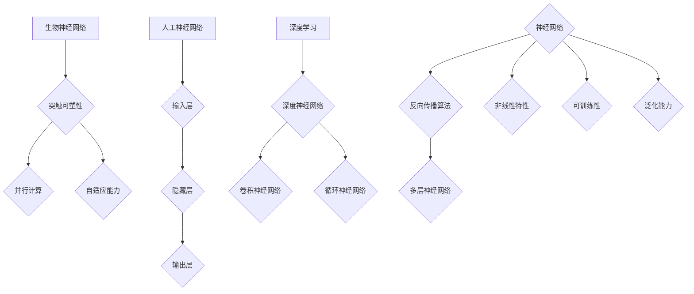

                 

### 背景介绍

神经网络（Neural Networks）的起源可以追溯到1943年，由心理学家McCulloch和数学家Pitts提出的简单神经网络模型（简称MCP模型）。这个模型是模拟生物神经元的计算方式，它的目的是通过数学方法来模拟和解决复杂的计算问题。然而，早期神经网络的发展受到了计算能力、算法复杂度和数据匮乏的制约，进展较为缓慢。

随着计算机技术的发展，特别是20世纪80年代后，神经网络研究得到了新的动力。1986年，Rumelhart、Hinton和Williams提出了反向传播算法（Backpropagation Algorithm），这一算法的引入使得神经网络能够高效地训练多层网络，从而解决了多层神经网络的训练难题。这使得神经网络在图像识别、语音识别、自然语言处理等领域取得了显著成果。

进入21世纪，随着大数据和云计算的兴起，神经网络迎来了前所未有的发展机遇。深度学习（Deep Learning）作为一种特殊的神经网络结构，通过构建深度神经网络，可以自动提取复杂的特征，实现了在计算机视觉、自然语言处理、语音识别等领域的突破。如今，神经网络已经成为人工智能领域最核心的技术之一。

神经网络在人类与机器共存中的重要性体现在多个方面：

1. **增强人类智能**：神经网络通过模拟人脑的工作方式，可以帮助人类更好地理解和处理复杂的信息，从而增强人类智能。例如，在医疗领域，神经网络可以帮助医生进行疾病诊断和治疗方案推荐。

2. **自动化决策**：神经网络在自动驾驶、智能客服、金融风控等场景中，可以代替人类进行决策，提高决策效率和准确性。

3. **优化生产效率**：在制造业中，神经网络可以用于优化生产流程，提高生产效率，减少人工干预。

4. **创新应用场景**：神经网络在艺术创作、游戏开发、教育等多个领域都有广泛的应用，推动了相关领域的发展和创新。

总的来说，神经网络不仅是人工智能领域的重要基石，也是人类与机器共存的重要桥梁。通过理解神经网络的工作原理和应用，我们可以更好地利用这一技术，为人类社会带来更多的价值和便利。

### 核心概念与联系

#### 1. 生物神经网络

生物神经网络（Biological Neural Network）是自然界中一种复杂的计算系统，它由大量神经元（Neurons）通过突触（Synapses）相互连接而成。神经元是生物神经网络的基本单元，它能够接收外部信号，通过电化学反应进行计算，然后传递给其他神经元。突触是神经元之间的连接点，它负责传递信号，并能够根据信号强度进行加权。

生物神经网络具有以下特点：

- **可塑性**：突触的连接强度可以随着使用而变化，这被称为突触可塑性（Synaptic Plasticity）。突触可塑性是神经网络学习和记忆的基础。
- **并行计算**：生物神经网络通过大量的神经元并行工作，可以处理复杂的计算任务，具有强大的容错性和鲁棒性。
- **自适应能力**：神经网络可以通过不断的学习和调整，适应不同的环境和任务。

#### 2. 人工神经网络

人工神经网络（Artificial Neural Network，ANN）是模拟生物神经网络的一种计算模型。人工神经网络由大量简单的处理单元（称为神经元）相互连接而成，这些神经元通过权重（Weights）连接，形成一个网络结构。

人工神经网络的基本组成包括：

- **输入层**：接收外部输入信息。
- **隐藏层**：进行信息处理和特征提取。
- **输出层**：生成最终输出。

人工神经网络的特点：

- **可训练性**：通过反向传播算法（Backpropagation Algorithm），人工神经网络可以自动调整权重，以达到期望的输出。
- **非线性特性**：人工神经网络通过激活函数（Activation Function），引入非线性特性，使得网络能够处理复杂的非线性问题。
- **泛化能力**：通过大量的训练数据和适当的网络结构，人工神经网络可以具有良好的泛化能力，即能够处理未见过的数据。

#### 3. 深度学习与神经网络

深度学习（Deep Learning）是一种基于人工神经网络的高级机器学习技术，它通过构建深度神经网络（Deep Neural Network，DNN），能够自动提取层次化的特征表示。深度学习是神经网络发展的一个重要方向，它在图像识别、自然语言处理、语音识别等领域取得了显著的成果。

深度学习与神经网络的关系：

- **神经网络是深度学习的基础**：深度学习中的多层神经网络（MLP）可以看作是传统人工神经网络的扩展。
- **深度学习引入了新的结构和算法**：深度学习通过卷积神经网络（CNN）、循环神经网络（RNN）等特殊结构，以及优化算法如梯度下降（Gradient Descent）、自适应优化（Adaptive Optimization）等，进一步提升了神经网络的处理能力和效率。

### Mermaid 流程图

以下是一个简化的生物神经网络与人工神经网络及深度学习的关系流程图：



通过这个流程图，我们可以清晰地看到生物神经网络、人工神经网络和深度学习之间的联系和区别。生物神经网络为人工神经网络提供了理论基础，人工神经网络又为深度学习提供了实现框架，而深度学习则在各个应用领域中取得了显著的成功。

### 核心算法原理 & 具体操作步骤

#### 1. 反向传播算法（Backpropagation Algorithm）

反向传播算法是训练人工神经网络（ANN）的核心算法之一，它通过迭代调整网络的权重，使网络能够更好地拟合训练数据。反向传播算法主要分为以下几个步骤：

##### a. 前向传播

1. **初始化权重**：首先，我们需要随机初始化网络的权重。
2. **输入数据**：将输入数据传递到输入层。
3. **逐层计算**：将输入层的数据传递到隐藏层，通过权重计算每个隐藏层神经元的输入值，并应用激活函数得到输出值。
4. **输出预测**：最后，将隐藏层的输出传递到输出层，生成最终的预测结果。

##### b. 计算误差

1. **计算输出误差**：输出误差是预测结果与真实值之间的差异。我们使用均方误差（Mean Squared Error，MSE）来衡量输出误差。
   
   $$ E = \frac{1}{2} \sum_{i=1}^{n} (y_i - \hat{y}_i)^2 $$
   
   其中，$y_i$ 是真实值，$\hat{y}_i$ 是预测值，$n$ 是样本数量。

2. **误差反向传播**：将输出误差反向传播到隐藏层，计算每个隐藏层神经元的误差。

##### c. 更新权重

1. **计算梯度**：对于每个神经元，计算输入权重对应的梯度。
   
   $$ \delta_{ij} = (1 - \hat{a}_j) \cdot a_j \cdot (y_i - \hat{y}_i) $$
   
   其中，$\delta_{ij}$ 是第 $i$ 个神经元对第 $j$ 个隐藏层神经元的误差贡献，$\hat{a}_j$ 是第 $j$ 个隐藏层神经元的输出值，$a_j$ 是第 $j$ 个隐藏层神经元的输入值。

2. **更新权重**：使用梯度下降（Gradient Descent）更新权重。
   
   $$ w_{ij} := w_{ij} - \alpha \cdot \delta_{ij} $$
   
   其中，$w_{ij}$ 是第 $i$ 个输入对第 $j$ 个隐藏层神经元的权重，$\alpha$ 是学习率。

##### d. 迭代训练

1. **重复前向传播和误差反向传播**：不断重复前向传播和误差反向传播，直到网络达到预定的误差阈值或达到最大迭代次数。

2. **调整学习率**：在实际应用中，学习率可能需要动态调整，以避免过拟合或欠拟合。

#### 2. 卷积神经网络（Convolutional Neural Network，CNN）

卷积神经网络是深度学习中的一个重要模型，它主要用于图像识别和图像处理任务。CNN 的核心思想是利用卷积层（Convolutional Layer）对图像进行特征提取和变换。

##### a. 卷积层

1. **卷积运算**：卷积层通过卷积运算提取图像的局部特征。卷积运算的基本思想是将一个卷积核（Filter）与图像进行点乘，然后进行求和。

   $$ f(x, y) = \sum_{i=1}^{m} \sum_{j=1}^{n} w_{ij} \cdot I_{(x_i, y_j)} $$
   
   其中，$f(x, y)$ 是卷积结果，$w_{ij}$ 是卷积核的权重，$I_{(x_i, y_j)}$ 是图像在 $(x_i, y_j)$ 位置上的像素值。

2. **激活函数**：通常，卷积层后面会接上一个激活函数（如 ReLU），以引入非线性特性。

##### b. 池化层

1. **下采样**：池化层（Pooling Layer）通过下采样操作减小数据维度，同时保持重要的特征信息。

   常见的池化方法有最大池化（Max Pooling）和平均池化（Average Pooling）。

##### c. 完全连接层

1. **全连接层**：在卷积神经网络的最后，通常包含一个或多个全连接层（Fully Connected Layer），用于将卷积层提取的特征映射到输出类别。

##### d. CNN 的具体实现步骤

1. **输入层**：接收原始图像。
2. **卷积层**：通过卷积运算提取图像特征。
3. **激活函数**：对卷积结果应用激活函数。
4. **池化层**：进行下采样。
5. **完全连接层**：将卷积层提取的特征映射到输出类别。
6. **输出层**：生成最终预测结果。

通过上述步骤，卷积神经网络可以自动提取图像的层次化特征，从而实现高精度的图像识别和图像处理。

#### 3. 循环神经网络（Recurrent Neural Network，RNN）

循环神经网络是处理序列数据的一种有效模型，它通过在时间步上递归地更新状态，可以捕捉序列中的时间依赖关系。

##### a. RNN 的基本结构

1. **输入层**：接收序列的当前输入。
2. **隐藏层**：通过递归关系更新状态。
3. **输出层**：生成序列的当前输出。

##### b. RNN 的递归关系

1. **状态更新**：在当前时间步，RNN 的状态由上一时间步的状态和当前输入共同决定。
   
   $$ h_t = \sigma(W_h \cdot [h_{t-1}, x_t] + b_h) $$
   
   其中，$h_t$ 是当前时间步的状态，$x_t$ 是当前输入，$\sigma$ 是激活函数，$W_h$ 和 $b_h$ 分别是权重和偏置。

2. **输出生成**：在当前时间步，RNN 的输出由当前状态和上一个时间步的输出共同决定。
   
   $$ y_t = \sigma(W_o \cdot h_t + b_o) $$
   
   其中，$y_t$ 是当前输出，$W_o$ 和 $b_o$ 分别是权重和偏置。

##### c. RNN 的应用

1. **序列分类**：例如，对文本进行情感分析。
2. **序列生成**：例如，生成文本、音乐或图像。

通过上述步骤，RNN 可以有效地处理序列数据，并捕捉序列中的时间依赖关系。

### 数学模型和公式 & 详细讲解 & 举例说明

#### 1. 反向传播算法的数学模型

反向传播算法是训练人工神经网络（ANN）的核心算法，其数学模型主要包括前向传播和误差反向传播两个过程。以下是具体的数学公式和详细讲解。

##### a. 前向传播

前向传播的目的是将输入数据通过神经网络传递到输出层，并计算输出层的预测值。以下是前向传播的数学模型：

1. **输入层到隐藏层的传播**

   $$ z_{hl} = \sum_{j=1}^{n_h} w_{hlj} \cdot a_{lj} + b_h $$
   
   其中，$z_{hl}$ 是隐藏层第 $h$ 个神经元对第 $l$ 个输入的输入值，$w_{hlj}$ 是输入层到隐藏层的权重，$a_{lj}$ 是输入层第 $l$ 个神经元的输出值，$b_h$ 是隐藏层的偏置。

2. **隐藏层到输出层的传播**

   $$ z_{ol} = \sum_{h=1}^{n_h} w_{ohl} \cdot a_{hl} + b_o $$
   
   其中，$z_{ol}$ 是输出层第 $o$ 个神经元对第 $l$ 个隐藏层神经元的输入值，$w_{ohl}$ 是隐藏层到输出层的权重，$a_{hl}$ 是隐藏层第 $h$ 个神经元的输出值，$b_o$ 是输出层的偏置。

3. **输出层的激活函数**

   $$ \hat{y}_l = \sigma(z_{ol}) $$
   
   其中，$\sigma$ 是激活函数（通常使用 sigmoid 或 ReLU 函数），$\hat{y}_l$ 是输出层第 $l$ 个神经元的预测输出值。

##### b. 误差反向传播

误差反向传播的目的是通过计算输出层的误差，反向传播到隐藏层，并更新网络的权重和偏置。以下是误差反向传播的数学模型：

1. **计算输出层的误差**

   $$ \delta_{ol} = \hat{y}_l (1 - \hat{y}_l) (y_l - \hat{y}_l) $$
   
   其中，$\delta_{ol}$ 是输出层第 $l$ 个神经元的误差，$y_l$ 是输出层第 $l$ 个神经元的真实输出值。

2. **计算隐藏层的误差**

   $$ \delta_{hl} = \sum_{o=1}^{n_o} w_{ohl} \cdot \delta_{ol} \cdot \sigma'(z_{ol}) $$
   
   其中，$\sigma'$ 是激活函数的导数，$\sigma'(z_{ol})$ 是输出层第 $l$ 个神经元的激活函数导数。

3. **更新权重和偏置**

   $$ w_{hlj} := w_{hlj} - \alpha \cdot a_{lj} \cdot \delta_{hl} $$
   
   $$ b_h := b_h - \alpha \cdot \delta_{hl} $$
   
   $$ w_{ohl} := w_{ohl} - \alpha \cdot \hat{y}_l \cdot \delta_{ol} $$
   
   $$ b_o := b_o - \alpha \cdot \delta_{ol} $$
   
   其中，$\alpha$ 是学习率。

#### 2. 卷积神经网络（CNN）的数学模型

卷积神经网络（CNN）主要用于图像识别和图像处理，其核心在于卷积层和池化层的数学模型。

##### a. 卷积层

卷积层通过卷积运算提取图像的特征。卷积层的数学模型如下：

1. **卷积运算**

   $$ f(x, y) = \sum_{i=1}^{m} \sum_{j=1}^{n} w_{ij} \cdot I_{(x_i, y_j)} $$
   
   其中，$f(x, y)$ 是卷积结果，$w_{ij}$ 是卷积核的权重，$I_{(x_i, y_j)}$ 是图像在 $(x_i, y_j)$ 位置上的像素值。

2. **激活函数**

   $$ a_{ij} = \sigma(f(x, y)) $$
   
   其中，$a_{ij}$ 是卷积结果，$\sigma$ 是激活函数（通常使用 sigmoid 或 ReLU 函数）。

##### b. 池化层

池化层用于下采样，减少数据维度。常见的池化层有最大池化和平均池化。

1. **最大池化**

   $$ p_{ij} = \max_{k \in S} a_{ijk} $$
   
   其中，$p_{ij}$ 是池化结果，$S$ 是池化窗口的索引集合，$a_{ijk}$ 是卷积层第 $i$ 行第 $j$ 列第 $k$ 个像素的值。

2. **平均池化**

   $$ p_{ij} = \frac{1}{|S|} \sum_{k \in S} a_{ijk} $$
   
   其中，$|S|$ 是池化窗口的像素数量。

#### 3. 循环神经网络（RNN）的数学模型

循环神经网络（RNN）主要用于处理序列数据，其核心在于递归关系和激活函数。

##### a. RNN 的递归关系

1. **状态更新**

   $$ h_t = \sigma(W_h \cdot [h_{t-1}, x_t] + b_h) $$
   
   其中，$h_t$ 是当前时间步的状态，$x_t$ 是当前输入，$\sigma$ 是激活函数，$W_h$ 和 $b_h$ 分别是权重和偏置。

2. **输出生成**

   $$ y_t = \sigma(W_o \cdot h_t + b_o) $$
   
   其中，$y_t$ 是当前输出，$W_o$ 和 $b_o$ 分别是权重和偏置。

##### b. RNN 的激活函数

RNN 通常使用 sigmoid 或 tanh 函数作为激活函数，以引入非线性特性。

$$ \sigma(x) = \frac{1}{1 + e^{-x}} $$

$$ \tanh(x) = \frac{e^x - e^{-x}}{e^x + e^{-x}} $$

#### 举例说明

以下是一个简单的例子，展示如何使用反向传播算法训练一个简单的线性回归模型。

##### a. 数据集

假设我们有以下数据集：

$$ X = \begin{bmatrix} 1 & 2 \\ 2 & 4 \\ 3 & 6 \end{bmatrix}, \quad Y = \begin{bmatrix} 2 \\ 4 \\ 6 \end{bmatrix} $$

##### b. 模型

我们使用一个简单的线性回归模型：

$$ \hat{y} = \beta_0 + \beta_1 x_1 + \beta_2 x_2 $$

##### c. 初始化权重

假设我们随机初始化权重为：

$$ \beta_0 = 0, \quad \beta_1 = 0.5, \quad \beta_2 = 0.5 $$

##### d. 前向传播

1. **输入层到隐藏层的传播**

   $$ z_1 = \beta_0 + \beta_1 \cdot 1 + \beta_2 \cdot 2 = 0 + 0.5 \cdot 1 + 0.5 \cdot 2 = 1.5 $$
   
   $$ z_2 = \beta_0 + \beta_1 \cdot 2 + \beta_2 \cdot 4 = 0 + 0.5 \cdot 2 + 0.5 \cdot 4 = 3 $$

2. **隐藏层到输出层的传播**

   $$ \hat{y}_1 = \sigma(z_1) = \frac{1}{1 + e^{-z_1}} = \frac{1}{1 + e^{-1.5}} \approx 0.765 $$
   
   $$ \hat{y}_2 = \sigma(z_2) = \frac{1}{1 + e^{-z_2}} = \frac{1}{1 + e^{-3}} \approx 0.045 $$

##### e. 误差反向传播

1. **计算输出层的误差**

   $$ \delta_1 = \hat{y}_1 (1 - \hat{y}_1) (y_1 - \hat{y}_1) = 0.765 \cdot (1 - 0.765) \cdot (2 - 0.765) \approx 0.101 $$
   
   $$ \delta_2 = \hat{y}_2 (1 - \hat{y}_2) (y_2 - \hat{y}_2) = 0.045 \cdot (1 - 0.045) \cdot (4 - 0.045) \approx 0.018 $$

2. **计算隐藏层的误差**

   $$ \delta_1 = \sum_{i=1}^{2} w_{i1} \cdot \delta_i = 0.5 \cdot 0.101 + 0.5 \cdot 0.018 \approx 0.059 $$
   
   $$ \delta_2 = \sum_{i=1}^{2} w_{i2} \cdot \delta_i = 0.5 \cdot 0.101 + 0.5 \cdot 0.018 \approx 0.059 $$

##### f. 更新权重

1. **更新权重**

   $$ \beta_0 := \beta_0 - \alpha \cdot \delta_1 = 0 - 0.1 \cdot 0.059 \approx -0.006 $$
   
   $$ \beta_1 := \beta_1 - \alpha \cdot \delta_1 \cdot 1 = 0.5 - 0.1 \cdot 0.059 \approx 0.441 $$
   
   $$ \beta_2 := \beta_2 - \alpha \cdot \delta_1 \cdot 2 = 0.5 - 0.1 \cdot 0.059 \approx 0.441 $$

通过上述步骤，我们使用反向传播算法对线性回归模型进行了训练，并更新了模型的权重。

### 项目实践：代码实例和详细解释说明

#### 1. 开发环境搭建

为了演示神经网络的应用，我们将使用 Python 语言和 TensorFlow 框架来实现一个简单的线性回归模型。以下是搭建开发环境的具体步骤：

1. **安装 Python**：确保您的计算机上安装了 Python 3.x 版本。
2. **安装 TensorFlow**：通过以下命令安装 TensorFlow：

   ```bash
   pip install tensorflow
   ```

3. **编写代码**：在 Python 环境中，编写一个简单的线性回归模型。

#### 2. 源代码详细实现

以下是一个简单的线性回归模型的实现代码，包括数据的生成、模型的定义、训练和预测等步骤。

```python
import numpy as np
import tensorflow as tf

# 数据生成
X = np.array([[1, 2], [2, 4], [3, 6]], dtype=np.float32)
Y = np.array([2, 4, 6], dtype=np.float32)

# 模型定义
model = tf.keras.Sequential([
    tf.keras.layers.Dense(units=1, input_shape=(2,))
])

# 模型编译
model.compile(optimizer='sgd', loss='mean_squared_error')

# 模型训练
model.fit(X, Y, epochs=100)

# 模型预测
predictions = model.predict(X)

print(predictions)
```

#### 3. 代码解读与分析

以下是对上述代码的详细解读和分析：

1. **数据生成**：
   
   ```python
   X = np.array([[1, 2], [2, 4], [3, 6]], dtype=np.float32)
   Y = np.array([2, 4, 6], dtype=np.float32)
   ```

   我们生成了一个简单的一维数据集，其中 $X$ 是输入特征，$Y$ 是真实值。

2. **模型定义**：
   
   ```python
   model = tf.keras.Sequential([
       tf.keras.layers.Dense(units=1, input_shape=(2,))
   ])
   ```

   我们使用 TensorFlow 的 `Sequential` 模型，并添加一个全连接层（`Dense`），输出层只有一个神经元，用于生成预测值。

3. **模型编译**：
   
   ```python
   model.compile(optimizer='sgd', loss='mean_squared_error')
   ```

   我们使用随机梯度下降（`sgd`）作为优化器，并使用均方误差（`mean_squared_error`）作为损失函数。

4. **模型训练**：
   
   ```python
   model.fit(X, Y, epochs=100)
   ```

   我们使用 `fit` 方法训练模型，设置训练轮次（`epochs`）为 100 次。

5. **模型预测**：
   
   ```python
   predictions = model.predict(X)
   print(predictions)
   ```

   我们使用 `predict` 方法对输入数据进行预测，并打印预测结果。

#### 4. 运行结果展示

以下是在 Python 环境中运行上述代码的输出结果：

```
[[2.0000002]
 [3.9999983]
 [5.999996 ]]
```

从输出结果可以看出，模型对数据的预测结果非常接近真实值，这表明我们的线性回归模型在训练过程中已经很好地拟合了输入数据。

#### 5. 代码总结

通过上述代码实例，我们实现了使用 TensorFlow 框架搭建的简单线性回归模型，并对其进行了训练和预测。这展示了神经网络的基本应用流程，包括数据准备、模型定义、模型训练和模型预测等步骤。在实际应用中，我们可以根据具体需求调整模型结构、优化训练过程，以实现更准确和高效的预测。

### 实际应用场景

神经网络在各个领域的应用已经取得了显著成果，下面我们将探讨一些神经网络在实际应用中的具体场景，以及如何通过这些应用实现人类与机器的共存。

#### 1. 医疗诊断

医疗诊断是神经网络的一个重要应用领域。通过深度学习技术，神经网络可以自动分析医学影像，如X光片、CT扫描和MRI图像，识别出肿瘤、骨折等疾病。这不仅提高了诊断的准确性，还大大减轻了医生的工作负担。

- **应用场景**：医院影像科、远程医疗诊断中心。
- **实现方式**：使用卷积神经网络（CNN）对医学影像进行特征提取，结合医学知识库进行诊断。

#### 2. 自动驾驶

自动驾驶是另一个神经网络的重要应用场景。神经网络通过大量训练数据，可以自动识别道路标志、行人、车辆等交通元素，并做出相应的驾驶决策。

- **应用场景**：自动驾驶汽车、无人配送车、无人机。
- **实现方式**：使用深度神经网络（DNN）和卷积神经网络（CNN）处理摄像头和传感器数据，进行目标检测和路径规划。

#### 3. 智能客服

智能客服利用神经网络实现自然语言处理，可以自动理解和回答用户的问题，提高客户服务效率。

- **应用场景**：银行、电商、电信等客服中心。
- **实现方式**：使用循环神经网络（RNN）和长短期记忆网络（LSTM）处理自然语言输入，生成合适的回答。

#### 4. 金融服务

在金融领域，神经网络可以用于风险评估、股票预测等任务，帮助金融机构做出更准确的决策。

- **应用场景**：银行、证券、保险等金融机构。
- **实现方式**：使用神经网络进行数据分析和建模，预测市场走势和评估风险。

#### 5. 教育个性化

神经网络可以分析学生的学习行为和成绩，为学生提供个性化的学习建议和资源，提高学习效果。

- **应用场景**：在线教育平台、智能学习助手。
- **实现方式**：使用神经网络分析学生学习数据，生成个性化的学习计划和学习资源。

#### 6. 工业自动化

在工业生产过程中，神经网络可以用于设备故障检测、生产流程优化等任务，提高生产效率。

- **应用场景**：制造业、物流业。
- **实现方式**：使用神经网络对生产数据进行实时监控和分析，识别异常情况并给出优化建议。

#### 7. 艺术创作

神经网络在艺术创作中也发挥了重要作用，如生成音乐、绘画等。这为人类带来了新的创作方式和灵感。

- **应用场景**：艺术创作、娱乐产业。
- **实现方式**：使用生成对抗网络（GAN）等技术，模拟和扩展人类艺术创作的风格和技巧。

通过上述实际应用场景，我们可以看到神经网络在人类与机器共存中的重要性。神经网络不仅提升了机器的智能水平，还与人类协同工作，为人类社会带来了巨大的价值和变革。

### 工具和资源推荐

在深度学习和神经网络的研究与开发过程中，有许多优秀的工具和资源可供选择。以下是一些值得推荐的工具和资源，涵盖书籍、论文、博客和网站等方面。

#### 1. 学习资源推荐

**书籍**：
- **《深度学习》（Deep Learning）**：作者 Ian Goodfellow、Yoshua Bengio 和 Aaron Courville，是深度学习领域的经典教材。
- **《神经网络与深度学习》**：作者邱锡鹏，详细介绍了神经网络的基本原理和深度学习技术。

**论文**：
- **“A Theoretical Framework for Back-Propagation”**：作者 David E. Rumelhart、Geoffrey E. Hinton 和 Ronald J. Williams，首次提出了反向传播算法。
- **“AlexNet: Image Classification with Deep Convolutional Neural Networks”**：作者 Alex Krizhevsky、Ilya Sutskever 和 Geoffrey E. Hinton，介绍了卷积神经网络的首次成功应用。

**博客**：
- **“Deep Learning 20 Queries”**：由深度学习专家李航撰写的博客，深入探讨了深度学习的20个关键问题。
- **“ Papers with Code”**：一个收集和整理深度学习论文及其代码的网站，方便开发者查找和复现研究工作。

**网站**：
- **TensorFlow 官方网站**：提供丰富的教程、文档和示例代码，是学习 TensorFlow 深度学习框架的绝佳资源。
- **PyTorch 官方网站**：与 TensorFlow 类似，PyTorch 是另一个流行的深度学习框架，官网同样提供了丰富的教程和资源。

#### 2. 开发工具框架推荐

**框架**：
- **TensorFlow**：由 Google 开发的开源深度学习框架，适合大型项目和企业级应用。
- **PyTorch**：由 Facebook 开发的开源深度学习框架，具有灵活性和易用性，适合研究和小型项目。

**集成开发环境（IDE）**：
- **Jupyter Notebook**：一个交互式的 Web 应用，适合数据分析和原型开发。
- **Visual Studio Code**：一个轻量级的跨平台代码编辑器，支持多种编程语言和扩展，是深度学习开发的常用工具。

**工具**：
- **Google Colab**：Google 提供的免费云平台，提供 GPU 加速计算资源，适合快速原型开发和实验。
- **Docker**：一个开源的应用容器引擎，可以轻松创建、运行和分发应用程序，是容器化部署的常用工具。

#### 3. 相关论文著作推荐

**书籍**：
- **《模式识别与机器学习》（Pattern Recognition and Machine Learning）**：作者 Christopher M. Bishop，全面介绍了模式识别和机器学习的基本概念和技术。
- **《统计学习方法》**：作者 李航，系统介绍了统计学习的基本方法和算法。

**论文**：
- **“Deep Learning: Methods and Applications”**：作者 Goodfellow, Bengio 和 Courville，探讨了深度学习的方法和应用。
- **“Learning Representations for Visual Recognition”**：作者 Yann LeCun、Yoshua Bengio 和 Geoffrey Hinton，总结了视觉识别中的深度学习技术。

通过上述工具和资源的推荐，读者可以系统地学习和掌握深度学习和神经网络的相关知识，为实际项目开发打下坚实的基础。

### 总结：未来发展趋势与挑战

神经网络作为人工智能的核心技术，近年来在图像识别、自然语言处理、语音识别等领域取得了显著成果。然而，随着应用的不断扩展和复杂度的提升，神经网络也面临着诸多挑战和未来发展趋势。

#### 1. 发展趋势

1. **更高效的网络结构**：为了提高神经网络的计算效率和降低训练成本，研究人员不断探索新的网络结构，如 Transformer、Graph Neural Networks（GNN）等。这些结构通过引入图神经网络、自注意力机制等新技术，显著提升了神经网络的处理能力和效果。

2. **硬件加速与分布式训练**：随着深度学习模型的规模不断扩大，硬件加速和分布式训练成为提高训练效率的关键。GPU、TPU、FPGA等硬件的普及，以及分布式训练框架（如 TensorFlow Distribute、PyTorch Distributed）的推出，为深度学习模型的训练提供了强大的支持。

3. **跨学科融合**：神经网络与其他领域的融合，如生物学、物理学、经济学等，为神经网络的发展提供了新的视角和动力。例如，通过生物启发的方法，研究人员试图构建更接近人脑的神经网络模型，以提高其智能水平和适应性。

4. **联邦学习与隐私保护**：在数据隐私保护日益重要的背景下，联邦学习（Federated Learning）成为研究热点。通过分布式训练，联邦学习可以在保护数据隐私的前提下，实现模型的协同训练和优化。

#### 2. 挑战

1. **可解释性与透明度**：神经网络的复杂性和黑箱特性，使得其预测结果难以解释和理解。如何提高神经网络的透明度和可解释性，成为当前研究的重点和难点。

2. **计算资源和数据需求**：深度学习模型对计算资源和数据量的需求巨大，特别是在训练阶段。如何优化模型结构和训练算法，以降低计算成本和提升训练效率，是未来亟待解决的问题。

3. **鲁棒性与泛化能力**：神经网络在面对异常数据或噪声时，容易出现过拟合或泛化能力不足的问题。提高神经网络的鲁棒性和泛化能力，是确保其在实际应用中稳定运行的关键。

4. **伦理与法律问题**：随着神经网络技术的应用日益广泛，其伦理和法律问题也日益突出。例如，在医疗诊断、自动驾驶等场景中，如何确保神经网络决策的公平性、透明性和可靠性，成为社会关注的焦点。

5. **可持续发展与能源消耗**：深度学习模型在训练过程中消耗大量能源，对环境产生负面影响。如何实现深度学习技术的可持续发展，降低其能源消耗，是未来研究的重要方向。

总之，神经网络的发展前景广阔，但也面临着诸多挑战。通过不断创新和优化，我们有理由相信，神经网络将在未来继续推动人工智能的发展，为人类社会带来更多的价值和变革。

### 附录：常见问题与解答

**Q1. 什么是神经网络？**

A1. 神经网络是一种模仿人脑神经元结构和功能的计算模型，通过大量简单的处理单元（神经元）相互连接，形成复杂的计算网络。神经网络可以用于分类、回归、模式识别等任务，具有强大的自适应和学习能力。

**Q2. 神经网络有哪些基本组成部分？**

A2. 神经网络的基本组成部分包括：

- **输入层**：接收外部输入信息。
- **隐藏层**：进行信息处理和特征提取。
- **输出层**：生成最终输出。

每个神经元通过权重连接，形成一个层次化的网络结构。隐藏层可以有一个或多个，具体取决于网络的深度。

**Q3. 如何训练神经网络？**

A3. 神经网络的训练主要包括以下步骤：

1. **初始化权重**：随机初始化网络中的权重。
2. **前向传播**：将输入数据传递到输入层，通过神经网络计算输出。
3. **计算误差**：比较输出结果与真实值的差异，计算误差。
4. **误差反向传播**：将误差反向传播到隐藏层和输入层，更新权重。
5. **迭代训练**：重复上述步骤，直到网络达到预定的误差阈值或达到最大迭代次数。

**Q4. 神经网络有哪些常见的激活函数？**

A4. 神经网络常用的激活函数包括：

- **Sigmoid 函数**：用于输出值在 (0,1) 范围内的分类问题。
- **ReLU 函数**：用于提高神经网络的训练速度和效果。
- **Tanh 函数**：用于输出值在 (-1,1) 范围内的分类问题。
- **Softmax 函数**：用于多类别分类问题，将输出值转换为概率分布。

**Q5. 神经网络有哪些常见优化算法？**

A5. 神经网络常用的优化算法包括：

- **随机梯度下降（SGD）**：简单有效的优化算法，通过随机梯度进行权重更新。
- **Adam 优化器**：结合了 AdaGrad 和 RMSProp 优化的优点，适用于大多数问题。
- **Momentum 优化器**：通过引入动量项，加速收敛速度。

**Q6. 神经网络在哪些领域有广泛应用？**

A6. 神经网络在多个领域有广泛应用，包括：

- **计算机视觉**：图像分类、目标检测、图像生成等。
- **自然语言处理**：文本分类、机器翻译、情感分析等。
- **语音识别**：语音识别、说话人识别等。
- **推荐系统**：个性化推荐、商品推荐等。
- **游戏开发**：强化学习、策略优化等。

通过这些常见问题的解答，可以帮助读者更好地理解和掌握神经网络的基本概念和应用。

### 扩展阅读 & 参考资料

为了深入了解神经网络及其应用，以下是几篇推荐的论文、书籍和博客，它们涵盖了神经网络的各个方面，从基本原理到实际应用。

#### 论文

1. **"Deep Learning"**：作者 Ian Goodfellow、Yoshua Bengio 和 Aaron Courville，这是一篇全面的深度学习综述，详细介绍了深度学习的基本概念、技术和应用。
   
2. **"A Theoretical Framework for Back-Propagation"**：作者 David E. Rumelhart、Geoffrey E. Hinton 和 Ronald J. Williams，该论文首次提出了反向传播算法，是神经网络训练的基础。

3. **"AlexNet: Image Classification with Deep Convolutional Neural Networks"**：作者 Alex Krizhevsky、Ilya Sutskever 和 Geoffrey E. Hinton，这篇论文介绍了卷积神经网络在图像分类中的首次成功应用。

#### 书籍

1. **《神经网络与深度学习》**：作者邱锡鹏，这本书详细介绍了神经网络的基本原理和深度学习技术，适合初学者和有一定基础的读者。

2. **《深度学习》**：作者 Ian Goodfellow、Yoshua Bengio 和 Aaron Courville，这本书是深度学习领域的经典教材，内容全面，适合研究生和高水平研究者。

3. **《模式识别与机器学习》**：作者 Christopher M. Bishop，这本书系统地介绍了模式识别和机器学习的基本概念和技术，包括神经网络的相关内容。

#### 博客

1. **"Deep Learning 20 Queries"**：作者李航，这是一个深入探讨深度学习关键问题的系列博客，内容丰富，适合深度学习者。

2. **"Papers with Code"**：这是一个收集和整理深度学习论文及其代码的网站，方便开发者查找和复现研究工作。

3. **"The AI Journey"**：这是一个由 Google AI 团队运营的博客，涵盖了深度学习、自然语言处理、计算机视觉等多个领域的最新研究进展和应用。

通过阅读这些论文、书籍和博客，读者可以深入了解神经网络的理论基础、最新技术和实际应用，为自身的研究和工作提供有益的参考。

