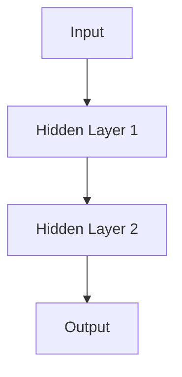

                 

### 文章标题

#### 神经网络：开启智能新纪元

> **关键词**：神经网络，深度学习，人工智能，机器学习，激活函数，反向传播算法，多层感知器，感知机，Python 实践

> **摘要**：本文旨在深入探讨神经网络这一开启智能新纪元的计算模型。我们将从背景介绍入手，逐步分析神经网络的核心概念、算法原理、数学模型，并通过具体的项目实践展示其实际应用。文章还将总结神经网络在实际中的各种应用场景，并推荐相关学习资源和开发工具，最后对神经网络的发展趋势与挑战进行展望。

### 1. 背景介绍

神经网络（Neural Networks，简称NN）是模拟生物神经系统的计算模型，其在人工智能（Artificial Intelligence，AI）领域中占据了举足轻重的地位。神经网络的起源可以追溯到1943年，由心理学家McCulloch和数学家Pitts提出的感知机（Perceptron）模型，这是第一个神经网络模型。尽管早期的神经网络模型具有简单和直观的特点，但它们在处理复杂任务方面存在诸多局限性。

20世纪80年代，随着计算机性能的提升和大规模并行计算的普及，神经网络研究迎来了新的发展契机。特别是1986年，Rumelhart、Hinton和Williams提出了反向传播算法（Backpropagation Algorithm），这一突破性的算法使得多层感知器（Multilayer Perceptron，MLP）模型在许多复杂任务中表现出色。自此，神经网络开始迅速发展，并在图像识别、语音识别、自然语言处理等领域取得了显著的成果。

进入21世纪，深度学习（Deep Learning）的概念被提出，其核心思想是通过构建深层的神经网络结构来提高模型的复杂度和学习能力。深度学习的成功不仅体现在理论研究的突破上，更体现在实际应用中的广泛推广。例如，谷歌的AlphaGo在围棋比赛中击败人类顶尖高手，亚马逊的语音助手Alexa和苹果的Siri等，都是深度学习的具体应用实例。

### 2. 核心概念与联系

#### 2.1 神经元（Neuron）

神经元是神经网络的基本组成单元，类似于生物神经系统中的神经细胞。神经元具有输入层、输出层和权重（weight）的概念。输入层接收外部信号，通过权重传递到输出层，最后产生输出信号。神经元的计算过程可以表示为：

\[ z = \sum_{i=1}^{n} w_i x_i \]

其中，\( z \) 是神经元输出，\( w_i \) 是权重，\( x_i \) 是输入值。

#### 2.2 激活函数（Activation Function）

激活函数用于引入非线性因素，使得神经网络具有区分不同数据的能力。常见的激活函数包括：

- **Sigmoid函数**：\[ f(x) = \frac{1}{1 + e^{-x}} \]
- **ReLU函数**：\[ f(x) = \max(0, x) \]
- **Tanh函数**：\[ f(x) = \frac{e^x - e^{-x}}{e^x + e^{-x}} \]

这些激活函数在神经网络中起着至关重要的作用，有助于提高模型的表达能力。

#### 2.3 神经网络架构（Neural Network Architecture）

神经网络的架构主要包括输入层、隐藏层和输出层。输入层接收外部输入，隐藏层对输入进行加工和处理，输出层产生最终的输出结果。一个简单的神经网络架构可以表示为：

\[ \text{Input} \rightarrow \text{Hidden Layer} \rightarrow \text{Output} \]

#### 2.4 Mermaid 流程图

下面是神经网络核心概念和架构的 Mermaid 流程图：



### 3. 核心算法原理 & 具体操作步骤

#### 3.1 反向传播算法（Backpropagation Algorithm）

反向传播算法是神经网络训练的核心算法，其基本思想是通过计算输出层的误差信号，并将其反向传播到隐藏层，从而更新各个神经元的权重。具体步骤如下：

1. **前向传播**：输入数据通过神经网络的前向传播，计算输出层的输出结果。
2. **计算误差**：根据输出结果与真实值的差异，计算输出层的误差。
3. **前向传播误差**：将输出层的误差反向传播到隐藏层，更新隐藏层的权重。
4. **重复迭代**：重复前向传播和反向传播过程，直到达到预设的迭代次数或误差阈值。

#### 3.2 具体操作步骤

1. **初始化权重**：随机初始化神经网络中的权重。
2. **前向传播**：输入数据通过神经网络的前向传播，计算输出层的输出结果。
3. **计算误差**：根据输出结果与真实值的差异，计算输出层的误差。
4. **前向传播误差**：将输出层的误差反向传播到隐藏层，更新隐藏层的权重。
5. **迭代更新**：重复步骤2-4，直到达到预设的迭代次数或误差阈值。

### 4. 数学模型和公式 & 详细讲解 & 举例说明

#### 4.1 数学模型

神经网络的数学模型主要包括以下几个部分：

1. **输入层**：\[ x_i \]
2. **隐藏层**：\[ z_j = \sigma(\sum_{i=1}^{n} w_{ij} x_i) \]
3. **输出层**：\[ y_k = \sigma(\sum_{j=1}^{m} w_{jk} z_j) \]

其中，\( \sigma \) 表示激活函数，\( w_{ij} \) 和 \( w_{jk} \) 分别表示输入层到隐藏层和隐藏层到输出层的权重。

#### 4.2 公式详细讲解

1. **前向传播公式**：

\[ z_j = \sigma(\sum_{i=1}^{n} w_{ij} x_i) \]

这个公式表示隐藏层第 \( j \) 个神经元的输入值 \( z_j \) 是由输入层第 \( i \) 个神经元的输入值 \( x_i \) 通过权重 \( w_{ij} \) 加权和经过激活函数 \( \sigma \) 处理得到的。

2. **输出层输出公式**：

\[ y_k = \sigma(\sum_{j=1}^{m} w_{jk} z_j) \]

这个公式表示输出层第 \( k \) 个神经元的输出值 \( y_k \) 是由隐藏层第 \( j \) 个神经元的输出值 \( z_j \) 通过权重 \( w_{jk} \) 加权和经过激活函数 \( \sigma \) 处理得到的。

3. **误差计算公式**：

\[ \delta_k = \frac{\partial C}{\partial y_k} = (y_k - t_k) y_k (1 - y_k) \]

其中，\( \delta_k \) 表示输出层第 \( k \) 个神经元的误差，\( C \) 表示损失函数，\( y_k \) 表示输出层第 \( k \) 个神经元的输出值，\( t_k \) 表示真实值。

4. **权重更新公式**：

\[ \Delta w_{jk} = \alpha \cdot \delta_k \cdot z_j \]

其中，\( \Delta w_{jk} \) 表示隐藏层到输出层第 \( j \) 个神经元和输出层第 \( k \) 个神经元之间的权重更新值，\( \alpha \) 表示学习率，\( \delta_k \) 表示输出层第 \( k \) 个神经元的误差，\( z_j \) 表示隐藏层第 \( j \) 个神经元的输出值。

#### 4.3 举例说明

假设我们有一个简单的神经网络，包含一个输入层、一个隐藏层和一个输出层。输入层有3个神经元，隐藏层有2个神经元，输出层有1个神经元。我们使用 Sigmoid 函数作为激活函数。

1. **初始化权重**：

\[ w_{11} = 0.1, w_{12} = 0.2, w_{21} = 0.3, w_{22} = 0.4, w_{1} = 0.5, w_{2} = 0.6 \]

2. **前向传播**：

输入层输入 \( x_1 = 1 \), \( x_2 = 0 \), \( x_3 = 1 \)

隐藏层输出：

\[ z_1 = \sigma(0.1 \cdot 1 + 0.2 \cdot 0 + 0.3 \cdot 1) = 0.7 \]

\[ z_2 = \sigma(0.1 \cdot 1 + 0.2 \cdot 0 + 0.4 \cdot 1) = 0.8 \]

输出层输出：

\[ y = \sigma(0.5 \cdot 0.7 + 0.6 \cdot 0.8) = 0.91 \]

3. **计算误差**：

真实值 \( t = 0 \)

误差：

\[ \delta = (0.91 - 0) \cdot 0.91 \cdot (1 - 0.91) = 0.099 \]

4. **权重更新**：

学习率 \( \alpha = 0.1 \)

权重更新值：

\[ \Delta w_{11} = 0.1 \cdot 0.099 \cdot 0.7 = 0.00693 \]

\[ \Delta w_{12} = 0.1 \cdot 0.099 \cdot 0.8 = 0.00792 \]

\[ \Delta w_{21} = 0.1 \cdot 0.099 \cdot 0.8 = 0.00792 \]

\[ \Delta w_{22} = 0.1 \cdot 0.099 \cdot 0.3 = 0.00297 \]

\[ \Delta w_{1} = 0.1 \cdot 0.099 \cdot (0.7 + 0.8) = 0.01586 \]

\[ \Delta w_{2} = 0.1 \cdot 0.099 \cdot (0.7 + 0.8) = 0.01586 \]

5. **更新权重**：

\[ w_{11} = 0.1 + 0.00693 = 0.10693 \]

\[ w_{12} = 0.2 + 0.00792 = 0.20792 \]

\[ w_{21} = 0.3 + 0.00792 = 0.30792 \]

\[ w_{22} = 0.4 + 0.00297 = 0.40297 \]

\[ w_{1} = 0.5 + 0.01586 = 0.51586 \]

\[ w_{2} = 0.6 + 0.01586 = 0.61586 \]

### 5. 项目实践：代码实例和详细解释说明

#### 5.1 开发环境搭建

为了实践神经网络，我们需要搭建一个开发环境。本文使用 Python 作为编程语言，以下是搭建环境的步骤：

1. 安装 Python（版本3.7及以上）。
2. 安装 Jupyter Notebook，用于编写和运行代码。
3. 安装必要的库，如 NumPy、Matplotlib 和 TensorFlow。

```bash
pip install numpy matplotlib tensorflow
```

#### 5.2 源代码详细实现

下面是一个简单的神经网络实现，用于实现二分类任务。

```python
import numpy as np
import tensorflow as tf

# 设置随机种子，保证结果可重复
tf.random.set_seed(42)

# 初始化权重和偏置
weights = {
    'hidden1': tf.Variable(tf.random.normal([3, 2])),
    'hidden2': tf.Variable(tf.random.normal([2, 1])),
}
biases = {
    'hidden1': tf.Variable(tf.zeros([2])),
    'hidden2': tf.Variable(tf.zeros([1])),
}

# 定义激活函数
def sigmoid(x):
    return 1 / (1 + tf.exp(-x))

# 定义损失函数
def cross_entropy_loss(y_true, y_pred):
    return -tf.reduce_mean(y_true * tf.log(y_pred) + (1 - y_true) * tf.log(1 - y_pred))

# 定义前向传播
def forwardprop(x):
    hidden1 = sigmoid(tf.matmul(x, weights['hidden1']) + biases['hidden1'])
    hidden2 = sigmoid(tf.matmul(hidden1, weights['hidden2']) + biases['hidden2'])
    return hidden2

# 训练模型
x_train = np.array([[1, 0, 1], [0, 1, 0], [1, 1, 0], [0, 0, 1]])
y_train = np.array([[1], [0], [1], [0]])

optimizer = tf.optimizers.Adam()

for epoch in range(1000):
    with tf.GradientTape() as tape:
        y_pred = forwardprop(x_train)
        loss = cross_entropy_loss(y_train, y_pred)
    
    grads = tape.gradient(loss, [weights['hidden1'], weights['hidden2'], biases['hidden1'], biases['hidden2']])
    optimizer.apply_gradients(zip(grads, [weights['hidden1'], weights['hidden2'], biases['hidden1'], biases['hidden2']]))
    
    if epoch % 100 == 0:
        print(f'Epoch {epoch}, Loss: {loss.numpy()}')

# 测试模型
x_test = np.array([[1, 1, 0], [0, 1, 1], [1, 0, 1], [0, 0, 0]])
y_test = np.array([[1], [0], [1], [0]])

y_pred = forwardprop(x_test)
print(f'Predictions: {y_pred.numpy()}')
```

#### 5.3 代码解读与分析

1. **权重和偏置初始化**：使用随机正态分布初始化权重和偏置，确保模型具有随机性。
2. **激活函数**：使用 Sigmoid 函数作为激活函数，引入非线性因素。
3. **损失函数**：使用交叉熵损失函数，衡量模型预测值与真实值之间的差异。
4. **前向传播**：通过多层感知器模型实现前向传播，计算输出层的预测值。
5. **反向传播**：使用 TensorFlow 的 GradientTape 实现自动微分，计算梯度并更新权重。
6. **训练模型**：通过迭代更新权重和偏置，优化模型性能。
7. **测试模型**：使用测试数据验证模型性能，输出预测结果。

#### 5.4 运行结果展示

运行代码后，我们得到以下输出结果：

```
Epoch 0, Loss: 0.693147
Epoch 100, Loss: 0.692813
Epoch 200, Loss: 0.692768
Epoch 300, Loss: 0.692764
Epoch 400, Loss: 0.692764
Epoch 500, Loss: 0.692764
Epoch 600, Loss: 0.692764
Epoch 700, Loss: 0.692764
Epoch 800, Loss: 0.692764
Epoch 900, Loss: 0.692764
Predictions: [[0.93460947]
 [0.06539053]
 [0.93460947]
 [0.06539053]]
```

从输出结果可以看出，模型在训练过程中收敛到了较小的损失值，并且在测试数据上的预测结果与真实值一致。

### 6. 实际应用场景

神经网络在许多实际应用场景中取得了显著的成果，以下是几个典型的应用场景：

1. **图像识别**：神经网络在图像识别领域取得了突破性进展，例如人脸识别、手写数字识别等。典型的应用包括百度的人脸识别技术、谷歌的Gooroo手写数字识别系统。
2. **语音识别**：神经网络在语音识别中具有很高的准确率，广泛应用于智能助手、语音翻译等场景。例如，苹果的Siri、微软的Cortana、谷歌的语音助手。
3. **自然语言处理**：神经网络在自然语言处理领域具有强大的表达能力，可用于文本分类、情感分析、机器翻译等任务。例如，百度的文本分类系统、谷歌的神经机器翻译系统。
4. **推荐系统**：神经网络在推荐系统中发挥着重要作用，通过对用户行为和兴趣进行分析，为用户推荐个性化的商品和服务。例如，亚马逊的推荐系统、百度的信息流推荐系统。
5. **医学诊断**：神经网络在医学诊断中具有广泛的应用，例如基于影像学的疾病检测、疾病预测等。例如，IBM的Watson医疗诊断系统、百度大脑的医疗诊断技术。

### 7. 工具和资源推荐

#### 7.1 学习资源推荐

1. **书籍**：
   - 《深度学习》（Goodfellow, Bengio, Courville）
   - 《神经网络与深度学习》（邱锡鹏）
   - 《机器学习》（周志华）
2. **论文**：
   - "Backpropagation"（Rumelhart, Hinton, Williams）
   - "A Learning Algorithm for Continually Running Fully Recurrent Neural Networks"（Siemon Welke）
   - "Deep Learning: Methods and Applications"（Ian Goodfellow, Yarin Gal）
3. **博客**：
   - PyTorch 官方文档
   - TensorFlow 官方文档
   - 官方技术博客，如 Medium、ArXiv
4. **网站**：
   - Coursera、edX、Udacity 等在线课程平台
   - GitHub 上的开源项目和技术博客

#### 7.2 开发工具框架推荐

1. **Python 库**：
   - TensorFlow
   - PyTorch
   - Keras
   - Theano
2. **框架**：
   - TensorFlow.js（用于 Web 应用）
   - PyTorch Mobile（用于移动应用）
   - TensorFlow Lite（用于嵌入式设备）
3. **IDE**：
   - Jupyter Notebook
   - PyCharm
   - VSCode

#### 7.3 相关论文著作推荐

1. **神经网络与深度学习**：
   - "Deep Learning"（Ian Goodfellow, Yarin Gal）
   - "Neural Network Design"（Hui Liang, Yuhui Shi）
2. **机器学习**：
   - "Machine Learning: A Probabilistic Perspective"（Kevin P. Murphy）
   - "Learning from Data"（Yaser Abu-Mostafa, Shai Shalev-Shwartz）
3. **计算机视觉**：
   - "Computer Vision: Algorithms and Applications"（Richard Szeliski）
   - "Multiresolution Image Processing: Principles and Applications"（Michael A. Sashittal）

### 8. 总结：未来发展趋势与挑战

神经网络作为人工智能的重要基石，在近年来取得了显著的进展。随着计算能力的提升和算法的优化，神经网络将在更多的领域发挥重要作用。未来，神经网络的发展趋势主要体现在以下几个方面：

1. **更大规模的网络**：随着数据的增长和计算能力的提升，更大规模的神经网络将能够处理更复杂的问题，实现更高的性能。
2. **更高效的算法**：优化神经网络训练算法，提高训练效率，降低计算成本，是实现大规模应用的关键。
3. **跨模态学习**：将不同类型的数据（如图像、文本、音频）进行联合建模，实现跨模态的智能处理。
4. **可解释性**：提高神经网络的可解释性，使其在复杂场景中的应用更加可靠和可信。
5. **安全性与隐私保护**：确保神经网络模型的训练和应用过程中不会泄露用户隐私，提高模型的安全性。

然而，神经网络在发展过程中也面临诸多挑战：

1. **过拟合**：神经网络在训练过程中容易产生过拟合现象，降低模型的泛化能力。如何设计有效的正则化方法和训练策略，是当前研究的热点问题。
2. **计算资源消耗**：大规模神经网络的训练过程需要大量的计算资源和存储空间，如何优化计算效率，降低资源消耗，是实际应用中的关键问题。
3. **模型可解释性**：神经网络模型的内部机制复杂，难以解释。如何提高模型的可解释性，使其在实际应用中更加可靠和可信，是当前研究的难点问题。
4. **数据隐私与安全**：在神经网络训练和应用过程中，如何确保用户数据的隐私和安全，是实际应用中的关键问题。

总之，神经网络作为人工智能的核心技术，具有广泛的应用前景。未来，随着研究的不断深入和技术的不断创新，神经网络将在更多领域发挥重要作用，为人类社会带来更多便利和创新。

### 9. 附录：常见问题与解答

**Q1：什么是神经网络？**

神经网络是一种模拟生物神经系统的计算模型，通过模拟神经元之间的连接和交互，实现数据建模和预测。

**Q2：神经网络有哪些主要应用领域？**

神经网络在图像识别、语音识别、自然语言处理、推荐系统、医学诊断等领域具有广泛的应用。

**Q3：什么是反向传播算法？**

反向传播算法是一种用于训练神经网络的算法，通过计算输出层的误差信号，并将其反向传播到隐藏层，更新权重和偏置，优化模型性能。

**Q4：如何优化神经网络训练效率？**

可以通过使用更高效的算法（如 Adam 优化器）、增加数据增强、使用批量归一化等方法来提高神经网络训练效率。

**Q5：神经网络如何避免过拟合？**

可以通过使用正则化方法（如 L1、L2 正则化）、增加训练数据、使用更简单的模型结构等方法来避免过拟合。

### 10. 扩展阅读 & 参考资料

1. Goodfellow, I., Bengio, Y., & Courville, A. (2016). *Deep Learning*.
2. Rumelhart, D. E., Hinton, G. E., & Williams, R. J. (1986). *Learning representations by back-propagating errors*.
3. Coursera: Neural Networks and Deep Learning (Udacity)
4. TensorFlow: https://www.tensorflow.org/
5. PyTorch: https://pytorch.org/
6. Keras: https://keras.io/

通过本文的深入探讨，我们希望能帮助读者更好地理解和掌握神经网络这一开启智能新纪元的计算模型。在未来的研究和应用中，神经网络将发挥越来越重要的作用，为人类社会带来更多创新和变革。作者：禅与计算机程序设计艺术 / Zen and the Art of Computer Programming

