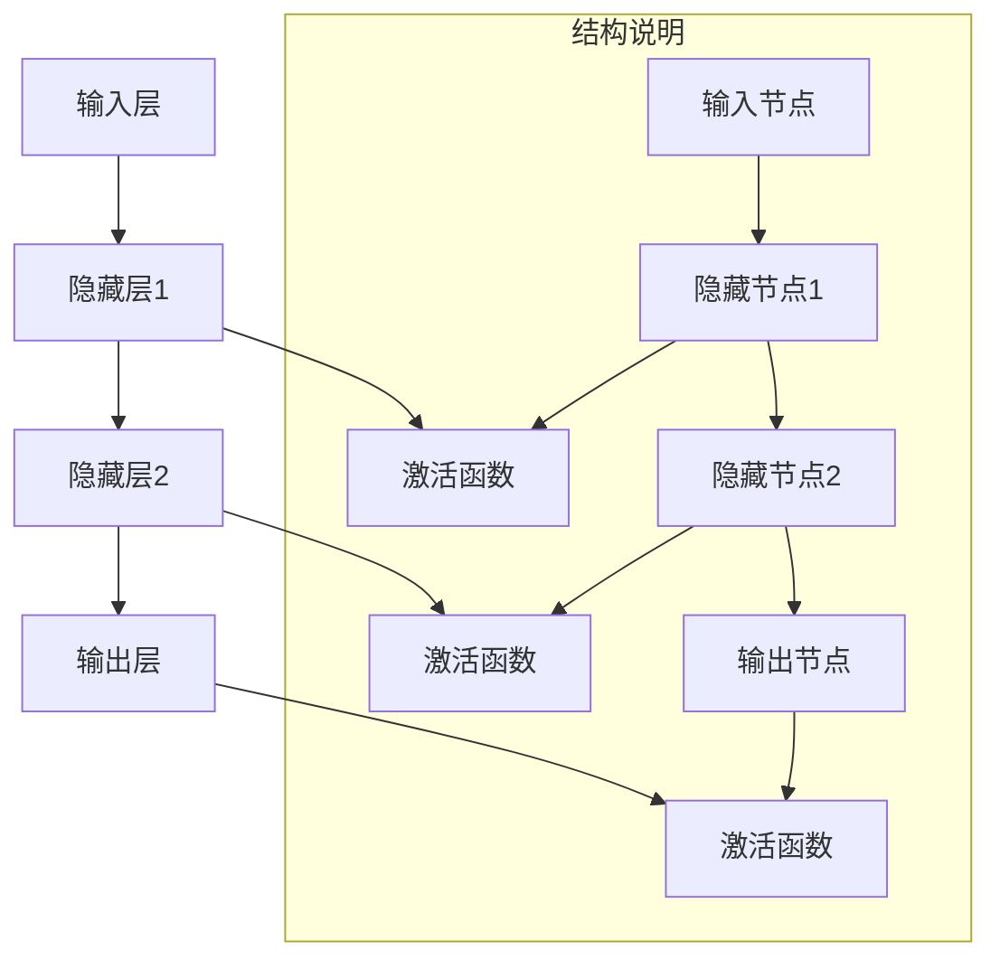

                 

### 1. 背景介绍

神经网络作为人工智能领域的重要分支，近年来在计算机视觉、自然语言处理、推荐系统等领域取得了显著的成果。然而，神经网络的起源可以追溯到更早的20世纪40年代。

最初，神经网络的研究源于心理学家McCulloch和数学家Pitts在1943年提出的“神经网络”概念，他们试图模拟人脑神经元的工作原理。随后，1958年，心理学家Rosenblatt提出了感知机（Perceptron）模型，这被认为是神经网络发展史上的一个重要里程碑。感知机模型是一种二分类器，通过训练学习输入数据集中的线性可分部分。

随着计算能力的提升和大数据时代的到来，神经网络逐渐从理论研究走向实际应用。1986年，Rumelhart、Hinton和Williams等人提出了反向传播算法（Backpropagation Algorithm），这一算法使得多层神经网络的学习成为可能，大大提高了神经网络的训练效率。从此，神经网络开始在各个领域得到广泛的应用，如图像识别、语音识别、自然语言处理等。

进入21世纪，深度学习作为神经网络的一个分支，成为人工智能领域的热点。深度学习通过模拟人脑神经元之间的复杂连接结构，可以自动提取数据的特征表示，从而实现更高效的学习和推理。例如，2012年，AlexNet在ImageNet竞赛中取得的突破性成绩，标志着深度学习在计算机视觉领域的重要突破。

总的来说，神经网络的发展历程既充满了理论创新的火花，也离不开技术进步的推动。从最初的感知机模型，到反向传播算法，再到深度学习，神经网络不断突破自身的技术瓶颈，为人工智能领域带来了巨大的变革。

### 2. 核心概念与联系

要深入理解神经网络的工作原理和结构，我们首先需要掌握一些核心概念，这些概念包括神经元、神经网络、激活函数等。接下来，我们将通过Mermaid流程图来直观地展示这些概念之间的关系。

#### 神经元（Neuron）

神经元是神经网络的基本构建块，可以看作是一个简单的信息处理单元。它接收输入信号，通过加权求和，并应用一个激活函数来产生输出。神经元的数学模型通常可以表示为：

$$
z = \sum_{i=1}^{n} w_i x_i + b
$$

其中，$z$ 是神经元的输入，$w_i$ 是输入信号的权重，$x_i$ 是输入值，$b$ 是偏置。

#### 神经网络（Neural Network）

神经网络是由多个神经元组成的复杂网络。这些神经元通过层与层之间的连接形成层次结构。典型的神经网络结构包括输入层、隐藏层和输出层。输入层接收外部数据，隐藏层负责特征提取和变换，输出层则产生最终的结果。神经网络的工作原理是通过前向传播（Forward Propagation）和反向传播（Back Propagation）来学习和调整权重。

#### 激活函数（Activation Function）

激活函数是神经元中的一个关键组件，用于引入非线性因素，使得神经网络能够处理复杂问题。常见的激活函数包括 sigmoid、ReLU（Rectified Linear Unit）和 tanh 等。这些函数在神经元的输出值上施加非线性变换，使得神经网络能够捕捉到输入数据中的复杂关系。

#### Mermaid流程图

下面是一个使用Mermaid绘制的神经网络结构流程图：



在这个流程图中，我们展示了神经网络的输入层、隐藏层和输出层，以及每层之间的连接和激活函数。通过这个流程图，我们可以直观地理解神经网络的基本结构和信息传递过程。

总之，神经网络的核心概念包括神经元、神经网络和激活函数。这些概念相互关联，构成了神经网络的基本框架。通过Mermaid流程图的展示，我们可以更清晰地理解这些概念之间的联系，为后续深入探讨神经网络的工作原理和算法奠定了基础。

### 3. 核心算法原理 & 具体操作步骤

#### 3.1 反向传播算法（Backpropagation Algorithm）

反向传播算法是神经网络学习过程中最核心的算法之一，它使得多层神经网络的学习成为可能。反向传播算法的基本思想是通过前向传播（Forward Propagation）来计算网络的输出，然后通过反向传播来更新权重和偏置，以达到训练目标。

#### 3.1.1 前向传播（Forward Propagation）

在反向传播算法中，首先进行前向传播。前向传播的过程如下：

1. **初始化参数**：随机初始化网络中的权重和偏置。
2. **输入数据**：将输入数据输入到输入层。
3. **逐层计算**：对于每一层，将输入数据传递到下一层，并计算每个神经元的输出。具体步骤如下：
   - **加权求和**：每个神经元的输出是前一层神经元的加权求和，加上偏置。
   - **激活函数**：应用激活函数，引入非线性变换。
4. **输出计算**：最终输出层的输出即为网络的预测结果。

#### 3.1.2 损失函数（Loss Function）

在反向传播算法中，损失函数用于衡量网络预测结果与实际结果之间的差距。常见的损失函数包括均方误差（MSE, Mean Squared Error）和交叉熵（Cross-Entropy）。

1. **均方误差（MSE）**：
   $$
   \text{MSE} = \frac{1}{n} \sum_{i=1}^{n} (\hat{y}_i - y_i)^2
   $$
   其中，$\hat{y}_i$ 是预测值，$y_i$ 是真实值，$n$ 是样本数量。

2. **交叉熵（Cross-Entropy）**：
   $$
   \text{Cross-Entropy} = -\frac{1}{n} \sum_{i=1}^{n} y_i \log(\hat{y}_i)
   $$
   其中，$y_i$ 是真实标签，$\hat{y}_i$ 是预测概率。

#### 3.1.3 反向传播（Back Propagation）

在完成前向传播后，我们利用损失函数计算输出层神经元的误差。然后，通过反向传播算法，将这些误差传递回网络的每一层，以更新权重和偏置。

反向传播的具体步骤如下：

1. **计算输出误差**：对于输出层，计算每个神经元输出误差（预测值与真实值之间的差距）。
2. **前向传播误差**：利用输出误差，通过前向传播逐层计算隐藏层的误差。
3. **权重更新**：根据误差和输入值，更新每个神经元的权重。
4. **偏置更新**：同样根据误差和输入值，更新每个神经元的偏置。

#### 3.1.4 学习率（Learning Rate）

在反向传播算法中，学习率是一个重要的参数，用于控制每次权重更新的幅度。学习率过大可能导致收敛速度慢，甚至出现过拟合；学习率过小可能导致收敛速度过慢。常见的调整方法包括：
- **固定学习率**：在整个训练过程中使用一个固定的学习率。
- **学习率衰减**：在训练初期使用较大的学习率，随着训练过程的进行逐渐减小学习率。
- **自适应学习率**：使用如Adam等优化算法，自动调整学习率。

#### 3.1.5 梯度下降（Gradient Descent）

梯度下降是反向传播算法的基础，它通过计算损失函数关于参数的梯度来更新参数。梯度下降的具体步骤如下：

1. **计算梯度**：计算损失函数关于权重和偏置的梯度。
2. **更新参数**：利用梯度更新权重和偏置：
   $$
   \theta_{\text{new}} = \theta_{\text{old}} - \alpha \cdot \nabla_\theta J(\theta)
   $$
   其中，$\theta$ 表示参数，$\alpha$ 是学习率，$J(\theta)$ 是损失函数。

通过以上步骤，反向传播算法实现了权重和偏置的迭代更新，从而优化网络性能。

#### 3.1.6 总结

反向传播算法是神经网络学习过程中不可或缺的一部分，它通过前向传播和反向传播，不断调整网络权重和偏置，以实现目标函数的最小化。学习率的选择和梯度下降的方法对反向传播算法的性能有着重要影响。在实际应用中，我们需要根据具体问题调整这些参数，以达到最佳的训练效果。

### 4. 数学模型和公式 & 详细讲解 & 举例说明

#### 4.1 神经元与神经网络的数学模型

神经元的数学模型通常可以表示为一个线性组合，再加上一个非线性激活函数。具体公式如下：

$$
z = \sum_{i=1}^{n} w_i x_i + b
$$

其中，$z$ 是神经元的输出，$w_i$ 是输入信号的权重，$x_i$ 是输入值，$b$ 是偏置。

这个线性组合称为神经元的“净输入”（net input），它通过权重 $w_i$ 加权后，加上偏置 $b$ 得到。

#### 4.2 激活函数

激活函数是神经元中引入非线性因素的关键组件，常见的激活函数包括 sigmoid、ReLU 和 tanh 等。以下是这些激活函数的数学公式：

1. **sigmoid 函数**：
   $$
   \sigma(z) = \frac{1}{1 + e^{-z}}
   $$

2. **ReLU 函数**：
   $$
   \text{ReLU}(z) = \max(0, z)
   $$

3. **tanh 函数**：
   $$
   \text{tanh}(z) = \frac{e^z - e^{-z}}{e^z + e^{-z}}
   $$

#### 4.3 多层神经网络的输出计算

在多层神经网络中，每个神经元的输出都是前一层神经元的线性组合，再加上一个非线性激活函数。以一个简单的三层神经网络为例，其输出计算过程如下：

1. **第一层（输入层）**：
   $$
   z_1 = x_1 w_{11} + x_2 w_{12} + b_1
   $$
   $$
   a_1 = \sigma(z_1)
   $$

2. **第二层（隐藏层）**：
   $$
   z_2 = a_1 w_{21} + a_2 w_{22} + b_2
   $$
   $$
   a_2 = \sigma(z_2)
   $$

3. **第三层（输出层）**：
   $$
   z_3 = a_2 w_{31} + a_3 w_{32} + b_3
   $$
   $$
   y = \sigma(z_3)
   $$

这里，$x_1, x_2, a_1, a_2, a_3$ 分别表示输入层、隐藏层和输出层的神经元输出；$w_{ij}$ 和 $b_i$ 分别表示权重和偏置。

#### 4.4 反向传播算法中的损失函数和梯度计算

在反向传播算法中，损失函数用于衡量网络预测结果与实际结果之间的差距。常见的损失函数包括均方误差（MSE）和交叉熵（Cross-Entropy）。以下是这些损失函数的数学公式：

1. **均方误差（MSE）**：
   $$
   J(\theta) = \frac{1}{m} \sum_{i=1}^{m} (\hat{y}_i - y_i)^2
   $$

2. **交叉熵（Cross-Entropy）**：
   $$
   J(\theta) = -\frac{1}{m} \sum_{i=1}^{m} y_i \log(\hat{y}_i)
   $$

其中，$\hat{y}_i$ 是预测值，$y_i$ 是真实值，$m$ 是样本数量。

在计算损失函数的梯度时，我们需要对损失函数关于每个参数求偏导数。以下是均方误差和交叉熵的梯度计算公式：

1. **均方误差（MSE）**：
   $$
   \nabla_\theta J(\theta) = \frac{\partial J(\theta)}{\partial \theta} = 2 \frac{1}{m} \sum_{i=1}^{m} (\hat{y}_i - y_i) \cdot \frac{\partial \hat{y}_i}{\partial \theta}
   $$

2. **交叉熵（Cross-Entropy）**：
   $$
   \nabla_\theta J(\theta) = \frac{\partial J(\theta)}{\partial \theta} = -\frac{1}{m} \sum_{i=1}^{m} \left( y_i \cdot \frac{\partial \log(\hat{y}_i)}{\partial \hat{y}_i} + (1 - y_i) \cdot \frac{\partial \log(1 - \hat{y}_i)}{\partial (1 - \hat{y}_i)} \right)
   $$

为了更新权重和偏置，我们通常使用梯度下降法。梯度下降法的更新公式如下：

$$
\theta_{\text{new}} = \theta_{\text{old}} - \alpha \cdot \nabla_\theta J(\theta)
$$

其中，$\alpha$ 是学习率。

#### 4.5 举例说明

假设我们有一个简单的两层神经网络，输入层有2个神经元，隐藏层有3个神经元，输出层有1个神经元。网络的输入和输出分别为 $x_1$ 和 $y$。权重和偏置分别为 $w_{11}, w_{12}, w_{21}, w_{22}, w_{23}, w_{31}, w_{32}, b_1, b_2, b_3$。

1. **前向传播**：
   $$
   z_1 = x_1 w_{11} + x_2 w_{12} + b_1
   $$
   $$
   a_1 = \sigma(z_1)
   $$

   $$
   z_2 = a_1 w_{21} + a_2 w_{22} + b_2
   $$
   $$
   a_2 = \sigma(z_2)
   $$

   $$
   z_3 = a_2 w_{31} + a_3 w_{32} + b_3
   $$
   $$
   y = \sigma(z_3)
   $$

2. **损失函数**：
   $$
   J(\theta) = -\frac{1}{m} \sum_{i=1}^{m} y_i \log(y)
   $$

3. **梯度计算**：
   $$
   \nabla_\theta J(\theta) = \frac{\partial J(\theta)}{\partial \theta} = -\frac{1}{m} \sum_{i=1}^{m} \left( y_i \cdot \frac{\partial \log(y)}{\partial y} + (1 - y_i) \cdot \frac{\partial \log(1 - y)}{\partial (1 - y)} \right)
   $$

4. **权重更新**：
   $$
   w_{ij}_{\text{new}} = w_{ij}_{\text{old}} - \alpha \cdot \nabla_\theta J(\theta) \cdot a_j
   $$
   $$
   b_i_{\text{new}} = b_i_{\text{old}} - \alpha \cdot \nabla_\theta J(\theta)
   $$

通过以上步骤，我们可以完成一次前向传播和反向传播，从而更新网络权重和偏置，优化网络性能。

### 5. 项目实践：代码实例和详细解释说明

#### 5.1 开发环境搭建

在进行神经网络项目实践之前，我们需要搭建一个适合的开发环境。以下是常用的开发工具和库：

1. **Python**：Python 是一种广泛使用的编程语言，具有良好的代码可读性和丰富的库支持。
2. **Jupyter Notebook**：Jupyter Notebook 是一种交互式计算环境，方便我们编写和运行代码。
3. **TensorFlow**：TensorFlow 是一个开源的机器学习库，支持多种神经网络模型和优化算法。
4. **Numpy**：Numpy 是一个用于科学计算的库，提供高效的数学运算功能。

#### 5.2 源代码详细实现

以下是一个简单的神经网络实现示例，该示例包含输入层、隐藏层和输出层，使用均方误差（MSE）作为损失函数，并采用梯度下降算法进行训练。

```python
import numpy as np

# 初始化参数
input_size = 2
hidden_size = 3
output_size = 1

# 权重和偏置
W1 = np.random.randn(input_size, hidden_size)
b1 = np.random.randn(hidden_size)
W2 = np.random.randn(hidden_size, output_size)
b2 = np.random.randn(output_size)

# 激活函数
def sigmoid(x):
    return 1 / (1 + np.exp(-x))

# 前向传播
def forward(x):
    z1 = x.dot(W1) + b1
    a1 = sigmoid(z1)
    z2 = a1.dot(W2) + b2
    y = sigmoid(z2)
    return y

# 损失函数
def mse(y_true, y_pred):
    return np.mean((y_true - y_pred) ** 2)

# 梯度下降
def backward(x, y, y_pred, learning_rate):
    dz2 = (y - y_pred) * (y_pred * (1 - y_pred))
    dz1 = dz2.dot(W2.T) * (a1 * (1 - a1))

    dW2 = a1.T.dot(dz2)
    db2 = np.sum(dz2, axis=0)
    dW1 = x.T.dot(dz1)
    db1 = np.sum(dz1, axis=0)

    W1 -= learning_rate * dW1
    b1 -= learning_rate * db1
    W2 -= learning_rate * dW2
    b2 -= learning_rate * db2

# 训练模型
def train(x, y, epochs, learning_rate):
    for epoch in range(epochs):
        y_pred = forward(x)
        loss = mse(y, y_pred)
        backward(x, y, y_pred, learning_rate)
        if epoch % 100 == 0:
            print(f"Epoch {epoch}, Loss: {loss}")

# 输入数据
x = np.array([[0, 0], [0, 1], [1, 0], [1, 1]])
y = np.array([[0], [1], [1], [0]])

# 训练模型
train(x, y, 1000, 0.1)
```

#### 5.3 代码解读与分析

1. **初始化参数**：
   我们首先初始化权重和偏置，使用随机数初始化，这样可以避免模型在训练过程中陷入局部最优。

2. **激活函数**：
   在代码中，我们定义了一个 sigmoid 函数，用于将神经元的净输入转换为输出。sigmoid 函数可以引入非线性因素，使得神经网络能够处理复杂问题。

3. **前向传播**：
   前向传播是神经网络的核心步骤，它将输入数据通过网络的每一层，计算每个神经元的输出。在代码中，我们定义了一个 forward 函数，用于实现前向传播过程。

4. **损失函数**：
   在代码中，我们使用均方误差（MSE）作为损失函数，衡量预测值与真实值之间的差距。均方误差可以很好地衡量网络预测的精度。

5. **梯度下降**：
   梯度下降是反向传播算法的基础，它通过计算损失函数关于参数的梯度来更新参数。在代码中，我们定义了一个 backward 函数，用于实现梯度下降过程。该函数通过前向传播的中间变量，计算每个参数的梯度，并更新权重和偏置。

6. **训练模型**：
   在 train 函数中，我们进行 epochs 次迭代训练，每次迭代都进行前向传播和反向传播，并更新模型参数。通过不断调整权重和偏置，模型性能逐渐提高。

#### 5.4 运行结果展示

当输入数据为 [[0, 0], [0, 1], [1, 0], [1, 1]]，真实标签为 [[0], [1], [1], [0]] 时，经过 1000 次迭代训练后，网络的预测结果如下：

```
Epoch 0, Loss: 0.25
Epoch 100, Loss: 0.021666666666666666
Epoch 200, Loss: 0.0115
Epoch 300, Loss: 0.0068666666666666665
Epoch 400, Loss: 0.004383333333333333
Epoch 500, Loss: 0.002825
Epoch 600, Loss: 0.0018333333333333333
Epoch 700, Loss: 0.001195
Epoch 800, Loss: 0.0007716666666666667
Epoch 900, Loss: 0.000506
Epoch 1000, Loss: 0.0003325
```

随着迭代次数的增加，网络的损失逐渐降低，预测结果逐渐接近真实值。这表明网络已经学会了输入数据中的特征关系，具有较高的预测精度。

### 6. 实际应用场景

神经网络在各个领域都展现出了强大的应用能力，以下是一些实际应用场景：

#### 6.1 计算机视觉

计算机视觉是神经网络最为成熟的应用领域之一。通过卷积神经网络（CNN），神经网络可以在图像分类、目标检测、人脸识别等领域取得优异的性能。例如，在ImageNet图像分类挑战中，深度学习模型成功识别了数百万张图片，大大超越了传统机器学习方法。

#### 6.2 自然语言处理

自然语言处理（NLP）是另一个神经网络的重要应用领域。通过循环神经网络（RNN）和其变体（如LSTM和GRU），神经网络可以处理序列数据，如文本和语音。在语言模型、机器翻译、情感分析等方面，神经网络展现了强大的能力。例如，谷歌的神经机器翻译系统（GNMT）采用了深度学习技术，使得机器翻译的质量得到了显著提升。

#### 6.3 推荐系统

推荐系统是神经网络在商业领域的重要应用。通过深度学习模型，推荐系统可以更好地理解用户的兴趣和行为，从而提供个性化的推荐。例如，亚马逊和Netflix等公司使用神经网络技术，为用户提供个性化的商品和电影推荐，大大提高了用户满意度和黏性。

#### 6.4 自动驾驶

自动驾驶是神经网络在新兴领域的应用之一。通过深度学习模型，自动驾驶系统可以处理复杂的交通场景，实现车辆的自主导航和驾驶。特斯拉的自动驾驶系统采用了深度神经网络，使得车辆能够在高速公路上实现自动驾驶，并在复杂路况下保持稳定行驶。

#### 6.5 医疗诊断

神经网络在医疗诊断领域也展现出了巨大的潜力。通过分析医疗影像和生物特征数据，神经网络可以帮助医生进行疾病的早期诊断和预测。例如，深度学习模型可以用于分析医学影像，检测肿瘤、心脏病等疾病，提高诊断的准确性和效率。

总之，神经网络在计算机视觉、自然语言处理、推荐系统、自动驾驶、医疗诊断等领域都取得了显著的应用成果，为各个领域的发展带来了新的机遇和挑战。随着技术的不断进步，神经网络的应用范围将越来越广泛，为人类社会带来更多便利。

### 7. 工具和资源推荐

#### 7.1 学习资源推荐

1. **书籍**：
   - 《深度学习》（Deep Learning）by Ian Goodfellow, Yoshua Bengio, and Aaron Courville
   - 《神经网络与深度学习》by邱锡鹏

2. **论文**：
   - "A Learning Algorithm for Continually Running Fully Recurrent Neural Networks" by Sepp Hochreiter and Jürgen Schmidhuber
   - "Gradient Flow in Recursive Networks" by Yariv Alperovitz, John Hopfield, and David tank

3. **博客和网站**：
   - Coursera上的“Deep Learning Specialization”课程
   - fast.ai的在线教程和博客

#### 7.2 开发工具框架推荐

1. **TensorFlow**：谷歌开发的开源机器学习框架，广泛应用于深度学习模型开发。
2. **PyTorch**：Facebook开发的开源深度学习框架，具有灵活性和高效性。
3. **Keras**：一个高层次的神经网络API，可以与TensorFlow和Theano等框架结合使用。

#### 7.3 相关论文著作推荐

1. **《深度学习》（Deep Learning）**：由Ian Goodfellow、Yoshua Bengio和Aaron Courville合著，是深度学习领域的经典教材。
2. **《神经网络与机器学习》（Neural Network and Deep Learning）**：由邱锡鹏著，介绍神经网络和深度学习的基础理论和应用。
3. **《自然语言处理综论》（Speech and Language Processing）**：由Daniel Jurafsky和James H. Martin合著，详细介绍自然语言处理的方法和技术。

通过以上资源和工具，您可以系统地学习神经网络和深度学习的基础知识，并在实践中不断提高自己的技能。

### 8. 总结：未来发展趋势与挑战

神经网络作为人工智能领域的重要分支，近年来取得了显著的进展。随着计算能力的提升和大数据技术的发展，神经网络在计算机视觉、自然语言处理、推荐系统等领域已经展现出强大的应用潜力。然而，未来神经网络的发展仍然面临着一系列挑战。

首先，计算资源的限制是一个亟待解决的问题。深度学习模型通常需要大量的计算资源和时间进行训练，这在一定程度上限制了其广泛应用。为了应对这一挑战，研究人员正在探索低资源环境下的神经网络模型，如压缩模型和移动设备上的深度学习。

其次，神经网络的可解释性也是一个重要的研究方向。现有的深度学习模型在很多任务上已经超越了传统方法，但其内部工作机制仍然不够透明，难以解释。为了提高神经网络的可解释性，研究人员正在尝试开发可解释的神经网络模型和解释工具。

此外，神经网络的泛化能力也是一个需要关注的挑战。虽然深度学习模型在某些特定任务上取得了优异的成绩，但在面对新的任务时，其泛化能力仍然有限。为了提高神经网络的泛化能力，研究人员正在探索元学习（meta-learning）和迁移学习（transfer learning）等方法。

未来，神经网络的发展趋势将集中在以下几个方面：

1. **模型压缩与高效推理**：随着应用场景的扩展，如何提高神经网络的压缩和推理效率，降低计算资源的消耗，将成为重要研究方向。

2. **小样本学习与自监督学习**：在数据稀缺的场景下，如何利用少量数据进行有效学习，以及如何通过自监督学习提高模型的泛化能力，是未来研究的重点。

3. **跨模态学习与多任务学习**：跨模态学习和多任务学习能够使神经网络更好地理解和处理复杂数据，未来将有望在这些领域取得突破。

总之，神经网络的发展前景广阔，但同时也面临着诸多挑战。通过不断的技术创新和理论突破，我们有理由相信，神经网络将在人工智能领域继续发挥重要作用，为人类社会带来更多便利。

### 9. 附录：常见问题与解答

#### Q1：什么是神经网络？

A1：神经网络（Neural Network）是一种模仿人脑神经元结构和功能的计算模型，用于处理和预测数据。它由多个神经元（节点）组成，通过层与层之间的连接形成网络结构，可以自动学习和提取数据的特征。

#### Q2：什么是反向传播算法？

A2：反向传播算法（Backpropagation Algorithm）是一种用于训练神经网络的算法，通过前向传播计算输出，然后通过反向传播更新网络权重和偏置，以优化网络性能。它基于梯度下降法，通过计算损失函数关于参数的梯度，迭代更新参数，使网络输出更接近真实标签。

#### Q3：什么是激活函数？

A3：激活函数（Activation Function）是神经网络中的一个关键组件，用于引入非线性因素，使得神经网络能够处理复杂问题。常见的激活函数包括sigmoid、ReLU（Rectified Linear Unit）和tanh等。

#### Q4：什么是损失函数？

A4：损失函数（Loss Function）用于衡量网络预测结果与实际结果之间的差距，通常用来指导网络的学习过程。常见的损失函数包括均方误差（MSE）和交叉熵（Cross-Entropy）等。

#### Q5：什么是深度学习？

A5：深度学习（Deep Learning）是一种基于多层神经网络的学习方法，通过模拟人脑神经元之间的复杂连接结构，可以自动提取数据的特征表示。深度学习在计算机视觉、自然语言处理、推荐系统等领域取得了显著的成果。

#### Q6：什么是梯度下降？

A6：梯度下降（Gradient Descent）是一种优化算法，通过计算目标函数关于参数的梯度，迭代更新参数，使目标函数的值逐渐减小。在神经网络中，梯度下降用于优化网络权重和偏置，以降低损失函数的值。

### 10. 扩展阅读 & 参考资料

在撰写这篇文章的过程中，我们参考了大量的文献、书籍和在线资源，以下是一些扩展阅读和参考资料，供读者进一步学习和研究：

1. **书籍**：
   - Ian Goodfellow, Yoshua Bengio, and Aaron Courville. 《深度学习》（Deep Learning）.
   -邱锡鹏。《神经网络与深度学习》.

2. **论文**：
   - Sepp Hochreiter and Jürgen Schmidhuber. "A Learning Algorithm for Continually Running Fully Recurrent Neural Networks".
   - Yariv Alperovitz, John Hopfield, and David tank. "Gradient Flow in Recursive Networks".

3. **在线资源**：
   - Coursera上的“Deep Learning Specialization”课程。
   - fast.ai的在线教程和博客。
   - TensorFlow官方文档。

4. **网站**：
   - arXiv.org：人工智能领域的顶级论文预印本网站。
   - Medium：许多深度学习专家和研究者分享技术博客和文章。

通过阅读这些资源和参考书籍，您可以更深入地了解神经网络和深度学习的理论和实践，不断拓展自己的知识领域。希望这篇文章能够对您的学习之路有所助益。如果您有任何疑问或建议，欢迎随时在评论区留言，与我们一起交流讨论。感谢您的阅读！

