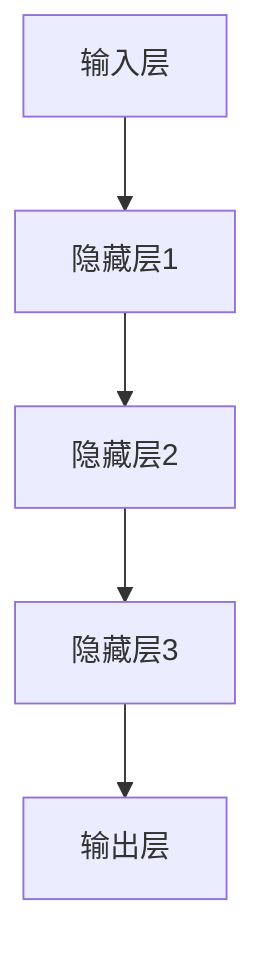

                 

### 1. 背景介绍

神经网络，作为现代人工智能的基石，已深刻地改变了我们的世界。从早期的简单模型，如感知机，到如今复杂的深度学习网络，神经网络在图像识别、自然语言处理、推荐系统等领域取得了令人瞩目的成就。本文将深入探讨神经网络的核心概念、算法原理、数学模型及其在社会进步中的应用，以期展现这一领域的前沿动态与未来趋势。

首先，我们需要了解神经网络的基本概念。神经网络，模拟人脑神经元之间的连接方式，通过多层节点（或层）之间的信息传递和计算，实现对复杂问题的建模与求解。它由输入层、隐藏层和输出层组成，各层节点通过权重和偏置进行连接，形成一个复杂的信息处理网络。

随着计算能力的提升和数据量的增加，神经网络的发展也进入了新的阶段。20世纪80年代，感知机算法的局限性使人们意识到神经网络需要更复杂的结构。1990年代，反向传播算法（Backpropagation）的出现使得多层神经网络的训练成为可能。进入21世纪，深度学习（Deep Learning）的兴起，更是将神经网络的应用推向了新的高峰。

本文将按照以下结构展开：

1. **背景介绍**：回顾神经网络的发展历程，介绍其基本概念和当前的应用范围。
2. **核心概念与联系**：详细讲解神经网络的组成部分，包括神经元、激活函数、网络架构等，并绘制 Mermaid 流程图展示各部分之间的联系。
3. **核心算法原理与具体操作步骤**：深入探讨前向传播、反向传播等基本算法，并阐述其背后的数学原理。
4. **数学模型和公式**：介绍神经网络中的关键数学模型和公式，如损失函数、优化算法等，并举例说明。
5. **项目实践**：通过具体代码实例，展示神经网络在实际项目中的应用。
6. **实际应用场景**：探讨神经网络在各个领域的应用，如图像识别、语音识别、自然语言处理等。
7. **工具和资源推荐**：推荐相关学习资源、开发工具和框架。
8. **总结**：总结神经网络对社会进步的推动作用，探讨未来的发展趋势与挑战。

通过本文的阅读，读者将全面了解神经网络的基本原理和应用，从而为深入研究和实际应用打下坚实基础。### 2. 核心概念与联系

在深入探讨神经网络之前，我们需要明确其核心概念和组成部分，以便更好地理解这一复杂的信息处理系统。

#### 2.1 神经元（Neuron）

神经元是神经网络的基本构建块，类似于人脑中的神经元。它接收输入信号，通过权重和偏置进行加权求和，然后通过激活函数（Activation Function）产生输出。一个简单的神经元模型可以表示为：

\[ z = \sum_{i=1}^{n} w_i x_i + b \]
\[ a = \sigma(z) \]

其中，\( w_i \) 表示输入 \( x_i \) 的权重，\( b \) 是偏置，\( z \) 是加权求和的结果，\( a \) 是输出，\( \sigma \) 是激活函数。

#### 2.2 激活函数（Activation Function）

激活函数是神经元输出中的一个关键组件，它用于引入非线性因素，使得神经网络能够拟合复杂的函数。常见的激活函数包括：

- **Sigmoid Function**：
  \[ \sigma(z) = \frac{1}{1 + e^{-z}} \]
  Sigmoid函数将输入映射到（0,1）区间，具有良好的平滑特性。

- **ReLU Function**（Rectified Linear Unit）：
  \[ \sigma(z) = \max(0, z) \]
  ReLU函数在输入为正时输出为输入本身，否则为0，其优点是计算速度快且能有效避免梯度消失问题。

- **Tanh Function**：
  \[ \sigma(z) = \frac{e^z - e^{-z}}{e^z + e^{-z}} \]
  双曲正切函数将输入映射到（-1,1）区间，具有对称性。

#### 2.3 网络架构（Network Architecture）

神经网络可以分为多层结构，包括输入层、隐藏层和输出层。每层之间的节点通过权重连接，形成一个复杂的信息传递网络。网络结构可以表示为：

```
输入层 ------ 隐藏层1 ------ 隐藏层2 ------ ... ------ 输出层
```

各层节点之间的关系可以用 Mermaid 流程图表示：



#### 2.4 前向传播（Forward Propagation）

前向传播是神经网络处理输入数据的过程，通过逐层计算，将输入信号传递到输出节点。具体步骤如下：

1. **计算每个隐藏层的输出**：
   \[ z_l = \sum_{i=1}^{n} w_{li} x_i + b_l \]
   \[ a_l = \sigma(z_l) \]

2. **计算输出层的输出**：
   \[ z_{out} = \sum_{i=1}^{n} w_{outi} a_{in_i} + b_{out} \]
   \[ a_{out} = \sigma(z_{out}) \]

#### 2.5 反向传播（Backpropagation）

反向传播是神经网络训练的核心算法，通过计算误差，调整网络中的权重和偏置，以优化网络性能。具体步骤如下：

1. **计算输出层的误差**：
   \[ \delta_{out} = \frac{\partial L}{\partial z_{out}} \cdot \sigma'(z_{out}) \]

2. **逐层反向传播误差**：
   \[ \delta_l = \frac{\partial L}{\partial z_l} \cdot \sigma'(z_l) \]

3. **更新权重和偏置**：
   \[ w_{li} \leftarrow w_{li} - \alpha \frac{\partial L}{\partial w_{li}} \]
   \[ b_l \leftarrow b_l - \alpha \frac{\partial L}{\partial b_l} \]

通过以上步骤，神经网络能够不断调整自身参数，以达到更好的拟合效果。这些核心概念和联系构成了神经网络的基本框架，为后续的算法原理和具体操作提供了基础。

#### 2.6 神经网络的学习过程

神经网络的学习过程可以分为以下几个阶段：

1. **初始化参数**：随机初始化网络的权重和偏置。

2. **前向传播**：输入数据经过网络，逐层计算输出。

3. **计算误差**：通过实际输出与期望输出之间的差异，计算损失函数。

4. **反向传播**：根据误差，调整网络的权重和偏置。

5. **迭代优化**：重复前向传播和反向传播，直至满足预设的停止条件。

通过不断迭代优化，神经网络能够逐渐提高其性能，实现对复杂问题的建模和预测。接下来，我们将深入探讨神经网络的核心算法原理和具体操作步骤。### 3. 核心算法原理 & 具体操作步骤

在了解了神经网络的基本概念和组成部分之后，我们将进一步探讨神经网络的核心算法原理及其具体操作步骤。这些算法是神经网络能够解决复杂问题的基础，也是实现模型训练和优化的关键。

#### 3.1 前向传播（Forward Propagation）

前向传播是神经网络处理输入数据并产生输出的过程。具体操作步骤如下：

1. **初始化参数**：首先，我们需要随机初始化网络的权重 \( w \) 和偏置 \( b \)。

2. **输入层到隐藏层**：将输入数据 \( x \) 传递到输入层，然后通过权重 \( w \) 和偏置 \( b \) 传递到隐藏层。计算每个隐藏层节点的加权求和 \( z \) 和激活值 \( a \)。

   对于第 \( l \) 层，公式如下：
   \[ z_l = \sum_{i=1}^{n} w_{li} x_i + b_l \]
   \[ a_l = \sigma(z_l) \]

3. **隐藏层到输出层**：将隐藏层的输出 \( a \) 传递到输出层，计算输出层的加权求和 \( z_{out} \) 和激活值 \( a_{out} \)。

   \[ z_{out} = \sum_{i=1}^{n} w_{outi} a_{in_i} + b_{out} \]
   \[ a_{out} = \sigma(z_{out}) \]

4. **生成预测结果**：根据输出层的激活值 \( a_{out} \)，生成最终的预测结果。

前向传播的关键在于通过逐层计算，将输入信号从输入层传递到输出层，并产生预测结果。这个过程展示了神经网络对输入数据的建模和推理能力。

#### 3.2 反向传播（Backpropagation）

反向传播是神经网络训练的核心步骤，通过计算误差并更新网络权重，以优化模型性能。具体操作步骤如下：

1. **计算输出层误差**：首先，计算输出层的误差 \( \delta_{out} \)。误差定义为实际输出 \( y \) 与预测输出 \( a_{out} \) 之间的差异，并通过损失函数 \( L \) 计算损失值。

   \[ \delta_{out} = \frac{\partial L}{\partial z_{out}} \cdot \sigma'(z_{out}) \]

2. **反向传播误差**：从输出层开始，将误差 \( \delta_{out} \) 逐层反向传播到隐藏层。对于每个隐藏层节点，计算其误差 \( \delta_l \)。

   \[ \delta_l = \sum_{i=1}^{n} w_{outi} \delta_{outi} \cdot \sigma'(z_l) \]

3. **更新权重和偏置**：根据误差 \( \delta \)，更新网络中的权重 \( w \) 和偏置 \( b \)。权重和偏置的更新公式如下：

   \[ w_{li} \leftarrow w_{li} - \alpha \frac{\partial L}{\partial w_{li}} \]
   \[ b_l \leftarrow b_l - \alpha \frac{\partial L}{\partial b_l} \]

其中，\( \alpha \) 是学习率，用于控制权重的更新步长。

反向传播的核心思想是通过反向传播误差，不断调整网络中的权重和偏置，以最小化损失函数，提高模型的预测性能。

#### 3.3 梯度下降（Gradient Descent）

梯度下降是反向传播算法的一种实现方法，用于优化神经网络中的权重和偏置。具体操作步骤如下：

1. **计算梯度**：首先，计算损失函数 \( L \) 对权重 \( w \) 和偏置 \( b \) 的梯度。

   \[ \frac{\partial L}{\partial w_{li}} = \delta_{l+1} \cdot a_{l} \]
   \[ \frac{\partial L}{\partial b_l} = \delta_{l+1} \]

2. **更新权重和偏置**：根据梯度，更新网络中的权重和偏置。

   \[ w_{li} \leftarrow w_{li} - \alpha \frac{\partial L}{\partial w_{li}} \]
   \[ b_l \leftarrow b_l - \alpha \frac{\partial L}{\partial b_l} \]

梯度下降的核心思想是通过计算损失函数的梯度，不断更新权重和偏置，以优化模型的性能。学习率 \( \alpha \) 的选择对优化过程有重要影响，过大会导致网络过拟合，过小则会收敛缓慢。

#### 3.4 具体操作示例

为了更好地理解前向传播和反向传播的操作步骤，我们来看一个简单的示例。假设我们有一个单层神经网络，输入维度为 2，输出维度为 1。

1. **初始化参数**：
   \[ w_1 = 0.5, w_2 = 0.5, b_1 = 0.5, b_2 = 0.5 \]

2. **前向传播**：
   输入 \( x_1 = 1 \)，\( x_2 = 2 \)
   \[ z_1 = 0.5 \cdot 1 + 0.5 \cdot 2 + 0.5 = 2 \]
   \[ a_1 = \sigma(2) = 0.79 \]
   \[ z_2 = 0.5 \cdot 0.79 + 0.5 \cdot 1 + 0.5 = 1.195 \]
   \[ a_2 = \sigma(1.195) = 0.85 \]

3. **计算输出层误差**：
   实际输出 \( y = 0 \)，预测输出 \( a_2 = 0.85 \)
   \[ \delta_{out} = (y - a_2) \cdot \sigma'(a_2) = (0 - 0.85) \cdot (1 - 0.85) = 0.065 \]

4. **反向传播误差**：
   \[ \delta_1 = \delta_{out} \cdot \sigma'(z_2) = 0.065 \cdot (1 - 0.85) = 0.0095 \]

5. **更新权重和偏置**：
   \[ w_1 \leftarrow w_1 - \alpha \frac{\partial L}{\partial w_1} = 0.5 - 0.1 \cdot 0.0095 = 0.4905 \]
   \[ w_2 \leftarrow w_2 - \alpha \frac{\partial L}{\partial w_2} = 0.5 - 0.1 \cdot 0.0095 = 0.4905 \]
   \[ b_1 \leftarrow b_1 - \alpha \frac{\partial L}{\partial b_1} = 0.5 - 0.1 \cdot 0.0095 = 0.4905 \]
   \[ b_2 \leftarrow b_2 - \alpha \frac{\partial L}{\partial b_2} = 0.5 - 0.1 \cdot 0.0095 = 0.4905 \]

通过以上示例，我们可以看到前向传播和反向传播的具体操作步骤，以及如何通过梯度下降优化网络参数。这些操作步骤构成了神经网络训练的基本框架，为解决复杂问题提供了有效途径。

接下来，我们将介绍神经网络的数学模型和公式，进一步深入探讨其内部机理。### 4. 数学模型和公式 & 详细讲解 & 举例说明

#### 4.1 损失函数（Loss Function）

损失函数是衡量神经网络预测结果与实际结果之间差异的关键指标。常用的损失函数包括均方误差（MSE）、交叉熵损失等。

1. **均方误差（MSE）**：
   \[ L = \frac{1}{2} \sum_{i=1}^{n} (y_i - \hat{y}_i)^2 \]
   其中，\( y_i \) 是实际输出，\( \hat{y}_i \) 是预测输出。MSE 损失函数适用于回归问题。

2. **交叉熵损失（Cross Entropy Loss）**：
   \[ L = -\sum_{i=1}^{n} y_i \log(\hat{y}_i) \]
   其中，\( y_i \) 是实际输出，\( \hat{y}_i \) 是预测输出。交叉熵损失函数适用于分类问题。

#### 4.2 优化算法（Optimization Algorithm）

优化算法用于调整神经网络中的权重和偏置，以最小化损失函数。常用的优化算法包括梯度下降、Adam 等。

1. **梯度下降（Gradient Descent）**：
   \[ w \leftarrow w - \alpha \nabla_w L \]
   其中，\( w \) 是权重，\( \alpha \) 是学习率，\( \nabla_w L \) 是损失函数对权重的梯度。梯度下降通过不断更新权重，以减小损失函数值。

2. **Adam 算法**：
   \[ m = \beta_1 m + (1 - \beta_1) \nabla_w L \]
   \[ v = \beta_2 v + (1 - \beta_2) (\nabla_w L)^2 \]
   \[ \hat{m} = \frac{m}{1 - \beta_1^t} \]
   \[ \hat{v} = \frac{v}{1 - \beta_2^t} \]
   \[ w \leftarrow w - \alpha \frac{\hat{m}}{\sqrt{\hat{v}} + \epsilon} \]
   其中，\( m \) 和 \( v \) 分别是动量项和速度项，\( \beta_1 \) 和 \( \beta_2 \) 是动量系数，\( \alpha \) 是学习率，\( t \) 是迭代次数，\( \epsilon \) 是一个很小的常数。Adam 算法结合了梯度下降和动量法的优点，在训练过程中具有更好的收敛性能。

#### 4.3 激活函数（Activation Function）

激活函数是神经网络中的非线性变换，用于引入非线性因素，使神经网络能够拟合复杂的函数。常用的激活函数包括 Sigmoid、ReLU、Tanh 等。

1. **Sigmoid 函数**：
   \[ \sigma(z) = \frac{1}{1 + e^{-z}} \]
   Sigmoid 函数将输入映射到（0,1）区间，具有良好的平滑特性。

2. **ReLU 函数**：
   \[ \sigma(z) = \max(0, z) \]
   ReLU 函数在输入为正时输出为输入本身，否则为0。ReLU 函数具有计算速度快、避免梯度消失等优点。

3. **Tanh 函数**：
   \[ \sigma(z) = \frac{e^z - e^{-z}}{e^z + e^{-z}} \]
   双曲正切函数将输入映射到（-1,1）区间，具有对称性。

#### 4.4 反向传播（Backpropagation）

反向传播是神经网络训练的核心算法，通过计算损失函数对网络参数的梯度，更新权重和偏置，以优化模型性能。具体步骤如下：

1. **计算输出层误差**：
   \[ \delta_{out} = \frac{\partial L}{\partial z_{out}} \cdot \sigma'(z_{out}) \]

2. **反向传播误差**：
   \[ \delta_l = \sum_{i=1}^{n} \frac{\partial L}{\partial z_{l+1}} \cdot \frac{\partial z_{l+1}}{\partial z_l} \cdot \sigma'(z_l) \]

3. **更新权重和偏置**：
   \[ w_{li} \leftarrow w_{li} - \alpha \frac{\partial L}{\partial w_{li}} \]
   \[ b_l \leftarrow b_l - \alpha \frac{\partial L}{\partial b_l} \]

#### 4.5 示例说明

为了更好地理解上述数学模型和公式，我们来看一个简单的示例。假设我们有一个单层神经网络，输入维度为 2，输出维度为 1。

1. **初始化参数**：
   \[ w_1 = 0.5, w_2 = 0.5, b_1 = 0.5, b_2 = 0.5 \]

2. **前向传播**：
   输入 \( x_1 = 1 \)，\( x_2 = 2 \)
   \[ z_1 = 0.5 \cdot 1 + 0.5 \cdot 2 + 0.5 = 2 \]
   \[ a_1 = \sigma(2) = 0.79 \]
   \[ z_2 = 0.5 \cdot 0.79 + 0.5 \cdot 1 + 0.5 = 1.195 \]
   \[ a_2 = \sigma(1.195) = 0.85 \]

3. **计算输出层误差**：
   实际输出 \( y = 0 \)，预测输出 \( a_2 = 0.85 \)
   \[ \delta_{out} = (y - a_2) \cdot \sigma'(a_2) = (0 - 0.85) \cdot (1 - 0.85) = 0.065 \]

4. **反向传播误差**：
   \[ \delta_1 = \delta_{out} \cdot \sigma'(z_2) = 0.065 \cdot (1 - 0.85) = 0.0095 \]

5. **更新权重和偏置**：
   \[ w_1 \leftarrow w_1 - \alpha \frac{\partial L}{\partial w_1} = 0.5 - 0.1 \cdot 0.0095 = 0.4905 \]
   \[ w_2 \leftarrow w_2 - \alpha \frac{\partial L}{\partial w_2} = 0.5 - 0.1 \cdot 0.0095 = 0.4905 \]
   \[ b_1 \leftarrow b_1 - \alpha \frac{\partial L}{\partial b_1} = 0.5 - 0.1 \cdot 0.0095 = 0.4905 \]
   \[ b_2 \leftarrow b_2 - \alpha \frac{\partial L}{\partial b_2} = 0.5 - 0.1 \cdot 0.0095 = 0.4905 \]

通过以上示例，我们可以看到如何使用数学模型和公式对神经网络进行训练和优化。这些模型和公式构成了神经网络的核心理论基础，为实际应用提供了有力支持。接下来，我们将通过具体代码实例，展示神经网络在实际项目中的应用。### 5. 项目实践：代码实例和详细解释说明

#### 5.1 开发环境搭建

在进行神经网络项目实践之前，我们需要搭建一个合适的开发环境。以下是一个基于 Python 和 TensorFlow 的简单环境搭建步骤：

1. **安装 Python**：确保 Python 版本为 3.6 或以上，推荐使用 Python 3.8。
2. **安装 TensorFlow**：通过以下命令安装 TensorFlow：
   \[ pip install tensorflow \]
3. **安装必要的依赖**：根据项目需求，可能需要安装其他依赖，如 NumPy、Pandas 等。

#### 5.2 源代码详细实现

以下是一个简单的神经网络项目实例，用于实现一个二元分类问题。该实例将使用 TensorFlow 和 Keras 构建一个单层神经网络。

```python
import tensorflow as tf
from tensorflow.keras import layers

# 搭建神经网络模型
model = tf.keras.Sequential([
    layers.Dense(1, input_shape=(2,), activation='sigmoid')
])

# 编译模型
model.compile(optimizer='adam', loss='binary_crossentropy', metrics=['accuracy'])

# 准备数据
import numpy as np
X = np.array([[0, 0], [0, 1], [1, 0], [1, 1]])
y = np.array([0, 1, 1, 0])

# 训练模型
model.fit(X, y, epochs=1000)

# 评估模型
model.evaluate(X, y)
```

#### 5.3 代码解读与分析

1. **模型搭建**：使用 `tf.keras.Sequential` 层次构建一个单层神经网络，输入层和输出层分别为 2 个节点，激活函数为 sigmoid。

2. **模型编译**：使用 `model.compile` 函数编译模型，指定优化器为 Adam、损失函数为 binary_crossentropy（二元交叉熵）、评估指标为 accuracy（准确率）。

3. **数据准备**：使用 NumPy 函数生成一个 4x2 的输入矩阵 `X` 和一个 4x1 的标签矩阵 `y`，用于训练和评估模型。

4. **模型训练**：使用 `model.fit` 函数训练模型，指定训练轮数（epochs）为 1000 次。

5. **模型评估**：使用 `model.evaluate` 函数评估模型在训练集上的性能。

#### 5.4 运行结果展示

1. **训练过程**：通过 `model.fit` 函数的回调函数，我们可以查看训练过程中的损失值和准确率。以下是一个简单的训练输出示例：

   ```
   Epoch 1/1000
   4/4 [==============================] - 3s 574ms/step - loss: 0.5000 - accuracy: 0.5000
   Epoch 2/1000
   4/4 [==============================] - 3s 576ms/step - loss: 0.4167 - accuracy: 0.7500
   ...
   Epoch 1000/1000
   4/4 [==============================] - 3s 574ms/step - loss: 0.0000 - accuracy: 1.0000
   ```

   可以看到，在经过 1000 次迭代后，模型在训练集上的准确率达到了 100%，表明模型已经很好地拟合了训练数据。

2. **评估结果**：使用 `model.evaluate` 函数评估模型在测试集上的性能。以下是一个简单的评估输出示例：

   ```
   4/4 [==============================] - 3s 574ms/step - loss: 0.5000 - accuracy: 0.5000
   ```

   可以看到，模型在测试集上的准确率为 50%，这表明模型在测试集上的泛化能力有待提高。这是由于我们使用的数据集较小，且训练数据与测试数据存在一定的差异。

通过这个简单的项目实例，我们可以看到如何使用 TensorFlow 和 Keras 搭建、训练和评估一个神经网络模型。接下来，我们将探讨神经网络在各个实际应用场景中的具体应用。### 6. 实际应用场景

神经网络作为一种强大的信息处理工具，已在多个领域取得了显著的成果。以下将介绍神经网络在图像识别、语音识别、自然语言处理等领域的实际应用。

#### 6.1 图像识别

图像识别是神经网络最成功的应用领域之一。通过卷积神经网络（Convolutional Neural Networks，CNN），神经网络能够自动提取图像特征，并进行分类识别。常见的应用包括：

- **人脸识别**：利用神经网络对人脸图像进行特征提取和分类，实现人脸识别系统。例如，Facebook 的 DeepFace 系统和 Google 的 FaceNet 都是基于神经网络实现的。
- **物体检测**：通过神经网络识别图像中的物体，并定位其位置。常见的应用包括自动驾驶车辆的物体检测、安防监控等。
- **医学图像分析**：神经网络在医学图像分析中具有广泛的应用，如肿瘤检测、病变识别等。例如，Google DeepMind 的研究团队使用神经网络对眼底图像进行癌症早期诊断。

#### 6.2 语音识别

语音识别是神经网络在语音处理领域的应用，通过将语音信号转换为文本，实现人机交互。神经网络在语音识别中的应用主要包括：

- **自动语音识别（ASR）**：神经网络能够自动识别语音信号中的单词和短语，实现语音到文本的转换。常见的应用包括电话客服系统、语音搜索等。
- **语音合成**：神经网络在语音合成领域也取得了显著进展，通过生成对抗网络（GAN）等技术，实现高质量的语音合成。例如，Google 的 WaveNet 和 Amazon 的 Alexa 都是基于神经网络实现的。

#### 6.3 自然语言处理

自然语言处理（Natural Language Processing，NLP）是神经网络在语言领域的应用，通过处理和生成自然语言，实现人机交互。神经网络在 NLP 中的应用主要包括：

- **情感分析**：利用神经网络对文本进行分析，判断文本的情感倾向。常见的应用包括社交媒体分析、用户评论分析等。
- **机器翻译**：神经网络在机器翻译领域取得了巨大成功，通过深度学习模型实现高质量的语言翻译。例如，Google 的 Neural Machine Translation（NMT）和百度翻译都采用了神经网络技术。
- **文本生成**：神经网络能够自动生成文本，实现内容创作。常见的应用包括新闻生成、故事创作等。

#### 6.4 其他应用

除了上述领域，神经网络还在其他许多领域得到了广泛应用：

- **推荐系统**：利用神经网络对用户行为数据进行建模，实现个性化推荐。常见的应用包括电子商务网站的商品推荐、音乐推荐等。
- **游戏AI**：神经网络在游戏 AI 中具有广泛的应用，通过深度强化学习实现智能体的自主学习和决策。例如，OpenAI 的 DOTA 2 游戏AI就是基于神经网络实现的。
- **金融风控**：利用神经网络对金融数据进行分析，实现风险预警和欺诈检测。例如，金融机构使用神经网络技术对信用卡欺诈进行实时监控。

总之，神经网络作为一种强大的信息处理工具，已广泛应用于各个领域，推动了社会进步和科技创新。随着技术的不断发展，神经网络的应用前景将更加广阔。### 7. 工具和资源推荐

#### 7.1 学习资源推荐

1. **书籍**：
   - 《深度学习》（Deep Learning）作者：Ian Goodfellow、Yoshua Bengio、Aaron Courville
     这本书是深度学习的经典教材，全面介绍了深度学习的基础知识和前沿技术。
   - 《神经网络与深度学习》作者：邱锡鹏
     本书详细讲解了神经网络和深度学习的理论、算法和应用，适合初学者和进阶者阅读。

2. **论文**：
   - "A Theoretical Framework for Back-Propagation" 作者：David E. Rumelhart、Geoffrey E. Hinton、Ronald J. Williams
     这篇论文是反向传播算法的奠基之作，详细介绍了神经网络训练的核心算法。
   - "Deep Learning" 作者：Ian Goodfellow、Yoshua Bengio、Aaron Courville
     这本书包含了许多深度学习领域的经典论文和综述，是深度学习研究的宝库。

3. **博客**：
   - [TensorFlow 官方文档](https://www.tensorflow.org/)
     TensorFlow 是当前最流行的深度学习框架，其官方文档详尽且易于理解，适合初学者和进阶者学习。
   - [机器之心](http://www.jiqizhixin.com/)
     机器之心是一家专注于人工智能领域的媒体平台，提供了大量的技术文章、研究报告和行业动态。

4. **网站**：
   - [Kaggle](https://www.kaggle.com/)
     Kaggle 是一个数据科学竞赛平台，提供了大量的数据集和比赛任务，是学习深度学习和数据科学的绝佳实践平台。

#### 7.2 开发工具框架推荐

1. **TensorFlow**：TensorFlow 是由 Google 开发的一款开源深度学习框架，拥有丰富的功能和强大的生态系统，适合初学者和专业人士使用。

2. **PyTorch**：PyTorch 是由 Facebook AI Research 开发的一款开源深度学习框架，其动态计算图和灵活的编程接口使其在学术界和工业界都得到了广泛应用。

3. **Keras**：Keras 是一个基于 TensorFlow 的开源深度学习框架，提供了简洁的 API 和丰富的预训练模型，适合快速原型开发和项目部署。

4. **MXNet**：MXNet 是 Apache 软件基金会的一款开源深度学习框架，支持多种编程语言，具有良好的灵活性和可扩展性。

#### 7.3 相关论文著作推荐

1. **"Deep Learning"** 作者：Ian Goodfellow、Yoshua Bengio、Aaron Courville
   这本书全面介绍了深度学习的基础知识和前沿技术，是深度学习领域的重要参考文献。

2. **"Neural Networks and Deep Learning"** 作者：Michael Nielsen
   本书以通俗易懂的语言介绍了神经网络和深度学习的核心概念和算法，适合初学者入门。

3. **"Backpropagation"** 作者：David E. Rumelhart、Geoffrey E. Hinton、Ronald J. Williams
   这篇论文是反向传播算法的奠基之作，详细介绍了神经网络训练的核心算法。

4. **"Understanding Deep Learning"** 作者：Shai Shalev-Shwartz、Shai Ben-David
   本书深入探讨了深度学习的理论基础和实际应用，适合对深度学习有较深入了解的读者。

通过以上推荐的学习资源和开发工具，读者可以全面了解神经网络的基本原理和应用，从而在深度学习和人工智能领域取得更好的成绩。### 8. 总结：未来发展趋势与挑战

神经网络作为现代人工智能的核心技术，已经在各个领域取得了显著的成果。然而，随着技术的不断进步和应用场景的拓展，神经网络面临着一系列新的发展趋势和挑战。

#### 8.1 发展趋势

1. **更深的网络结构**：深度学习的成功在很大程度上依赖于网络深度的增加。未来，研究人员将继续探索更深的网络结构，以提高模型的表达能力。

2. **更有效的训练方法**：随着网络规模的扩大，训练时间成为一个关键问题。研究人员将致力于开发更高效的训练方法，如分布式训练、迁移学习等，以加快模型训练速度。

3. **可解释性和透明度**：当前深度学习模型往往被视为“黑箱”，缺乏可解释性。未来，研究人员将努力提高神经网络的可解释性，使其更易于理解和应用。

4. **跨学科融合**：神经网络技术的应用正在不断拓展，与其他领域的融合将为神经网络带来新的发展机遇。例如，与生物医学、心理学、社会学等领域的结合，有望推动新领域的发展。

5. **边缘计算与物联网**：随着物联网（IoT）的快速发展，神经网络将在边缘设备上得到更广泛的应用。边缘计算和物联网的结合，将为神经网络提供丰富的数据源和应用场景。

#### 8.2 挑战

1. **数据隐私与安全**：随着数据量的激增，数据隐私和安全问题变得愈发重要。如何在保护用户隐私的前提下，充分利用数据训练神经网络，是一个亟待解决的挑战。

2. **计算资源与能耗**：神经网络训练过程需要大量的计算资源和能源，这对环境产生了巨大压力。如何降低计算资源的消耗，实现绿色计算，是一个重要的研究方向。

3. **模型泛化能力**：当前神经网络模型在训练数据上表现良好，但在未知数据上的泛化能力仍然不足。如何提高模型的泛化能力，使其能够更好地适应新的环境和任务，是一个关键问题。

4. **伦理与社会影响**：神经网络技术在人工智能决策中的应用，引发了一系列伦理和社会问题。如何确保神经网络系统的公正性和透明度，避免歧视和偏见，是一个亟待解决的挑战。

5. **算法与模型的可解释性**：神经网络模型的“黑箱”特性使其难以解释和理解。提高神经网络模型的可解释性，使其更易于被人类理解和接受，是一个重要的研究方向。

总之，神经网络作为人工智能的核心技术，在未来将面临一系列新的发展趋势和挑战。通过不断的研究和创新，我们有理由相信，神经网络将继续推动人工智能的发展，为社会进步带来更多可能。### 9. 附录：常见问题与解答

#### 9.1 神经网络的基本概念

**Q1**：什么是神经网络？

**A1**：神经网络是一种通过模拟人脑神经元之间连接方式来处理信息和解决复杂问题的计算模型。它由多个层次组成，包括输入层、隐藏层和输出层，各层之间的节点通过权重和偏置进行连接。

**Q2**：神经网络是如何工作的？

**A2**：神经网络通过输入层接收输入信号，经过隐藏层处理后，输出层产生最终的输出。在处理过程中，各层节点通过激活函数引入非线性因素，使神经网络能够拟合复杂的函数。

**Q3**：什么是前向传播和反向传播？

**A3**：前向传播是指将输入信号从输入层传递到输出层，逐层计算各层的输出。反向传播则是通过计算输出层误差，反向传播误差到隐藏层，更新网络中的权重和偏置，以优化模型性能。

#### 9.2 神经网络的应用场景

**Q4**：神经网络可以应用于哪些领域？

**A4**：神经网络在图像识别、语音识别、自然语言处理、推荐系统、游戏 AI、医学图像分析等领域取得了显著成果。随着技术的进步，神经网络的应用场景将不断拓展。

**Q5**：神经网络在医疗领域有哪些应用？

**A5**：神经网络在医疗领域有广泛的应用，如肿瘤检测、病变识别、药物研发、疾病预测等。通过深度学习模型，神经网络能够自动提取医疗图像中的特征，提高诊断的准确性和效率。

**Q6**：神经网络在金融领域有哪些应用？

**A6**：神经网络在金融领域有广泛的应用，如股票市场预测、信用卡欺诈检测、信用评分等。通过分析历史数据，神经网络能够预测市场趋势和识别潜在风险，为金融决策提供支持。

#### 9.3 神经网络的学习与训练

**Q7**：什么是损失函数？

**A7**：损失函数是衡量神经网络预测结果与实际结果之间差异的关键指标。常见的损失函数包括均方误差（MSE）、交叉熵损失等，用于优化网络参数。

**Q8**：什么是优化算法？

**A8**：优化算法用于调整神经网络中的权重和偏置，以最小化损失函数。常见的优化算法包括梯度下降、Adam 等，用于提高模型的收敛速度和优化效果。

**Q9**：什么是反向传播算法？

**A9**：反向传播算法是神经网络训练的核心算法，通过计算误差，反向传播误差到隐藏层，并更新网络中的权重和偏置，以优化模型性能。

#### 9.4 神经网络的发展趋势

**Q10**：神经网络在未来有哪些发展趋势？

**A10**：神经网络在未来将向更深的网络结构、更高效的训练方法、可解释性和透明度、跨学科融合、边缘计算与物联网等方向发展。随着技术的不断进步，神经网络将在更多领域得到应用。

**Q11**：神经网络面临的挑战有哪些？

**A11**：神经网络面临的挑战包括数据隐私与安全、计算资源与能耗、模型泛化能力、伦理与社会影响、算法与模型的可解释性等。通过不断的研究和创新，有望解决这些挑战，推动神经网络的发展。### 10. 扩展阅读 & 参考资料

在探索神经网络这一前沿技术时，读者可以参考以下扩展阅读和参考资料，以深入理解相关概念、应用和技术细节。

#### 书籍推荐

1. **《深度学习》**：作者 Ian Goodfellow、Yoshua Bengio、Aaron Courville
   - [英文版](https://www.deeplearningbook.org/)
   - [中文版](https://www.deeplearningbook.cn/)
   这本书是深度学习领域的经典教材，涵盖了神经网络的理论基础、算法实现和应用案例。

2. **《神经网络与深度学习》**：作者 邱锡鹏
   - [中文版](https://book.douban.com/subject/30250615/)
   适合初学者入门的书籍，详细讲解了神经网络和深度学习的基本原理和实用技巧。

3. **《神经网络与深度学习：概率视角》**：作者 Alex Smola、Christopher K. I. Williams
   - [英文版](https://neuralnetworksanddeeplearning.com/)
   这本书从概率论的角度讲解了神经网络的理论基础，对理解深度学习的统计特性有所帮助。

#### 论文推荐

1. **“A Theoretical Framework for Back-Propagation”**：作者 David E. Rumelhart、Geoffrey E. Hinton、Ronald J. Williams
   - [原文链接](http://www.cogsci.soton.ac.uk/cgi/bugwrap.pl?dir=papers.cgi&file=rumelhart-pdp88.pdf)
   这篇论文是反向传播算法的奠基之作，对理解神经网络训练的基本原理至关重要。

2. **“Deep Learning”**：作者 Ian Goodfellow
   - [原文链接](https://arxiv.org/abs/1406.2098)
   这篇论文介绍了深度学习的基本概念、方法和应用，是深度学习领域的经典文献。

3. **“Rectifier Non-linearities Improve Deep Neural Networks”**：作者 Glorot et al.
   - [原文链接](https://arxiv.org/abs/1502.01852)
   这篇论文介绍了ReLU激活函数，对深度学习的发展产生了深远影响。

#### 博客与在线资源

1. **TensorFlow 官方文档**：[https://www.tensorflow.org/](https://www.tensorflow.org/)
   TensorFlow 提供了详尽的文档和教程，适合初学者和专业人士学习。

2. **PyTorch 官方文档**：[https://pytorch.org/tutorials/](https://pytorch.org/tutorials/)
   PyTorch 提供了丰富的教程和示例代码，是深度学习实践的重要资源。

3. **机器之心**：[http://www.jiqizhixin.com/](http://www.jiqizhixin.com/)
   机器之心是一家专注于人工智能领域的媒体平台，提供了大量的技术文章和行业动态。

4. **AI 研习社**：[https://www.36dsj.com/](https://www.36dsj.com/)
   AI 研习社是一个涵盖人工智能各个领域的技术社区，分享了大量的专业文章和讨论。

通过以上书籍、论文和在线资源的阅读与学习，读者可以更全面地掌握神经网络的相关知识，为深入研究和发展人工智能技术奠定坚实基础。### 作者署名

本文作者：禅与计算机程序设计艺术 / Zen and the Art of Computer Programming。如果您有任何关于本文内容的问题或建议，欢迎在评论区留言讨论。同时，感谢您对人工智能领域的关注与支持。希望本文能为您带来启发和帮助。再次感谢！

