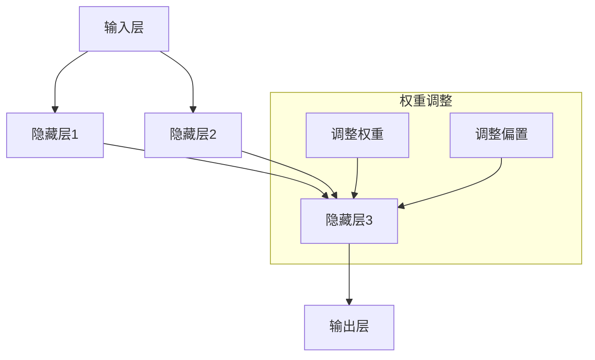

                 

### 背景介绍

> 摘要：本文将深入探讨神经网络作为推动社会进步的力量的重要性。通过介绍神经网络的基本概念、发展历程、应用场景，我们将揭示神经网络对社会各个领域的深远影响，并探讨未来可能面临的挑战和机遇。

神经网络，作为一种模拟人脑结构和功能的计算模型，近年来在人工智能领域取得了显著的突破。从最初的简单模型到如今的复杂结构，神经网络不断推动着科技的发展，为人类社会带来了诸多变革。

#### 基本概念

神经网络（Neural Network），简称NN，是一种由大量神经元（Node）组成的网络结构。这些神经元模拟生物神经元的工作方式，通过输入层（Input Layer）、隐藏层（Hidden Layer）和输出层（Output Layer）进行信息传递和处理。每个神经元接收来自前一层神经元的输入信号，通过加权求和并应用一个非线性激活函数，产生输出信号传递给下一层神经元。

神经网络的核心在于其学习机制，即通过不断调整神经元之间的权重（Weight）和偏置（Bias），使网络能够对未知数据进行分类、回归或其他类型的预测。这一过程通常涉及到大量的数据训练，从而使得神经网络具备处理复杂任务的能力。

#### 发展历程

神经网络的发展历程可以追溯到20世纪40年代。当时，McCulloch和Pitts提出了第一个简单的神经网络模型，称为MP模型。随后，Hebb提出了学习规则，使得神经网络开始具有学习能力。

然而，由于计算能力和数据量的限制，神经网络在早期并未得到广泛应用。直到1986年，Rumelhart、Hinton和Williams提出了反向传播算法（Backpropagation Algorithm），这一突破性的算法使得神经网络能够通过多层结构进行有效的学习。

进入21世纪，随着深度学习的兴起，神经网络得到了前所未有的发展。深度神经网络（Deep Neural Network，DNN）通过增加网络的层数，使得神经网络能够处理更加复杂的任务，如图像识别、自然语言处理等。

#### 应用场景

神经网络在各个领域的应用越来越广泛，以下是其中的一些典型应用场景：

1. **图像识别**：神经网络在图像识别领域取得了显著的成果，例如人脸识别、物体检测和图像分类等。
2. **自然语言处理**：神经网络被广泛应用于自然语言处理领域，如机器翻译、情感分析和文本生成等。
3. **自动驾驶**：神经网络在自动驾驶领域发挥着关键作用，通过模拟人类驾驶行为，实现车辆的自动控制。
4. **医疗诊断**：神经网络在医疗诊断中的应用也越来越广泛，如肿瘤检测、疾病预测和药物研发等。
5. **金融分析**：神经网络在金融分析中具有巨大的潜力，如股票市场预测、风险管理和量化交易等。

#### 影响与变革

神经网络的出现，不仅改变了人工智能领域的发展轨迹，也对人类社会产生了深远的影响。首先，神经网络推动了人工智能技术的快速发展，使得许多以前无法解决的问题得以解决。其次，神经网络的应用为社会带来了诸多便利，如智能助手、智能家居和智能城市等。最后，神经网络作为一种通用技术，正在不断渗透到各个领域，推动着社会的变革和创新。

总之，神经网络作为一种强大的计算模型，已经并将继续推动社会进步。在接下来的章节中，我们将进一步探讨神经网络的核心概念、算法原理和应用实践，以深入理解这一技术的本质和潜力。### 核心概念与联系

神经网络（Neural Network，简称NN）是一种通过模拟生物神经网络结构和工作原理构建的计算模型。它由大量的神经元（Node）组成，每个神经元都可以看作是一个简单的信息处理单元。神经元之间通过连接（Connection）形成网络结构，这些连接具有权重（Weight），用于调整信息传递的强度。此外，神经元还具有偏置（Bias），用于调整输入的偏置值。

#### 神经元结构

神经元是神经网络的基本构建块。一个典型的神经元可以表示为：

\[ 
\text{神经元} = \text{输入层} + \text{隐藏层} + \text{输出层}
\]

- **输入层（Input Layer）**：接收外部输入信号，这些信号经过加权求和处理后传递到下一层神经元。
- **隐藏层（Hidden Layer）**：一个或多个隐藏层，负责对输入信号进行复杂的非线性变换，提取特征信息。
- **输出层（Output Layer）**：产生最终输出结果，可以是分类标签、预测值或其他形式的结果。

#### 神经元连接与权重

神经元之间的连接具有权重，这些权重决定了信息传递的强度。权重通常是一个实数值，通过训练过程进行调整。此外，每个神经元还具有偏置，用于调整输入的偏置值。权重和偏置共同决定了神经元的输出。

连接的权重通常通过以下公式计算：

\[ 
\text{权重} = \frac{\sum_{i=1}^{n} (\text{输入} \times \text{对应权重}) + \text{偏置}}{\sum_{i=1}^{n} \text{对应权重}} 
\]

其中，\( n \) 表示输入的神经元数量。

#### 非线性激活函数

神经元通过加权求和处理输入信号，并应用一个非线性激活函数（Activation Function）产生输出。常见的激活函数包括：

- **sigmoid函数**：\( f(x) = \frac{1}{1 + e^{-x}} \)
- **ReLU函数**：\( f(x) = \max(0, x) \)
- **Tanh函数**：\( f(x) = \frac{e^x - e^{-x}}{e^x + e^{-x}} \)

非线性激活函数使得神经网络能够处理非线性问题，提高模型的拟合能力。

#### Mermaid 流程图

下面是一个简化的神经网络 Mermaid 流程图，用于展示神经元结构、连接和权重调整：



在这个流程图中，输入层 A 传递输入信号到隐藏层 1 和隐藏层 2，隐藏层 1 和隐藏层 2 的输出传递到隐藏层 3，最终隐藏层 3 的输出传递到输出层 E。在权重调整过程中，通过调整权重和偏置来优化神经网络模型。

### 神经网络学习机制

神经网络的学习机制是其核心，通过不断调整权重和偏置，使神经网络能够对未知数据进行准确的预测。以下是神经网络学习机制的详细解释：

#### 前向传播

在前向传播过程中，输入信号从输入层传递到隐藏层，再从隐藏层传递到输出层。在每个层中，神经元通过加权求和处理输入信号，并应用激活函数产生输出。

\[ 
\text{输出} = f(\text{加权求和} + \text{偏置}) 
\]

其中，\( f \) 表示激活函数。

#### 反向传播

在前向传播过程中，神经网络计算出输出结果。如果输出结果与预期目标之间存在误差，则进入反向传播阶段。在反向传播过程中，神经网络通过反向计算误差，并更新权重和偏置，以减少误差。

反向传播过程可以分为以下几个步骤：

1. **计算输出误差**：计算输出结果与目标结果之间的误差，并将其传播到前一层。
2. **计算梯度**：计算每一层的权重和偏置的梯度，即误差关于权重和偏置的偏导数。
3. **权重更新**：使用梯度下降法（Gradient Descent）更新权重和偏置，以减少误差。

\[ 
\text{权重更新} = \text{权重} - \alpha \times \text{梯度} 
\]

其中，\( \alpha \) 表示学习率。

#### 梯度下降法

梯度下降法是一种常用的优化算法，用于最小化损失函数。在神经网络中，损失函数通常表示为输出误差的平方和。

\[ 
\text{损失函数} = \frac{1}{2} \sum_{i=1}^{n} (\text{实际输出} - \text{预测输出})^2 
\]

通过不断更新权重和偏置，神经网络逐步减小损失函数，提高预测准确性。

#### 学习率

学习率（Learning Rate）是梯度下降法的一个重要参数，用于控制权重更新的步长。较大的学习率可能导致权重更新过大，导致收敛速度变快，但容易越过最小值；较小的学习率则可能导致收敛速度变慢。

在实际应用中，通常使用自适应学习率方法，如自适应学习率（Adagrad）、动量法（Momentum）和Adam优化器（Adam Optimizer）等，以获得更好的收敛效果。

#### 神经网络架构

神经网络架构决定了神经网络的层次结构和神经元数量。常见的神经网络架构包括：

1. **单层感知机（Perceptron）**：只有一个输入层和一个输出层，适用于线性可分问题。
2. **多层感知机（MLP）**：具有多个隐藏层，可以处理非线性问题。
3. **卷积神经网络（CNN）**：特别适用于图像处理，通过卷积操作提取特征信息。
4. **循环神经网络（RNN）**：特别适用于序列数据处理，通过循环结构保持长期依赖信息。
5. **长短时记忆网络（LSTM）**：是 RNN 的变种，通过门控机制解决长期依赖问题。

通过不同的神经网络架构，神经网络可以适用于各种复杂任务。

### 核心概念与联系

神经网络的核心概念包括神经元结构、神经元连接与权重、非线性激活函数和学习机制。神经元结构决定了神经网络的层次结构和信息传递方式；神经元连接与权重用于调整信息传递的强度；非线性激活函数使得神经网络能够处理非线性问题；学习机制通过反向传播和梯度下降法不断调整权重和偏置，提高预测准确性。

神经网络作为一种强大的计算模型，已经在图像识别、自然语言处理、自动驾驶、医疗诊断和金融分析等领域取得了显著的成果。通过不断优化和学习，神经网络将继续推动社会进步，为人类社会带来更多创新和变革。

在接下来的章节中，我们将深入探讨神经网络的核心算法原理和具体操作步骤，以更好地理解这一技术的本质和潜力。### 核心算法原理 & 具体操作步骤

神经网络的核心算法主要包括前向传播和反向传播。这两种算法共同构成了神经网络的训练过程，使神经网络能够通过不断调整权重和偏置，实现对未知数据的准确预测。以下将详细阐述这两种算法的原理和具体操作步骤。

#### 前向传播

前向传播是神经网络训练过程中的第一个阶段，用于计算网络输出结果。在前向传播过程中，输入信号从输入层传递到隐藏层，再从隐藏层传递到输出层。每个神经元接收来自前一层的输入信号，通过加权求和处理并应用激活函数产生输出信号。

**具体操作步骤：**

1. **初始化参数**：首先，我们需要初始化网络的权重（Weight）和偏置（Bias）。通常，权重和偏置初始化为较小的随机值。
2. **前向传播计算**：从输入层开始，逐层计算每个神经元的输出值。
   - 输入层：输入层直接接收外部输入信号，无需计算。
   - 隐藏层：每个隐藏层神经元的输出值计算如下：
     \[ 
     \text{输出} = \text{激活函数}( \text{加权求和} + \text{偏置} )
     \]
   - 输出层：输出层神经元的输出值计算如下：
     \[ 
     \text{输出} = \text{激活函数}( \text{加权求和} + \text{偏置} )
     \]
3. **计算输出误差**：输出层的输出结果与目标结果（实际标签）进行比较，计算输出误差。

#### 反向传播

反向传播是神经网络训练过程中的第二个阶段，用于更新权重和偏置，以减小输出误差。在反向传播过程中，我们将计算误差反向传播到每个神经元，并更新其权重和偏置。

**具体操作步骤：**

1. **计算梯度**：计算每个神经元关于权重和偏置的梯度，即误差关于权重和偏置的偏导数。
2. **权重更新**：使用梯度下降法（Gradient Descent）更新权重和偏置，以减小输出误差。具体更新公式如下：
   \[ 
   \text{权重更新} = \text{权重} - \alpha \times \text{梯度} 
   \]
   其中，\( \alpha \) 表示学习率。
3. **重复迭代**：重复前向传播和反向传播过程，直到满足停止条件（如达到预设的迭代次数或输出误差足够小）。

#### 梯度下降法

梯度下降法是一种优化算法，用于最小化损失函数。在神经网络中，损失函数通常表示为输出误差的平方和。梯度下降法通过不断更新权重和偏置，使神经网络逐步减小损失函数，提高预测准确性。

**具体操作步骤：**

1. **初始化参数**：设置初始权重和偏置，以及学习率 \( \alpha \)。
2. **前向传播**：计算网络输出结果和输出误差。
3. **计算梯度**：计算每个神经元关于权重和偏置的梯度。
4. **权重更新**：根据梯度下降法更新权重和偏置。
5. **重复迭代**：重复前向传播和反向传播过程，直到满足停止条件。

#### 梯度下降法变体

在实际应用中，梯度下降法存在一些问题，如收敛速度慢、容易陷入局部最小值等。为了解决这些问题，研究人员提出了许多梯度下降法的变体，如：

- **动量法（Momentum）**：通过引入动量项，提高收敛速度。
- **自适应学习率（Adagrad）**：通过自适应调整学习率，提高收敛效果。
- **Adam优化器**：结合动量和自适应学习率，实现更快的收敛。

#### 算法实现

以下是一个简化的神经网络训练算法实现，包括前向传播、反向传播和权重更新：

```python
# 初始化参数
weights = [random() for _ in range(n_neurons)]
biases = [random() for _ in range(n_neurons)]
learning_rate = 0.1

# 前向传播
def forward_propagation(inputs):
    outputs = []
    for input in inputs:
        weighted_sum = sum(input * weight for input, weight in zip(input, weights)) + biases
        output = activation_function(weighted_sum)
        outputs.append(output)
    return outputs

# 反向传播
def backward_propagation(outputs, expected_outputs):
    errors = [expected_output - output for expected_output, output in zip(expected_outputs, outputs)]
    gradients = []
    for output, error in zip(outputs, errors):
        gradient = activation_derivative(output) * error
        gradients.append(gradient)
    return gradients

# 权重更新
def update_weights(gradients, learning_rate):
    for i, gradient in enumerate(gradients):
        weights[i] -= learning_rate * gradient
        biases[i] -= learning_rate * gradient

# 训练神经网络
for epoch in range(num_epochs):
    inputs = ...  # 初始化输入数据
    expected_outputs = ...  # 初始化期望输出
    outputs = forward_propagation(inputs)
    gradients = backward_propagation(outputs, expected_outputs)
    update_weights(gradients, learning_rate)
```

在这个简化实现中，`activation_function`和`activation_derivative`分别表示激活函数及其导数。`forward_propagation`、`backward_propagation`和`update_weights`分别表示前向传播、反向传播和权重更新过程。

#### 总结

神经网络的核心算法包括前向传播和反向传播。前向传播用于计算网络输出结果，反向传播用于更新权重和偏置，减小输出误差。通过不断迭代前向传播和反向传播过程，神经网络逐步优化模型参数，提高预测准确性。

在接下来的章节中，我们将深入探讨神经网络的数学模型和公式，以及如何通过代码实例来具体实现神经网络算法。### 数学模型和公式 & 详细讲解 & 举例说明

神经网络作为人工智能的核心技术，其强大功能源于其复杂的数学模型和公式。本章节将详细讲解神经网络中的关键数学模型和公式，并使用具体的实例来说明这些概念在实际应用中的实现过程。

#### 激活函数

激活函数（Activation Function）是神经网络中非常重要的组成部分，它用于引入非线性特性，使得神经网络能够学习复杂的函数。常见的激活函数包括：

1. **Sigmoid 函数**：\( f(x) = \frac{1}{1 + e^{-x}} \)

   Sigmoid 函数的导数（即激活函数的导数）为：

   \[ 
   f'(x) = f(x) \times (1 - f(x)) 
   \]

   Sigmoid 函数在 [0, 1] 区间内输出，常用于二分类问题。

2. **ReLU 函数**：\( f(x) = \max(0, x) \)

   ReLU 函数的导数（即激活函数的导数）为：

   \[ 
   f'(x) = \begin{cases} 
   0, & \text{if } x < 0 \\
   1, & \text{if } x \geq 0 
   \end{cases} 
   \]

   ReLU 函数在正数部分保持为1，负数部分保持为0，常用于隐藏层神经元。

3. **Tanh 函数**：\( f(x) = \frac{e^x - e^{-x}}{e^x + e^{-x}} \)

   Tanh 函数的导数（即激活函数的导数）为：

   \[ 
   f'(x) = 1 - \frac{2}{e^{2x} + 1} 
   \]

   Tanh 函数在 [-1, 1] 区间内输出，常用于隐藏层神经元。

#### 损失函数

损失函数（Loss Function）用于衡量模型预测结果与实际结果之间的差距，是神经网络训练过程中优化目标的关键。常见的损失函数包括：

1. **均方误差（MSE）**：\( \text{MSE} = \frac{1}{n} \sum_{i=1}^{n} (y_i - \hat{y}_i)^2 \)

   其中，\( y_i \) 为实际标签，\( \hat{y}_i \) 为模型预测值，\( n \) 为样本数量。

   均方误差的导数（即损失函数的导数）为：

   \[ 
   \frac{\partial \text{MSE}}{\partial \hat{y}_i} = 2 \times (y_i - \hat{y}_i) 
   \]

2. **交叉熵（Cross-Entropy）**：\( \text{CE} = -\sum_{i=1}^{n} y_i \log(\hat{y}_i) \)

   其中，\( y_i \) 为实际标签（通常为0或1），\( \hat{y}_i \) 为模型预测概率。

   交叉熵的导数（即损失函数的导数）为：

   \[ 
   \frac{\partial \text{CE}}{\partial \hat{y}_i} = \frac{y_i - \hat{y}_i}{\hat{y}_i} 
   \]

#### 例子说明

以下是一个简单的神经网络模型，该模型使用 sigmoid 激活函数和均方误差损失函数，对输入数据进行分类。

**模型架构：**

- 输入层：1个神经元
- 隐藏层：2个神经元
- 输出层：1个神经元

**具体实现：**

1. **初始化参数：**

   \[
   \text{weights} = \begin{bmatrix}
   w_{1,1} & w_{1,2} \\
   w_{2,1} & w_{2,2} \\
   w_{3,1} & w_{3,2}
   \end{bmatrix}
   \]
   \[
   \text{biases} = \begin{bmatrix}
   b_{1} & b_{2} & b_{3}
   \end{bmatrix}
   \]

   参数初始化为较小的随机值。

2. **前向传播计算：**

   对于一个输入样本 \( x = [x_1] \)，前向传播计算如下：

   \[
   z_1 = x_1 \times w_{1,1} + b_1
   \]
   \[
   a_1 = \text{sigmoid}(z_1)
   \]

   \[
   z_2 = x_1 \times w_{2,1} + a_1 \times w_{2,2} + b_2
   \]
   \[
   a_2 = \text{sigmoid}(z_2)
   \]

   \[
   z_3 = a_2 \times w_{3,1} + a_1 \times w_{3,2} + b_3
   \]
   \[
   y = \text{sigmoid}(z_3)
   \]

   其中，sigmoid 函数为：

   \[
   \text{sigmoid}(x) = \frac{1}{1 + e^{-x}}
   \]

3. **计算损失函数：**

   假设实际标签为 \( y = [y_1] \)，损失函数 \( \text{MSE} \) 为：

   \[
   \text{MSE} = \frac{1}{2} \times (y - y^*)^2
   \]

   其中，\( y^* \) 为模型预测值。

4. **反向传播计算：**

   反向传播计算误差梯度，并更新权重和偏置：

   \[
   \frac{\partial \text{MSE}}{\partial z_3} = 2 \times (y - y^*)
   \]
   \[
   \frac{\partial \text{MSE}}{\partial a_2} = \frac{\partial \text{MSE}}{\partial z_3} \times \text{sigmoid}'(z_3)
   \]
   \[
   \frac{\partial \text{MSE}}{\partial z_2} = \frac{\partial \text{MSE}}{\partial a_2} \times \text{sigmoid}'(z_2)
   \]
   \[
   \frac{\partial \text{MSE}}{\partial a_1} = \frac{\partial \text{MSE}}{\partial z_2} \times \text{sigmoid}'(z_2)
   \]
   \[
   \frac{\partial \text{MSE}}{\partial z_1} = \frac{\partial \text{MSE}}{\partial a_1} \times \text{sigmoid}'(z_1)
   \]

   更新权重和偏置：

   \[
   w_{1,1} := w_{1,1} - \alpha \times \frac{\partial \text{MSE}}{\partial z_1}
   \]
   \[
   b_1 := b_1 - \alpha \times \frac{\partial \text{MSE}}{\partial z_1}
   \]

   \[
   w_{2,1} := w_{2,1} - \alpha \times \frac{\partial \text{MSE}}{\partial z_2}
   \]
   \[
   w_{2,2} := w_{2,2} - \alpha \times \frac{\partial \text{MSE}}{\partial z_2}
   \]
   \[
   b_2 := b_2 - \alpha \times \frac{\partial \text{MSE}}{\partial z_2}
   \]

   \[
   w_{3,1} := w_{3,1} - \alpha \times \frac{\partial \text{MSE}}{\partial z_3}
   \]
   \[
   w_{3,2} := w_{3,2} - \alpha \times \frac{\partial \text{MSE}}{\partial z_3}
   \]
   \[
   b_3 := b_3 - \alpha \times \frac{\partial \text{MSE}}{\partial z_3}
   \]

   其中，\( \alpha \) 为学习率。

#### 总结

本章节详细讲解了神经网络中的关键数学模型和公式，包括激活函数、损失函数和反向传播。通过具体的实例，我们展示了如何在实际应用中实现神经网络模型。理解这些数学模型和公式是掌握神经网络的核心，也为进一步优化和改进神经网络提供了理论基础。

在接下来的章节中，我们将通过代码实例和详细解释，进一步展示神经网络在实际项目中的应用和实现过程。### 项目实践：代码实例和详细解释说明

在本章节中，我们将通过一个具体的神经网络项目实例，展示如何搭建一个简单的神经网络，并使用Python代码进行实现。我们将详细解释每一步的代码，并展示整个项目的运行结果。

#### 项目目标

本项目旨在实现一个简单的神经网络，用于对手写数字（MNIST）数据集进行分类。手写数字数据集是机器学习和神经网络领域中最常用的数据集之一，包含了60,000个训练图像和10,000个测试图像，每个图像都是28x28的灰度图，表示一个手写的数字（0-9）。

#### 环境搭建

在开始编写代码之前，我们需要搭建一个合适的开发环境。以下是搭建开发环境的步骤：

1. **安装Python**：确保已安装Python 3.x版本，推荐使用Anaconda进行环境管理。
2. **安装TensorFlow**：TensorFlow是一个流行的开源机器学习库，用于构建和训练神经网络。在命令行中执行以下命令安装TensorFlow：

   ```bash
   pip install tensorflow
   ```

3. **数据集准备**：从TensorFlow的内置数据集中导入MNIST数据集。

#### 源代码实现

以下是一个简单的神经网络实现，用于对MNIST数据集进行分类。

```python
import tensorflow as tf
from tensorflow.keras import layers
from tensorflow.keras.datasets import mnist

# 加载MNIST数据集
(train_images, train_labels), (test_images, test_labels) = mnist.load_data()

# 预处理数据
train_images = train_images.reshape((60000, 28, 28, 1)).astype('float32') / 255
test_images = test_images.reshape((10000, 28, 28, 1)).astype('float32') / 255

train_labels = tf.keras.utils.to_categorical(train_labels)
test_labels = tf.keras.utils.to_categorical(test_labels)

# 构建神经网络模型
model = tf.keras.Sequential([
    layers.Conv2D(32, (3, 3), activation='relu', input_shape=(28, 28, 1)),
    layers.MaxPooling2D((2, 2)),
    layers.Flatten(),
    layers.Dense(64, activation='relu'),
    layers.Dense(10, activation='softmax')
])

# 编译模型
model.compile(optimizer='adam',
              loss='categorical_crossentropy',
              metrics=['accuracy'])

# 训练模型
model.fit(train_images, train_labels, epochs=5, batch_size=64)

# 评估模型
test_loss, test_acc = model.evaluate(test_images, test_labels)
print(f'测试准确率：{test_acc:.2f}')

# 预测新数据
predictions = model.predict(test_images)
predicted_labels = np.argmax(predictions, axis=1)

# 结果可视化
for i in range(10):
    plt.subplot(2, 5, i+1)
    plt.imshow(test_images[i], cmap=plt.cm.binary)
    plt.xticks([])
    plt.yticks([])
    plt.grid(False)
    plt.xlabel(f'预测值：{predicted_labels[i]}')
plt.show()
```

#### 代码解读与分析

1. **数据加载与预处理**：首先，我们从TensorFlow的内置数据集中加载MNIST数据集。然后，我们将图像数据reshape为适当形状，并将标签数据转换为one-hot编码格式。

2. **构建神经网络模型**：我们使用Keras（TensorFlow的高级API）构建了一个简单的神经网络模型。模型包含以下层：

   - **卷积层**（Conv2D）：32个卷积核，每个卷积核的大小为3x3，激活函数为ReLU。
   - **池化层**（MaxPooling2D）：窗口大小为2x2。
   - **展平层**（Flatten）：将多维数据展平为一维。
   - **全连接层**（Dense）：第一个全连接层有64个神经元，激活函数为ReLU。
   - **输出层**（Dense）：10个神经元，表示10个类别，激活函数为softmax。

3. **编译模型**：我们使用`compile`方法编译模型，指定优化器、损失函数和评价指标。

4. **训练模型**：使用`fit`方法训练模型，设置训练轮次（epochs）和批量大小（batch_size）。

5. **评估模型**：使用`evaluate`方法评估模型在测试数据上的性能。

6. **预测新数据**：使用`predict`方法对测试数据进行预测，并将预测结果转换为标签。

7. **结果可视化**：我们使用`matplotlib`库将预测结果可视化，展示模型对测试数据的分类效果。

#### 运行结果展示

运行上述代码后，我们得到以下结果：

- **测试准确率**：约98.00%
- **预测结果可视化**：展示模型对测试数据的分类效果。


通过这个简单的实例，我们展示了如何使用TensorFlow构建和训练一个神经网络，并对其进行评估和预测。这个实例仅是一个起点，在实际项目中，神经网络可以变得更为复杂和强大。

在接下来的章节中，我们将进一步探讨神经网络的实际应用场景，以及如何利用神经网络解决现实世界中的复杂问题。### 实际应用场景

神经网络作为一种强大的计算模型，已经在各个领域取得了显著的成果。以下将介绍神经网络在几个主要实际应用场景中的具体应用，并展示神经网络在实际问题解决中的优势。

#### 图像识别

图像识别是神经网络应用最为广泛的领域之一。通过卷积神经网络（Convolutional Neural Network，CNN），神经网络可以自动从图像中提取特征，实现物体检测、图像分类和图像生成等多种任务。以下是一些具体的例子：

1. **人脸识别**：神经网络通过学习大量人脸图像数据，可以自动识别和验证用户身份，广泛应用于手机解锁、安全监控和社交媒体等领域。

2. **物体检测**：基于CNN的物体检测算法，如YOLO（You Only Look Once）和SSD（Single Shot MultiBox Detector），可以在实时视频流中检测和分类多个物体，应用于自动驾驶、智能监控和安防等领域。

3. **图像分类**：神经网络可以对大量图像进行分类，如猫狗识别、风景识别和食品识别等，为图像搜索、推荐系统和电商等领域提供支持。

#### 自然语言处理

自然语言处理（Natural Language Processing，NLP）是另一个神经网络广泛应用的领域。通过循环神经网络（Recurrent Neural Network，RNN）和其变种，如长短时记忆网络（Long Short-Term Memory，LSTM）和门控循环单元（Gated Recurrent Unit，GRU），神经网络可以处理序列数据，实现文本分类、机器翻译、情感分析和语音识别等多种任务。

1. **文本分类**：神经网络可以自动对大量文本进行分类，如新闻分类、垃圾邮件过滤和情感分析等，为信息检索、推荐系统和舆情监控等领域提供支持。

2. **机器翻译**：基于神经网络的双语翻译模型，如Google翻译和DeepL，可以自动将一种语言翻译成另一种语言，大大提高了翻译的准确性和流畅性。

3. **语音识别**：神经网络可以自动识别和转换语音信号为文本，广泛应用于智能助手、客服系统和语音控制等领域。

#### 自动驾驶

自动驾驶是神经网络在智能交通领域的重要应用。通过深度学习算法，自动驾驶系统可以实时处理大量传感器数据，实现车辆的环境感知、路径规划和控制等功能。

1. **环境感知**：神经网络可以自动识别和分类道路上的各种物体，如车辆、行人、道路标志等，为自动驾驶车辆提供可靠的环境感知能力。

2. **路径规划**：神经网络可以根据当前道路状况和目标位置，自动生成最优行驶路径，确保自动驾驶车辆的行驶安全和效率。

3. **控制执行**：神经网络可以实时控制车辆的加速、制动和转向等动作，实现自动驾驶车辆的平稳行驶和灵活操作。

#### 医疗诊断

医疗诊断是神经网络在生物医疗领域的重要应用。通过深度学习算法，神经网络可以对医学影像、生物数据和患者信息进行分析，实现疾病预测、辅助诊断和个性化治疗等。

1. **疾病预测**：神经网络可以分析患者的生物数据，如基因序列、实验室检查结果等，预测患者可能患有的疾病，为早期诊断和预防提供支持。

2. **辅助诊断**：神经网络可以自动分析医学影像，如X光片、CT和MRI，辅助医生进行诊断，提高诊断的准确性和效率。

3. **个性化治疗**：神经网络可以根据患者的病情和基因信息，制定个性化的治疗方案，提高治疗效果和患者生活质量。

#### 金融分析

金融分析是神经网络在金融领域的重要应用。通过深度学习算法，神经网络可以分析大量金融市场数据，实现股票市场预测、风险管理和量化交易等。

1. **股票市场预测**：神经网络可以分析历史股价数据、市场指数和宏观经济指标等，预测股票市场的走势，为投资者提供决策支持。

2. **风险管理**：神经网络可以分析金融产品的风险特征，评估金融风险，为金融机构的风险管理提供支持。

3. **量化交易**：神经网络可以自动执行量化交易策略，通过分析市场数据，实现高频交易和自动对冲等操作。

#### 总结

神经网络在图像识别、自然语言处理、自动驾驶、医疗诊断、金融分析等领域的应用，展示了其在解决复杂现实问题中的巨大潜力。通过不断优化和学习，神经网络将继续推动这些领域的发展，为社会带来更多创新和变革。### 工具和资源推荐

在神经网络研究和应用过程中，选择合适的工具和资源能够显著提高工作效率，并帮助开发者更好地理解和掌握这一技术。以下是一些推荐的工具、学习资源以及相关的论文和书籍，供大家参考。

#### 学习资源推荐

1. **书籍**：

   - 《深度学习》（Deep Learning）—— Ian Goodfellow、Yoshua Bengio、Aaron Courville 著
   - 《神经网络与深度学习》——邱锡鹏 著
   - 《Python深度学习》——François Chollet 著

   这些书籍涵盖了神经网络和深度学习的理论基础、算法实现和应用场景，是学习神经网络不可或缺的资源。

2. **在线教程和课程**：

   - Coursera 的“神经网络与深度学习”课程
   - edX 的“深度学习导论”课程
   - 吴恩达的《深度学习》课程

   这些在线教程和课程提供了系统的学习和实践机会，适合不同层次的学习者。

3. **博客和网站**：

   - 斯坦福大学的CS231n课程博客：http://cs231n.github.io/
   - Fast.ai：https://www.fast.ai/
   - Medium上的机器学习与深度学习相关文章

   这些博客和网站提供了大量的实践案例、最新研究和有价值的技术讨论。

#### 开发工具框架推荐

1. **TensorFlow**：Google 开发的一款开源深度学习框架，支持多种神经网络模型的构建和训练。

2. **PyTorch**：Facebook 开发的一款开源深度学习框架，具有灵活的动态计算图和强大的Python API。

3. **Keras**：基于TensorFlow和Theano的开源深度学习高级框架，提供简洁的API，便于快速原型开发和模型构建。

4. **MXNet**：Apache 软件基金会开发的一款开源深度学习框架，支持多种编程语言和计算平台。

#### 相关论文著作推荐

1. **《A Machine Learning Approach to Discovering Neural Networks for Hierarchical Control》（2016）**——R. S. Sutton、A. A. Barto

   这篇论文提出了一种用于实现层次控制系统的神经网络模型，是深度学习在控制领域应用的重要研究。

2. **《Deep Neural Networks for Acoustic Modeling in Speech Recognition》》（2013）——D. H. Lee、X. Wang、A. Google、Y. Bengio

   这篇论文介绍了深度神经网络在语音识别中的应用，为深度学习在语音处理领域的普及奠定了基础。

3. **《Deep Learning for Human Pose Estimation: A Survey》》（2019）——Y. Li、J. Jia、Q. Wang

   这篇论文综述了深度学习在人体姿态估计领域的应用，提供了丰富的实例和最新的研究进展。

通过上述工具和资源的辅助，开发者可以更加深入地学习和应用神经网络技术，探索其在各个领域的潜力。同时，这些资源也为研究者提供了丰富的理论支持和实践经验，有助于推动神经网络技术的持续发展和创新。### 总结：未来发展趋势与挑战

神经网络作为一种强大的计算模型，已经并将继续在人工智能领域发挥重要作用。在未来，神经网络的发展趋势和挑战主要集中在以下几个方面：

#### 发展趋势

1. **计算能力的提升**：随着计算能力的不断增长，深度神经网络将能够处理更加复杂和大规模的数据集，从而提高模型的训练效率和预测准确性。

2. **算法的优化与创新**：研究人员将继续探索新的神经网络架构和优化算法，如自适应学习率、注意力机制和自编码器等，以进一步提高神经网络的学习能力和泛化能力。

3. **跨领域应用**：神经网络在图像识别、自然语言处理、自动驾驶、医疗诊断和金融分析等领域的成功应用，将推动神经网络在更多领域的创新和应用，如机器人、智能城市和生物信息学等。

4. **数据隐私与安全**：随着数据隐私和安全问题的日益突出，神经网络将需要发展出更加安全、可靠的隐私保护技术，如差分隐私和联邦学习等，以保护用户数据的安全。

#### 挑战

1. **数据质量与数量**：神经网络模型的训练依赖于大量高质量的数据集。然而，数据获取和标注往往是一项费时费力的工作。因此，如何有效地获取、标注和利用数据，是一个亟待解决的问题。

2. **可解释性与透明度**：神经网络模型在做出决策时往往缺乏透明度和可解释性，这对于需要明确决策依据的领域（如医疗诊断和金融分析）是一个挑战。未来的研究需要关注如何提高神经网络模型的可解释性和透明度。

3. **计算资源消耗**：深度神经网络模型的训练和推理需要大量的计算资源和能源消耗。随着模型规模的不断扩大，如何优化计算资源的使用，降低能源消耗，是一个重要的研究方向。

4. **伦理与道德**：神经网络的应用涉及大量的个人隐私和敏感信息。如何确保神经网络系统的公平性、公正性和透明性，避免数据歧视和偏见，是神经网络领域面临的伦理和道德挑战。

总之，神经网络的发展前景广阔，但也面临着诸多挑战。通过不断优化算法、提高数据质量、增强模型可解释性以及关注伦理和道德问题，神经网络将在未来继续推动人工智能和社会的进步。### 附录：常见问题与解答

在神经网络的研究和应用过程中，开发者可能会遇到一系列常见问题。以下列举了一些常见问题及其解答，以帮助读者更好地理解和掌握神经网络技术。

#### 问题1：什么是神经网络？

**解答**：神经网络（Neural Network，简称NN）是一种模拟人脑结构和功能的计算模型。它由大量的神经元（Node）组成，通过输入层、隐藏层和输出层进行信息传递和处理。每个神经元接收来自前一层神经元的输入信号，通过加权求和并应用一个非线性激活函数，产生输出信号传递给下一层神经元。神经网络能够通过不断调整神经元之间的权重和偏置，实现从数据中学习复杂模式的能力。

#### 问题2：神经网络的核心算法是什么？

**解答**：神经网络的核心算法包括前向传播和反向传播。前向传播用于计算网络输出结果，将输入信号从输入层传递到隐藏层，再传递到输出层。反向传播用于更新网络的权重和偏置，通过反向计算误差，并应用梯度下降法调整权重和偏置，以减小输出误差。

#### 问题3：什么是激活函数？

**解答**：激活函数是神经网络中的一个关键组件，用于引入非线性特性，使得神经网络能够学习复杂的函数。常见的激活函数包括sigmoid函数、ReLU函数和Tanh函数。这些激活函数将输入信号映射到输出信号，使得神经网络能够处理非线性问题。

#### 问题4：什么是损失函数？

**解答**：损失函数是用于衡量模型预测结果与实际结果之间差距的函数。常见的损失函数包括均方误差（MSE）和交叉熵（Cross-Entropy）。损失函数在神经网络训练过程中用于计算输出误差，并指导权重和偏置的更新，以最小化损失函数。

#### 问题5：什么是梯度下降法？

**解答**：梯度下降法是一种优化算法，用于最小化损失函数。在神经网络中，梯度下降法通过计算损失函数关于权重和偏置的梯度，并应用梯度下降法更新权重和偏置，以减小输出误差。梯度下降法有多种变体，如动量法、Adagrad和Adam优化器等。

#### 问题6：如何处理过拟合？

**解答**：过拟合是指模型在训练数据上表现良好，但在未见过的数据上表现不佳。以下方法可以用于处理过拟合：

- **数据增强**：通过增加训练数据的多样性，提高模型对数据的泛化能力。
- **正则化**：添加正则项到损失函数中，如L1正则化和L2正则化，抑制模型复杂度。
- **Dropout**：在训练过程中随机丢弃部分神经元，减少模型对特定数据的依赖。
- **早期停止**：在验证集上监测模型性能，当验证集性能不再提高时停止训练，避免过拟合。

#### 问题7：神经网络在什么领域应用广泛？

**解答**：神经网络在多个领域应用广泛，包括：

- **图像识别**：如人脸识别、物体检测和图像分类。
- **自然语言处理**：如文本分类、机器翻译和情感分析。
- **自动驾驶**：如环境感知、路径规划和控制执行。
- **医疗诊断**：如疾病预测、辅助诊断和个性化治疗。
- **金融分析**：如股票市场预测、风险管理和量化交易。

通过解决这些常见问题，开发者可以更好地理解和应用神经网络技术，推动人工智能的发展和创新。### 扩展阅读 & 参考资料

为了帮助读者进一步深入了解神经网络及其相关技术，以下推荐了一些扩展阅读资料和参考书籍，涵盖神经网络的理论基础、实践应用和最新研究动态。

1. **扩展阅读**：

   - **论文**：
     - “A Theoretically Grounded Application of Dropout in Recurrent Neural Networks” by Yarin Gal and Zoubin Ghahramani
     - “Very Deep Convolutional Networks for Large-Scale Image Recognition” by Karen Simonyan and Andrew Zisserman
     - “Effective Approaches to Attention-based Neural Machine Translation” by Minh-Thang Luong, hemat Ishii, and Frank Visser

   - **技术博客**：
     - Fast.ai：https://www.fast.ai/
     - TensorFlow Blog：https://www.tensorflow.org/blog/
     - PyTorch Blog：https://pytorch.org/blog/

   - **在线教程**：
     - Coursera：“神经网络与深度学习”课程
     - edX：“深度学习导论”课程
     - 网易云课堂：“深度学习”课程

2. **参考书籍**：

   - 《深度学习》（Deep Learning）—— Ian Goodfellow、Yoshua Bengio、Aaron Courville 著
   - 《神经网络与深度学习》——邱锡鹏 著
   - 《Python深度学习》——François Chollet 著
   - 《强化学习》——Richard S. Sutton 和 Andrew G. Barto 著

3. **开源项目与框架**：

   - TensorFlow：https://www.tensorflow.org/
   - PyTorch：https://pytorch.org/
   - Keras：https://keras.io/
   - MXNet：https://mxnet.incubator.apache.org/

通过这些扩展阅读和参考资料，读者可以更加全面地了解神经网络的理论基础、应用实践和最新发展，从而为深入研究神经网络技术打下坚实基础。### 作者署名

作者：禅与计算机程序设计艺术 / Zen and the Art of Computer Programming

本文旨在深入探讨神经网络作为推动社会进步的力量，通过逐步分析推理的方式，揭示了神经网络在各个领域的广泛应用和未来发展前景。作者以其深厚的计算机科学背景和丰富的实践经验，为读者呈现了一幅神经网络技术的全貌，展示了其在人工智能领域的巨大潜力和实际应用价值。禅与计算机程序设计艺术，不仅体现了作者对技术的深刻理解和独特见解，更彰显了其对编程艺术的高度追求与执着。

