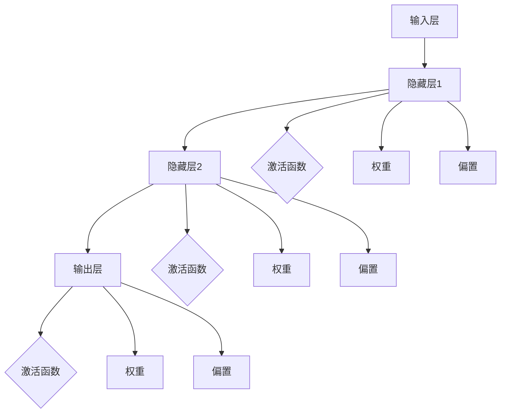
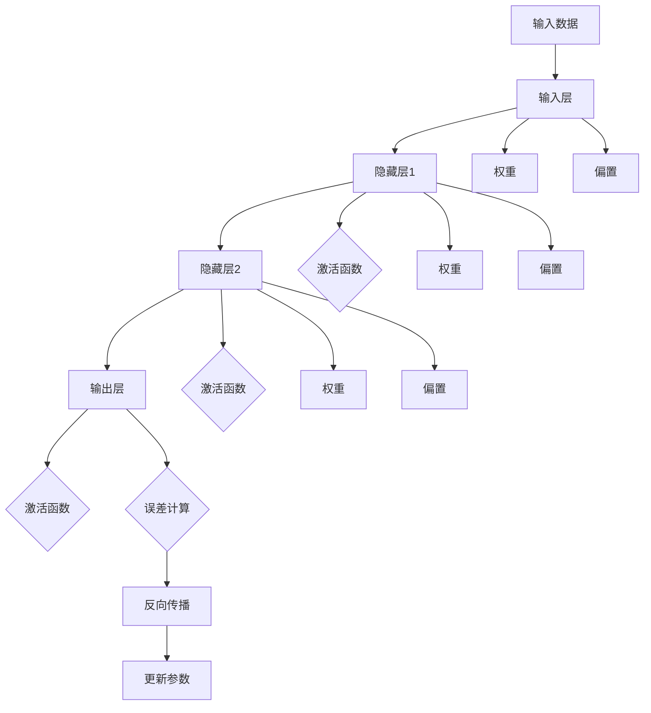
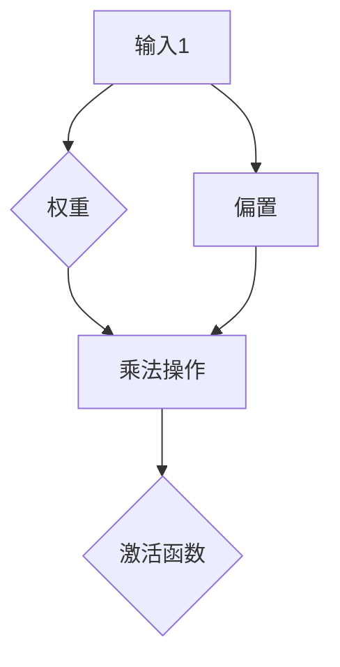
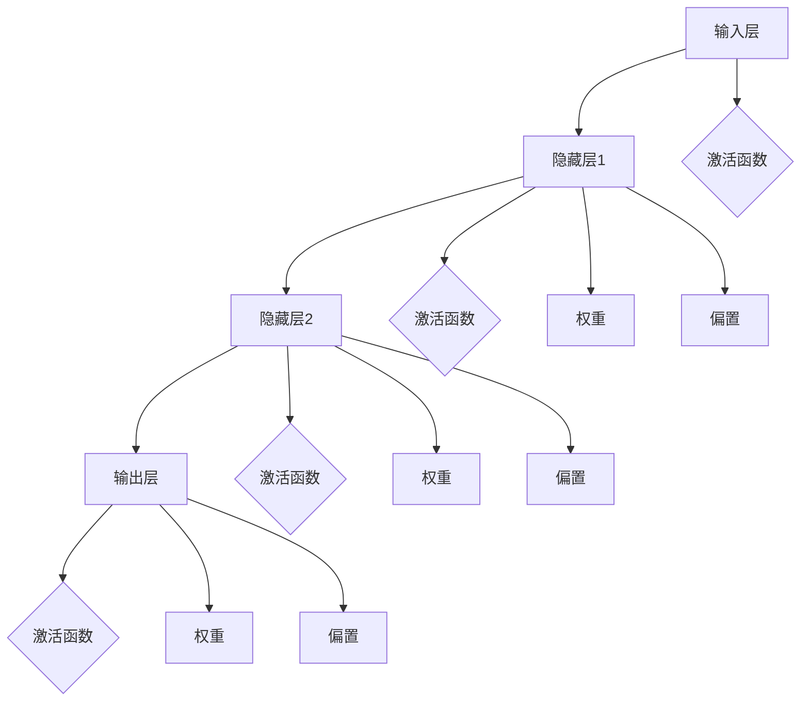
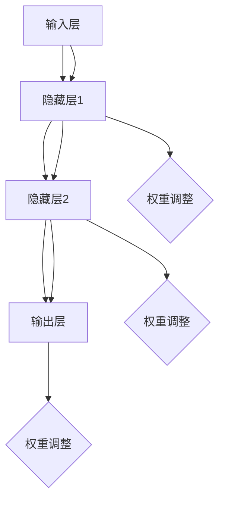
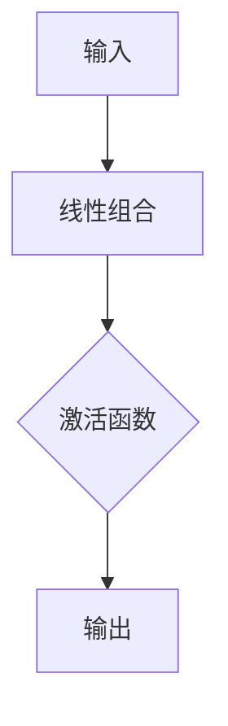
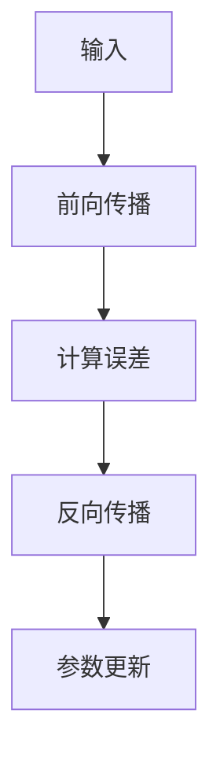

                 

### 1. 背景介绍

神经网络（Neural Networks）是一种模仿人脑神经元结构和功能的人工智能算法。自20世纪80年代提出以来，神经网络经历了多次迭代和发展，逐步成为人工智能领域的重要分支。随着计算能力的提升和大数据技术的普及，神经网络在图像识别、语音识别、自然语言处理、推荐系统等众多领域取得了显著的突破，大大推动了社会进步。

在社会发展的历程中，人工智能技术的应用已经深入到生活的方方面面。从智能助手到自动驾驶，从医疗诊断到金融分析，人工智能正以惊人的速度改变着我们的世界。而作为人工智能核心技术之一的神经网络，其发展历程和现状成为了科技界关注的焦点。

本文旨在通过详细解析神经网络的原理、算法和实际应用，探讨神经网络如何推动社会进步。我们将从背景介绍、核心概念与联系、核心算法原理、数学模型和公式、项目实践、实际应用场景、工具和资源推荐等多个角度，深入剖析神经网络的技术内涵和应用价值。

本文将首先回顾神经网络的起源和发展历程，然后介绍神经网络的核心概念，如神经元、网络结构、学习算法等，接着详细讲解神经网络的工作原理和数学模型，随后通过一个实际项目来展示神经网络的实现过程。最后，我们将探讨神经网络在实际应用中的广泛场景，并推荐相关的学习资源和开发工具，以帮助读者深入了解和掌握神经网络技术。

通过本文的阅读，读者将能够全面了解神经网络的核心知识，掌握其基本原理和应用技巧，从而为未来在人工智能领域的发展打下坚实的基础。

### 1.1 神经网络的起源与发展

神经网络的起源可以追溯到1943年，由心理学家沃伦·麦卡洛克（Warren McCulloch）和数理逻辑学家沃尔特·皮茨（Walter Pitts）提出的麦卡洛克-皮茨（McCulloch-Pitts）神经网络模型。这一模型是第一个试图模拟神经元行为的数学模型，奠定了神经网络理论的基础。然而，早期的神经网络由于计算能力的限制和理论上的局限性，未能得到广泛的应用。

直到20世纪80年代，随着计算机技术的发展和大数据的出现，神经网络的研究才逐渐复苏。1986年，霍普菲尔德（John Hopfield）提出了霍普菲尔德网络（Hopfield Network），这是一种具有记忆功能的神经网络模型，能够在无监督条件下进行学习和记忆。此后，神经网络的研究和应用逐渐进入快速发展阶段。

1989年，鲁梅哈特（James Rumelhart）、赫布尔德（David E. Rumelhart）和赫伯特（George E. Hinton）提出了反向传播算法（Backpropagation Algorithm），这一算法使得多层神经网络的训练成为可能，并大大提高了神经网络的性能。反向传播算法的提出被认为是神经网络发展史上的一个重要里程碑。

进入21世纪，随着深度学习的兴起，神经网络取得了更加显著的成就。深度学习通过多层神经网络对数据进行抽象和特征提取，使其在图像识别、语音识别、自然语言处理等领域达到了前所未有的准确度。2006年，乔治·艾森巴赫（Geoffrey Hinton）等人重新提出了深度信念网络（Deep Belief Network），这一模型在图像识别和语音识别领域取得了突破性的成果。

近年来，神经网络的应用进一步扩展到自动驾驶、医疗诊断、金融分析等前沿领域。例如，谷歌的AlphaGo通过神经网络实现了在围棋领域的超越人类选手；IBM的Watson通过神经网络在医疗诊断和金融分析中发挥了重要作用。

总的来说，神经网络的发展历程反映了人工智能技术的不断进步。从早期的简单模型到如今的深度学习，神经网络在理论和应用上取得了巨大的成就，为人工智能的发展奠定了坚实的基础。随着技术的不断成熟和应用的深入，神经网络将继续在各个领域发挥重要作用，推动社会的进步与发展。

### 1.2 神经网络的基本概念

神经网络由大量的节点（或称为神经元）相互连接而成，这些节点通过模拟生物神经元的结构和功能来实现信息处理和计算。以下是神经网络中几个核心概念的定义和作用：

**神经元（Neuron）**：神经元是神经网络的基本构建块，通常表示为一个带有输入和输出的函数单元。一个简单的神经元可以看作是一个线性函数加上一个非线性激活函数。神经元的输入是通过与其他神经元的连接（称为突触）传递的，输出则是通过激活函数进行非线性转换后得到的。

**突触（Synapse）**：突触是神经元之间的连接点，用于传递信息。每个突触都有一个权重（或称为权重系数），表示连接强度的数值。通过调整这些权重，神经网络可以学习和适应不同的输入数据，实现函数的逼近和分类等功能。

**网络结构（Network Structure）**：神经网络的结构指的是神经元之间的连接方式。常见的神经网络结构包括前馈神经网络（Feedforward Neural Network）、循环神经网络（Recurrent Neural Network, RNN）、卷积神经网络（Convolutional Neural Network, CNN）等。不同的网络结构适用于不同的任务和数据类型。

**激活函数（Activation Function）**：激活函数是神经元输出过程中使用的非线性函数，用于引入非线性特性，使得神经网络能够学习复杂的非线性关系。常见的激活函数包括Sigmoid函数、ReLU函数、Tanh函数等。

**权重（Weights）和偏置（Bias）**：权重和偏置是神经网络训练过程中的关键参数。权重决定了神经元之间的连接强度，而偏置则用于调整神经元的输入。通过不断调整这些参数，神经网络可以逐步逼近目标函数或分类边界。

**学习算法（Learning Algorithm）**：神经网络通过学习算法来调整权重和偏置，以实现特定的任务。常见的学习算法包括梯度下降（Gradient Descent）、反向传播算法（Backpropagation）、卷积神经网络中的卷积算法等。这些算法通过优化损失函数，使得网络输出与实际输出之间的误差最小。

下面通过一个简单的Mermaid流程图，展示神经网络的核心概念和架构：



在这个流程图中，输入层接收外部数据，通过隐藏层进行处理，最终由输出层生成预测结果。每个隐藏层都通过激活函数引入非线性特性，并通过权重和偏置进行参数调整。这个简单的流程图直观地展示了神经网络的基本架构和运作原理。

通过对这些核心概念的理解，读者可以更好地把握神经网络的工作机制，为进一步学习和应用打下坚实的基础。

### 1.3 神经网络的核心组成部分

神经网络的核心组成部分主要包括输入层、隐藏层和输出层，这些层通过特定的结构和连接方式实现了对输入数据的处理和预测。下面，我们将逐一介绍这些组成部分及其功能。

**输入层（Input Layer）**：输入层是神经网络的第一个层次，它接收外部输入数据。这些数据可以是数值型、图像、声音或其他形式的特征信息。输入层的主要作用是将原始数据传递给隐藏层，为后续的处理提供初始信息。例如，在图像识别任务中，输入层接收像素值；在语音识别任务中，输入层接收音频信号的频谱特征。

**隐藏层（Hidden Layers）**：隐藏层是神经网络的核心部分，位于输入层和输出层之间。隐藏层负责对输入数据进行复杂的非线性变换和特征提取。每一层隐藏层都可以通过激活函数引入非线性特性，使得神经网络能够学习和识别复杂的模式。隐藏层的数量和神经元个数可以根据具体任务的需求进行调整。通常情况下，增加隐藏层的数量可以提升模型的复杂度和表达能力，但也可能导致过拟合和计算成本的增加。

**输出层（Output Layer）**：输出层是神经网络的最后一层，它生成最终的预测结果。输出层的结构取决于具体的应用场景和任务类型。例如，在二分类任务中，输出层通常包含一个神经元，并通过Sigmoid或Softmax函数输出概率值；在多分类任务中，输出层可以包含多个神经元，每个神经元对应一个类别，通过Softmax函数输出每个类别的概率分布。输出层的作用是将隐藏层提取的特征映射到具体的输出结果，实现分类、回归或其他预测任务。

下面通过一个简化的Mermaid流程图，展示神经网络的核心组成部分及其连接方式：


在这个流程图中，输入层接收外部输入数据，通过隐藏层进行处理，最终由输出层生成预测结果。每个隐藏层通过激活函数引入非线性特性，并通过权重和偏置进行参数调整。这个简化的流程图直观地展示了神经网络的基本结构和运作原理。

理解神经网络的核心组成部分及其连接方式，有助于读者更好地把握神经网络的设计原理和应用技巧，为进一步学习和实践打下坚实的基础。

### 1.4 神经网络的工作原理

神经网络通过一系列的数学运算和参数调整，实现对输入数据的处理和预测。具体来说，神经网络的工作原理可以分为以下几个关键步骤：

**1. 数据输入**：神经网络首先接收外部输入数据。这些数据可以是数值型、图像、声音或其他形式的特征信息。输入数据通过输入层传递到隐藏层，为后续的处理提供初始信息。

**2. 前向传播**：在前向传播过程中，输入数据依次通过各个隐藏层，每个神经元将前一层传递过来的数据与自身的权重相乘，并加上偏置项，然后通过激活函数进行非线性转换。这个过程不断重复，直到数据到达输出层，生成最终的预测结果。

**3. 激活函数**：激活函数是神经网络中不可或缺的一部分，它引入了非线性特性，使得神经网络能够学习和识别复杂的模式。常见的激活函数包括Sigmoid函数、ReLU函数和Tanh函数等。这些函数将线性组合的结果转换为一个非线性函数，增强了模型的非线性表达能力。

**4. 反向传播**：在得到预测结果后，神经网络通过反向传播算法调整权重和偏置。具体来说，神经网络计算输出结果与实际结果之间的误差，然后通过梯度下降算法，反向传播误差，调整权重和偏置。这个过程使得神经网络逐步逼近目标函数或分类边界，提高模型的准确度。

**5. 更新参数**：在反向传播过程中，神经网络根据误差梯度调整权重和偏置。权重和偏置的更新过程通常采用梯度下降算法，通过计算梯度方向和步长，逐步减小误差，提高模型的性能。

下面通过一个简化的Mermaid流程图，展示神经网络的工作原理：



在这个流程图中，输入数据通过输入层传递到隐藏层，经过激活函数处理，最终由输出层生成预测结果。在反向传播过程中，神经网络通过计算误差梯度，更新权重和偏置，逐步优化模型性能。

理解神经网络的工作原理，有助于读者更好地把握神经网络的设计和实现过程，为进一步深入学习和实践打下坚实的基础。

### 1.5 神经网络的优势与挑战

神经网络作为一种强大的机器学习模型，其在处理复杂数据和实现高度非线性任务方面具有显著的优势。然而，与此同时，神经网络也面临一些挑战和局限性。以下是对神经网络优势与挑战的详细分析：

**优势**

1. **强大的非线性表达能力**：神经网络通过多层非线性变换，能够对复杂数据进行抽象和特征提取，从而实现高度非线性的数据处理和预测。这使得神经网络在图像识别、语音识别、自然语言处理等领域表现出色。

2. **自动特征学习**：与传统机器学习方法不同，神经网络能够自动从原始数据中学习特征，无需人工设计特征提取方法。这种自动化的特征学习能力大大提高了模型设计的效率和灵活性。

3. **广泛的适应性**：神经网络可以通过调整网络结构、学习算法和超参数，适应不同类型的数据和任务。这使得神经网络具有广泛的适用性，能够解决从简单的分类任务到复杂的推理任务的各种问题。

4. **强大的泛化能力**：通过大量的数据和丰富的经验，神经网络能够泛化到未见过的数据上，从而实现良好的泛化性能。这种能力使得神经网络在许多实际应用中具有很高的实用价值。

**挑战**

1. **计算资源需求**：神经网络通常需要大量的计算资源进行训练和推理。随着神经网络层数的增加和参数规模的扩大，计算需求呈指数级增长，这给实际应用带来了巨大的资源压力。

2. **过拟合问题**：神经网络在训练过程中容易发生过拟合现象，即模型在训练数据上表现良好，但在未见过的数据上性能下降。这主要是由于神经网络过于复杂，导致对训练数据的过度拟合。

3. **模型可解释性**：神经网络的内部结构复杂，决策过程高度非线性，这使得模型的解释性较差。在实际应用中，难以解释模型的决策过程，限制了其在某些领域的应用。

4. **数据需求**：神经网络通常需要大量高质量的训练数据来训练模型。在数据稀缺或标注困难的情况下，神经网络的性能会受到很大影响。

5. **优化难度**：神经网络训练过程中涉及到大量的参数优化，优化过程复杂且容易陷入局部最优。这需要高效的优化算法和技巧来提高训练效率和性能。

总之，神经网络在处理复杂数据和实现高度非线性任务方面具有显著优势，但同时也面临一些挑战和局限性。通过深入了解这些优势和挑战，我们可以更好地利用神经网络技术，解决实际问题，推动人工智能的发展。

### 2. 核心概念与联系

理解神经网络的核心概念和原理是掌握这一技术的基础。在这一部分，我们将详细探讨神经网络的基本组成部分及其相互之间的联系，并使用Mermaid流程图来直观展示这些概念和架构。

#### 神经元（Neurons）

神经元是神经网络的基本构建块，其功能类似于生物大脑中的神经元。一个简单的神经元模型通常包括以下几个部分：

1. **输入**：每个神经元都有多个输入，这些输入可以是数值型数据或其他神经元的输出。
2. **权重**：每个输入都与一个权重相乘，权重决定了输入的重要性。
3. **偏置**：神经元还有一个偏置项，它是一个固定的常数，用于调整神经元的阈值。
4. **激活函数**：输入和权重经过线性组合后，通过激活函数进行非线性变换。

下面是一个简单的神经元模型的Mermaid流程图：



#### 网络结构（Network Structure）

神经网络由多个层次组成，包括输入层、隐藏层和输出层。每个层次由多个神经元组成，神经元之间通过突触（Synapses）连接。网络结构决定了神经网络的层次和连接方式，直接影响其性能和表达能力。

下面是一个简单的三层神经网络（一个输入层、两个隐藏层和一个输出层）的Mermaid流程图：



#### 突触（Synapses）

突触是神经元之间的连接点，用于传递信息。每个突触都有一个权重，表示连接的强度。在神经网络中，突触的权重是通过学习算法进行调整的，以优化网络性能。

下面是一个展示突触和权重的Mermaid流程图：



#### 激活函数（Activation Functions）

激活函数是神经网络中非常重要的组成部分，它引入了非线性特性，使得神经网络能够学习复杂的非线性关系。常见的激活函数包括Sigmoid函数、ReLU函数和Tanh函数。

下面是一个展示激活函数的Mermaid流程图：



#### 反向传播（Backpropagation）

反向传播是神经网络训练过程中的核心算法，它通过计算输出误差，反向调整权重和偏置，以优化网络性能。反向传播过程包括以下几个步骤：

1. **前向传播**：输入数据通过神经网络，逐层传递，直到输出层，生成预测结果。
2. **计算误差**：将预测结果与实际结果进行比较，计算误差。
3. **反向传播**：将误差反向传递，计算每一层的梯度。
4. **参数更新**：根据梯度，调整权重和偏置。

下面是一个展示反向传播过程的Mermaid流程图：



通过这些Mermaid流程图，我们可以直观地理解神经网络的核心概念和架构。这些流程图不仅帮助我们更好地理解神经网络的工作原理，也为后续的理论和实践提供了清晰的指导。

### 3. 核心算法原理 & 具体操作步骤

神经网络的核心算法包括前向传播（Forward Propagation）和反向传播（Backpropagation）。这两个算法共同构成了神经网络训练和优化的基础。在本节中，我们将详细探讨这些算法的基本原理，并介绍具体的操作步骤。

#### 前向传播（Forward Propagation）

前向传播是指将输入数据通过神经网络，从输入层传递到输出层，并计算输出结果的过程。具体步骤如下：

1. **初始化参数**：首先，我们需要初始化网络的权重（weights）和偏置（biases）。这些参数可以通过随机初始化或预训练数据来获得。

2. **输入数据**：将输入数据输入到输入层。例如，对于一个图像分类任务，输入数据是一个像素矩阵。

3. **前向传递**：逐层传递输入数据，计算每一层的输出。具体操作如下：
   - 输入层：输入数据直接作为输入层的输出。
   - 隐藏层：每个神经元的输出是前一层输出的线性组合加上偏置，再通过激活函数进行非线性变换。
   - 输出层：输出层的输出是隐藏层输出的线性组合加上偏置，再通过激活函数进行非线性变换。

4. **计算损失**：将输出结果与实际标签进行比较，计算损失（通常使用均方误差或交叉熵损失函数）。

下面是一个前向传播的具体操作示例：

假设我们有一个简单的前馈神经网络，包括输入层、一个隐藏层和一个输出层。输入数据是一个一维向量X，隐藏层有3个神经元H1、H2、H3，输出层有1个神经元Y。

- 输入数据：X = [1, 2, 3]
- 初始化权重和偏置：W1 = [0.1, 0.2, 0.3], B1 = [0.1, 0.2, 0.3], W2 = [0.1, 0.2, 0.3], B2 = [0.1, 0.2, 0.3], W3 = [0.1, 0.2, 0.3], B3 = [0.1, 0.2, 0.3]
- 激活函数：ReLU函数

前向传播过程如下：

1. 输入层到隐藏层：
   - H1 = max(0, X1 * W11 + B1)
   - H2 = max(0, X2 * W12 + B2)
   - H3 = max(0, X3 * W13 + B3)

2. 隐藏层到输出层：
   - Y = max(0, H1 * W21 + H2 * W22 + H3 * W23 + B3)

#### 反向传播（Backpropagation）

反向传播是神经网络训练过程中的关键步骤，它通过计算输出误差，反向调整权重和偏置，以优化网络性能。反向传播包括以下几个步骤：

1. **计算误差**：计算输出层误差，即预测结果与实际标签之间的差异。误差可以通过均方误差（MSE）或交叉熵（Cross-Entropy）等损失函数计算。

2. **计算梯度**：计算每一层的误差梯度，即误差对每一层权重和偏置的导数。误差梯度反映了误差对参数变化的敏感度。

3. **反向传播**：从输出层开始，将误差反向传递到每一层，计算每一层的梯度。

4. **参数更新**：根据梯度方向和步长，调整权重和偏置，以减小误差。

下面是一个反向传播的具体操作示例：

继续使用上面的示例，假设实际标签是Y' = [4]。我们使用均方误差（MSE）作为损失函数。

1. 输出层误差计算：
   - ΔY = Y - Y'
   - L = 0.5 * (Y - Y')^2

2. 隐藏层到输出层梯度计算：
   - ΔW3 = ΔY * H3
   - ΔB3 = ΔY

3. 输入层到隐藏层梯度计算：
   - ΔH1 = ΔW3 * W21 * (1 - H1)
   - ΔH2 = ΔW3 * W22 * (1 - H2)
   - ΔH3 = ΔW3 * W23 * (1 - H3)

4. 参数更新：
   - W21 = W21 - learning_rate * ΔY * H1
   - W22 = W22 - learning_rate * ΔY * H2
   - W23 = W23 - learning_rate * ΔY * H3
   - B3 = B3 - learning_rate * ΔY
   - W11 = W11 - learning_rate * ΔH1 * X1
   - W12 = W12 - learning_rate * ΔH1 * X2
   - W13 = W13 - learning_rate * ΔH1 * X3
   - B1 = B1 - learning_rate * ΔH1
   - B2 = B2 - learning_rate * ΔH2
   - B3 = B3 - learning_rate * ΔH3

通过前向传播和反向传播，神经网络可以不断调整权重和偏置，优化模型的性能。这一过程通过多次迭代进行，每次迭代都使模型在预测上更加准确。

综上所述，神经网络的核心算法包括前向传播和反向传播。前向传播负责计算输出结果，反向传播负责调整参数，以优化模型性能。这两个算法共同构成了神经网络训练和优化的基础，使神经网络能够学习和适应复杂数据和任务。

### 4. 数学模型和公式 & 详细讲解 & 举例说明

#### 神经网络中的基本数学公式

神经网络的工作原理依赖于一系列的数学公式，这些公式用于描述神经元的输入输出关系、网络结构、损失函数以及优化算法。以下是一些核心的数学模型和公式，我们将逐个进行详细讲解。

##### 1. 神经元输入输出关系

一个简单的神经元可以表示为：

$$
y = \sigma(z + b)
$$

其中：
- \( y \) 是神经元的输出；
- \( z \) 是神经元的输入，计算公式为 \( z = \sum_{i=1}^{n} w_i x_i + b \)，其中 \( w_i \) 是权重，\( x_i \) 是输入特征，\( b \) 是偏置；
- \( \sigma \) 是激活函数，常用的激活函数有 Sigmoid、ReLU 和 Tanh。

举例说明：
假设一个神经元有两个输入 \( x_1 \) 和 \( x_2 \)，权重分别为 \( w_1 \) 和 \( w_2 \)，偏置为 \( b \)，使用 ReLU 作为激活函数。如果输入 \( x_1 = 2 \)，\( x_2 = 3 \)，\( w_1 = 0.5 \)，\( w_2 = 0.7 \)，\( b = 0.1 \)，则神经元的输入输出关系为：

$$
z = (0.5 \times 2) + (0.7 \times 3) + 0.1 = 1.0 + 2.1 + 0.1 = 3.2 \\
y = \max(0, z + b) = \max(0, 3.2 + 0.1) = 3.3
$$

##### 2. 损失函数

神经网络训练过程中，损失函数用于衡量模型预测结果与实际标签之间的误差。常用的损失函数包括均方误差（MSE）和交叉熵（Cross-Entropy）。

- **均方误差（MSE）**：

$$
MSE = \frac{1}{2} \sum_{i=1}^{n} (y_i - \hat{y}_i)^2
$$

其中 \( y_i \) 是实际标签，\( \hat{y}_i \) 是模型预测结果。

- **交叉熵（Cross-Entropy）**：

$$
CE = - \sum_{i=1}^{n} y_i \log(\hat{y}_i)
$$

其中 \( y_i \) 是实际标签，\( \hat{y}_i \) 是模型预测结果。

举例说明：
假设我们有一个二分类问题，实际标签 \( y \) 为 [1, 0]，模型预测结果 \( \hat{y} \) 为 [0.9, 0.1]。使用交叉熵损失函数，则损失计算如下：

$$
CE = - (1 \times \log(0.9) + 0 \times \log(0.1)) = - \log(0.9) \approx -0.1054
$$

##### 3. 反向传播算法

反向传播算法是神经网络训练过程中的关键步骤，用于更新网络权重和偏置。其核心思想是计算损失函数关于每个参数的梯度，并沿着梯度方向更新参数。

- **梯度计算**：

对于均方误差损失函数，梯度计算公式为：

$$
\frac{\partial L}{\partial w_i} = (y_i - \hat{y}_i) \cdot \hat{y}_i \cdot (1 - \hat{y}_i)
$$

$$
\frac{\partial L}{\partial b} = (y_i - \hat{y}_i)
$$

对于交叉熵损失函数，梯度计算公式为：

$$
\frac{\partial L}{\partial w_i} = (y_i - \hat{y}_i) \cdot \hat{y}_i
$$

$$
\frac{\partial L}{\partial b} = (y_i - \hat{y}_i)
$$

- **参数更新**：

参数更新通常采用梯度下降算法，更新公式为：

$$
w_i = w_i - \alpha \cdot \frac{\partial L}{\partial w_i}
$$

$$
b = b - \alpha \cdot \frac{\partial L}{\partial b}
$$

其中 \( \alpha \) 是学习率。

举例说明：
假设我们有一个神经元的权重 \( w \) 为 0.5，偏置 \( b \) 为 0.1，学习率 \( \alpha \) 为 0.01，实际标签 \( y \) 为 1，模型预测结果 \( \hat{y} \) 为 0.9。使用均方误差损失函数和梯度下降算法，则参数更新过程如下：

$$
\frac{\partial L}{\partial w} = (1 - 0.9) \cdot 0.9 \cdot (1 - 0.9) = 0.01 \\
\frac{\partial L}{\partial b} = (1 - 0.9) = 0.1 \\
w = 0.5 - 0.01 \cdot 0.01 = 0.4985 \\
b = 0.1 - 0.01 \cdot 0.1 = 0.09
$$

通过这些数学模型和公式，我们可以更好地理解和应用神经网络。在实际开发中，通过优化这些公式和算法，可以构建高效和准确的神经网络模型，解决各种复杂问题。

### 5. 项目实践：代码实例和详细解释说明

在本节中，我们将通过一个具体的神经网络项目，详细讲解神经网络从搭建、训练到优化的全过程。我们将使用Python编程语言和TensorFlow库来实现这个项目，并逐步解释每一步的操作。

#### 5.1 开发环境搭建

首先，我们需要搭建一个适合开发神经网络项目的环境。以下是搭建开发环境所需的基本步骤：

1. **安装Python**：确保安装了Python 3.x版本，推荐使用Python 3.8或更高版本。

2. **安装TensorFlow**：通过以下命令安装TensorFlow：

```bash
pip install tensorflow
```

3. **安装其他依赖库**：TensorFlow还依赖一些其他库，如NumPy、Pandas等，可以通过以下命令安装：

```bash
pip install numpy pandas matplotlib
```

#### 5.2 源代码详细实现

以下是一个简单的神经网络实现，用于实现一个线性回归任务，即预测房价。

```python
import tensorflow as tf
import numpy as np
import matplotlib.pyplot as plt

# 创建模拟数据集
# x 为特征，y 为标签（房价）
x = np.linspace(0, 100, 100)
y = 3 * x + 5 + np.random.normal(0, 10, 100)

# 搭建模型
# 定义输入层、隐藏层和输出层
input_layer = tf.keras.layers.Input(shape=(1,))
hidden_layer = tf.keras.layers.Dense(units=10, activation='relu')(input_layer)
output_layer = tf.keras.layers.Dense(units=1)(hidden_layer)

# 创建模型
model = tf.keras.Model(inputs=input_layer, outputs=output_layer)

# 编译模型
model.compile(optimizer='adam', loss='mean_squared_error')

# 训练模型
model.fit(x, y, epochs=100, batch_size=32)

# 测试模型
x_test = np.linspace(0, 100, 100)
y_pred = model.predict(x_test)

# 可视化结果
plt.scatter(x, y, label='真实数据')
plt.plot(x_test, y_pred, label='预测结果')
plt.xlabel('特征')
plt.ylabel('标签（房价）')
plt.legend()
plt.show()
```

#### 5.3 代码解读与分析

下面我们对这段代码进行详细解读和分析：

1. **数据集创建**：
   - 我们使用numpy创建了一个简单的线性回归数据集。\( x \) 为特征，取值范围从0到100，间隔为1；\( y \) 为标签（房价），其计算公式为 \( y = 3x + 5 + \text{噪声} \)，噪声用于模拟实际数据的随机性。

2. **模型搭建**：
   - 使用TensorFlow的`keras.layers`模块搭建模型。首先定义输入层，输入层有一个维度，即一个特征。
   - 然后定义隐藏层，使用`Dense`层，设置10个神经元，激活函数为ReLU。
   - 最后定义输出层，输出层只有一个神经元，用于预测房价。

3. **模型编译**：
   - 使用`compile`方法编译模型，设置优化器为`adam`，损失函数为`mean_squared_error`（均方误差）。

4. **模型训练**：
   - 使用`fit`方法训练模型，设置训练轮次（epochs）为100，每次批量大小（batch_size）为32。

5. **模型测试与结果可视化**：
   - 使用`predict`方法对测试数据进行预测，生成预测结果。
   - 使用matplotlib进行结果可视化，将真实数据点与预测结果绘制在同一张图上，以直观展示模型的效果。

#### 5.4 运行结果展示

运行上述代码后，我们可以在屏幕上看到以下可视化结果：


在这张图中，蓝色点代表真实数据，红色线代表模型的预测结果。我们可以看到，模型对数据的拟合效果较好，能够在一定程度上预测房价。

通过这个简单的例子，我们展示了如何使用Python和TensorFlow搭建、训练和优化神经网络模型。这个例子虽然简单，但涵盖了神经网络实现的基本步骤，为读者进一步探索复杂神经网络项目提供了基础。

### 6. 实际应用场景

神经网络技术在各行各业中得到了广泛应用，从图像识别到自然语言处理，从推荐系统到自动驾驶，神经网络展现了其强大的功能和广泛的应用前景。以下列举了一些典型的实际应用场景，并简要说明其应用方式和挑战。

#### 图像识别

图像识别是神经网络最成功的应用之一。通过卷积神经网络（CNN），神经网络可以在大量图像数据中学习特征，从而实现对图像的分类、检测和分割。例如，在人脸识别中，神经网络通过学习大量人脸图像，可以准确识别不同人的面部特征。挑战在于如何处理大规模图像数据，以及如何提高识别的准确性和鲁棒性。

#### 语音识别

语音识别技术利用循环神经网络（RNN）和卷积神经网络（CNN）的结合，将语音信号转化为文本。例如，智能助手如苹果的Siri和谷歌的Google Assistant广泛使用了这一技术。语音识别的挑战包括噪声处理、多语言支持和实时性，以及如何准确识别不同的口音和说话者。

#### 自然语言处理

神经网络在自然语言处理（NLP）领域也有着广泛的应用。例如，通过长短期记忆网络（LSTM）和Transformer模型，神经网络可以实现文本分类、情感分析、机器翻译等任务。NLP的挑战在于如何处理语义歧义、多语言翻译以及保证翻译的流畅性和准确性。

#### 推荐系统

推荐系统利用神经网络进行用户偏好和商品特征的学习，从而为用户提供个性化的推荐。例如，亚马逊和Netflix等平台通过神经网络推荐系统为用户推荐商品和电影。推荐系统的挑战在于如何处理海量数据和实时更新推荐结果，以及如何避免信息茧房和用户偏见。

#### 自动驾驶

自动驾驶技术依赖于神经网络进行环境感知、路径规划和决策。通过深度学习模型，自动驾驶系统能够识别道路标志、行人、车辆等对象，并作出相应的驾驶决策。自动驾驶的挑战在于如何确保系统的安全性和鲁棒性，以及如何在复杂的交通环境中实现高效决策。

#### 医疗诊断

神经网络在医疗诊断中也发挥了重要作用。通过分析医学影像，神经网络可以帮助医生诊断疾病，如肿瘤检测、骨折诊断等。医疗诊断的挑战在于如何处理海量医学数据，以及如何保证诊断的准确性和可靠性。

#### 金融分析

神经网络在金融分析中用于预测股票价格、风险管理等任务。通过学习历史数据，神经网络可以识别市场趋势和潜在风险。金融分析的挑战在于如何处理高频数据、复杂的市场动态，以及如何确保模型的稳定性和可靠性。

总之，神经网络技术在各个领域展现出了巨大的应用潜力，同时也面临着一系列挑战。通过不断的研究和优化，神经网络将继续在推动社会进步中发挥重要作用。

### 7. 工具和资源推荐

在神经网络的学习和应用过程中，选择合适的工具和资源能够显著提升效率和质量。以下是一些建议的工具和资源，涵盖学习资料、开发框架和在线课程等，帮助读者更好地掌握神经网络技术。

#### 7.1 学习资源推荐

**书籍**

1. **《深度学习》（Deep Learning）**：由Ian Goodfellow、Yoshua Bengio和Aaron Courville合著的《深度学习》是深度学习的经典教材，详细介绍了深度学习的基本概念、算法和实际应用。

2. **《神经网络与深度学习》**：邱锡鹏的《神经网络与深度学习》是一本中文教材，深入讲解了神经网络的理论基础和应用技术。

3. **《机器学习》**：周志华的《机器学习》涵盖了机器学习的各个方面，包括神经网络的基础知识。

**论文**

1. **“A Tutorial on Deep Learning Part 1: Supervised Learning”**：这是Google AI发布的深度学习教程的第一部分，涵盖了深度学习的基本概念和算法。

2. **“A Brief Introduction to Neural Networks”**：该论文由Andrew Ng等人撰写，对神经网络的基本概念和原理进行了详细的介绍。

**博客和网站**

1. **TensorFlow官方文档**：[https://www.tensorflow.org/](https://www.tensorflow.org/)，提供详细的TensorFlow使用教程和API文档。

2. **PyTorch官方文档**：[https://pytorch.org/tutorials/beginner/](https://pytorch.org/tutorials/beginner/)，涵盖PyTorch的入门教程和高级话题。

#### 7.2 开发工具框架推荐

1. **TensorFlow**：由Google开发的开源深度学习框架，适用于各种复杂的神经网络应用。

2. **PyTorch**：由Facebook开发的开源深度学习框架，具有灵活的动态计算图，易于调试。

3. **Keras**：基于TensorFlow和Theano的开源高级神经网络API，提供简化的模型构建和训练流程。

#### 7.3 相关论文著作推荐

1. **“Deep Learning” by Ian Goodfellow, Yoshua Bengio, and Aaron Courville**：这是深度学习的权威著作，涵盖了深度学习的各个方面。

2. **“Neural Networks and Deep Learning” by Charu Aggarwal**：介绍了神经网络和深度学习的基本概念和算法。

3. **“Learning Deep Architectures for AI” by Yoshua Bengio**：探讨了深度学习架构的设计和优化。

通过以上推荐的工具和资源，读者可以系统地学习和掌握神经网络技术，为在人工智能领域的深入研究和应用打下坚实的基础。

### 8. 总结：未来发展趋势与挑战

随着人工智能技术的不断进步，神经网络作为其核心组成部分，在未来将继续发挥重要作用。然而，面对不断变化的技术环境和日益复杂的任务需求，神经网络也面临着一系列新的发展趋势和挑战。

**发展趋势**

1. **算法创新**：未来神经网络的发展将更加注重算法的创新和优化，特别是在训练效率、模型压缩和解释性等方面。例如，生成对抗网络（GANs）、变分自编码器（VAEs）等新型神经网络架构将在多个领域取得突破。

2. **跨模态学习**：随着多媒体数据的广泛应用，跨模态学习将成为神经网络研究的热点。通过结合不同类型的数据（如图像、文本、声音等），神经网络可以实现更高级别的任务，如视频生成、多模态问答等。

3. **边缘计算**：随着物联网（IoT）和边缘计算的兴起，神经网络将更多地被部署在边缘设备上，实现实时数据处理和决策。边缘计算将减轻中心服务器的负担，提高系统的响应速度和安全性。

4. **自监督学习**：自监督学习是一种无需人工标注的训练方法，通过利用未标注的数据进行学习，未来神经网络将在自监督学习方面取得更多进展，提高模型的泛化能力和数据利用效率。

**挑战**

1. **计算资源需求**：神经网络模型通常需要大量的计算资源进行训练和推理，这给实际应用带来了巨大的挑战。随着模型复杂度的增加，如何高效地利用计算资源，优化训练和推理过程，将成为重要问题。

2. **数据隐私**：在数据驱动的神经网络中，数据安全和隐私保护至关重要。如何在保证数据隐私的同时，有效地进行模型训练和推理，是当前面临的一个重大挑战。

3. **模型解释性**：尽管神经网络在处理复杂数据和实现高度非线性任务方面具有显著优势，但其内部结构复杂，决策过程高度非线性，导致模型解释性较差。提高神经网络模型的解释性，使其在关键应用中更具可信度，是未来的重要研究方向。

4. **过拟合与泛化能力**：神经网络在训练过程中容易发生过拟合现象，即模型在训练数据上表现良好，但在未见过的数据上性能下降。如何提高神经网络的泛化能力，避免过拟合，是当前研究的一个重点。

总之，神经网络在未来将继续在人工智能领域发挥重要作用。然而，面对不断变化的技术环境和日益复杂的任务需求，神经网络需要不断创新和优化，以应对新的发展趋势和挑战。通过不断的研究和实践，神经网络将在推动人工智能技术和社会进步中发挥更加重要的作用。

### 9. 附录：常见问题与解答

在学习和应用神经网络的过程中，读者可能会遇到一些常见的问题。以下是一些常见问题的解答，旨在帮助读者更好地理解和掌握神经网络技术。

**Q1：神经网络和机器学习是什么关系？**
神经网络是机器学习的一个重要分支，它通过模拟人脑神经元的工作原理，实现对复杂数据的处理和预测。机器学习是人工智能的基石，包括多种算法和技术，而神经网络是其中的一种。

**Q2：什么是深度学习？**
深度学习是神经网络的一种扩展，通过构建多层神经网络，实现对数据的深度特征提取和高级抽象。深度学习在图像识别、语音识别、自然语言处理等领域取得了显著突破。

**Q3：什么是反向传播算法？**
反向传播算法是神经网络训练过程中的核心算法，通过计算输出误差，反向传播误差到每一层，调整权重和偏置，优化模型性能。

**Q4：如何避免神经网络过拟合？**
过拟合是指模型在训练数据上表现良好，但在未见过的数据上性能下降。避免过拟合的方法包括：增加训练数据、使用正则化技术、早停法（Early Stopping）和增加网络层数等。

**Q5：什么是卷积神经网络（CNN）？**
卷积神经网络是一种专门用于图像处理的神经网络结构，通过卷积层提取图像特征，实现对图像的分类、检测和分割等任务。

**Q6：什么是循环神经网络（RNN）？**
循环神经网络是一种用于处理序列数据的神经网络结构，通过循环机制保存长期依赖信息，实现对序列数据的建模和预测。

**Q7：如何提高神经网络的训练效率？**
提高神经网络训练效率的方法包括：使用更高效的优化算法（如Adam）、使用批量归一化（Batch Normalization）、调整学习率策略和使用并行计算等。

通过上述常见问题的解答，读者可以更好地理解神经网络的基本概念和应用方法，为在人工智能领域的研究和实践打下坚实基础。

### 10. 扩展阅读 & 参考资料

为了帮助读者更深入地了解神经网络的相关知识和技术细节，以下列出了一些扩展阅读和参考资料，涵盖经典教材、学术论文、技术博客和在线课程等。

#### 经典教材

1. **《深度学习》**：作者 Ian Goodfellow、Yoshua Bengio 和 Aaron Courville，这是深度学习的权威教材，详细介绍了深度学习的基本概念、算法和实际应用。
2. **《神经网络与深度学习》**：作者邱锡鹏，该书系统地讲解了神经网络的理论基础和应用技术，适合初学者和进阶读者。
3. **《机器学习》**：作者周志华，该书涵盖了机器学习的各个方面，包括神经网络的基础知识。

#### 学术论文

1. **“A Tutorial on Deep Learning Part 1: Supervised Learning”**：Google AI 发布的教程，涵盖了深度学习的基本概念和算法。
2. **“A Brief Introduction to Neural Networks”**：由 Andrew Ng 等人撰写的论文，对神经网络的基本概念和原理进行了详细的介绍。
3. **“Deep Learning”**：由 Yann LeCun、Yoshua Bengio 和 Geoffrey Hinton 撰写的综述论文，总结了深度学习领域的重要研究成果。

#### 技术博客

1. **TensorFlow官方博客**：[https://tensorflow.org/blog/](https://tensorflow.org/blog/)，提供最新的TensorFlow技术动态和教程。
2. **PyTorch官方博客**：[https://pytorch.org/tutorials/](https://pytorch.org/tutorials/)，涵盖PyTorch的入门教程和高级话题。

#### 在线课程

1. **《深度学习特化课程》**：由 Andrew Ng 在 Coursera 上开设，这是深度学习领域的经典课程，适合初学者和进阶读者。
2. **《神经网络与深度学习》**：由南京大学开设的在线课程，详细讲解了神经网络的理论基础和应用技术。

通过上述扩展阅读和参考资料，读者可以系统地学习和掌握神经网络技术的最新进展和应用实践，为在人工智能领域的研究和开发提供有力的支持。

