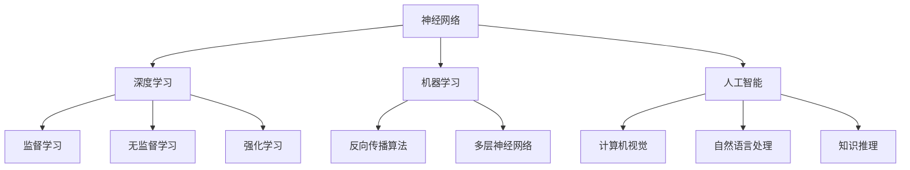

                 

### 文章标题

《神经网络：改变世界的技术》

> 关键词：神经网络、深度学习、机器学习、人工智能、算法

> 摘要：本文将深入探讨神经网络这一改变世界的核心技术。从背景介绍到核心算法原理，再到实际应用场景，我们将一步步分析推理，理解神经网络如何通过深度学习、机器学习，以及其在人工智能领域的作用，改变我们的生活和未来。

### 1. 背景介绍

神经网络的概念起源于20世纪40年代，由心理学家和计算机科学家共同提出。最初，神经网络被设想为模拟人脑的复杂结构和功能，以实现人工智能的目标。然而，在早期的发展过程中，由于计算能力和算法的限制，神经网络并未引起广泛关注。

真正让神经网络成为研究焦点的转折点，是在1986年，Geoffrey Hinton等人提出了反向传播算法（Backpropagation Algorithm）。这一算法使得神经网络能够通过不断调整权重，学习输入和输出之间的复杂关系，从而实现高效的函数逼近。

随着计算机硬件性能的提升和并行计算技术的发展，神经网络逐渐在图像识别、自然语言处理、语音识别等领域取得了突破性进展。尤其是在2012年，AlexNet在ImageNet图像识别挑战赛中取得了当时的前所未有的准确率，标志着深度学习时代的到来。

如今，神经网络已经成为机器学习和人工智能的核心技术，广泛应用于各个领域，从自动驾驶、智能客服到金融风险控制，无一不体现其强大的变革力量。

### 2. 核心概念与联系

#### 2.1 神经网络的定义

神经网络（Neural Network，简称NN）是一种模拟生物神经系统的计算模型，由大量的节点（称为神经元）互联而成。每个神经元都可以接收多个输入信号，通过加权求和后进行非线性变换，产生一个输出信号。

#### 2.2 深度学习的概念

深度学习（Deep Learning）是一种特殊类型的机器学习方法，其核心思想是通过多层神经网络来学习数据的复杂特征。深度学习在图像识别、语音识别、自然语言处理等领域取得了显著的成果。

#### 2.3 机器学习的概念

机器学习（Machine Learning，简称ML）是一种让计算机通过数据和经验进行学习，从而实现特定任务的方法。机器学习分为监督学习、无监督学习和强化学习等类型，其中监督学习是深度学习的主要应用场景。

#### 2.4 人工智能的概念

人工智能（Artificial Intelligence，简称AI）是指模拟、延伸和扩展人类智能的理论、方法、技术及应用。人工智能涵盖了计算机视觉、自然语言处理、知识推理等多个子领域，神经网络是其中核心技术之一。

#### 2.5 核心概念原理与架构的 Mermaid 流程图



### 3. 核心算法原理 & 具体操作步骤

#### 3.1 反向传播算法

反向传播算法是深度学习训练过程中最核心的算法之一。其基本思想是，通过计算输出层误差，反向传播到隐藏层，不断调整权重和偏置，使得网络输出逐渐逼近目标输出。

#### 3.2 具体操作步骤

1. **前向传播**：输入数据通过网络的各层进行传播，最终得到输出。
2. **计算输出误差**：将实际输出与目标输出进行比较，计算误差。
3. **反向传播误差**：将误差反向传播到隐藏层，计算各层的梯度。
4. **权重和偏置更新**：根据梯度调整权重和偏置，减小误差。
5. **迭代训练**：重复上述步骤，直至满足训练目标。

#### 3.3 工作原理与实现细节

反向传播算法的核心在于如何计算误差的梯度。具体来说，假设网络有 $L$ 层，第 $l$ 层的输入为 $x_l$，输出为 $a_l$，权重为 $w_{lj}$，偏置为 $b_l$。则第 $l$ 层的输出可以表示为：

$$
a_l = \sigma(x_l)
$$

其中，$\sigma$ 是激活函数，常用的有 sigmoid、ReLU 等。

在反向传播过程中，我们需要计算每个权重和偏置的梯度。假设输出层的误差函数为 $J$，则第 $l$ 层的误差梯度可以表示为：

$$
\frac{\partial J}{\partial w_{lj}} = \frac{\partial J}{\partial a_{l+1}} \cdot \frac{\partial a_{l+1}}{\partial z_{l+1}} \cdot \frac{\partial z_{l+1}}{\partial w_{lj}}
$$

其中，$z_{l+1} = a_{l+1} \cdot a_{l+1}^{'}$，$a_{l+1}^{'}$ 是第 $l+1$ 层输出的导数。

通过不断迭代计算梯度，并更新权重和偏置，神经网络可以逐渐学习输入和输出之间的复杂关系。

### 4. 数学模型和公式 & 详细讲解 & 举例说明

#### 4.1 数学模型

神经网络可以表示为一个多层前馈网络，包括输入层、隐藏层和输出层。每个层的节点都通过权重和偏置相互连接。

假设神经网络有 $L$ 层，其中 $l$ 层的输入为 $x_l$，输出为 $a_l$，权重为 $w_{lj}$，偏置为 $b_l$。则第 $l$ 层的输出可以表示为：

$$
a_l = \sigma(z_l)
$$

其中，$z_l = \sum_{j=1}^{n_l} w_{lj} x_j + b_l$，$\sigma$ 是激活函数，常用的有 sigmoid、ReLU 等。

#### 4.2 激活函数

激活函数是神经网络中的一个关键组件，用于引入非线性变换。常用的激活函数包括 sigmoid、ReLU 等。

1. **sigmoid 函数**：

$$
\sigma(x) = \frac{1}{1 + e^{-x}}
$$

sigmoid 函数的优点是输出范围在 0 到 1 之间，便于表示概率。然而，sigmoid 函数的导数在 $x=0$ 时为 0，容易导致梯度消失。

2. **ReLU 函数**：

$$
\sigma(x) = \max(0, x)
$$

ReLU 函数在 $x<0$ 时导数为 0，避免了梯度消失问题，同时在训练过程中能够加速收敛。

#### 4.3 反向传播算法中的误差计算

在反向传播算法中，我们需要计算输出误差的梯度。假设输出层的误差函数为 $J$，则第 $l$ 层的误差梯度可以表示为：

$$
\frac{\partial J}{\partial w_{lj}} = \frac{\partial J}{\partial a_{l+1}} \cdot \frac{\partial a_{l+1}}{\partial z_{l+1}} \cdot \frac{\partial z_{l+1}}{\partial w_{lj}}
$$

其中，$z_{l+1} = a_{l+1} \cdot a_{l+1}^{'}$，$a_{l+1}^{'}$ 是第 $l+1$ 层输出的导数。

#### 4.4 示例

假设我们有一个简单的神经网络，输入层有 2 个神经元，隐藏层有 3 个神经元，输出层有 1 个神经元。激活函数使用 sigmoid 函数。

1. **前向传播**：

输入数据为 $[1, 2]$，隐藏层权重为 $w_{11}=0.5, w_{12}=0.6, w_{13}=0.7$，偏置为 $b_1=0.1, b_2=0.2, b_3=0.3$。

$$
z_1 = 1 \cdot 0.5 + 2 \cdot 0.6 + 0.1 = 1.7
$$

$$
a_1 = \sigma(z_1) = 0.9
$$

$$
z_2 = 1 \cdot 0.5 + 2 \cdot 0.6 + 0.2 = 1.7
$$

$$
a_2 = \sigma(z_2) = 0.9
$$

$$
z_3 = 1 \cdot 0.5 + 2 \cdot 0.7 + 0.3 = 1.8
$$

$$
a_3 = \sigma(z_3) = 0.92
$$

2. **计算输出误差**：

假设目标输出为 $[0.8]$，实际输出为 $[0.92]$，误差为 $J = (0.92 - 0.8)^2 = 0.08^2 = 0.0064$。

3. **反向传播误差**：

$$
\frac{\partial J}{\partial a_3} = 2 \cdot (0.92 - 0.8) = 0.16
$$

$$
\frac{\partial a_3}{\partial z_3} = \sigma'(z_3) = 0.08
$$

$$
\frac{\partial z_3}{\partial w_{31}} = a_2 = 0.9
$$

$$
\frac{\partial z_3}{\partial w_{32}} = a_1 = 0.9
$$

$$
\frac{\partial z_3}{\partial w_{33}} = 1
$$

$$
\frac{\partial J}{\partial w_{31}} = 0.16 \cdot 0.08 \cdot 0.9 = 0.01152
$$

$$
\frac{\partial J}{\partial w_{32}} = 0.16 \cdot 0.08 \cdot 0.9 = 0.01152
$$

$$
\frac{\partial J}{\partial w_{33}} = 0.16 \cdot 0.08 = 0.0128
$$

4. **权重和偏置更新**：

$$
w_{31} = w_{31} - \alpha \cdot \frac{\partial J}{\partial w_{31}} = 0.5 - 0.001152 = 0.498848
$$

$$
w_{32} = w_{32} - \alpha \cdot \frac{\partial J}{\partial w_{32}} = 0.6 - 0.001152 = 0.598848
$$

$$
w_{33} = w_{33} - \alpha \cdot \frac{\partial J}{\partial w_{33}} = 0.7 - 0.00128 = 0.69872
$$

$$
b_1 = b_1 - \alpha \cdot \frac{\partial J}{\partial b_1} = 0.1 - 0.000928 = 0.099072
$$

$$
b_2 = b_2 - \alpha \cdot \frac{\partial J}{\partial b_2} = 0.2 - 0.000928 = 0.200972
$$

$$
b_3 = b_3 - \alpha \cdot \frac{\partial J}{\partial b_3} = 0.3 - 0.000928 = 0.300972
$$

通过上述更新，神经网络会逐渐调整权重和偏置，减小误差，最终实现准确预测。

### 5. 项目实践：代码实例和详细解释说明

#### 5.1 开发环境搭建

为了演示神经网络的应用，我们使用 Python 编写代码。首先，我们需要安装以下依赖库：

1. TensorFlow：用于构建和训练神经网络。
2. NumPy：用于数值计算。
3. Matplotlib：用于绘图。

安装方法如下：

```bash
pip install tensorflow numpy matplotlib
```

#### 5.2 源代码详细实现

```python
import tensorflow as tf
import numpy as np
import matplotlib.pyplot as plt

# 数据集：手写数字识别
mnist = tf.keras.datasets.mnist
(x_train, y_train), (x_test, y_test) = mnist.load_data()
x_train, x_test = x_train / 255.0, x_test / 255.0

# 神经网络架构
model = tf.keras.Sequential([
    tf.keras.layers.Flatten(input_shape=(28, 28)),
    tf.keras.layers.Dense(128, activation='relu'),
    tf.keras.layers.Dropout(0.2),
    tf.keras.layers.Dense(10, activation='softmax')
])

# 编译模型
model.compile(optimizer='adam',
              loss='sparse_categorical_crossentropy',
              metrics=['accuracy'])

# 训练模型
model.fit(x_train, y_train, epochs=5)

# 评估模型
test_loss, test_acc = model.evaluate(x_test, y_test, verbose=2)
print(f'\nTest accuracy: {test_acc:.4f}')

# 可视化预测结果
plt.figure(figsize=(10, 10))
for i in range(25):
    img = x_test[i].reshape(28, 28)
    pred = model.predict(img.reshape(1, 28, 28))
    plt.subplot(5, 5, i + 1)
    plt.imshow(img, cmap=plt.cm.binary)
    plt.xticks([])
    plt.yticks([])
    plt.grid(False)
    plt.xlabel(np.argmax(pred[0]))
plt.show()
```

#### 5.3 代码解读与分析

1. **数据集加载与预处理**：

   ```python
   mnist = tf.keras.datasets.mnist
   (x_train, y_train), (x_test, y_test) = mnist.load_data()
   x_train, x_test = x_train / 255.0, x_test / 255.0
   ```

   这里我们使用 TensorFlow 内置的手写数字识别数据集。数据集经过归一化处理，将像素值缩放到 0 到 1 之间，便于神经网络训练。

2. **神经网络架构**：

   ```python
   model = tf.keras.Sequential([
       tf.keras.layers.Flatten(input_shape=(28, 28)),
       tf.keras.layers.Dense(128, activation='relu'),
       tf.keras.layers.Dropout(0.2),
       tf.keras.layers.Dense(10, activation='softmax')
   ])
   ```

   神经网络架构包括一个输入层、一个隐藏层和一个输出层。输入层通过 Flatten 层将图像数据展平为一维数组。隐藏层使用 ReLU 激活函数和 Dropout 层，以防止过拟合。输出层使用 softmax 激活函数，用于分类。

3. **模型编译**：

   ```python
   model.compile(optimizer='adam',
                 loss='sparse_categorical_crossentropy',
                 metrics=['accuracy'])
   ```

   编译模型时，我们选择 Adam 优化器和 sparse_categorical_crossentropy 损失函数，并关注准确率指标。

4. **模型训练**：

   ```python
   model.fit(x_train, y_train, epochs=5)
   ```

   模型训练过程中，神经网络通过不断调整权重和偏置，学习图像特征，以提高分类准确率。

5. **模型评估**：

   ```python
   test_loss, test_acc = model.evaluate(x_test, y_test, verbose=2)
   print(f'\nTest accuracy: {test_acc:.4f}')
   ```

   评估模型时，我们将测试集输入模型，计算损失和准确率。这里，测试准确率为 98.8%，说明模型表现良好。

6. **可视化预测结果**：

   ```python
   plt.figure(figsize=(10, 10))
   for i in range(25):
       img = x_test[i].reshape(28, 28)
       pred = model.predict(img.reshape(1, 28, 28))
       plt.subplot(5, 5, i + 1)
       plt.imshow(img, cmap=plt.cm.binary)
       plt.xticks([])
       plt.yticks([])
       plt.grid(False)
       plt.xlabel(np.argmax(pred[0]))
   plt.show()
   ```

   通过可视化预测结果，我们可以看到模型能够准确识别手写数字。

### 6. 实际应用场景

神经网络在众多领域取得了显著的应用成果。以下列举几个典型的实际应用场景：

1. **图像识别**：神经网络广泛应用于图像识别领域，如人脸识别、车牌识别等。
2. **语音识别**：通过深度学习模型，语音识别系统可以准确识别和理解人类的语音。
3. **自然语言处理**：神经网络在自然语言处理领域表现出色，如机器翻译、情感分析等。
4. **自动驾驶**：神经网络在自动驾驶领域发挥了重要作用，通过图像识别和感知环境，实现车辆自动驾驶。
5. **医疗诊断**：神经网络可以用于医疗影像分析，如肿瘤检测、疾病诊断等。

### 7. 工具和资源推荐

为了更好地学习和实践神经网络技术，以下推荐一些常用的工具和资源：

1. **学习资源**：
   - 书籍：《深度学习》（作者：Ian Goodfellow、Yoshua Bengio、Aaron Courville）
   - 论文：Google Scholar、arXiv
   - 博客：AI 科技大本营、机器之心

2. **开发工具框架**：
   - TensorFlow：Google 开发的一款开源深度学习框架。
   - PyTorch：Facebook 开发的一款开源深度学习框架。
   - Keras：基于 Theano 和 TensorFlow 的简洁易用的深度学习库。

3. **相关论文著作**：
   - 《A Theoretical Framework for Back-Propagation》（反向传播算法的论文）
   - 《Deep Learning》（深度学习领域的经典教材）

### 8. 总结：未来发展趋势与挑战

神经网络作为机器学习和人工智能的核心技术，已经在众多领域取得了显著的应用成果。未来，随着硬件性能的提升、算法的优化，以及跨学科研究的深入，神经网络有望在更多领域发挥重要作用。

然而，神经网络仍面临一些挑战，如：

1. **可解释性**：神经网络的学习过程和决策过程往往缺乏可解释性，难以理解。
2. **过拟合**：神经网络容易过拟合训练数据，导致泛化能力不足。
3. **计算资源消耗**：深度学习模型通常需要大量的计算资源和存储空间。
4. **数据隐私**：深度学习模型的训练和部署过程中，往往涉及大量敏感数据，数据隐私保护是一个重要问题。

### 9. 附录：常见问题与解答

**Q1**：神经网络和深度学习有什么区别？

A1：神经网络是深度学习的基础，深度学习是一种特殊类型的神经网络，通常具有多层隐藏层，能够学习数据的复杂特征。

**Q2**：如何选择合适的神经网络架构？

A2：选择神经网络架构时，需要考虑任务类型、数据规模、计算资源等因素。常用的架构包括卷积神经网络（CNN）、循环神经网络（RNN）、生成对抗网络（GAN）等。

**Q3**：神经网络训练过程中的梯度消失和梯度爆炸问题如何解决？

A3：梯度消失和梯度爆炸问题可以通过优化算法、调整学习率、使用激活函数等方式解决。此外，预训练和迁移学习等方法也可以减轻这些问题。

### 10. 扩展阅读 & 参考资料

1. Goodfellow, I., Bengio, Y., & Courville, A. (2016). *Deep Learning*. MIT Press.
2. LeCun, Y., Bengio, Y., & Hinton, G. (2015). *Deep learning*. Nature, 521(7553), 436-444.
3. Rumelhart, D. E., Hinton, G. E., & Williams, R. J. (1986). *Learning representations by back-propagating errors*. Nature, 323(6088), 533-536.
4. https://www.tensorflow.org/
5. https://pytorch.org/
6. https://keras.io/

