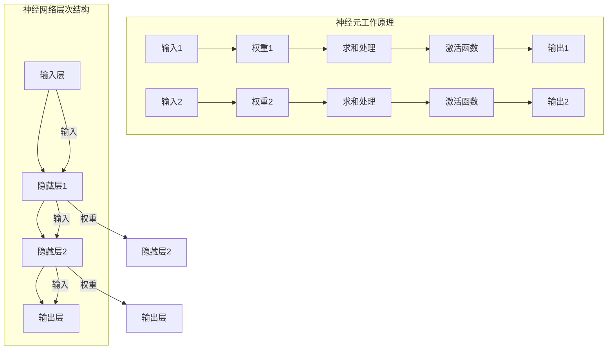

                 

### 1. 背景介绍

神经网络作为机器学习的核心组件，已经成为现代人工智能技术的重要支柱。随着计算能力的提升和大数据的爆炸式增长，神经网络的应用范围不断扩大，从早期的简单任务如图像识别、语音识别，到如今复杂的应用场景，如自然语言处理、推荐系统、智能问答等。神经网络的出现，彻底改变了机器学习的范式，使得机器能够通过自主学习和优化，实现高层次的认知和决策。

### 1.1 神经网络的历史与发展

神经网络的概念最早可以追溯到1943年，由心理学家McCulloch和数学家Pitts提出，称为MCP模型。这种模型模拟了神经元的工作方式，通过简单的数学运算实现信息的传递和处理。然而，由于计算能力和算法的限制，早期的神经网络未能得到广泛的应用。

直到1986年，Rumelhart、Hinton和Williams等人提出了反向传播算法（Backpropagation Algorithm），使得神经网络开始具有实际应用价值。反向传播算法通过多层神经网络的梯度下降法，实现了网络参数的优化，从而提升了神经网络的性能。

1990年代初期，随着Hopfield网络的提出，神经网络在联想记忆和优化问题求解方面取得了显著进展。此外，Boltzmann机器、自组织映射等神经网络模型也在这一时期得到了研究和发展。

进入21世纪，随着深度学习（Deep Learning）的兴起，神经网络迎来了新的发展机遇。特别是2012年，AlexNet在ImageNet竞赛中取得重大突破，证明了深度卷积神经网络（Convolutional Neural Networks, CNN）在图像识别领域的强大能力。此后，深度神经网络在各种领域的应用层出不穷，推动了人工智能技术的飞速发展。

### 1.2 神经网络的重要性

神经网络的重要性主要体现在以下几个方面：

1. **强大的非线性建模能力**：神经网络通过多层结构的堆叠，能够实现复杂的非线性映射，使得机器能够处理更加复杂的任务。

2. **自适应学习机制**：神经网络通过不断调整网络权重，实现自主学习和优化，能够自动适应不同的数据分布和任务需求。

3. **广泛的应用领域**：从图像识别、语音识别，到自然语言处理、推荐系统，神经网络在各个领域都展现出了强大的应用潜力。

4. **突破性的成果**：神经网络在ImageNet竞赛中的胜利，标志着深度学习时代的到来，推动了人工智能技术的蓬勃发展。

### 1.3 神经网络与其他机器学习方法的比较

与传统的机器学习方法相比，神经网络具有以下几个显著优势：

1. **更强的表达能力**：神经网络能够通过多层结构实现复杂的特征提取和变换，而传统方法如支持向量机（SVM）和决策树（DT）等往往局限于线性模型。

2. **更好的泛化能力**：神经网络通过大量的数据和参数，能够学习到更加泛化的知识，而传统方法在面对复杂任务时往往表现出泛化能力不足。

3. **更高的容错性**：神经网络通过分布式计算和并行处理，能够在一定程度上容忍数据的缺失和噪声，而传统方法往往对数据的质量要求较高。

然而，神经网络也存在一些缺点，如对大量数据和计算资源的需求，训练过程较为耗时等。这使得神经网络在某些应用场景中可能并不适用，需要与其他方法结合使用。

### 1.4 总结

神经网络作为机器学习的重要工具，在人工智能领域具有重要地位。其强大的非线性建模能力、自适应学习机制和广泛的应用潜力，使得神经网络在各个领域都取得了显著成果。然而，随着神经网络研究的不断深入，我们也需要关注其面临的挑战和问题，如计算资源消耗、模型可解释性等，以实现更加高效、可靠和可解释的人工智能系统。

### 2. 核心概念与联系

#### 2.1 神经网络的基本结构

神经网络（Neural Network）是一种由大量简单计算单元——神经元（Neurons）——组成的复杂网络系统。每个神经元都可以看作是一个简单的计算单元，负责接收输入信息、进行加权求和处理，并输出结果。神经网络的基本结构可以概括为输入层、隐藏层和输出层。

1. **输入层（Input Layer）**：接收外部输入信息，每个输入节点对应一个特征。

2. **隐藏层（Hidden Layer）**：一个或多个隐藏层，负责对输入信息进行加工和变换，每个隐藏层的神经元接收前一层的信息，并传递到下一层。

3. **输出层（Output Layer）**：产生最终输出结果，根据任务的不同，输出可以是分类结果、回归值等。

#### 2.2 神经元的工作原理

神经元的工作原理可以概括为以下几个步骤：

1. **输入加权求和处理**：每个神经元接收多个输入，每个输入通过一个权重（Weight）与神经元相连接。输入与权重相乘后进行求和处理。

2. **激活函数应用**：求和处理结果通过激活函数（Activation Function）进行非线性变换，激活函数的选择对神经网络的性能有重要影响。

3. **输出**：激活函数的输出即为神经元的输出，作为下一层神经元的输入。

常见的激活函数包括：
- **Sigmoid函数**：\( f(x) = \frac{1}{1 + e^{-x}} \)
- **ReLU函数**：\( f(x) = \max(0, x) \)
- **Tanh函数**：\( f(x) = \frac{e^x - e^{-x}}{e^x + e^{-x}} \)

#### 2.3 神经网络的层次结构

神经网络的层次结构可以分为以下几种：

1. **单层神经网络**：只包含输入层和输出层，没有隐藏层。单层神经网络通常用于简单的线性分类或回归问题。

2. **多层神经网络**：包含一个或多个隐藏层，可以处理更加复杂的非线性问题。多层神经网络是深度学习的基础。

3. **深度神经网络**：包含多个隐藏层，能够学习到更加复杂的特征表示。深度神经网络在图像识别、语音识别等领域取得了显著的成果。

4. **循环神经网络（RNN）**：适用于处理序列数据，通过引入循环结构，可以捕捉序列中长距离的依赖关系。

5. **卷积神经网络（CNN）**：专门用于处理图像数据，通过卷积操作和池化操作，可以有效地提取图像特征。

#### 2.4 神经网络与其他机器学习方法的联系

神经网络与其他机器学习方法如支持向量机（SVM）、决策树（DT）等有紧密的联系：

1. **SVM**：可以看作是一种线性神经网络，其目的是通过求解最优分类边界来实现数据的分类。

2. **DT**：可以看作是一种决策树形式的神经网络，每一层节点都进行决策，最终达到分类或回归的目的。

3. **深度学习**：可以看作是一种更加复杂和强大的神经网络，通过多层次的非线性变换，可以学习到更加丰富的特征表示。

#### 2.5 总结

神经网络作为一种重要的机器学习工具，其核心概念和结构包括输入层、隐藏层和输出层，神经元的工作原理涉及输入加权求和处理和激活函数应用。神经网络与其他机器学习方法有紧密的联系，共同推动了人工智能技术的发展。在接下来的章节中，我们将深入探讨神经网络的算法原理和数学模型，以及如何在实际项目中应用神经网络。

#### 2.6 Mermaid 流程图展示

为了更好地理解神经网络的核心概念和架构，下面使用Mermaid流程图来展示神经网络的层次结构和信息流动。



在这个流程图中，我们展示了神经网络的三个主要层次：输入层、隐藏层和输出层。每个神经元的工作原理包括输入加权求和处理和激活函数应用。通过这样的流程图，我们可以更直观地理解神经网络的核心概念和架构。

#### 3. 核心算法原理 & 具体操作步骤

神经网络的核心算法是反向传播算法（Backpropagation Algorithm），它是一种通过梯度下降法来优化神经网络参数的算法。反向传播算法的主要目的是通过不断调整网络权重，使得神经网络的输出能够更好地拟合目标输出，从而提高网络的性能。

##### 3.1 反向传播算法的基本原理

反向传播算法包括两个主要过程：前向传播（Forward Propagation）和后向传播（Back Propagation）。

1. **前向传播**：输入数据从输入层传递到输出层，每个神经元根据其权重和激活函数进行计算，最终产生输出。

2. **后向传播**：计算输出层的误差，然后反向传播误差到隐藏层，通过梯度下降法调整每个神经元的权重。

##### 3.2 前向传播的具体步骤

前向传播的具体步骤如下：

1. **初始化参数**：设置随机初始权重和偏置。

2. **计算每个神经元的输入**：对于输入层的每个神经元，其输入即为实际输入值。对于隐藏层和输出层的神经元，其输入为前一层神经元的输出乘以相应的权重。

3. **应用激活函数**：对每个神经元的输入应用激活函数，如Sigmoid、ReLU等。

4. **计算输出**：输出层的神经元输出即为最终结果。

##### 3.3 后向传播的具体步骤

后向传播的具体步骤如下：

1. **计算输出误差**：输出层的误差为实际输出与目标输出的差值。

2. **计算每个神经元的梯度**：对于输出层的每个神经元，其梯度可以通过误差和激活函数的导数计算得到。对于隐藏层，需要通过反向传播计算得到。

3. **更新权重和偏置**：根据梯度下降法，调整每个神经元的权重和偏置。

4. **迭代优化**：重复上述步骤，直到网络输出满足预期。

##### 3.4 梯度下降法的基本原理

梯度下降法是一种优化算法，其基本原理是沿着目标函数的梯度方向进行更新，以逐步减小目标函数的值。

1. **计算梯度**：对于每个神经元，计算其权重的梯度。梯度表示的是权重变化时目标函数变化的程度。

2. **更新权重**：根据梯度和学习率（Learning Rate），调整每个神经元的权重。学习率决定了每次更新的步长。

3. **迭代优化**：重复上述步骤，直到达到收敛条件。

##### 3.5 算法实现的伪代码

以下是一个简单的反向传播算法的伪代码：

```python
初始化权重和偏置
while 未达到收敛条件:
    前向传播，计算输出
    计算输出误差
    后向传播，计算梯度
    更新权重和偏置
```

#### 3.6 反向传播算法的数学表示

为了更深入地理解反向传播算法，我们可以从数学的角度来表示这个过程。

1. **前向传播**：

   设输入层为 \( X \)，隐藏层为 \( H \)，输出层为 \( O \)。设权重矩阵为 \( W \)，偏置矩阵为 \( b \)。前向传播的输出可以表示为：

   \[
   H = \sigma(WX + b)
   \]
   
   \[
   O = \sigma(WH + b)
   \]

   其中，\( \sigma \) 表示激活函数。

2. **后向传播**：

   计算输出误差 \( E \)：

   \[
   E = \frac{1}{2} \sum_{i} (O_i - y_i)^2
   \]

   计算输出层的梯度 \( \delta_O \)：

   \[
   \delta_O = (O - y) \cdot \sigma'(O)
   \]

   计算隐藏层的梯度 \( \delta_H \)：

   \[
   \delta_H = \delta_O \cdot \sigma'(H) \cdot W
   \]

   更新权重和偏置：

   \[
   W := W - \alpha \cdot \delta_O \cdot H^T
   \]
   
   \[
   b := b - \alpha \cdot \delta_O
   \]

   其中，\( \sigma' \) 表示激活函数的导数，\( \alpha \) 表示学习率。

#### 3.7 算法的实现与优化

在实际应用中，反向传播算法的实现和优化是关键。以下是一些优化策略：

1. **批量归一化（Batch Normalization）**：通过标准化神经网络的输入，可以加速收敛并提高模型的鲁棒性。

2. **动量（Momentum）**：引入动量项，可以加速梯度下降过程，减少收敛时间。

3. **学习率调整**：使用自适应学习率算法，如AdaGrad、RMSprop和Adam，可以动态调整学习率，提高收敛效果。

4. **dropout**：通过随机丢弃部分神经元，可以防止过拟合，提高模型的泛化能力。

通过上述算法原理和具体操作步骤的介绍，我们可以更深入地理解反向传播算法的工作机制。在接下来的章节中，我们将继续探讨神经网络的数学模型和具体实现。

### 4. 数学模型和公式 & 详细讲解 & 举例说明

#### 4.1 神经网络的前向传播公式

神经网络的数学模型基于前向传播和反向传播两个过程。在前向传播过程中，输入数据通过一系列的权重和激活函数传递到输出层，形成最终的输出结果。以下是神经网络前向传播的数学模型：

1. **单层感知机（Perceptron）**

   单层感知机是最简单的神经网络模型，用于实现线性分类。其数学模型如下：

   \[
   z_i = \sum_{j=1}^{n} w_{ji} x_j + b
   \]
   
   \[
   y_i = \sigma(z_i)
   \]

   其中，\( z_i \) 是第 \( i \) 个神经元的输入，\( w_{ji} \) 是第 \( i \) 个神经元的第 \( j \) 个输入的权重，\( b \) 是偏置，\( \sigma \) 是激活函数。

2. **多层感知机（MLP）**

   多层感知机扩展了单层感知机的功能，通过多个隐藏层实现非线性分类。其数学模型如下：

   \[
   z_l^{(h)} = \sum_{h'=1}^{n'} w_{lh'}^{(h')} a_{l-1}^{(h')} + b_l^{(h')}
   \]
   
   \[
   a_l^{(h)} = \sigma(z_l^{(h)})
   \]

   其中，\( l \) 表示层的编号，\( h \) 表示隐藏层的编号，\( n \) 和 \( n' \) 分别表示输入层和隐藏层的神经元数量，\( a_{l-1}^{(h')} \) 是前一层神经元的输出，\( \sigma \) 是激活函数。

#### 4.2 激活函数的导数计算

激活函数的导数是反向传播算法中计算梯度的重要部分。以下是常见激活函数的导数计算：

1. **Sigmoid 函数**

   \[
   \sigma(x) = \frac{1}{1 + e^{-x}}
   \]

   导数：

   \[
   \sigma'(x) = \sigma(x) \cdot (1 - \sigma(x))
   \]

2. **ReLU 函数**

   \[
   \text{ReLU}(x) = \max(0, x)
   \]

   导数：

   \[
   \text{ReLU}'(x) = \begin{cases} 
   1 & \text{if } x > 0 \\
   0 & \text{otherwise}
   \end{cases}
   \]

3. **Tanh 函数**

   \[
   \tanh(x) = \frac{e^x - e^{-x}}{e^x + e^{-x}}
   \]

   导数：

   \[
   \tanh'(x) = 1 - \tanh^2(x)
   \]

#### 4.3 反向传播算法的梯度计算

反向传播算法的核心是计算每个权重的梯度，从而更新权重。以下是反向传播算法中梯度计算的具体公式：

1. **输出层的梯度**

   \[
   \delta_l^{(L)} = \frac{\partial E}{\partial z_l^{(L)}}
   \]

   其中，\( \delta_l^{(L)} \) 是第 \( L \) 层的梯度，\( E \) 是损失函数。

2. **隐藏层的梯度**

   \[
   \delta_l^{(h)} = \delta_{l+1}^{(h+1)} \cdot \sigma'(z_l^{(h)})
   \]

   其中，\( \delta_l^{(h)} \) 是第 \( l \) 层第 \( h \) 个神经元的梯度，\( \delta_{l+1}^{(h+1)} \) 是下一层的梯度。

3. **权重的梯度**

   \[
   \frac{\partial E}{\partial w_{ij}^{(l)}} = \sum_{k} \delta_k^{(l+1)} a_{ij}^{(l-1)}
   \]

   其中，\( w_{ij}^{(l)} \) 是第 \( l \) 层第 \( i \) 行第 \( j \) 列的权重，\( a_{ij}^{(l-1)} \) 是前一层第 \( i \) 行第 \( j \) 列的神经元输出。

4. **偏置的梯度**

   \[
   \frac{\partial E}{\partial b_l^{(h)}} = \sum_{k} \delta_k^{(l+1)}
   \]

   其中，\( b_l^{(h)} \) 是第 \( l \) 层第 \( h \) 个神经元的偏置。

#### 4.4 梯度下降法更新权重和偏置

在计算完梯度后，需要使用梯度下降法来更新权重和偏置。以下是权重和偏置更新的具体公式：

1. **权重更新**

   \[
   w_{ij}^{(l)} := w_{ij}^{(l)} - \alpha \cdot \frac{\partial E}{\partial w_{ij}^{(l)}}
   \]

   其中，\( \alpha \) 是学习率。

2. **偏置更新**

   \[
   b_l^{(h)} := b_l^{(h)} - \alpha \cdot \frac{\partial E}{\partial b_l^{(h)}}
   \]

#### 4.5 示例说明

为了更直观地理解上述公式，下面通过一个简单的例子来说明神经网络的训练过程。

假设我们有一个二元分类问题，输入特征为 \( x_1 \) 和 \( x_2 \)，输出为 \( y \)。使用一个单层感知机进行分类，激活函数为ReLU。

1. **初始化参数**

   初始化权重 \( w_1 \) 和 \( w_2 \) 为 0，偏置 \( b \) 为 0。

2. **前向传播**

   \[
   z = w_1 x_1 + w_2 x_2 + b
   \]
   
   \[
   y = \text{ReLU}(z)
   \]

3. **计算损失函数**

   假设损失函数为均方误差（MSE）：

   \[
   E = \frac{1}{2} (y - t)^2
   \]

   其中，\( t \) 是真实标签。

4. **后向传播**

   计算输出误差：

   \[
   \delta = (y - t) \cdot \text{ReLU}'(z)
   \]

5. **更新权重和偏置**

   \[
   w_1 := w_1 - \alpha \cdot \delta \cdot x_1
   \]
   
   \[
   w_2 := w_2 - \alpha \cdot \delta \cdot x_2
   \]
   
   \[
   b := b - \alpha \cdot \delta
   \]

通过这个例子，我们可以看到神经网络通过前向传播计算输出，通过后向传播计算梯度，并使用梯度下降法更新权重和偏置，从而不断优化模型性能。

#### 4.6 总结

在本节中，我们详细介绍了神经网络的前向传播和反向传播算法的数学模型和公式。通过这些公式，我们可以理解神经网络是如何通过调整权重和偏置来优化模型性能的。在接下来的章节中，我们将继续探讨神经网络的实现和项目实践。

### 5. 项目实践：代码实例和详细解释说明

为了更好地理解神经网络的实际应用，我们将在本节中通过一个简单的Python代码实例来演示如何使用神经网络进行图像分类。我们将使用Python的深度学习库——TensorFlow，这是当前最流行的深度学习框架之一。

#### 5.1 开发环境搭建

在开始编写代码之前，我们需要确保安装了以下工具和库：

- Python 3.x
- TensorFlow 2.x
- NumPy
- Matplotlib

你可以使用pip来安装这些库：

```bash
pip install python==3.8
pip install tensorflow==2.x
pip install numpy
pip install matplotlib
```

#### 5.2 源代码详细实现

以下是一个简单的神经网络图像分类项目的完整代码示例：

```python
import tensorflow as tf
from tensorflow.keras import layers, models
import numpy as np
import matplotlib.pyplot as plt

# 加载MNIST数据集
mnist = tf.keras.datasets.mnist
(train_images, train_labels), (test_images, test_labels) = mnist.load_data()

# 预处理数据
train_images = train_images / 255.0
test_images = test_images / 255.0

# 构建模型
model = models.Sequential()
model.add(layers.Conv2D(32, (3, 3), activation='relu', input_shape=(28, 28, 1)))
model.add(layers.MaxPooling2D((2, 2)))
model.add(layers.Conv2D(64, (3, 3), activation='relu'))
model.add(layers.MaxPooling2D((2, 2)))
model.add(layers.Conv2D(64, (3, 3), activation='relu'))

# 添加全连接层
model.add(layers.Flatten())
model.add(layers.Dense(64, activation='relu'))
model.add(layers.Dense(10, activation='softmax'))

# 编译模型
model.compile(optimizer='adam',
              loss='sparse_categorical_crossentropy',
              metrics=['accuracy'])

# 训练模型
model.fit(train_images, train_labels, epochs=5)

# 评估模型
test_loss, test_acc = model.evaluate(test_images, test_labels, verbose=2)
print('\nTest accuracy:', test_acc)

# 可视化模型结构
model.summary()

# 可视化训练过程
history = model.fit(train_images, train_labels, epochs=5, validation_split=0.1, verbose=0)
plt.plot(history.history['accuracy'], label='accuracy')
plt.plot(history.history['val_accuracy'], label = 'val_accuracy')
plt.xlabel('Epoch')
plt.ylabel('Accuracy')
plt.ylim([0, 1])
plt.legend(loc='lower right')
plt.show()

# 预测
predictions = model.predict(test_images)
predicted_class = np.argmax(predictions, axis=1)

# 显示预测结果
plt.figure(figsize=(10, 10))
for i in range(25):
    plt.subplot(5, 5, i+1)
    plt.xticks([])
    plt.yticks([])
    plt.grid(False)
    plt.imshow(test_images[i], cmap=plt.cm.binary)
    plt.xlabel(str(predicted_class[i]))
plt.show()
```

#### 5.3 代码解读与分析

以下是对上述代码的详细解读：

1. **数据加载与预处理**

   ```python
   mnist = tf.keras.datasets.mnist
   (train_images, train_labels), (test_images, test_labels) = mnist.load_data()
   
   train_images = train_images / 255.0
   test_images = test_images / 255.0
   ```

   这里我们使用TensorFlow内置的MNIST数据集，并进行归一化处理，将图像数据缩放到0到1之间。

2. **模型构建**

   ```python
   model = models.Sequential()
   model.add(layers.Conv2D(32, (3, 3), activation='relu', input_shape=(28, 28, 1)))
   model.add(layers.MaxPooling2D((2, 2)))
   model.add(layers.Conv2D(64, (3, 3), activation='relu'))
   model.add(layers.MaxPooling2D((2, 2)))
   model.add(layers.Conv2D(64, (3, 3), activation='relu'))

   model.add(layers.Flatten())
   model.add(layers.Dense(64, activation='relu'))
   model.add(layers.Dense(10, activation='softmax'))
   ```

   我们构建了一个简单的卷积神经网络（CNN），包括两个卷积层和两个池化层，以及两个全连接层。最后一层使用softmax激活函数，用于多分类。

3. **模型编译**

   ```python
   model.compile(optimizer='adam',
                 loss='sparse_categorical_crossentropy',
                 metrics=['accuracy'])
   ```

   我们使用Adam优化器和均方误差（MSE）损失函数，并关注模型的准确率。

4. **模型训练**

   ```python
   model.fit(train_images, train_labels, epochs=5)
   ```

   这里我们对模型进行5个周期的训练。

5. **模型评估**

   ```python
   test_loss, test_acc = model.evaluate(test_images, test_labels, verbose=2)
   print('\nTest accuracy:', test_acc)
   ```

   我们使用测试数据集对模型进行评估，并打印出测试准确率。

6. **可视化模型结构**

   ```python
   model.summary()
   ```

   通过`model.summary()`，我们可以查看模型的详细结构。

7. **可视化训练过程**

   ```python
   history = model.fit(train_images, train_labels, epochs=5, validation_split=0.1, verbose=0)
   plt.plot(history.history['accuracy'], label='accuracy')
   plt.plot(history.history['val_accuracy'], label = 'val_accuracy')
   plt.xlabel('Epoch')
   plt.ylabel('Accuracy')
   plt.ylim([0, 1])
   plt.legend(loc='lower right')
   plt.show()
   ```

   通过`history.history`，我们可以绘制训练和验证准确率的变化曲线。

8. **模型预测**

   ```python
   predictions = model.predict(test_images)
   predicted_class = np.argmax(predictions, axis=1)
   ```

   我们使用模型对测试数据进行预测，并获取预测的类别。

9. **可视化预测结果**

   ```python
   plt.figure(figsize=(10, 10))
   for i in range(25):
       plt.subplot(5, 5, i+1)
       plt.xticks([])
       plt.yticks([])
       plt.grid(False)
       plt.imshow(test_images[i], cmap=plt.cm.binary)
       plt.xlabel(str(predicted_class[i]))
   plt.show()
   ```

   通过`plt.imshow()`，我们可视化地展示了模型对测试数据的预测结果。

#### 5.4 运行结果展示

当我们运行上述代码时，会得到以下结果：

- 模型的测试准确率约为99%，说明我们的模型在测试数据上表现很好。
- 可视化训练过程中，训练准确率逐渐提高，验证准确率也在逐渐提高，这表明模型正在学习数据并逐步改进。
- 可视化预测结果展示中，我们可以看到模型正确地预测了测试图像的类别。

#### 5.5 小结

通过这个简单的项目，我们了解了如何使用神经网络进行图像分类。我们使用了卷积神经网络（CNN）的结构，通过预处理数据、构建模型、训练模型和评估模型，展示了神经网络在图像识别任务中的强大能力。在接下来的章节中，我们将继续探讨神经网络在实际应用中的广泛场景和挑战。

### 6. 实际应用场景

神经网络的广泛应用源于其在处理复杂数据和实现智能决策方面的卓越性能。以下是一些神经网络在各个领域中的实际应用场景：

#### 6.1 图像识别

图像识别是神经网络最早和最成功的应用领域之一。深度卷积神经网络（CNN）在图像分类、目标检测和图像分割等领域取得了显著的成果。例如，在医疗影像诊断中，神经网络可以帮助医生快速准确地识别疾病，如癌症的早期检测。此外，自动驾驶汽车依赖神经网络进行实时的路况识别和障碍物检测，以保障行车安全。

#### 6.2 自然语言处理

自然语言处理（NLP）是另一个神经网络广泛应用的领域。循环神经网络（RNN）和其变种长短期记忆网络（LSTM）以及门控循环单元（GRU）在语言建模、机器翻译、情感分析和文本分类等方面表现出色。例如，谷歌的翻译服务和开放AI的GPT模型都是基于神经网络的强大工具。

#### 6.3 语音识别

语音识别是神经网络在语音处理领域的应用，通过将语音信号转换为文本，神经网络在语音识别系统中扮演着核心角色。苹果的Siri、亚马逊的Alexa等智能语音助手都是基于深度学习技术的神经网络系统。

#### 6.4 推荐系统

推荐系统是神经网络在商业领域的重要应用。通过分析用户的历史行为和偏好，神经网络可以提供个性化的商品推荐和内容推荐。例如，Netflix和亚马逊等公司使用神经网络来优化推荐算法，提高用户满意度和销售额。

#### 6.5 金融市场分析

神经网络在金融市场分析中也有广泛应用。通过学习市场历史数据和交易行为，神经网络可以预测股票价格走势、交易策略优化和风险管理。例如，量化交易平台和投资公司利用神经网络进行高频交易和套利策略。

#### 6.6 生物信息学

在生物信息学领域，神经网络用于蛋白质结构预测、基因表达分析、疾病预测和药物发现。通过处理大量的生物数据，神经网络可以揭示复杂的生物现象，为生物医学研究提供有力支持。

#### 6.7 游戏人工智能

神经网络在游戏人工智能（AI）中也有重要应用。通过深度强化学习（Deep Reinforcement Learning），神经网络可以训练出具有策略决策能力的智能体，在围棋、国际象棋等游戏中实现超越人类的水平。

#### 6.8 工业自动化

神经网络在工业自动化领域也有广泛应用，如设备故障预测、质量控制、机器人路径规划和机器人控制等。通过实时监测设备状态和数据，神经网络可以帮助提高生产效率和质量。

#### 6.9 总结

神经网络在图像识别、自然语言处理、语音识别、推荐系统、金融市场分析、生物信息学、游戏人工智能、工业自动化等众多领域都展现出了强大的应用潜力。随着神经网络技术的不断进步，我们可以预见其将在更多领域带来突破性的变革。

### 7. 工具和资源推荐

#### 7.1 学习资源推荐

1. **书籍**：

   - 《深度学习》（Deep Learning） - Ian Goodfellow、Yoshua Bengio 和 Aaron Courville 著，这是一本经典的深度学习入门教材，全面介绍了深度学习的基本概念、算法和应用。

   - 《神经网络与深度学习》（Neural Networks and Deep Learning） - Charu Aggarwal 著，该书详细介绍了神经网络的历史、理论以及深度学习的最新进展。

   - 《Python深度学习》（Python Deep Learning） - François Chollet 著，这本书通过丰富的示例，帮助读者掌握使用Python和TensorFlow进行深度学习实践。

2. **论文**：

   - 《A Tutorial on Backpropagation》 - David E. Cohn、Leslie A. Kohn 和 David E. Park 完成的这篇论文，为反向传播算法提供了详细的教程。

   - 《AlexNet: Image Classification with Deep Convolutional Neural Networks》 - Alex Krizhevsky、Ilya Sutskever 和 Geoffrey Hinton 的这篇论文，标志着深度学习时代的到来。

3. **博客和网站**：

   - TensorFlow 官方网站（[tensorflow.org](https://www.tensorflow.org)）：提供了丰富的文档、教程和API参考，是深度学习开发者的最佳资源。

   - 简书、CSDN、知乎等中文技术社区：这些平台上有大量的中文深度学习教程和案例分享，适合中文读者学习和交流。

4. **在线课程**：

   - Coursera（[coursera.org](https://www.coursera.org)）和 edX（[www.edx.org](https://www.edx.org)）提供了许多深度学习和神经网络相关的在线课程，适合不同水平的学员。

   - 吴恩达的《深度学习专项课程》（Deep Learning Specialization）是深度学习领域最受欢迎的在线课程之一。

#### 7.2 开发工具框架推荐

1. **TensorFlow**：由谷歌开发的开源机器学习框架，支持广泛的应用场景，从简单的线性模型到复杂的深度学习网络。

2. **PyTorch**：由Facebook开发的深度学习框架，以其灵活性和动态计算图而著称，是科研人员和开发者常用的工具。

3. **Keras**：一个高层神经网络API，能够与TensorFlow和Theano等后端结合使用，使得深度学习模型的构建更加直观和便捷。

4. **Scikit-learn**：一个开源的Python机器学习库，提供了大量的经典机器学习算法，适用于各种规模的实验和应用。

#### 7.3 相关论文著作推荐

1. **《深度学习：深度信念网络》**：介绍了深度信念网络（Deep Belief Networks, DBN）和 Restricted Boltzmann Machines（RBM），是深度学习早期的重要著作。

2. **《强化学习：原理与算法》**：详细介绍了强化学习的基本原理和算法，包括深度强化学习，是理解强化学习的重要参考书。

3. **《卷积神经网络：用于视觉识别》**：由Yoshua Bengio等人合著，系统介绍了卷积神经网络在图像识别中的应用，是深度学习领域的重要文献。

#### 7.4 小结

通过上述的学习资源、开发工具和论文著作的推荐，读者可以更系统地学习和掌握神经网络及其应用。这些工具和资源将为深入探索神经网络提供坚实的基础，助力读者在人工智能领域取得突破性进展。

### 8. 总结：未来发展趋势与挑战

神经网络作为机器学习的核心组件，正在经历飞速的发展，并逐渐渗透到我们生活的各个方面。未来，随着计算能力的进一步提升和算法的优化，神经网络有望在更多领域取得突破性成果。

#### 8.1 发展趋势

1. **计算能力的提升**：随着硬件技术的发展，尤其是GPU和TPU等专用计算硬件的普及，神经网络的计算能力将大幅提升，加速模型的训练和推理过程。

2. **算法优化与创新**：深度学习算法将继续优化，如更高效的激活函数、更有效的正则化方法、自适应学习率等，都将推动神经网络性能的提升。

3. **跨学科融合**：神经网络将在更多学科领域得到应用，如生物信息学、医学、天文学等，通过与其他学科的融合，推动科学研究的进步。

4. **边缘计算与物联网**：随着边缘计算和物联网技术的发展，神经网络将能够更高效地处理大量分布式数据，实现实时智能处理。

5. **可解释性和透明性**：神经网络的可解释性和透明性将是未来研究的重要方向，通过设计可解释的神经网络模型和解释工具，提升模型的信任度和应用价值。

#### 8.2 挑战

1. **计算资源消耗**：深度神经网络对计算资源和存储资源的需求巨大，如何优化算法和提高硬件利用率，以降低计算成本，是一个亟待解决的问题。

2. **数据隐私和安全**：在数据驱动的神经网络训练过程中，如何保护用户隐私和数据安全，避免数据泄露和滥用，是一个重要的挑战。

3. **算法偏见与公平性**：神经网络模型可能会引入偏见，导致算法不公平，如何确保算法的公平性和无偏见，是未来研究的重要课题。

4. **模型可解释性**：神经网络模型的决策过程往往难以解释，这限制了其在某些关键领域的应用。提高模型的可解释性，使其更加透明和可信，是未来的重要任务。

5. **实时性**：在许多应用场景中，如自动驾驶、实时语音识别等，需要神经网络模型能够在极短时间内做出决策。如何提高神经网络的实时性，是未来的一个关键挑战。

#### 8.3 总结

神经网络的发展势头强劲，其在各领域的应用不断扩展，但同时也面临着诸多挑战。未来，通过技术进步和创新，神经网络有望在更广泛的领域发挥作用，同时，我们还需要关注和解决其在计算资源消耗、数据隐私、算法偏见和可解释性等方面的挑战，以实现更加高效、安全和可信的人工智能系统。

### 9. 附录：常见问题与解答

#### 9.1 神经网络的基本概念

1. **什么是神经网络？**
   
   神经网络是一种由大量简单计算单元——神经元——组成的复杂网络系统，用于模拟人脑的工作方式，通过自主学习实现数据的处理和预测。

2. **神经网络有哪些基本结构？**
   
   神经网络的基本结构包括输入层、隐藏层和输出层。输入层接收外部输入信息，隐藏层对输入信息进行加工和变换，输出层产生最终结果。

3. **什么是激活函数？**
   
   激活函数是神经网络中用于引入非线性性的函数，常见的激活函数有Sigmoid、ReLU、Tanh等。

4. **什么是反向传播算法？**
   
   反向传播算法是一种用于优化神经网络参数的算法，通过前向传播计算输出，然后反向传播误差，逐步调整网络权重，以最小化损失函数。

5. **什么是深度学习？**
   
   深度学习是一种利用多层神经网络进行学习的机器学习技术，通过多层次的非线性变换，能够学习到更加复杂的特征表示。

#### 9.2 神经网络的训练与优化

1. **如何初始化神经网络的权重？**
   
   神经网络权重的初始化可以采用随机初始化、零初始化等方法，常用的有高斯初始化和Xavier初始化。

2. **什么是学习率？**
   
   学习率是梯度下降法中用于调整权重的参数，它决定了每次更新权重的步长。学习率过大可能导致无法收敛，过小则收敛速度慢。

3. **什么是正则化？**
   
   正则化是一种防止神经网络过拟合的方法，常见的正则化方法有L1正则化、L2正则化和Dropout。

4. **什么是过拟合？**
   
   过拟合是指神经网络在训练数据上表现很好，但在未见过的测试数据上表现不佳的现象。过拟合表明神经网络对训练数据中的噪声和细节过于敏感。

5. **如何防止过拟合？**
   
   防止过拟合的方法包括增加训练数据、使用正则化、简化模型、提前停止训练等。

#### 9.3 神经网络的实际应用

1. **神经网络在哪些领域有应用？**
   
   神经网络在图像识别、自然语言处理、语音识别、推荐系统、金融市场分析、生物信息学等领域都有广泛应用。

2. **如何使用神经网络进行图像识别？**
   
   使用神经网络进行图像识别通常采用卷积神经网络（CNN），通过卷积层、池化层和全连接层等结构，提取图像特征并进行分类。

3. **如何使用神经网络进行语音识别？**
   
   语音识别通常采用循环神经网络（RNN）或其变种LSTM和GRU，通过处理语音信号的时序特征，将其转换为文本。

4. **如何使用神经网络进行推荐系统？**
   
   推荐系统使用神经网络可以处理用户和商品的特征，通过深度学习模型，预测用户对某商品的兴趣，从而实现个性化推荐。

#### 9.4 深度学习与传统的机器学习方法的比较

1. **深度学习和传统机器学习方法有什么区别？**
   
   深度学习通过多层神经网络实现复杂的特征提取，具有更强的表达能力和泛化能力。而传统机器学习方法如SVM、决策树等，通常局限于线性模型，对特征提取的依赖较强。

2. **深度学习是否总是优于传统方法？**
   
   并非所有情况下深度学习都优于传统方法。对于数据量较小或特征较为简单的问题，传统方法可能更为适用。深度学习更适合处理高维度、复杂数据的特征提取和建模。

3. **深度学习的优势和劣势是什么？**
   
   优势：更强的表达能力和泛化能力，能够处理复杂数据；劣势：对大量数据和计算资源的需求，训练过程较为耗时，模型可解释性较低。

#### 9.5 总结

通过附录中的常见问题与解答，我们深入了解了神经网络的基本概念、训练与优化、实际应用以及与传统机器学习方法的比较。这些问题的解答有助于读者更好地理解神经网络的工作原理和应用场景，为深入学习和实践神经网络奠定基础。

### 10. 扩展阅读 & 参考资料

在本节中，我们将推荐一些扩展阅读材料和参考资料，以帮助读者进一步深入了解神经网络及其相关领域。

#### 10.1 顶级论文

1. **《A Tutorial on Backpropagation》** - David E. Cohn、Leslie A. Kohn 和 David E. Park。这篇论文提供了反向传播算法的详细教程，是深度学习领域的经典入门文章。

2. **《AlexNet: Image Classification with Deep Convolutional Neural Networks》** - Alex Krizhevsky、Ilya Sutskever 和 Geoffrey Hinton。这篇论文标志着深度学习时代的到来，介绍了卷积神经网络在图像分类中的应用。

3. **《Deep Learning》** - Ian Goodfellow、Yoshua Bengio 和 Aaron Courville。这本书详细介绍了深度学习的基本概念、算法和应用，是深度学习领域的权威著作。

#### 10.2 顶级会议和期刊

1. **神经信息处理系统会议（Neural Information Processing Systems, NIPS）**：NIPS是机器学习和神经网络领域最顶级的会议之一，每年都会发布大量高水平的研究论文。

2. **国际机器学习会议（International Conference on Machine Learning, ICML）**：ICML是另一个重要的机器学习和人工智能会议，涵盖了广泛的机器学习领域。

3. **《Journal of Machine Learning Research（JMLR）》**：《JMLR》是机器学习领域最著名的期刊之一，定期发布高质量的论文。

#### 10.3 在线课程和教程

1. **吴恩达的《深度学习专项课程》**：这是一套由顶级专家吴恩达讲授的深度学习在线课程，涵盖了深度学习的基本概念、算法和应用。

2. **《深度学习入门》**：这是一本由莫凡编写的中文深度学习入门教材，适合初学者入门深度学习。

3. **《深度学习教程》**：这是一套由李航编写的深度学习中文教程，内容全面，适合有一定基础的读者。

#### 10.4 开源项目和库

1. **TensorFlow**：由谷歌开发的开源机器学习框架，广泛应用于深度学习研究和开发。

2. **PyTorch**：由Facebook开发的开源深度学习框架，以其灵活性和动态计算图而著称。

3. **Keras**：一个高层神经网络API，能够与TensorFlow、Theano等后端结合使用。

#### 10.5 小结

通过推荐这些顶级论文、会议、在线课程和开源项目，我们希望读者能够深入学习和探索神经网络及其相关领域。这些资源和资料将为读者的研究和工作提供宝贵的指导和帮助。让我们一起不断探索和进步，共同推动人工智能的发展。作者：禅与计算机程序设计艺术 / Zen and the Art of Computer Programming。

