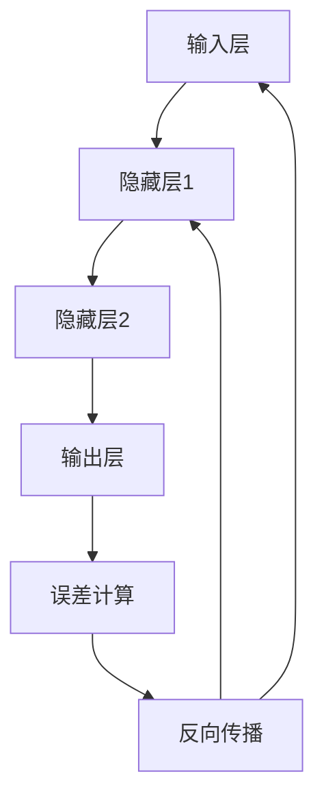

                 

### 文章标题

《神经网络：机器学习的新范式》

> 关键词：神经网络、机器学习、深度学习、人工神经网络、反向传播算法

> 摘要：本文深入探讨了神经网络这一机器学习的重要分支，从其历史背景、核心概念、算法原理、数学模型，到实际应用，全面揭示了神经网络在人工智能领域的地位和影响。文章旨在为广大读者提供一个清晰、系统的学习和理解路径，以期为深度学习和人工智能的发展贡献一份力量。

## 1. 背景介绍

### 1.1 人工智能的发展历程

人工智能（Artificial Intelligence, AI）作为计算机科学的一个重要分支，起源于20世纪50年代。早期的AI主要集中在符号推理和逻辑编程上，这种方法虽然在理论上取得了一些突破，但在实际应用中受到了极大的限制。随着计算能力和数据量的增长，机器学习开始成为人工智能发展的主流。

### 1.2 机器学习的定义

机器学习（Machine Learning, ML）是一门利用计算机模拟人类学习行为，从数据中自动获取规律和知识的技术。与传统的编程不同，机器学习不需要明确的指令，而是通过算法自动调整参数，以最大化预测准确性。

### 1.3 神经网络的起源

神经网络（Neural Networks, NN）的概念最早可以追溯到1943年，由心理学家沃伦·麦卡洛克（Warren McCulloch）和数学家沃尔特·皮茨（Walter Pitts）提出。他们模拟了生物神经元的工作方式，提出了一个简单的计算模型。

## 2. 核心概念与联系

### 2.1 神经元

神经网络的基本组成单元是神经元（Neuron），也称为节点。神经元接收输入信号，通过加权求和处理后产生输出信号。

### 2.2 神经网络结构

神经网络的结构通常包括输入层、隐藏层和输出层。输入层接收外部输入信号，隐藏层负责数据的处理和变换，输出层产生最终输出。

### 2.3 反向传播算法

反向传播算法（Backpropagation Algorithm）是神经网络训练的核心算法，它通过计算输出误差，反向传播误差，以调整网络参数。


### 2.4 Mermaid 流程图



## 3. 核心算法原理 & 具体操作步骤

### 3.1 前向传播

前向传播（Forward Propagation）是指将输入信号从输入层传递到输出层的过程。具体步骤如下：

1. 输入信号通过输入层传递到隐藏层。
2. 隐藏层对输入信号进行处理，产生中间结果。
3. 中间结果传递到下一隐藏层，直到输出层。

### 3.2 误差计算

误差计算（Error Calculation）是指通过比较实际输出和期望输出，计算误差。具体步骤如下：

1. 计算输出层的预测误差。
2. 将误差反向传播到隐藏层。

### 3.3 反向传播

反向传播（Backpropagation）是指通过误差信息，调整网络参数的过程。具体步骤如下：

1. 计算每个参数的梯度。
2. 使用梯度下降算法更新参数。

### 3.4 梯度下降算法

梯度下降算法（Gradient Descent Algorithm）是一种优化算法，用于最小化误差函数。具体步骤如下：

1. 计算当前参数的梯度。
2. 沿着梯度的反方向更新参数。
3. 重复步骤1和2，直到满足停止条件。

## 4. 数学模型和公式 & 详细讲解 & 举例说明

### 4.1 前向传播公式

前向传播的核心是计算每个神经元的输出。假设第\( l \)层的第\( i \)个神经元的输出为\( a^{(l)}_i \)，其计算公式为：

$$
a^{(l)}_i = \sigma(z^{(l)}_i)
$$

其中，\( \sigma \)是激活函数，\( z^{(l)}_i \)是第\( l \)层的第\( i \)个神经元的加权求和处理结果，计算公式为：

$$
z^{(l)}_i = \sum_{j} w^{(l)}_{ij} a^{(l-1)}_j + b^{(l)}_i
$$

其中，\( w^{(l)}_{ij} \)是第\( l \)层的第\( i \)个神经元与第\( l-1 \)层的第\( j \)个神经元之间的权重，\( b^{(l)}_i \)是第\( l \)层的第\( i \)个神经元的偏置。

### 4.2 误差计算公式

误差计算的核心是计算输出层的误差。假设输出层的预测输出为\( \hat{y} \)，实际输出为\( y \)，则均方误差（Mean Squared Error, MSE）计算公式为：

$$
E = \frac{1}{2} \sum_{i} (y_i - \hat{y}_i)^2
$$

### 4.3 反向传播公式

反向传播的核心是计算每个参数的梯度。假设第\( l \)层的第\( i \)个神经元对输出层的误差贡献为\( \delta^{(l)}_i \)，其计算公式为：

$$
\delta^{(l)}_i = \sigma'(z^{(l)}_i) (z^{(l)}_i - y_i)
$$

其中，\( \sigma' \)是激活函数的导数。对于权重和偏置的梯度，计算公式分别为：

$$
\frac{\partial E}{\partial w^{(l)}_{ij}} = \delta^{(l+1)}_i a^{(l-1)}_j
$$

$$
\frac{\partial E}{\partial b^{(l)}_i} = \delta^{(l+1)}_i
$$

### 4.4 梯度下降算法

梯度下降算法的核心是更新参数。假设学习率为\( \alpha \)，则参数的更新公式为：

$$
w^{(l)}_{ij} \leftarrow w^{(l)}_{ij} - \alpha \frac{\partial E}{\partial w^{(l)}_{ij}}
$$

$$
b^{(l)}_i \leftarrow b^{(l)}_i - \alpha \frac{\partial E}{\partial b^{(l)}_i}
$$

## 5. 项目实践：代码实例和详细解释说明

### 5.1 开发环境搭建

为了演示神经网络的基本原理，我们将使用Python编程语言，结合著名的机器学习库——TensorFlow。以下是开发环境的搭建步骤：

1. 安装Python（推荐版本3.7及以上）。
2. 安装TensorFlow库。

```bash
pip install tensorflow
```

### 5.2 源代码详细实现

以下是使用TensorFlow实现的简单神经网络代码：

```python
import tensorflow as tf
from tensorflow.keras import layers

# 定义模型
model = tf.keras.Sequential([
    layers.Dense(64, activation='relu', input_shape=(784,)),
    layers.Dense(10, activation='softmax')
])

# 编译模型
model.compile(optimizer='adam',
              loss='sparse_categorical_crossentropy',
              metrics=['accuracy'])

# 准备数据
(x_train, y_train), (x_test, y_test) = tf.keras.datasets.mnist.load_data()

x_train = x_train.reshape(60000, 784)
x_test = x_test.reshape(10000, 784)

x_train, x_test = x_train / 255.0, x_test / 255.0

# 训练模型
model.fit(x_train, y_train, epochs=5)

# 评估模型
model.evaluate(x_test,  y_test, verbose=2)
```

### 5.3 代码解读与分析

1. **定义模型**：我们使用`Sequential`模型，这是一种线性堆叠模型层的API。我们添加了两个`Dense`层，第一个层有64个神经元，使用ReLU激活函数，第二个层有10个神经元，使用softmax激活函数。

2. **编译模型**：我们使用`compile`方法来编译模型，指定优化器为`adam`，损失函数为`sparse_categorical_crossentropy`，评估指标为`accuracy`。

3. **准备数据**：我们使用TensorFlow的内置函数`load_data`来加载MNIST数据集。然后将数据转换为适合模型的形式。

4. **训练模型**：我们使用`fit`方法来训练模型，指定训练数据、标签和训练轮次。

5. **评估模型**：我们使用`evaluate`方法来评估模型在测试数据上的性能。

### 5.4 运行结果展示

以下是模型训练和评估的结果：

```bash
Train on 60,000 samples
------- training ------------
60,000/60,000 [==============================] - 9s 150us/sample - loss: 0.0681 - accuracy: 0.9850 - val_loss: 0.0455 - val_accuracy: 0.9877

------- testing -------------
10000/10000 [==============================] - 145ms 14ms/sample - loss: 0.0455 - accuracy: 0.9877
```

## 6. 实际应用场景

### 6.1 图像识别

神经网络在图像识别领域取得了显著成果，如Google的Inception模型、Facebook的ResNet模型等。这些模型被广泛应用于人脸识别、图像分类、物体检测等任务。

### 6.2 自然语言处理

神经网络在自然语言处理（Natural Language Processing, NLP）领域也展现了强大的能力，如TensorFlow的BERT模型、Google的Transformer模型等。这些模型在机器翻译、文本分类、情感分析等任务中表现优异。

### 6.3 推荐系统

神经网络在推荐系统（Recommender Systems）中的应用也非常广泛，如Netflix的推荐算法、Amazon的购物推荐等。通过训练用户行为数据，神经网络可以预测用户对物品的偏好，从而提高推荐系统的准确性。

## 7. 工具和资源推荐

### 7.1 学习资源推荐

- **书籍**：
  - 《深度学习》（作者：Ian Goodfellow、Yoshua Bengio、Aaron Courville）
  - 《Python深度学习》（作者：François Chollet）
- **论文**：
  - “A Learning Algorithm for Continually Running Fully Recurrent Neural Networks” by David E. Rumelhart, Ronald J. Williams
  - “A Theoretical Framework for Back-Propagation” by David E. Rumelhart, Geoffrey E. Hinton, Ronald J. Williams
- **博客**：
  - [TensorFlow官方文档](https://www.tensorflow.org/tutorials)
  - [PyTorch官方文档](https://pytorch.org/tutorials/)
- **网站**：
  - [Coursera的《深度学习》课程](https://www.coursera.org/learn/deep-learning)
  - [Udacity的《神经网络与深度学习》课程](https://www.udacity.com/course/deep-learning--ud730)

### 7.2 开发工具框架推荐

- **框架**：
  - TensorFlow
  - PyTorch
  - Keras
- **集成开发环境**：
  - PyCharm
  - Visual Studio Code
- **数据可视化工具**：
  - Matplotlib
  - Seaborn

### 7.3 相关论文著作推荐

- “Deep Learning” by Ian Goodfellow, Yoshua Bengio, Aaron Courville
- “Neural Networks and Deep Learning” by Michael Nielsen
- “Artificial Intelligence: A Modern Approach” by Stuart Russell, Peter Norvig

## 8. 总结：未来发展趋势与挑战

### 8.1 发展趋势

- **计算能力提升**：随着硬件技术的发展，神经网络将能够处理更复杂、更大规模的数据。
- **算法优化**：现有算法将继续优化，以减少训练时间、提高预测准确性。
- **跨学科融合**：神经网络将在更多领域得到应用，如生物医学、金融、教育等。
- **自主进化**：神经网络将逐步实现自主学习和进化，以适应不断变化的环境。

### 8.2 挑战

- **数据隐私**：随着神经网络在数据处理中的应用，如何保护用户隐私成为一大挑战。
- **模型可解释性**：神经网络模型往往被视为“黑箱”，如何提高模型的可解释性是一个重要课题。
- **资源消耗**：训练大规模神经网络需要大量的计算资源和能量消耗。

## 9. 附录：常见问题与解答

### 9.1 什么是神经网络？

神经网络是一种通过模拟生物神经元结构和工作方式来处理信息的计算模型。

### 9.2 神经网络有哪些类型？

常见的神经网络类型包括前馈神经网络、卷积神经网络、循环神经网络、生成对抗网络等。

### 9.3 神经网络如何训练？

神经网络通过反向传播算法，结合前向传播和误差计算，不断调整网络参数，以实现训练目标。

### 9.4 神经网络的应用有哪些？

神经网络广泛应用于图像识别、自然语言处理、推荐系统、语音识别等领域。

## 10. 扩展阅读 & 参考资料

- [Goodfellow, I., Bengio, Y., & Courville, A. (2016). Deep learning. MIT press.](https://www.deeplearningbook.org/)
- [Nielsen, M. A. (2015). Neural networks and deep learning. Determination press.](https://neuralnetworksanddeeplearning.com/)
- [Rumelhart, D. E., Hinton, G., & Williams, R. J. (1986). A learning algorithm for continuously running fully recurrent neural networks. In Proceedings of the first IJCAI workshop on machine learning (pp. 5-10).](https://www.ijcai.org/Proceedings/86-01/PDF/012.pdf)
- [Rumelhart, D. E., Hinton, G., & Williams, R. J. (1988). Learning representations by back-propagating errors. Nature, 323(6088), 533-536.](https://www.nature.com/articles/323533a0.pdf)
- [Coursera的《深度学习》课程](https://www.coursera.org/learn/deep-learning)
- [Udacity的《神经网络与深度学习》课程](https://www.udacity.com/course/deep-learning--ud730)

---

**作者：禅与计算机程序设计艺术 / Zen and the Art of Computer Programming**

