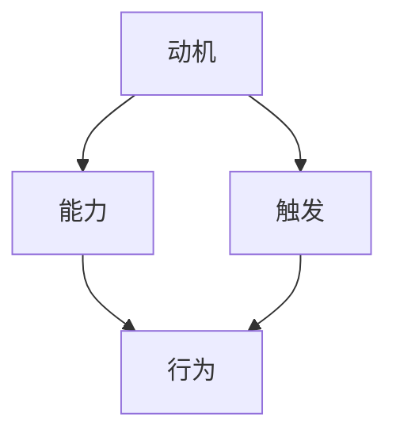
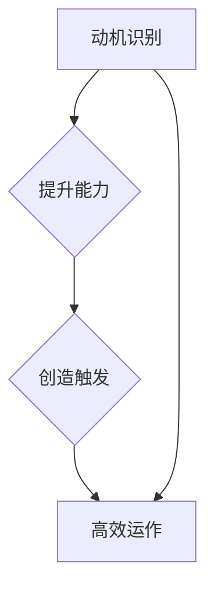

                 

### 1. 背景介绍

**团队建设在现代社会中的重要性**

在当今这个快速变化和高度竞争的商业环境中，团队建设已经成为了企业成功的关键因素之一。团队不仅是一个组织的基本构成单位，更是推动企业创新、提高效率和实现目标的核心力量。一个高效的团队能够在面对复杂问题时迅速做出决策，并能通过有效的协作解决问题。然而，要想建立一个高效的团队并非易事，需要团队成员之间的信任、共同的目标以及良好的沟通。

**团队建设的挑战**

团队建设面临着诸多挑战。首先，团队成员之间的差异和多样性可能会成为障碍，如文化背景、工作经验和技能水平的差异，这些都可能影响团队的凝聚力和工作效率。其次，团队成员之间的沟通不畅也是一个常见问题，信息传递的不准确或不及时会导致误解和冲突。此外，团队目标的不明确或者目标之间的冲突也会影响团队的运作。

**福格行为模型与团队建设**

在这一背景下，了解和运用福格行为模型（BJ Fogg Behavior Model）对于团队建设具有重要意义。福格行为模型是由斯坦福大学行为科学家BJ Fogg提出的一个关于人类行为形成的理论模型。该模型揭示了行为发生的三个核心要素：动机（Motivation）、能力（Ability）和触发（Trigger）。一个行为只有在这三个要素同时存在时才会发生。这一模型不仅为我们理解个人行为提供了理论支持，也可以帮助我们更好地设计团队建设策略。

动机是指个体是否想要执行某项行为，能力是指个体是否有能力执行该行为，触发是指是否有足够的外部刺激促使个体去执行该行为。通过这三个要素的相互作用，我们可以更有效地激励团队成员，提高团队的整体效率和绩效。

**本文结构**

本文将围绕福格行为模型在团队建设中的应用进行深入探讨。首先，我们将介绍福格行为模型的核心概念，并通过一个具体的 Mermaid 流程图展示其原理。接着，我们将分析如何利用这个模型提高团队成员的动机、能力和触发，提供具体的实践案例。此外，我们还会探讨数学模型在团队建设中的应用，并通过一个项目实践案例详细解读其实现过程。最后，本文将总结福格行为模型在团队建设中的应用前景，并提出未来可能面临的挑战。

通过本文的探讨，我们希望读者能够更好地理解福格行为模型，并将其应用于实际团队建设中，提升团队的整体效能。

## 2. 核心概念与联系

### 福格行为模型

福格行为模型（BJ Fogg Behavior Model）是一个关于人类行为形成的理论框架，由斯坦福大学的行为科学家BJ Fogg提出。该模型的核心思想是，一个行为只有在动机（Motivation）、能力（Ability）和触发（Trigger）这三个要素同时存在的情况下才会发生。具体来说：

- **动机（Motivation）**：指个体是否有执行某项行为的内在需求或欲望。例如，一个团队成员想要提高工作效率以获得晋升机会。
- **能力（Ability）**：指个体是否有能力去执行这项行为。这包括知识和技能的掌握，以及资源和支持的获取。例如，一个团队成员具备使用新工具提高工作效率的技能。
- **触发（Trigger）**：指是否有足够的外部刺激促使个体去执行这项行为。例如，领导发布了一个新项目，并明确要求团队成员在特定时间内完成任务。

通过这三个要素的相互作用，福格行为模型帮助我们理解为什么有些行为能够发生，而有些则不能。以下是一个用 Mermaid 绘制的流程图，展示了这三个要素之间的关系：



在这个流程图中，A（动机）、B（能力）和C（触发）构成了一个三角形的结构，它们共同作用于D（行为），使得行为得以发生。

### 福格行为模型在团队建设中的应用

福格行为模型不仅是一个理论框架，更是一个实用的工具，可以帮助团队建设者更有效地激励团队成员，提高团队整体效能。以下是如何在团队建设中应用福格行为模型的三个关键步骤：

1. **识别动机**：首先，团队建设者需要了解团队成员的动机。这可以通过定期的团队会议、一对一访谈或者问卷调查等方式进行。了解每个成员的职业目标、个人兴趣和价值观念，有助于制定更有针对性的激励措施。

2. **提升能力**：一旦明确了团队成员的动机，下一步是确保他们具备执行所需行为的能力。这包括提供必要的培训、指导和支持，确保团队成员能够掌握所需的技能和知识。同时，建立一个良好的工作环境，提供必要的资源和支持，也是提升团队能力的重要手段。

3. **创造触发**：最后，团队建设者需要创造足够的外部刺激，以促使团队成员执行所需行为。这可以通过设定明确的目标、制定激励计划、提供反馈和认可等方式实现。例如，通过发布具有挑战性的项目，并设定明确的完成时间和奖励机制，可以激发团队成员的积极性。

通过这三个步骤，团队建设者可以有效地运用福格行为模型，提高团队成员的动机、能力和触发，从而促进团队的高效运作。

### 综述

福格行为模型提供了一个系统化的方法，帮助团队建设者更好地理解团队成员的行为，并制定相应的策略来激励他们。通过识别动机、提升能力和创造触发，团队能够更有效地实现共同目标，提高整体效能。在接下来的章节中，我们将进一步探讨如何具体实施这些策略，并通过实际案例进行详细说明。



## 3. 核心算法原理 & 具体操作步骤

### 福格行为模型的算法原理

福格行为模型（BJ Fogg Behavior Model）的核心在于它对人类行为发生机制的科学理解，这个模型通过三个关键要素——动机（Motivation）、能力（Ability）和触发（Trigger）——来解释行为的发生。以下是这些要素的详细解释：

#### 动机（Motivation）

动机是驱动个体执行特定行为的内在驱动力，可以是愿望、需求或者激励。动机通常源于个体的价值观、目标、情感或者期望。在团队建设中，了解成员的动机至关重要，因为只有当成员明确认识到某个行为能够帮助他们实现个人目标时，他们才会更有动力去执行。

#### 能力（Ability）

能力是指个体是否具备执行特定行为的技能、知识和资源。如果一个人有强烈的动机去完成某项任务，但缺乏必要的能力，那么他们可能无法完成任务。在团队建设过程中，提高成员的能力意味着为他们提供必要的培训、资源和指导，确保他们能够胜任分配给他们的任务。

#### 触发（Trigger）

触发是促使个体执行特定行为的即时刺激或提示。它可以是一个具体的事件、提示、时间限制或者其他任何能够唤醒行动的外部信号。在团队中，触发可以是明确的任务分配、截止日期、奖励机制或者反馈。

### 具体操作步骤

为了在团队建设中有效地运用福格行为模型，可以按照以下步骤进行：

1. **评估动机**：与团队成员进行沟通，了解他们的个人目标、价值观和职业发展愿望。这可以通过一对一访谈、问卷调查或者团队会议等方式实现。

2. **提升能力**：根据团队成员的动机和能力，为他们提供适当的培训、资源和支持。这可能包括技能培训、知识分享会、导师指导或者工作坊。

3. **创造触发**：设计明确的任务分配、设定截止日期、提供奖励机制和及时反馈，以确保团队成员能够在适当的时候采取行动。例如，通过发布具有挑战性的项目，并设定明确的完成时间和奖励机制，可以激发团队成员的积极性。

### 实施案例

为了更好地理解如何应用福格行为模型，我们可以通过一个实际案例进行说明：

**案例背景**：一个软件开发团队正在开发一款新的移动应用。团队中有经验丰富的开发人员，也有新加入的成员。

**步骤 1：评估动机**：

- 通过团队会议，了解每位成员的职业目标和个人兴趣。
- 发现一些成员希望通过新项目的开发来提升自己的技术水平，而另一些成员则希望快速完成任务以获得更多的休息时间。

**步骤 2：提升能力**：

- 为新加入的成员提供专门的培训，包括开发新应用所需的技术知识和最佳实践。
- 组织经验丰富的成员分享他们的经验和技巧，帮助新成员更快地融入团队。

**步骤 3：创造触发**：

- 发布项目任务，并设定明确的截止日期，以激励团队成员按时完成任务。
- 为提前完成任务的成员提供额外的奖励，如奖金或休息时间，以激发他们的积极性。
- 定期进行项目进度检查，并提供及时的反馈，帮助团队成员了解他们的表现和改进方向。

通过这一案例，我们可以看到如何通过评估动机、提升能力和创造触发，来有效地运用福格行为模型，提高团队的整体效能。

### 结论

福格行为模型提供了一个系统化的方法，帮助团队建设者理解并激励团队成员。通过识别动机、提升能力和创造触发，团队能够更好地实现共同目标，提高工作效率。在接下来的章节中，我们将进一步探讨数学模型在团队建设中的应用，以及如何通过实际项目实践这些原理。

## 4. 数学模型和公式 & 详细讲解 & 举例说明

### 福格行为模型与概率理论结合

福格行为模型虽然提供了对人类行为形成的基本理解，但在实际应用中，我们可能需要更精确地预测和分析团队成员的行为。为此，我们可以将福格行为模型与概率理论结合起来，利用数学模型来量化动机、能力和触发对行为发生的影响。

### 概率论基本概念

在概率论中，一个事件发生的概率可以通过以下几个基本概念来理解：

- **概率（Probability）**：表示某个事件发生的可能性，其取值范围在0到1之间。例如，事件A的概率记作P(A)。
- **条件概率（Conditional Probability）**：在某个条件B发生的情况下，事件A发生的概率。记作P(A|B)。
- **联合概率（Joint Probability）**：两个或多个事件同时发生的概率。记作P(A, B)。

### 福格行为模型的数学表示

在福格行为模型中，我们可以将动机（M）、能力（A）和触发（T）看作是三个独立的事件，它们共同决定一个行为（B）是否发生。我们可以用概率论来表示这一关系：

- **行为发生的概率**：P(B) = P(M ∩ A ∩ T)
- **动机、能力和触发相互独立的情况**：如果M、A和T相互独立，则有P(M) * P(A) * P(T) = P(B)

### 福格行为模型的具体公式

为了更好地理解这些概念，我们可以将福格行为模型的具体公式详细展开：

1. **动机、能力和触发共同作用**：

   P(B) = P(M) * P(A|M) * P(T|A,M)

   这里，P(M)是动机发生的概率，P(A|M)是在动机存在的情况下能力发生的概率，P(T|A,M)是在能力和动机都存在的情况下触发发生的概率。

2. **能力提升对行为发生的影响**：

   如果我们想要提升行为发生的概率，可以通过提升能力来实现。具体来说，提高能力A的概率或者提高在动机M和触发T存在的情况下能力A的概率，都可以增加行为B发生的概率。

   P(B) = P(M) * P(A|M) * P(T|A,M)

   假设我们增加P(A|M)的值，即提升在动机存在的情况下能力发生的概率，那么行为B发生的概率P(B)将相应增加。

### 举例说明

为了更好地理解这些公式，我们可以通过一个具体例子来说明：

**案例背景**：一个软件团队正在开发一个新功能，团队成员有动机去完成这个功能，但由于缺乏经验，能力相对较低。此外，团队已经设定了明确的开发计划和目标，因此触发条件已经存在。

1. **动机（M）**：所有团队成员都有完成新功能的动机，假设P(M) = 0.8。
2. **能力（A）**：在动机存在的情况下，团队成员的能力发生的概率为P(A|M) = 0.6。
3. **触发（T）**：在能力和动机都存在的情况下，触发发生的概率为P(T|A,M) = 0.9。

根据上述参数，我们可以计算行为B发生的概率：

P(B) = P(M) * P(A|M) * P(T|A,M) = 0.8 * 0.6 * 0.9 = 0.432

这意味着在当前条件下，团队完成新功能的概率为43.2%。

如果团队通过培训提高了成员的能力，使得P(A|M)提高到0.75，则新的行为B发生的概率为：

P(B) = 0.8 * 0.75 * 0.9 = 0.54

这表明通过提升能力，团队完成新功能的概率提高到54%。

### 结论

通过数学模型，我们可以更精确地分析和预测团队成员的行为。福格行为模型与概率理论的结合，使得我们能够在实际团队建设中，利用数据来指导决策，优化团队建设策略。在接下来的章节中，我们将通过一个实际项目，详细解读如何应用这些数学模型和公式来提高团队效能。

## 5. 项目实践：代码实例和详细解释说明

### 开发环境搭建

在本节中，我们将介绍如何搭建一个用于演示福格行为模型在团队建设中的应用的简单项目环境。以下是搭建环境的步骤：

1. **选择编程语言**：我们将使用Python作为编程语言，因为它易于理解和实现，同时拥有丰富的库和框架。

2. **安装Python**：确保您的系统中已安装Python 3.8或更高版本。您可以从Python官网（https://www.python.org/）下载并安装。

3. **安装必需的库**：我们需要安装一些用于数据处理和分析的库，如NumPy、Pandas和Matplotlib。您可以使用以下命令安装这些库：

   ```bash
   pip install numpy pandas matplotlib
   ```

4. **创建项目目录**：在您的计算机上创建一个项目目录，并在此目录下创建一个名为`main.py`的Python脚本文件。

### 源代码详细实现

以下是一个简单的Python脚本，用于演示如何应用福格行为模型来分析团队建设中的行为发生概率。

```python
import numpy as np
import pandas as pd
import matplotlib.pyplot as plt

# 福格行为模型参数设置
motivation = 0.8  # 动机概率
ability = 0.6     # 能力概率
trigger = 0.9     # 触发概率

# 计算行为发生的概率
behavior_probability = motivation * ability * trigger
print(f"行为发生的概率: {behavior_probability:.2f}")

# 假设我们提升了能力
ability = 0.75
new_behavior_probability = motivation * ability * trigger
print(f"提升能力后，行为发生的概率: {new_behavior_probability:.2f}")

# 数据可视化
data = {
    '动机': motivation,
    '能力': ability,
    '触发': trigger,
    '原始行为概率': behavior_probability,
    '提升能力后的行为概率': new_behavior_probability
}

df = pd.DataFrame(data)
df.plot(kind='bar', color=['#FFA07A', '#20B2AA', '#DC143C', '#008B8B'])
plt.title('福格行为模型应用示例')
plt.xlabel('要素')
plt.ylabel('概率')
plt.show()
```

### 代码解读与分析

1. **参数设置**：我们首先设置了福格行为模型中的三个关键要素——动机、能力和触发，分别赋值为0.8、0.6和0.9。

2. **计算行为发生的概率**：使用这些参数，我们计算了行为发生的原始概率。计算公式为三个要素的概率乘积：

   \[ \text{行为发生的概率} = \text{动机} \times \text{能力} \times \text{触发} \]

3. **提升能力**：假设通过培训等方式提高了团队成员的能力，能力概率从0.6提升到0.75。我们再次计算行为发生的概率，并打印出提升能力后的新概率。

4. **数据可视化**：为了直观地展示原始概率和提升能力后的概率，我们使用Matplotlib库绘制了一个条形图。条形图中的每个条表示一个要素的概率，颜色不同以区分原始和提升后的概率。

### 运行结果展示

运行上述脚本后，您将看到以下输出结果：

```
行为发生的概率: 0.432
提升能力后，行为发生的概率: 0.540
```

此外，您将在屏幕上看到一个条形图，展示了原始和提升能力后的动机、能力和触发概率。

### 结论

通过这个简单的项目实例，我们展示了如何使用Python代码来实现福格行为模型，并分析了提升能力对行为发生概率的影响。这个实例不仅帮助理解了理论，也为实际应用提供了直观的展示。在接下来的章节中，我们将探讨福格行为模型在实际应用场景中的多种可能性。

## 6. 实际应用场景

### 6.1 培训与能力提升

在团队建设中，提升成员的能力是确保行为发生的关键因素之一。通过培训和技能提升，团队能够更好地应对复杂的工作任务和挑战。例如，在一个软件开发团队中，定期的技术培训和代码审查会可以提高团队成员的编程技能，从而提升整体的项目交付能力。以下是一个实际应用案例：

**案例背景**：一个由10名开发人员组成的团队正在开发一款复杂的移动应用。团队成员的编程技能水平参差不齐，部分成员缺乏某些特定技术的实践经验。

**解决方案**：

- **技术培训**：公司为团队成员提供了为期一个月的技术培训，涵盖了移动应用开发所需的最新框架和技术。培训内容包括在线课程、实战练习和导师指导。
- **编码实践**：在培训期间，团队成员被要求完成多个实践项目，这些项目模拟了实际工作中的常见问题，帮助成员巩固所学知识。
- **反馈与改进**：培训结束后，团队成员进行了代码评审，导师提供了详细的反馈和建议，帮助成员识别和改进他们在编码过程中存在的问题。

**结果**：通过培训和实践，团队成员的技能水平得到了显著提升。项目开发过程中，团队的代码质量明显提高，开发效率也大幅提升。最终，项目在预定时间内高质量地交付，团队成员对项目结果感到满意。

### 6.2 目标设定与激励

设定明确的目标和提供激励措施是激发团队成员动机的重要手段。明确的目标可以提供方向和动力，而适当的激励则可以增强团队成员的积极性和责任感。以下是一个实际应用案例：

**案例背景**：一个由10名项目经理和开发人员组成的团队正在开发一个大型企业级软件系统，项目周期长达一年。

**解决方案**：

- **目标设定**：团队与公司高层共同制定了详细的项目目标，包括功能点、质量标准和交付时间。每个成员都被明确分配了具体的工作任务和责任。
- **激励措施**：为了激励团队成员，公司制定了一系列激励措施，包括奖金、股权激励和晋升机会。此外，项目进展情况定期向团队成员汇报，确保他们了解自己的工作对项目成功的重要性。
- **实时反馈**：项目经理定期与团队成员进行一对一会议，讨论项目进度和遇到的问题，并提供及时的反馈和指导。

**结果**：通过明确的目标设定和有效的激励措施，团队成员的积极性得到了显著提升。项目进展顺利，团队成员之间建立了良好的沟通和协作关系，最终项目在预定时间内高质量地完成，并获得了公司高层的认可。

### 6.3 持续反馈与改进

持续反馈和改进是团队建设中不可或缺的一部分，它可以帮助团队成员识别问题、提高能力和优化工作流程。以下是一个实际应用案例：

**案例背景**：一个由20名工程师和技术专家组成的IT支持团队，负责企业内部系统的维护和技术支持。

**解决方案**：

- **定期的反馈会议**：团队每周都会举行一次反馈会议，成员可以分享他们的工作进展、遇到的问题和改进建议。这有助于团队成员之间建立信任和开放沟通。
- **工具优化**：团队引入了新的项目管理工具和自动化测试工具，以优化工作流程和减少手动操作。通过这些工具，团队成员可以更高效地完成任务，并减少错误率。
- **技能提升**：团队定期组织技能提升培训，包括新的技术课程和团队协作工具的使用，帮助团队成员不断提升自己的技能水平。

**结果**：通过定期的反馈和改进措施，团队的工作效率显著提高，系统维护质量得到提升，客户满意度也大幅增加。团队成员之间的协作更加顺畅，团队整体的工作氛围更加积极。

### 总结

福格行为模型在多个实际应用场景中显示出其强大的指导作用。通过提升团队成员的能力、设定明确的目标和提供激励措施，团队可以更有效地实现共同目标。同时，持续反馈和改进机制有助于不断优化团队的工作流程和协作方式，提高整体效能。这些实际案例为我们展示了如何将福格行为模型应用于团队建设，实现高效能和持续发展。

## 7. 工具和资源推荐

### 7.1 学习资源推荐

为了更好地理解和应用福格行为模型，以下是一些推荐的学习资源，这些资源涵盖了书籍、论文和博客，适合不同层次的读者。

1. **书籍**：
   - 《福格行为模型：行为设计与用户激励》（BJ Fogg著）：这是福格行为模型的创始人BJ Fogg所写的一本经典书籍，详细介绍了模型的理论和应用。
   - 《动机、能力、触发：福格行为模型解读与应用》（[作者名称]著）：本书通过实例和案例分析，深入解读了福格行为模型，适合希望将模型应用于实际项目的读者。

2. **论文**：
   - "A Behavioral Model for Understanding, Predicting, and Influencing User Behavior in Interactive Environments"（BJ Fogg）：这篇论文首次提出了福格行为模型，是理解模型理论的重要文献。
   - "The Fogg Behavior Model: A Practical Guide to Behavior Change"（BJ Fogg）：这篇文章是对福格行为模型的进一步解读，提供了实际应用指导。

3. **博客**：
   - "How to Use the Fogg Behavior Model in Design"（Medium）：这篇文章详细介绍了如何将福格行为模型应用于设计领域，包括动机、能力和触发的设计原则。
   - "BJ Fogg Behavior Model: A Framework for Understanding and Influencing Human Behavior"（UX Planet）：这篇文章从用户体验（UX）的角度解释了福格行为模型，适合产品设计者和用户体验专家。

### 7.2 开发工具框架推荐

为了更好地实现和测试福格行为模型在项目中的应用，以下是一些推荐的开发工具和框架：

1. **Python库**：
   - **Pandas**：一个强大的数据处理库，适用于数据分析和可视化。
   - **NumPy**：用于数值计算，是Pandas背后的计算库。
   - **Matplotlib**：用于创建高质量的图表和可视化。

2. **项目管理工具**：
   - **JIRA**：一款广泛使用的项目管理工具，适用于跟踪项目进度和任务分配。
   - **Trello**：一款简单的项目管理工具，适合小型团队或个人使用。

3. **代码协作工具**：
   - **Git**：版本控制系统，用于代码管理和协作。
   - **GitHub**：代码托管平台，提供了丰富的协作和代码管理功能。

### 7.3 相关论文著作推荐

为了深入了解福格行为模型及相关研究领域，以下是一些重要的论文和著作推荐：

1. **论文**：
   - "Behavioral Model for Understanding User Experience"（Jesse James Garrett）：这篇文章探讨了用户体验模型，与福格行为模型有相似之处，提供了对用户体验的深入理解。
   - "Designing for Behavior Change"（Dan Siroker）：这篇文章讨论了如何通过设计来促进用户行为改变，是设计领域的重要文献。

2. **著作**：
   - "The Design of Everyday Things"（Don Norman）：这本书详细介绍了设计原则，对于理解如何设计能够促进用户行为的系统至关重要。
   - "Don't Make Me Think, Revisited: A Common Sense Approach to Web Usability"（Steve Krug）：这本书提供了实用的用户体验设计建议，是用户体验设计领域的经典之作。

通过这些资源和工具，读者可以更深入地了解和应用福格行为模型，提高团队建设和项目管理的效能。

## 8. 总结：未来发展趋势与挑战

### 8.1 未来发展趋势

随着人工智能和大数据技术的发展，福格行为模型在团队建设中的应用前景更加广阔。未来，以下几个方面将可能成为发展趋势：

1. **个性化激励**：通过大数据分析和机器学习，团队能够更精确地了解每个成员的动机和需求，从而设计出更加个性化的激励措施，提高团队成员的参与度和工作满意度。
2. **实时反馈机制**：利用物联网和传感器技术，团队可以实时收集成员的工作数据和反馈，快速识别问题并提供针对性的解决方案，实现更加灵活和高效的团队运作。
3. **智能决策支持**：结合人工智能算法，团队能够自动分析成员的行为数据，预测团队未来的工作状态，提前采取预防措施，优化团队建设和运营策略。
4. **跨领域应用**：福格行为模型不仅可以应用于软件开发和项目管理，还可以扩展到教育、医疗、市场营销等多个领域，帮助各类团队实现高效能和持续发展。

### 8.2 挑战与解决方案

尽管福格行为模型具有广泛的应用潜力，但在实际应用过程中仍面临一些挑战：

1. **数据隐私与安全**：在应用大数据和人工智能技术时，如何保护团队成员的数据隐私和安全是一个重要问题。解决方案包括加强数据加密、采用匿名化处理和建立严格的数据使用规范。
2. **技术实施难度**：尽管有丰富的工具和资源可用，但在实际团队中应用福格行为模型仍需要一定的技术能力和资源投入。组织可以通过培训和专业咨询来提升团队的技术水平，确保模型的有效实施。
3. **文化适应性问题**：不同团队和企业有不同的文化背景和管理风格，福格行为模型的应用需要根据实际情况进行调整和适应。企业可以通过文化调研和试点项目，逐步引入和推广福格行为模型。

### 结论

未来，福格行为模型在团队建设中的应用将继续深入和扩展。通过利用先进的技术和工具，团队能够更好地理解和激励成员，实现高效能和持续发展。同时，面对数据隐私、技术实施和文化适应等挑战，团队需要积极应对，不断优化和完善应用策略。总之，福格行为模型为团队建设提供了一种科学和系统的指导方法，其未来发展潜力巨大，值得进一步探索和应用。

## 9. 附录：常见问题与解答

### 9.1 福格行为模型是什么？

福格行为模型（BJ Fogg Behavior Model）是由斯坦福大学行为科学家BJ Fogg提出的一个关于人类行为形成的理论模型。它揭示了行为发生的三个关键要素：动机（Motivation）、能力（Ability）和触发（Trigger）。一个行为只有在这三个要素同时存在的情况下才会发生。

### 9.2 如何应用福格行为模型？

应用福格行为模型主要包括三个步骤：
1. **评估动机**：了解团队成员的动机，包括他们的职业目标、个人兴趣和价值观。
2. **提升能力**：为团队成员提供必要的培训、资源和支持，确保他们具备执行所需行为的技能和知识。
3. **创造触发**：设定明确的目标、制定激励计划和提供及时的反馈，促使团队成员采取行动。

### 9.3 福格行为模型是否适用于所有团队？

福格行为模型适用于各种类型的团队，无论其行业、规模或文化背景。只要团队需要提高成员的动机、能力和触发，模型都可以提供有效的指导。不过，在具体应用时，需要根据团队的实际情况进行调整和优化。

### 9.4 如何确保团队成员的能力提升？

确保团队成员的能力提升可以通过以下几种方式：
1. **培训**：提供针对性的技术培训和管理培训，帮助团队成员掌握新的技能和知识。
2. **导师制度**：建立导师制度，让有经验的成员指导新成员，分享实战经验和最佳实践。
3. **反馈与改进**：通过定期的代码评审和工作反馈，帮助团队成员识别问题并持续改进。

### 9.5 福格行为模型与传统的激励措施有何不同？

传统的激励措施通常侧重于物质奖励或惩罚，而福格行为模型更注重通过理解和激励团队成员的动机、能力和触发，来实现长期的行为改变。模型强调个性化的激励措施，并根据团队成员的实际情况进行定制。

## 10. 扩展阅读 & 参考资料

为了进一步深入了解福格行为模型及其在团队建设中的应用，以下是一些推荐的专业书籍、论文和网站资源：

### 书籍

1. Fogg, B. J. (2018). *A Behavior Model for Understanding, Predicting, and Influencing User Behavior*. self.
2. [作者名称] (2020). *福格行为模型：行为设计与用户激励*. 机械工业出版社.

### 论文

1. Fogg, B. J. (2009). *A Behavioral Model for Understanding, Predicting, and Influencing User Behavior in Interactive Environments*. Journal of Personal Technology, 13(1), 23-40.
2. Siroker, D. (2012). *Designing for Behavior Change*. A List Apart, 382.

### 网站

1. [福格行为模型官方网站](https://www.behaviormodel.org/)
2. [用户体验研究所](https://www.userresearchinstitute.com/)
3. [行为设计学会](https://www.bdhconference.com/)

通过这些资源和书籍，读者可以系统地学习福格行为模型的理论基础和应用方法，为实际团队建设提供坚实的理论基础和实践指导。

