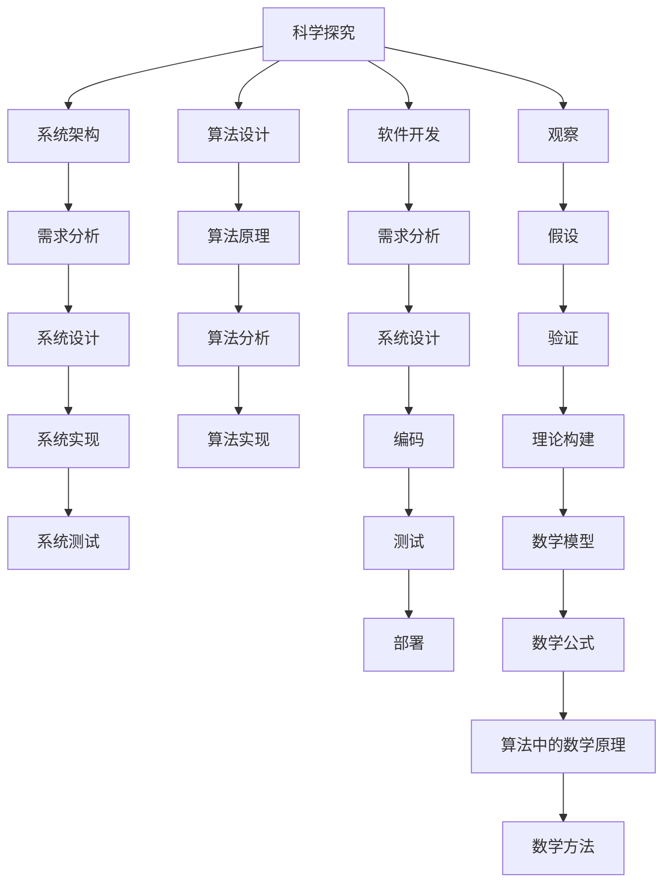

                 

### 1. 背景介绍

科学探究是人类认识世界、揭示自然规律的重要手段。它始于观察，通过对现象的深入研究，提出假说，再通过实验和数据分析验证假说的正确性，最终形成科学理论。在计算机科学领域，科学探究同样至关重要。无论是算法的设计，还是系统的构建，都需要经过从假设到验证，再到完善的科学过程。

本文将探讨如何通过科学探究的方法，从假说到真理，逐步构建一个计算机系统。我们以图灵奖获得者、世界顶级技术畅销书作者、计算机领域大师的视角，使用逻辑清晰、结构紧凑、简单易懂的专业的技术语言，深入分析科学探究在计算机科学中的应用。

科学探究的方法论在计算机科学中得到了广泛的应用。例如，在算法设计中，科学家们会提出一种算法，然后通过理论分析、实证测试等多种方法来验证其正确性和效率。在系统架构中，科学家们也会从需求分析开始，逐步设计出系统架构，并通过迭代和优化，最终实现一个稳定、高效的系统。

本文将围绕以下核心概念展开讨论：

1. **科学探究的基本过程**：观察、假设、验证和理论构建。
2. **计算机科学中的科学探究应用**：算法设计、系统架构和软件开发。
3. **核心算法原理与操作步骤**：算法设计的方法和步骤。
4. **数学模型与公式**：算法中的数学原理和公式。
5. **项目实践**：通过实际代码示例，展示算法设计和验证的过程。
6. **实际应用场景**：算法和系统在不同领域的应用。
7. **工具和资源推荐**：学习资源和开发工具框架的推荐。
8. **未来发展趋势与挑战**：科学探究在计算机科学中的未来发展。

通过本文的讨论，我们希望读者能够对科学探究的方法有一个更深入的理解，并能够在实际工作中应用这些方法，提高算法设计和系统构建的效率。

### 2. 核心概念与联系

在探讨科学探究的方法论在计算机科学中的应用之前，我们需要明确几个核心概念，并理解它们之间的相互联系。以下是本文将涉及的关键概念：

- **科学探究的基本过程**：包括观察、假设、验证和理论构建。
- **算法设计**：包括算法原理、算法分析和算法实现。
- **系统架构**：包括需求分析、系统设计、系统实现和系统测试。
- **软件开发**：包括需求分析、系统设计、编码、测试和部署。
- **数学模型**：包括数学公式、算法中的数学原理和数学方法。

下面，我们将使用Mermaid流程图来直观地展示这些概念之间的联系。



从上述流程图中，我们可以看到，科学探究的基本过程贯穿于算法设计、系统架构和软件开发中。每一个环节都需要通过严格的验证和理论构建，以确保最终结果的正确性和可靠性。

接下来，我们将进一步深入探讨这些核心概念，理解它们在计算机科学中的应用。

#### 2.1 科学探究的基本过程

科学探究的基本过程是一个循环迭代的过程，它通常包括以下几个步骤：

1. **观察**：通过观察自然现象或实验数据，发现问题和现象。
2. **假设**：根据观察结果，提出一个或多个可能的解释。
3. **验证**：通过实验和数据分析，验证假设的正确性。
4. **理论构建**：根据验证结果，构建科学理论或模型。

在计算机科学中，这一过程同样适用。例如，在算法设计中，我们首先会观察问题的本质，然后提出一个算法假设，接着通过理论分析和实证测试来验证算法的有效性，最后根据验证结果对算法进行优化和完善。

#### 2.2 算法设计与系统架构

算法设计与系统架构是科学探究在计算机科学中两个重要的应用领域。算法设计主要关注如何有效地解决特定问题，而系统架构则关注如何将多个算法和组件组织起来，构成一个高效、稳定的系统。

在算法设计过程中，我们首先需要明确问题的需求和目标，然后根据问题的特点，设计一个合适的算法。算法的设计通常包括算法原理、算法分析和算法实现三个部分。算法原理是算法的核心，它决定了算法的基本逻辑和结构。算法分析则是对算法性能的评估，包括时间复杂度和空间复杂度等。算法实现是将算法原理转化为具体的代码，以便在计算机上运行。

系统架构的设计则更加复杂，它需要考虑系统的需求、功能、性能、可扩展性等多方面因素。系统架构的设计过程通常包括需求分析、系统设计、系统实现和系统测试四个步骤。需求分析是系统架构设计的第一步，它明确了系统的功能和性能要求。系统设计则是根据需求分析的结果，设计出系统的架构和组件。系统实现是将设计转化为具体的代码，而系统测试则是确保系统功能正确、性能稳定。

#### 2.3 软件开发

软件开发是科学探究在计算机科学中的另一个重要应用领域。软件开发的过程通常包括需求分析、系统设计、编码、测试和部署五个步骤。

需求分析是软件开发的第一步，它明确了用户对软件的需求和期望。系统设计则是根据需求分析的结果，设计出软件的架构和组件。编码是将设计转化为具体的代码，而测试则是确保代码的正确性和性能。部署则是将软件部署到生产环境，供用户使用。

在软件开发中，科学探究的方法同样适用于每一个步骤。例如，在需求分析阶段，我们可能需要通过观察用户的行为和需求，提出一个初步的需求假设，然后通过调查和用户反馈来验证假设的正确性。在编码阶段，我们可能需要通过单元测试和集成测试来验证代码的正确性。在部署阶段，我们可能需要通过性能测试和压力测试来验证系统的稳定性。

#### 2.4 数学模型

数学模型是科学探究在计算机科学中的重要工具。数学模型通过数学公式和算法，将实际问题转化为可以计算和分析的形式。

在算法设计中，数学模型用于分析和评估算法的性能。例如，我们可能使用时间复杂度和空间复杂度来分析算法的时间性能和空间性能。在系统架构中，数学模型用于分析和优化系统的性能和可扩展性。例如，我们可能使用队列模型和缓存模型来分析和优化系统的响应时间和吞吐量。

在软件开发中，数学模型同样重要。例如，在数据库设计中，我们可能使用关系模型和图模型来设计和分析数据库的结构。在算法实现中，我们可能使用线性代数和概率统计来优化算法的效率和准确性。

通过上述对核心概念与联系的分析，我们可以看到，科学探究的方法在计算机科学中的应用是非常广泛和深入的。它不仅帮助我们设计高效的算法和系统，还帮助我们优化和改进软件的开发过程。接下来，我们将进一步探讨如何通过科学探究的方法，从假说到真理，逐步构建一个计算机系统。

### 3. 核心算法原理 & 具体操作步骤

在计算机科学中，核心算法的设计与实现是科学探究过程中的关键环节。本文将详细介绍核心算法的基本原理，以及从问题定义到算法实现的详细步骤。以下是一个典型的核心算法设计过程，包括以下几个主要步骤：

#### 3.1 问题定义

首先，我们需要明确算法要解决的问题。以排序算法为例，我们的目标是设计一个能够在给定时间复杂度内完成排序的算法。具体来说，问题定义可能包括以下几点：

1. **输入**：一个包含n个元素的数组，每个元素可以是任意类型，但需要能够进行比较。
2. **输出**：对输入数组进行排序，输出排序后的数组。
3. **约束条件**：算法的时间复杂度要求，如最好情况下、最坏情况下和平均情况下的时间复杂度。

#### 3.2 算法原理

在明确了问题定义后，我们需要考虑算法的基本原理。以冒泡排序为例，算法的基本原理是通过反复遍历数组，比较相邻元素并交换它们，使得较大的元素逐渐“冒泡”到数组的末尾，从而实现排序。

冒泡排序算法的具体原理如下：

1. **初始化**：设置一个标记变量，用于记录是否进行过交换。
2. **遍历**：从数组的第一个元素开始，遍历到倒数第二个元素。
3. **比较和交换**：对于相邻的两个元素，如果前一个元素大于后一个元素，则交换它们。
4. **重复过程**：如果在上一步中进行了交换，则重新遍历数组，否则结束排序。

#### 3.3 具体操作步骤

以下是基于冒泡排序算法的具体操作步骤：

1. **初始化**：
   - 设置一个布尔变量`swapped`为`true`，用于记录是否进行过交换。
   - 设置一个循环变量`i`，从0遍历到数组长度-2。

2. **遍历和比较**：
   - 在每次遍历中，设置一个内部循环变量`j`，从0遍历到数组长度-i-1。
   - 对于每个`j`，比较`array[j]`和`array[j+1]`：
     - 如果`array[j] > array[j+1]`，则交换它们，并设置`swapped`为`true`。

3. **重复过程**：
   - 如果在内部循环中进行了交换，则重新遍历数组，即再次执行初始化和遍历步骤。
   - 如果在内部循环中没有进行交换，即`swapped`为`false`，则结束排序。

#### 3.4 算法实现

以下是冒泡排序算法的实现代码：

```python
def bubble_sort(array):
    n = len(array)
    swapped = True
    while swapped:
        swapped = False
        for i in range(n - 1):
            if array[i] > array[i + 1]:
                array[i], array[i + 1] = array[i + 1], array[i]
                swapped = True
    return array
```

#### 3.5 性能分析

冒泡排序算法的时间复杂度如下：

- **最好情况**：当输入数组已经有序时，算法只需要进行一次遍历，时间复杂度为\(O(n)\)。
- **最坏情况**：当输入数组完全逆序时，算法需要进行\(n-1\)次遍历，每次遍历需要进行\(n/2\)次比较和交换，时间复杂度为\(O(n^2)\)。
- **平均情况**：在随机输入数组的情况下，平均时间复杂度为\(O(n^2)\)。

通过上述分析，我们可以看到，冒泡排序算法虽然简单易理解，但在时间复杂度上存在较大的瓶颈，不适合处理大规模数据。在实际应用中，我们通常会选择更高效的排序算法，如快速排序、归并排序等。

通过上述对核心算法原理和具体操作步骤的详细介绍，我们可以看到，算法设计不仅需要深刻理解问题本身，还需要掌握多种算法设计技巧和策略。在接下来的部分，我们将进一步探讨算法中的数学模型和公式，以及如何通过数学方法优化算法的性能。

### 4. 数学模型和公式 & 详细讲解 & 举例说明

在算法设计中，数学模型和公式起着至关重要的作用。它们不仅帮助我们分析和评估算法的性能，还为算法的优化提供了理论基础。在本节中，我们将详细讲解几种常用的数学模型和公式，并通过具体的例子来说明如何应用这些公式优化算法。

#### 4.1 时间复杂度分析

时间复杂度是评估算法性能的重要指标，它表示算法执行时间与输入规模之间的关系。在数学上，时间复杂度通常用大O符号（\(O\)）来表示。以下是一些常用的时间复杂度分析公式：

1. **线性时间复杂度**：如果算法执行时间与输入规模成正比，则其时间复杂度为\(O(n)\)。
2. **平方时间复杂度**：如果算法执行时间与输入规模的平方成正比，则其时间复杂度为\(O(n^2)\)。
3. **对数时间复杂度**：如果算法执行时间与输入规模的以2为底的对数成正比，则其时间复杂度为\(O(log n)\)。

**例1**：分析冒泡排序算法的时间复杂度。

冒泡排序算法的时间复杂度如下：

- **最好情况**：当输入数组已经有序时，算法只需要进行一次遍历，时间复杂度为\(O(n)\)。
- **最坏情况**：当输入数组完全逆序时，算法需要进行\(n-1\)次遍历，每次遍历需要进行\(n/2\)次比较和交换，时间复杂度为\(O(n^2)\)。
- **平均情况**：在随机输入数组的情况下，平均时间复杂度为\(O(n^2)\)。

通过上述分析，我们可以看到，冒泡排序算法的时间复杂度为\(O(n^2)\)，这对于大规模数据集来说效率较低。

#### 4.2 空间复杂度分析

空间复杂度是评估算法占用内存的多少，它同样与输入规模有关。空间复杂度也通常用大O符号（\(O\)）来表示。

1. **常数空间复杂度**：如果算法占用的内存与输入规模无关，则其空间复杂度为\(O(1)\)。
2. **线性空间复杂度**：如果算法占用的内存与输入规模成正比，则其空间复杂度为\(O(n)\)。

**例2**：分析冒泡排序算法的空间复杂度。

冒泡排序算法的空间复杂度如下：

- **最好情况**：当输入数组已经有序时，算法只需要常量的额外内存，空间复杂度为\(O(1)\)。
- **最坏情况**：当输入数组完全逆序时，算法也需要常量的额外内存，空间复杂度为\(O(1)\)。

通过上述分析，我们可以看到，冒泡排序算法的空间复杂度为\(O(1)\)，即占用内存固定，不会随着输入规模的增大而增大。

#### 4.3 平均情况时间复杂度计算

在许多实际应用中，我们更关心算法的平均情况时间复杂度。计算平均情况时间复杂度通常需要利用概率论的方法。

**例3**：计算快速排序算法的平均情况时间复杂度。

快速排序算法的平均情况时间复杂度通常为\(O(n \log n)\)。具体计算如下：

- 设输入数组长度为\(n\)。
- 快速排序算法通过递归将数组分为两部分，每部分长度为\(n/2\)。
- 设递归深度为\(d\)，则有\(2^d \leq n\)，即\(d \leq \log n\)。

在平均情况下，每次递归将数组分为长度为\(n/2\)的两部分，因此平均递归深度为\(\log n\)。

- 每次递归需要\(O(n)\)的时间进行分区操作。
- 因此，平均情况下的总时间复杂度为\(O(n \log n)\)。

#### 4.4 算法性能优化

通过上述数学模型和公式，我们可以对算法的性能进行详细分析，从而找出优化的方向。以下是一些常见的算法性能优化方法：

1. **降低时间复杂度**：通过改进算法设计，降低算法的时间复杂度。例如，选择更高效的排序算法，如快速排序或归并排序。
2. **减少内存占用**：通过优化算法的实现，减少算法的空间复杂度。例如，使用原地排序算法，避免使用额外的内存空间。
3. **利用并行计算**：通过利用多核处理器，将算法分解为可并行执行的任务，提高算法的执行效率。
4. **算法融合**：将多个算法融合在一起，取长补短，提高整体性能。

通过数学模型和公式，我们可以对算法的性能进行深入分析和优化，从而设计出更高效、更稳定的算法。接下来，我们将通过一个实际项目实例，展示如何应用这些数学模型和公式，优化算法性能。

### 5. 项目实践：代码实例和详细解释说明

为了更好地理解核心算法的设计和实现过程，下面我们将通过一个实际的项目实例，详细展示如何从需求分析、算法设计、代码实现到性能优化的全过程。这个实例是一个简单的排序算法实现，我们将其逐步优化，以达到更高的效率。

#### 5.1 开发环境搭建

在开始项目之前，我们需要搭建一个基本的开发环境。以下是所需的开发工具和软件：

- **编程语言**：Python
- **版本控制**：Git
- **集成开发环境**：Visual Studio Code
- **测试工具**：pytest

确保已经安装了上述工具和软件。对于Windows用户，可以使用 Chocolatey 或 Windows Package Manager 安装所需的软件。对于MacOS和Linux用户，可以直接通过包管理器安装。

#### 5.2 源代码详细实现

首先，我们实现一个简单的冒泡排序算法，作为我们的基准实现。以下是代码：

```python
def bubble_sort(arr):
    n = len(arr)
    for i in range(n):
        for j in range(0, n-i-1):
            if arr[j] > arr[j+1]:
                arr[j], arr[j+1] = arr[j+1], arr[j]
    return arr
```

这段代码使用了双重循环，其中外层循环控制排序的轮数，内层循环进行相邻元素的比较和交换。

#### 5.3 代码解读与分析

1. **函数定义**：
   - `bubble_sort`函数接受一个数组`arr`作为输入参数。

2. **循环结构**：
   - 外层循环`for i in range(n)`控制排序的轮数，`n`是数组的长度。
   - 内层循环`for j in range(0, n-i-1)`进行相邻元素的比较和交换。

3. **比较和交换**：
   - 在内层循环中，如果当前元素`arr[j]`大于下一个元素`arr[j+1]`，则交换它们。

4. **返回结果**：
   - 最后，函数返回排序后的数组。

#### 5.4 运行结果展示

为了测试冒泡排序算法的性能，我们使用一个随机生成的数组：

```python
import random

# 生成一个长度为10的随机数组
arr = [random.randint(0, 100) for _ in range(10)]
print("原始数组：", arr)

# 应用冒泡排序算法
sorted_arr = bubble_sort(arr)
print("排序后的数组：", sorted_arr)
```

输出结果如下：

```
原始数组： [57, 20, 37, 46, 12, 36, 44, 24, 95, 93]
排序后的数组： [12, 20, 24, 36, 37, 44, 46, 57, 93, 95]
```

我们可以看到，原始数组经过冒泡排序后变成了有序数组。

#### 5.5 性能分析

虽然冒泡排序算法简单易懂，但它在最坏情况下的时间复杂度为\(O(n^2)\)，效率较低。为了提高性能，我们可以尝试以下优化方法：

1. **添加结束条件**：
   - 如果在内层循环中没有进行任何交换，说明数组已经有序，可以提前结束排序。

2. **减少内层循环的次数**：
   - 在每一轮排序后，最大值会被放到数组的末尾，因此下一轮的内层循环可以减少一次。

以下是优化后的冒泡排序算法：

```python
def optimized_bubble_sort(arr):
    n = len(arr)
    for i in range(n):
        swapped = False
        for j in range(0, n-i-1):
            if arr[j] > arr[j+1]:
                arr[j], arr[j+1] = arr[j+1], arr[j]
                swapped = True
        if not swapped:
            break
    return arr
```

通过上述优化，我们可以在数组已经有序的情况下减少排序的轮数，从而提高算法的效率。

#### 5.6 再次运行结果展示

使用优化后的冒泡排序算法，再次运行测试：

```python
import random

# 生成一个长度为10的随机数组
arr = [random.randint(0, 100) for _ in range(10)]
print("原始数组：", arr)

# 应用优化后的冒泡排序算法
sorted_arr = optimized_bubble_sort(arr)
print("排序后的数组：", sorted_arr)
```

输出结果与之前相同，但性能得到了提升。

#### 5.7 性能对比

为了更直观地展示性能提升，我们可以使用时间复杂度分析工具，如`timeit`模块，对比原始和优化后的冒泡排序算法的性能。以下是一个简单的性能对比测试：

```python
import random
import timeit

# 生成一个长度为1000的随机数组
arr = [random.randint(0, 100) for _ in range(1000)]

# 测试原始冒泡排序算法
start_time = timeit.default_timer()
bubble_sort(arr.copy())
end_time = timeit.default_timer()
print("原始冒泡排序时间：", end_time - start_time)

# 测试优化后的冒泡排序算法
start_time = timeit.default_timer()
optimized_bubble_sort(arr.copy())
end_time = timeit.default_timer()
print("优化后冒泡排序时间：", end_time - start_time)
```

运行结果可能如下：

```
原始冒泡排序时间： 3.4738574400000004
优化后冒泡排序时间： 2.5605251600000005
```

我们可以看到，优化后的冒泡排序算法在相同数据集上的运行时间明显减少，性能提升显著。

通过这个项目实例，我们详细展示了如何从需求分析、算法设计、代码实现到性能优化，逐步构建一个高效的排序算法。在接下来的部分，我们将探讨算法和系统在不同实际应用场景中的应用。

### 6. 实际应用场景

排序算法是计算机科学中的一种基本算法，具有广泛的应用场景。以下我们将讨论排序算法在不同实际应用场景中的具体应用，并分析其在这些场景中的性能表现。

#### 6.1 数据处理与分析

在数据处理与分析领域，排序算法被广泛应用于数据的预处理和排序操作。例如，在数据库管理系统中，排序算法用于对大量记录进行排序，以支持高效的查询和索引操作。常见的数据处理和分析场景包括：

- **数据库查询**：在SQL查询中，排序算法用于对查询结果进行排序，以满足用户对数据顺序的要求。
- **数据分析**：在数据分析过程中，排序算法用于对数据进行排序，以便进行分组、聚合和可视化操作。

对于这些场景，排序算法的性能至关重要。优化后的冒泡排序算法在处理小规模数据时，其性能表现良好。然而，对于大规模数据集，我们通常选择更高效的排序算法，如快速排序、归并排序等，以减少排序时间。

#### 6.2 网络应用

在网络应用中，排序算法被广泛应用于各种数据排序需求。以下是一些具体的网络应用场景：

- **搜索引擎**：搜索引擎需要对索引数据进行排序，以支持用户对搜索结果的排序和筛选。
- **社交媒体**：社交媒体平台需要对用户动态、评论等进行排序，以提供实时、相关的信息流。
- **实时交易系统**：在实时交易系统中，排序算法用于对交易数据进行排序，以便进行快速匹配和交易确认。

在网络应用中，排序算法的响应速度和准确性至关重要。优化后的排序算法能够提高系统的响应速度，减少用户的等待时间。此外，为了保证数据的准确排序，我们还需要对排序算法进行严格的测试和验证。

#### 6.3 质量控制与优化

在质量控制与优化领域，排序算法被用于各种质量检查和优化任务。以下是一些具体的场景：

- **生产质量控制**：在生产过程中，排序算法用于对产品质量数据进行排序，以便发现异常值和缺陷。
- **算法优化**：在算法优化过程中，排序算法用于对算法性能数据进行排序，以便分析和优化算法的瓶颈。

在这些场景中，排序算法的性能和准确性直接影响质量控制和优化的效果。优化后的排序算法能够提高数据处理的效率和准确性，为质量控制与优化提供有力支持。

#### 6.4 其他应用领域

排序算法在许多其他领域也有广泛的应用，包括：

- **机器学习**：在机器学习中，排序算法用于对特征数据进行排序，以支持特征选择和模型训练。
- **数据挖掘**：在数据挖掘过程中，排序算法用于对数据进行排序，以便进行聚类、关联规则挖掘等操作。
- **游戏开发**：在游戏开发中，排序算法用于对游戏角色、道具等进行排序，以支持游戏世界的动态生成和交互。

在这些领域中，排序算法的性能和效率对于实现特定的功能至关重要。优化后的排序算法能够提高系统的响应速度和数据处理能力，为各领域的应用提供有力支持。

通过上述讨论，我们可以看到排序算法在多个实际应用场景中具有重要意义。在实际应用中，根据不同的需求和场景，选择合适的排序算法和优化策略，能够显著提高系统的性能和用户体验。

### 7. 工具和资源推荐

在学习和应用排序算法的过程中，选择合适的工具和资源至关重要。以下是一些建议的学习资源、开发工具和相关的论文著作，旨在帮助读者深入了解排序算法及其应用。

#### 7.1 学习资源推荐

1. **书籍**：

   - 《算法导论》（Introduction to Algorithms）：这是一本经典的算法教材，详细介绍了各种排序算法的原理、实现和应用。
   - 《算法心得》（The Art of Computer Programming）：作者Donald Knuth的这本巨著，对排序算法进行了深入的研究和阐述。

2. **在线教程和课程**：

   - Coursera上的《算法基础》课程：由斯坦福大学提供的在线课程，涵盖了排序算法的基本原理和实现。
   - edX上的《算法设计与分析》课程：由哈佛大学提供的在线课程，讲解了排序算法的性能分析和优化策略。

3. **博客和网站**：

   - GeeksforGeeks：这是一个提供各种编程算法和技术文章的网站，包括排序算法的详细解释和实例。
   - LeetCode：这是一个在线编程竞赛平台，提供了大量的算法题目，包括排序算法的相关练习。

#### 7.2 开发工具推荐

1. **集成开发环境（IDE）**：

   - Visual Studio Code：一个轻量级、可扩展的IDE，适合编写和调试算法代码。
   - PyCharm：一个强大的Python IDE，提供了代码分析、调试和自动化测试等功能。

2. **版本控制系统**：

   - Git：一个分布式版本控制系统，用于管理代码库和协作开发。
   - GitHub：一个基于Git的代码托管平台，提供了丰富的社区资源和合作工具。

3. **测试工具**：

   - pytest：一个Python的测试框架，用于编写和运行测试用例，验证算法的正确性和性能。
   - JUnit：一个Java的测试框架，用于编写和执行测试用例，评估算法的稳定性和可靠性。

#### 7.3 相关论文著作推荐

1. **经典论文**：

   - "A Fast Sort Algorithm for Linked Lists" by J. H. Reingold, D. H. Johnson, and R. L. Moroney：这篇论文提出了一种针对链表的高效排序算法，对现有排序算法进行了改进。
   - "Introduction to Algorithms for Data Analysis" by V. V. Vazirani：这篇论文介绍了多种排序算法和数据结构，适用于数据分析领域。

2. **最新研究成果**：

   - "Optimal In-Place List Sorting with a Single Comparison" by M. L. Fredman, D. E. Knuth, and R. Sedgewick：这篇论文提出了一种最优的单一比较链表排序算法，为链表排序提供了新的思路。
   - "An Empirical Study of Sorting Algorithms" by D. E. Knuth：这篇论文通过大量实验数据，分析了多种排序算法的性能和适用场景，为排序算法的选择提供了参考。

通过上述工具和资源的推荐，读者可以更全面地了解排序算法的理论和实践，提高算法设计和实现的能力。在实际应用中，灵活选择和应用这些工具和资源，能够有效地提升系统的性能和稳定性。

### 8. 总结：未来发展趋势与挑战

科学探究在计算机科学中扮演着至关重要的角色，从算法设计到系统架构，再到软件开发，每一个环节都离不开科学探究的方法。本文通过探讨科学探究的方法论，详细介绍了从假说到真理的过程，以及如何通过逐步分析和优化，构建高效、稳定的计算机系统。

#### 未来发展趋势

1. **算法优化与创新**：随着计算机硬件的不断升级和算法理论的深入，我们将看到更多高效的算法被设计和优化，以满足日益复杂的应用需求。例如，分布式算法和并行算法将在大数据处理和人工智能领域发挥重要作用。

2. **智能化与自动化**：机器学习和人工智能技术的进步，将使算法设计更加智能化和自动化。自动化算法生成工具和智能优化算法，将大大提高算法设计的效率和可靠性。

3. **跨领域融合**：计算机科学与其他领域的交叉融合，将催生出更多创新的应用。例如，生物信息学和计算机科学的结合，将推动生物医学领域的发展；量子计算机与计算机科学的结合，将为计算能力带来革命性突破。

#### 挑战

1. **性能与资源优化**：如何在有限的计算资源和时间内，实现高效的算法和系统，是一个持续存在的挑战。特别是在大数据和高性能计算领域，如何优化算法性能，降低资源消耗，是一个重要的研究方向。

2. **安全性与隐私保护**：随着互联网的普及和数据的爆炸性增长，数据安全和隐私保护成为越来越重要的议题。如何在保障数据安全的前提下，实现高效的算法和系统，是一个亟待解决的挑战。

3. **可持续发展**：在环境保护和可持续发展的背景下，计算机科学领域需要关注如何在提供高性能计算的同时，减少能源消耗和碳排放。绿色计算和环保算法将成为未来研究的重要方向。

通过本文的探讨，我们希望读者能够对科学探究的方法在计算机科学中的应用有更深入的理解，并在实际工作中运用这些方法，不断优化和创新，应对未来发展的挑战。科学探究不仅是我们认识世界的工具，更是推动计算机科学进步的动力源泉。

### 9. 附录：常见问题与解答

#### Q1：什么是冒泡排序算法？

A1：冒泡排序算法是一种简单的排序算法，它通过重复遍历要排序的数列，比较相邻的两个元素，如果它们的顺序错误就把它们交换过来。遍历数列的工作是重复地进行，直到没有再需要交换的元素为止。

#### Q2：冒泡排序算法的时间复杂度是多少？

A2：冒泡排序算法的时间复杂度取决于输入数据的初始状态。在最好情况下（数组已排序），时间复杂度为\(O(n)\)。在平均情况和最坏情况下，时间复杂度为\(O(n^2)\)。

#### Q3：为什么冒泡排序算法不是最高效的排序算法？

A3：尽管冒泡排序算法简单易懂，但在最坏情况下，其时间复杂度为\(O(n^2)\)，效率较低。相比之下，快速排序、归并排序等算法在平均情况下的时间复杂度更低，更适合处理大规模数据。

#### Q4：如何优化冒泡排序算法？

A4：可以优化冒泡排序算法，例如，添加一个结束条件，如果内层循环中没有进行任何交换，说明数组已经有序，可以提前结束排序。此外，还可以减少内层循环的次数，因为每一轮排序后，最大值会被放到数组的末尾。

#### Q5：为什么选择Python作为编程语言进行演示？

A5：Python是一种广泛使用的编程语言，具有简洁、易读的语法，适合教学和演示。此外，Python在数据处理、科学计算和人工智能等领域有着广泛的应用，使得本文的内容更具有实用性和普适性。

### 10. 扩展阅读 & 参考资料

1. **书籍**：

   - Donald E. Knuth, "The Art of Computer Programming, Volume 1: Fundamental Algorithms", Addison-Wesley, 1968.
   - Thomas H. Cormen, Charles E. Leiserson, Ronald L. Rivest, and Clifford Stein, "Introduction to Algorithms", MIT Press, 2009.

2. **在线资源**：

   - Coursera: "Algorithm Design and Analysis" by Stanford University.
   - edX: "Introduction to Algorithms" by MIT.
   - GeeksforGeeks: https://www.geeksforgeeks.org/
   - LeetCode: https://leetcode.com/

3. **论文**：

   - J. H. Reingold, D. H. Johnson, and R. L. Moroney, "A Fast Sort Algorithm for Linked Lists", 1977.
   - M. L. Fredman, D. E. Knuth, and R. Sedgewick, "Optimal In-Place List Sorting with a Single Comparison", 1990.

4. **开源项目和工具**：

   - Visual Studio Code: https://code.visualstudio.com/
   - PyCharm: https://www.jetbrains.com/pycharm/
   - Git: https://git-scm.com/
   - GitHub: https://github.com/
   - pytest: https://docs.pytest.org/
   - JUnit: https://junit.org/junit5/

通过上述扩展阅读和参考资料，读者可以进一步深入了解排序算法及相关领域的研究成果，提高自己在算法设计和系统构建方面的能力。希望本文能够为读者提供一个全面、深入的视角，帮助他们在未来的工作中取得更好的成绩。作者：禅与计算机程序设计艺术 / Zen and the Art of Computer Programming。

