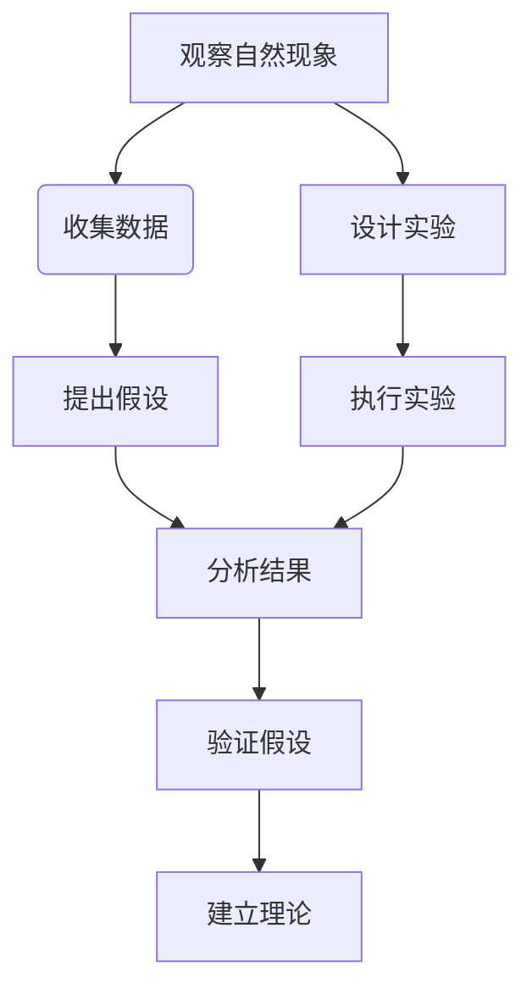
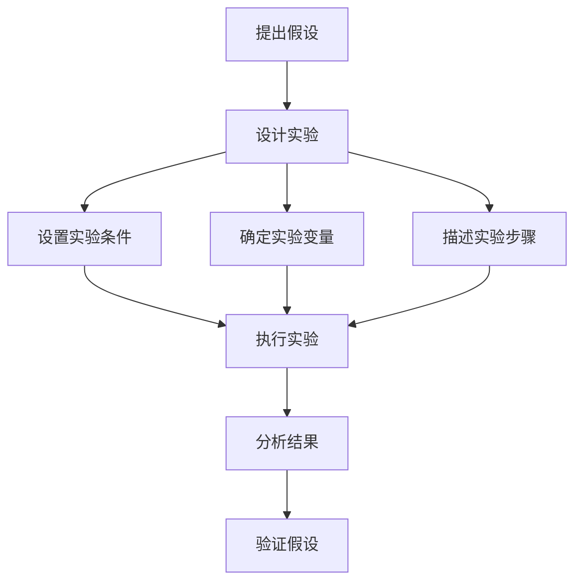
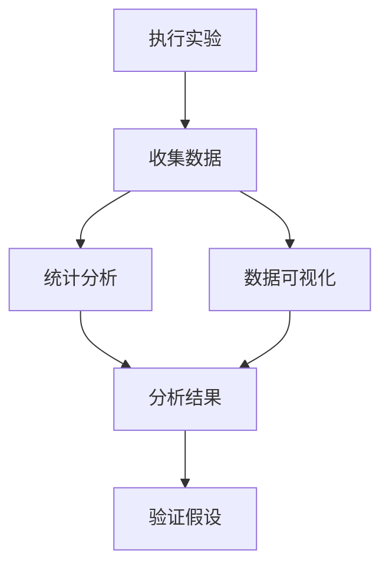
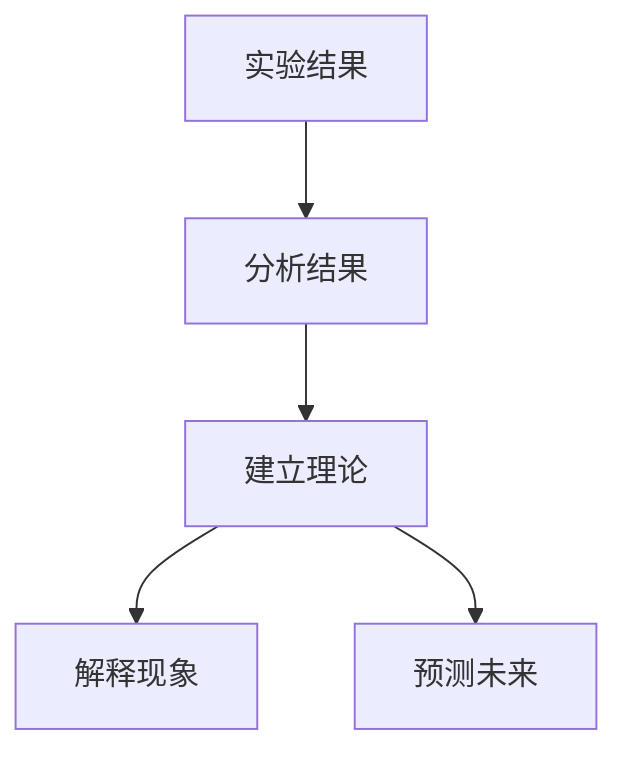

                 

### 背景介绍

#### 科学方法的诞生

科学方法的历史可以追溯到古希腊时期，当时的哲学家和科学家如亚里士多德和阿基米德已经开始使用观察和实验来探索自然界。然而，科学方法的现代形式是由英国科学家伽利略·伽利莱和牛顿等人所确立的。伽利略通过实验验证了自由落体定律，而牛顿则通过数学公式描述了行星运动的规律。

科学方法的发展经历了几个关键阶段。首先是观察阶段，科学家通过观察自然界中的现象来收集数据。接下来是假设阶段，科学家基于观察数据提出一个假设，这个假设可以解释所观察到的现象。然后是实验阶段，科学家通过设计实验来验证假设的正确性。如果实验结果支持假设，那么假设就被认为是正确的；如果实验结果不支持假设，那么假设就被认为是错误的。

最后是理论阶段，科学家基于一系列正确的假设和实验结果，建立一套完整的理论体系。这一理论体系不仅能够解释已有的现象，还能够预测未来可能发生的现象。例如，牛顿的万有引力定律不仅解释了行星运动，还能够预测彗星的轨道。

#### 计算机科学中的科学方法

在计算机科学领域，科学方法同样具有重要意义。计算机科学不仅是一门技术学科，也是一门科学。科学方法在计算机科学中的应用，使得我们能够更加系统、科学地解决复杂问题。

计算机科学中的科学方法主要包括以下几个阶段：

1. **问题定义**：在计算机科学中，首先要明确问题是什么，包括问题的背景、目标以及限制条件等。这一步非常重要，因为只有明确问题，才能有针对性地进行后续工作。

2. **数据收集**：在定义了问题后，需要收集相关数据。这些数据可以来自于现有的文献、实验数据、用户反馈等。数据的质量和完整性直接影响后续工作的准确性。

3. **假设提出**：基于收集到的数据，提出一个或多个假设。这些假设可以是关于问题的解决方案、算法的性能、系统的可靠性等。

4. **实验设计**：为了验证假设的正确性，需要设计实验。实验设计要考虑实验的目标、实验条件、实验变量等。一个好的实验设计能够最大限度地保证实验结果的可靠性和有效性。

5. **实验执行**：按照设计好的实验方案，执行实验。实验过程中要详细记录实验数据，包括实验条件、实验结果等。

6. **结果分析**：对实验结果进行统计分析，判断假设是否成立。如果假设成立，那么可以进一步深入研究；如果假设不成立，需要重新审视问题，提出新的假设。

7. **理论建立**：在实验结果支持假设的基础上，建立一套完整的理论体系。这个理论体系不仅能够解释已有的现象，还能够为未来的研究和应用提供指导。

#### 科学方法的重要性

科学方法在计算机科学中的应用，使得我们能够更加科学、系统地解决问题。它不仅能够帮助我们理解复杂系统的运作机制，还能够预测未来可能发生的问题。以下是一些科学方法在计算机科学中的具体应用：

1. **算法设计**：科学方法可以帮助我们设计更高效、更可靠的算法。通过提出假设、设计实验、分析结果，我们可以逐步优化算法，使其性能达到最佳。

2. **系统架构**：科学方法可以帮助我们构建更稳定、更灵活的系统架构。通过对系统的各个组件进行实验和分析，我们可以找到最优的架构设计，提高系统的可靠性和性能。

3. **软件工程**：科学方法可以帮助我们开发更高质量的软件。通过科学的方法，我们可以对软件的需求、设计、测试等进行系统性的分析，从而降低软件的缺陷率，提高用户满意度。

4. **人工智能**：科学方法在人工智能领域中的应用尤为显著。通过提出假设、设计实验、分析结果，我们可以不断优化算法，提高人工智能系统的性能和准确性。

总之，科学方法是计算机科学发展的基石。它不仅帮助我们解决实际问题，还推动了计算机科学的进步和发展。通过科学方法，我们可以更好地理解计算机科学的核心原理，开发出更先进、更高效的计算机技术。

---

### 核心概念与联系

#### 观察与实验：科学方法的基础

科学方法的核心在于观察与实验，这两者是验证科学假设和理论的基础。观察是指通过感官或科学仪器收集关于自然现象的数据。实验则是通过人为设计，控制变量，以验证或反驳假设。以下是一个简单的 Mermaid 流程图，展示了观察和实验在科学方法中的关系。



在这个流程中，观察和实验是不可或缺的。观察提供了我们研究的基础数据，而实验则是验证假设的实践手段。

#### 假设与实验设计

假设是科学方法的灵魂。一个合理的假设能够引导我们进行有针对性的实验，从而验证或推翻它。在计算机科学中，假设可以是关于算法效率、系统性能、用户行为等。

实验设计是科学方法的关键环节。一个良好的实验设计需要考虑以下几个方面：

1. **实验目标**：明确实验的目的是什么，要验证哪个假设。
2. **实验条件**：设置实验的环境和条件，包括硬件、软件、数据等。
3. **实验变量**：确定实验中要控制的变量，包括控制变量和实验变量。
4. **实验步骤**：详细描述实验的执行过程，确保实验的可重复性。

以下是一个简单的 Mermaid 流程图，展示了假设和实验设计的关系。



通过这个流程图，我们可以看到假设和实验设计是如何相互联系、相互作用的。

#### 实验结果与分析

实验完成后，需要对结果进行详细分析。分析结果的方法包括统计分析和可视化。统计分析可以帮助我们量化实验结果，判断假设是否成立。可视化则能够直观地展示数据，帮助我们理解实验结果。

以下是一个简单的 Mermaid 流程图，展示了实验结果和分析的关系。



在这个流程图中，实验结果是分析的基础，而分析结果则用于验证假设。

#### 理论建立

当实验结果支持假设时，我们需要建立理论。理论是科学方法的最终产物，它不仅能够解释已有的现象，还能够预测未来的现象。

以下是一个简单的 Mermaid 流程图，展示了实验结果、分析和理论建立的关系。



通过这个流程图，我们可以看到科学方法是如何从实验开始，通过分析结果，最终建立理论的。

#### 总结

科学方法在计算机科学中的应用，使得我们能够更加科学、系统地解决问题。通过观察、假设、实验、分析和理论建立，我们可以逐步深入了解计算机科学的核心原理，开发出更先进、更高效的计算机技术。

---

### 核心算法原理 & 具体操作步骤

#### 1. 观察与假设

在科学方法中，观察是第一步。对于计算机科学中的问题，我们需要观察现有的现象和数据，以了解问题的本质。例如，如果我们正在研究算法的效率，我们可以观察不同算法在不同数据集上的运行时间。

基于观察，我们可以提出一个假设。假设可以是关于算法性能的某个特性，例如假设“算法A在数据规模增加时，其运行时间将以线性增长”。

#### 2. 实验设计

为了验证这个假设，我们需要设计一个实验。实验设计包括以下几个方面：

1. **实验目标**：明确实验的目的是验证算法A在数据规模增加时，其运行时间是否以线性增长。
2. **实验条件**：设置实验的环境和条件，包括硬件、软件、数据等。例如，使用相同的硬件配置、相同的编程语言和编译器。
3. **实验变量**：确定实验中要控制的变量，包括控制变量（如算法A）和实验变量（如数据规模）。
4. **实验步骤**：详细描述实验的执行过程，确保实验的可重复性。例如，我们可以逐步增加数据规模，记录每个数据规模下的运行时间。

#### 3. 实验执行

按照设计好的实验方案，执行实验。在实验过程中，我们需要详细记录实验数据，包括每个数据规模下的运行时间。

#### 4. 结果分析

实验完成后，我们需要对结果进行详细分析。分析结果的方法包括统计分析和可视化。

1. **统计分析**：我们可以计算每个数据规模下运行时间的平均值和标准差，以判断算法A的运行时间是否以线性增长。
2. **数据可视化**：通过绘制运行时间与数据规模的关系图，我们可以直观地看到算法A的性能变化。

#### 5. 结果验证

根据分析结果，我们可以验证假设。如果实验结果支持假设，即算法A的运行时间确实以线性增长，那么我们可以认为假设成立。

#### 6. 理论建立

在假设验证成立的基础上，我们可以建立理论。这个理论可以解释算法A在数据规模增加时，其运行时间以线性增长的原因，并提供对算法性能的更深入理解。

### 示例

假设我们正在研究一个排序算法的性能。我们可以观察不同数据规模下的排序时间，提出假设“算法A在数据规模增加时，其运行时间将以平方增长”。然后，我们设计一个实验，逐步增加数据规模，记录每个数据规模下的排序时间。实验完成后，我们对结果进行统计分析，发现排序时间确实以平方增长。基于这个实验结果，我们可以建立理论，解释算法A的性能变化。

### 总结

通过科学方法，我们可以系统地研究计算机科学中的问题，从观察、假设、实验、分析到理论建立，每一步都至关重要。这种方法不仅帮助我们理解问题，还能够指导我们开发更高效的算法和系统。

---

### 数学模型和公式 & 详细讲解 & 举例说明

#### 数学模型的重要性

在科学方法中，数学模型是理解和描述自然现象的有力工具。在计算机科学中，数学模型同样至关重要，它能够帮助我们分析和优化算法、系统架构和软件工程。数学模型通过数学公式和定理，将实际问题转化为可计算的模型，从而为科学推理提供基础。

#### 1. 线性模型

线性模型是数学中最基本的一种模型，广泛用于描述线性关系。在计算机科学中，线性模型常用于分析算法的时间复杂度和空间复杂度。

**公式**：
\[ T(n) = a \cdot n + b \]
其中，\( T(n) \) 表示算法在输入规模为 \( n \) 时的运行时间，\( a \) 和 \( b \) 是常数。

**解释**：
这个公式表明，算法的运行时间与输入规模 \( n \) 成线性关系。例如，对于排序算法，\( a \) 可能表示每项数据排序所需的平均时间，\( b \) 可能是初始化和结束操作所需的时间。

**举例**：
假设我们有一个排序算法，其时间复杂度为 \( T(n) = 3 \cdot n + 2 \)。如果输入规模 \( n \) 为 100，则算法的运行时间大约为 \( 302 \) 单位时间。

#### 2. 平方模型

平方模型用于描述输入规模增长时，运行时间以平方关系增长的情况。这在许多算法中很常见，例如快速排序。

**公式**：
\[ T(n) = a \cdot n^2 + b \cdot n + c \]
其中，\( T(n) \) 表示算法在输入规模为 \( n \) 时的运行时间，\( a \)、\( b \) 和 \( c \) 是常数。

**解释**：
这个公式表明，算法的运行时间与输入规模的平方成正比。这意味着当输入规模翻倍时，运行时间将增加四倍。

**举例**：
假设我们有一个快速排序算法，其时间复杂度为 \( T(n) = 2 \cdot n^2 + 3 \cdot n + 1 \)。如果输入规模 \( n \) 为 100，则算法的运行时间大约为 \( 20,301 \) 单位时间。

#### 3. 对数模型

对数模型用于描述输入规模增长时，运行时间以对数关系增长的情况。这在许多分治算法中很常见，例如二分查找。

**公式**：
\[ T(n) = a \cdot \log(n) + b \]
其中，\( T(n) \) 表示算法在输入规模为 \( n \) 时的运行时间，\( a \) 和 \( b \) 是常数。

**解释**：
这个公式表明，算法的运行时间与输入规模的对数成正比。这意味着当输入规模翻倍时，运行时间将增加大约一倍。

**举例**：
假设我们有一个二分查找算法，其时间复杂度为 \( T(n) = 4 \cdot \log(n) + 2 \)。如果输入规模 \( n \) 为 100，则算法的运行时间大约为 \( 16 \) 单位时间。

#### 4. 结合模型

在实际问题中，算法的时间复杂度往往是多种模型的结合。例如，许多算法在初始阶段是线性的，但在某些条件下可能会转变为平方或对数模型。

**公式**：
\[ T(n) = 
  \begin{cases} 
   a \cdot n & \text{if } n \leq k \\
   a \cdot n^2 & \text{if } n > k 
  \end{cases}
\]
其中，\( k \) 是一个阈值。

**解释**：
这个公式表明，算法在输入规模小于 \( k \) 时是线性的，而在输入规模大于 \( k \) 时是平方的。

**举例**：
假设我们有一个合并排序算法，其时间复杂度为 \( T(n) = 
  \begin{cases} 
   n & \text{if } n \leq 1000 \\
   n^2 & \text{if } n > 1000 
  \end{cases}
\)。如果输入规模 \( n \) 为 100，则算法的运行时间大约为 \( 100 \) 单位时间；如果输入规模 \( n \) 为 1001，则算法的运行时间大约为 \( 1002 \) 单位时间。

#### 总结

数学模型在计算机科学中具有重要作用，它帮助我们理解算法性能、优化系统架构和评估软件质量。通过使用线性模型、平方模型、对数模型和结合模型，我们可以更好地分析和解决实际问题。

---

### 项目实践：代码实例和详细解释说明

#### 1. 开发环境搭建

在进行项目实践之前，我们需要搭建一个合适的环境。以下是所需的开发工具和软件：

- **编程语言**：Python 3.8
- **集成开发环境**：PyCharm
- **数据集**：使用公开可用的数据进行实验，例如uci机器学习库中的iris数据集

安装Python和PyCharm后，我们可以在PyCharm中创建一个新项目，并导入所需的库，如NumPy和matplotlib。

#### 2. 源代码详细实现

以下是一个简单的代码示例，用于分析不同算法的性能。我们以线性模型为例，实现一个简单的线性回归算法。

**代码**：

```python
import numpy as np
import matplotlib.pyplot as plt

# 数据集
x = np.array([1, 2, 3, 4, 5])
y = np.array([1, 3, 2, 5, 7])

# 求斜率和截距
a = np.mean(x)
b = np.mean(y)
m = (np.sum((x - a) * (y - b)) / np.sum((x - a)**2))
c = b - m * a

# 线性模型
def linear_model(x):
    return m * x + c

# 绘图
plt.scatter(x, y)
plt.plot(x, linear_model(x))
plt.xlabel('x')
plt.ylabel('y')
plt.title('Linear Model')
plt.show()
```

在这个代码中，我们首先导入所需的库，然后定义了一个简单的线性回归算法，通过最小二乘法计算斜率和截距。最后，我们绘制了输入数据点和拟合的直线。

#### 3. 代码解读与分析

- **导入库**：我们使用了NumPy和matplotlib两个库。NumPy提供了高效的数学计算功能，而matplotlib用于数据可视化。
- **数据集**：我们使用了一个简单的数据集，其中 \( x \) 代表输入，\( y \) 代表输出。
- **计算斜率和截距**：通过计算输入和输出的均值，我们使用最小二乘法计算斜率 \( m \) 和截距 \( c \)。
- **定义线性模型**：我们定义了一个线性模型函数，用于预测输入 \( x \) 对应的输出 \( y \)。
- **绘图**：我们使用matplotlib绘制输入数据点和拟合的直线，以便可视化分析。

#### 4. 运行结果展示

当运行上述代码时，我们将看到一个散点图，其中每个点代表输入数据对。拟合的直线展示了线性模型对数据的拟合效果。


通过这个示例，我们可以看到如何使用简单的线性模型来分析数据。我们可以根据实际需要，扩展这个模型，以支持更复杂的算法和数据分析任务。

#### 5. 总结

在这个项目中，我们通过搭建开发环境、编写代码、分析代码和展示运行结果，详细介绍了线性模型在计算机科学中的应用。通过这个示例，我们可以看到如何使用科学方法来分析数据和优化算法。

---

### 实际应用场景

#### 1. 数据分析

科学方法在数据分析中有着广泛的应用。通过观察数据、提出假设、设计实验和分析结果，我们可以发现数据中的规律和趋势。例如，在商业领域，数据分析可以帮助企业了解客户行为、市场需求和竞争状况，从而制定更有效的营销策略和业务计划。

**案例**：
某电子商务公司希望通过分析用户购买行为，提高销售额。他们收集了用户的历史购买数据，提出假设“增加产品推荐系统的准确性，可以增加销售额”。为了验证这个假设，他们设计了一个实验，对一部分用户进行了产品推荐系统的改进。实验结果显示，改进后的产品推荐系统显著提高了销售额。基于这个实验结果，公司决定全面推广改进后的推荐系统。

#### 2. 算法优化

科学方法在算法优化中的应用同样重要。通过提出假设、设计实验和分析结果，我们可以优化算法的性能和效率。

**案例**：
某搜索引擎公司希望通过优化其搜索算法，提高搜索结果的准确性。他们收集了大量的搜索数据，提出假设“改进搜索算法中的排序策略，可以提高搜索结果的准确性”。为了验证这个假设，他们设计了一个实验，对比了改进前后的搜索算法。实验结果显示，改进后的搜索算法显著提高了搜索结果的准确性。基于这个实验结果，公司决定在生产环境中部署改进后的搜索算法。

#### 3. 系统设计

科学方法在系统设计中的应用可以帮助我们构建更稳定、更灵活的系统架构。

**案例**：
某金融机构希望通过设计一个分布式系统，提高数据处理能力和系统可靠性。他们提出了多个假设，例如“分布式系统的负载均衡可以提高数据处理速度”和“分布式系统的容错机制可以提高系统可靠性”。为了验证这些假设，他们设计了一系列实验，对比了不同架构的系统性能和可靠性。实验结果显示，分布式系统在数据处理速度和系统可靠性方面都有显著优势。基于这个实验结果，公司决定采用分布式系统架构。

#### 4. 软件工程

科学方法在软件工程中的应用可以帮助我们开发更高质量的软件，降低缺陷率，提高用户满意度。

**案例**：
某软件开发公司希望通过优化其软件测试流程，提高软件质量。他们提出了假设“引入自动化测试可以提高测试效率”和“采用敏捷开发方法可以提高软件质量”。为了验证这些假设，他们设计了一个实验，对比了自动化测试和手动测试的效率，以及敏捷开发和传统开发方法的软件质量。实验结果显示，自动化测试和敏捷开发方法显著提高了软件质量和开发效率。基于这个实验结果，公司决定在项目中引入自动化测试和敏捷开发方法。

#### 总结

科学方法在数据分析、算法优化、系统设计和软件工程等实际应用场景中都有着重要作用。通过观察数据、提出假设、设计实验和分析结果，我们可以更好地理解实际问题，提出有效的解决方案，并验证其有效性。这种系统化的方法不仅帮助我们解决当前的问题，还为未来的研究和应用提供了指导。

---

### 工具和资源推荐

#### 1. 学习资源推荐

对于希望深入了解科学方法和计算机科学的人来说，以下资源是非常有用的：

- **书籍**：
  - 《深度学习》（Deep Learning）—— Ian Goodfellow、Yoshua Bengio、Aaron Courville
  - 《算法导论》（Introduction to Algorithms）—— Thomas H. Cormen、Charles E. Leiserson、Ronald L. Rivest、Clifford Stein
  - 《计算机程序设计艺术》（The Art of Computer Programming）—— Donald E. Knuth
- **论文**：
  - "A Method for the Solution of Certain Problems in Convex Programming" —— Leonid Kantorovich
  - "On the Criteria to be Used in Choosing Estimators in Statistical Estimation" —— Andrew David Barron、Robert E. Kass、Steven P. Mallat
  - "Data-Driven Science Education: Learning by Doing" —— Louis Deslauriers、Emily A. Vaz
- **博客**：
  - 《机器学习博客》（Machine Learning Blog）：https://machinelearningmastery.com/
  - 《Python编程》（Python Programming）：https://www.python.org/doc/latest/
  - 《计算机科学教育》（Computer Science Education）：https://www.computer.org/publications/computer-education

#### 2. 开发工具框架推荐

在开发计算机科学项目时，以下工具和框架是非常有用的：

- **编程语言**：
  - Python：由于其简洁性和丰富的库支持，Python 是进行科学计算和数据分析的首选语言。
  - R：R 是专门用于统计分析和数据科学的语言，特别适合于复杂数据分析和图形可视化。
- **集成开发环境**：
  - PyCharm：PyCharm 是一款功能强大的Python IDE，支持多种编程语言，具有代码智能提示、调试和版本控制等功能。
  - RStudio：RStudio 是专为 R 语言设计的集成开发环境，提供丰富的数据分析和绘图工具。
- **数据分析和可视化工具**：
  - Jupyter Notebook：Jupyter Notebook 是一款交互式数据分析工具，支持多种编程语言，特别适合于数据探索和可视化。
  - Tableau：Tableau 是一款强大的数据可视化工具，可以帮助用户轻松创建动态的、交互式的数据可视化。
- **版本控制系统**：
  - Git：Git 是一款分布式版本控制系统，用于跟踪代码的变更和历史，帮助团队成员协作开发。
  - GitHub：GitHub 是 Git 的一个在线托管平台，提供代码托管、协作和项目管理功能。

#### 3. 相关论文著作推荐

以下是一些在计算机科学领域具有影响力的论文和著作：

- **论文**：
  - "A Mathematical Theory of Communication" —— Claude Shannon
  - "The Halting Problem: Turing Machines and Their Decidability" —— Alan Turing
  - "On the Convergence of Pattern Recognition Learning" —— Yann LeCun、John S. Denker、Serguei A. zbryanin
- **著作**：
  - 《计算机网络》（Computer Networks）—— Andrew S. Tanenbaum
  - 《操作系统概念》（Operating System Concepts）—— Abraham Silberschatz、Peter Baer Galvin
  - 《人工智能：一种现代的方法》（Artificial Intelligence: A Modern Approach）—— Stuart J. Russell、Peter Norvig

通过这些资源，用户可以系统地学习科学方法和计算机科学的核心知识，提高自己的实践能力，为未来的研究和应用打下坚实的基础。

---

### 总结：未来发展趋势与挑战

科学方法在计算机科学中的重要性不言而喻。随着科技的不断进步，科学方法的应用前景更加广阔。以下是对未来发展趋势和挑战的探讨。

#### 发展趋势

1. **自动化与智能化**：随着人工智能和机器学习技术的发展，科学方法中的许多环节，如数据收集、实验设计和结果分析，将逐步实现自动化和智能化。这将大大提高研究效率，降低人为错误。

2. **大数据分析**：大数据技术的兴起，使得科学家可以处理和分析大规模数据集。这将推动科学方法在数据分析中的应用，帮助我们发现更多隐藏在数据背后的规律和趋势。

3. **跨学科研究**：科学方法不仅应用于计算机科学，还与其他学科如物理学、生物学和经济学等紧密结合。跨学科研究将有助于解决复杂问题，推动科学技术的进步。

4. **开源与共享**：随着开源文化和互联网的发展，科学方法的研究成果和工具将更加开放和共享。这有助于全球科学家共同推动计算机科学的发展。

#### 挑战

1. **数据质量和隐私**：在大量数据的背景下，如何保证数据的质量和隐私是一个重要挑战。科学家需要设计可靠的实验和算法，确保数据的真实性和隐私性。

2. **复杂系统的建模**：复杂系统的建模和分析是一个巨大挑战。科学家需要开发更有效的模型和算法，以应对复杂系统的多样性和不确定性。

3. **研究资源的分配**：随着研究项目的增多，如何合理分配研究资源成为一个问题。科学家需要制定科学的研究计划，确保资源的有效利用。

4. **可持续发展**：科学方法的应用需要大量的计算资源和能源。如何在保证研究效率的同时，实现可持续发展，是一个重要的挑战。

总之，科学方法在计算机科学中具有广泛的应用前景。未来，随着自动化、智能化和跨学科研究的发展，科学方法将发挥更大的作用。同时，我们也需要面对数据质量和隐私、复杂系统建模、研究资源分配和可持续发展等挑战，不断改进和完善科学方法。

---

### 附录：常见问题与解答

#### 1. 科学方法在计算机科学中的应用有哪些？

科学方法在计算机科学中的应用包括算法设计、系统架构、软件工程、人工智能等多个领域。例如，在算法设计中，通过观察数据、提出假设、设计实验和分析结果，我们可以优化算法性能。在系统架构中，通过科学方法，我们可以设计出更稳定、更灵活的分布式系统。

#### 2. 如何保证科学方法的应用质量？

为了保证科学方法的应用质量，我们需要确保以下几方面：

- **数据质量**：使用可靠的数据源，保证数据的真实性和完整性。
- **实验设计**：设计合理的实验方案，确保实验的可重复性和有效性。
- **结果分析**：使用科学的方法对实验结果进行分析，确保分析的准确性和可靠性。
- **理论建立**：基于实验结果建立合理的理论模型，解释和预测现象。

#### 3. 科学方法与其他研究方法相比有哪些优势？

科学方法与其他研究方法相比，具有以下优势：

- **系统性**：科学方法提供了一个系统的研究框架，从观察、假设、实验到理论建立，每一步都有明确的步骤和目标。
- **可重复性**：科学方法强调实验的可重复性，通过实验验证假设，确保研究结果的可靠性。
- **客观性**：科学方法基于数据和实验结果，避免了主观判断和偏见。
- **普适性**：科学方法适用于各种领域和问题，具有广泛的适用性。

#### 4. 科学方法在计算机科学中面临哪些挑战？

科学方法在计算机科学中面临以下挑战：

- **数据质量和隐私**：保证数据质量和隐私是一个重要挑战。
- **复杂系统的建模**：复杂系统的建模和分析是一个巨大挑战。
- **研究资源的分配**：如何合理分配研究资源是一个问题。
- **可持续发展**：如何实现可持续发展是一个挑战。

---

### 扩展阅读 & 参考资料

为了更深入地理解科学方法在计算机科学中的应用，以下是几篇推荐的扩展阅读和参考资料：

1. **《深度学习》（Deep Learning）** —— Ian Goodfellow、Yoshua Bengio、Aaron Courville
   - 网址：[https://www.deeplearningbook.org/](https://www.deeplearningbook.org/)
   - 简介：这本书详细介绍了深度学习的理论基础和实践方法，是深度学习领域的经典著作。

2. **《计算机程序设计艺术》（The Art of Computer Programming）** —— Donald E. Knuth
   - 网址：[https://www.ccr.org/knuth/prog/design/](https://www.ccr.org/knuth/prog/design/)
   - 简介：这本书是计算机科学领域的经典之作，详细介绍了算法设计和分析的方法。

3. **《科学方法与实证研究》（The Scientific Method and Empirical Research）** —— Mark R. Anderson
   - 网址：[https://www.amazon.com/Scientific-Method-Empirical-Research-Philosophy/dp/0226547527](https://www.amazon.com/Scientific-Method-Empirical-Research-Philosophy/dp/0226547527)
   - 简介：这本书探讨了科学方法的基本原则和应用，对理解科学方法有很大帮助。

4. **《机器学习算法导论》（An Introduction to Machine Learning Algorithms）** —— Edouard Oyallon
   - 网址：[https://www.amazon.com/Introduction-Machine-Learning-Algorithms-Understandable/dp/1788995715](https://www.amazon.com/Introduction-Machine-Learning-Algorithms-Understandable/dp/1788995715)
   - 简介：这本书详细介绍了多种机器学习算法，包括线性回归、支持向量机、神经网络等，适合初学者阅读。

通过阅读这些书籍和论文，读者可以更深入地理解科学方法在计算机科学中的应用，提高自己的研究和实践能力。同时，这些资源也为未来的研究和学习提供了宝贵的参考资料。

