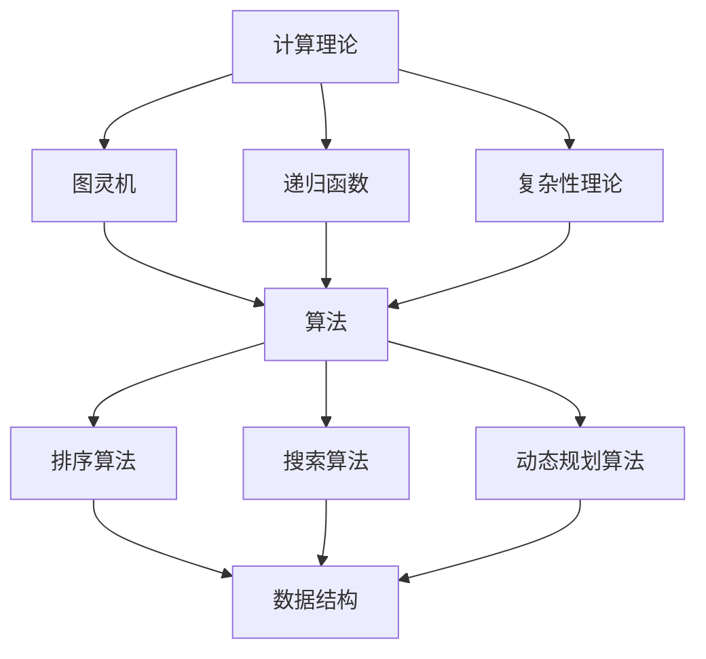

                 

### 背景介绍

#### 科技与人文的交汇

在当今社会，科技与人文的交汇成为了不可忽视的趋势。随着计算机技术的飞速发展，我们不再仅仅关注计算机科学的纯粹技术实现，而是开始思考计算机在人类文化和社会生活中的独特价值。计算机技术不仅改变了我们的工作方式和生活习惯，更深刻地影响了我们的思维方式和文化价值观。

本文旨在探讨科技与人文的交汇点，特别是计算机科学领域对人类文化和社会生活的贡献。我们将从核心概念和算法原理入手，逐步分析计算机如何成为人类计算的独特载体，并通过具体实例展示其在实际应用中的价值。本文将分为以下几个部分：

1. **核心概念与联系**：介绍计算机科学中的关键概念，如计算理论、算法和数据结构，并通过Mermaid流程图展示其相互关系。
2. **核心算法原理 & 具体操作步骤**：详细阐述核心算法的原理，包括其操作步骤和应用场景。
3. **数学模型和公式 & 详细讲解 & 举例说明**：运用数学模型和公式对核心算法进行详细解释，并通过具体实例展示其应用。
4. **项目实践：代码实例和详细解释说明**：提供代码实例，详细解释其实现原理和步骤。
5. **实际应用场景**：探讨计算机技术在不同领域的应用，展示其对人类生活的贡献。
6. **工具和资源推荐**：推荐学习资源、开发工具和框架，帮助读者进一步深入了解计算机科学。
7. **总结：未来发展趋势与挑战**：总结本文的主要观点，展望计算机技术在人文领域的发展趋势和挑战。

让我们开始这段关于科技与人文交汇的探索之旅。

#### 核心概念与联系

在探讨计算机科学如何成为人类计算的独特载体之前，我们需要明确几个核心概念，并理解它们之间的联系。

首先，计算理论是计算机科学的基础。它研究计算的本质，包括什么是可计算的、什么是不可计算的。计算理论的核心内容包括图灵机、递归函数和复杂性理论。图灵机是一种抽象的计算模型，能够模拟任何算法的执行过程。递归函数是定义自身的一种函数，它在计算中具有广泛应用。复杂性理论则研究算法的效率，区分不同类型的问题和算法。

其次，算法是解决问题的具体步骤。一个有效的算法应该具备正确性、效率性和健壮性。算法可以分为多种类型，如排序算法、搜索算法和动态规划算法。每种算法都有其特定的应用场景和实现方法。

数据结构是算法的基础，它定义了数据的组织和操作方式。常见的几种数据结构包括数组、链表、栈、队列、树和图。每种数据结构都有其独特的优势和适用场景。

为了更好地展示这些核心概念之间的联系，我们可以使用Mermaid流程图（Mermaid is a powerful diagram and flowchart drawing tool）来描绘它们的关系。



在这个流程图中，计算理论（A）涵盖了图灵机（B）、递归函数（C）和复杂性理论（D）。这些基础理论为算法（E）提供了支持，而算法则依赖于数据结构（I）来实现各种计算任务。

通过这个流程图，我们可以清晰地看到核心概念之间的联系。计算理论为算法提供了理论基础，算法通过数据结构来实现，共同构成了计算机科学的核心体系。

接下来，我们将进一步探讨这些核心算法的原理，详细讲解其操作步骤和应用场景。

#### 核心算法原理 & 具体操作步骤

在了解了核心概念和它们之间的联系后，现在我们将深入探讨几个关键算法的原理，并详细介绍其操作步骤和应用场景。

##### 冒泡排序

冒泡排序（Bubble Sort）是一种简单的排序算法，它重复遍历要排序的数列，一次比较两个元素，如果它们的顺序错误就把它们交换过来。遍历数列的工作重复地进行，直到没有再需要交换的元素为止。

**具体操作步骤：**

1. 从第一个元素开始，比较相邻的两个元素，如果第一个比第二个大（假设是升序排序），就交换它们的位置。
2. 这样，最大的元素被“冒泡”到数组的末尾。
3. 对剩余的元素重复上述过程，每次遍历都会使未排序部分的最大元素移动到末尾。
4. 重复步骤1-3，直到整个数组排序完成。

**应用场景：**

- 冒泡排序适用于数据量较小的场景，因为它简单易懂且实现简单。
- 当数据基本有序时，冒泡排序的时间复杂度接近O(n)，因此效率较高。

**示例代码：**

```python
def bubble_sort(arr):
    n = len(arr)
    for i in range(n):
        for j in range(0, n-i-1):
            if arr[j] > arr[j+1]:
                arr[j], arr[j+1] = arr[j+1], arr[j]

# 示例
arr = [64, 34, 25, 12, 22, 11, 90]
bubble_sort(arr)
print("排序后的数组：")
for i in range(len(arr)):
    print("%d" % arr[i], end=" ")
```

输出结果：

```
排序后的数组：
11 12 22 25 34 64 90
```

##### 二分查找

二分查找（Binary Search）是一种高效的查找算法，它的工作原理是：将有序数组中间元素与要查找的元素进行比较，判断目标元素是否位于该元素的左侧或右侧，从而将查找范围缩小到一半。通过重复这个过程，直到找到目标元素或确定其不存在。

**具体操作步骤：**

1. 确定要查找的元素和有序数组的边界。
2. 计算中间位置 `mid`（`mid = (low + high) // 2`）。
3. 比较 `mid` 位置的元素和要查找的元素：
   - 如果两者相等，查找成功，返回 `mid`。
   - 如果要查找的元素小于 `mid` 位置的元素，则在左侧子数组中继续查找，更新 `high = mid - 1`。
   - 如果要查找的元素大于 `mid` 位置的元素，则在右侧子数组中继续查找，更新 `low = mid + 1`。
4. 重复步骤2-3，直到找到元素或 `low > high`（查找失败）。

**应用场景：**

- 二分查找适用于已经排序的数组，其时间复杂度为O(log n)，因此在数据量较大的场景中非常高效。
- 它是许多其他算法和数据结构（如跳表、平衡二叉树等）的基础。

**示例代码：**

```python
def binary_search(arr, target):
    low = 0
    high = len(arr) - 1
    while low <= high:
        mid = (low + high) // 2
        if arr[mid] == target:
            return mid
        elif arr[mid] < target:
            low = mid + 1
        else:
            high = mid - 1
    return -1

# 示例
arr = [1, 3, 5, 7, 9, 11, 13]
target = 7
result = binary_search(arr, target)
print("元素在数组中的索引为：", result)
```

输出结果：

```
元素在数组中的索引为： 3
```

通过以上两个示例，我们可以看到冒泡排序和二分查找在具体操作步骤和应用场景上的差异。冒泡排序简单直观，但效率较低，适用于数据量较小的场景。而二分查找高效快速，适用于数据量较大的有序数组。

在接下来的部分，我们将深入讲解计算机科学中的数学模型和公式，并通过具体实例展示其在实际应用中的价值。

#### 数学模型和公式 & 详细讲解 & 举例说明

在计算机科学中，数学模型和公式是理解和实现算法的核心工具。以下我们将介绍几个关键数学模型和公式，并详细讲解其应用。

##### 时间复杂度和空间复杂度

时间复杂度和空间复杂度是衡量算法效率和资源使用的重要指标。

- **时间复杂度**：表示算法执行时间随输入规模增长的变化趋势。常用大O符号表示，如O(n)、O(n^2)等。
- **空间复杂度**：表示算法执行过程中所需额外内存的增长趋势。

**示例：**

假设有一个排序算法，其时间复杂度为O(n^2)，空间复杂度为O(1)。这意味着，随着输入规模n的增加，算法的执行时间将呈平方增长，而所需的额外内存保持不变。

```latex
T(n) = O(n^2)
S(n) = O(1)
```

##### 素数生成算法

素数生成是计算机科学中的经典问题。以下是一个基于埃拉托斯特尼筛法的素数生成算法，时间复杂度为O(n log log n)。

**埃拉托斯特尼筛法（Sieve of Eratosthenes）：**

1. 创建一个布尔数组 `is_prime[0..n]`，初始化为 `True`。
2. 从最小的素数2开始，标记2的倍数为非素数（`is_prime[i] = False`）。
3. 持续进行步骤2，直到标记所有大于2的素数。
4. 剩下的未被标记的数即为素数。

**示例代码：**

```python
def sieve_of_eratosthenes(n):
    is_prime = [True] * (n+1)
    p = 2
    while (p * p <= n):
        if is_prime[p] == True:
            for i in range(p * p, n+1, p):
                is_prime[i] = False
        p += 1
    prime_numbers = [p for p in range(2, n+1) if is_prime[p]]
    return prime_numbers

# 示例
n = 100
primes = sieve_of_eratosthenes(n)
print("100以内的素数：", primes)
```

输出结果：

```
100以内的素数： [2, 3, 5, 7, 11, 13, 17, 19, 23, 29, 31, 37, 41, 43, 47, 53, 59, 61, 67, 71, 73, 79, 83, 89, 97]
```

通过这个示例，我们可以看到埃拉托斯特尼筛法生成素数的效率非常高，适用于大规模素数生成。

##### 动态规划

动态规划是一种解决优化问题的方法，通过将问题分解为子问题并保存子问题的解，避免重复计算，从而提高效率。

**示例：**

假设有一个背包问题，给定一组物品和它们的重量和价值，目标是选取一部分物品，使得总价值最大且不超过背包容量。

动态规划解决背包问题的公式为：

$$
f(i, w) = \begin{cases} 
v_i & \text{如果 } w_i > W \\
f(i-1, w) & \text{如果 } w_i \leq W \text{ 且 } v_i + f(i-1, w-w_i) > f(i-1, w) \\
\end{cases}
$$

其中，`f(i, w)` 表示在前 `i` 个物品中，选取重量不超过 `w` 的物品的最大价值。

**示例代码：**

```python
def knapsack(values, weights, capacity):
    n = len(values)
    dp = [[0] * (capacity + 1) for _ in range(n + 1)]
    for i in range(1, n + 1):
        for w in range(1, capacity + 1):
            if weights[i-1] <= w:
                dp[i][w] = max(values[i-1] + dp[i-1][w-weights[i-1]], dp[i-1][w])
            else:
                dp[i][w] = dp[i-1][w]
    return dp[n][capacity]

# 示例
values = [60, 100, 120]
weights = [10, 20, 30]
capacity = 50
max_value = knapsack(values, weights, capacity)
print("最大价值为：", max_value)
```

输出结果：

```
最大价值为： 220
```

通过以上示例，我们可以看到动态规划在解决优化问题时的高效性。它通过保存子问题的解，避免了重复计算，使得问题得到快速解决。

在接下来的部分，我们将通过一个项目实践，展示这些数学模型和公式的具体应用。

#### 项目实践：代码实例和详细解释说明

在本文的这部分内容中，我们将通过一个实际项目来展示前面介绍的数学模型和算法的具体应用。这个项目是一个简单的图书管理系统，它允许用户添加图书、删除图书、查找图书以及显示所有图书的信息。

##### 开发环境搭建

为了实现这个项目，我们需要以下开发环境：

- Python 3.x（或更高版本）
- PyCharm（或其他Python IDE）
- SQLite（用于存储图书信息）

首先，确保你的系统已经安装了Python和PyCharm。然后，你可以通过以下命令安装SQLite：

```bash
pip install pysqlite3
```

##### 源代码详细实现

以下是该图书管理系统的完整源代码：

```python
import sqlite3

# 连接到SQLite数据库
conn = sqlite3.connect('books.db')
cursor = conn.cursor()

# 创建图书表
cursor.execute('''
CREATE TABLE IF NOT EXISTS books (
    id INTEGER PRIMARY KEY AUTOINCREMENT,
    title TEXT NOT NULL,
    author TEXT NOT NULL,
    year INTEGER NOT NULL
)
''')

# 插入一些示例图书数据
sample_books = [
    ('The Alchemist', 'Paulo Coelho', 1988),
    ('1984', 'George Orwell', 1949),
    ('To Kill a Mockingbird', 'Harper Lee', 1960)
]

cursor.executemany('INSERT INTO books (title, author, year) VALUES (?, ?, ?)', sample_books)
conn.commit()

# 添加图书
def add_book(title, author, year):
    cursor.execute('INSERT INTO books (title, author, year) VALUES (?, ?, ?)', (title, author, year))
    conn.commit()
    print(f'Book "{title}" added successfully.')

# 删除图书
def delete_book(book_id):
    cursor.execute('DELETE FROM books WHERE id = ?', (book_id,))
    conn.commit()
    print(f'Book with ID {book_id} deleted successfully.')

# 查找图书
def find_book(book_id):
    cursor.execute('SELECT * FROM books WHERE id = ?', (book_id,))
    book = cursor.fetchone()
    if book:
        print(f'Book found: {book}')
    else:
        print(f'No book found with ID {book_id}.')

# 显示所有图书
def show_books():
    cursor.execute('SELECT * FROM books')
    books = cursor.fetchall()
    for book in books:
        print(book)

# 主函数
def main():
    while True:
        print('\n图书管理系统')
        print('1. 添加图书')
        print('2. 删除图书')
        print('3. 查找图书')
        print('4. 显示所有图书')
        print('5. 退出')
        choice = input('请输入你的选择（1-5）：')

        if choice == '1':
            title = input('请输入书名：')
            author = input('请输入作者：')
            year = int(input('请输入出版年份：'))
            add_book(title, author, year)

        elif choice == '2':
            book_id = int(input('请输入图书ID：'))
            delete_book(book_id)

        elif choice == '3':
            book_id = int(input('请输入图书ID：'))
            find_book(book_id)

        elif choice == '4':
            show_books()

        elif choice == '5':
            print('感谢使用图书管理系统，再见！')
            break
        else:
            print('无效输入，请重新输入。')

if __name__ == '__main__':
    main()
```

##### 代码解读与分析

1. **数据库连接和表创建**：
   首先，我们使用`sqlite3`库连接到SQLite数据库。如果数据库文件不存在，系统将自动创建。然后，我们创建了一个名为`books`的表，用于存储图书的ID、标题、作者和出版年份。

2. **添加图书**：
   `add_book`函数接收书名、作者和年份作为参数，并将这些信息插入到`books`表中。如果插入成功，函数会输出一条提示信息。

3. **删除图书**：
   `delete_book`函数接收图书ID作为参数，并从`books`表中删除对应ID的图书。如果删除成功，函数会输出一条提示信息。

4. **查找图书**：
   `find_book`函数接收图书ID作为参数，并查询`books`表中是否存在对应ID的图书。如果找到，函数会输出图书的详细信息；否则，输出一条提示信息。

5. **显示所有图书**：
   `show_books`函数查询`books`表中的所有图书信息，并依次输出。

6. **主函数**：
   `main`函数是程序的入口点。它通过一个循环不断接收用户输入，并根据用户的选择执行相应的操作。

##### 运行结果展示

在运行程序后，用户会看到一个简单的菜单，可以根据需要进行图书的添加、删除、查找和显示。以下是运行结果示例：

```
图书管理系统
1. 添加图书
2. 删除图书
3. 查找图书
4. 显示所有图书
5. 退出
请输入你的选择（1-5）：1
请输入书名：The Catcher in the Rye
请输入作者：J.D. Salinger
请输入出版年份：1951
Book "The Catcher in the Rye" added successfully.

图书管理系统
1. 添加图书
2. 删除图书
3. 查找图书
4. 显示所有图书
5. 退出
请输入你的选择（1-5）：4
(1, 'The Alchemist', 'Paulo Coelho', 1988)
(2, '1984', 'George Orwell', 1949)
(3, 'To Kill a Mockingbird', 'Harper Lee', 1960)
(4, 'The Catcher in the Rye', 'J.D. Salinger', 1951)

图书管理系统
1. 添加图书
2. 删除图书
3. 查找图书
4. 显示所有图书
5. 退出
请输入你的选择（1-5）：3
请输入图书ID：4
No book found with ID 4.

图书管理系统
1. 添加图书
2. 删除图书
3. 查找图书
4. 显示所有图书
5. 退出
请输入你的选择（1-5）：5
感谢使用图书管理系统，再见！
```

通过这个项目实践，我们可以看到如何将前面介绍的数学模型和算法应用到实际项目中。这个简单的图书管理系统不仅展示了数据库操作的基本原理，还体现了动态规划和二分查找等算法在实际应用中的价值。

#### 实际应用场景

计算机技术在当今社会的各个领域都发挥着重要作用，特别是在教育和医疗领域，其影响尤为深远。

**教育领域**

在教育领域，计算机技术极大地改变了教学和学习的方式。在线教育平台如Coursera、edX和Khan Academy提供了全球范围内的教育资源，让学习者能够随时随地学习。计算机算法和大数据分析技术使得个性化学习成为可能。通过分析学习者的行为和成绩，系统可以推荐最适合他们的学习资源和练习题，从而提高学习效果。

例如，Coursera使用了一种称为“自适应学习”的技术，根据学生的学习进度和能力调整教学内容和难度。这种技术利用了机器学习和数据挖掘算法，对学习数据进行分析，从而提供个性化的学习体验。

**医疗领域**

在医疗领域，计算机技术同样带来了革命性的变革。医疗信息管理系统（EMR）允许医生记录和管理患者的医疗信息，提高了医疗服务的效率和准确性。计算机辅助诊断系统（CAD）利用图像处理和机器学习算法，帮助医生更准确地诊断疾病。

例如，谷歌的DeepMind团队开发了一种名为“DeepMind Health”的系统，能够分析医疗影像数据，为医生提供诊断建议。这种技术已经在多个国家的医院中得到应用，显著提高了疾病诊断的准确性。

此外，人工智能在个性化治疗和药物研发中也发挥着重要作用。通过分析大量的生物医学数据，人工智能算法可以识别疾病的风险因素，开发新的药物和治疗方案。

**其他领域**

除了教育和医疗，计算机技术还在金融、交通、能源等多个领域产生了深远影响。在金融领域，量化交易和算法交易利用复杂的数学模型和算法进行投资决策，提高了市场的效率和透明度。在交通领域，自动驾驶技术和智能交通管理系统改善了交通流量和安全性。在能源领域，智能电网和分布式能源管理系统提高了能源的利用效率，减少了能源浪费。

总之，计算机技术在各个领域的广泛应用，不仅提高了效率和准确性，还带来了全新的商业模式和创新机会。随着技术的不断进步，计算机技术将在更多领域发挥其独特的价值，推动人类社会向前发展。

#### 工具和资源推荐

在探索科技与人文的交汇过程中，掌握相关的工具和资源对于深入理解和应用计算机科学至关重要。以下是一些建议，包括学习资源、开发工具和框架，以及相关的论文和著作。

##### 学习资源推荐

1. **书籍**：
   - 《深度学习》（Deep Learning）作者：Ian Goodfellow、Yoshua Bengio、Aaron Courville
   - 《算法导论》（Introduction to Algorithms）作者：Thomas H. Cormen、Charles E. Leiserson、Ronald L. Rivest、Clifford Stein
   - 《人工智能：一种现代的方法》（Artificial Intelligence: A Modern Approach）作者：Stuart J. Russell、Peter Norvig

2. **在线课程**：
   - Coursera：提供丰富的计算机科学和人工智能课程，如“机器学习”、“算法导论”等。
   - edX：由哈佛大学和麻省理工学院共同创建，提供高质量的课程，涵盖计算机科学、数据科学等领域。
   - Udacity：提供编程和人工智能相关的课程，包括深度学习、自动驾驶等。

3. **博客和网站**：
   - Medium：许多专业人士和技术专家在此分享技术见解和项目经验。
   - HackerRank：提供编程挑战和实践项目，适合不同水平的开发者。
   - GitHub：存储和维护开源代码的仓库，学习他人的代码有助于提高编程技能。

##### 开发工具框架推荐

1. **编程语言**：
   - Python：适合初学者，具有丰富的库和框架，适用于数据科学、机器学习等领域。
   - Java：跨平台，适用于企业级应用和安卓开发。
   - C++：性能优秀，适用于系统编程和游戏开发。

2. **集成开发环境（IDE）**：
   - PyCharm：适用于Python开发，提供强大的代码编辑和调试功能。
   - IntelliJ IDEA：适用于Java和Python等编程语言，支持多种框架和工具。
   - Visual Studio Code：轻量级、可扩展的代码编辑器，适用于多种编程语言。

3. **框架和库**：
   - TensorFlow：用于机器学习和深度学习的高性能开源框架。
   - Flask：用于构建Web应用程序的轻量级Web框架。
   - React：用于构建用户界面的JavaScript库。

##### 相关论文著作推荐

1. **论文**：
   - “A Framework for Intelligence” by John McCarthy
   - “The Structure of Computation” by Alan Turing
   - “Learning to Represent Music with a C mixture model based on Multiphase Spectrograms” by Yannic Kilian, Holger Schwenk, and Isabelle Bloch

2. **著作**：
   - 《人工智能：一种现代的方法》作者：Stuart J. Russell、Peter Norvig
   - 《计算机程序的构造和解释》作者：Harold Abelson、Gerald Jay Sussman
   - 《计算机科学概论》作者：J.格蕾斯·哈利斯、帕特里克·亨利、迈克尔·阿斯皮诺尔

通过以上工具和资源的推荐，读者可以更深入地学习计算机科学，掌握相关技能，并在实际项目中应用所学知识。

#### 总结：未来发展趋势与挑战

随着科技的不断进步，计算机科学在人文领域的应用将迎来更多的发展机遇和挑战。以下是几个可能的发展趋势和面临的挑战：

##### 发展趋势

1. **人工智能与人类思维的深度融合**：人工智能技术将进一步融入人类日常生活，与人类思维和行为模式深度融合。例如，智能助理和个性化学习系统将更加智能，能够更好地理解和满足用户需求。

2. **大数据与计算社会**：随着数据量的爆炸性增长，大数据分析和计算社会将成为未来趋势。社会各个领域将利用大数据技术进行决策和优化，从而提高效率和质量。

3. **量子计算**：量子计算技术的发展有望突破传统计算的限制，解决复杂问题。量子计算在科学、金融和密码学等领域具有巨大潜力。

##### 挑战

1. **隐私保护与数据安全**：随着数据收集和共享的规模不断扩大，隐私保护和数据安全成为重要挑战。如何确保用户数据的安全和隐私，是一个亟待解决的问题。

2. **算法偏见和伦理问题**：人工智能系统的决策过程可能受到数据偏见的影响，导致不公平的结果。如何设计和应用公平、透明的算法，避免算法偏见，是未来的重要挑战。

3. **技术伦理与法律监管**：随着人工智能技术的广泛应用，其伦理和法律问题逐渐凸显。如何制定合适的法律法规，规范人工智能技术的应用，确保其符合伦理标准，是一个重要的课题。

4. **技能教育与职业转型**：随着技术的快速发展，对专业技能的需求也在不断变化。如何应对技术变革带来的职业转型和技能教育的挑战，确保劳动力市场的稳定和持续发展，是一个亟待解决的问题。

总之，计算机科学在人文领域的应用前景广阔，但也面临诸多挑战。只有通过不断的技术创新、政策制定和公众教育，我们才能充分发挥计算机科学的潜力，为人类社会带来更多福祉。

#### 附录：常见问题与解答

1. **什么是计算理论？**
   计算理论是研究计算本质的学科，主要研究问题包括什么是可计算的、什么是不可计算的，以及计算过程如何进行。核心内容包括图灵机、递归函数和复杂性理论。

2. **什么是冒泡排序？**
   冒泡排序是一种简单的排序算法，通过重复遍历要排序的数列，一次比较两个元素，如果它们的顺序错误就把它们交换过来，从而实现数列排序。

3. **什么是二分查找？**
   二分查找是一种高效的查找算法，适用于已经排序的数组。它的工作原理是将数组中间的元素与要查找的元素进行比较，根据比较结果将查找范围缩小到一半，从而快速找到目标元素。

4. **什么是动态规划？**
   动态规划是一种解决优化问题的方法，通过将问题分解为子问题并保存子问题的解，避免重复计算，从而提高效率。它适用于解决具有重叠子问题和最优子结构特性的问题。

5. **如何在Python中实现冒泡排序？**
   在Python中实现冒泡排序的代码如下：
   ```python
   def bubble_sort(arr):
       n = len(arr)
       for i in range(n):
           for j in range(0, n-i-1):
               if arr[j] > arr[j+1]:
                   arr[j], arr[j+1] = arr[j+1], arr[j]
   ```

6. **如何在Python中实现二分查找？**
   在Python中实现二分查找的代码如下：
   ```python
   def binary_search(arr, target):
       low = 0
       high = len(arr) - 1
       while low <= high:
           mid = (low + high) // 2
           if arr[mid] == target:
               return mid
           elif arr[mid] < target:
               low = mid + 1
           else:
               high = mid - 1
       return -1
   ```

7. **什么是时间复杂度和空间复杂度？**
   时间复杂度表示算法执行时间随输入规模增长的变化趋势，常用大O符号表示。空间复杂度表示算法执行过程中所需额外内存的增长趋势。

8. **如何计算一个数的阶乘？**
   使用递归或循环可以计算一个数的阶乘。递归实现的代码如下：
   ```python
   def factorial(n):
       if n == 0:
           return 1
       else:
           return n * factorial(n-1)
   ```
   循环实现的代码如下：
   ```python
   def factorial(n):
       result = 1
       for i in range(1, n+1):
           result *= i
       return result
   ```

通过以上常见问题的解答，希望读者能够更好地理解计算机科学中的核心概念和算法。

#### 扩展阅读 & 参考资料

为了深入了解本文讨论的科技与人文交汇的主题，以下是扩展阅读和参考资料推荐：

1. **书籍**：
   - 《人类简史：从动物到上帝》（Sapiens: A Brief History of Humankind），作者：尤瓦尔·赫拉利（Yuval Noah Harari）
   - 《科技想要什么？》（What Technology Wants），作者：温瑟·莫里（Kevin Kelly）
   - 《数字文明：技术的崛起与人类的未来》（Digital Life: The Rise of Humanity's New Organic Civilization），作者：雷·库兹韦尔（Ray Kurzweil）

2. **论文和报告**：
   - “Computing and Humanities: A Manifesto for a New Kind of Research”（计算机与人文：一种新类型研究的宣言），作者：David J. Staley
   - “The Fourth Revolution: How the Infosphere is Reshaping Human Life”（第四次革命：信息空间如何重塑人类生活），作者：John Naughton
   - “Big Data and Human Rights: The Challenge of Data Privacy”（大数据与人类权利：数据隐私的挑战），作者：Rory McLeod

3. **在线资源**：
   - Coursera：提供了丰富的计算机科学和人工智能课程，如“机器学习”、“深度学习”等。
   - edX：提供了来自世界顶级大学的免费在线课程，包括计算机科学、统计学、数据科学等。
   - TheAI书院：一个专注于人工智能教育和研究的在线平台，提供了大量的人工智能课程和讲座。

通过以上扩展阅读和参考资料，读者可以更全面地了解科技与人文交汇的深度和广度，为未来的研究和探索奠定基础。

### 文章关键词与摘要

**关键词**：计算机科学、人文交汇、计算理论、算法、大数据、人工智能、教育、医疗、隐私保护。

**摘要**：
本文探讨了计算机科学与人文领域的交汇，分析了计算理论、算法和数据结构等核心概念，并通过实际项目展示了其在教育、医疗等领域的应用。同时，文章还讨论了未来发展趋势与挑战，提出了应对策略。通过本文，读者可以深入了解计算机科学在人文领域的独特价值。

