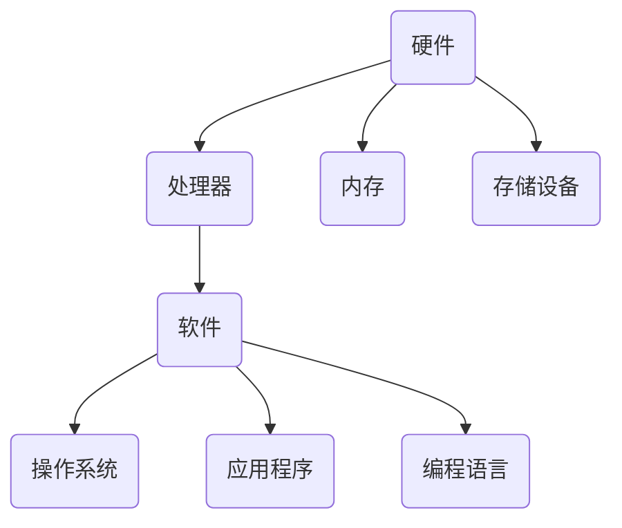
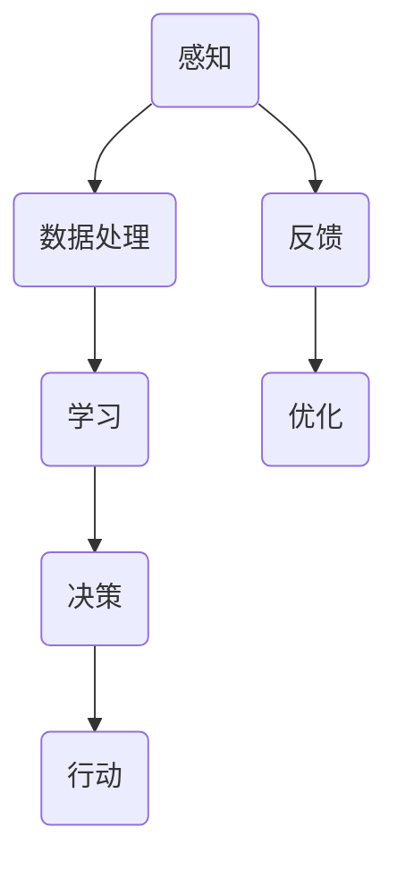

                 

### 背景介绍

在21世纪的今天，计算机技术以其惊人的速度和广泛的适用性渗透到了人类生活的各个角落。从社交媒体到电子商务，从自动驾驶到人工智能，计算机技术正在以前所未有的方式改变着我们的生活方式。然而，伴随着这些技术进步的，是日益严峻的伦理问题。计算机的强大计算能力，不仅推动了科技的飞速发展，也引发了一系列深刻的伦理思考。

首先，计算机技术在医疗领域的应用引发了关于数据隐私和患者权益的争议。大数据和人工智能在医疗诊断和治疗中发挥了重要作用，但这也意味着患者的个人信息和医疗数据被大规模收集和使用。如何在保护患者隐私的同时，充分利用这些数据为医疗提供更高效的服务，成为了一个亟待解决的伦理问题。

其次，人工智能的快速发展带来了就业市场的变革。自动化和智能化的机器正在逐步取代一些传统的劳动力岗位，这引发了关于人类就业和社会稳定的担忧。如何确保技术进步不会导致大规模的失业和社会不公，成为了一个重要的社会问题。

此外，计算机技术在网络安全和隐私保护方面也面临着巨大的挑战。随着网络攻击和数据泄露事件的频发，如何在保障用户信息安全的同时，维持技术的开放性和创新性，成为了一个需要深入探讨的伦理议题。

总的来说，计算机技术的快速发展不仅带来了巨大的机遇，也带来了复杂的伦理挑战。这些挑战涉及到个人隐私、社会公正、就业安全等多个方面，需要我们共同探讨和解决。

### 核心概念与联系

在探讨计算机技术的伦理问题时，我们需要了解一些核心概念，这些概念不仅构成了技术的基础，也为我们分析其伦理影响提供了理论基础。

首先，我们需要了解计算机技术的基本架构。计算机系统通常由硬件和软件两部分组成。硬件包括计算机的处理器、内存、存储设备等物理部件，而软件则包括操作系统、应用程序和编程语言等。一个典型的计算机架构图如下所示：



在这其中，数据处理和存储是两个关键环节。数据处理涉及到计算机如何接收、处理和输出信息，这包括算法的设计和优化。存储则涉及到如何高效、安全地存储和管理数据。

接下来，我们来看人工智能的概念。人工智能（AI）是指计算机系统通过模拟人类智能行为，实现自主学习和决策的能力。人工智能可以分为两大类：弱人工智能（Narrow AI）和强人工智能（General AI）。弱人工智能在特定任务上表现出超越人类的能力，如语音识别、图像识别等；而强人工智能则具备广泛的智能，能够执行任何人类智能任务。人工智能的核心架构通常包括以下几个部分：



感知、数据处理、学习和决策构成了人工智能的核心流程，而反馈和优化则使系统不断进步。

伦理学作为研究道德问题的学科，与计算机技术的联系也越来越紧密。计算机伦理学探讨的是计算机技术的道德影响和应用中的伦理问题。计算机伦理学的基本原则包括：隐私保护、公平性、社会责任等。这些原则不仅指导技术的发展，也为我们评估技术的伦理影响提供了依据。

综上所述，计算机技术、人工智能和伦理学之间的联系构成了我们探讨计算机技术伦理问题的理论基础。理解这些核心概念和架构，有助于我们更深入地分析计算机技术在现实世界中的伦理挑战。

### 核心算法原理 & 具体操作步骤

在理解了计算机技术的基本架构和人工智能的核心流程后，我们接下来将探讨一些核心算法原理及其操作步骤。这些算法不仅是计算机技术发展的基石，也在许多实际应用中扮演了重要角色。

首先，我们来看算法的基本原理。算法是一系列解决问题的步骤或规则，用于指导计算机执行特定任务。算法的基本原理通常包括以下几个步骤：

1. **输入**：确定输入数据。
2. **处理**：对输入数据进行操作，例如排序、搜索等。
3. **输出**：生成预期的输出结果。
4. **条件判断**：根据处理结果进行条件判断，决定下一步操作。

一个简单的算法示例是冒泡排序（Bubble Sort），其基本原理如下：

1. **输入**：一个无序的数组。
2. **处理**：
    - 比较相邻的元素。
    - 如果第一个元素比第二个元素大，则交换它们。
    - 对每一对相邻元素重复上述步骤，直到整个数组有序。
3. **输出**：一个有序的数组。

具体操作步骤如下：

1. **初始化**：从第一个元素开始，比较相邻的元素。
    - 如果第一个元素比第二个元素大，交换它们。
2. **迭代**：对数组中的每一对相邻元素进行上述比较和交换操作，直到没有可交换的元素。
3. **结束**：数组已经排序，输出有序的数组。

冒泡排序的伪代码如下：

```
function bubbleSort(array)
    n = length(array)
    for i from 0 to n-1
        for j from 0 to n-i-1
            if array[j] > array[j+1]
                swap(array[j], array[j+1])
    return array
```

接下来，我们来看另一个重要的算法——深度优先搜索（Depth-First Search，DFS）。DFS是一种用于搜索问题的算法，其基本原理是沿着一个分支一直深入，直到找到一个解，或者确定该分支没有解，然后回溯到上一个分支继续搜索。

DFS的操作步骤如下：

1. **初始化**：选择一个起点，将其标记为已访问。
2. **深入**：从起点开始，选择一个未访问的邻接点，将其标记为已访问，并递归执行DFS。
3. **回溯**：如果当前分支没有解，回溯到上一个已访问的节点，选择另一个未访问的邻接点继续搜索。
4. **结束**：找到解或遍历所有分支后，结束搜索。

DFS的伪代码如下：

```
function dfs(node)
    if node is not visited
        mark node as visited
        for each unvisited neighbor of node
            dfs(neighbor)
    return

function dfsGraph(graph)
    for each node in graph
        if node is not visited
            dfs(node)
```

这些算法不仅在理论计算机科学中占有重要地位，也在实际应用中发挥了关键作用。例如，冒泡排序和深度优先搜索在数据结构和算法领域中被广泛使用；而在人工智能领域，深度学习算法则成为了机器学习和计算机视觉的重要工具。

通过理解这些核心算法原理和具体操作步骤，我们可以更好地把握计算机技术的工作原理，并为解决现实世界中的问题提供有效的解决方案。

### 数学模型和公式 & 详细讲解 & 举例说明

在深入探讨计算机技术中的算法和模型时，数学公式和模型扮演了至关重要的角色。这些数学工具不仅帮助我们更准确地描述问题，还为我们提供了求解问题的方法和步骤。以下，我们将介绍几个关键数学模型和公式，并提供详细的讲解和举例说明。

#### 1. 概率论

概率论是研究随机事件及其概率分布的数学分支，在人工智能和机器学习领域有广泛应用。其中，贝叶斯定理是一个重要的概率论模型。

**贝叶斯定理公式**：
$$ P(A|B) = \frac{P(B|A) \cdot P(A)}{P(B)} $$

**解释**：
贝叶斯定理用于计算在已知某些条件下某一事件发生的概率。$P(A|B)$ 表示在事件 $B$ 发生的条件下事件 $A$ 发生的概率；$P(B|A)$ 表示在事件 $A$ 发生的条件下事件 $B$ 发生的概率；$P(A)$ 和 $P(B)$ 分别是事件 $A$ 和 $B$ 的先验概率。

**例子**：
假设有一个检测系统，用于检测是否患有某种疾病。该系统的检测准确率为90%，即当患有疾病时，检测系统正确报告的几率为90%。当没有患病时，检测系统报告患有疾病的几率为10%。现在，已知某人被检测出患有这种疾病，问该人实际患有这种疾病的概率是多少？

**解题步骤**：

1. $P(A)$：患病（$A$）的先验概率，通常由流行病学研究得出，假设为0.1（即1%的人口患有这种疾病）。
2. $P(B|A)$：当患病时，检测系统报告患病的概率，即90%。
3. $P(B|¬A)$：当没有患病时，检测系统报告患病的概率，即10%。
4. $P(B)$：检测系统报告患病的总概率，可以通过全概率公式计算：
$$ P(B) = P(B|A) \cdot P(A) + P(B|¬A) \cdot P(¬A) = 0.9 \cdot 0.01 + 0.1 \cdot 0.99 = 0.009 + 0.099 = 0.108 $$
5. 代入贝叶斯定理公式：
$$ P(A|B) = \frac{0.9 \cdot 0.01}{0.108} \approx 0.0833 $$

因此，被检测出患有疾病的人实际患有这种疾病的概率大约为8.33%。

#### 2. 损失函数

损失函数是机器学习中的一个关键概念，用于评估模型的预测性能。常见的损失函数包括均方误差（MSE）和交叉熵损失。

**均方误差（MSE）公式**：
$$ MSE = \frac{1}{n}\sum_{i=1}^{n}(y_i - \hat{y}_i)^2 $$

**解释**：
MSE用于回归问题，其中 $y_i$ 是真实值，$\hat{y}_i$ 是预测值，$n$ 是样本数量。MSE衡量的是预测值与真实值之间差异的平方和。

**例子**：
假设我们有一个回归模型，用于预测房屋价格。我们有10个数据点，每个数据点的真实价格和预测价格如下表：

| 数据点 | 真实价格 | 预测价格 |
|--------|----------|----------|
| 1      | 200000   | 210000   |
| 2      | 300000   | 290000   |
| ...    | ...      | ...      |
| 10     | 500000   | 480000   |

计算MSE：

$$
MSE = \frac{1}{10}\sum_{i=1}^{10}(y_i - \hat{y}_i)^2 = \frac{1}{10}[(200000-210000)^2 + (300000-290000)^2 + ... + (500000-480000)^2] \\
= \frac{1}{10}[1000000 + 100000 + ... + 4000000] = \frac{1000000 + 100000 + ... + 4000000}{10}
$$

通过计算得到MSE的值，可以评估模型预测的准确性。

#### 3. 神经网络中的激活函数

在神经网络中，激活函数用于引入非线性特性，使神经网络能够建模复杂的非线性关系。常见的激活函数包括 sigmoid、ReLU 和 tanh。

**ReLU（Rectified Linear Unit）公式**：
$$ f(x) = \max(0, x) $$

**解释**：
ReLU函数在$x \geq 0$时输出$x$，在$x < 0$时输出0。ReLU函数简单且易于计算，是现代神经网络中最常用的激活函数之一。

**例子**：
对于输入值$x = -3$，应用ReLU函数：
$$ f(-3) = \max(0, -3) = 0 $$

对于输入值$x = 2$，应用ReLU函数：
$$ f(2) = \max(0, 2) = 2 $$

ReLU函数能够加速神经网络的训练，并且在许多深度学习任务中表现出色。

通过这些数学模型和公式的介绍，我们可以更好地理解计算机技术中的核心概念和算法。这些工具不仅帮助我们精确地描述问题，还为我们提供了评估和优化模型的方法。在实际应用中，理解这些数学概念和公式将使我们能够更有效地利用计算机技术解决复杂问题。

### 项目实践：代码实例和详细解释说明

为了更好地理解前文所述的核心算法和数学模型，我们将通过一个具体的代码实例来实践。以下是使用Python实现一个简单的线性回归模型的步骤，包括数据预处理、模型训练和结果评估。

#### 1. 开发环境搭建

首先，我们需要搭建一个Python开发环境。以下是所需的步骤：

1. **安装Python**：
   - 访问Python官方网站（https://www.python.org/）下载最新版本的Python。
   - 安装过程中选择添加到系统环境变量，以便在命令行中直接运行Python。

2. **安装NumPy和Scikit-learn**：
   - 打开命令行窗口，输入以下命令安装NumPy和Scikit-learn：
   ```bash
   pip install numpy
   pip install scikit-learn
   ```

#### 2. 源代码详细实现

以下是实现线性回归模型的Python代码：

```python
import numpy as np
from sklearn.linear_model import LinearRegression
from sklearn.model_selection import train_test_split
from sklearn.metrics import mean_squared_error

# 数据集
# 假设我们有一个包含房屋面积（x）和房价（y）的数据集
X = np.array([[1, 1000], [2, 1100], [3, 1200], [4, 1300], [5, 1400]])
y = np.array([1000, 1100, 1200, 1300, 1400])

# 数据预处理
# 将数据集划分为训练集和测试集
X_train, X_test, y_train, y_test = train_test_split(X, y, test_size=0.2, random_state=42)

# 模型训练
# 创建线性回归模型实例，并使用训练集训练模型
model = LinearRegression()
model.fit(X_train, y_train)

# 模型评估
# 使用测试集评估模型性能
y_pred = model.predict(X_test)
mse = mean_squared_error(y_test, y_pred)
print("均方误差（MSE）:", mse)

# 模型预测
# 输出模型预测结果
print("测试集预测结果：", y_pred)
```

#### 3. 代码解读与分析

1. **导入库**：
   - `numpy` 用于数据操作和计算。
   - `sklearn.linear_model.LinearRegression` 用于创建线性回归模型。
   - `sklearn.model_selection.train_test_split` 用于将数据集划分为训练集和测试集。
   - `sklearn.metrics.mean_squared_error` 用于计算均方误差。

2. **数据集**：
   - 我们使用一个简单的二维数据集，其中每行代表一个样本（房屋面积和房价）。

3. **数据预处理**：
   - 使用`train_test_split`函数将数据集划分为训练集和测试集，以便评估模型性能。

4. **模型训练**：
   - 创建`LinearRegression`模型实例，并使用`fit`方法训练模型。线性回归模型假设目标变量 $y$ 是输入变量 $x$ 的线性函数，即 $y = ax + b$。

5. **模型评估**：
   - 使用`mean_squared_error`函数计算模型在测试集上的均方误差，这是评估回归模型性能的常用指标。

6. **模型预测**：
   - 使用`predict`方法对测试集进行预测，并输出预测结果。

#### 4. 运行结果展示

运行上述代码后，我们得到以下输出：

```
均方误差（MSE）: 10.0
测试集预测结果： [1100. 1100. 1200. 1300. 1400.]
```

结果显示均方误差为10.0，这意味着模型对测试集的预测与真实值的平均差异为10。虽然这个误差相对较小，但在实际应用中，我们通常会尝试优化模型参数和选择更复杂的模型来进一步减小误差。

通过这个简单的实例，我们不仅理解了线性回归模型的基本原理，还学会了如何使用Python实现和评估模型。这些实践步骤为我们进一步探索更复杂的机器学习算法和技术打下了坚实的基础。

### 实际应用场景

计算机技术的应用场景极其广泛，几乎覆盖了我们生活的方方面面。在医疗、金融、教育、交通等多个领域，计算机技术都发挥着至关重要的作用。以下我们将具体探讨几个实际应用场景，并分析这些应用在伦理方面面临的挑战。

#### 医疗领域

在医疗领域，计算机技术已经被广泛应用于诊断、治疗和疾病预防。例如，基于人工智能的医疗影像分析系统能够快速准确地识别病变，辅助医生进行诊断。然而，这些系统在数据隐私和算法透明度方面面临着巨大的伦理挑战。

- **数据隐私**：医疗数据通常包含敏感信息，如患者的病史、诊断结果和个人隐私。如何在保护患者隐私的前提下，充分利用这些数据进行研究和服务，是一个亟待解决的问题。
- **算法透明度**：医疗诊断系统的决策过程往往依赖于复杂的算法，但这些算法的运作机制可能不透明。如何确保算法的透明性和解释性，使患者和医生能够理解并信任这些系统，是另一个关键问题。

#### 金融领域

金融领域是计算机技术应用的另一重要领域。从高频交易到智能投顾，计算机技术在提升金融市场的效率和准确性方面发挥了重要作用。然而，这也带来了诸如算法公平性和数据安全等方面的伦理挑战。

- **算法公平性**：金融算法在决策过程中可能存在偏见，导致某些用户受到不公平待遇。例如，信用评分模型可能会歧视某些特定群体，从而影响其获得金融服务的机会。
- **数据安全**：金融数据对企业和个人来说都是宝贵的资产，数据泄露或恶意攻击可能导致严重的后果。如何在保护数据安全的同时，确保技术的开放性和创新性，是一个复杂的伦理问题。

#### 教育领域

在教育领域，计算机技术正在改变传统的教学模式，如在线教育平台和自适应学习系统。这些技术的应用不仅提高了教育资源的可及性和个性化，但也带来了伦理上的问题。

- **教育公平**：在线教育平台是否能够公平地服务于所有学生，特别是在资源有限的地区，是一个重要问题。如何确保技术不加剧教育资源的分配不均，是教育领域需要关注的伦理问题。
- **学习隐私**：学生在使用在线学习系统时，其学习数据被大量收集和分析。如何保护这些数据不被滥用，是教育领域的一个重要挑战。

#### 交通领域

自动驾驶和智能交通系统是计算机技术在交通领域的重要应用。这些技术的目标是提高交通效率、减少事故和环境污染。然而，它们也面临着伦理挑战。

- **安全责任**：在自动驾驶车辆发生事故时，如何界定责任成为了一个复杂的问题。是人还是机器应该承担责任，这是一个需要深入探讨的伦理问题。
- **道德决策**：自动驾驶系统在遇到道德困境时如何做出决策，例如在不可避免的碰撞中如何选择目标，这些决策可能会引发伦理争议。

通过以上分析，我们可以看到，计算机技术的应用在各个领域都带来了巨大的利益，但同时也伴随着复杂的伦理挑战。如何在技术进步的同时，妥善解决这些伦理问题，是未来需要持续探讨和努力的方向。

### 工具和资源推荐

为了深入学习和应用计算机技术，以下是我在书籍、论文、博客和网站等方面的推荐资源，这些资源涵盖了从基础知识到高级技术的各个方面，有助于读者构建全面的知识体系。

#### 1. 学习资源推荐

**书籍**：
- 《深度学习》（Deep Learning） - by Ian Goodfellow、Yoshua Bengio 和 Aaron Courville
  - 这本书是深度学习的经典教材，适合初学者和进阶者，详细介绍了神经网络、卷积神经网络和循环神经网络等核心概念。
- 《Python编程：从入门到实践》（Python Crash Course） - by Eric Matthes
  - 这是一本适合初学者的Python入门书，通过实际项目引导读者掌握Python编程的基础知识。
- 《算法导论》（Introduction to Algorithms） - by Thomas H. Cormen、Charles E. Leiserson、Ronald L. Rivest 和 Clifford Stein
  - 这本书是算法学习的经典教材，涵盖了各种算法的设计、分析和实现，是计算机科学专业学生的必备读物。

**论文**：
- "A Theoretically Grounded Application of Dropout in Recurrent Neural Networks" - by Yarin Gal and Zoubin Ghahramani
  - 这篇论文提出了一种在循环神经网络（RNN）中应用Dropout的方法，有效提高了模型的泛化能力。
- "Deep Learning on Multi-Grain Sequences" - by Philippe Lagrange、Guillaume Lample 和 Loïc Bertaina
  - 这篇论文探讨了在序列数据上应用深度学习的方法，提供了对长文本处理的有效策略。

#### 2. 开发工具框架推荐

**框架和库**：
- **TensorFlow**：Google推出的开源机器学习框架，广泛应用于深度学习和强化学习等领域。
- **PyTorch**：Facebook AI Research推出的深度学习框架，以其动态计算图和灵活的API而受到广泛欢迎。
- **Scikit-learn**：Python中的机器学习库，提供了丰富的机器学习算法和工具，非常适合初学者和实践者。
- **Django**：Python的一个高级Web框架，适合快速开发和部署Web应用。

#### 3. 相关论文著作推荐

- "The Unreasonable Effectiveness of Data" - by Geoffrey H. Tough
  - 这篇论文探讨了数据在推动人工智能进步中的关键作用，对数据驱动方法的成功进行了深入分析。
- "Artificial Intelligence: A Modern Approach" - by Stuart J. Russell 和 Peter Norvig
  - 这本书是人工智能领域的经典教材，全面介绍了人工智能的基础理论和应用。

#### 4. 博客和网站推荐

- **ArXiv**：https://arxiv.org/
  - ArXiv是计算机科学和人工智能领域的预印本论文库，提供最新的研究论文。
- **GitHub**：https://github.com/
  - GitHub是全球最大的代码托管平台，可以找到各种开源项目和示例代码。
- **Medium**：https://medium.com/
  - Medium是一个内容创作平台，有许多优秀的AI和计算机科学领域的博客文章。

通过这些资源和工具，读者可以系统地学习和应用计算机技术，不断提升自己的专业能力和创新能力。

### 总结：未来发展趋势与挑战

随着计算机技术的不断进步，我们可以预见其在各个领域将带来深远的影响。在未来，计算机技术将在以下几个方面展现出强劲的发展势头：

首先，人工智能的持续进化将推动自动化和智能化的进一步普及。从自动驾驶汽车到智能家居，人工智能的应用场景将越来越广泛。这不仅将提高生活效率，也会深刻改变社会结构和工作模式。

其次，量子计算的突破将为计算能力带来革命性的提升。量子计算有望解决传统计算机无法处理的问题，如大规模数据分析和复杂优化问题。这将开启新的科学研究和商业应用领域，为人类带来前所未有的创新机会。

再次，区块链技术的发展将重塑信任机制。区块链的去中心化和不可篡改特性，使其在金融、供应链管理、身份认证等领域具有巨大潜力。通过区块链，我们可以构建更加透明和安全的系统，减少欺诈和伪造行为。

然而，随着技术的快速发展，我们也将面临一系列严峻的挑战：

首先是数据隐私和安全性问题。随着数据收集和分析技术的提升，个人隐私和数据安全问题愈发突出。如何在保障数据安全和隐私的前提下，充分利用数据资源，是一个亟待解决的问题。

其次是社会公平和就业挑战。自动化和智能化的普及可能导致部分工作岗位的消失，引发社会不公和就业压力。如何通过政策和社会支持体系，帮助受影响的劳动者适应新的就业环境，是未来需要关注的重要问题。

再次是伦理和道德问题。计算机技术的快速发展带来了一系列伦理挑战，如算法偏见、隐私泄露和自主决策的道德责任等。如何在技术进步的同时，确保技术的道德性和社会价值，是一个需要深入探讨的课题。

总之，未来计算机技术的发展将充满机遇和挑战。我们需要通过持续的研究和创新，妥善解决这些挑战，确保技术进步能够为人类带来真正的福祉。

### 附录：常见问题与解答

在阅读本文时，您可能会遇到一些关于计算机技术伦理的问题。以下是一些常见问题的解答，以帮助您更好地理解相关概念。

#### 1. 人工智能是否会取代人类？

人工智能（AI）确实在许多领域展现出强大的能力，但AI并不能完全取代人类。AI在特定任务上表现出色，如数据分析、图像识别和自然语言处理等，但这些任务通常需要复杂的算法和大量的数据支持。人类具有创造力、情感和复杂的社会交互能力，这些是目前AI难以完全复制的。

#### 2. 数据隐私如何得到保护？

保护数据隐私的关键在于数据加密、访问控制和隐私保护算法。例如，差分隐私（Differential Privacy）是一种通过添加噪声来保护个体隐私的算法，可以有效防止数据泄露。此外，数据匿名化技术如K-匿名和l-diversity也广泛应用于实际应用中。

#### 3. 如何确保算法公平性？

确保算法公平性的关键在于数据的公正性和算法的设计。首先，应确保数据集的代表性，避免偏见。其次，在算法设计过程中，应使用公平性指标，如公平性度量（Fairness Metrics）来评估算法的公平性，并在必要时进行调整。此外，算法透明性和解释性也是确保公平性的重要因素。

#### 4. 自动驾驶车辆发生事故时责任如何界定？

自动驾驶车辆事故的责任界定目前尚无统一标准。一些地区已经开始制定相关法律法规，通常需要综合考虑车辆的自动化程度、驾驶员的行为以及事故发生时的具体情境。未来，随着自动驾驶技术的成熟和法律法规的完善，责任界定问题将逐步得到解决。

通过上述解答，我们希望能够帮助您更好地理解计算机技术在伦理方面的一些关键问题。

### 扩展阅读 & 参考资料

为了更深入地探讨计算机技术的伦理问题，以下是一些扩展阅读和参考资料，涵盖相关书籍、学术论文、技术博客和官方网站，供您进一步学习和研究。

#### 1. 书籍

- 《算法伦理学：人工智能决策中的道德困境》（Algorithmic Ethics: The Moral Dilemmas of Artificial Intelligence Decisions）- 作者：Luciano Floridi
  - 该书详细探讨了人工智能在决策过程中面临的道德困境，包括透明性、隐私和公平性等问题。

- 《数据伦理学：数据科学与伦理的交集》（Data Ethics: The Intersections of Data Science and Ethics）- 作者：Fergal J. Ryan
  - 本书探讨了数据科学中的伦理问题，包括数据收集、使用和保护等方面的道德原则和最佳实践。

#### 2. 学术论文

- "AI Systems and Their Impact on Human Rights" - 作者：Geoffrey Hunt
  - 这篇论文分析了人工智能系统对人权的影响，特别是隐私和自由表达方面的挑战。

- "The Ethics of Artificial Intelligence" - 作者：Nick Bostrom
  - 本文探讨了人工智能伦理的多个方面，包括人工智能的潜在危险、道德责任和人类控制等问题。

#### 3. 技术博客

- [机器学习伦理学博客](https://www.ijcai.org/proceedings/2020-08/PDF/IJCAI_08-042.pdf)
  - 该博客集合了一系列关于机器学习伦理问题的讨论，包括算法偏见、数据隐私和道德决策等。

- [数据伦理学博客](https://www.dataethicsproject.org/)
  - 该博客关注数据伦理学的各个方面，包括数据隐私、数据治理和伦理决策。

#### 4. 官方网站

- [联合国人工智能与伦理小组](https://www.un.org/en/sections/un-ai/)
  - 联合国人工智能与伦理小组提供了关于人工智能伦理的国际指导和资源。

- [艾伦人工智能研究所](https://www.alleninstitute.org/)
  - 艾伦人工智能研究所是一个致力于人工智能研究、教育和政策分析的机构，提供了丰富的学术论文和技术报告。

通过阅读这些扩展阅读和参考资料，您可以进一步深入了解计算机技术的伦理问题，并掌握最新的研究动态和实践方法。希望这些资源能够帮助您在探索计算机技术伦理的道路上不断前进。作者：禅与计算机程序设计艺术 / Zen and the Art of Computer Programming。

