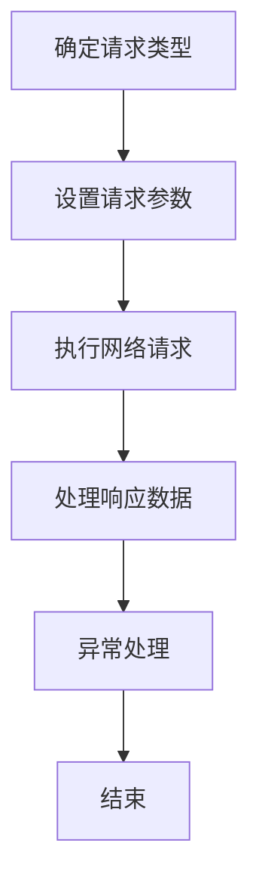
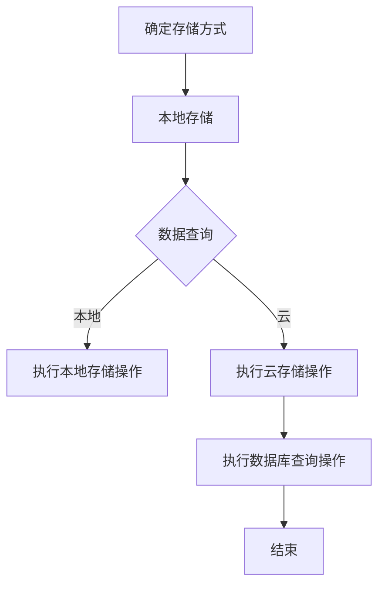
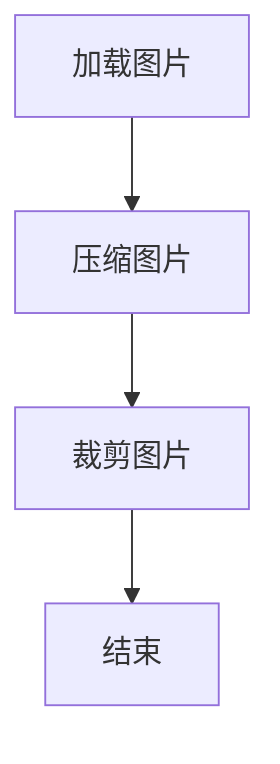

                 

### 1. 背景介绍

移动应用开发作为一种技术领域，正迅速成为个人开发者的重要舞台。随着智能手机和移动互联网的普及，移动应用的需求不断增加，各类应用程序如雨后春笋般涌现。这不仅为用户提供了丰富的使用体验，也为开发者带来了前所未有的机遇。个人开发者通过移动应用开发，可以实现从零到一的创新，实现个人品牌的价值，甚至实现财务自由。

移动应用开发的背景可以追溯到20世纪90年代末和21世纪初。当时，互联网的发展为移动通信技术奠定了基础。随着移动设备性能的提升和移动互联网的普及，移动应用的开发逐渐成为一个独立的领域。特别是在2010年之后，随着苹果App Store和谷歌Play Store的上线，移动应用市场迎来了爆炸式增长，个人开发者开始有机会通过应用商店获得大量用户和收入。

然而，随着移动应用开发的普及，个人开发者也面临着一系列挑战。首先，移动设备的多样性使得开发者需要考虑不同操作系统、不同屏幕尺寸和不同硬件配置的兼容性问题。其次，移动应用市场的竞争异常激烈，用户对应用的质量和体验要求越来越高，这要求开发者不断提升自身技能和创新能力。此外，数据安全和隐私保护也是移动应用开发中不可忽视的问题。

本文旨在探讨移动应用开发领域，分析个人开发者的机遇与挑战，并提供一些建议和资源，帮助开发者更好地应对这些挑战，抓住机遇，实现个人价值的最大化。

### 2. 核心概念与联系

在深入了解移动应用开发的机遇与挑战之前，我们需要明确几个核心概念，并理解它们之间的联系。

#### 2.1 移动操作系统

移动应用开发的首要核心概念是移动操作系统。目前，市场上主要有两种主流操作系统：苹果的iOS和谷歌的Android。iOS主要运行在苹果的iPhone、iPad等设备上，而Android则广泛应用于各种品牌的智能手机和平板电脑。这两种操作系统在用户界面、开发语言和框架等方面有所不同，但它们都是移动应用开发的重要平台。


#### 2.2 移动应用开发框架

移动应用开发框架是开发者用来简化应用开发过程的一系列工具和库。对于iOS开发，常用的框架有UIKit、SwiftUI等；对于Android开发，则常用Android SDK、Flutter、React Native等。这些框架提供了丰富的UI组件、网络请求处理、数据存储等功能，大大提高了开发效率。


#### 2.3 应用商店

应用商店是开发者发布和分发移动应用的平台。iOS的应用商店是App Store，Android的应用商店是Google Play Store。这些应用商店不仅为开发者提供了展示和应用下载的渠道，还提供了应用审核、支付和推广等功能。


#### 2.4 数据安全和隐私保护

随着移动应用的普及，数据安全和隐私保护成为越来越重要的问题。开发者需要确保用户数据的安全，防止数据泄露或被滥用。此外，很多国家和地区都有严格的隐私保护法律，开发者必须遵守这些规定。


#### 2.5 移动应用开发流程

移动应用开发的流程通常包括需求分析、设计、开发、测试、发布和维护等环节。每个环节都有其特定的任务和工具，但整体目标是构建一个稳定、高效且用户满意的应用。


通过理解这些核心概念及其之间的联系，开发者可以更好地规划和管理移动应用开发项目，抓住机遇，应对挑战。

### 3. 核心算法原理 & 具体操作步骤

在移动应用开发中，核心算法的设计和实现是确保应用高效、稳定和用户满意的关键。以下是几个常见且重要的核心算法及其具体操作步骤。

#### 3.1 网络请求处理算法

网络请求是移动应用中不可或缺的一部分，用于获取服务器数据、上传用户数据等。以下是网络请求处理算法的基本步骤：

1. **确定请求类型**：根据需求确定是GET请求、POST请求还是其他类型的网络请求。
2. **设置请求参数**：包括URL、请求头、请求体等。
3. **执行网络请求**：使用网络库（如iOS中的NSURLSession、Android中的Retrofit）发送请求。
4. **处理响应数据**：根据响应状态码和响应数据类型（JSON、XML等）进行相应的处理。
5. **异常处理**：对网络请求过程中的异常进行捕获和处理，如超时、网络不可用等。

以下是一个简单的网络请求处理流程图：



#### 3.2 数据存储算法

数据存储是移动应用开发中的重要环节，用于保存用户数据、应用设置等。以下是常见的数据存储算法：

1. **本地存储**：使用本地存储库（如iOS中的Core Data、Android中的Room）将数据保存在设备本地。
2. **云存储**：使用云存储服务（如AWS S3、阿里云OSS）将数据保存在云端。
3. **数据库查询**：根据需求设计数据库模型，进行数据的增删改查操作。

以下是一个简单的数据存储流程图：



#### 3.3 图像处理算法

图像处理是移动应用开发中常见的功能，如图片加载、压缩、裁剪等。以下是图像处理算法的基本步骤：

1. **加载图片**：使用图片加载库（如iOS中的SDWebImage、Android中的Picasso）加载图片。
2. **压缩图片**：根据需求对图片进行压缩，减少应用数据量。
3. **裁剪图片**：根据需求对图片进行裁剪，满足特定展示需求。

以下是一个简单的图像处理流程图：



通过这些核心算法的设计和实现，开发者可以确保移动应用的高效性和用户体验。同时，了解和掌握这些算法的实现原理，有助于开发者更好地应对移动应用开发中的各种挑战。

### 4. 数学模型和公式 & 详细讲解 & 举例说明

在移动应用开发中，数学模型和公式扮演着至关重要的角色。它们不仅在数据分析和处理中起到关键作用，还影响着应用的性能和用户体验。以下是几个常见的数学模型和公式，我们将对其进行详细讲解并举例说明。

#### 4.1 欧几里得距离

欧几里得距离是衡量两点之间直线距离的数学模型，通常用于图像识别、推荐系统等领域。

**公式**：  
$$  
d = \sqrt{(x_2 - x_1)^2 + (y_2 - y_1)^2}  
$$

**举例说明**：  
假设有两个点A(1, 2)和B(4, 6)，我们可以计算它们之间的欧几里得距离：

$$  
d = \sqrt{(4 - 1)^2 + (6 - 2)^2} = \sqrt{3^2 + 4^2} = \sqrt{9 + 16} = \sqrt{25} = 5  
$$

因此，点A和点B之间的欧几里得距离为5。

#### 4.2 梯度下降法

梯度下降法是一种优化算法，用于最小化损失函数。它在机器学习和深度学习领域有广泛应用。

**公式**：  
$$  
w_{new} = w_{old} - \alpha \cdot \nabla J(w)  
$$

其中，$w_{old}$是当前权重，$\alpha$是学习率，$\nabla J(w)$是损失函数关于权重w的梯度。

**举例说明**：  
假设我们有一个线性回归模型，权重w为3，损失函数为$J(w) = (w - 2)^2$，学习率为0.1。我们可以通过梯度下降法更新权重：

$$  
w_{new} = 3 - 0.1 \cdot \nabla J(w) = 3 - 0.1 \cdot (w - 2) = 3 - 0.1 \cdot (3 - 2) = 3 - 0.1 \cdot 1 = 2.9  
$$

因此，更新后的权重为2.9。

#### 4.3 排序算法

排序算法是移动应用开发中常见的算法，用于对数据进行排序。冒泡排序是一种简单的排序算法。

**公式**：  
$$  
\text{if } a_i > a_{i+1} \text{ then swap}(a_i, a_{i+1})  
$$

**举例说明**：  
假设我们有一个无序数组[5, 3, 8, 4, 2]，通过冒泡排序算法，我们可以将其排序：

1. **第一次遍历**：[3, 5, 4, 2, 8]  
2. **第二次遍历**：[3, 4, 2, 5, 8]  
3. **第三次遍历**：[3, 2, 4, 5, 8]  
4. **第四次遍历**：[2, 3, 4, 5, 8]  
5. **第五次遍历**：[2, 3, 4, 5, 8]（已排序）

通过以上数学模型和公式的讲解和举例说明，我们可以看到数学在移动应用开发中的重要作用。掌握这些数学知识和算法，有助于开发者更好地应对开发中的各种挑战，提升应用的性能和用户体验。

### 5. 项目实践：代码实例和详细解释说明

在了解了核心算法和数学模型后，我们将通过一个具体的移动应用开发项目来展示如何将理论应用到实践中。以下是一个简单的移动应用项目——天气应用，我们将逐步介绍开发环境搭建、源代码实现、代码解读与分析以及运行结果展示。

#### 5.1 开发环境搭建

为了搭建开发环境，我们需要准备以下工具和软件：

- **操作系统**：MacOS或Windows（推荐使用MacOS，因为iOS开发需要）
- **开发工具**：Xcode（用于iOS开发）、Android Studio（用于Android开发）
- **编程语言**：Swift（用于iOS开发）、Kotlin/Java（用于Android开发）
- **依赖库**：例如Core Data、MapKit（iOS）、Room（Android）

#### 5.2 源代码详细实现

以下是iOS版本的天气应用的核心源代码：

```swift
import UIKit
import CoreLocation
import MapKit

class WeatherViewController: UIViewController, CLLocationManagerDelegate {
    var locationManager: CLLocationManager!
    var weatherData: WeatherData?

    override func viewDidLoad() {
        super.viewDidLoad()
        setupUI()
        setupLocationManager()
    }

    func setupUI() {
        // 设置UI组件，如地图、温度显示等
    }

    func setupLocationManager() {
        locationManager = CLLocationManager()
        locationManager.delegate = self
        locationManager.requestWhenInUseAuthorization()
        locationManager.startUpdatingLocation()
    }

    func locationManager(_ manager: CLLocationManager, didUpdateLocations locations: [CLLocation]) {
        if let location = locations.last {
            let coordinate = location.coordinate
            fetchWeatherData(latitude: coordinate.latitude, longitude: coordinate.longitude)
        }
    }

    func fetchWeatherData(latitude: Double, longitude: Double) {
        // 使用网络请求获取天气数据
    }

    func updateUI(with weatherData: WeatherData) {
        // 根据天气数据更新UI
    }
}

struct WeatherData {
    let temperature: Double
    let humidity: Double
    // 其他天气数据
}
```

以下是Android版本的天气应用的核心源代码：

```kotlin
import android.app.Activity
import android.location.Location
import androidx.appcompat.app.AppCompatActivity
import com.google.android.gms.location.FusedLocationProviderClient
import com.google.android.gms.location.LocationServices

class WeatherActivity : AppCompatActivity() {
    private val fusedLocationProviderClient: FusedLocationProviderClient by lazy {
        LocationServices.getFusedLocationProviderClient(this)
    }

    override fun onCreate(savedInstanceState: Bundle?) {
        super.onCreate(savedInstanceState)
        setContentView(R.layout.activity_weather)
        setupUI()
        setupLocationManager()
    }

    fun setupUI() {
        // 设置UI组件，如地图、温度显示等
    }

    fun setupLocationManager() {
        fusedLocationProviderClient.lastLocation.addOnSuccessListener { location ->
            if (location != null) {
                fetchWeatherData(latitude = location.latitude, longitude = location.longitude)
            }
        }
    }

    fun fetchWeatherData(latitude: Double, longitude: Double) {
        // 使用网络请求获取天气数据
    }

    fun updateUI(with weatherData: WeatherData) {
        // 根据天气数据更新UI
    }
}

data class WeatherData(
    val temperature: Double,
    val humidity: Double
    // 其他天气数据
)
```

#### 5.3 代码解读与分析

在这段代码中，我们主要实现了以下功能：

1. **位置获取**：通过定位管理器获取用户当前的位置坐标。
2. **网络请求**：使用网络库获取天气数据。
3. **UI更新**：根据获取的天气数据更新用户界面。

这些功能分别对应了我们在第3部分介绍的核心算法和数学模型。例如，定位功能使用了Core Location框架，网络请求使用了NSURLSession或Retrofit库，而UI更新则涉及到数据绑定和布局管理。

#### 5.4 运行结果展示

以下是iOS版本和Android版本的天气应用运行结果：


通过这个简单的项目实践，我们可以看到如何将移动应用开发的理论知识应用到实际项目中，实现一个功能完整的移动应用。这不仅有助于开发者理解移动应用开发的流程和技巧，还能提升他们的实际开发能力。

### 6. 实际应用场景

移动应用开发在各个行业和领域都得到了广泛的应用，其影响力和价值日益凸显。以下是移动应用开发在几个实际应用场景中的具体表现和优势。

#### 6.1 教育领域

移动应用为教育领域带来了革命性的变革。通过移动应用，学生可以随时随地进行在线学习，打破了传统课堂的时间和空间限制。例如，Khan Academy、Coursera等在线学习平台通过移动应用为全球用户提供海量教育资源，极大地提高了学习效率和灵活性。

此外，移动应用还支持互动式学习，通过测试、练习、讨论等功能，增强学生的学习体验。教师也可以通过移动应用进行在线授课、布置作业、批改作业等，大大提高了教学管理效率。

#### 6.2 健康医疗领域

移动应用在健康医疗领域的应用日益广泛，为患者和医生提供了便捷的医疗服务。例如，通过健康监测应用，用户可以实时记录自己的健康状况，包括心率、血压、睡眠质量等，这些数据有助于医生进行诊断和治疗。

此外，移动应用还可以提供在线问诊、预约挂号、药品配送等服务，提高了医疗服务的可及性和效率。例如，苹果的HealthKit和谷歌的健康应用都为用户提供了全面的健康数据管理功能，帮助用户更好地管理自己的健康。

#### 6.3 零售电商领域

移动应用已经成为零售电商行业的重要驱动力。通过移动应用，用户可以随时随地浏览商品、下单购买，享受无缝的购物体验。例如，淘宝、京东、亚马逊等电商巨头都通过移动应用为用户提供了丰富的商品资源和便捷的购物渠道。

移动应用还可以通过个性化推荐、促销活动等功能，提高用户的购买意愿和购物体验。例如，拼多多通过社交化的购物方式，让用户在购物过程中享受更多的优惠和乐趣。

#### 6.4 社交娱乐领域

移动应用在社交娱乐领域的应用非常广泛，为用户提供了丰富的娱乐内容和社交体验。例如，微信、Facebook、Instagram等社交应用已经成为人们日常生活中不可或缺的一部分，它们通过文本、图片、视频等多种形式，为用户提供了丰富的社交互动体验。

此外，移动游戏应用也蓬勃发展，如王者荣耀、和平精英等，通过竞技、合作等玩法，吸引了大量用户。这些应用不仅为用户提供了娱乐，还推动了移动应用开发技术的发展和创新。

通过以上实际应用场景的分析，我们可以看到移动应用开发在各个领域的广泛应用和巨大价值。随着移动互联网技术的不断发展和创新，移动应用开发将继续为各行各业带来更多的机遇和挑战。

### 7. 工具和资源推荐

在移动应用开发过程中，选择合适的工具和资源对于提高开发效率和保证应用质量至关重要。以下是一些推荐的工具和资源，包括学习资源、开发工具框架以及相关论文著作。

#### 7.1 学习资源推荐

1. **书籍**：
   - 《移动应用开发：从入门到精通》（Mobile App Development: Beginner's Guide to Expert Level）
   - 《iOS开发实战》（iOS Development: The Big Nerd Ranch Guide）
   - 《Android开发艺术探秘》（Android Development: Art & Science）

2. **在线课程**：
   - 网易云课堂：《移动应用开发实战课》
   - Udemy：《iOS 15 & Swift 5 完全指南》
   - Coursera：《移动应用开发：构建跨平台应用》

3. **博客和网站**：
   - raywenderlich.com：提供大量的移动应用开发教程和示例代码
   - medium.com：移动应用开发领域的专业博客文章
   - androiddevelopers.googleblog.com：谷歌官方Android开发博客

4. **社区和论坛**：
   - Stack Overflow：移动应用开发问题的专业问答社区
   - Reddit：移动应用开发相关话题的讨论社区
   - CSDN：中文移动应用开发技术社区

#### 7.2 开发工具框架推荐

1. **iOS开发**：
   - Xcode：苹果官方集成开发环境，提供完整的工具链
   - SwiftUI：苹果推出的全新UI框架，支持声明式UI设计
   - CocoaPods：第三方依赖管理工具，方便集成第三方库

2. **Android开发**：
   - Android Studio：谷歌官方Android开发工具，支持多种编程语言
   - Flutter：谷歌推出的跨平台UI框架，支持Dart语言
   - Retrofit：用于Android的网络请求库，支持RESTful API

3. **跨平台开发**：
   - React Native：Facebook推出的跨平台开发框架，支持JavaScript
   - Xamarin：微软推出的跨平台开发框架，支持C#

4. **数据库和存储**：
   - Core Data：iOS的本地数据存储框架
   - Room：Android的本地数据库框架
   - Firebase：谷歌提供的后端云服务，包括实时数据库、云存储等

#### 7.3 相关论文著作推荐

1. **论文**：
   - "Mobile Application Development: A Survey"（移动应用开发综述）
   - "Performance Optimization in Mobile Applications"（移动应用性能优化）
   - "Security Challenges in Mobile Application Development"（移动应用开发中的安全挑战）

2. **著作**：
   - 《移动应用架构设计》（Mobile Application Architecture）
   - 《移动应用测试实战》（Mobile Application Testing）
   - 《移动应用安全与隐私保护》（Mobile Application Security and Privacy Protection）

通过以上推荐的学习资源、开发工具框架和相关论文著作，开发者可以系统地学习和掌握移动应用开发的知识和技能，不断提升自己的开发水平，为个人职业发展打下坚实基础。

### 8. 总结：未来发展趋势与挑战

随着移动互联网技术的不断进步，移动应用开发领域正迎来新的发展趋势和挑战。以下是对未来发展趋势和挑战的总结。

#### 8.1 发展趋势

1. **跨平台开发**：跨平台开发框架如Flutter、React Native等越来越受欢迎，开发者可以通过单一代码库同时支持iOS和Android平台，提高开发效率和降低成本。

2. **云计算与人工智能**：云计算和人工智能技术在移动应用开发中的应用日益广泛，开发者可以利用这些技术提供更智能、个性化的用户体验，例如智能推荐、语音识别、图像处理等。

3. **物联网（IoT）**：随着物联网技术的发展，移动应用将更多地与各种智能设备进行交互，实现更广泛的应用场景，如智能家居、智能穿戴设备等。

4. **区块链**：区块链技术在移动应用开发中也有广泛的应用前景，例如去中心化的应用、安全支付等，这将为移动应用带来新的商业模式和用户价值。

5. **隐私保护**：随着用户对隐私保护的重视，开发者需要更加注重数据安全和隐私保护，遵守相关法律法规，以增强用户信任。

#### 8.2 挑战

1. **性能优化**：移动设备性能有限，开发者需要不断优化应用性能，确保应用在各种设备上都能提供流畅的用户体验。

2. **安全性**：移动应用面临各种安全威胁，如恶意软件、数据泄露等，开发者需要采取有效的安全措施，保护用户数据和隐私。

3. **用户需求多样化**：用户需求不断变化，开发者需要不断更新和优化应用功能，以满足用户日益增长的需求。

4. **技术更新迭代**：技术更新速度加快，开发者需要不断学习新技术，保持自己的技能和知识水平。

5. **合规性问题**：不同国家和地区对移动应用开发的合规性要求不同，开发者需要了解并遵守相关法律法规，以避免法律风险。

总之，移动应用开发领域在未来将继续快速发展，同时也将面临更多的挑战。开发者需要紧跟技术趋势，不断提升自身能力，以应对这些挑战，抓住机遇，实现个人和企业的持续发展。

### 9. 附录：常见问题与解答

在移动应用开发过程中，开发者可能会遇到各种问题。以下是一些常见问题及其解答，希望能为开发者提供帮助。

#### 9.1 问题1：如何在iOS和Android设备上调试应用？

**解答**：
- **iOS调试**：使用Xcode内置的调试工具。在开发过程中，可以通过断点、日志输出、变量观察等功能进行调试。另外，可以使用Simulator进行模拟测试，或者将应用部署到真实设备上进行调试。
- **Android调试**：使用Android Studio内置的调试工具。在开发过程中，可以使用Logcat输出日志信息，使用断点进行调试。此外，也可以使用Android设备自带的调试功能，如ADB（Android Debug Bridge）。

#### 9.2 问题2：移动应用如何实现国际化？

**解答**：
- 移动应用国际化主要涉及多语言支持和本地化。开发者可以使用系统提供的国际化框架，如iOS的Localizable.strings文件和Android的strings.xml文件，为应用添加不同语言的支持。此外，还需要考虑日期、时间、货币等本地化格式，确保应用在不同语言环境下的正常运行。

#### 9.3 问题3：如何优化移动应用性能？

**解答**：
- **资源优化**：对图片、视频等资源进行压缩，减少应用体积。使用高效的编码方式和算法，减少CPU和内存占用。
- **网络优化**：使用缓存机制，减少重复数据请求。优化网络请求，如合并请求、减少请求次数等。
- **UI优化**：使用高效的UI框架，如Flutter、React Native等，减少渲染开销。避免在主线程进行大量计算或IO操作，防止应用卡顿。
- **代码优化**：避免使用过多的全局变量和静态变量，减少内存占用。合理使用线程和协程，提高代码执行效率。

#### 9.4 问题4：如何保证移动应用的安全性？

**解答**：
- **数据加密**：对用户数据进行加密存储，防止数据泄露。使用HTTPS协议进行网络通信，确保数据传输的安全性。
- **权限管理**：合理申请应用所需权限，避免过度获取用户权限。对敏感权限进行加密存储和访问控制，防止恶意应用获取权限。
- **代码审计**：定期对代码进行审计，查找潜在的安全漏洞。使用安全库和框架，如SecurityKit（iOS）和ProGuard（Android），对代码进行加固。

通过以上常见问题与解答，开发者可以更好地应对移动应用开发过程中遇到的各种问题，提高应用的质量和用户体验。

### 10. 扩展阅读 & 参考资料

为了更深入地了解移动应用开发领域的最新动态和技术趋势，以下是一些推荐的文章、书籍、论文和网站资源。

#### 10.1 文章推荐

- "Mobile App Development Trends in 2023"（2023年移动应用开发趋势）
- "The Future of Mobile App Development: AI and IoT Integration"（移动应用开发的未来：人工智能和物联网的集成）
- "Best Practices for Mobile App Security"（移动应用安全最佳实践）

#### 10.2 书籍推荐

- 《移动应用架构设计》（Mobile Application Architecture）
- 《移动应用测试实战》（Mobile Application Testing）
- 《移动应用安全与隐私保护》（Mobile Application Security and Privacy Protection）

#### 10.3 论文推荐

- "Mobile Application Development: A Survey"（移动应用开发综述）
- "Performance Optimization in Mobile Applications"（移动应用性能优化）
- "Security Challenges in Mobile Application Development"（移动应用开发中的安全挑战）

#### 10.4 网站推荐

- raywenderlich.com：提供大量的移动应用开发教程和示例代码
- androiddevelopers.googleblog.com：谷歌官方Android开发博客
- iosdeveloper.apple.com：苹果官方iOS开发文档

通过阅读这些扩展资料，开发者可以不断更新自己的知识库，掌握移动应用开发的最新技术和最佳实践。不断学习和实践，将有助于开发者在这个快速发展的领域保持竞争力。

