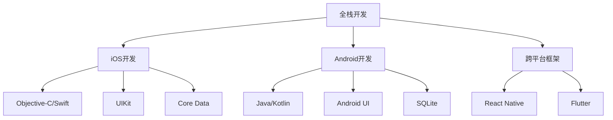

                 

### 文章标题

移动端全栈开发：iOS和Android平台的统一解决方案

> 关键词：移动端全栈开发、iOS、Android、跨平台开发、统一解决方案

> 摘要：本文将深入探讨移动端全栈开发的技术与实践，重点分析iOS和Android平台的统一解决方案。通过详细的算法原理、数学模型、项目实践等环节，帮助读者全面掌握移动端全栈开发的技能，从而提高移动应用的开发效率和稳定性。

## 1. 背景介绍

随着移动互联网的飞速发展，移动设备已经成为人们生活中不可或缺的一部分。无论是智能手机、平板电脑还是智能手表，都为用户提供了丰富的应用场景。在这样的背景下，移动应用的开发需求也随之不断增加。然而，由于iOS和Android两大移动操作系统在技术架构、开发语言、API等方面存在差异，使得移动应用开发者不得不面对双平台开发的挑战。

传统的双平台开发方式通常采用原生开发、Web开发和混合开发三种模式。原生开发是指分别针对iOS和Android平台使用对应的开发语言（如Objective-C/Swift、Java/Kotlin）进行开发，这种方式虽然性能优异，但开发成本高且开发周期长。Web开发则是利用HTML5、CSS3和JavaScript等Web技术进行开发，虽然可以跨平台，但性能和体验相对较差。混合开发则介于原生和Web之间，通过使用一些跨平台框架（如React Native、Flutter）来平衡性能和开发效率。

为了解决双平台开发的痛点，近年来涌现了一批跨平台开发框架，如React Native、Flutter、Xamarin等。这些框架旨在提供一套统一的开发环境，使得开发者可以使用同一套代码库在iOS和Android平台上进行开发，从而大大提高了开发效率，降低了开发成本。

本文将重点讨论移动端全栈开发，特别是在iOS和Android平台上实现统一解决方案的方法和技巧。通过深入分析核心算法、数学模型和项目实践，本文旨在为移动应用开发者提供一套完整的开发指南，帮助他们快速掌握移动端全栈开发的技能。

## 2. 核心概念与联系

### 2.1 全栈开发的定义

全栈开发是指开发者在前后端都有深入的了解和实际操作经验，能够独立完成整个软件项目的开发和部署。在移动端全栈开发中，这意味着开发者需要同时掌握iOS和Android平台的开发技能，以及前后端分离的开发模式。

### 2.2 iOS和Android平台的技术差异

iOS平台使用Objective-C和Swift作为主要开发语言，采用Objective-C runtime和Cocoa Touch框架进行开发；而Android平台则使用Java和Kotlin作为主要开发语言，采用Java虚拟机（JVM）和Android SDK进行开发。

在UI层面，iOS平台使用UIKit框架，Android平台使用Android UI框架。这两个框架在组件、布局和渲染机制上存在差异，需要开发者进行适当的调整。

在数据存储方面，iOS平台使用Core Data、NSUserDefaults等本地存储方式，Android平台则使用SQLite、SharedPreferences等本地存储方式。此外，两个平台在网络通信、推送通知、传感器接入等方面也有各自的特性和限制。

### 2.3 跨平台开发框架的作用

跨平台开发框架的主要作用是提供一套统一的开发环境，使得开发者可以使用同一套代码库在iOS和Android平台上进行开发。通过封装底层差异，跨平台框架大大提高了开发效率，降低了开发成本。

以下是一个简化的Mermaid流程图，展示了移动端全栈开发的核心概念和联系：



### 2.4 跨平台开发框架的选择

选择跨平台开发框架时，开发者需要考虑以下因素：

- **开发效率**：框架是否能够提高开发速度，减少重复劳动。
- **性能**：框架的性能是否能够满足应用的需求。
- **社区支持**：框架是否有丰富的社区资源和第三方库。
- **平台适应性**：框架是否能够在不同平台上保持一致的用户体验。

React Native和Flutter是目前最流行的跨平台开发框架，两者各有优劣。React Native具有强大的社区支持，适用于大部分应用场景；Flutter则性能更优，适用于对性能要求较高的应用。

## 3. 核心算法原理 & 具体操作步骤

### 3.1 跨平台框架的工作原理

跨平台开发框架的核心在于提供一套统一的API，开发者可以通过这些API访问底层功能，如UI组件、网络通信、本地存储等。这些API通常会封装原生平台的差异，使得开发者在使用过程中无需关心底层实现。

以React Native为例，其工作原理可以分为以下几个步骤：

1. **JavaScript代码**：开发者使用JavaScript编写应用逻辑，并通过React Native的API调用原生组件。
2. **JavaScript Bridge**：React Native通过JavaScript Bridge将JavaScript代码转换为原生代码。JavaScript Bridge是React Native的核心组成部分，负责JavaScript与原生代码之间的通信。
3. **原生代码**：原生代码执行JavaScript Bridge传递过来的指令，完成具体的UI渲染、网络通信等功能。
4. **UI渲染**：原生组件根据JavaScript代码的描述进行渲染，最终在屏幕上显示。

### 3.2 具体操作步骤

下面以React Native为例，介绍如何在iOS和Android平台上使用React Native进行开发。

#### 步骤1：环境搭建

首先，确保已经安装了Node.js和npm。然后，通过以下命令安装React Native CLI：

```shell
npm install -g react-native-cli
```

#### 步骤2：创建项目

创建一个新的React Native项目，命令如下：

```shell
react-native init MyProject
```

#### 步骤3：运行项目

进入项目目录，并使用以下命令启动模拟器：

```shell
react-native run-android
```

或

```shell
react-native run-ios
```

#### 步骤4：编写代码

在`App.js`文件中编写React组件，例如：

```javascript
import React from 'react';
import { View, Text, StyleSheet } from 'react-native';

const App = () => {
  return (
    <View style={styles.container}>
      <Text style={styles.welcome}>Welcome to React Native!</Text>
    </View>
  );
};

const styles = StyleSheet.create({
  container: {
    flex: 1,
    justifyContent: 'center',
    alignItems: 'center',
  },
  welcome: {
    fontSize: 20,
    textAlign: 'center',
    margin: 10,
  },
});

export default App;
```

#### 步骤5：编译和调试

在开发过程中，React Native会实时编译和调试代码。开发者可以使用Android Studio或Xcode进行编译和调试，以检查代码的执行情况和UI效果。

## 4. 数学模型和公式 & 详细讲解 & 举例说明

### 4.1 数学模型

在移动端全栈开发中，数学模型和公式通常用于描述算法的行为和性能。以下是一些常用的数学模型和公式：

#### 4.1.1 时间复杂度

时间复杂度描述了算法执行的时间随着输入规模增加而增长的速率。常见的复杂度包括：

- 常数时间（O(1)）
- 对数时间（O(log n)）
- 线性时间（O(n)）
- 线性对数时间（O(n log n)）
- 二分时间（O(log n)）
- 空间复杂度

空间复杂度描述了算法在执行过程中所需额外存储空间的增长速率。与时间复杂度类似，常见的复杂度包括：

- 常数空间（O(1)）
- 线性空间（O(n)）

### 4.2 公式详细讲解

以下是一些常用的数学公式及其详细讲解：

#### 4.2.1 快速排序算法

快速排序是一种常见的排序算法，其时间复杂度为O(n log n)。

```latex
$$
QuickSort(A, low, high) \\
    \text{if } low \geq high \text{ then return } A \\
    \text{pivot} = partition(A, low, high) \\
    QuickSort(A, low, pivot - 1) \\
    QuickSort(A, pivot + 1, high)
$$

partition(A, low, high) \\
    \text{pivot} = A[high] \\
    i = low - 1 \\
    \text{for } j = low \text{ to high - 1 \text{ do}} \\
        \text{if } A[j] < pivot \text{ then} \\
            i = i + 1 \\
            \text{swap } A[i] \text{ and } A[j] \\
    \text{swap } A[i + 1] \text{ and } A[high] \\
    \text{return } i + 1
```

#### 4.2.2 暴力破解

暴力破解是一种简单的算法策略，其时间复杂度为O(n^2)。

```latex
$$
\text{solve} \\
    \text{for } i = 0 \text{ to } n - 1 \text{ do} \\
        \text{for } j = 0 \text{ to } n - 1 \text{ do} \\
            \text{if } i \neq j \text{ and } A[i] \times A[j] = \text{target} \text{ then} \\
                \text{return } (i, j)
$$
```

### 4.3 举例说明

以下是一个简单的快速排序算法示例：

```javascript
function quickSort(arr) {
  if (arr.length <= 1) {
    return arr;
  }

  const pivot = arr[arr.length - 1];
  const left = [];
  const right = [];

  for (let i = 0; i < arr.length - 1; i++) {
    if (arr[i] < pivot) {
      left.push(arr[i]);
    } else {
      right.push(arr[i]);
    }
  }

  return [...quickSort(left), pivot, ...quickSort(right)];
}

const arr = [3, 1, 4, 1, 5, 9, 2, 6, 5, 3, 5];
const sortedArr = quickSort(arr);
console.log(sortedArr);
```

在这个示例中，我们使用快速排序算法对数组进行排序。首先，选择一个基准值（pivot），然后将数组分为两部分：小于基准值的部分和大于基准值的部分。接着，递归地对这两部分进行快速排序，最终得到一个有序的数组。

## 5. 项目实践：代码实例和详细解释说明

### 5.1 开发环境搭建

在开始项目实践之前，首先需要搭建开发环境。以下是iOS和Android平台的开发环境搭建步骤：

#### iOS开发环境搭建

1. 访问[苹果官方开发者网站](https://developer.apple.com/)，注册成为开发者。
2. 下载并安装Xcode，这是iOS开发的集成开发环境（IDE）。
3. 打开Xcode，创建一个新的iOS项目。

#### Android开发环境搭建

1. 访问[Android官方开发者网站](https://developer.android.com/)，下载Android Studio。
2. 安装Android Studio，并配置Android SDK。
3. 打开Android Studio，创建一个新的Android项目。

### 5.2 源代码详细实现

以一个简单的天气应用为例，展示如何使用React Native在iOS和Android平台上实现跨平台开发。

#### 步骤1：创建项目

使用以下命令创建一个新的React Native项目：

```shell
npx react-native init WeatherApp
```

#### 步骤2：安装第三方库

在项目中安装必要的第三方库，如天气API库：

```shell
npm install axios react-native-element-carousel
```

#### 步骤3：编写代码

在`App.js`文件中编写应用的主要逻辑：

```javascript
import React, { useState, useEffect } from 'react';
import { View, Text, StyleSheet, ActivityIndicator } from 'react-native';
import axios from 'axios';
import Carousel from 'react-native-element-carousel';

const App = () => {
  const [weatherData, setWeatherData] = useState([]);
  const [loading, setLoading] = useState(true);

  useEffect(() => {
    const fetchWeatherData = async () => {
      try {
        const response = await axios.get('https://api.weatherapi.com/v1/forecast.json?key=YOUR_API_KEY&q=Shanghai&days=3');
        setWeatherData(response.data.forecast.forecastday);
        setLoading(false);
      } catch (error) {
        console.log(error);
        setLoading(false);
      }
    };

    fetchWeatherData();
  }, []);

  if (loading) {
    return (
      <View style={styles.container}>
        <ActivityIndicator size="large" />
      </View>
    );
  }

  return (
    <View style={styles.container}>
      <Carousel
        data={weatherData}
        renderItem={({ item }) => (
          <View style={styles.item}>
            <Text style={styles.title}>{item.date}</Text>
            <Text style={styles.subTitle}>{item.day.condition.text}</Text>
            <Text style={styles.temp}>{item.day.temp_c}°C</Text>
          </View>
        )}
        loop
      />
    </View>
  );
};

const styles = StyleSheet.create({
  container: {
    flex: 1,
    justifyContent: 'center',
    alignItems: 'center',
  },
  item: {
    flex: 1,
    justifyContent: 'center',
    alignItems: 'center',
  },
  title: {
    fontSize: 24,
    fontWeight: 'bold',
    marginBottom: 8,
  },
  subTitle: {
    fontSize: 18,
    marginBottom: 4,
  },
  temp: {
    fontSize: 24,
  },
});

export default App;
```

#### 步骤4：运行项目

在iOS和Android平台上分别运行项目：

```shell
npx react-native run-android
```

```shell
npx react-native run-ios
```

### 5.3 代码解读与分析

上述代码实现了一个简单的天气应用，展示了如何使用React Native在iOS和Android平台上进行跨平台开发。以下是代码的主要组成部分及其功能：

- **useState和useEffect**：useState用于管理应用的状态，如天气数据。useEffect用于在组件加载时执行副作用，如获取天气数据。
- **axios**：用于发起HTTP请求，从第三方天气API获取数据。
- **Carousel**：用于展示天气数据，采用轮播图的形式。
- **样式**：使用StyleSheet对象定义组件的样式，确保在iOS和Android平台上具有一致的外观。

### 5.4 运行结果展示

在iOS和Android模拟器上运行项目后，可以看到天气应用成功显示从第三方API获取的天气数据。用户可以在两个平台上体验到一致的用户界面和交互效果。

## 6. 实际应用场景

移动端全栈开发在多个实际应用场景中具有广泛的应用价值。以下是一些典型场景：

### 6.1 社交媒体应用

社交媒体应用通常需要同时支持iOS和Android平台，以覆盖更广泛的用户群体。例如，Instagram和Facebook等应用都采用了跨平台开发框架，以确保在不同平台上提供一致的用户体验。

### 6.2电子商务平台

电子商务平台如亚马逊和淘宝等，需要支持移动购物和支付功能。通过移动端全栈开发，这些平台可以快速响应用户需求，提供无缝的购物体验。

### 6.3金融应用

金融应用如银行移动应用和股票交易应用，需要在iOS和Android平台上提供安全可靠的服务。移动端全栈开发可以帮助开发者实现跨平台的安全功能，确保用户的资金安全。

### 6.4 教育应用

教育应用如在线课程和学习平台，需要提供跨平台的学习体验。移动端全栈开发可以帮助教育应用开发者快速部署和维护不同平台上的学习内容。

### 6.5 健康与健身应用

健康与健身应用如跑步跟踪器和健身教练应用，需要在iOS和Android平台上提供实时数据和互动功能。移动端全栈开发可以帮助开发者实现这些功能，提供个性化的健康解决方案。

## 7. 工具和资源推荐

### 7.1 学习资源推荐

- **书籍**：
  - 《React Native移动开发实战》
  - 《Flutter实战：Dart语言+Flutter框架开发iOS和Android应用》
  - 《iOS开发进阶：从零开始构建全功能应用》
  - 《Android应用开发高级教程》

- **论文**：
  - 《React Native：跨平台移动应用开发的革命》
  - 《Flutter：下一代跨平台UI框架》
  - 《Android性能优化最佳实践》
  - 《iOS性能优化指南》

- **博客**：
  - [React Native官方博客](https://reactnative.dev/blog/)
  - [Flutter官方博客](https://flutter.dev/docs)
  - [Android官方开发博客](https://developer.android.com/dev guides)
  - [iOS官方开发博客](https://developer.apple.com/cn/developer-news/)

- **网站**：
  - [React Native中文网](https://reactnative.cn/)
  - [Flutter中文网](https://flutter.cn/)
  - [Android开发者社区](https://developer.android.com/community)
  - [iOS开发者社区](https://developer.apple.com/forums/)

### 7.2 开发工具框架推荐

- **开发工具**：
  - **Xcode**：苹果官方的集成开发环境，用于iOS开发。
  - **Android Studio**：谷歌官方的集成开发环境，用于Android开发。
  - **Visual Studio Code**：一款功能强大的开源代码编辑器，支持多种编程语言和跨平台开发。

- **开发框架**：
  - **React Native**：由Facebook推出的跨平台开发框架，支持使用JavaScript进行开发。
  - **Flutter**：由Google推出的跨平台UI框架，支持使用Dart语言进行开发。
  - **Xamarin**：由微软推出的跨平台开发框架，支持使用C#进行开发。

### 7.3 相关论文著作推荐

- **论文**：
  - 《React Native背后的技术：JavaScript与原生互操作性的实现》
  - 《Flutter：多平台应用的性能优化与UI渲染机制》
  - 《Xamarin：跨平台应用开发的现状与未来》

- **著作**：
  - 《移动应用开发：跨平台开发的实践与技巧》
  - 《移动操作系统：iOS和Android的开发与应用》

## 8. 总结：未来发展趋势与挑战

### 8.1 未来发展趋势

1. **跨平台开发框架的成熟**：随着技术的不断进步，跨平台开发框架将变得越来越成熟，提供更丰富的功能和更高的性能。
2. **云原生技术的应用**：云原生技术将深入移动应用开发，使得开发者能够更方便地实现云端服务的集成，提高应用的灵活性和可扩展性。
3. **人工智能与移动应用的结合**：人工智能技术将在移动应用中发挥更大作用，为用户提供个性化体验和智能服务。
4. **5G技术的普及**：5G技术的普及将推动移动应用的性能和体验达到新的高度，为开发者提供更多创新空间。

### 8.2 未来挑战

1. **性能优化**：跨平台开发框架在性能优化方面仍有待提高，特别是在处理复杂UI和大型数据集时。
2. **平台兼容性问题**：不同的操作系统版本和设备硬件差异可能导致应用兼容性问题，需要开发者投入大量精力进行测试和适配。
3. **安全性问题**：移动应用的安全性问题日益突出，开发者需要采取有效的措施确保用户数据的安全。
4. **开发者的技能需求**：跨平台开发对开发者的技能要求更高，需要开发者具备多种编程语言和框架的熟练掌握能力。

## 9. 附录：常见问题与解答

### 9.1 跨平台开发框架是否会影响性能？

跨平台开发框架在性能方面确实存在一定的折中。尽管一些框架（如Flutter）在性能上已经接近原生应用，但仍然无法完全替代原生开发。因此，在选择跨平台框架时，开发者需要权衡性能和开发效率。

### 9.2 跨平台开发框架是否会影响用户体验？

跨平台开发框架在用户体验方面也存在一定的限制。尽管框架提供了丰富的UI组件和样式，但仍然可能无法完全满足特定平台的需求。因此，开发者需要在设计应用界面时充分考虑不同平台的特点，以确保用户体验的一致性。

### 9.3 如何解决跨平台开发中的兼容性问题？

解决跨平台开发中的兼容性问题需要从以下几个方面入手：

1. **测试**：在开发过程中进行充分的测试，覆盖不同操作系统版本和设备。
2. **平台适配**：针对不同平台的特点进行定制化开发，确保应用的兼容性。
3. **社区支持**：利用框架社区的资源和经验，解决开发中遇到的问题。

## 10. 扩展阅读 & 参考资料

- 《React Native官方文档》：[https://reactnative.dev/docs/getting-started](https://reactnative.dev/docs/getting-started)
- 《Flutter官方文档》：[https://flutter.dev/docs/get-started/install](https://flutter.dev/docs/get-started/install)
- 《Xamarin官方文档》：[https://docs.microsoft.com/zh-cn/xamarin](https://docs.microsoft.com/zh-cn/xamarin)
- 《iOS开发指南》：[https://developer.apple.com/documentation/ios](https://developer.apple.com/documentation/ios)
- 《Android开发者文档》：[https://developer.android.com/guide/topics](https://developer.android.com/guide/topics)

