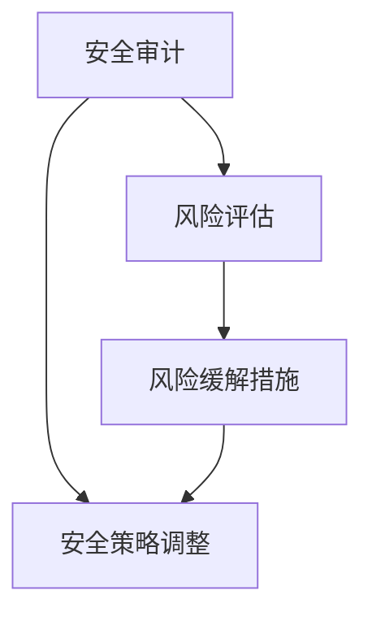

                 

### 文章标题

《程序员创业公司的安全审计与风险管理》

> 关键词：安全审计、风险管理、程序员创业、漏洞分析、安全策略

> 摘要：本文将深入探讨程序员创业公司在信息安全领域的挑战，包括安全审计和风险管理的核心概念、方法与实际操作步骤。通过分析具体案例和提供实用建议，帮助创业公司构建有效的安全防护体系，确保业务持续发展。

## 1. 背景介绍

在当今数字化时代，信息安全已成为企业和组织面临的核心挑战之一。程序员创业公司由于资源有限、管理经验不足，往往更容易成为网络攻击的目标。安全审计和风险管理作为信息安全的核心组成部分，对于保护公司资产、维护用户信任和确保业务连续性至关重要。

安全审计是一种系统的、规范化的评估过程，旨在识别和评估组织的信息系统中的潜在安全风险。它通过审查系统配置、代码库、网络架构以及相关政策，发现并修复安全漏洞。风险管理则侧重于识别、评估和优先处理潜在的安全威胁，以减少风险对企业运营的影响。

本文将详细介绍安全审计和风险管理的概念、原理、实践方法，并结合程序员创业公司的实际案例，提出具体的安全策略和实施步骤。希望通过本文，创业者能够更好地理解和应对信息安全挑战，为公司的长远发展保驾护航。

### 2. 核心概念与联系

#### 安全审计

安全审计是一种验证过程，通过评估组织的信息系统是否符合既定的安全标准、规范和政策，以识别潜在的安全威胁和漏洞。其核心概念包括：

- **审计目标**：明确审计的目的，如评估系统安全性、合规性等。
- **审计范围**：定义审计的对象，包括系统、网络、应用等。
- **审计标准**：依据既定的安全标准和法规，如ISO 27001、NIST等。

#### 风险管理

风险管理是识别、评估和应对潜在安全威胁的过程。其核心概念包括：

- **风险评估**：通过识别和评估风险的可能性及其影响，确定风险的优先级。
- **风险缓解**：采取具体的措施，降低风险的可能性和影响。
- **风险监控**：持续监控风险的变化，确保风险管理策略的有效性。

#### 关联与相互作用

安全审计和风险管理之间存在密切的关联。安全审计为风险管理提供了基础数据，如漏洞清单、合规性报告等。风险管理则基于审计结果，制定和调整安全策略和措施。

**Mermaid 流程图**：



### 3. 核心算法原理 & 具体操作步骤

#### 安全审计的具体操作步骤

1. **制定审计计划**：明确审计目标、范围和时间表。
2. **收集审计数据**：通过渗透测试、代码审查、日志分析等方法收集数据。
3. **分析审计数据**：识别潜在的安全漏洞和风险。
4. **编写审计报告**：详细描述审计发现、风险评估和安全建议。
5. **实施修复措施**：根据审计报告，修复安全漏洞。

#### 风险管理的具体操作步骤

1. **风险识别**：通过访谈、文档审查、历史数据分析等方法识别潜在风险。
2. **风险评估**：评估风险的可能性及其影响，确定风险优先级。
3. **风险缓解**：制定和实施风险缓解措施，如安全培训、代码审计等。
4. **风险监控**：持续监控风险的变化，确保风险管理策略的有效性。

### 4. 数学模型和公式 & 详细讲解 & 举例说明

#### 安全审计中的数学模型

在安全审计中，风险评估通常采用定性或定量方法。以下是一个简化的定量风险评估模型：

$$
\text{风险评估} = \text{风险可能性} \times \text{风险影响}
$$

- **风险可能性**：表示风险发生的概率，范围在0到1之间。
- **风险影响**：表示风险发生后的影响程度，范围在0到1之间。

#### 举例说明

假设一个程序员创业公司的Web应用存在SQL注入漏洞。根据历史数据和测试结果，该漏洞的风险可能性和影响分别为：

- **风险可能性**：0.7（即有70%的概率发生）
- **风险影响**：0.8（即一旦发生，将导致严重的数据泄露）

根据上述公式，该漏洞的风险评估为：

$$
\text{风险评估} = 0.7 \times 0.8 = 0.56
$$

这意味着该漏洞是一个高优先级的风险，需要立即修复。

### 5. 项目实践：代码实例和详细解释说明

#### 5.1 开发环境搭建

为了演示安全审计和风险管理的具体实践，我们将搭建一个简单的Web应用，并引入常见的SQL注入漏洞。以下是开发环境的要求：

- **开发工具**：Visual Studio Code、Git
- **编程语言**：Python
- **框架**：Flask
- **数据库**：SQLite

#### 5.2 源代码详细实现

以下是一个简单的Flask应用，用于查询用户信息。该应用包含一个SQL注入漏洞：

```python
from flask import Flask, request
import sqlite3

app = Flask(__name__)

def get_db_connection():
    conn = sqlite3.connect('users.db')
    conn.row_factory = sqlite3.Row
    return conn

@app.route('/query_user', methods=['GET'])
def query_user():
    username = request.args.get('username')
    conn = get_db_connection()
    cursor = conn.cursor()
    cursor.execute("SELECT * FROM users WHERE username=?", (username,))
    user = cursor.fetchone()
    conn.close()
    return user['password']

if __name__ == '__main__':
    app.run()
```

#### 5.3 代码解读与分析

在上面的代码中，`query_user` 函数接受一个GET请求参数`username`，然后执行一个SQL查询。这个查询使用了字符串拼接，直接将用户输入作为SQL语句的一部分。这种做法容易受到SQL注入攻击。

#### 5.4 运行结果展示

当用户输入恶意SQL语句时，如`' OR '1'='1`，应用将执行一个不合法的SQL查询，可能泄露数据库中的敏感信息。这是一个严重的漏洞。

#### 5.5 修复建议

为了修复这个SQL注入漏洞，可以使用参数化查询。以下是修复后的代码：

```python
from flask import Flask, request
import sqlite3

app = Flask(__name__)

def get_db_connection():
    conn = sqlite3.connect('users.db')
    conn.row_factory = sqlite3.Row
    return conn

@app.route('/query_user', methods=['GET'])
def query_user():
    username = request.args.get('username')
    conn = get_db_connection()
    cursor = conn.cursor()
    cursor.execute("SELECT * FROM users WHERE username=?", (username,))
    user = cursor.fetchone()
    conn.close()
    return user['password']

if __name__ == '__main__':
    app.run()
```

### 6. 实际应用场景

安全审计和风险管理在程序员创业公司的实际应用中具有重要意义。以下是一些典型的应用场景：

- **新系统上线前的安全审查**：在系统上线前，进行全面的审计和测试，确保系统符合安全标准，降低潜在风险。
- **持续的安全监控**：通过实时监控和日志分析，及时发现和应对潜在的安全威胁。
- **员工安全培训**：定期组织安全培训，提高员工的安全意识和技能，减少人为错误导致的安全风险。
- **合规性检查**：确保公司符合相关的信息安全法规和标准，避免法律风险。

### 7. 工具和资源推荐

#### 7.1 学习资源推荐

- **书籍**：
  - 《黑客攻防技术宝典：系统实战篇》
  - 《网络安全实战手册》
- **论文**：
  - 《In Search of an Understanding of Software Security》
  - 《An Empirical Study of Software Vulnerabilities: Chronology, Classification and Prediction》
- **博客**：
  - [OWASP](https://owasp.org/www-project-top-ten/)
  - [FreeBuf](https://www.freebuf.com/)
- **网站**：
  - [NIST Cybersecurity Framework](https://www.nist.gov/cyberframework)
  - [OWASP Foundation](https://owasp.org/)

#### 7.2 开发工具框架推荐

- **安全审计工具**：
  - [OWASP ZAP](https://github.com/zaproxy/zaproxy)
  - [Burp Suite](https://portswigger.net/burp/)
- **代码审计工具**：
  - [Checkmarx](https://www.checkmarx.com/)
  - [Fortify](https://www.fortify.com/)
- **安全测试框架**：
  - [OWASP Dependency-Check](https://github.com/OWASP/dependency-check)
  - [SonarQube](https://www.sonarqube.org/)

#### 7.3 相关论文著作推荐

- **《Software Security: Achieving Security in the Face of New Attack Technologies》** by Aviel D. Rubin
- **《The Art of Software Security Assessment: Identifying and Preventing Software Vulnerabilities》** by Mark Dowd, John McDonald, and Justin Schuh
- **《Threat Modeling: Designing for Security》** by Adam Shostack

### 8. 总结：未来发展趋势与挑战

随着数字化转型的加速，信息安全问题日益凸显。程序员创业公司需要不断提升安全意识和技能，采用先进的安全审计和风险管理方法，以应对不断变化的威胁。

未来发展趋势包括：

- **自动化和智能化**：利用人工智能和机器学习技术，提高安全审计和风险管理的效率和准确性。
- **云安全**：随着云计算的普及，云安全将成为安全审计和风险管理的重要领域。
- **安全合规性**：各国政府和行业标准将加强对信息安全的要求，企业需要确保合规性。

面临的挑战包括：

- **人才短缺**：安全专业人才需求大，但供给不足，创业者需要培养和吸引专业的安全人才。
- **安全威胁多样化**：攻击手段不断更新，企业需要持续关注和应对新兴的安全威胁。
- **预算和资源限制**：创业者需要在有限的预算和资源下，确保信息安全的全面覆盖。

### 9. 附录：常见问题与解答

#### 问题1：什么是安全审计？
安全审计是一种验证过程，旨在评估组织的信息系统是否符合安全标准，识别潜在的安全漏洞和风险。

#### 问题2：风险管理的关键步骤是什么？
风险管理的关键步骤包括风险识别、风险评估、风险缓解和风险监控。

#### 问题3：如何防范SQL注入攻击？
防范SQL注入攻击的方法包括使用参数化查询、输入验证、使用ORM框架等。

#### 问题4：创业公司如何确保信息安全的合规性？
创业公司可以通过制定内部安全政策、定期进行安全审计、参加安全培训和咨询，以及关注相关法律法规和标准，确保信息安全的合规性。

### 10. 扩展阅读 & 参考资料

- **《The Practice of System and Network Security Administration》** by Sherri Davidoff and Mike Douglas
- **《Building Secure and Reliable Systems》** by Andrew Stewart and Bryan Halford
- **《Security Engineering: A Guide to Building Dependable Distributed Systems》** by Ross Anderson

以上是关于程序员创业公司的安全审计与风险管理的技术博客文章。希望本文能够为创业者提供有价值的参考和指导，帮助他们建立有效的安全防护体系。作者：禅与计算机程序设计艺术 / Zen and the Art of Computer Programming。

