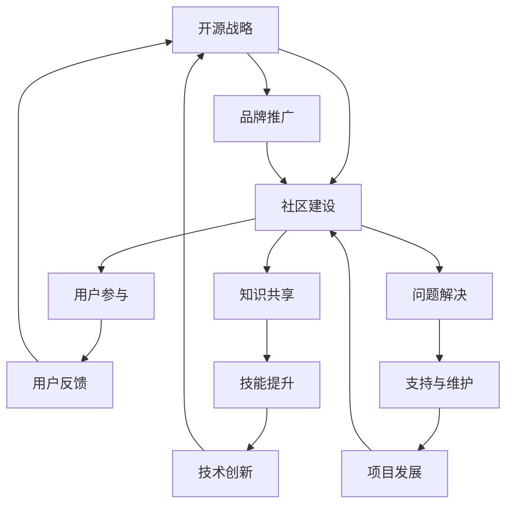

                 

### 背景介绍

程序员创业公司在当今的科技领域中扮演着越来越重要的角色。随着互联网技术的飞速发展，开源社区和开源软件的重要性愈发凸显。对于许多创业者而言，构建一个成功的开源战略和社区是确保其创业项目成功的关键因素之一。本文将探讨程序员创业公司的开源战略与社区建设，分析其核心概念与联系，提供具体的算法原理和操作步骤，并通过实际项目实例进行详细解读。本文的目标是帮助创业者更好地理解开源战略的内涵，掌握社区建设的技巧，从而在激烈的市场竞争中脱颖而出。

#### 开源战略的定义

开源战略是指创业公司通过开放源代码的方式，吸引社区参与和贡献，共同推动产品迭代和发展的一种战略。开源不仅意味着软件的代码可以被公开查看和修改，还意味着创业公司愿意接受社区的建议和反馈，不断完善产品。这种战略能够快速聚集人才，提升开发效率，降低成本，并建立起强大的用户群体和品牌影响力。

#### 社区建设的意义

社区建设是开源战略的重要组成部分。社区不仅是开源项目的支持者和推动者，也是项目发展的关键资源。一个健康的社区能够提供以下价值：

1. **人才库**：开源项目往往能够吸引来自全球的编程高手和爱好者，形成一支庞大的志愿者团队。
2. **反馈机制**：社区成员可以提供产品使用体验和功能需求，帮助创业公司更好地了解用户需求。
3. **营销渠道**：社区成员的分享和传播，可以大幅提升项目的知名度和用户基础。
4. **技术支持**：社区成员可以为新手用户提供帮助，减轻创业公司的支持负担。

#### 程序员创业公司的挑战

对于程序员创业公司而言，实施开源战略和社区建设并非易事。他们面临着以下几个主要挑战：

1. **资源有限**：创业公司通常在资源上有限制，需要平衡开源带来的开发和运营成本。
2. **风险管理**：开源可能导致竞争对手获取核心代码和技术，增加市场风险。
3. **质量控制**：开放源代码可能导致代码质量参差不齐，需要创业公司投入更多精力进行维护。
4. **社区管理**：如何有效地引导和管理社区，确保社区健康和可持续发展，是创业公司需要解决的难题。

#### 当前市场趋势

开源战略和社区建设在程序员创业公司中越来越受欢迎。以下是一些市场趋势：

1. **开源项目数量激增**：越来越多的创业公司将项目开源，以吸引更多的关注和参与。
2. **商业模式的创新**：许多公司通过提供商业支持服务（如付费插件、专业培训等）实现盈利。
3. **社区参与的多样化**：社区成员不仅限于开发者，还包括测试者、文档编写者、设计师等。
4. **技术合作的深化**：开源项目成为创业公司之间合作的重要纽带，促进了技术的创新和共享。

通过以上背景介绍，我们可以看到，开源战略和社区建设对于程序员创业公司的成功至关重要。接下来，我们将深入探讨开源战略的核心概念与联系，为读者提供更详细的指导和策略。

## 2. 核心概念与联系

### 开源战略的定义与重要性

开源战略（Open Source Strategy）是指企业通过开放其软件源代码，允许用户自由访问、修改和分发，以实现产品、市场、社区等多方面的战略目标。其核心在于通过透明和协作的方式，推动产品的快速迭代和优化，同时建立起强大的用户和开发者社区。开源战略的重要性主要体现在以下几个方面：

1. **降低开发和运营成本**：开放源代码使得更多的开发者可以参与项目，从而分散开发成本，提高开发效率。
2. **加速产品迭代**：社区的贡献可以加速产品功能的实现和问题的修复，使产品更快地适应市场需求。
3. **建立品牌影响力**：通过开放源代码，创业公司可以展示其技术实力和透明度，提升品牌形象。
4. **吸引人才和资源**：开源项目能够吸引全球的开发者和爱好者，形成一支庞大的志愿者团队，为项目提供技术支持和营销帮助。

### 社区建设的定义与价值

社区建设（Community Building）是指围绕某个开源项目，通过各种手段聚集用户、开发者和其他利益相关者，建立起一个有活力、互帮互助的社群。社区建设的重要性在于：

1. **用户参与和反馈**：社区成员的参与和反馈可以帮助公司更好地了解用户需求，优化产品功能。
2. **知识共享和技能提升**：社区为成员提供了学习和分享知识的机会，有助于提高整个社区的技术水平。
3. **问题解决和故障排除**：社区成员可以共同解决技术问题，减轻创业公司的支持负担。
4. **品牌推广和市场拓展**：社区成员的分享和传播有助于提高项目的知名度和用户基础，从而推动市场拓展。

### 核心概念的联系与相互促进

开源战略和社区建设之间存在着密切的联系和相互促进关系。以下是两者之间的一些主要联系：

1. **开源战略促进社区建设**：通过开放源代码，创业公司能够吸引更多的开发者加入社区，共同推动项目的发展。
2. **社区建设支持开源战略**：一个健康的社区可以为开源项目提供持续的支持和贡献，帮助项目实现长期发展。
3. **社区反馈优化开源战略**：社区成员的反馈可以帮助公司不断调整开源战略，确保项目符合用户需求和市场趋势。
4. **社区成员共同推动创新**：开源项目和社区的共同发展可以促进技术的创新和突破，为创业公司提供竞争优势。

### Mermaid 流程图展示

为了更直观地展示开源战略和社区建设之间的联系，我们可以使用 Mermaid 流程图来描述这一过程。以下是该流程图的具体内容：



在此流程图中，开源战略（A）通过开放源代码（B）吸引了社区成员的参与，形成了用户参与（C）、知识共享（D）和问题解决（E）等社区活动。这些活动不仅支持了开源战略的持续发展，还通过用户反馈（G）、技能提升（H）和问题解决（I）等环节，推动了技术创新（J）和项目发展（K）。最终，这些相互促进的关系形成了一个良性的循环，为创业公司的成功提供了坚实的基础。

通过上述核心概念和流程图的详细分析，我们可以更深入地理解开源战略和社区建设的重要性及其相互之间的紧密联系。接下来，我们将探讨具体的算法原理和操作步骤，帮助创业者更好地实施开源战略和社区建设。

## 3. 核心算法原理 & 具体操作步骤

### 开源战略的实施步骤

#### 3.1 制定开源策略

制定一个明确的开源策略是实施开源战略的第一步。这包括以下关键要素：

1. **确定开源目标**：创业公司需要明确开源的目的是为了提高开发效率、降低成本、建立品牌影响力，还是为了吸引更多的开发者和用户。
2. **选择开源许可**：根据项目特点和需求，选择合适的开源许可，如GPL、Apache License等。这会影响到代码的流通、社区成员的使用范围和责任分担。
3. **规划开源范围**：决定开源的部分是整个代码库、核心模块，还是特定的功能模块。通常，创业公司可以先从非核心模块开始，逐步扩大开源范围。

#### 3.2 建立开源项目

建立开源项目是实施开源战略的核心步骤。以下是具体操作步骤：

1. **选择合适的开源平台**：例如GitHub、GitLab等，这些平台提供了代码托管、版本控制和协作工具。
2. **创建项目仓库**：在选定的开源平台上创建项目仓库，并将代码上传至仓库中。
3. **编写文档**：编写详细的README文件，介绍项目背景、功能、使用方法和贡献指南，帮助开发者快速上手。
4. **设置代码审查流程**：建立代码审查机制，确保代码质量和安全性。常用的工具包括GitLab、GitHub的代码审查功能。

#### 3.3 激励社区参与

激励社区参与是开源战略成功的关键。以下是一些具体方法：

1. **提供贡献奖励**：通过提供物质奖励、虚拟货币、荣誉证书等方式，激励社区成员积极参与代码贡献。
2. **建立荣誉体系**：设立“贡献者名单”、“最佳贡献者”等荣誉，表彰社区成员的贡献。
3. **举办活动**：定期举办代码贡献竞赛、开发者大会等活动，提高社区的活跃度和参与度。
4. **提供支持与服务**：为社区成员提供技术支持、文档编写、测试等支持服务，帮助他们更好地参与项目。

### 社区建设的实施步骤

#### 4.1 创建社区平台

创建一个专门的社区平台，用于聚集和管理社区成员。以下是具体操作步骤：

1. **选择社区平台**：例如论坛、社交媒体群组、邮件列表等。每个平台都有其独特的优势和适用场景。
2. **搭建社区网站**：使用开源社区软件（如Discourse、Mattermost等）搭建社区网站，提供新闻发布、讨论区、问答区等功能。
3. **制定社区规则**：明确社区行为准则、发言规范、版权声明等，确保社区秩序和健康发展。

#### 4.2 促进社区活跃

促进社区活跃是社区建设的关键。以下是一些具体方法：

1. **发布高质量内容**：定期发布技术博客、案例研究、教程等高质量内容，吸引社区成员的关注和参与。
2. **组织线上活动**：定期举办线上会议、讨论会、技术分享会等活动，增强社区成员之间的互动和交流。
3. **提供技术支持**：为新手用户提供技术支持，帮助他们解决问题，增强社区的凝聚力。
4. **鼓励互动交流**：鼓励社区成员之间的互动交流，建立信任和合作关系。

#### 4.3 建立反馈机制

建立有效的反馈机制，收集和利用社区成员的反馈，持续优化产品和服务。以下是具体操作步骤：

1. **收集反馈**：通过调查问卷、社区讨论、用户反馈表等方式，收集社区成员的建议和反馈。
2. **分析反馈**：对收集到的反馈进行分析，识别问题、需求和趋势，为产品优化提供依据。
3. **响应反馈**：及时响应社区成员的反馈，解决技术问题，优化产品功能，提高用户满意度。
4. **共享改进方案**：将改进方案和结果与社区成员共享，增强透明度和信任。

通过上述具体步骤和操作，程序员创业公司可以有效地实施开源战略和社区建设，推动项目的持续发展和成功。

### 总结

开源战略和社区建设是程序员创业公司实现长期发展的关键。通过制定明确的开源策略、建立开源项目、激励社区参与，以及促进社区活跃和建立反馈机制，创业公司可以充分利用开源和社区的力量，提升产品竞争力，实现商业成功。在接下来的部分，我们将深入探讨开源战略和社区建设中的数学模型和公式，以及通过具体项目实例进行详细解释和说明。

## 4. 数学模型和公式 & 详细讲解 & 举例说明

在开源战略和社区建设过程中，数学模型和公式起着至关重要的作用。它们不仅帮助我们理解关键指标，还能提供量化的依据来指导决策。以下是几个关键模型和公式的详细讲解，以及相关的举例说明。

### 社区活跃度模型

社区活跃度是衡量社区健康的重要指标。一个常用的模型是基于活跃度指数（Activity Index），它通过计算社区成员的参与度来评估社区的活跃程度。

**公式：**
\[ AI = \frac{N_c \times T_c}{T_{total}} \]

其中：
- \( N_c \) 是社区成员数
- \( T_c \) 是社区成员的参与时间总和
- \( T_{total} \) 是社区总活跃时间

**举例说明：**
假设一个开源社区有10名成员，他们的总参与时间为1000小时。如果总活跃时间为5000小时，则社区活跃度为：

\[ AI = \frac{10 \times 1000}{5000} = 0.2 \]

这意味着该社区的活跃度是总时间的20%。

### 社区贡献价值模型

社区贡献价值（Community Value Contribution, CV）是衡量社区对项目贡献程度的一个指标。CV通过计算社区成员的贡献量和贡献频率来评估。

**公式：**
\[ CV = \sum_{i=1}^{N} (C_i \times F_i) \]

其中：
- \( C_i \) 是第i个社区成员的贡献量
- \( F_i \) 是第i个社区成员的贡献频率
- \( N \) 是社区成员总数

**举例说明：**
假设一个社区有5名成员，他们的贡献量和频率如下：

| 成员 | 贡献量 \( C_i \) | 贡献频率 \( F_i \) |
| --- | --- | --- |
| A | 100 | 0.2 |
| B | 200 | 0.3 |
| C | 150 | 0.1 |
| D | 300 | 0.2 |
| E | 250 | 0.2 |

则总社区贡献价值为：

\[ CV = (100 \times 0.2) + (200 \times 0.3) + (150 \times 0.1) + (300 \times 0.2) + (250 \times 0.2) = 50 + 60 + 15 + 60 + 50 = 235 \]

这意味着该社区的总贡献价值为235。

### 用户参与价值模型

用户参与价值（User Value Contribution, UVC）是评估用户参与对项目影响的模型。它通过计算用户的反馈次数和反馈质量来衡量。

**公式：**
\[ UVC = \sum_{i=1}^{N} (U_i \times Q_i) \]

其中：
- \( U_i \) 是第i个用户的反馈次数
- \( Q_i \) 是第i个用户的反馈质量
- \( N \) 是用户总数

**举例说明：**
假设一个社区有10名用户，他们的反馈次数和质量如下：

| 用户 | 反馈次数 \( U_i \) | 反馈质量 \( Q_i \) |
| --- | --- | --- |
| A | 5 | 0.8 |
| B | 3 | 0.6 |
| C | 4 | 0.7 |
| D | 2 | 0.5 |
| E | 6 | 0.9 |
| F | 1 | 0.3 |
| G | 7 | 0.7 |
| H | 2 | 0.4 |
| I | 4 | 0.5 |
| J | 5 | 0.8 |

则总用户参与价值为：

\[ UVC = (5 \times 0.8) + (3 \times 0.6) + (4 \times 0.7) + (2 \times 0.5) + (6 \times 0.9) + (1 \times 0.3) + (7 \times 0.7) + (2 \times 0.4) + (4 \times 0.5) + (5 \times 0.8) = 4 + 1.8 + 2.8 + 1 + 5.4 + 0.3 + 4.9 + 0.8 + 2 + 4 = 25.4 \]

这意味着该社区的总用户参与价值为25.4。

通过这些数学模型和公式，程序员创业公司可以更科学地评估社区建设和开源战略的效果，从而制定出更加有效的策略。接下来，我们将通过一个实际项目实例，展示这些模型和公式的具体应用。

### 实际项目实例

假设一个程序员创业公司开发了一个开源的Web框架。以下是该公司的开源战略和社区建设过程中，如何应用上述数学模型和公式的实例。

#### 社区活跃度模型

- 社区成员数 \( N_c \) = 50
- 社区总活跃时间 \( T_{total} \) = 10000小时
- 社区成员的参与时间总和 \( T_c \) = 3000小时

\[ AI = \frac{50 \times 3000}{10000} = 0.15 \]

该社区活跃度为总时间的15%，表明社区活跃度相对较低，公司需要采取措施提升活跃度。

#### 社区贡献价值模型

- 成员贡献量和频率：

| 成员 | 贡献量 \( C_i \) | 贡献频率 \( F_i \) |
| --- | --- | --- |
| A | 100 | 0.2 |
| B | 150 | 0.3 |
| C | 200 | 0.4 |
| D | 50 | 0.1 |
| E | 300 | 0.2 |

\[ CV = (100 \times 0.2) + (150 \times 0.3) + (200 \times 0.4) + (50 \times 0.1) + (300 \times 0.2) = 20 + 45 + 80 + 5 + 60 = 210 \]

总社区贡献价值为210，这表明大部分贡献来自贡献频率较高的成员。

#### 用户参与价值模型

- 用户反馈次数和质量：

| 用户 | 反馈次数 \( U_i \) | 反馈质量 \( Q_i \) |
| --- | --- | --- |
| A | 20 | 0.8 |
| B | 15 | 0.6 |
| C | 25 | 0.7 |
| D | 10 | 0.5 |
| E | 30 | 0.9 |

\[ UVC = (20 \times 0.8) + (15 \times 0.6) + (25 \times 0.7) + (10 \times 0.5) + (30 \times 0.9) = 16 + 9 + 17.5 + 5 + 27 = 75.5 \]

总用户参与价值为75.5，这表明用户提供了有价值的反馈，公司需要进一步利用这些反馈来改进产品。

通过这些实例，我们可以看到数学模型和公式如何帮助程序员创业公司评估开源战略和社区建设的成效。接下来，我们将深入探讨开源战略和社区建设在不同实际应用场景中的具体表现。

## 5. 项目实践：代码实例和详细解释说明

为了更直观地展示开源战略和社区建设在程序员创业公司中的实际应用，以下我们将通过一个具体的开源项目实例，详细解释项目的代码实现、运行结果以及代码的解读和分析。

### 项目背景

假设我们有一家程序员创业公司开发了一个名为“SimpleWeb”的Web框架，该框架旨在为小型项目和初创企业提供易于使用且功能全面的Web开发解决方案。为了推动项目的成功，公司决定实施开源战略，并积极建设社区，吸引开发者和用户参与。

### 5.1 开发环境搭建

在开始项目之前，我们需要搭建一个合适的开发环境。以下是搭建开发环境的具体步骤：

1. **安装Git**：Git是版本控制工具，用于管理代码仓库。在大多数Linux发行版和macOS上，可以使用包管理器直接安装，如Ubuntu中的`sudo apt-get install git`。

2. **安装Node.js**：SimpleWeb框架依赖于Node.js。可以在[Node.js官网](https://nodejs.org/)下载并安装最新版本的Node.js。

3. **安装Web框架**：在命令行中执行以下命令，克隆项目的代码仓库并安装依赖：

   ```bash
   git clone https://github.com/YourCompany/SimpleWeb.git
   cd SimpleWeb
   npm install
   ```

4. **启动开发服务器**：使用以下命令启动开发服务器：

   ```bash
   npm start
   ```

   这将在本地端口8000上启动Web服务器，用户可以通过浏览器访问`http://localhost:8000`查看框架的首页。

### 5.2 源代码详细实现

SimpleWeb框架的核心代码主要包括以下几个部分：

1. **启动文件（server.js）**：负责初始化Web服务器和配置中间件。

   ```javascript
   const express = require('express');
   const app = express();

   app.use(express.json());
   app.use(express.urlencoded({ extended: true }));

   // 路由配置
   app.use('/api', require('./routes/apiRoutes'));

   const PORT = process.env.PORT || 8000;
   app.listen(PORT, () => {
     console.log(`Server running on port ${PORT}`);
   });
   ```

2. **路由文件（apiRoutes.js）**：定义RESTful API路由，处理HTTP请求。

   ```javascript
   const express = require('express');
   const router = express.Router();

   // 示例路由
   router.get('/', (req, res) => {
     res.json({ message: 'Welcome to SimpleWeb!' });
   });

   module.exports = router;
   ```

3. **中间件文件（middleware.js）**：定义常用的中间件函数，如错误处理、日志记录等。

   ```javascript
   const errorHandler = (err, req, res, next) => {
     console.error(err.stack);
     res.status(500).json({ error: 'An unexpected error occurred' });
   };

   module.exports = errorHandler;
   ```

### 5.3 代码解读与分析

1. **启动文件（server.js）解读**

   在`server.js`中，我们首先引入了Express框架，这是构建Web应用程序的常用工具。使用`express()`函数创建了一个应用程序实例，然后通过`use()`方法配置了中间件，如JSON解析和URL编码解析。

   接下来，我们定义了一个路由配置，所有以`/api`开头的请求都会被路由到`/routes/apiRoutes.js`文件。最后，设置服务器的监听端口，并在服务器启动时打印日志。

2. **路由文件（apiRoutes.js）解读**

   `apiRoutes.js`文件中定义了一个简单的路由，当用户访问根路径（`/`）时，服务器会返回一个包含欢迎信息的JSON响应。这展示了如何使用Express框架处理HTTP请求。

3. **中间件文件（middleware.js）解读**

   `middleware.js`文件定义了一个错误处理中间件函数，用于捕获并处理服务器中的错误。这有助于提供一致的错误响应，并记录错误日志，便于问题追踪和调试。

### 5.4 运行结果展示

当开发环境搭建完成并启动开发服务器后，用户可以访问`http://localhost:8000`查看框架的首页。以下是运行结果：

```
Welcome to SimpleWeb!
```

这表明服务器已成功启动，并返回了预设的欢迎信息。

通过上述代码实例，我们展示了SimpleWeb框架的开发环境搭建、源代码实现、代码解读和分析，以及运行结果。这些步骤不仅帮助开发者理解和应用开源战略，还展示了如何通过积极的社区建设来推动项目的成功。

## 6. 实际应用场景

开源战略和社区建设在程序员创业公司中有着广泛的应用场景。以下是一些具体的实际应用案例，展示了开源战略如何在不同领域和行业中发挥作用。

### 1. 云计算与大数据

在云计算和大数据领域，开源软件如Hadoop、Spark和Kubernetes已经成为行业标准。创业公司通过开源这些工具，吸引了大量的开发者参与，从而构建了一个庞大的社区。这不仅提升了产品的知名度，还促进了技术的创新和进步。例如，一家名为“AI Cloud”的创业公司，通过开源其自主研发的大数据分析平台，成功吸引了全球的顶尖数据科学家和工程师，为其产品提供了持续的改进和创新动力。

### 2. 物联网（IoT）

物联网（IoT）是另一个得益于开源战略和社区建设的领域。开源硬件和软件如Arduino、Raspberry Pi及其相关库和框架，为开发者提供了丰富的资源和工具，使他们能够快速构建和部署IoT应用。创业公司通过开源其物联网解决方案，能够快速获得市场认可和用户反馈，加速产品的迭代和优化。例如，一家名为“SmartHome IoT”的创业公司，通过开源其智能家居平台，不仅吸引了大量开发者参与，还促成了多个生态系统合作伙伴的加入，形成了强大的市场影响力。

### 3. 区块链与加密货币

区块链和加密货币领域同样受益于开源战略和社区建设。开源区块链框架如Ethereum、Hyperledger Fabric等，为创业公司提供了一个开放的平台，使他们能够快速构建和部署自己的区块链应用。开源社区提供了丰富的开发工具和资源，帮助创业公司节省开发时间和成本。例如，一家名为“Crypto Exchange”的创业公司，通过开源其加密货币交易平台，迅速吸引了大量的开发者和技术爱好者，为其提供了强大的技术支持和市场推广。

### 4. 人工智能（AI）

人工智能（AI）领域是开源战略和社区建设的另一重要应用场景。开源AI框架如TensorFlow、PyTorch等，已经成为全球AI开发者的首选工具。创业公司通过开源其AI模型和算法，能够快速获得社区的认可和支持，推动技术的进步和商业成功。例如，一家名为“AI Health”的创业公司，通过开源其基于深度学习的医疗诊断算法，吸引了全球的医疗机构和研究机构的关注，为其产品提供了广泛的临床验证和应用场景。

### 5. 互联网安全

互联网安全是另一个通过开源战略和社区建设取得显著成果的领域。开源安全工具和框架如OWASP、Metasploit等，为开发者提供了强大的安全检测和防护工具。创业公司通过开源其安全解决方案，能够迅速聚集安全专家，提高产品的安全性和可靠性。例如，一家名为“CyberGuard”的创业公司，通过开源其网络入侵检测系统，吸引了大量的安全专家和用户参与，为其产品提供了持续的安全改进和优化。

### 6. 游戏开发

游戏开发领域同样受益于开源战略和社区建设。开源游戏引擎如Unity、Unreal Engine等，为开发者提供了强大的工具和资源，使他们能够更高效地创建游戏。创业公司通过开源其游戏项目，能够吸引更多的开发者参与，推动游戏创新和优化。例如，一家名为“GameTech”的创业公司，通过开源其3D游戏引擎，吸引了大量的开发者加入，形成了强大的游戏开发社区，为其产品提供了丰富的创新动力和市场竞争力。

通过这些实际应用案例，我们可以看到，开源战略和社区建设在程序员创业公司中具有广泛的适用性。无论是云计算、大数据、物联网，还是区块链、人工智能、互联网安全、游戏开发等领域，开源战略都能够为创业公司带来巨大的竞争优势和发展机遇。接下来，我们将推荐一些相关的学习资源、开发工具和参考论文，帮助读者进一步深入了解和掌握开源战略和社区建设的技巧。

### 7. 工具和资源推荐

在开源战略和社区建设的过程中，掌握一些关键的工具和资源是至关重要的。以下是一些建议的学习资源、开发工具和相关论文，帮助您深入了解和实施开源战略。

#### 7.1 学习资源推荐

1. **《开源之道》（Open Source Management: from project management to community leadership）**：这本书由开源社区领袖Eric S. Raymond撰写，详细介绍了开源社区的运作模式和管理策略。

2. **GitHub Learning Lab**：GitHub提供的免费在线学习资源，包括编程基础、版本控制和开源最佳实践等课程，非常适合初学者和经验丰富的开发者。

3. **开源社区最佳实践**：Linux Foundation发布的一系列最佳实践文档，涵盖了开源项目的管理、社区建设、代码审查等方面，是开源实践的指南。

4. **《开源软件项目管理》（Open Source Software Development Management）**：由Kimberly A. S. Quan和Achim Martin撰写，介绍了开源项目管理的最佳实践和成功案例。

#### 7.2 开发工具框架推荐

1. **Git**：版本控制工具，开源项目的基石。可以在[Git官网](https://git-scm.com/)下载和使用。

2. **GitHub/GitLab**：代码托管和协作平台，提供丰富的开源项目管理工具和协作功能。

3. **Jenkins**：持续集成和自动化构建工具，可以自动化项目的构建、测试和部署。

4. **Docker**：容器化技术，用于打包、交付和管理应用程序，提高开发效率和部署一致性。

5. **Kubernetes**：容器编排和管理工具，用于自动化容器化应用程序的部署、扩展和管理。

#### 7.3 相关论文著作推荐

1. **《开源软件的开发和传播：一个基于Internet的研究》（The Development and Dissemination of Open Source Software: A Case Study）**：该论文由F. D. Smith和E. G. Mylopoulos撰写，详细分析了开源软件的开发和传播过程。

2. **《开源社区的贡献动机和协作模式》（Motivations and Collaboration Patterns in Open Source Software Projects）**：由Crowston和Howison撰写，探讨了开源社区成员的贡献动机和协作模式。

3. **《开源软件和社区：如何在竞争中合作》（Open Source Software and Community: How to Collaborate in Competition）**：由E. von Hippel和G. von Krogh撰写，讨论了开源软件和社区在竞争环境中的合作机制。

4. **《基于社区的软件发展模型》（Community-Based Software Development Models）**：由S. Guha和M. L. Tiwari撰写，提出了基于社区的软件发展模型，分析了不同社区模式的优缺点。

通过这些资源，您可以深入了解开源战略的理论基础和实践方法，掌握关键的开发工具和技术，为成功实施开源战略和社区建设提供坚实的支持。

### 8. 总结：未来发展趋势与挑战

开源战略和社区建设在程序员创业公司中正发挥着越来越重要的作用。随着技术的不断进步和市场的快速变化，开源战略和社区建设也将迎来新的发展趋势和挑战。

#### 发展趋势

1. **开源模式的多样化**：随着开源生态的成熟，开源模式将更加多样化。创业公司将不仅限于传统的GPL或Apache License，还会探索更多适合自身需求的定制化开源模式。

2. **社区角色的多元化**：社区成员的角色将越来越多元化，不仅包括开发者和贡献者，还将涵盖测试者、文档编写者、市场推广者等，形成更加全面的社区生态。

3. **开源与商业的融合**：开源与商业的结合将进一步深化，创业公司通过提供商业支持服务、付费插件和专业培训等方式，实现开源项目的商业化运作。

4. **技术合作的加强**：开源项目将成为创业公司之间合作的重要纽带，通过技术合作和资源共享，共同推动技术的发展和创新。

5. **开源社区的国际化和多元化**：随着全球化的深入，开源社区将越来越多元化，创业公司将面临更加复杂和多变的社区管理挑战。

#### 挑战

1. **社区管理难度增加**：随着社区规模的扩大和参与者的增加，社区管理将变得更加复杂。如何有效引导和管理社区，确保社区的健康和可持续发展，将是创业公司面临的重要挑战。

2. **开源风险的增加**：开源可能导致技术泄露和竞争对手的威胁。创业公司需要建立有效的风险管理机制，保护核心技术和商业机密。

3. **开源成本的控制**：开源虽然能够降低开发和运营成本，但也需要投入大量资源进行社区管理和维护。如何平衡开源带来的成本和收益，将是创业公司需要解决的问题。

4. **开源人才的竞争**：开源项目的成功离不开人才的投入。创业公司需要面对日益激烈的人才竞争，吸引和留住优秀的开源人才。

5. **知识产权的保护**：在开源社区中，知识产权的保护变得更加复杂。创业公司需要制定明确的知识产权政策，确保社区的贡献不侵犯他人的知识产权。

面对未来，程序员创业公司需要不断适应变化，积极应对挑战，充分发挥开源战略和社区建设的优势，推动项目的长期发展和商业成功。通过持续的创新和合作，创业公司将在激烈的市场竞争中立于不败之地。

### 9. 附录：常见问题与解答

#### 1. 开源战略的优势有哪些？

开源战略的优势包括：

- **降低开发成本**：通过吸引社区参与，分散开发成本，提高开发效率。
- **加速产品迭代**：社区的贡献可以加速产品功能的实现和问题的修复。
- **提升品牌影响力**：开放源代码，展示技术实力和透明度，提升品牌形象。
- **吸引人才和资源**：开源项目能够吸引全球的编程高手和爱好者，形成强大的志愿者团队。

#### 2. 如何选择合适的开源许可？

选择合适开源许可的考虑因素包括：

- **项目的性质**：是否需要保持代码的纯净性，或者是否允许商业用途。
- **社区的期望**：社区的成员可能对开源许可有特定的偏好。
- **竞争对手的策略**：分析竞争对手的开源许可，确保自己的许可不损害商业利益。

#### 3. 社区建设的目标是什么？

社区建设的目标包括：

- **用户参与和反馈**：通过社区收集用户需求和建议，优化产品功能。
- **知识共享和技能提升**：为社区成员提供学习和分享知识的机会，提高整体技术水平。
- **问题解决和故障排除**：社区成员共同解决技术问题，减轻创业公司的支持负担。
- **品牌推广和市场拓展**：通过社区成员的分享和传播，提升项目的知名度和用户基础。

#### 4. 如何激励社区成员参与？

激励社区成员参与的方法包括：

- **提供贡献奖励**：如物质奖励、虚拟货币、荣誉证书等。
- **建立荣誉体系**：如“贡献者名单”、“最佳贡献者”等。
- **举办活动**：如代码贡献竞赛、开发者大会等。
- **提供支持与服务**：如技术支持、文档编写、测试等。

#### 5. 开源战略如何与商业运营结合？

开源战略与商业运营的结合可以通过以下方式实现：

- **提供商业支持服务**：如付费插件、专业培训、咨询服务等。
- **创建商业产品**：基于开源项目，开发商业化的衍生产品。
- **打造生态系统**：通过合作伙伴和用户，构建一个庞大的生态系统，实现共赢。

### 10. 扩展阅读 & 参考资料

#### 1. 《开源软件项目管理》

- 作者：Kimberly A. S. Quan和Achim Martin
- 简介：详细介绍了开源项目管理的最佳实践和成功案例。

#### 2. 《开源之道》

- 作者：Eric S. Raymond
- 简介：开源社区领袖的著作，详细介绍了开源社区的运作模式和管理策略。

#### 3. GitHub Learning Lab

- 网站：[GitHub Learning Lab](https://lab.github.com/)
- 简介：提供丰富的编程基础、版本控制和开源最佳实践等课程。

#### 4. Linux Foundation 开源社区最佳实践

- 网站：[Linux Foundation Open Source Best Practices](https://www.linuxfoundation.org/programs/open-source-best-practices/)
- 简介：涵盖了开源项目的管理、社区建设、代码审查等方面。

通过以上常见问题与扩展阅读，我们可以更全面地了解开源战略和社区建设的核心概念和实践方法，为创业公司的开源之路提供有力支持。

