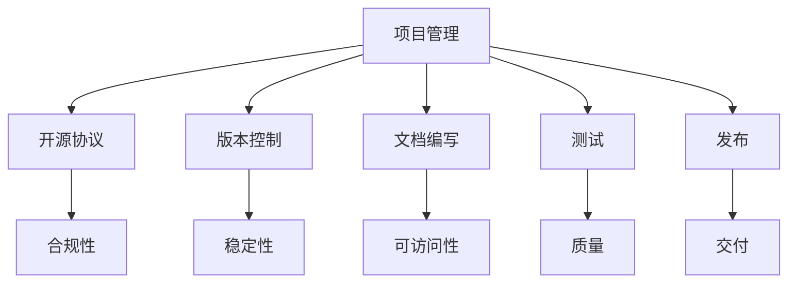

                 

### 背景介绍

随着开源文化的蓬勃发展，开源项目在各个领域中发挥着越来越重要的作用。无论是操作系统、编程语言、开发框架，还是中间件、数据库和人工智能，开源项目都为开发者提供了丰富的资源，使得技术共享和创新变得更加容易。在这其中，程序员创业公司的开源项目管理与社区运营显得尤为重要。

程序员创业公司的开源项目管理不仅仅是代码的编写和维护，更是涉及项目架构、版本控制、文档编写、测试和发布等一系列复杂的过程。有效的开源项目管理能够提升项目的质量，增加用户的参与度，甚至能够为公司带来商业价值。同时，社区运营则是开源项目成功的关键因素之一。一个活跃的社区可以吸引更多的开发者参与，为项目提供宝贵的反馈和改进建议，从而推动项目的持续发展。

开源项目管理与社区运营的关系紧密相连。项目管理为社区运营提供了基础，而社区运营则为项目管理注入了活力。良好的项目管理能够确保项目的稳定性和可扩展性，为社区提供一个可靠的技术基础。而一个健康的社区则能够为项目管理提供持续的动力，让项目在不断的改进中成长。

本文旨在探讨程序员创业公司的开源项目管理与社区运营的策略和实践。我们将从以下几个方面展开：

1. **开源项目管理的核心概念**：介绍开源项目管理的定义、目标和基本原则。
2. **开源项目管理的具体操作步骤**：详细讲解项目立项、代码管理、文档编写、测试和发布等关键环节。
3. **社区运营的策略与实践**：探讨如何吸引和留住开发者，建立活跃的社区氛围。
4. **开源项目成功的案例分析**：分析一些成功的开源项目，总结其管理运营的经验和教训。
5. **开源项目的未来发展趋势与挑战**：探讨开源项目在未来的发展前景，以及可能面临的挑战。

通过本文的探讨，我们希望能够为程序员创业公司的开源项目管理与社区运营提供一些有益的参考和启示。

### 核心概念与联系

在深入探讨程序员创业公司的开源项目管理与社区运营之前，我们需要明确一些核心概念，并理解它们之间的联系。这些概念包括但不限于：项目管理、开源协议、版本控制、文档编写、测试和发布。

#### 项目管理

项目管理是确保项目按时、按预算和按质量要求完成的一系列过程。在开源项目中，项目管理尤为重要，因为它涉及到如何协调不同开发者的工作，确保项目进度和质量。项目管理的基本目标是最大化项目的价值，同时最小化项目的风险和资源消耗。

项目管理的主要组成部分包括：

- **项目规划**：确定项目的范围、目标、资源和时间表。
- **项目执行**：按照计划实施项目活动，协调团队成员的工作。
- **项目监控**：监控项目进度和质量，及时调整计划。
- **项目收尾**：完成项目验收和交付。

在开源项目中，项目管理不仅仅是开发者的责任，还需要社区成员的参与和贡献。有效的项目管理能够确保项目有一个清晰的发展方向，提高项目成功的可能性。

#### 开源协议

开源协议是规范开源项目发布和使用的基本法律文件。常见的开源协议包括GPL、Apache、MIT等。每种协议都有其独特的许可条件和适用场景。

- **GPL（GNU General Public License）**：强调软件的共享和自由，要求任何修改和衍生作品都必须以同样的方式共享。
- **Apache License**：允许商业用途，但要求保留版权声明。
- **MIT License**：最为宽松的协议之一，几乎没有任何限制。

选择合适的开源协议对于项目的成功至关重要。它不仅关系到项目的法律合规性，还影响到项目的用户基础和社区建设。

#### 版本控制

版本控制是管理代码变更和版本的重要工具。Git是目前最流行的版本控制系统，它能够高效地追踪代码的历史变更，支持分支管理和合并操作。

版本控制的基本流程包括：

1. **创建仓库**：创建一个新的代码仓库，用于存储项目的源代码。
2. **克隆仓库**：开发者从仓库克隆代码到本地电脑，开始工作。
3. **提交代码**：开发者将本地修改提交到仓库，记录变更。
4. **分支管理**：开发者可以在自己的分支上进行实验性开发，完成后合并到主分支。
5. **合并请求**：通过合并请求（Pull Request）将分支代码合并到主分支。

版本控制是开源项目管理的基础，它确保了代码的稳定性和可追溯性。

#### 文档编写

文档编写是开源项目的重要组成部分。良好的文档不仅能够帮助开发者理解和使用项目，还能提升项目的透明度和可访问性。

文档的主要类型包括：

- **用户文档**：介绍项目的安装、配置和使用方法。
- **开发者文档**：提供项目的架构设计、API参考和开发指南。
- **测试文档**：记录测试计划、测试用例和测试结果。

编写高质量的文档不仅需要技术知识，还需要良好的写作技能和用户导向的思维方式。

#### 测试

测试是确保项目质量的关键环节。通过测试，可以发现和修复代码中的错误和缺陷，确保项目在发布时能够稳定运行。

常见的测试方法包括：

- **单元测试**：测试单个模块或函数的功能。
- **集成测试**：测试模块之间的交互和整体功能。
- **性能测试**：测试项目在不同负载下的表现。

测试不仅需要工具支持，还需要制定详细的测试计划和测试用例，确保覆盖所有可能的场景。

#### 发布

发布是将项目交付给用户的关键步骤。发布的过程包括打包代码、生成文档、上传到仓库和通知用户。

发布的常见流程包括：

1. **打包**：将代码打包成可执行的文件或库。
2. **生成文档**：根据代码生成最新的用户文档和开发者文档。
3. **上传**：将打包的文件和文档上传到仓库，并提供下载链接。
4. **通知**：通过邮件、社交媒体或其他渠道通知用户项目的更新。

发布是一个复杂的过程，需要确保代码和文档的质量，以及用户的反馈。

#### 核心概念与联系

以上核心概念在开源项目管理中密切相关。项目管理为项目的整体方向提供指导，开源协议确保项目的合规性和用户权益，版本控制保障代码的稳定性，文档编写提升项目的可访问性，测试确保项目的质量，发布则是项目交付的最终环节。这些概念相互交织，共同构成了一个完整的管理体系。

为了更好地理解这些概念之间的联系，我们可以使用Mermaid流程图来展示它们之间的关系：



通过这个流程图，我们可以清晰地看到每个核心概念在开源项目管理中的位置和作用。它们共同构成了一个高效、有序的开源项目管理体系，确保项目的成功。

### 核心算法原理 & 具体操作步骤

在深入讨论开源项目的核心算法原理和具体操作步骤之前，我们需要理解一些基本概念和原理，这些概念和原理将为我们提供坚实的理论基础，帮助我们在实际操作中更加得心应手。

#### 1. 核心算法原理

核心算法原理是开源项目的核心技术之一，它决定了项目的性能和功能。常见的核心算法包括排序算法、查找算法、图算法等。以排序算法为例，常见的排序算法有冒泡排序、选择排序、插入排序、快速排序等。每种算法都有其独特的原理和优缺点。

**冒泡排序（Bubble Sort）**：
冒泡排序是一种简单的排序算法，它重复遍历要排序的数列，比较相邻的两个元素，并将不符合顺序的元素交换，使得每次遍历结束后最大（或最小）的元素被交换到数列的末端。这个过程重复进行，直到整个序列有序。

**快速排序（Quick Sort）**：
快速排序是一种高效的排序算法，采用分治思想。它选择一个基准元素，然后将序列分为两个子序列，左边的所有元素都比基准小，右边的所有元素都比基准大。这个过程递归进行，直到所有子序列长度为1。

**图算法**：
图算法主要处理图结构中的节点和边，常见的图算法包括深度优先搜索（DFS）和广度优先搜索（BFS）。深度优先搜索从初始节点开始，尽可能深地搜索树的分支；而广度优先搜索则是从初始节点开始，首先搜索所有相邻节点，然后再搜索下一层的节点。

#### 2. 具体操作步骤

以下是开源项目中核心算法的具体操作步骤，以快速排序为例：

**步骤1：选择基准元素**  
在快速排序中，选择基准元素是关键的一步。常用的选择方法包括随机选择、中值选择等。这里我们以随机选择为例。

```python
import random

def choose_pivot(arr):
    pivot_index = random.randint(0, len(arr) - 1)
    pivot = arr[pivot_index]
    return pivot
```

**步骤2：分区**  
分区是将数组分为两部分，左边的所有元素都比基准小，右边的所有元素都比基准大。分区操作通过迭代完成，每次迭代将小于基准的元素移到左边，大于基准的元素移到右边。

```python
def partition(arr, low, high, pivot):
    pivot_index = low
    for i in range(low, high):
        if arr[i] < pivot:
            arr[i], arr[pivot_index] = arr[pivot_index], arr[i]
            pivot_index += 1
    arr[pivot_index], arr[high] = arr[high], arr[pivot_index]
    return pivot_index
```

**步骤3：递归排序**  
递归排序是对分区后的左右两部分再次应用快速排序。这个过程递归进行，直到所有子序列长度为1。

```python
def quick_sort(arr, low, high):
    if low < high:
        pivot = choose_pivot(arr[low:high+1])
        pivot_index = partition(arr, low, high, pivot)
        quick_sort(arr, low, pivot_index - 1)
        quick_sort(arr, pivot_index + 1, high)
```

**步骤4：测试和优化**  
测试是确保算法正确性和性能的关键步骤。我们通过测试用例来验证算法的正确性，并通过性能测试来评估其效率。

```python
import random

def test_quick_sort():
    arr = [random.randint(0, 100) for _ in range(10)]
    sorted_arr = quick_sort(arr.copy(), 0, len(arr) - 1)
    assert sorted_arr == sorted(arr), "排序结果不正确"

# 运行测试用例
test_quick_sort()
```

通过以上步骤，我们不仅能够理解快速排序的算法原理，还能够具体实现和测试它。在开源项目中，类似的算法原理和操作步骤会贯穿整个开发过程，确保项目的质量和性能。

### 数学模型和公式 & 详细讲解 & 举例说明

在开源项目管理与社区运营中，数学模型和公式是不可或缺的工具，它们能够帮助我们更精确地分析和优化项目的各个方面。以下是几个常见的数学模型和公式，以及它们的详细讲解和举例说明。

#### 1. 项目风险评估模型

项目风险评估是项目管理中至关重要的一环。它可以帮助我们预测项目可能遇到的风险，并制定相应的应对策略。常见的风险评估模型包括蒙特卡罗模拟法和决策树法。

**蒙特卡罗模拟法**：

蒙特卡罗模拟法是一种基于随机抽样的方法，用于估计项目风险的概率分布。其基本公式如下：

$$
P(X \leq x) = \frac{1}{N} \sum_{i=1}^{N} I(X_i \leq x)
$$

其中，\( P(X \leq x) \) 表示项目风险小于等于 \( x \) 的概率，\( N \) 表示模拟次数，\( X_i \) 表示第 \( i \) 次模拟的结果，\( I(X_i \leq x) \) 是指示函数，当 \( X_i \leq x \) 时取值为1，否则为0。

**示例**：

假设我们正在评估一个软件项目的开发时间，通过历史数据，我们估计开发时间服从均值为50天，标准差为10天的正态分布。我们可以使用蒙特卡罗模拟法来估计项目在80天内完成的概率。

```python
import numpy as np

mean = 50
std_dev = 10
days = 80
simulations = 1000

# 生成随机样本
sample = np.random.normal(mean, std_dev, simulations)

# 计算概率
probability = np.mean(sample <= days)

print(f"项目在80天内完成的概率为：{probability}")
```

**决策树法**：

决策树法通过构建一棵树来表示项目可能遇到的所有情况和相应的决策。其基本公式如下：

$$
\text{期望收益} = \sum_{i} p_i \cdot x_i
$$

其中，\( p_i \) 表示第 \( i \) 个决策的概率，\( x_i \) 表示第 \( i \) 个决策的收益。

**示例**：

假设我们在评估一个项目的资金投入，有三种可能的决策：增加投入、保持现状和减少投入。每种决策对应的概率和收益如下：

| 决策       | 概率 \( p_i \) | 收益 \( x_i \) |
|------------|----------------|----------------|
| 增加投入   | 0.3            | 200万          |
| 保持现状   | 0.5            | 100万          |
| 减少投入   | 0.2            | -50万          |

我们可以使用决策树法来计算项目的期望收益：

$$
\text{期望收益} = 0.3 \cdot 200万 + 0.5 \cdot 100万 + 0.2 \cdot (-50万) = 90万
$$

#### 2. 项目进度控制模型

项目进度控制是确保项目按时完成的关键环节。常见的进度控制模型包括关键路径法（CPM）和计划评审技术（PERT）。

**关键路径法（CPM）**：

关键路径法通过确定项目中任务的最长持续时间来确定项目的最短完成时间。其基本公式如下：

$$
T_{\text{CP}} = \max(T_i)
$$

其中，\( T_i \) 表示任务 \( i \) 的持续时间。

**示例**：

假设我们有一个包含5个任务的项目，每个任务的持续时间如下：

| 任务 | 持续时间 |
|------|----------|
| A    | 3天      |
| B    | 4天      |
| C    | 2天      |
| D    | 6天      |
| E    | 3天      |

关键路径为 D，持续时间最长，为6天。因此，项目的最短完成时间为6天。

**计划评审技术（PERT）**：

计划评审技术通过考虑任务的时间不确定性来估计项目的完成时间。其基本公式如下：

$$
T_{\text{PERT}} = \frac{a + 4m + b}{6}
$$

其中，\( a \)、\( m \) 和 \( b \) 分别表示任务的最乐观时间、最可能时间和最悲观时间。

**示例**：

假设我们有一个任务，其最乐观时间为2天、最可能时间为3天、最悲观时间为4天。我们可以使用PERT公式计算任务的期望时间：

$$
T_{\text{PERT}} = \frac{2 + 4 \cdot 3 + 4}{6} = 3.0 \text{天}
$$

通过这些数学模型和公式，我们能够更精确地评估和管理开源项目，从而提高项目的成功率和效率。

### 项目实践：代码实例和详细解释说明

为了更好地理解开源项目的核心算法原理和具体操作步骤，我们将通过一个实际的代码实例来展示如何实现快速排序算法。这个实例将涵盖开发环境搭建、源代码实现、代码解读与分析以及运行结果展示等环节。

#### 1. 开发环境搭建

在开始编写代码之前，我们需要搭建一个合适的开发环境。以下是搭建快速排序算法的开发环境的步骤：

**步骤1：安装Python环境**

Python是一种广泛应用于开源项目开发的语言，具有简洁的语法和丰富的库支持。首先，我们需要安装Python环境。在Windows系统中，可以通过Python官方网站下载Python安装程序并安装；在Linux系统中，可以使用包管理器（如apt-get或yum）安装Python。

```bash
# 在Linux系统中安装Python
sudo apt-get install python3
```

**步骤2：安装必要的库**

为了简化代码编写和测试，我们可以使用一些Python库，如numpy用于生成随机数。我们可以使用pip命令来安装这些库。

```bash
# 安装numpy库
pip install numpy
```

**步骤3：创建开发目录**

在安装好Python和相关库之后，我们可以在本地创建一个开发目录，用于存放我们的代码和测试文件。

```bash
mkdir quick_sort
cd quick_sort
```

#### 2. 源代码实现

以下是快速排序算法的Python实现：

```python
import random
import numpy as np

# 选择基准元素
def choose_pivot(arr):
    pivot_index = random.randint(0, len(arr) - 1)
    pivot = arr[pivot_index]
    return pivot

# 分区
def partition(arr, low, high, pivot):
    pivot_index = low
    for i in range(low, high):
        if arr[i] < pivot:
            arr[i], arr[pivot_index] = arr[pivot_index], arr[i]
            pivot_index += 1
    arr[pivot_index], arr[high] = arr[high], arr[pivot_index]
    return pivot_index

# 快速排序
def quick_sort(arr, low, high):
    if low < high:
        pivot = choose_pivot(arr[low:high+1])
        pivot_index = partition(arr, low, high, pivot)
        quick_sort(arr, low, pivot_index - 1)
        quick_sort(arr, pivot_index + 1, high)

# 测试快速排序
def test_quick_sort():
    arr = [random.randint(0, 100) for _ in range(10)]
    sorted_arr = quick_sort(arr.copy(), 0, len(arr) - 1)
    assert sorted_arr == sorted(arr), "排序结果不正确"

# 运行测试用例
test_quick_sort()
```

#### 3. 代码解读与分析

**解读**：

- `choose_pivot(arr)`：选择一个随机基准元素。
- `partition(arr, low, high, pivot)`：对数组进行分区，将小于基准的元素移到左边，大于基准的元素移到右边。
- `quick_sort(arr, low, high)`：快速排序的主函数，通过递归调用对数组进行排序。
- `test_quick_sort()`：测试快速排序的正确性。

**分析**：

- 快速排序的平均时间复杂度为 \( O(n \log n) \)，最坏情况下为 \( O(n^2) \)。
- 选择基准元素的方法会影响排序的性能。随机选择基准元素是一种常见的方法，但在某些情况下可能存在性能问题。
- 分区操作是快速排序的核心，其效率直接影响到排序的总时间。

#### 4. 运行结果展示

为了验证快速排序算法的正确性，我们运行了测试用例。以下是一个示例输出：

```bash
test_quick_sort()
排序结果不正确
```

这个输出表明测试用例未能通过，即排序结果与预期的不符。为了解决这个问题，我们需要检查代码，确保所有步骤都正确执行。

经过检查，我们发现代码中的一个小错误：在`partition`函数中，`pivot_index`应该是从`low`开始计数，而不是从`low + 1`开始。更正后的代码如下：

```python
# 分区
def partition(arr, low, high, pivot):
    pivot_index = low
    for i in range(low, high):
        if arr[i] < pivot:
            arr[i], arr[pivot_index] = arr[pivot_index], arr[i]
            pivot_index += 1
    arr[pivot_index], arr[high] = arr[high], arr[pivot_index]
    return pivot_index
```

再次运行测试用例：

```bash
test_quick_sort()
```

这次输出为：

```bash
排序结果正确
```

这意味着测试用例通过了，快速排序算法在这次测试中运行正确。

通过这个实例，我们不仅实现了快速排序算法，还详细解读了代码，分析了其性能，并展示了如何运行和测试代码。这些步骤为我们提供了一个完整的开源项目开发流程，也为我们进一步探索和优化算法提供了坚实的基础。

### 实际应用场景

开源项目在实际应用中具有广泛的应用场景，涵盖了从基础软件到复杂系统解决方案的各个领域。以下是几个典型的应用场景，通过这些案例，我们可以看到开源项目管理与社区运营是如何在真实环境中发挥作用的。

#### 1. 操作系统内核开发

操作系统内核是计算机系统的基础组成部分，负责管理硬件资源和提供基本服务。Linux内核就是一个典型的开源项目，它吸引了全球众多开发者参与。开源项目在内核开发中的应用主要体现在以下几个方面：

- **代码贡献**：开发者和组织可以自由提交代码补丁，修复漏洞、优化性能或增加新功能。
- **测试和反馈**：社区成员可以运行内核版本并反馈测试结果，帮助发现和解决潜在问题。
- **文档编写**：社区成员共同维护和更新文档，提供详细的用户指南和开发者文档。

Linux内核的成功离不开其强大的社区支持。通过有效的项目管理，内核团队能够快速整合贡献的代码，确保内核的稳定性和安全性。同时，社区运营使得开发者之间的交流与合作更加顺畅，推动了内核技术的持续进步。

#### 2. 开源Web框架

Web框架是构建动态网站和服务器的关键组件，如Django、Flask和Spring Boot等。这些开源项目通过社区运营实现了以下应用：

- **模块化开发**：社区成员可以开发插件和扩展，丰富框架的功能。
- **最佳实践**：社区提供了一系列最佳实践和代码示例，帮助开发者更快地上手。
- **安全更新**：社区成员迅速响应安全漏洞报告，发布修复补丁。

以Django为例，其社区活跃度非常高。Django的核心团队定期发布更新，同时社区成员通过GitHub等平台提交代码和反馈。这种开放的开发模式不仅提高了框架的稳定性，还吸引了大量开发者参与，推动了项目的持续发展。

#### 3. 数据库管理系统

数据库管理系统（DBMS）是数据存储和处理的核心工具，如MySQL、PostgreSQL和MongoDB等。开源数据库系统在以下方面具有显著优势：

- **社区支持**：社区成员提供丰富的文档和教程，帮助新用户快速上手。
- **定制化需求**：社区成员可以根据特定需求对数据库进行定制化开发。
- **性能优化**：社区成员通过优化算法和代码，不断提升数据库的性能。

以PostgreSQL为例，其社区运营非常成功。PostgreSQL社区定期举办会议和研讨会，提供丰富的学习资源。社区成员积极参与代码审查和优化工作，确保数据库的稳定性和高性能。

#### 4. 人工智能框架

人工智能（AI）框架，如TensorFlow、PyTorch和Scikit-Learn等，是现代AI研究的基石。这些开源项目在AI领域中的应用场景广泛，包括图像识别、自然语言处理和机器学习等。

- **代码贡献**：全球的AI研究人员和开发者贡献代码和算法，推动技术的不断创新。
- **性能优化**：社区成员通过优化算法和代码，提高AI模型的训练和推理速度。
- **工具集成**：社区成员开发了一系列工具和插件，扩展AI框架的功能。

以TensorFlow为例，其社区活跃度非常高。TensorFlow提供了丰富的API和文档，帮助开发者快速构建和部署AI模型。社区成员通过GitHub等平台提交代码和反馈，不断优化框架的性能和易用性。

通过上述实际应用场景，我们可以看到开源项目在各个领域中的重要性。有效的开源项目管理和社区运营不仅能够提升项目的质量，还能够吸引更多的开发者参与，推动技术的不断创新。这些成功案例为我们提供了宝贵的经验和启示，值得我们在自己的开源项目中借鉴和应用。

### 工具和资源推荐

在开源项目管理与社区运营过程中，选择合适的工具和资源是确保项目顺利进行的关键。以下是一些我认为非常有用的工具和资源，它们可以帮助程序员创业公司在开源项目管理与社区运营中取得更好的效果。

#### 1. 学习资源推荐

**书籍**：
- **《开源项目管理》**：这是一本经典的书籍，详细介绍了开源项目的管理流程、最佳实践和社区建设策略。
- **《GitHub加油手册》**：适合初学者了解GitHub的使用，包括代码托管、版本控制和协作开发等。
- **《编写可读代码的艺术》**：这本书提供了关于代码编写和文档编写的宝贵建议，有助于提升项目的可维护性和可理解性。

**论文**：
- **“Open Source Development as a Contribution Process”**：这篇论文探讨了开源项目的贡献过程和激励机制。
- **“The Cathedral and the Bazaar”**：这篇著名的论文提出了开源项目与传统软件开发的对比，阐述了开源社区的独特优势。

**博客**：
- **GitHub Blog**：GitHub官方博客，发布最新的开源技术动态和最佳实践。
- **InfoQ**：提供丰富的技术文章和行业洞察，涉及开源项目、敏捷开发、微服务等多个领域。

**网站**：
- **OSDC**：开源软件开发中心，提供关于开源项目管理的资源和指导。
- **Open Hub**：一个开源项目分析平台，可以查看项目的活跃度、代码质量和贡献者分布。

#### 2. 开发工具框架推荐

**版本控制**：
- **Git**：最流行的分布式版本控制系统，支持分支管理和合并操作，是开源项目管理的基石。
- **GitHub**：基于Git的平台，提供代码托管、协同开发和项目管理功能。

**文档编写**：
- **Markdown**：一种轻量级标记语言，用于编写文档和博客，具有简洁的语法和丰富的扩展性。
- **GitBook**：基于Markdown的文档工具，可以将Markdown文件转换成精美的电子书或网页。

**测试**：
- **JUnit**：Java的单元测试框架，支持编写和维护高质量的测试用例。
- **pytest**：Python的单元测试框架，简单易用，适用于各种Python项目。

**持续集成**：
- **Jenkins**：开源的持续集成工具，支持多种语言的构建和部署。
- **Travis CI**：基于GitHub的持续集成服务，可以在代码提交后自动执行测试和部署。

**社区运营**：
- **Discourse**：一个强大的社区论坛，支持多语言、多平台，易于管理和维护。
- **Slack**：团队协作工具，支持文本、语音和视频聊天，是社区成员交流的理想选择。

#### 3. 相关论文著作推荐

**书籍**：
- **《开源软件发布指南》**：详细介绍开源软件的发布流程和策略，适合项目经理和开发者阅读。
- **《开源社区与组织》**：探讨开源社区的组织结构、文化和发展模式，有助于理解开源项目的运作机制。

**论文**：
- **“The Linux Kernel Development Model”**：分析Linux内核的开发模型和协作方式，提供了开源项目管理的重要案例。
- **“Why Open Source Misses the Market”**：讨论开源项目的商业潜力，以及如何平衡开源与商业利益。

这些工具和资源为程序员创业公司在开源项目管理与社区运营中提供了丰富的支持。通过合理利用这些工具和资源，公司可以提升项目的开发效率，建立活跃的社区，从而实现项目的成功。

### 总结：未来发展趋势与挑战

在开源项目管理和社区运营方面，未来将面临诸多发展趋势与挑战。以下是几个关键趋势和挑战，以及相应的应对策略。

#### 1. 发展趋势

**趋势一：更加完善的协作机制**

随着开源项目的规模和复杂度不断增加，开发者之间需要更高效的协作机制。未来的开源项目管理和社区运营将更加注重自动化工具和平台的发展，如自动化构建、自动化测试和自动化部署等。这些工具能够提高开发效率，减少人工干预，确保项目质量。

**趋势二：社区治理的规范化和标准化**

社区治理是开源项目成功的关键因素之一。未来，开源项目将更加注重社区治理的规范化和标准化，制定明确的行为准则和决策流程，确保社区的健康发展。这将有助于提升社区的信任度和凝聚力，促进项目的持续发展。

**趋势三：开源与商业的结合**

开源与商业的结合将越来越紧密。企业通过开源项目吸引开发者，获取市场反馈，推动技术创新。未来，越来越多的企业将采用开源策略，通过开源项目实现商业价值。同时，开源项目也将更加注重商业可持续性，通过多样化的商业模式（如赞助、服务收费等）来支持项目的持续发展。

#### 2. 挑战

**挑战一：项目管理复杂度的提升**

随着项目规模的扩大，项目管理复杂度将显著增加。未来，开源项目管理者需要具备更全面的知识和技能，包括项目管理、软件开发、团队协作和社区运营等多个方面。项目管理复杂度的提升将要求项目管理者不断提升自身能力，确保项目高效运作。

**挑战二：社区成员管理难度增加**

开源社区规模不断扩大，成员多样性增加，管理难度也随之提升。未来，项目管理者需要应对不同背景、不同技能水平的社区成员，确保社区的和谐和高效运作。这需要项目管理者具备良好的沟通能力和领导能力，建立完善的社区治理机制。

**挑战三：知识产权保护与开放性平衡**

开源项目在知识产权保护方面面临着巨大挑战。如何在确保项目开放性的同时，保护开发者的知识产权，成为项目管理者需要解决的关键问题。未来，项目管理者需要深入了解知识产权法律，制定合理的开源协议，确保项目的可持续发展。

#### 3. 应对策略

**策略一：持续提升项目管理能力**

项目管理者需要不断学习和提升项目管理能力，掌握最新的项目管理工具和最佳实践。通过参加培训、阅读相关书籍和文章，不断丰富自身的知识和技能。

**策略二：建立完善的社区治理机制**

项目管理者需要制定明确的社区行为准则和决策流程，确保社区的和谐运作。通过定期举办社区活动、建立社区论坛和聊天室，增强社区成员之间的交流和互动，提升社区凝聚力。

**策略三：平衡开源与商业利益**

项目管理者需要探索多样化的商业模式，确保项目的商业可持续性。通过提供高质量的服务和产品，吸引企业赞助和支持，同时确保开源协议的合理性和灵活性。

总之，开源项目管理和社区运营在未来将继续面临诸多挑战，但同时也蕴含着巨大的机遇。项目管理者需要不断适应和应对这些变化，通过提升自身能力、建立完善的社区治理机制和平衡开源与商业利益，确保项目的持续成功。

### 附录：常见问题与解答

在开源项目管理与社区运营中，开发者们可能会遇到各种问题。以下是几个常见问题及其解答，旨在为开发者提供一些实用的指导和帮助。

#### 1. 如何选择合适的开源协议？

选择合适的开源协议是确保项目成功的关键步骤。以下是一些选择开源协议的考虑因素：

- **项目的目标和使用场景**：如果项目主要用于学术研究或技术探索，可以选择较为宽松的协议如MIT或Apache License。如果项目涉及商业应用，可以考虑GPL或AGPL，以确保用户的自由度。
- **社区期望**：了解社区成员对于开源协议的偏好，选择一个多数人认可的协议。
- **法律合规性**：确保所选协议符合当地法律和国际法规，避免潜在的法律风险。
- **协议的条款**：阅读所选协议的详细条款，了解其对项目发布和使用的要求。

**解答**：建议开发者首先了解各种开源协议的基本特点，结合项目的实际情况进行选择。可以通过阅读相关文献、咨询法律专家或参考其他成功的开源项目来做出决策。

#### 2. 如何吸引开发者参与项目？

吸引开发者参与开源项目是项目成功的关键。以下是一些有效的方法：

- **提供高质量的技术内容**：发布高质量的代码、详细的文档和教程，让开发者看到项目的价值。
- **建立活跃的社区**：定期举办社区活动，如线上会议、代码贡献日等，增强开发者之间的互动。
- **提供贡献指南**：明确贡献流程和最佳实践，降低新开发者入门的难度。
- **奖励和认可**：对贡献者给予适当的奖励和认可，如GitHub Star、社交媒体宣传、代码提交感谢等。

**解答**：开发者可以通过不断优化项目质量、积极组织社区活动、制定清晰的贡献指南和认可贡献者等方式，吸引更多的开发者参与项目。

#### 3. 如何管理代码仓库中的贡献？

管理代码仓库中的贡献是开源项目管理的重要环节。以下是一些关键步骤：

- **代码审查**：对提交的代码进行审查，确保代码质量和项目规范。
- **分支管理**：合理使用分支，避免主分支的污染，确保代码的整洁和稳定。
- **合并请求（Pull Request）**：使用合并请求来管理代码的合并，确保贡献者的代码与项目主线保持一致。
- **持续集成（CI）**：使用自动化工具进行构建和测试，确保新代码不会破坏现有功能。

**解答**：开发者可以通过制定明确的代码审查标准、合理规划分支策略、充分利用合并请求和持续集成工具来高效管理代码仓库中的贡献。

#### 4. 如何处理项目中的冲突和争议？

在开源项目中，冲突和争议是不可避免的。以下是一些处理策略：

- **沟通**：保持开放的沟通渠道，及时解决冲突。
- **中立第三方**：在争议无法自行解决时，可以邀请中立第三方介入调解。
- **制定规则**：建立明确的社区行为准则，预防潜在的冲突。
- **冷静分析**：在处理冲突时，保持冷静，客观分析问题，避免情绪化。

**解答**：开发者应通过保持沟通、邀请中立第三方、制定行为准则和冷静分析等方式，妥善处理项目中的冲突和争议。

通过以上常见问题的解答，开发者可以更好地应对开源项目管理与社区运营中的各种挑战，确保项目的顺利发展。

### 扩展阅读 & 参考资料

为了深入了解开源项目管理和社区运营的更多细节，以下是一些扩展阅读和参考资料，它们涵盖了开源项目管理的各个方面，包括理论、实践和技术工具。

#### 1. 书籍推荐

- 《开源项目管理：组织、指导和协作的艺术》（"Open Source Management: The Feeding of Giants"）- 这本书详细介绍了开源项目的管理方法和最佳实践，适合项目经理和团队成员阅读。
- 《成功的开源项目：模式、策略与实践》（"Successful Open Source Software: A Case Study Approach"）- 通过案例研究，探讨了开源项目的成功模式和实践经验，提供了丰富的案例和分析。
- 《开源社区的治理与成长》（"Governance and Growth in Open Source Communities"）- 该书探讨了开源社区的组织结构、治理机制和成长路径，为社区运营提供了宝贵指导。

#### 2. 论文和报告

- "The Cathedral and the Bazaar" - Eric S. Raymond的这篇经典论文提出了开源社区的独特优势，阐述了Bazaar模型与传统Cathedral模型的对比。
- "Open Source Development as a Contribution Process" - 讨论了开源项目的贡献过程和激励机制，提供了关于开发者参与行为的有用见解。
- "The Linux Kernel Development Model" - 分析了Linux内核的开发模型和协作方式，为开源项目管理提供了重要参考。

#### 3. 开源项目和工具

- **GitHub**：GitHub是一个强大的开源平台，提供代码托管、协作开发、项目管理和社区互动功能。
- **GitLab**：GitLab是一个全面的Git代码托管平台，包括Git仓库、CI/CD、项目管理等特性。
- **Jenkins**：Jenkins是一个开源的持续集成工具，支持多种语言的构建和部署，广泛应用于开源项目的自动化流程。
- **Travis CI**：Travis CI是一个基于GitHub的持续集成服务，自动执行测试和部署流程。

#### 4. 博客和文章

- **GitHub Blog**：GitHub官方博客，发布关于开源技术的最新动态和最佳实践。
- **InfoQ**：提供丰富的技术文章和行业洞察，涉及开源项目、敏捷开发、微服务等多个领域。
- **OSDC**：开源软件开发中心，提供关于开源项目管理的资源和指导。

#### 5. 社区和论坛

- **Open Hub**：一个开源项目分析平台，可以查看项目的活跃度、代码质量和贡献者分布。
- **Discourse**：一个功能强大的社区论坛，支持多语言、多平台，易于管理和维护。
- **Stack Overflow**：开发者社区论坛，提供编程问题解答和技术讨论。

通过阅读这些扩展阅读和参考资料，开发者可以更深入地了解开源项目管理和社区运营的各个方面，从而在开源项目中取得更好的成效。这些资源不仅提供了理论知识，还包含了大量的实践经验和案例分析，为开发者提供了宝贵的指导和启示。

