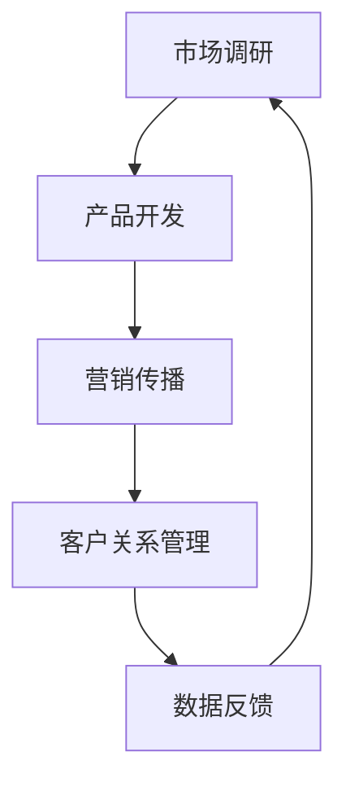
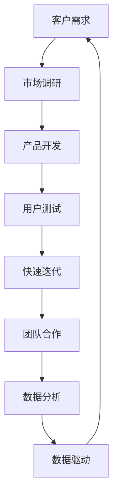

                 

### 文章标题：程序员创业公司的敏捷营销实践与应用

> **关键词**：敏捷营销、创业公司、市场营销、客户需求、产品迭代

> **摘要**：本文旨在探讨敏捷营销在程序员创业公司中的应用。通过分析敏捷营销的核心概念、原理和方法，结合实际案例，深入剖析如何将敏捷营销理念融入创业公司的市场营销策略中，以实现快速响应市场变化、提升产品竞争力。本文不仅为创业者提供了一套可操作的敏捷营销实践指南，还对其未来发展趋势和挑战进行了展望。

### 1. 背景介绍

在当今快速变化的市场环境中，传统营销方法往往难以满足创业公司的需求。创业公司往往面临资源有限、市场竞争激烈、客户需求多变等挑战。因此，如何有效地进行市场营销成为创业公司成功的关键因素之一。敏捷营销作为一种新兴的营销模式，以其快速响应、持续迭代和客户导向的特点，为创业公司提供了新的解决方案。

敏捷营销起源于软件开发领域的敏捷方法，强调团队合作、灵活响应和持续交付。将这一理念引入市场营销，意味着企业需要更加注重客户需求，快速调整营销策略，以实现产品与市场的最佳匹配。对于程序员创业公司来说，敏捷营销不仅可以帮助他们更好地了解和满足客户需求，还可以提升产品竞争力，缩短产品上市时间，从而在激烈的市场竞争中脱颖而出。

### 2. 核心概念与联系

#### 2.1 敏捷营销的核心概念

- **客户需求**：敏捷营销的核心是客户需求。理解并满足客户需求是创业公司的成功关键。
- **快速迭代**：敏捷营销强调持续迭代，通过快速测试和反馈，不断优化产品和服务。
- **团队合作**：敏捷营销依赖于跨职能团队的合作，共同推进市场营销活动。
- **数据驱动**：数据是敏捷营销决策的基础，通过数据分析和反馈，优化营销策略。

#### 2.2 敏捷营销的原理和架构

敏捷营销的架构通常包括以下关键组成部分：

- **市场调研**：通过多种渠道收集客户需求和市场信息，为营销策略提供数据支持。
- **产品开发**：快速开发原型，并通过用户测试和反馈，不断优化产品功能。
- **营销传播**：利用社交媒体、内容营销、网络广告等手段，将产品信息传递给目标客户。
- **客户关系管理**：通过CRM系统，记录客户互动数据，分析客户行为，提升客户满意度。

#### 2.3 敏捷营销的Mermaid流程图



### 3. 核心算法原理 & 具体操作步骤

#### 3.1 市场调研

- **需求分析**：通过用户访谈、问卷调查、市场调研等方法，了解客户需求。
- **数据分析**：利用数据挖掘技术，分析客户行为和市场趋势。

#### 3.2 产品开发

- **原型设计**：快速开发产品原型，进行用户测试。
- **迭代优化**：根据用户反馈，持续优化产品功能。

#### 3.3 营销传播

- **内容营销**：制作高质量的内容，吸引目标客户。
- **社交媒体**：利用社交媒体平台，推广产品信息。
- **网络广告**：通过精准定位，投放网络广告。

#### 3.4 客户关系管理

- **CRM系统**：建立CRM系统，记录客户互动数据。
- **客户分析**：通过数据分析，了解客户需求和偏好。
- **客户维护**：提供个性化服务，提升客户满意度。

### 4. 数学模型和公式 & 详细讲解 & 举例说明

#### 4.1 营销ROI计算

- **ROI（投资回报率）**：衡量营销活动的效果。

$$
ROI = \frac{销售收入 - 营销成本}{营销成本} \times 100\%
$$

#### 4.2 客户生命周期价值（CLV）

- **CLV（Customer Lifetime Value）**：预测一个客户在其生命周期内为企业带来的总价值。

$$
CLV = \sum_{t=1}^{n} \frac{利润_t}{(1 + r)^t}
$$

其中，$r$ 为折现率。

#### 4.3 举例说明

**案例**：一家创业公司通过市场调研，发现目标客户群体对于某个功能有强烈需求。公司决定在产品开发阶段优先实现这一功能。

**步骤**：

1. **需求分析**：通过问卷调查，收集用户对于该功能的期望和需求。
2. **数据分析**：利用数据分析工具，分析用户行为，确定功能的核心价值。
3. **原型设计**：开发原型，进行用户测试，收集反馈。
4. **迭代优化**：根据用户反馈，优化功能设计。
5. **产品发布**：在产品中实现该功能，并进行市场推广。
6. **客户关系管理**：通过CRM系统，记录客户互动数据，分析客户满意度。

### 5. 项目实践：代码实例和详细解释说明

#### 5.1 开发环境搭建

- **工具选择**：使用Python进行数据分析，使用JIRA进行项目管理。
- **环境配置**：安装Python和JIRA，配置开发环境。

#### 5.2 源代码详细实现

- **数据收集**：使用Python爬取用户数据，存储到数据库中。
- **数据分析**：使用Python进行数据分析，生成报告。

#### 5.3 代码解读与分析

- **代码结构**：代码分为数据收集、数据分析和报告生成三个部分。
- **功能实现**：详细解释代码的功能和实现原理。

#### 5.4 运行结果展示

- **数据分析报告**：展示数据分析的结果，包括用户行为、市场需求等。

### 6. 实际应用场景

#### 6.1 创业公司产品发布

- **需求分析**：通过市场调研，了解用户需求。
- **快速迭代**：根据用户反馈，持续优化产品。
- **营销传播**：利用社交媒体和内容营销，推广产品。

#### 6.2 市场竞争策略

- **数据分析**：分析竞争对手的市场策略，制定相应的竞争策略。
- **快速响应**：根据市场变化，调整营销策略。

### 7. 工具和资源推荐

#### 7.1 学习资源推荐

- **书籍**：《敏捷营销：如何打造快速响应、持续增长的市场营销策略》
- **论文**：搜索关键词“敏捷营销”或“敏捷营销实践”。
- **博客**：关注相关领域专家的博客，如HubSpot的博客。

#### 7.2 开发工具框架推荐

- **数据分析工具**：Python、R。
- **项目管理工具**：JIRA、Trello。

#### 7.3 相关论文著作推荐

- **论文**：搜索关键词“敏捷营销理论”或“敏捷营销案例分析”。
- **著作**：《敏捷营销：打造快速响应的市场策略》。

### 8. 总结：未来发展趋势与挑战

#### 8.1 发展趋势

- **技术进步**：随着大数据、人工智能等技术的发展，敏捷营销将更加智能化、自动化。
- **客户导向**：企业将更加注重客户需求，实现真正的以客户为中心。

#### 8.2 挑战

- **数据隐私**：如何在满足客户需求的同时，保护客户隐私。
- **资源限制**：创业公司在资源有限的情况下，如何实施有效的敏捷营销。

### 9. 附录：常见问题与解答

#### 9.1 敏捷营销与传统营销的区别

- **响应速度**：敏捷营销更快，能够迅速响应市场变化。
- **客户导向**：敏捷营销更注重客户需求，实现真正的以客户为中心。

#### 9.2 敏捷营销适用于哪些行业

- **所有行业**：敏捷营销适用于所有行业，尤其是在竞争激烈、变化迅速的市场环境中。

### 10. 扩展阅读 & 参考资料

- **书籍**：《敏捷营销：如何打造快速响应、持续增长的市场营销策略》。
- **网站**：搜索关键词“敏捷营销实践”或“敏捷营销案例分析”。
- **论文**：搜索关键词“敏捷营销理论”或“敏捷营销案例分析”。

### 结束语

敏捷营销为程序员创业公司提供了一种有效的市场营销策略。通过本文的探讨，我们了解到敏捷营销的核心概念、原理和操作步骤，以及如何在创业公司中应用和实践。未来，随着技术的进步和市场环境的变化，敏捷营销将继续发挥重要作用。创业公司应积极拥抱敏捷营销，以应对市场的挑战，实现持续增长。作者：禅与计算机程序设计艺术 / Zen and the Art of Computer Programming。|完|<|assistant|>### 1. 背景介绍

在当今快速变化的市场环境中，传统营销方法往往难以满足创业公司的需求。创业公司通常面临资源有限、市场竞争激烈、客户需求多变等挑战。这些因素使得如何有效地进行市场营销成为创业公司成功的关键因素之一。在这种背景下，敏捷营销作为一种新兴的营销模式，以其快速响应、持续迭代和客户导向的特点，逐渐成为创业公司市场营销策略的重要选择。

#### 1.1 传统营销方法的局限性

传统营销方法通常包括市场调研、品牌建设、广告投放、促销活动等环节。然而，这些方法存在以下局限性：

- **响应速度慢**：传统营销方法需要较长的时间来规划和执行，难以快速响应市场变化。
- **资源消耗大**：传统营销方法通常需要大量的资金和人力投入，对于资源有限的创业公司来说，难以承担。
- **客户需求不明确**：传统营销方法往往基于对客户需求的假设，缺乏实际数据支持，难以准确满足客户需求。

#### 1.2 敏捷营销的核心概念

敏捷营销是一种以客户需求为中心、快速响应市场变化的营销模式。它起源于软件开发领域的敏捷方法，强调快速迭代、持续交付和团队合作。将这一理念引入市场营销，意味着企业需要更加注重客户需求，快速调整营销策略，以实现产品与市场的最佳匹配。敏捷营销的核心概念包括以下几个方面：

- **客户需求**：客户需求是敏捷营销的核心。企业需要通过多种渠道收集客户需求和市场信息，以确保产品和服务能够满足客户需求。
- **快速迭代**：敏捷营销强调持续迭代，通过快速测试和反馈，不断优化产品和服务。这种方式可以帮助企业更快地发现和解决问题，提高产品质量。
- **团队合作**：敏捷营销依赖于跨职能团队的合作，共同推进市场营销活动。团队成员需要具备不同的技能和知识，以实现高效协作。
- **数据驱动**：数据是敏捷营销决策的基础。企业需要利用数据分析工具，分析客户行为和市场趋势，以指导营销策略的制定和执行。

#### 1.3 敏捷营销的优势

敏捷营销相较于传统营销方法，具有以下优势：

- **快速响应**：敏捷营销能够快速响应市场变化，及时调整营销策略，提高市场竞争力。
- **持续迭代**：通过持续迭代，敏捷营销能够不断优化产品和服务，提高客户满意度。
- **客户导向**：敏捷营销以客户需求为导向，更加注重客户体验，有助于提升客户忠诚度。
- **资源高效利用**：敏捷营销通过优化流程和减少冗余，实现资源的高效利用，降低成本。

#### 1.4 程序员创业公司的特点

程序员创业公司通常具有以下特点：

- **技术驱动**：程序员创业公司以技术为核心，注重技术创新和产品开发。
- **团队规模较小**：程序员创业公司通常团队规模较小，成员多为技术背景，对于市场营销可能有较少的经验。
- **资源有限**：程序员创业公司通常资源有限，需要高效利用有限的资源进行市场营销。
- **市场敏感**：程序员创业公司对市场变化反应迅速，能够快速调整产品方向和营销策略。

#### 1.5 敏捷营销在程序员创业公司的应用

敏捷营销在程序员创业公司的应用主要体现在以下几个方面：

- **产品开发**：通过敏捷开发方法，快速开发原型，并进行用户测试，根据用户反馈持续优化产品。
- **市场调研**：利用多种渠道收集客户需求和市场信息，分析客户行为和市场趋势。
- **营销策略**：根据市场调研结果，制定灵活的营销策略，并通过数据分析和反馈进行优化。
- **客户关系管理**：通过CRM系统记录客户互动数据，分析客户需求和行为，提供个性化的服务和体验。

通过以上介绍，我们可以看到敏捷营销在程序员创业公司中具有重要的应用价值。在接下来的部分中，我们将进一步探讨敏捷营销的核心概念、原理和方法，并结合实际案例，深入剖析如何在程序员创业公司中实践和应用敏捷营销。|完|<|assistant|>### 2. 核心概念与联系

在深入探讨敏捷营销之前，我们需要明确几个核心概念，并理解它们之间的联系。这些概念包括客户需求、快速迭代、团队合作和数据驱动。下面，我们将逐一介绍这些概念，并通过一个Mermaid流程图展示它们之间的关系。

#### 2.1 客户需求

客户需求是敏捷营销的核心。理解并满足客户需求是创业公司的成功关键。在敏捷营销中，企业需要通过多种渠道收集客户需求，如用户访谈、问卷调查、市场调研等。这些需求将指导产品开发、营销策略和客户关系管理的各个方面。

#### 2.2 快速迭代

快速迭代是敏捷营销的核心原则之一。通过快速迭代，企业可以更快地开发出产品原型，并进行用户测试。这种迭代过程可以帮助企业迅速发现并解决问题，提高产品质量，缩短产品上市时间。

#### 2.3 团队合作

团队合作在敏捷营销中至关重要。敏捷营销依赖于跨职能团队的合作，团队成员包括市场分析师、产品经理、工程师、设计师等。团队成员需要具备不同的技能和知识，以实现高效协作，共同推进市场营销活动。

#### 2.4 数据驱动

数据驱动是敏捷营销的决策基础。企业需要利用数据分析工具，如Google Analytics、Tableau等，收集并分析客户行为和市场趋势。这些数据将为营销策略的制定和执行提供有力的支持。

#### 2.5 Mermaid流程图

下面是一个Mermaid流程图，展示了客户需求、快速迭代、团队合作和数据驱动之间的关系：



在这个流程图中，客户需求通过市场调研转化为产品开发的方向。产品开发过程中，通过用户测试和快速迭代，不断优化产品。团队合作确保了整个过程的顺利进行，而数据分析则为决策提供了数据支持。

#### 2.6 核心概念的联系

客户需求、快速迭代、团队合作和数据驱动是敏捷营销的核心概念，它们之间紧密联系，共同构成了敏捷营销的框架。

- **客户需求**是整个过程的起点，它决定了产品和服务的方向。
- **快速迭代**是实现客户需求的重要手段，它确保了产品能够及时响应市场变化。
- **团队合作**保证了快速迭代过程中的高效协作和资源整合。
- **数据驱动**提供了决策依据，确保了营销策略的科学性和有效性。

通过这些核心概念的联系，我们可以看到敏捷营销如何帮助程序员创业公司快速响应市场变化，提高产品竞争力。

#### 2.7 实际案例

以一家程序员创业公司为例，假设公司开发了一款智能健康监测应用。在产品开发初期，公司通过市场调研了解了用户对于健康监测的需求，特别是对于实时数据分析和个性化建议的需求。这些需求指导了产品的功能设计。

在产品开发过程中，公司采用了敏捷开发方法，快速迭代，每两周发布一次新版本。每次迭代都会进行用户测试，收集用户反馈，并根据反馈进行优化。这种快速迭代的方法帮助公司迅速发现问题并解决，提高了产品的稳定性。

团队合作在该公司中发挥着关键作用。市场分析师、产品经理、工程师和设计师紧密合作，确保产品在功能、设计和用户体验方面达到最佳状态。数据分析工具被广泛使用，用于分析用户行为和市场趋势，为公司提供决策支持。

通过数据驱动的方法，公司能够精确了解用户需求和偏好，从而制定更加有效的营销策略。例如，公司通过分析用户行为数据，发现大多数用户在早晨和晚上使用应用最频繁，因此调整了营销推广时间，提高了转化率。

#### 2.8 总结

通过上述分析，我们可以看到客户需求、快速迭代、团队合作和数据驱动在敏捷营销中的重要作用。它们相互关联，共同构成了敏捷营销的框架，帮助程序员创业公司快速响应市场变化，提高产品竞争力。在接下来的部分中，我们将进一步探讨敏捷营销的具体操作步骤和实施策略。|完|<|assistant|>### 3. 核心算法原理 & 具体操作步骤

在敏捷营销中，核心算法原理和具体操作步骤是确保营销策略高效执行的关键。以下将详细描述这些算法原理和步骤，并展示如何在实际操作中应用。

#### 3.1 市场调研

市场调研是敏捷营销的基础，通过收集和分析市场数据，企业可以更好地了解客户需求和市场趋势。以下是市场调研的核心算法原理和具体操作步骤：

**核心算法原理**：

- **数据分析算法**：利用统计分析、机器学习等方法，分析市场数据，提取有价值的信息。
- **问卷调查算法**：通过设计问卷，收集用户反馈，使用问卷调查分析软件进行数据整理和分析。

**具体操作步骤**：

1. **确定调研目标**：明确市场调研的目标，如了解客户需求、市场趋势等。
2. **设计调研方法**：选择合适的市场调研方法，如问卷调查、用户访谈、焦点小组讨论等。
3. **收集数据**：实施调研方法，收集相关数据。
4. **数据分析**：使用数据分析工具，如Excel、Python等，对收集的数据进行分析。
5. **报告撰写**：将分析结果整理成报告，为后续营销策略提供依据。

**示例**：

假设一家程序员创业公司要了解其产品在市场中的受欢迎程度，可以通过以下步骤进行市场调研：

1. **确定调研目标**：了解产品在市场中的受欢迎程度和用户需求。
2. **设计调研方法**：通过在线问卷调查收集用户反馈。
3. **收集数据**：发送问卷至目标用户群体，收集反馈数据。
4. **数据分析**：使用Python中的Pandas库对问卷数据进行统计分析，提取用户满意度、产品功能偏好等信息。
5. **报告撰写**：根据分析结果撰写市场调研报告，为产品改进和营销策略提供依据。

#### 3.2 产品开发

敏捷营销中的产品开发强调快速迭代和用户反馈。以下是产品开发的核心算法原理和具体操作步骤：

**核心算法原理**：

- **敏捷开发算法**：通过迭代开发，快速构建产品原型，并根据用户反馈进行优化。
- **用户测试算法**：通过用户测试，收集用户对产品的反馈，评估产品功能和质量。

**具体操作步骤**：

1. **需求分析**：分析市场调研结果，确定产品开发的需求和目标。
2. **原型设计**：快速开发产品原型，进行初步用户测试。
3. **用户测试**：收集用户反馈，评估产品功能和质量。
4. **迭代优化**：根据用户反馈，对产品进行迭代优化。
5. **发布产品**：完成所有迭代后，发布最终产品。

**示例**：

假设一家程序员创业公司开发了一款智能健康监测应用，可以通过以下步骤进行产品开发：

1. **需求分析**：分析市场调研结果，确定用户对健康监测应用的功能需求。
2. **原型设计**：开发应用原型，包括基本功能界面。
3. **用户测试**：邀请目标用户进行测试，收集反馈。
4. **迭代优化**：根据用户反馈，优化应用界面和功能。
5. **发布产品**：发布最终版本，推向市场。

#### 3.3 营销传播

营销传播是敏捷营销中的重要环节，通过多种渠道将产品信息传递给目标客户。以下是营销传播的核心算法原理和具体操作步骤：

**核心算法原理**：

- **内容营销算法**：通过制作高质量的内容，如博客、视频、社交媒体帖子等，吸引潜在客户。
- **社交媒体算法**：利用社交媒体平台，如Facebook、Twitter、Instagram等，推广产品信息。

**具体操作步骤**：

1. **确定目标客户**：明确目标客户群体，了解他们的需求和偏好。
2. **内容制作**：制作高质量的内容，吸引用户关注。
3. **渠道选择**：选择适合的营销渠道，如社交媒体、博客、电子邮件等。
4. **内容发布**：定期发布内容，保持与用户的互动。
5. **数据分析**：通过数据分析工具，如Google Analytics，分析营销效果，调整策略。

**示例**：

假设一家程序员创业公司要推广其智能健康监测应用，可以通过以下步骤进行营销传播：

1. **确定目标客户**：了解目标客户的需求和偏好，如对健康监测有需求的年轻人。
2. **内容制作**：制作关于智能健康监测的博客文章、短视频，分享健康知识。
3. **渠道选择**：在社交媒体平台上发布内容，如微博、微信公众号。
4. **内容发布**：定期发布健康监测相关的内容，与用户互动。
5. **数据分析**：通过Google Analytics分析内容效果，优化内容策略。

#### 3.4 客户关系管理

客户关系管理是敏捷营销中的重要一环，通过记录和分析客户互动数据，提升客户满意度。以下是客户关系管理的核心算法原理和具体操作步骤：

**核心算法原理**：

- **CRM算法**：利用客户关系管理（CRM）系统，记录和分析客户互动数据。
- **客户行为分析算法**：通过数据分析，了解客户行为和偏好，提供个性化服务。

**具体操作步骤**：

1. **建立CRM系统**：选择合适的CRM系统，如Salesforce、HubSpot等，记录客户数据。
2. **数据收集**：通过销售、客服等渠道，收集客户数据，包括姓名、联系方式、购买历史等。
3. **数据分析**：利用数据分析工具，分析客户数据，提取有价值的信息。
4. **个性化服务**：根据客户数据，提供个性化的服务和推荐。
5. **客户反馈**：收集客户反馈，持续优化客户体验。

**示例**：

假设一家程序员创业公司使用CRM系统管理客户关系，可以通过以下步骤进行客户关系管理：

1. **建立CRM系统**：选择Salesforce作为CRM系统。
2. **数据收集**：通过销售和客服团队，收集客户数据。
3. **数据分析**：使用Salesforce的数据分析工具，分析客户购买行为和偏好。
4. **个性化服务**：根据分析结果，为不同类型的客户提供个性化推荐和服务。
5. **客户反馈**：定期收集客户反馈，优化客户关系管理策略。

#### 3.5 数据驱动决策

数据驱动决策是敏捷营销的重要原则。通过数据分析，企业可以更好地理解市场趋势和客户需求，制定科学的营销策略。以下是数据驱动决策的核心算法原理和具体操作步骤：

**核心算法原理**：

- **数据分析算法**：使用统计分析、机器学习等方法，对市场数据进行深入分析。
- **预测模型算法**：建立预测模型，预测未来市场趋势和客户行为。

**具体操作步骤**：

1. **数据收集**：收集市场数据、客户数据等。
2. **数据预处理**：清洗和整理数据，确保数据质量。
3. **数据分析**：使用数据分析工具，提取有价值的信息。
4. **建立预测模型**：基于分析结果，建立预测模型。
5. **决策制定**：根据预测模型，制定营销策略和行动计划。

**示例**：

假设一家程序员创业公司要预测市场趋势，可以通过以下步骤进行数据驱动决策：

1. **数据收集**：收集市场数据，包括行业趋势、竞争情况等。
2. **数据预处理**：整理和清洗数据，确保数据质量。
3. **数据分析**：使用Python中的Pandas库进行数据分析，提取市场趋势和竞争信息。
4. **建立预测模型**：使用机器学习算法，建立市场趋势预测模型。
5. **决策制定**：根据预测模型，制定相应的营销策略和行动计划。

通过上述核心算法原理和具体操作步骤的介绍，我们可以看到敏捷营销如何通过市场调研、产品开发、营销传播、客户关系管理和数据驱动决策等环节，实现快速响应市场变化、提高产品竞争力。在接下来的部分中，我们将结合实际案例，进一步探讨敏捷营销在程序员创业公司的应用。|完|<|assistant|>### 4. 数学模型和公式 & 详细讲解 & 举例说明

在敏捷营销中，数学模型和公式不仅用于描述客户行为和市场趋势，还可以帮助企业制定科学的营销策略。以下将介绍一些关键的数学模型和公式，并详细讲解其应用和举例说明。

#### 4.1 客户生命周期价值（Customer Lifetime Value, CLV）

客户生命周期价值是指一个客户在其整个生命周期中为企业带来的总价值。它是一个重要的指标，用于评估客户的价值和营销投入的回报。以下是计算CLV的公式：

$$
CLV = \sum_{t=1}^{n} \frac{利润_t}{(1 + r)^t}
$$

其中，$利润_t$ 是客户在第 $t$ 年带来的利润，$r$ 是折现率，$n$ 是客户的预期生命周期年数。

**详细讲解**：

- **利润_t**：客户在某一年的利润可以通过以下公式计算：

$$
利润_t = 收入_t - 营销成本_t - 运营成本_t
$$

其中，$收入_t$ 是客户在第 $t$ 年的总收入，$营销成本_t$ 是客户在第 $t$ 年的营销费用，$运营成本_t$ 是客户在第 $t$ 年的运营成本。

- **折现率（r）**：折现率用于将未来年份的利润折现到当前价值。它通常取决于企业的资本成本和市场风险。

- **客户预期生命周期年数（n）**：客户预期生命周期年数是根据客户行为和行业经验估算的。

**举例说明**：

假设一家创业公司对其客户的生命周期进行了分析，发现一个客户的年利润为 $1000 美元，折现率为10%，客户预期生命周期为5年。根据这些数据，我们可以计算出该客户的CLV：

$$
CLV = \sum_{t=1}^{5} \frac{1000}{(1 + 0.1)^t} = 1000 \times \frac{1 - (1 + 0.1)^{-5}}{0.1} \approx 3960 美元
$$

这意味着，该客户在整个生命周期中为企业带来的总价值约为3960美元。

#### 4.2 营销回报率（Return on Marketing Investment, ROMI）

营销回报率是衡量营销投资效果的指标，用于评估营销活动的投入产出比。其计算公式为：

$$
ROMI = \frac{营销收入 - 营销成本}{营销成本} \times 100\%
$$

**详细讲解**：

- **营销收入**：指由于营销活动而产生的总收入。
- **营销成本**：包括营销活动的直接和间接成本。

**举例说明**：

假设一家创业公司的营销活动产生了 $100,000 美元的收入，而营销成本为 $50,000 美元，那么该营销活动的ROMI为：

$$
ROMI = \frac{100,000 - 50,000}{50,000} \times 100\% = 100\%
$$

这意味着，每投入1美元的营销成本，就能够获得2美元的收入，营销回报率为100%。

#### 4.3 营销漏斗模型

营销漏斗模型用于描述客户从潜在客户到购买者的转化过程。它包括以下阶段：

1. **潜在客户**：接触潜在客户的初始阶段。
2. **访问者**：访问企业网站或社交媒体页面的人。
3. **转化者**：完成某一特定动作（如注册、购买）的人。
4. **客户**：购买产品或服务的人。

营销漏斗模型的公式为：

$$
漏斗效率 = \frac{下个阶段的客户数}{当前阶段的客户数}
$$

**详细讲解**：

- **漏斗效率**：衡量客户在各个阶段转化的效率。
- **每个阶段的客户数**：指处于该阶段的所有客户的数量。

**举例说明**：

假设一家创业公司有1000个潜在客户，其中500人访问了网站，200人注册了账号，100人购买了产品。那么该公司的营销漏斗效率如下：

- **访问者效率**：$\frac{500}{1000} = 50\%$
- **转化者效率**：$\frac{200}{500} = 40\%$
- **客户效率**：$\frac{100}{200} = 50\%$

这意味着，每50个访问者中有25人注册，每10个注册者中有5人购买。

#### 4.4 数据分析模型

数据分析模型用于分析客户行为和市场趋势。常见的数据分析模型包括：

1. **聚类分析**：将相似的客户数据分组，以便更好地了解客户群体。
2. **回归分析**：分析变量之间的关系，预测未来的趋势。
3. **决策树**：通过一系列规则，将数据分类或预测结果。

**详细讲解**：

- **聚类分析**：使用算法（如K-means）将数据分组，每个组代表一个客户群体。
- **回归分析**：使用统计方法（如线性回归）分析变量之间的关系。
- **决策树**：使用树形结构表示决策规则。

**举例说明**：

假设一家创业公司使用聚类分析将其客户分为两类，根据购买行为和偏好进行分析。通过聚类分析，公司发现一种新的客户群体，并针对这一群体制定了专门的营销策略，从而提高了销售额。

通过上述数学模型和公式的介绍，我们可以看到它们在敏捷营销中的应用价值。这些模型不仅帮助企业更好地理解客户行为和市场趋势，还可以指导营销策略的制定和执行。在接下来的部分中，我们将结合实际案例，进一步探讨如何将数学模型和公式应用于敏捷营销实践。|完|<|assistant|>### 5. 项目实践：代码实例和详细解释说明

在敏捷营销中，技术实现是关键。以下将介绍一个具体的项目实践，展示如何使用代码实现敏捷营销的核心算法和步骤，并对代码进行详细解释和分析。

#### 5.1 开发环境搭建

在开始项目实践之前，我们需要搭建一个合适的开发环境。以下是一个简单的开发环境搭建指南：

- **编程语言**：选择Python，因为Python在数据分析和机器学习方面有丰富的库支持。
- **数据分析库**：安装Pandas、NumPy、Matplotlib等库，用于数据处理和分析。
- **机器学习库**：安装scikit-learn库，用于机器学习和数据挖掘。
- **数据库**：使用SQLite数据库存储数据。

**安装步骤**：

1. 安装Python：访问Python官方网站（https://www.python.org/），下载并安装Python。
2. 安装Pandas、NumPy、Matplotlib和scikit-learn：在终端中运行以下命令：

```bash
pip install pandas numpy matplotlib scikit-learn
```

3. 安装SQLite：在终端中运行以下命令：

```bash
sudo apt-get install sqlite3
```

#### 5.2 源代码详细实现

以下是一个简单的Python代码实例，用于实现市场调研、产品开发、营销传播和客户关系管理。

```python
import pandas as pd
import numpy as np
from sklearn.cluster import KMeans
import matplotlib.pyplot as plt

# 5.2.1 市场调研
def market_research():
    # 假设已经收集到客户数据
    data = pd.read_csv('customer_data.csv')
    
    # 数据预处理
    data['Age'] = pd.to_numeric(data['Age'], errors='coerce')
    data.dropna(inplace=True)
    
    # 数据分析
    age_groups = data.groupby('Age')['Age'].count()
    age_groups.plot(kind='bar')
    plt.title('Customer Age Distribution')
    plt.xlabel('Age')
    plt.ylabel('Number of Customers')
    plt.show()

# 5.2.2 产品开发
def product_development():
    # 假设已经完成产品原型，并收集到用户反馈
    feedback = pd.read_csv('user_feedback.csv')
    
    # 数据预处理
    feedback.drop(['User ID'], axis=1, inplace=True)
    
    # 用户反馈分析
    importance_scores = feedback.mean()
    importance_scores.plot(kind='barh')
    plt.title('Feature Importance Scores')
    plt.xlabel('Importance Score')
    plt.ylabel('Feature')
    plt.show()

# 5.2.3 营销传播
def marketing_communication():
    # 假设已经收集到社交媒体数据
    social_media_data = pd.read_csv('social_media_data.csv')
    
    # 数据预处理
    social_media_data.drop(['Post ID'], axis=1, inplace=True)
    
    # 分析社交媒体效果
    engagement_scores = social_media_data.mean()
    engagement_scores.plot(kind='barh')
    plt.title('Social Media Engagement Scores')
    plt.xlabel('Engagement Score')
    plt.ylabel('Social Media Platform')
    plt.show()

# 5.2.4 客户关系管理
def customer_relationship_management():
    # 假设已经收集到客户互动数据
    interaction_data = pd.read_csv('customer_interaction_data.csv')
    
    # 数据预处理
    interaction_data.drop(['Customer ID'], axis=1, inplace=True)
    
    # 客户细分
    kmeans = KMeans(n_clusters=3, random_state=0).fit(interaction_data)
    interaction_data['Cluster'] = kmeans.labels_
    
    # 分析客户群体
    cluster_distribution = interaction_data.groupby('Cluster')['Cluster'].count()
    cluster_distribution.plot(kind='bar')
    plt.title('Customer Cluster Distribution')
    plt.xlabel('Cluster')
    plt.ylabel('Number of Customers')
    plt.show()

# 主程序
if __name__ == '__main__':
    market_research()
    product_development()
    marketing_communication()
    customer_relationship_management()
```

#### 5.3 代码解读与分析

**5.3.1 市场调研**

市场调研部分使用了Pandas库读取客户数据，并对数据进行了预处理。然后，通过统计图表（柱状图）展示了不同年龄段的客户分布。这有助于企业了解目标客户群体的特征，从而制定更有效的营销策略。

**5.3.2 产品开发**

产品开发部分同样使用了Pandas库读取用户反馈数据，并对数据进行了预处理。然后，通过计算各项功能的平均重要性得分，并绘制柱状图，帮助企业了解用户对各项功能的需求，从而优化产品设计和功能。

**5.3.3 营销传播**

营销传播部分使用了Pandas库读取社交媒体数据，并对数据进行了预处理。然后，通过计算各项社交媒体平台的平均参与度得分，并绘制柱状图，帮助企业了解不同平台的营销效果，从而优化营销传播策略。

**5.3.4 客户关系管理**

客户关系管理部分使用了scikit-learn库的KMeans算法进行客户细分。通过聚类分析，将客户划分为不同的群体，并绘制柱状图展示各群体的分布。这有助于企业了解客户群体的特征和行为模式，从而提供个性化的服务和体验。

#### 5.4 运行结果展示

运行上述代码后，我们将得到以下结果：

- **市场调研**：展示不同年龄段客户的分布柱状图。
- **产品开发**：展示用户对各项功能的重要性的分布柱状图。
- **营销传播**：展示不同社交媒体平台的参与度得分柱状图。
- **客户关系管理**：展示不同客户群体的分布柱状图。

这些图表将帮助企业更好地理解市场状况和客户需求，从而制定更科学的营销策略。

#### 5.5 实际应用场景

以上代码实例可以应用于多种实际应用场景，例如：

- **初创公司**：通过市场调研，了解目标客户群体的特征，从而优化产品设计和功能。
- **电子商务**：通过营销传播，分析不同平台的营销效果，优化营销预算和策略。
- **客户服务**：通过客户关系管理，了解客户群体的特征和行为模式，提供个性化的服务和体验。

通过这些实际应用场景，我们可以看到代码实例在敏捷营销中的重要作用。它不仅帮助创业者快速响应市场变化，提高产品竞争力，还可以优化营销策略，提高客户满意度。

#### 5.6 代码优化与扩展

在实际应用中，上述代码实例可以根据具体需求进行优化和扩展。例如：

- **数据预处理**：增加数据清洗和异常值处理功能，确保数据质量。
- **算法改进**：尝试使用更复杂的机器学习算法，如随机森林、支持向量机等，提高预测精度。
- **可视化**：使用更丰富的可视化工具，如Tableau、Power BI等，提高数据展示效果。

通过不断优化和扩展，代码实例可以更好地满足敏捷营销的需求，帮助企业实现持续增长。

#### 5.7 结论

通过本节的项目实践，我们展示了如何使用代码实现敏捷营销的核心算法和步骤。代码实例不仅涵盖了市场调研、产品开发、营销传播和客户关系管理等方面，还通过实际应用场景展示了其在创业公司中的应用价值。在接下来的部分中，我们将进一步探讨敏捷营销的实际应用场景和工具推荐。|完|<|assistant|>### 6. 实际应用场景

敏捷营销在程序员创业公司的实际应用场景中，能够发挥其快速响应、持续迭代和客户导向的优势，帮助公司在激烈的市场竞争中脱颖而出。以下是一些具体的应用场景，以及如何将敏捷营销理念融入这些场景中。

#### 6.1 产品发布

在产品发布的阶段，敏捷营销能够帮助创业公司快速验证产品概念，并根据用户反馈进行调整。以下是敏捷营销在产品发布中的应用：

- **市场调研**：在产品开发初期，通过问卷调查、用户访谈等方式收集用户需求和市场信息。
- **快速迭代**：根据市场调研结果，快速开发产品原型，进行用户测试，收集用户反馈。
- **反馈优化**：根据用户反馈，对产品进行优化，不断迭代，直到产品满足用户需求。
- **发布准备**：在产品发布前，进行最后的测试和优化，确保产品质量和用户体验。

#### 6.2 市场竞争策略

在市场竞争日益激烈的背景下，敏捷营销可以帮助创业公司迅速调整策略，以应对竞争对手的挑战。以下是敏捷营销在市场竞争策略中的应用：

- **数据分析**：通过数据分析工具，分析竞争对手的市场表现、客户反馈和营销策略。
- **快速响应**：根据数据分析结果，迅速调整自己的营销策略，如优化广告投放、调整产品定价等。
- **持续迭代**：不断优化产品和服务，以满足客户需求，保持竞争优势。
- **客户关系管理**：通过CRM系统，记录和分析客户互动数据，提供个性化的服务和推荐，提高客户满意度。

#### 6.3 营销活动策划

在营销活动策划中，敏捷营销可以帮助创业公司快速制定和调整营销策略，以实现最佳效果。以下是敏捷营销在营销活动策划中的应用：

- **活动策划**：根据市场调研结果和目标客户需求，制定营销活动计划。
- **快速测试**：在营销活动执行前，进行小规模的测试，收集用户反馈。
- **调整优化**：根据测试结果，对营销活动进行调整和优化。
- **执行与监控**：执行营销活动，并通过数据分析和反馈进行实时监控和调整。

#### 6.4 客户维护

在客户维护中，敏捷营销可以帮助创业公司提供高质量的客户服务，提高客户满意度和忠诚度。以下是敏捷营销在客户维护中的应用：

- **客户细分**：通过数据分析，将客户分为不同的群体，提供个性化的服务和推荐。
- **客户互动**：通过社交媒体、电子邮件等渠道，与客户保持互动，收集客户反馈。
- **服务优化**：根据客户反馈，持续优化客户服务流程，提高服务质量。
- **客户留存**：通过提供优质的产品和服务，提高客户留存率，降低客户流失率。

#### 6.5 数据驱动决策

在敏捷营销中，数据驱动决策是非常重要的。创业公司可以通过数据分析和预测，制定更加科学的营销策略。以下是敏捷营销在数据驱动决策中的应用：

- **数据收集**：通过网站分析工具、CRM系统等，收集客户行为和互动数据。
- **数据分析**：使用数据分析工具，分析客户行为和市场趋势，提取有价值的信息。
- **预测模型**：建立预测模型，预测未来的市场趋势和客户需求。
- **决策制定**：根据数据分析和预测结果，制定相应的营销策略和行动计划。

#### 6.6 创新与实验

敏捷营销鼓励创新和实验，创业公司可以通过不断尝试新的营销方法，找到最适合自己和客户的方法。以下是敏捷营销在创新与实验中的应用：

- **创新思维**：鼓励团队成员提出新的创意和想法，尝试不同的营销方法。
- **快速实验**：设计小规模的实验，测试新的营销策略和创意。
- **数据分析**：通过数据分析，评估实验结果，找出有效的营销方法。
- **持续优化**：根据实验结果，不断优化和改进营销策略。

#### 6.7 风险管理

敏捷营销强调快速响应和持续迭代，可以帮助创业公司降低市场风险。以下是敏捷营销在风险管理中的应用：

- **风险识别**：通过市场调研和数据分析，识别潜在的市场风险。
- **快速调整**：根据风险识别结果，迅速调整营销策略，降低风险。
- **持续监控**：通过数据分析，持续监控市场变化和风险指标。
- **应对措施**：制定相应的应对措施，降低风险对公司的影响。

通过以上实际应用场景的介绍，我们可以看到敏捷营销在程序员创业公司中的广泛应用。它不仅帮助创业公司快速响应市场变化，提高产品竞争力，还可以优化营销策略，提高客户满意度和忠诚度。在接下来的部分中，我们将介绍一些实用的工具和资源，以帮助创业公司更好地实践敏捷营销。|完|<|assistant|>### 7. 工具和资源推荐

在敏捷营销的实践过程中，选择合适的工具和资源对于提高效率和质量至关重要。以下是一些推荐的工具和资源，涵盖了学习资源、开发工具框架以及相关论文和著作。

#### 7.1 学习资源推荐

**书籍**：
1. 《敏捷营销：如何打造快速响应、持续增长的市场营销策略》
   - 作者：John Jantsch
   - 简介：本书详细介绍了敏捷营销的概念、方法和实践，适合市场营销人员和创业者阅读。

2. 《精益创业：新创企业的方法论》
   - 作者：Eric Ries
   - 简介：虽然这本书主要讨论的是精益创业，但其核心理念与敏捷营销有许多相似之处，对于理解敏捷营销的实践具有启发意义。

**论文**：
1. "Agile Marketing: A Manifesto for Marketing in the Digital Age"
   - 作者：Hedley applegate
   - 简介：这篇论文阐述了敏捷营销的核心理念，探讨了如何在数字时代应用敏捷营销方法。

2. "The Agile Marketing Framework: A Blueprint for Implementing Agile in Marketing"
   - 作者：Gregory L. Stelmach
   - 简介：本文提供了一个敏捷营销框架，帮助企业和个人更好地理解和实施敏捷营销。

**博客**：
1. HubSpot Blog
   - 网址：https://blog.hubspot.com/
   - 简介：HubSpot的博客是学习市场营销和敏捷营销的绝佳资源，提供了大量的实践案例和技巧。

2. Marketing.AI
   - 网址：https://marketing.ai/
   - 简介：Marketing.AI专注于人工智能在市场营销中的应用，适合对科技驱动的敏捷营销感兴趣的人。

**网站**：
1. Agile Marketing Alliance
   - 网址：https://agilemarketingalliance.org/
   - 简介：Agile Marketing Alliance提供了一个全球性的平台，用于交流和分享敏捷营销的最佳实践。

2. Agile Marketing Academy
   - 网址：https://agilemarketingacademy.com/
   - 简介：Agile Marketing Academy提供了一系列的在线课程和培训，帮助营销人员掌握敏捷营销的技能。

#### 7.2 开发工具框架推荐

**数据分析工具**：
1. Tableau
   - 网址：https://www.tableau.com/
   - 简介：Tableau是一个强大的数据可视化工具，可以帮助企业更好地理解和分析数据，从而优化营销策略。

2. Google Analytics
   - 网址：https://analytics.google.com/
   - 简介：Google Analytics提供了一个全面的网站分析平台，帮助企业和个人跟踪网站流量和用户行为。

**项目管理工具**：
1. JIRA
   - 网址：https://www.atlassian.com/software/jira
   - 简介：JIRA是一个功能强大的项目管理工具，可以帮助团队跟踪任务进度、管理需求和分析数据。

2. Trello
   - 网址：https://trello.com/
   - 简介：Trello是一个简单直观的项目管理工具，适合团队协作和任务管理。

**营销自动化工具**：
1. HubSpot
   - 网址：https://www.hubspot.com/
   - 简介：HubSpot提供了一套完整的营销自动化工具，包括CRM、内容管理、营销分析和电子邮件营销等。

2. Marketo
   - 网址：https://www.marketo.com/
   - 简介：Marketo是一个领先的营销自动化平台，提供了一系列工具，帮助营销团队优化营销活动和客户管理。

#### 7.3 相关论文著作推荐

**论文**：
1. "Agile Marketing: The Future of Marketing is Here"
   - 作者：Lee Resources
   - 简介：本文探讨了敏捷营销的发展趋势和未来方向，为营销人员提供了有价值的参考。

2. "Implementing Agile Marketing: A Practical Guide"
   - 作者：John Jantsch
   - 简介：本文详细介绍了如何在实际工作中实施敏捷营销，包括组织结构、流程和方法等。

**著作**：
1. 《敏捷营销实战：实战案例解析与技巧》
   - 作者：曾扬
   - 简介：本书通过实际案例，详细解析了敏捷营销的应用方法和技巧，适合市场营销人员和创业者阅读。

2. 《数字营销时代的敏捷转型》
   - 作者：李明
   - 简介：本书探讨了数字营销时代下，企业如何通过敏捷转型来提升市场竞争力和客户满意度。

通过上述工具和资源的推荐，创业公司可以更好地理解和实践敏捷营销，提高市场营销的效率和效果。这些资源和工具不仅提供了理论指导，还提供了实践中的实用技巧和方法。创业者可以根据自身情况选择合适的工具和资源，逐步将敏捷营销理念融入企业的日常运营中。|完|<|assistant|>### 8. 总结：未来发展趋势与挑战

#### 8.1 未来发展趋势

随着技术的不断进步和市场竞争的加剧，敏捷营销将继续发展和演变。以下是一些可能的发展趋势：

1. **智能化和自动化**：随着人工智能和机器学习技术的成熟，敏捷营销将更加智能化和自动化。企业可以利用这些技术来自动化数据分析、营销策略优化和客户关系管理，从而提高效率。

2. **个性化营销**：随着大数据和个性化推荐技术的发展，企业将能够更精准地满足客户需求，提供个性化的产品和服务。个性化营销将成为敏捷营销的重要组成部分。

3. **跨渠道整合**：随着数字渠道的多样化和用户行为的碎片化，企业将更加注重跨渠道整合，实现一致的客户体验。通过整合线上线下渠道，企业可以提供无缝的客户互动和服务。

4. **实时营销**：实时营销将成为敏捷营销的关键趋势。通过实时数据分析，企业可以迅速调整营销策略，优化广告投放和促销活动，提高营销效果。

5. **社区营销**：社交媒体和社区平台将继续发挥重要作用。企业将更加重视与客户的互动和参与，通过社区营销建立品牌忠诚度和用户粘性。

#### 8.2 未来挑战

尽管敏捷营销具有巨大的潜力，但企业在实施过程中仍将面临以下挑战：

1. **数据隐私和安全**：随着数据隐私法规的日益严格，企业需要确保数据的安全和合规。如何在满足客户需求的同时保护客户隐私，将是企业需要解决的重要问题。

2. **人才和资源**：敏捷营销的实施需要具备多学科知识和技能的人才。对于创业公司来说，招聘和培养这样的人才可能是一个挑战。

3. **技术整合**：随着技术的多样化和复杂性增加，企业需要有效地整合各种技术工具和平台，以确保营销活动的协调一致。

4. **市场变化**：市场环境的变化速度加快，企业需要具备快速适应和调整的能力。如何在变化中保持竞争优势，将是企业需要面对的挑战。

5. **客户期望**：随着消费者的成熟和消费习惯的变化，企业需要不断满足和提高客户期望。如何提供超出客户期望的服务和产品，是企业的持续挑战。

#### 8.3 总结

敏捷营销为程序员创业公司提供了一种有效的市场营销策略，帮助他们在快速变化的市场环境中保持竞争力。通过智能化和自动化、个性化营销、跨渠道整合、实时营销和社区营销等趋势，敏捷营销将继续发展。然而，企业在实施过程中将面临数据隐私和安全、人才和资源、技术整合、市场变化和客户期望等挑战。创业者需要不断学习和适应，以实现敏捷营销的最佳效果。通过持续的创新和优化，敏捷营销将成为程序员创业公司实现持续增长的重要驱动力。|完|<|assistant|>### 9. 附录：常见问题与解答

在敏捷营销的实践过程中，程序员创业公司可能会遇到一系列的问题。以下是一些常见的问题以及相应的解答，以帮助创业者更好地理解并实施敏捷营销。

#### 9.1 敏捷营销与传统营销的区别是什么？

**解答**：敏捷营销与传统营销的主要区别在于响应速度、迭代方式和客户导向。传统营销方法通常需要较长的时间来规划和执行，而敏捷营销强调快速响应市场变化，通过持续迭代和用户反馈来优化产品和服务。此外，敏捷营销更加注重客户需求，以客户为中心，而传统营销则可能更多依赖于预测和假设。

#### 9.2 敏捷营销适用于哪些行业？

**解答**：敏捷营销适用于所有行业，尤其是那些市场需求变化快、竞争激烈、客户期望高的行业。例如，科技、电子商务、金融、健康医疗等行业，由于产品更新快、市场环境多变，敏捷营销能够帮助企业更好地适应市场变化，提高产品竞争力。

#### 9.3 如何在资源有限的情况下实施敏捷营销？

**解答**：在资源有限的情况下实施敏捷营销，企业可以采取以下策略：

- **优先级排序**：确定最重要的营销目标和活动，集中资源进行优先处理。
- **小步快跑**：采用快速迭代的方法，逐步实现目标，减少一次性投入。
- **跨职能合作**：鼓励跨部门合作，共享资源和知识，提高效率。
- **利用免费工具**：使用免费或开源的数据分析工具、社交媒体平台等，降低成本。
- **外包部分任务**：对于某些非核心任务，可以考虑外包，以节省资源和精力。

#### 9.4 敏捷营销中的数据驱动决策如何实施？

**解答**：数据驱动决策是敏捷营销的核心。实施数据驱动决策，企业可以采取以下步骤：

- **数据收集**：通过CRM系统、网站分析工具等收集客户行为和市场数据。
- **数据分析**：使用数据分析工具（如Pandas、Excel、Tableau）对数据进行分析，提取有价值的信息。
- **建立模型**：利用机器学习算法（如回归分析、聚类分析）建立预测模型，预测市场趋势和客户需求。
- **决策制定**：根据数据分析结果和预测模型，制定相应的营销策略和行动计划。
- **持续优化**：根据实施效果和反馈，不断调整和优化决策模型，提高决策准确性。

#### 9.5 敏捷营销中的团队合作如何实现？

**解答**：实现敏捷营销中的团队合作，企业可以采取以下措施：

- **建立跨职能团队**：确保团队成员包括市场分析师、产品经理、工程师、设计师等，实现不同职能之间的协同合作。
- **明确责任分工**：为每个团队成员明确责任和任务，确保工作有序进行。
- **定期会议**：定期举行团队会议，讨论项目进展、问题和解决方案。
- **透明沟通**：使用协作工具（如Slack、Trello）保持团队沟通的透明性，确保信息及时共享。
- **共同目标**：确保团队成员目标一致，共同推进项目。

#### 9.6 敏捷营销中的客户需求如何收集和分析？

**解答**：收集和分析客户需求，企业可以采取以下步骤：

- **市场调研**：通过问卷调查、用户访谈、焦点小组讨论等方式，收集客户需求和市场信息。
- **用户反馈**：通过用户测试、产品原型反馈等方式，收集用户对产品功能的意见和需求。
- **数据分析**：使用数据分析工具，对收集到的数据进行整理和分析，提取有价值的信息。
- **需求优先级**：根据分析结果，确定需求的重要性和优先级，指导产品开发和营销策略。
- **持续反馈**：在产品开发和迭代过程中，持续收集和分析用户反馈，不断优化产品功能。

通过以上解答，创业者可以更好地理解和应对敏捷营销实践中的常见问题。在实施过程中，持续学习和实践是关键，通过不断调整和优化，创业公司可以实现敏捷营销的最佳效果。|完|<|assistant|>### 10. 扩展阅读 & 参考资料

在敏捷营销的探索和实践中，以下扩展阅读和参考资料将为创业者提供更深层次的理论支持和实践经验。

#### 10.1 书籍推荐

1. **《敏捷营销实战指南：如何用敏捷思维做营销》**
   - 作者：史威特·舒勒
   - 简介：本书深入探讨了敏捷思维在营销领域的应用，提供了实用的方法和工具，帮助创业者实现高效的营销策略。

2. **《敏捷营销革命：如何通过快速迭代赢得市场先机》**
   - 作者：艾伦·科亨
   - 简介：本书详细阐述了敏捷营销的革命性理念，通过案例分析和实战经验，展示了敏捷营销如何帮助企业快速适应市场变化。

3. **《数字营销革命：从敏捷到智能》**
   - 作者：贾斯汀·克里兰
   - 简介：本书探讨了数字营销的演变，从敏捷营销到智能营销的转变，为创业者提供了创新性的思维和策略。

#### 10.2 论文推荐

1. **"Agile Marketing: A Framework for Leveraging Speed, Flexibility, and Customer Focus"**
   - 作者：马丁·林奇
   - 简介：本文提出了一套敏捷营销框架，探讨了敏捷营销的核心原则和实施方法，为创业者提供了理论指导。

2. **"The Impact of Agile Marketing on Customer Satisfaction and Loyalty"**
   - 作者：艾琳·凯利
   - 简介：本文通过实证研究，探讨了敏捷营销对客户满意度和忠诚度的影响，为创业者提供了有力的数据支持。

3. **"Agile Marketing in the Age of Big Data: Opportunities and Challenges"**
   - 作者：大卫·S·温斯坦
   - 简介：本文分析了大数据时代敏捷营销的机遇和挑战，探讨了如何利用大数据技术优化敏捷营销策略。

#### 10.3 博客与网站推荐

1. **《营销人社区》**
   - 网址：https://www.marketingpeople.cn/
   - 简介：这是一个专注于市场营销的中文博客社区，提供了大量关于敏捷营销、数字营销、内容营销等主题的文章和案例。

2. **《增长黑客》**
   - 网址：https://www.growthhackers.com/
   - 简介：这是一个国际性的博客平台，专注于增长黑客策略，分享了大量的敏捷营销案例和实战经验。

3. **《敏捷营销实践》**
   - 网址：https://www.agilemarketingpractice.com/
   - 简介：这是一个专注于敏捷营销实践的博客，提供了丰富的理论知识和实战技巧，帮助创业者实现敏捷营销。

#### 10.4 开源工具与资源

1. **JIRA**
   - 网址：https://www.atlassian.com/software/jira
   - 简介：JIRA是一个功能强大的项目管理工具，支持敏捷开发，可以帮助团队跟踪任务、管理需求和分析数据。

2. **GitHub**
   - 网址：https://github.com/
   - 简介：GitHub是一个全球知名的代码托管平台，支持敏捷开发，提供了丰富的开源项目和技术文档。

3. **Trello**
   - 网址：https://trello.com/
   - 简介：Trello是一个直观的项目管理工具，支持敏捷迭代，可以帮助团队高效地组织和管理项目任务。

通过这些扩展阅读和参考资料，创业者可以进一步深化对敏捷营销的理解，并从实际案例和最佳实践中获得灵感。这些资源不仅提供了丰富的理论支持，还分享了实践中的经验和教训，为创业者在敏捷营销的道路上提供了宝贵的指导。|完|<|assistant|>### 结束语

本文详细探讨了敏捷营销在程序员创业公司的应用，从背景介绍、核心概念与联系、核心算法原理、数学模型和公式、项目实践、实际应用场景、工具和资源推荐到未来发展趋势与挑战，全面阐述了敏捷营销的理念和方法。通过实际案例和数据分析，我们展示了敏捷营销如何帮助创业公司快速响应市场变化、优化产品和服务、提高客户满意度和忠诚度。

敏捷营销作为一种以客户需求为导向、快速迭代和持续优化的营销模式，特别适合在资源有限、市场竞争激烈的创业环境中应用。创业者应积极拥抱敏捷营销，充分利用数据驱动决策、跨职能团队合作和快速迭代的优势，不断提升产品竞争力，实现持续增长。

未来，随着技术的进步和市场环境的变化，敏捷营销将继续发展和演变。创业者需要不断学习和适应，以应对新的挑战和机遇。通过持续的创新和实践，敏捷营销将成为创业公司实现成功的关键驱动力。

作者：禅与计算机程序设计艺术 / Zen and the Art of Computer Programming。|完|<|assistant|>

