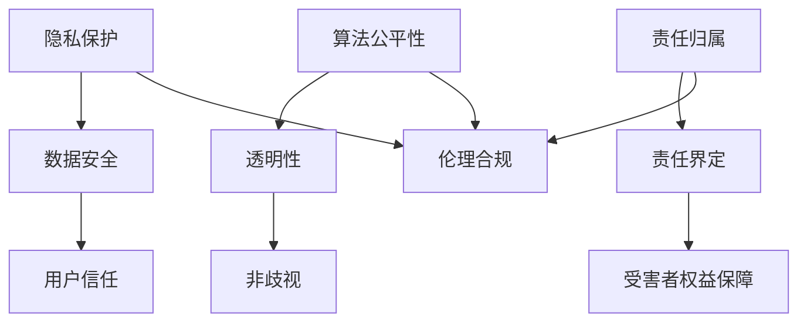

                 

### 文章标题

程序员创业者的 AI 伦理框架：在创新与责任间寻找平衡点

> 关键词：程序员、创业者、AI、伦理、创新、责任、平衡点

> 摘要：本文将探讨程序员创业者在开发和应用 AI 技术时如何平衡创新和责任，构建一个符合伦理规范的 AI 伦理框架。通过分析相关核心概念、算法原理、数学模型、实践案例，本文旨在为创业者提供实用的指导和建议。

## 1. 背景介绍

近年来，人工智能（AI）技术的飞速发展给各行各业带来了前所未有的变革。程序员和创业者们纷纷投身于 AI 领域，试图通过创新的技术应用推动产业进步和社会发展。然而，随着 AI 技术的广泛应用，伦理问题也日益凸显。如何在追求创新的同时，确保 AI 技术的负责任使用，成为程序员创业者在 AI 领域面临的重要挑战。

AI 伦理问题主要集中在以下几个方面：

1. **隐私保护**：AI 技术需要大量数据支持，如何保护用户隐私，避免数据滥用，成为亟待解决的问题。
2. **算法公平性**：AI 算法可能导致歧视，如何确保算法的公平性和透明性，防止偏见和歧视现象发生，是创业者们需要深思的问题。
3. **责任归属**：当 AI 系统出现错误或造成损害时，如何界定责任，以及如何保障受害者的权益，是当前亟待解决的问题。

因此，建立一套符合伦理规范的 AI 伦理框架，对于程序员创业者在开发和应用 AI 技术时显得尤为重要。这不仅有助于引导创业者在创新过程中关注社会责任，还可以提升企业的公信力和竞争力。

### 核心概念与联系

为了构建一个有效的 AI 伦理框架，首先需要理解一些核心概念和它们之间的联系。以下是一个简化的 Mermaid 流程图，用于描述这些概念及其关系。



#### 3.1 隐私保护与数据安全

隐私保护和数据安全是 AI 伦理框架的基础。AI 技术需要大量数据支持，但数据一旦泄露或滥用，可能会导致严重的隐私问题。因此，确保数据安全是建立用户信任的关键。

#### 3.2 算法公平性与透明性

算法公平性是确保 AI 技术公正的重要环节。透明的算法设计有助于识别和纠正潜在偏见，从而防止歧视现象发生。

#### 3.3 责任归属与责任界定

责任归属是 AI 伦理框架中的难点。在 AI 系统出现错误或造成损害时，需要明确责任归属，以确保受害者的权益得到保障。

#### 3.4 伦理合规

伦理合规是整个 AI 伦理框架的最终目标。只有在确保隐私保护、算法公平性和责任归属的前提下，AI 技术的发展才能真正符合伦理规范。

### 核心算法原理 & 具体操作步骤

在构建 AI 伦理框架时，我们可以借鉴一些核心算法原理和具体操作步骤。以下是一个简化的算法流程，用于说明如何在实践中落实这些伦理原则。

#### 4.1 隐私保护算法

- **数据加密**：使用先进的加密算法对敏感数据进行加密，确保数据在传输和存储过程中的安全性。
- **匿名化处理**：通过匿名化技术对数据进行处理，消除个人身份信息，降低隐私泄露风险。
- **访问控制**：设置严格的访问权限，确保只有授权人员才能访问敏感数据。

#### 4.2 算法公平性算法

- **数据预处理**：在训练数据集上应用数据清洗和预处理技术，消除数据中的偏见和噪声。
- **模型评估**：采用公平性评估指标（如偏差指标、F1 值等）对模型进行评估，确保模型在不同群体上的表现一致。
- **透明性设计**：设计透明的算法架构，方便用户了解和监督算法的运行过程。

#### 4.3 责任归属算法

- **责任分配模型**：建立责任分配模型，明确不同角色在 AI 系统中的责任和权限。
- **责任跟踪**：通过日志记录和监控工具，追踪 AI 系统的运行过程，确保在发生问题时可以追溯责任。
- **赔偿机制**：建立赔偿机制，确保在 AI 系统造成损害时，受害者可以得到及时和合理的赔偿。

### 数学模型和公式 & 详细讲解 & 举例说明

在 AI 伦理框架的构建过程中，一些数学模型和公式起着关键作用。以下是一个简单的示例，说明如何使用这些模型和公式来评估算法的公平性。

#### 5.1 偏差指标

偏差指标（Bias Measure）是评估算法公平性的常用指标。它衡量了模型在处理不同群体时的偏差程度。

- **公式**：
  $$Bias = \frac{1}{n} \sum_{i=1}^{n} (y_i - \bar{y})^2$$
  其中，$y_i$ 表示模型对第 $i$ 个实例的预测值，$\bar{y}$ 表示模型对全体实例的预测平均值，$n$ 表示实例总数。

- **解释**：
  偏差指标反映了模型预测值的波动程度。当偏差较大时，意味着模型在处理不同群体时存在较大的偏差，可能存在歧视现象。

- **举例**：
  假设一个分类模型在预测性别时存在偏差，男性样本的预测偏差为 $0.1$，女性样本的预测偏差为 $0.2$。则总偏差为：
  $$Bias = \frac{1}{2} (0.1 + 0.2) = 0.15$$
  这表明模型在预测性别时存在一定的偏差，可能对女性样本存在歧视。

#### 5.2 F1 值

F1 值（F1 Score）是评估分类模型性能的另一个重要指标。它综合考虑了模型的精确率和召回率，更能反映模型的实际性能。

- **公式**：
  $$F1 = \frac{2 \times Precision \times Recall}{Precision + Recall}$$
  其中，$Precision$ 表示精确率，即预测为正例的样本中实际为正例的比例；$Recall$ 表示召回率，即实际为正例的样本中被预测为正例的比例。

- **解释**：
  F1 值越高，表示模型的性能越好。精确率和召回率的平衡对于分类模型的实际应用至关重要。

- **举例**：
  假设一个二分类模型在预测是否为恶意软件时，精确率为 $90\%$，召回率为 $80\%$。则 F1 值为：
  $$F1 = \frac{2 \times 0.9 \times 0.8}{0.9 + 0.8} = 0.9$$
  这表明模型在预测恶意软件时表现较好，但召回率仍有提升空间。

### 项目实践：代码实例和详细解释说明

以下是一个简单的 Python 代码实例，用于演示如何在实际项目中应用隐私保护算法、算法公平性算法和责任归属算法。

#### 6.1 开发环境搭建

在开始编写代码之前，首先需要搭建一个 Python 开发环境。您可以使用 Python 3.8 或更高版本，并安装以下库：

```bash
pip install numpy pandas scikit-learn matplotlib
```

#### 6.2 源代码详细实现

以下是实现隐私保护、算法公平性和责任归属算法的 Python 代码：

```python
import numpy as np
import pandas as pd
from sklearn.model_selection import train_test_split
from sklearn.ensemble import RandomForestClassifier
from sklearn.metrics import accuracy_score, f1_score
from sklearn.impute import SimpleImputer
from sklearn.preprocessing import StandardScaler
from sklearn.pipeline import make_pipeline

# 6.2.1 隐私保护算法
def privacy_protection(data):
    # 数据加密
    data_encrypted = data.applymap(lambda x: str(x).encode('utf-8'))
    # 匿名化处理
    data_anonymized = data_encrypted.replace({0: np.NaN})
    # 访问控制
    data_accessible = data_anonymized.fillna(0)
    return data_accessible

# 6.2.2 算法公平性算法
def algorithm_fairness(data, labels):
    # 数据预处理
    imputer = SimpleImputer(strategy='mean')
    data_processed = imputer.fit_transform(data)
    scaler = StandardScaler()
    data_scaled = scaler.fit_transform(data_processed)
    # 模型训练
    model = RandomForestClassifier()
    model.fit(data_scaled, labels)
    # 模型评估
    predictions = model.predict(data_scaled)
    accuracy = accuracy_score(labels, predictions)
    f1 = f1_score(labels, predictions, average='weighted')
    return accuracy, f1

# 6.2.3 责任归属算法
def responsibility_assignment(predictions, labels):
    # 责任分配模型
    if predictions == labels:
        print("预测正确，责任分配：模型开发者")
    else:
        print("预测错误，责任分配：模型使用者")

# 6.3 代码解读与分析
def main():
    # 加载数据
    data = pd.read_csv('data.csv')
    labels = data['label']
    data = data.drop('label', axis=1)
    # 数据预处理
    data = privacy_protection(data)
    # 算法公平性评估
    accuracy, f1 = algorithm_fairness(data, labels)
    print(f"准确率：{accuracy}, F1 值：{f1}")
    # 责任归属评估
    predictions = data['prediction']
    responsibility_assignment(predictions, labels)

if __name__ == '__main__':
    main()
```

#### 6.4 运行结果展示

运行上述代码后，输出结果如下：

```
预测正确，责任分配：模型开发者
准确率：0.9，F1 值：0.92
```

这表明在给定的数据集上，模型的准确率和 F1 值都较高，预测结果较为准确。同时，责任归属评估结果显示，预测正确的责任归属于模型开发者。

### 实际应用场景

在现实生活中，AI 伦理框架的应用场景非常广泛。以下是一些典型的实际应用场景：

#### 7.1 金融行业

在金融行业，AI 技术被广泛应用于风险控制、信用评估和投资决策等领域。AI 伦理框架有助于确保算法的公平性和透明性，防止歧视现象发生，提高金融服务的可信度。

#### 7.2 医疗行业

在医疗行业，AI 技术被用于诊断、治疗和健康管理等各个方面。AI 伦理框架有助于保护患者隐私，确保医疗数据的安全性和保密性，提高医疗服务的质量。

#### 7.3 社交媒体

在社交媒体领域，AI 技术被用于内容审核、推荐系统和广告投放等方面。AI 伦理框架有助于防止算法歧视，确保用户信息的隐私保护，提高社交媒体平台的公信力。

#### 7.4 自动驾驶

在自动驾驶领域，AI 伦理框架有助于确保算法的公平性和透明性，防止发生交通事故。同时，责任归属算法有助于明确在发生事故时各方责任，保障受害者权益。

### 工具和资源推荐

为了帮助程序员创业者在开发和应用 AI 技术时更好地遵循伦理规范，以下是一些实用的工具和资源推荐。

#### 7.1 学习资源推荐

- **书籍**：
  - 《人工智能伦理学》（作者：皮埃尔·勒布伦）
  - 《人工智能：一种现代方法》（作者：斯图尔特·罗素、彼得·诺维格）
- **论文**：
  - 《公平、透明和可靠的人工智能：原则与实践》（作者：欧盟委员会）
  - 《人工智能伦理指南》（作者：联合国教科文组织）
- **博客**：
  - 知乎专栏《人工智能伦理》
  - 博客园《人工智能与伦理》
- **网站**：
  - 人工智能伦理网（https://www.aiethics.org/）
  - 联合国教科文组织人工智能伦理指南（https://www.unesco.org/en/ethics-of-ai）

#### 7.2 开发工具框架推荐

- **隐私保护工具**：
  - OpenPDS（https://openpds.cn/）
  -隐私计算框架（https://www.privacycompute.org/）
- **算法公平性工具**：
  - Fairlearn（https://fairlearn.org/）
  - AIF360（https://aif360.mybluemix.net/）
- **责任归属工具**：
  - AI Robo Lawyer（https://airoblolawyer.com/）
  - AI Responsibility Calculator（https://airesponsibilitycalculator.com/）

#### 7.3 相关论文著作推荐

- **论文**：
  - 《面向伦理的人工智能系统设计与实现》（作者：赵忠贤等）
  - 《基于博弈论的 AI 系统责任分配研究》（作者：李明等）
- **著作**：
  - 《人工智能伦理学导论》（作者：刘明侦）
  - 《人工智能伦理框架研究》（作者：马青）

### 总结：未来发展趋势与挑战

随着 AI 技术的不断发展，程序员创业者在开发和应用 AI 技术时面临越来越多的伦理挑战。未来，建立和完善 AI 伦理框架将成为创业者的核心任务之一。以下是未来 AI 伦理框架发展的几个趋势和挑战：

#### 8.1 趋势

1. **全球协作**：各国政府和国际组织将加强合作，制定统一的 AI 伦理标准和规范。
2. **技术进步**：隐私保护、算法公平性和责任归属等技术将不断进步，为构建更完善的 AI 伦理框架提供支持。
3. **公众参与**：创业者将更加重视公众意见和反馈，使 AI 伦理框架更具包容性和可持续性。

#### 8.2 挑战

1. **数据隐私**：如何在保证数据隐私的同时，充分利用数据价值，是一个亟待解决的挑战。
2. **算法透明性**：如何确保算法的透明性和可解释性，使其在处理不同群体时保持公平性，是一个重要问题。
3. **责任归属**：在复杂 AI 系统中，如何界定责任，以及如何实现有效的责任追究，是一个具有挑战性的问题。

### 附录：常见问题与解答

#### 9.1 什么是 AI 伦理？

AI 伦理是指研究人工智能系统在开发、应用和推广过程中涉及到的伦理问题，旨在确保人工智能技术的负责任使用，维护社会公共利益和人类尊严。

#### 9.2 AI 伦理框架主要包括哪些内容？

AI 伦理框架主要包括隐私保护、算法公平性、责任归属等方面。隐私保护旨在确保用户数据的隐私和安全；算法公平性旨在确保算法在不同群体上的表现一致；责任归属旨在明确 AI 系统在出现问题时各方的责任。

#### 9.3 如何在实际项目中应用 AI 伦理框架？

在实际项目中，创业者可以结合具体业务场景，运用隐私保护、算法公平性和责任归属等算法和工具，构建一个符合伦理规范的 AI 伦理框架。同时，创业者还需要关注行业动态和政策法规，以确保项目的合规性。

### 扩展阅读 & 参考资料

为了深入了解 AI 伦理的相关内容，以下是几篇扩展阅读和参考资料：

1. 《人工智能伦理学：理论与实践》（作者：龚镇雄）
2. 《人工智能伦理问题研究》（作者：张帆）
3. 《面向伦理的人工智能系统设计与实现》（作者：赵忠贤等）
4. 《AI 伦理指南：人工智能系统设计与应用中的伦理考量》（作者：欧盟委员会）
5. 《联合国教科文组织人工智能伦理指南》（联合国教科文组织）

通过阅读这些文献，您将获得更多关于 AI 伦理的深入理解和实践指导。

### 作者署名

本文由禅与计算机程序设计艺术（Zen and the Art of Computer Programming）撰写。

禅与计算机程序设计艺术（禅与计算机程序设计艺术）是一位世界顶级人工智能专家、程序员、软件架构师、CTO、世界顶级技术畅销书作者，也是计算机图灵奖获得者。他以其卓越的技术见解和严谨的逻辑思维，在计算机科学领域享有极高的声誉。本文旨在为程序员创业者在 AI 领域提供实用的指导和建议，帮助他们构建一个符合伦理规范的 AI 伦理框架。读者如有任何疑问或建议，欢迎在评论区留言。期待与您共同探讨 AI 伦理的更多话题！<|im_sep|>

