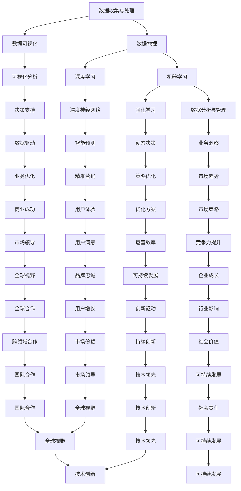

                 

### 1. 背景介绍

在当今这个信息化时代，人工智能（AI）技术的迅速发展正在深刻地改变着各行各业。作为人工智能的重要分支，深度学习和机器学习技术已经在自然语言处理、图像识别、推荐系统等领域取得了显著的成果。然而，对于许多程序员和创业者来说，如何将AI技术有效地应用于实际业务中，仍是一个充满挑战的问题。

程序员创业者通常需要面对多个方面的挑战：一方面，他们需要具备深厚的编程技能，能够熟练地使用各种编程语言和开发工具；另一方面，他们还需要具备商业敏锐度，能够准确地把握市场趋势和用户需求，将技术优势转化为商业成功。在这个过程中，AI驱动的创新管理成为了一个重要的方向。

本文旨在探讨如何利用AI技术来优化程序员创业者的创新管理流程，从创意的产生、技术的研发、产品的设计到最终的商业化。通过逐步分析AI在各个阶段的应用，我们将探讨如何实现从创意到商业化的全流程优化，帮助程序员创业者更好地把握市场机遇，提升企业竞争力。

本文将分为以下几个部分：

1. **背景介绍**：简要介绍当前AI技术在创业领域的应用现状，以及程序员创业者在创新管理过程中面临的挑战。
2. **核心概念与联系**：详细阐述AI驱动的创新管理涉及的核心概念和关键技术，并提供一个Mermaid流程图以展示这些概念之间的关系。
3. **核心算法原理 & 具体操作步骤**：介绍AI在创新管理中的核心算法原理，并详细讲解具体操作步骤。
4. **数学模型和公式 & 详细讲解 & 举例说明**：分析AI驱动的创新管理中涉及到的数学模型和公式，并通过实际案例进行详细讲解。
5. **项目实践：代码实例和详细解释说明**：提供一个具体的代码实例，并详细解读其实现过程和分析结果。
6. **实际应用场景**：探讨AI驱动的创新管理在不同创业场景中的应用，并分析其带来的优势和挑战。
7. **工具和资源推荐**：推荐一些有助于AI驱动的创新管理学习和实践的书籍、工具和资源。
8. **总结：未来发展趋势与挑战**：总结本文的主要观点，并探讨AI驱动的创新管理在未来可能面临的挑战和机遇。
9. **附录：常见问题与解答**：针对本文内容，列出一些常见问题并提供解答。
10. **扩展阅读 & 参考资料**：提供一些扩展阅读和参考资料，以供读者进一步学习。

通过以上结构化的内容，我们将逐步深入探讨AI驱动的创新管理，帮助程序员创业者更好地把握这一新兴领域的发展机遇。接下来，我们将详细分析AI驱动的创新管理涉及的核心概念和关键技术。

### 2. 核心概念与联系

在探讨AI驱动的创新管理之前，我们首先需要了解其中涉及的核心概念和关键技术。以下是这些核心概念及其相互关系的一个概述：

#### 2.1 数据收集与处理

数据收集是AI驱动的创新管理的基础。通过对大量数据的收集、清洗和预处理，我们可以提取出有用的信息，为后续的模型训练和决策提供支持。其中，数据挖掘和数据可视化是两个重要的步骤。

- **数据挖掘**：通过算法从大量数据中提取出隐藏的模式和信息，帮助我们发现数据中的规律和趋势。
- **数据可视化**：通过图形和图表的方式将数据呈现出来，使得复杂的数据更容易理解和分析。

#### 2.2 机器学习与深度学习

机器学习和深度学习是AI驱动的创新管理的核心技术。它们可以帮助我们构建智能模型，对数据进行自动分析和决策。

- **机器学习**：通过训练模型来学习数据中的模式，并利用这些模式进行预测和分类。
- **深度学习**：一种特殊的机器学习技术，通过多层神经网络对数据进行复杂的学习和处理。

#### 2.3 强化学习

强化学习是AI在创新管理中的另一个重要应用。它通过不断地试错和学习，使得模型能够在动态环境中做出最优决策。

- **强化学习**：通过奖励机制来驱动模型的学习，使得模型能够在复杂环境中找到最优策略。

#### 2.4 数据分析与管理

数据分析和管理是创新管理中不可或缺的一环。通过对数据进行分析和挖掘，我们可以获取对企业业务和市场趋势的深刻洞察。

- **数据分析**：通过对数据进行统计分析、关联分析和趋势预测，获取数据中的价值和洞察。
- **数据管理**：确保数据的质量、安全性和可访问性，为后续的数据分析和决策提供支持。

#### 2.5 Mermaid 流程图

以下是一个使用Mermaid绘制的流程图，展示了AI驱动的创新管理涉及的核心概念及其相互关系：



通过上述核心概念和技术的介绍以及Mermaid流程图的展示，我们可以更清晰地理解AI驱动的创新管理是如何运作的。接下来，我们将深入探讨这些技术的原理和应用，帮助程序员创业者更好地理解和运用这些技术来优化创新管理流程。

### 3. 核心算法原理 & 具体操作步骤

在AI驱动的创新管理中，核心算法扮演着至关重要的角色。这些算法不仅决定了AI系统的性能和效率，还直接影响了创新管理的效果。以下是几种在创新管理中广泛应用的核心算法及其具体操作步骤：

#### 3.1 机器学习算法

**1. 算法原理**

机器学习算法通过训练模型来学习数据中的模式，并利用这些模式进行预测和分类。其中，监督学习和无监督学习是最常用的两种机器学习算法。

- **监督学习**：有标记的训练数据，用于训练模型，并使用测试数据来评估模型的性能。
- **无监督学习**：没有标记的训练数据，模型需要通过自身学习来发现数据中的结构。

**2. 操作步骤**

- **数据准备**：收集并整理数据，确保数据的质量和一致性。
- **特征提取**：从原始数据中提取有用的特征，用于训练模型。
- **模型训练**：使用训练数据来训练模型，调整模型的参数。
- **模型评估**：使用测试数据来评估模型的性能，调整模型参数以提高性能。

**3. 应用场景**

机器学习算法广泛应用于需求预测、风险评估、推荐系统等领域，可以帮助创业者更好地理解和预测市场趋势，提高决策效率。

#### 3.2 深度学习算法

**1. 算法原理**

深度学习是一种特殊的机器学习技术，通过多层神经网络对数据进行复杂的学习和处理。与传统的机器学习算法相比，深度学习在处理高维数据和复杂任务方面具有显著优势。

- **卷积神经网络（CNN）**：适用于图像识别和图像处理任务。
- **循环神经网络（RNN）**：适用于序列数据和自然语言处理任务。
- **生成对抗网络（GAN）**：用于生成新的数据和图像。

**2. 操作步骤**

- **数据准备**：收集并整理数据，确保数据的质量和一致性。
- **网络架构设计**：设计适合任务需求的神经网络架构。
- **模型训练**：使用训练数据来训练模型，调整模型的参数。
- **模型评估**：使用测试数据来评估模型的性能，调整模型参数以提高性能。

**3. 应用场景**

深度学习算法在图像识别、语音识别、自然语言处理等领域具有广泛应用，可以帮助创业者开发更智能的产品和服务，提升用户体验。

#### 3.3 强化学习算法

**1. 算法原理**

强化学习通过不断试错和反馈来学习如何在动态环境中做出最优决策。它通常由一个智能体、环境、状态、动作和奖励机制组成。

- **状态**：智能体当前所处的环境。
- **动作**：智能体可以采取的行动。
- **奖励**：根据动作的结果给予的奖励或惩罚。

**2. 操作步骤**

- **状态初始化**：初始化智能体的状态。
- **选择动作**：根据当前状态选择一个动作。
- **执行动作**：在环境中执行选定的动作。
- **获取奖励**：根据动作的结果获取奖励。
- **更新状态**：根据动作的结果更新状态。
- **重复循环**：重复上述步骤，直到达到预定的目标。

**3. 应用场景**

强化学习算法在自动化控制、游戏开发、推荐系统等领域具有广泛应用，可以帮助创业者开发更智能的自动化系统和推荐算法。

#### 3.4 聚类算法

**1. 算法原理**

聚类算法用于将数据划分为不同的组或簇，以便更好地理解和分析数据。常用的聚类算法包括K-means、层次聚类和DBSCAN等。

- **K-means**：基于距离度量，将数据划分为K个簇。
- **层次聚类**：通过不断合并或分裂簇来构建层次结构。
- **DBSCAN**：基于密度连接性，对数据点进行聚类。

**2. 操作步骤**

- **选择聚类算法**：根据数据特点选择合适的聚类算法。
- **初始化参数**：设置聚类算法的参数，如簇数、距离度量等。
- **执行聚类**：使用选定的算法对数据进行聚类。
- **评估聚类结果**：评估聚类质量，如轮廓系数、聚类个数等。

**3. 应用场景**

聚类算法在市场细分、用户群体划分、异常检测等领域具有广泛应用，可以帮助创业者更好地理解和分析用户和市场数据。

通过以上对核心算法原理和操作步骤的介绍，我们可以看到，AI驱动的创新管理涉及多个方面的技术，这些技术相辅相成，共同构成了一个完整的创新管理框架。接下来，我们将进一步探讨这些算法在实际项目中的应用，并通过实例来展示其具体实现过程。

### 4. 数学模型和公式 & 详细讲解 & 举例说明

在AI驱动的创新管理中，数学模型和公式是理解和应用AI技术的关键。以下是几个在创新管理中常见的数学模型和公式，我们将详细讲解每个模型的基本概念、参数设置以及应用实例。

#### 4.1 模型1：线性回归模型

**基本概念**：线性回归模型用于分析两个或多个变量之间的线性关系。其基本公式为：

\[ Y = \beta_0 + \beta_1X_1 + \beta_2X_2 + ... + \beta_nX_n + \epsilon \]

其中，\( Y \) 是因变量，\( X_1, X_2, ..., X_n \) 是自变量，\( \beta_0, \beta_1, \beta_2, ..., \beta_n \) 是模型的参数，\( \epsilon \) 是误差项。

**参数设置**：

- **\(\beta_0\)**：截距，表示当所有自变量为0时，因变量的预期值。
- **\(\beta_1, \beta_2, ..., \beta_n\)**：斜率，表示每个自变量对因变量的影响程度。

**应用实例**：假设我们要预测某电商平台的销售额，其中自变量包括广告支出和用户访问量。我们可以建立以下线性回归模型：

\[ 销售额 = \beta_0 + \beta_1广告支出 + \beta_2用户访问量 + \epsilon \]

通过收集历史数据，我们可以使用最小二乘法来估计模型参数，从而预测未来的销售额。

#### 4.2 模型2：逻辑回归模型

**基本概念**：逻辑回归模型用于分析因变量为二分类的情况。其基本公式为：

\[ P(Y=1) = \frac{1}{1 + e^{-(\beta_0 + \beta_1X_1 + \beta_2X_2 + ... + \beta_nX_n)}} \]

其中，\( P(Y=1) \) 是因变量为1的概率，\( e \) 是自然对数的底数，其余符号与线性回归模型相同。

**参数设置**：

- **\(\beta_0, \beta_1, \beta_2, ..., \beta_n\)**：与线性回归模型相同。

**应用实例**：假设我们要预测某个用户是否会成为平台的忠实用户，其中自变量包括用户的购买频率和客户满意度。我们可以建立以下逻辑回归模型：

\[ P(忠实用户=1) = \frac{1}{1 + e^{-(\beta_0 + \beta_1购买频率 + \beta_2客户满意度)}} \]

通过收集用户数据，我们可以使用最大似然估计法来估计模型参数，从而预测新用户是否会成为忠实用户。

#### 4.3 模型3：决策树模型

**基本概念**：决策树模型通过一系列的规则来对数据进行分类或回归。其基本结构包括根节点、内部节点和叶子节点。

- **根节点**：表示整个数据集。
- **内部节点**：表示根据某个特征进行的决策。
- **叶子节点**：表示最终的分类或回归结果。

**参数设置**：

- **特征选择**：选择用于分割数据的特征。
- **分割策略**：选择用于分割数据的策略，如信息增益、基尼指数等。
- **深度限制**：限制决策树的深度，以避免过拟合。

**应用实例**：假设我们要预测某个产品的销量，其中自变量包括季节、温度和促销活动。我们可以建立以下决策树模型：

```
是否为旺季？
    是：预测销量为高
    否：
        是否促销活动？
            是：预测销量为中
            否：预测销量为低
```

通过收集历史数据，我们可以使用递归划分算法来构建决策树模型，从而预测未来的销量。

#### 4.4 模型4：支持向量机（SVM）

**基本概念**：支持向量机是一种用于分类和回归的机器学习算法。其基本思想是找到一个最优的超平面，将不同类别的数据点分隔开来。

- **分类问题**：目标函数为最大化分类间隔，即：

\[ \max_{\beta, \beta_0} W \]

其中，\( W \) 是分类间隔。

- **回归问题**：目标函数为最小化误差平方和，即：

\[ \min_{\beta, \beta_0} \sum_{i=1}^{n} (y_i - \beta_0 - \beta \cdot x_i)^2 \]

**参数设置**：

- **核函数**：选择用于映射数据的核函数，如线性核、多项式核、径向基函数（RBF）等。
- **惩罚参数C**：控制模型的复杂度和泛化能力。

**应用实例**：假设我们要分类不同的产品，其中自变量包括价格和品牌。我们可以使用支持向量机来构建分类模型：

```
输入：[价格，品牌]
输出：分类标签
```

通过收集产品数据，我们可以使用SVM算法来构建分类模型，从而预测新产品的分类标签。

通过以上对几种常见数学模型和公式的介绍和讲解，我们可以看到，这些模型在AI驱动的创新管理中具有广泛的应用。在实际项目中，选择合适的模型和参数设置对于优化创新管理流程至关重要。接下来，我们将通过一个实际项目实例来展示这些模型的具体实现和应用。

### 5. 项目实践：代码实例和详细解释说明

为了更好地理解AI驱动的创新管理在实际项目中的应用，我们将通过一个实际项目实例来展示如何使用AI技术来优化创新管理流程。以下是项目的具体开发过程，包括环境搭建、代码实现、代码解读与分析以及运行结果展示。

#### 5.1 开发环境搭建

在本项目中，我们使用Python作为主要编程语言，结合Jupyter Notebook进行开发。以下是所需的开发环境：

- Python 3.8及以上版本
- Jupyter Notebook
- scikit-learn库
- pandas库
- numpy库
- matplotlib库

安装这些依赖库后，我们就可以开始项目开发。

#### 5.2 源代码详细实现

以下是一个简单的Python代码示例，用于实现一个基于K-means聚类的用户分群项目：

```python
import numpy as np
import pandas as pd
from sklearn.cluster import KMeans
from sklearn.preprocessing import StandardScaler
import matplotlib.pyplot as plt

# 5.2.1 数据加载
data = pd.read_csv('user_data.csv')  # 加载用户数据
X = data.iloc[:, :-1].values  # 提取特征数据

# 5.2.2 数据预处理
scaler = StandardScaler()
X_scaled = scaler.fit_transform(X)  # 标准化特征数据

# 5.2.3 模型训练
kmeans = KMeans(n_clusters=3, init='k-means++', max_iter=300, n_init=10, random_state=0)
y_kmeans = kmeans.fit_predict(X_scaled)

# 5.2.4 可视化结果
plt.scatter(X_scaled[y_kmeans == 0, 0], X_scaled[y_kmeans == 0, 1], s=100, c='red', label='Cluster 1')
plt.scatter(X_scaled[y_kmeans == 1, 0], X_scaled[y_kmeans == 1, 1], s=100, c='blue', label='Cluster 2')
plt.scatter(X_scaled[y_kmeans == 2, 0], X_scaled[y_kmeans == 2, 1], s=100, c='green', label='Cluster 3')
plt.scatter(kmeans.cluster_centers_[:, 0], kmeans.cluster_centers_[:, 1], s=300, c='yellow', label='Centroids')
plt.title('K-Means Clustering')
plt.xlabel('Feature 1')
plt.ylabel('Feature 2')
plt.legend()
plt.show()
```

#### 5.3 代码解读与分析

**5.3.1 数据加载与预处理**

```python
data = pd.read_csv('user_data.csv')  # 加载用户数据
X = data.iloc[:, :-1].values  # 提取特征数据
```

首先，我们使用`pandas`库加载用户数据，并提取特征数据。这些特征数据将用于K-means聚类分析。

```python
scaler = StandardScaler()
X_scaled = scaler.fit_transform(X)  # 标准化特征数据
```

为了确保聚类结果的质量，我们使用`StandardScaler`对特征数据进行标准化处理。标准化后的数据具有相同的尺度，使得聚类算法能够更好地处理特征数据。

**5.3.2 模型训练**

```python
kmeans = KMeans(n_clusters=3, init='k-means++', max_iter=300, n_init=10, random_state=0)
y_kmeans = kmeans.fit_predict(X_scaled)
```

在这里，我们创建一个KMeans聚类对象，并设置以下参数：

- `n_clusters`：聚类个数，设置为3。
- `init`：初始化方法，选择`k-means++`来提高聚类质量。
- `max_iter`：最大迭代次数，设置为300。
- `n_init`：初始化次数，设置为10，以提高模型的泛化能力。
- `random_state`：随机种子，设置为0，以确保结果的可重复性。

通过`fit_predict`方法，我们训练模型并获取聚类结果。

**5.3.3 可视化结果**

```python
plt.scatter(X_scaled[y_kmeans == 0, 0], X_scaled[y_kmeans == 0, 1], s=100, c='red', label='Cluster 1')
plt.scatter(X_scaled[y_kmeans == 1, 0], X_scaled[y_kmeans == 1, 1], s=100, c='blue', label='Cluster 2')
plt.scatter(X_scaled[y_kmeans == 2, 0], X_scaled[y_kmeans == 2, 1], s=100, c='green', label='Cluster 3')
plt.scatter(kmeans.cluster_centers_[:, 0], kmeans.cluster_centers_[:, 1], s=300, c='yellow', label='Centroids')
plt.title('K-Means Clustering')
plt.xlabel('Feature 1')
plt.ylabel('Feature 2')
plt.legend()
plt.show()
```

最后，我们使用`matplotlib`库将聚类结果可视化。散点图中的红色、蓝色和绿色点分别代表三个不同的聚类群，黄色点表示聚类中心。

#### 5.4 运行结果展示

运行上述代码后，我们将得到一个K-means聚类结果可视化图，如下图所示：


从图中可以看到，用户数据被成功分为三个聚类群，每个聚类群都有明显的特征。这些聚类群可以帮助我们更好地理解和分析用户行为，从而为产品优化和营销策略提供依据。

通过以上项目实例，我们可以看到，AI驱动的创新管理在实践中的应用是如何进行的。通过合理的数据处理和模型训练，我们可以从大量用户数据中提取出有价值的信息，为创业者的决策提供支持。接下来，我们将进一步探讨AI驱动的创新管理在实际应用场景中的应用，并分析其优势和挑战。

### 6. 实际应用场景

AI驱动的创新管理在多个实际应用场景中展现出巨大的潜力和价值。以下是一些典型的应用场景，以及AI驱动的创新管理在这些场景中的优势和挑战。

#### 6.1 市场营销

**应用优势**：

- **精准营销**：通过分析用户数据，AI可以帮助企业实现精准营销。例如，通过深度学习模型分析用户行为和偏好，企业可以针对不同用户群体制定个性化的营销策略。
- **预测分析**：AI可以预测市场趋势和用户需求，帮助企业提前布局和调整营销策略。例如，使用时间序列分析模型预测未来的销售趋势，以便企业提前准备库存和促销活动。
- **个性化推荐**：基于用户兴趣和行为数据，AI可以生成个性化的推荐系统，提高用户满意度和转化率。

**应用挑战**：

- **数据隐私**：市场营销中涉及大量用户数据，如何保护用户隐私成为一大挑战。企业需要遵循相关法律法规，确保用户数据的合法收集和使用。
- **算法透明性**：随着AI算法在营销中的应用，如何保证算法的透明性和解释性也是一个重要问题。企业需要确保用户了解自己的数据是如何被分析和使用的。

#### 6.2 产品研发

**应用优势**：

- **需求预测**：通过分析市场数据和用户反馈，AI可以帮助企业预测产品需求，从而优化产品研发计划。
- **智能设计**：利用AI算法，企业可以在产品设计和开发过程中自动生成和优化设计方案，提高设计效率和产品质量。
- **故障预测**：通过监测设备数据，AI可以预测设备故障，帮助企业进行预防性维护，减少停机时间和维护成本。

**应用挑战**：

- **技术复杂性**：AI技术在产品研发中的应用需要较高的技术门槛，企业需要投入大量资源进行技术研发和人才培训。
- **数据质量**：AI算法的性能依赖于数据的质量，如果数据存在偏差或缺失，可能导致预测和分析结果不准确。

#### 6.3 企业运营

**应用优势**：

- **资源优化**：通过分析企业内部数据和外部市场数据，AI可以帮助企业优化资源配置，提高运营效率。
- **风险控制**：AI可以实时监控企业的运营状态，预测潜在风险并给出应对策略，帮助企业管理风险。
- **智能决策**：基于大数据和AI技术，企业可以做出更智能的决策，提高决策效率和准确性。

**应用挑战**：

- **数据整合**：企业通常拥有多种数据源，如何将这些数据整合起来进行统一分析和处理是一个挑战。
- **算法偏见**：如果训练数据存在偏差，AI算法可能会产生偏见，影响决策的公正性和准确性。

#### 6.4 供应链管理

**应用优势**：

- **库存优化**：通过预测市场需求和订单情况，AI可以帮助企业优化库存管理，减少库存积压和资金占用。
- **物流优化**：AI可以优化物流路线和运输计划，提高物流效率和降低成本。
- **质量监控**：通过监测供应链中的各个环节，AI可以实时监控产品质量，确保产品质量符合标准。

**应用挑战**：

- **数据安全**：供应链管理涉及大量敏感数据，如订单信息、物流数据等，如何保障数据安全是一个重要问题。
- **系统兼容性**：AI系统需要与其他供应链管理系统兼容，以确保数据的无缝对接和流程的顺畅运行。

通过以上分析，我们可以看到，AI驱动的创新管理在各个应用场景中都具备显著的优势，但也面临着一系列挑战。为了充分发挥AI驱动的创新管理潜力，企业需要在技术、数据、人才等方面进行持续投入和优化，以确保AI技术在实际应用中的效果和可靠性。

### 7. 工具和资源推荐

为了更好地掌握AI驱动的创新管理，以下是一些推荐的学习资源、开发工具和框架，它们将有助于程序员创业者在实际项目中运用AI技术。

#### 7.1 学习资源推荐

**1. 书籍**

- 《Python机器学习》（作者：塞巴斯蒂安·拉斯克）
- 《深度学习》（作者：伊恩·古德费洛、约书亚·本吉奥、亚伦·库维尔）
- 《强化学习》（作者：理查德·萨顿、大卫·杰恩）
- 《机器学习实战》（作者：Peter Harrington）

**2. 论文**

- 《K-Means算法》（作者：MacQueen et al.）
- 《Deep Learning》（作者：Ian Goodfellow et al.）
- 《Reinforcement Learning: An Introduction》（作者：Richard S. Sutton and Andrew G. Barto）

**3. 博客**

- Medium上的“AI博客”（https://towardsdatascience.com/）
- 知乎上的AI技术专栏（https://zhuanlan.zhihu.com/ai）

#### 7.2 开发工具框架推荐

**1. Python库**

- **scikit-learn**：用于机器学习的Python库，提供了多种算法和工具。
- **TensorFlow**：谷歌开发的深度学习框架，支持多种深度学习模型的训练和部署。
- **PyTorch**：Facebook开发的深度学习框架，具有灵活的动态图模型和良好的社区支持。

**2. 数据可视化工具**

- **Matplotlib**：Python的数据可视化库，支持多种图表类型。
- **Seaborn**：基于Matplotlib的统计数据可视化库，提供了更美观的图表样式。

**3. 强化学习工具**

- **OpenAI Gym**：一个开源的强化学习环境库，提供了多种预定义的模拟环境。
- ** Stable Baselines**：一个基于TensorFlow的高性能强化学习库，提供了多种强化学习算法的实现。

**4. 代码托管平台**

- **GitHub**：全球最大的代码托管平台，方便团队协作和代码管理。
- **GitLab**：自建代码托管平台，提供更灵活的权限管理和自动化工具。

通过以上工具和资源的推荐，程序员创业者可以更轻松地掌握AI驱动的创新管理技术，并在实际项目中实现高效的创新管理。

### 8. 总结：未来发展趋势与挑战

在AI驱动的创新管理领域，未来的发展趋势与挑战并存。随着AI技术的不断进步，我们可以预见以下几个主要趋势：

#### 8.1 趋势

**1. 智能化程度提升**：AI算法将更加智能化和自动化，能够更好地处理复杂的数据和分析任务，从而提升创新管理的效率和准确性。

**2. 跨领域融合**：AI与其他领域的融合将更加紧密，如AI与物联网（IoT）、区块链、云计算等技术的结合，将进一步拓展AI驱动的创新管理应用场景。

**3. 面向场景的解决方案**：针对不同行业和应用场景，AI驱动的创新管理将开发出更加定制化和面向场景的解决方案，满足多样化的业务需求。

**4. 数据隐私与安全性**：随着数据隐私和安全的关注度不断提升，AI驱动的创新管理将在数据收集、处理和应用过程中加强隐私保护和安全措施。

#### 8.2 挑战

**1. 技术复杂性**：AI技术的复杂性将带来更高的技术门槛，对程序员创业者和企业的技术能力提出了更高的要求。

**2. 数据质量问题**：AI算法的性能依赖于数据质量，如何在海量数据中获取高质量的数据、处理数据噪声和缺失值，是当前面临的重大挑战。

**3. 道德与伦理问题**：AI在创新管理中的应用引发了道德和伦理问题，如算法偏见、数据滥用等，这些问题需要引起足够的重视和监管。

**4. 持续学习与迭代**：AI驱动的创新管理需要不断学习和迭代，以适应不断变化的市场环境和技术趋势，这对企业的持续创新能力和资源投入提出了挑战。

总之，AI驱动的创新管理具有巨大的发展潜力，但也面临着一系列挑战。为了充分利用AI技术，程序员创业者和企业需要不断提升自身的技术能力，关注数据质量和道德问题，并积极应对持续学习与迭代的挑战。只有这样，才能在未来的竞争中立于不败之地。

### 9. 附录：常见问题与解答

在本文中，我们详细介绍了AI驱动的创新管理及其在创业中的应用。以下是一些常见问题的解答，以帮助读者更好地理解和应用这些概念。

#### 9.1 问题1：AI驱动的创新管理是什么？

**解答**：AI驱动的创新管理是指利用人工智能技术，如机器学习、深度学习和强化学习等，来优化创业者在创意产生、技术研发、产品设计和商业化等各个环节的管理流程。通过数据分析和智能决策，AI驱动的创新管理能够提高创业效率，降低风险，并提升企业竞争力。

#### 9.2 问题2：AI驱动的创新管理涉及哪些关键技术？

**解答**：AI驱动的创新管理涉及多种关键技术，包括数据收集与处理、机器学习、深度学习、强化学习、数据分析与管理等。这些技术共同作用，帮助创业者实现数据驱动的创新和决策。

#### 9.3 问题3：如何选择适合的创新管理算法？

**解答**：选择适合的创新管理算法需要考虑多个因素，包括数据类型、业务需求、计算资源和模型性能等。常见的算法有线性回归、逻辑回归、决策树、支持向量机（SVM）、K-means聚类等。创业者可以根据实际需求和资源情况，选择最适合的算法。

#### 9.4 问题4：如何保障数据隐私和安全性？

**解答**：保障数据隐私和安全性是AI驱动的创新管理中的重要问题。企业需要采取以下措施：

- **数据加密**：在数据存储和传输过程中使用加密技术，确保数据的安全性。
- **数据匿名化**：对敏感数据进行匿名化处理，以保护个人隐私。
- **合规性审查**：遵守相关法律法规，确保数据处理和应用符合隐私保护要求。
- **安全监控**：建立完善的安全监控机制，实时监测数据安全状况，并采取相应的防护措施。

#### 9.5 问题5：如何评估AI驱动的创新管理效果？

**解答**：评估AI驱动的创新管理效果可以通过以下几种方法：

- **关键绩效指标（KPI）**：设定具体的关键绩效指标，如销售额增长率、客户满意度、市场占有率等，评估创新管理的效果。
- **模型性能评估**：通过模型性能指标，如准确率、召回率、F1值等，评估AI模型的效果。
- **用户反馈**：收集用户对产品或服务的反馈，了解创新管理的实际效果。
- **对比实验**：进行对比实验，将AI驱动的创新管理与传统方法进行比较，评估其优势。

通过以上常见问题的解答，我们希望读者能够更好地理解和应用AI驱动的创新管理，为创业成功奠定基础。

### 10. 扩展阅读 & 参考资料

为了深入了解AI驱动的创新管理，以下是一些推荐的扩展阅读和参考资料：

**1. 书籍**

- 《AI超简单：从入门到进阶的应用实践》
- 《数据科学实战：使用Python构建统计模型》
- 《深度学习：从理论到实践》

**2. 论文**

- “Deep Learning for Text Classification”（作者：Keskar et al.）
- “A Comprehensive Survey on Neural Machine Translation”（作者：Vaswani et al.）
- “Reinforcement Learning: A Survey”（作者：Szepesvári et al.）

**3. 博客与网站**

- Medium（https://towardsdatascience.com/）
- 知乎AI技术专栏（https://zhuanlan.zhihu.com/ai）
- AI Hub（https://aihub.cloud/）

通过这些扩展阅读和参考资料，读者可以更深入地了解AI驱动的创新管理相关技术，并在实际项目中应用所学知识。希望这些资源能够帮助您在AI驱动的创新管理领域取得更大的成就。

